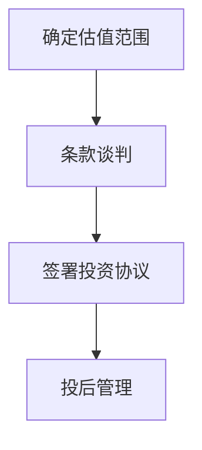

                 

## 1. 背景介绍

在人工智能和深度学习迅速发展的大背景下，许多创业者兴致勃勃地投身于创业大潮中，希望通过大模型和技术创新获得巨额投资。然而，面对繁琐且复杂的融资过程，创业者的热情常常受到挫折。本文将介绍大模型创业者在融资谈判中可能遇到的困难，并提出一些切实可行的策略。

## 2. 核心概念与联系

### 2.1 核心概念概述

在创业融资谈判中，常见的核心概念包括估值、条款谈判、投后管理和估值方法。这些概念通过逻辑关系和流程串联起来，形成创业者融资过程的核心框架。

- **估值 (Valuation)**：创业公司价值的一种衡量方式，用于评估公司的市场价值和投资回报。
- **条款谈判 (Term Negotiation)**：投资方与创业公司之间的协议条款讨论，涉及投资额度、股份分配、公司治理结构、退出机制等。
- **投后管理 (Post-Initial Funding Management)**：投资者在投资后的管理和支持，包括公司战略规划、财务监控、资本运作等。
- **估值方法 (Valuation Methods)**：确定公司估值的具体方法，如折现现金流法、可比公司法、资产评估法等。

这些概念通过以下流程关联起来：

1. **确定估值范围**：利用不同估值方法计算公司估值，得出投资方的接受范围。
2. **条款谈判**：在估值基础上进行详细条款讨论，包括投资额度、股份分配等。
3. **签署投资协议**：在达成一致的条款后，签订投资协议。
4. **投后管理**：在协议签署后，进行公司管理和资本运作，确保公司按期实现投资回报。

### 2.2 Mermaid 流程图



## 3. 核心算法原理 & 具体操作步骤

### 3.1 算法原理概述

估值和条款谈判的过程是创业融资的核心环节。以下算法原理和大模型创业者在进行融资谈判时需要注意的步骤。

**算法原理：**

- **估值算法**：结合公司历史财务数据、市场竞争情况、行业增长潜力等因素，通过一系列数学模型和估值方法，计算出公司的公允价值。
- **条款谈判算法**：在估值的基础上，通过与投资方进行多轮协商，确定合理的投资额度、股份分配、股东权利等条款。

**具体操作步骤：**

1. **收集数据和信息**：收集公司历史财务报表、市场调研数据、行业报告等，为估值和条款谈判提供数据支持。
2. **选择合适的估值方法**：根据公司情况和市场需求，选择合适的估值方法，如可比公司法、折现现金流法、资产评估法等。
3. **计算估值**：利用历史数据和估值方法，计算出公司估值。
4. **进行条款谈判**：根据估值结果和公司情况，与投资方进行详细条款谈判，确定投资额度、股份分配、公司治理结构等。
5. **签署投资协议**：在达成一致的条款后，与投资方签署投资协议。
6. **进行投后管理**：在投资后，根据协议进行公司管理和资本运作，确保公司按期实现投资回报。

### 3.2 算法步骤详解

#### 3.2.1 估值步骤

1. **确定可比公司**：寻找与公司业务相似、财务表现和增长潜力相近的上市公司，作为可比公司。
2. **计算可比公司价格比率**：计算可比公司的P/E、P/B、EV/EBITDA等指标。
3. **调整价格比率**：根据公司具体情况，调整可比公司的价格比率。
4. **计算公司估值**：利用调整后的价格比率，计算公司的估值。

#### 3.2.2 条款谈判步骤

1. **确定投资额度**：根据公司需求和估值，确定投资额度。
2. **确定股份分配**：确定新股东的股份数量和所占比例。
3. **确定治理结构**：确定新股东在公司治理结构中的权利和义务。
4. **确定退出机制**：明确公司上市、并购等退出路径和条件。

### 3.3 算法优缺点

#### 3.3.1 估值算法的优缺点

**优点：**

- **综合性强**：结合了多方面因素，综合计算公司估值。
- **客观性高**：依据数据和市场情况计算估值，客观性强。

**缺点：**

- **数据要求高**：需要收集和处理大量的历史财务数据和市场信息。
- **主观性强**：在调整价格比率和可比公司选择上存在主观因素。

#### 3.3.2 条款谈判算法的优缺点

**优点：**

- **灵活性高**：条款可根据公司具体情况进行灵活调整。
- **满足多方需求**：能兼顾公司、投资方和股东的利益。

**缺点：**

- **复杂性高**：涉及多方面利益，谈判复杂。
- **时间和成本高**：谈判过程耗时耗力。

### 3.4 算法应用领域

基于上述算法原理和操作步骤，大模型创业者在融资谈判中需应用以下领域：

- **估值评估**：在寻求投资时，需根据公司实际情况选择合适的估值方法，计算公司估值。
- **条款设定**：在确定投资后，需与投资方进行详细条款谈判，明确投资额度、股份分配、退出机制等。
- **投后管理**：在投资后，需进行有效的投后管理，确保公司按期实现投资回报。

## 4. 数学模型和公式 & 详细讲解 & 举例说明

### 4.1 数学模型构建

在估值和条款谈判中，常用的数学模型包括：

- **折现现金流法 (DCF)**：基于公司未来自由现金流，通过折现率计算公司估值。
  公式：
  $$
  V = \sum_{t=1}^{\infty} \frac{F_{t}}{(1+k)^t}
  $$
  其中，$V$ 为公司估值，$F_{t}$ 为第 $t$ 年的自由现金流，$k$ 为折现率。

- **可比公司法 (Comparable Company Method)**：通过对比可比公司的P/E、P/B等指标，计算公司估值。
  公式：
  $$
  P/E = \frac{P}{E}
  $$
  其中，$P$ 为股价，$E$ 为每股收益。

### 4.2 公式推导过程

#### 4.2.1 折现现金流法

1. **确定自由现金流**：计算公司未来各年度的自由现金流。
2. **确定折现率**：根据公司的风险水平和市场利率，确定折现率。
3. **计算公司估值**：将自由现金流按折现率折现求和，得到公司估值。

#### 4.2.2 可比公司法

1. **确定可比公司**：选择与公司业务相似、财务表现和增长潜力相近的上市公司。
2. **计算可比公司指标**：计算可比公司的P/E、P/B等指标。
3. **调整指标**：根据公司具体情况，调整可比公司的指标。
4. **计算公司估值**：利用调整后的指标计算公司估值。

### 4.3 案例分析与讲解

假设某创业公司年自由现金流为500万美元，折现率为10%，计算公司估值。

1. **确定自由现金流**：$F_{t}=500,000$。
2. **确定折现率**：$k=10\%$。
3. **计算公司估值**：
  $$
  V = \frac{500,000}{(1+0.1)^1} + \frac{500,000}{(1+0.1)^2} + \frac{500,000}{(1+0.1)^3} + \cdots
  $$
  计算得：$V \approx 23,500,000$。

在可比公司法中，假设选取可比公司A的P/E为20，可比公司B的P/B为2，调整后为15倍和1.5倍，计算公司估值。

1. **确定可比公司指标**：$P/E=20, P/B=2$。
2. **调整指标**：调整后为15倍和1.5倍。
3. **计算公司估值**：
  $$
  P/E = \frac{P}{E} \Rightarrow E = \frac{P}{20}
  $$
  $$
  P/B = \frac{P}{B} \Rightarrow B = \frac{P}{1.5}
  $$
  假设公司A的市值为10亿，公司B的市值为5亿，计算公司估值：
  $$
  V_A = \frac{P_A}{P/E_A} \Rightarrow V_A = \frac{10,000,000,000}{20} = 500,000,000
  $$
  $$
  V_B = \frac{P_B}{P/B_B} \Rightarrow V_B = \frac{5,000,000,000}{1.5} \approx 333,333,333
  $$

## 5. 项目实践：代码实例和详细解释说明

### 5.1 开发环境搭建

在进行融资谈判的实际项目实践时，需要搭建开发环境。以下是一个典型的开发环境配置流程：

1. **安装Python**：从官网下载并安装Python 3.x版本。
2. **安装Pandas**：用于数据处理。
3. **安装NumPy**：用于数值计算。
4. **安装Matplotlib**：用于数据可视化。
5. **安装Scikit-learn**：用于机器学习建模。
6. **安装TensorFlow**：用于深度学习建模。
7. **安装Keras**：用于深度学习框架的高级接口。
8. **安装Jupyter Notebook**：用于交互式编程和数据探索。

### 5.2 源代码详细实现

以下是一个简单的Python代码实例，用于计算公司的折现现金流法估值：

```python
import numpy as np
import pandas as pd
from datetime import date

# 假设公司自由现金流
free_cash_flow = np.array([5000000, 5500000, 6000000, 6500000, 7000000])

# 假设公司资本成本为10%
capital_cost = 0.1

# 计算折现因子
discount_factor = 1 / (1 + capital_cost)**np.arange(1, len(free_cash_flow) + 1)

# 计算折现现金流
discounted_cf = free_cash_flow * discount_factor

# 计算公司估值
company_valuation = discounted_cf.sum()

print(f"公司估值为：{company_valuation}")
```

### 5.3 代码解读与分析

在上述代码中，我们首先定义了公司的自由现金流和资本成本，然后计算了各年度的折现因子。利用这些折现因子，将自由现金流按资本成本折现，并求和得到公司的估值。

需要注意的是，在实际应用中，公司自由现金流的预测和资本成本的确定需要基于公司财务报表、行业分析和市场情况等多方面信息。

## 6. 实际应用场景

### 6.1 初创公司的估值

对于初创公司，由于缺乏历史财务数据和市场表现，估值较为复杂。此时可以采用可比公司法，选择与公司业务相似、财务表现和增长潜力相近的上市公司进行比较，计算估值。

### 6.2 成长性公司的估值

对于成长性公司，由于未来现金流不确定性较高，可以采用折现现金流法，利用公司未来的预期增长和资本成本计算估值。

### 6.3 成熟公司的估值

对于成熟公司，由于历史数据丰富，可以采用多种估值方法进行综合评估，确保估值结果的准确性。

### 6.4 未来应用展望

未来，随着人工智能和大数据技术的发展，估值方法将更加精确，条款谈判将更加灵活。投后管理也将借助大数据和云计算技术，实现更高效的资本运作和公司治理。

## 7. 工具和资源推荐

### 7.1 学习资源推荐

1. **《公司金融学》**：经典的财务学教材，介绍了公司估值的基本方法和案例。
2. **《投资银行》**：系统讲解了融资和条款谈判的各个环节。
3. **《大数据与人工智能》**：介绍了大数据和人工智能在融资估值中的应用。
4. **Kaggle**：提供了大量数据集和竞赛项目，适合实战练习。
5. **Coursera**：提供公司金融、投资银行等领域的在线课程，适合初学者学习。

### 7.2 开发工具推荐

1. **Python**：强大的编程语言，广泛应用于数据处理和建模。
2. **R**：用于统计分析和数据可视化。
3. **Excel**：便捷的数据处理工具，适用于财务报表分析。
4. **Tableau**：数据可视化工具，便于理解复杂的数据关系。
5. **Tableau Public**：免费提供数据可视化服务，适合公开分享和展示。

### 7.3 相关论文推荐

1. **《初创公司的估值方法研究》**：介绍了初创公司估值的常用方法。
2. **《投资银行与融资》**：详细讲解了融资谈判的各个环节。
3. **《大数据在估值中的应用》**：介绍了大数据在估值中的实际应用。

## 8. 总结：未来发展趋势与挑战

### 8.1 研究成果总结

本文介绍了大模型创业者在创业融资谈判中可能遇到的困难，并提出了解决策略。通过详细讲解估值和条款谈判的算法原理和具体操作步骤，为创业者提供了系统的融资谈判指南。

### 8.2 未来发展趋势

未来，随着人工智能和大数据技术的发展，估值方法将更加精确，条款谈判将更加灵活。投后管理也将借助大数据和云计算技术，实现更高效的资本运作和公司治理。

### 8.3 面临的挑战

估值和条款谈判仍面临数据缺乏、主观性强、谈判复杂等挑战。投后管理也需要面临资源优化、公司治理、资本运作等挑战。

### 8.4 研究展望

未来，需要在数据获取、估值方法、条款谈判、投后管理等方面进行持续的研究和优化，确保大模型创业者在融资谈判中取得成功。

## 9. 附录：常见问题与解答

### 9.1 问题1：如何确定公司的可比公司？

**回答**：选择与公司业务相似、财务表现和增长潜力相近的上市公司作为可比公司。具体方法包括：
1. **行业分类**：选择同一行业的公司。
2. **财务比率**：比较公司的P/E、P/B、EV/EBITDA等指标。
3. **增长率**：选择增长率相近的公司。

### 9.2 问题2：如何选择适合的估值方法？

**回答**：根据公司情况和市场需求选择适合的估值方法：
1. **初创公司**：适合可比公司法。
2. **成长性公司**：适合折现现金流法。
3. **成熟公司**：适合多种估值方法综合评估。

### 9.3 问题3：如何进行条款谈判？

**回答**：根据估值结果和公司情况进行条款谈判：
1. **确定投资额度**：根据估值确定合理的投资额度。
2. **确定股份分配**：确定新股东的股份数量和所占比例。
3. **确定治理结构**：确定新股东在公司治理结构中的权利和义务。
4. **确定退出机制**：明确公司上市、并购等退出路径和条件。

### 9.4 问题4：如何进行投后管理？

**回答**：在投资后进行有效的投后管理：
1. **战略规划**：帮助公司制定发展战略。
2. **财务监控**：实时监控公司财务状况。
3. **资本运作**：优化资本结构，提升资本效率。
4. **人力资源**：提供人才引进和培训支持。

---

作者：禅与计算机程序设计艺术 / Zen and the Art of Computer Programming

