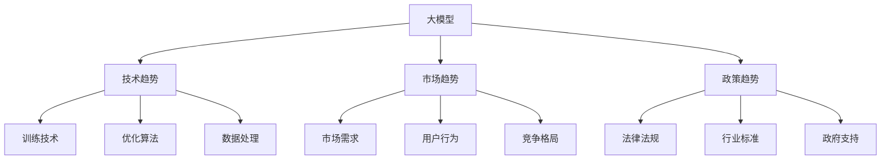

                 

## 1. 背景介绍

### 1.1 问题由来

伴随着深度学习技术的突飞猛进，大模型（如GPT、BERT等）在各行各业得到了广泛的应用。它们不仅在图像、语音、自然语言处理（NLP）等领域展现出强大的能力，还为创业者提供了新的机遇与挑战。大模型技术的成熟与普及，带来了新的商业应用模式和技术创新机会。本文将探讨大模型时代的创业趋势，特别是技术趋势、市场趋势和政策趋势。

### 1.2 问题核心关键点

大模型技术不仅在技术层面推动了人工智能的进步，还对商业应用、社会影响和政策制定产生了深远的影响。创业者需要从多个维度进行研判，把握大模型时代的创业机遇，避免技术陷阱，适应政策变化，探索全新的商业模式和应用场景。

## 2. 核心概念与联系

### 2.1 核心概念概述

为大模型时代的创业趋势研究，需要了解以下核心概念：

- 大模型（Large Models）：指的是如GPT-3、BERT等具有上亿参数的深度学习模型，通过大规模数据训练得到。
- 创业趋势（Entrepreneurial Trends）：指的是创业者在技术革新、市场变化、政策导向等方面的动向。
- 技术趋势（Technological Trends）：包括模型训练技术、优化算法、数据处理等技术演进。
- 市场趋势（Market Trends）：包括市场需求、用户行为、竞争格局等市场动态。
- 政策趋势（Policy Trends）：包括法律法规、行业标准、政府支持等政策导向。

这些核心概念之间的逻辑关系可以通过以下Mermaid流程图来展示：



这个流程图展示了大模型时代创业趋势的核心概念及其之间的相互关系。

## 3. 核心算法原理 & 具体操作步骤
### 3.1 算法原理概述

大模型创业趋势的研判，需要了解其背后的核心算法原理：

- 大模型的训练过程依赖于大规模无标签数据进行自监督学习，形成通用知识表示。
- 在大模型基础上，通过微调（Fine-tuning）和提示学习（Prompt Learning）等技术，应用于特定任务，提高模型性能。
- 技术趋势包括模型压缩（Model Compression）、参数高效微调（Parameter-Efficient Fine-Tuning, PEFT）、对抗训练（Adversarial Training）等。

### 3.2 算法步骤详解

大模型创业趋势的研判可以分为以下步骤：

**Step 1: 技术趋势分析**
- 分析当前热门的大模型技术，包括Transformer、BERT、GPT等，并关注其演进趋势。
- 识别新兴技术，如自监督学习（Self-Supervised Learning）、增量学习（Incremental Learning）、零样本学习（Zero-shot Learning）等。
- 跟踪模型压缩、参数高效微调等技术的最新进展。

**Step 2: 市场趋势分析**
- 调研市场需求，分析用户对大模型的应用场景和需求。
- 识别行业发展趋势，如智能客服、金融、医疗等领域的AI应用。
- 观察用户行为变化，例如对AI应用的态度、使用频率等。

**Step 3: 政策趋势分析**
- 跟踪相关法律法规，如数据隐私保护、人工智能伦理等政策导向。
- 分析行业标准和政府支持，如AI发展战略、创新基金等政策导向。
- 关注国内外政策变化对大模型技术商业化应用的影响。

### 3.3 算法优缺点

大模型技术具有以下优点：
- 能力强大：通过大规模数据训练，大模型在复杂任务上表现优异。
- 泛化能力强：大模型能够进行跨领域迁移，应用场景广泛。
- 数据效率高：可以在相对少的数据上取得不错的性能。

但大模型也存在以下缺点：
- 资源消耗大：训练和推理需要大量计算资源和存储空间。
- 可解释性差：大模型的黑盒特性，难以解释决策过程。
- 依赖高质量数据：性能受数据质量和多样性的影响较大。

### 3.4 算法应用领域

大模型技术在以下几个领域有广泛应用：

- **智能客服**：利用大模型进行智能对话，提升客服效率和用户体验。
- **金融风控**：利用大模型进行信用评估、欺诈检测等金融应用。
- **医疗健康**：利用大模型进行疾病诊断、健康管理等医疗应用。
- **教育**：利用大模型进行个性化教学、智能辅导等教育应用。

## 4. 数学模型和公式 & 详细讲解 & 举例说明
### 4.1 数学模型构建

大模型技术基于深度学习框架，如PyTorch、TensorFlow等。数学模型构建包括以下几个步骤：

1. **数据准备**：收集大规模无标签数据，进行预处理和分批处理。
2. **模型定义**：定义大模型结构，如Transformer、BERT等。
3. **损失函数定义**：选择合适的损失函数，如交叉熵损失、均方误差损失等。
4. **优化器定义**：选择优化器，如AdamW、SGD等，并设置超参数。

### 4.2 公式推导过程

以BERT模型为例，其目标函数为：

$$
\min_{\theta} \frac{1}{N} \sum_{i=1}^N (y_i - \sigma(W^\top x_i + b))
$$

其中，$x_i$为输入特征，$y_i$为真实标签，$\sigma$为激活函数，$W$和$b$为模型参数。

### 4.3 案例分析与讲解

以BERT模型为例，其架构包括Transformer编码器、池化层和线性分类器。通过在大规模无标签数据上进行预训练，形成强大的语言表示能力。在微调过程中，可以添加特定任务适配层，如分类任务中的Softmax层，进行少样本学习和零样本学习。

## 5. 项目实践：代码实例和详细解释说明
### 5.1 开发环境搭建

1. **环境准备**：安装Python、PyTorch、TensorFlow等深度学习框架。
2. **数据准备**：收集大规模无标签数据，并进行预处理和分批处理。
3. **模型构建**：定义大模型结构，如BERT、Transformer等。
4. **训练和评估**：进行模型训练，并在测试集上评估性能。

### 5.2 源代码详细实现

以下是一个使用PyTorch进行BERT模型微调的代码实现：

```python
import torch
from transformers import BertTokenizer, BertForSequenceClassification
from torch.utils.data import DataLoader, Dataset
from sklearn.metrics import accuracy_score

# 定义数据集
class MyDataset(Dataset):
    def __init__(self, data, labels, tokenizer):
        self.data = data
        self.labels = labels
        self.tokenizer = tokenizer
        
    def __len__(self):
        return len(self.data)
    
    def __getitem__(self, idx):
        text = self.data[idx]
        tokens = self.tokenizer.encode_plus(text, max_length=512, truncation=True, padding='max_length', return_tensors='pt')
        return {'input_ids': tokens['input_ids'].flatten(), 'attention_mask': tokens['attention_mask'].flatten(), 'labels': torch.tensor(self.labels[idx], dtype=torch.long)}

# 加载数据集
train_data, test_data, train_labels, test_labels = ...
tokenizer = BertTokenizer.from_pretrained('bert-base-uncased')
train_dataset = MyDataset(train_data, train_labels, tokenizer)
test_dataset = MyDataset(test_data, test_labels, tokenizer)

# 定义模型
model = BertForSequenceClassification.from_pretrained('bert-base-uncased', num_labels=num_labels)

# 定义优化器和损失函数
optimizer = AdamW(model.parameters(), lr=2e-5)
loss_fn = torch.nn.CrossEntropyLoss()

# 训练和评估
device = torch.device('cuda' if torch.cuda.is_available() else 'cpu')
model.to(device)

for epoch in range(num_epochs):
    model.train()
    for data in DataLoader(train_dataset, batch_size=batch_size):
        input_ids = data['input_ids'].to(device)
        attention_mask = data['attention_mask'].to(device)
        labels = data['labels'].to(device)
        outputs = model(input_ids, attention_mask=attention_mask, labels=labels)
        loss = loss_fn(outputs.logits, labels)
        loss.backward()
        optimizer.step()
        optimizer.zero_grad()
    
    model.eval()
    with torch.no_grad():
        preds = []
        labels = []
        for data in DataLoader(test_dataset, batch_size=batch_size):
            input_ids = data['input_ids'].to(device)
            attention_mask = data['attention_mask'].to(device)
            labels = data['labels'].to(device)
            outputs = model(input_ids, attention_mask=attention_mask)
            preds.append(outputs.logits.argmax(dim=1).cpu().tolist())
            labels.append(labels.cpu().tolist())
        accuracy = accuracy_score(preds, labels)
        print(f"Epoch {epoch+1}, accuracy: {accuracy:.2f}")
```

### 5.3 代码解读与分析

- **数据集定义**：通过继承`Dataset`类，自定义数据集类`MyDataset`，实现对数据的预处理和分批处理。
- **模型定义**：使用`BertForSequenceClassification`类定义BERT模型，并指定标签数。
- **优化器和损失函数**：使用`AdamW`优化器和交叉熵损失函数。
- **训练和评估**：在GPU上训练模型，并在测试集上评估性能。

## 6. 实际应用场景
### 6.1 智能客服系统

大模型技术在智能客服中的应用，可以显著提升客服效率和用户满意度。利用BERT等大模型，进行智能对话和意图识别，可以快速响应用户咨询，并提供个性化服务。

### 6.2 金融风控

在金融领域，大模型技术可以用于信用评估、欺诈检测等应用。通过微调和对抗训练，提高模型在特定领域数据的泛化能力。

### 6.3 医疗健康

利用大模型技术，可以进行疾病诊断、健康管理等医疗应用。通过微调和对抗训练，提高模型在医学数据的泛化能力。

### 6.4 教育

在教育领域，大模型技术可以用于个性化教学和智能辅导。通过微调和对抗训练，提高模型对学生学习行为的理解能力。

## 7. 工具和资源推荐
### 7.1 学习资源推荐

1. **深度学习基础**：
   - 《深度学习》by Ian Goodfellow, Yoshua Bengio, Aaron Courville
   - 《Python深度学习》by François Chollet

2. **大模型技术**：
   - 《自然语言处理综述与实践》by Shlomo Dubnov, Francesco Dalbono
   - 《Transformers: A State-of-the Art Tutorial》by Daniel Lemire

3. **市场分析**：
   - 《商业智能分析与决策》by Thomas Davenport, Robert M. Womack, Rene' Lombardi

4. **政策导向**：
   - 《人工智能伦理与法律》by Emma Hughes, Mark Coeckelbergh

### 7.2 开发工具推荐

1. **深度学习框架**：
   - PyTorch
   - TensorFlow

2. **数据处理**：
   - Pandas
   - Scikit-learn

3. **可视化工具**：
   - TensorBoard
   - Weights & Biases

4. **市场分析工具**：
   - Tableau
   - Power BI

### 7.3 相关论文推荐

1. **大模型训练**：
   - "Attention is All You Need" by Vaswani et al.
   - "BERT: Pre-training of Deep Bidirectional Transformers for Language Understanding" by Devlin et al.

2. **微调技术**：
   - "Parameter-Efficient Transfer Learning for NLP" by Hiramatsu et al.
   - "AdaLoRA: Adaptive Low-Rank Adaptation for Parameter-Efficient Fine-Tuning" by Li et al.

3. **市场趋势分析**：
   - "Understanding the Dynamics of Digital Platform Monopoly and Regulation" by Andrade et al.

4. **政策导向**：
   - "Ethics in AI: Ethical Design for an Era of Artificial Intelligence" by John programming

## 8. 总结：未来发展趋势与挑战
### 8.1 总结

本文对大模型时代的创业趋势进行了全面系统的介绍。从技术趋势、市场趋势和政策趋势三个维度，探讨了大模型技术对创业者带来的机遇与挑战。通过本文的系统梳理，可以看到，大模型技术正处于蓬勃发展阶段，各领域的创业机会层出不穷，但也面临着技术瓶颈和市场竞争等挑战。

### 8.2 未来发展趋势

展望未来，大模型技术将呈现以下几个发展趋势：

1. **技术演进**：模型压缩、参数高效微调等技术将不断进步，提高大模型的资源利用效率。
2. **市场应用**：智能客服、金融风控、医疗健康等各领域的市场应用将逐步拓展，带来新的商业机会。
3. **政策导向**：各国政府将加强对人工智能的监管，推动合规发展。

### 8.3 面临的挑战

大模型技术在快速发展的同时，也面临着诸多挑战：

1. **资源消耗大**：大模型训练和推理需要大量计算资源，难以普及。
2. **可解释性差**：大模型黑盒特性，难以解释决策过程。
3. **数据依赖**：性能受数据质量和多样性的影响较大。
4. **市场竞争**：各领域的创业公司众多，竞争激烈。

### 8.4 研究展望

未来，大模型技术的研究方向包括：

1. **模型压缩**：探索更高效的大模型压缩算法，提高资源利用效率。
2. **参数高效微调**：研究更多参数高效微调方法，减小对标注数据和计算资源的依赖。
3. **可解释性增强**：开发更可解释的大模型，增强用户信任。
4. **跨领域迁移**：探索大模型的跨领域迁移能力，提高模型泛化能力。

这些研究方向将推动大模型技术向更高效、更普适、更可解释的方向发展，为更多创业者带来新的机遇。

## 9. 附录：常见问题与解答

**Q1: 大模型技术在各个领域的应用前景如何？**

A: 大模型技术在各个领域有广泛的应用前景，包括智能客服、金融风控、医疗健康、教育等。通过微调和对抗训练，大模型可以在特定领域上取得不错的性能，帮助企业提升效率和用户体验。

**Q2: 大模型技术在应用过程中需要注意哪些问题？**

A: 大模型技术在应用过程中需要注意以下问题：
- 资源消耗大：训练和推理需要大量计算资源和存储空间，需要考虑硬件设备的成本和资源配置。
- 可解释性差：大模型黑盒特性，难以解释决策过程，需要注意模型的可解释性和透明性。
- 数据依赖：性能受数据质量和多样性的影响较大，需要高质量和多样化的数据集进行训练和微调。

**Q3: 大模型技术在政策导向方面有哪些影响？**

A: 大模型技术在政策导向方面有重大影响：
- 法律法规：各国政府将加强对人工智能的监管，推动合规发展。
- 行业标准：行业标准将不断完善，推动大模型技术的标准化和规范化。
- 政府支持：政府将加大对人工智能的投入，推动技术创新和产业化应用。

---

作者：禅与计算机程序设计艺术 / Zen and the Art of Computer Programming

