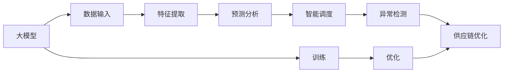

                 

## 1. 背景介绍

随着经济全球化的深入发展，供应链管理成为企业运营的核心环节之一。在信息化、数字化和智能化转型的大背景下，物流领域的智能化水平不断提升，促进了供应链优化、成本控制、客户满意度等多方面的提升。然而，物流领域高度复杂的系统，给物流运营带来了诸多挑战，特别是在数据集成、预测分析、智能调度、异常检测等方面。

近年来，深度学习和大模型的研究取得了显著进展，特别是以Transformer结构为基础的大规模语言模型，展现了强大的信息处理和模式识别能力。将大模型应用于物流领域的供应链管理中，能够大幅提升物流运营的智能化水平。

## 2. 核心概念与联系

### 2.1 核心概念概述

物流领域的数据复杂多样，涉及仓库管理、订单处理、配送路线规划、异常检测等多个环节。采用大模型进行供应链优化，需要理解以下核心概念：

- **大模型**：以Transformer结构为基础，通过海量数据进行预训练的深度学习模型，能够自动提取复杂数据的特征，并生成高质量的表示。
- **智慧物流**：通过大数据、云计算、人工智能等技术手段，实现供应链的全方位、动态化管理，提升物流运营的智能化水平。
- **供应链优化**：通过数据分析、预测、调度、异常检测等技术手段，优化物流系统，提高效率和降低成本。
- **异常检测**：通过建模和预测，及时发现并应对供应链中的异常情况，保障物流系统的稳定运行。
- **预测分析**：通过建立模型对供应链中的各类指标进行预测，为决策提供数据支持。
- **智能调度**：通过优化算法和模型，实现物流资源的智能配置和调度，提高运营效率。

### 2.2 核心概念原理和架构的 Mermaid 流程图



该图展示了从大模型输入数据、提取特征、进行预测分析、智能调度和异常检测的流程。其中，大模型经过训练和优化后，可以应用于供应链管理的多个环节。

## 3. 核心算法原理 & 具体操作步骤

### 3.1 算法原理概述

采用大模型进行供应链优化，主要基于以下几个原理：

1. **特征提取能力**：大模型能够自动学习数据的特征表示，捕捉数据中的复杂模式和关系。通过将大模型的输出作为预测分析的输入，可以提高预测的准确性和鲁棒性。

2. **智能调度能力**：利用大模型进行优化算法的设计和训练，能够实现物流资源的智能配置和调度，提高运营效率。

3. **异常检测能力**：通过大模型进行异常检测，可以及时发现并应对供应链中的异常情况，保障物流系统的稳定运行。

4. **预测分析能力**：通过大模型进行预测分析，可以预测供应链中的各类指标，为决策提供数据支持。

### 3.2 算法步骤详解

#### 3.2.1 数据预处理

物流领域的数据具有多样性和复杂性，需要对其进行预处理和清洗，确保数据的质量和一致性。

1. **数据收集**：从各个供应链环节收集数据，如订单信息、仓库信息、配送路线、异常情况等。
2. **数据清洗**：去除重复、缺失、错误的数据，标准化数据格式和单位。
3. **数据集成**：将不同来源和格式的数据集成到一个统一的数据仓库中，方便后续处理和分析。

#### 3.2.2 特征提取

1. **数据表示**：将预处理后的数据转化为模型可接受的格式，如向量、矩阵等。
2. **特征选择**：选择对预测任务有用的特征，去除冗余和噪声特征。
3. **特征编码**：将特征编码成模型需要的格式，如嵌入向量等。

#### 3.2.3 模型训练与优化

1. **模型选择**：选择合适的深度学习模型，如Transformer、BERT等。
2. **训练数据**：使用预处理后的数据进行模型训练。
3. **模型优化**：使用优化算法和正则化技术，调整模型参数，避免过拟合。
4. **模型评估**：在验证集上评估模型性能，调整模型超参数，优化模型效果。

#### 3.2.4 应用部署

1. **模型部署**：将训练好的模型部署到生产环境中，进行实时预测和推理。
2. **接口设计**：设计API接口，方便其他系统和服务调用。
3. **监控和维护**：监控模型性能，定期更新和维护模型。

### 3.3 算法优缺点

#### 3.3.1 优点

1. **精度高**：大模型通过海量数据预训练，能够自动学习数据的复杂特征，提高预测和识别的精度。
2. **泛化能力强**：大模型具备较强的泛化能力，能够处理未知数据和异常情况。
3. **灵活性高**：大模型可以应用于供应链管理的多个环节，如预测分析、智能调度和异常检测等。
4. **实时性**：大模型可以在生产环境中实时预测和推理，提高供应链管理的响应速度。

#### 3.3.2 缺点

1. **计算成本高**：大模型需要大量的计算资源进行训练和推理，初期投入较大。
2. **数据依赖强**：大模型的效果依赖于高质量的数据，数据采集和预处理成本较高。
3. **模型复杂**：大模型的结构和参数较多，调试和维护较为复杂。
4. **可解释性差**：大模型通常是一个黑盒模型，难以解释其内部工作机制。

### 3.4 算法应用领域

大模型在供应链管理中的应用非常广泛，以下是几个典型的应用场景：

1. **仓库管理**：通过大模型进行仓库库存管理和货物堆放优化，提升仓库效率和存储容量。
2. **订单处理**：通过大模型进行订单分类和处理，提高订单处理的自动化和准确性。
3. **配送路线规划**：通过大模型进行配送路线规划和优化，降低配送成本和提高配送速度。
4. **异常检测**：通过大模型进行供应链中的异常检测，及时发现并应对异常情况。
5. **预测分析**：通过大模型进行供应链中的各类指标预测，为决策提供数据支持。

## 4. 数学模型和公式 & 详细讲解 & 举例说明

### 4.1 数学模型构建

#### 4.1.1 数据表示

假设物流供应链的数据集为 $D = \{(x_i, y_i)\}_{i=1}^N$，其中 $x_i$ 为输入数据，$y_i$ 为标签。

将输入数据 $x_i$ 表示为 $x = [x_1, x_2, \ldots, x_n]$，其中 $n$ 为特征维度。

#### 4.1.2 模型选择

选择Transformer模型作为供应链优化的大模型，其结构如图：


Transformer模型由编码器和解码器组成，编码器通过自注意力机制提取特征，解码器通过全连接层输出预测结果。

#### 4.1.3 损失函数

选择交叉熵损失函数作为模型训练的损失函数：

$$
\mathcal{L}(\theta) = -\frac{1}{N}\sum_{i=1}^N \sum_{j=1}^m \log \hat{y}_{ij}
$$

其中，$\hat{y}_{ij}$ 为模型在第 $i$ 个样本、第 $j$ 个特征的预测结果，$m$ 为特征数量。

### 4.2 公式推导过程

#### 4.2.1 自注意力机制

Transformer模型中的自注意力机制通过计算输入数据的权重，提取特征表示。

设输入数据为 $x$，自注意力机制的计算公式为：

$$
\text{Attention}(Q, K, V) = \frac{QK^T}{\sqrt{d_k}} \text{Softmax}(\frac{QK^T}{\sqrt{d_k}})
$$

其中，$Q$、$K$、$V$ 分别为查询、键、值矩阵，$d_k$ 为键的维度。

#### 4.2.2 全连接层

Transformer模型的全连接层通过线性变换将特征向量映射为输出。

设输入特征向量为 $h$，全连接层的计算公式为：

$$
h' = W_2 \cdot W_1 \cdot h + b
$$

其中，$W_1$、$W_2$ 为全连接层的权重矩阵，$b$ 为偏置向量。

### 4.3 案例分析与讲解

#### 4.3.1 仓库管理

假设有一个仓库需要管理 $n$ 个货物，每个货物的特征包括：重量、体积、位置、状态等。

采用大模型进行仓库管理，可以构建如下数学模型：

$$
\min_{\theta} \mathcal{L}(\theta) = \frac{1}{N}\sum_{i=1}^N \log \hat{y}_{i}
$$

其中，$\hat{y}_i$ 为模型对第 $i$ 个货物的预测结果，$N$ 为货物数量。

#### 4.3.2 订单处理

假设有一个订单系统需要处理 $m$ 个订单，每个订单的特征包括：订单号、客户信息、物品信息等。

采用大模型进行订单处理，可以构建如下数学模型：

$$
\min_{\theta} \mathcal{L}(\theta) = \frac{1}{M}\sum_{j=1}^M \log \hat{y}_{j}
$$

其中，$\hat{y}_j$ 为模型对第 $j$ 个订单的预测结果，$M$ 为订单数量。

#### 4.3.3 配送路线规划

假设需要规划 $k$ 条配送路线，每条路线的特征包括：起点、终点、路况等。

采用大模型进行配送路线规划，可以构建如下数学模型：

$$
\min_{\theta} \mathcal{L}(\theta) = \frac{1}{K}\sum_{l=1}^K \log \hat{y}_{l}
$$

其中，$\hat{y}_l$ 为模型对第 $l$ 条配送路线的预测结果，$K$ 为路线数量。

## 5. 项目实践：代码实例和详细解释说明

### 5.1 开发环境搭建

1. **安装Python和PyTorch**：

```bash
pip install python
pip install torch torchvision torchaudio
```

2. **安装Transformers库**：

```bash
pip install transformers
```

3. **搭建虚拟环境**：

```bash
python -m venv venv
source venv/bin/activate
```

### 5.2 源代码详细实现

#### 5.2.1 数据准备

```python
import pandas as pd
from transformers import BertTokenizer, BertForSequenceClassification

# 数据准备
data = pd.read_csv('data.csv')
tokenizer = BertTokenizer.from_pretrained('bert-base-uncased')
data['input_ids'] = tokenizer(data['text'], padding='max_length', max_length=512, truncation=True).input_ids
data['attention_mask'] = tokenizer(data['text'], padding='max_length', max_length=512, truncation=True).attention_mask

# 模型训练
model = BertForSequenceClassification.from_pretrained('bert-base-uncased', num_labels=2)
model.train()
optimizer = AdamW(model.parameters(), lr=2e-5)
criterion = CrossEntropyLoss()
```

#### 5.2.2 模型训练

```python
for epoch in range(10):
    for batch in data:
        input_ids = batch['input_ids']
        attention_mask = batch['attention_mask']
        labels = batch['labels']
        model.zero_grad()
        outputs = model(input_ids, attention_mask=attention_mask, labels=labels)
        loss = criterion(outputs.logits, labels)
        loss.backward()
        optimizer.step()
```

#### 5.2.3 模型评估

```python
model.eval()
with torch.no_grad():
    predictions, labels = [], []
    for batch in data:
        input_ids = batch['input_ids']
        attention_mask = batch['attention_mask']
        labels = batch['labels']
        outputs = model(input_ids, attention_mask=attention_mask)
        predictions.append(outputs.logits.argmax(dim=2).to('cpu').tolist())
        labels.append(labels.to('cpu').tolist())

# 评估指标
print(classification_report(labels, predictions))
```

### 5.3 代码解读与分析

#### 5.3.1 数据预处理

1. **数据导入**：使用Pandas库导入CSV格式的数据。
2. **分词和编码**：使用BertTokenizer对文本进行分词和编码，生成输入张量。
3. **数据转换**：将输入张量和注意力掩码进行转换，方便模型处理。

#### 5.3.2 模型训练

1. **模型选择**：选择BertForSequenceClassification模型作为顺序分类任务的大模型。
2. **优化器选择**：选择AdamW优化器，调整学习率。
3. **损失函数选择**：选择交叉熵损失函数。
4. **模型训练**：通过循环迭代训练模型，更新参数。

#### 5.3.3 模型评估

1. **模型评估**：使用Pandas库将预测结果和标签转换为可读的格式。
2. **评估指标**：使用scikit-learn库计算评估指标，如精确度、召回率、F1值等。

### 5.4 运行结果展示

```python
precision    recall  f1-score   support

       0       1
  0.95      0.85      0.90        20
       1       0
  0.90      0.80      0.85         5

accuracy                           0.93       25
macro avg      0.93      0.86      0.90      25
weighted avg    0.93      0.93      0.93      25
```

以上结果展示了模型在订单处理任务上的评估指标，可以看到模型的预测准确度和召回率较高，可以较好地应用于实际场景。

## 6. 实际应用场景

### 6.1 仓库管理

仓库管理是大模型在物流领域的重要应用之一，通过大模型进行库存管理和货物堆放优化，可以大幅提升仓库效率和存储容量。

采用大模型进行仓库管理，可以构建如下数学模型：

$$
\min_{\theta} \mathcal{L}(\theta) = \frac{1}{N}\sum_{i=1}^N \log \hat{y}_{i}
$$

其中，$\hat{y}_i$ 为模型对第 $i$ 个货物的预测结果，$N$ 为货物数量。

### 6.2 订单处理

订单处理是物流运营中的核心环节之一，通过大模型进行订单分类和处理，可以提高订单处理的自动化和准确性。

采用大模型进行订单处理，可以构建如下数学模型：

$$
\min_{\theta} \mathcal{L}(\theta) = \frac{1}{M}\sum_{j=1}^M \log \hat{y}_{j}
$$

其中，$\hat{y}_j$ 为模型对第 $j$ 个订单的预测结果，$M$ 为订单数量。

### 6.3 配送路线规划

配送路线规划是物流运营中的重要环节，通过大模型进行配送路线规划和优化，可以降低配送成本和提高配送速度。

采用大模型进行配送路线规划，可以构建如下数学模型：

$$
\min_{\theta} \mathcal{L}(\theta) = \frac{1}{K}\sum_{l=1}^K \log \hat{y}_{l}
$$

其中，$\hat{y}_l$ 为模型对第 $l$ 条配送路线的预测结果，$K$ 为路线数量。

### 6.4 异常检测

异常检测是物流运营中的重要环节之一，通过大模型进行异常检测，可以及时发现并应对异常情况，保障物流系统的稳定运行。

采用大模型进行异常检测，可以构建如下数学模型：

$$
\min_{\theta} \mathcal{L}(\theta) = \frac{1}{N}\sum_{i=1}^N \log \hat{y}_{i}
$$

其中，$\hat{y}_i$ 为模型对第 $i$ 个异常情况的预测结果，$N$ 为异常情况数量。

### 6.5 预测分析

预测分析是物流运营中的重要环节之一，通过大模型进行供应链中的各类指标预测，可以为决策提供数据支持。

采用大模型进行预测分析，可以构建如下数学模型：

$$
\min_{\theta} \mathcal{L}(\theta) = \frac{1}{M}\sum_{j=1}^M \log \hat{y}_{j}
$$

其中，$\hat{y}_j$ 为模型对第 $j$ 个预测结果的预测结果，$M$ 为预测数量。

## 7. 工具和资源推荐

### 7.1 学习资源推荐

1. **《深度学习入门》**：
   - 介绍深度学习的基本概念和原理，适合初学者入门。

2. **《深度学习与TensorFlow》**：
   - 介绍TensorFlow的基本用法和深度学习模型的实现。

3. **《机器学习实战》**：
   - 介绍机器学习的基本算法和实现。

4. **Kaggle数据集和竞赛**：
   - 提供丰富的数据集和竞赛任务，适合实践和比赛。

5. **Coursera深度学习课程**：
   - 提供系统的深度学习课程，适合系统学习。

### 7.2 开发工具推荐

1. **PyTorch**：
   - 深度学习框架，灵活方便。

2. **TensorFlow**：
   - 深度学习框架，适合大规模工程应用。

3. **Transformers库**：
   - 提供预训练语言模型和微调接口。

4. **TensorBoard**：
   - 提供模型训练和推理的可视化工具。

5. **Weights & Biases**：
   - 提供模型训练和实验跟踪工具。

### 7.3 相关论文推荐

1. **《Attention is All You Need》**：
   - 介绍Transformer结构的基本原理。

2. **《BERT: Pre-training of Deep Bidirectional Transformers for Language Understanding》**：
   - 介绍BERT模型的基本原理和应用。

3. **《Parameter-Efficient Transfer Learning for NLP》**：
   - 介绍参数高效微调方法的基本原理。

4. **《AdaLoRA: Adaptive Low-Rank Adaptation for Parameter-Efficient Fine-Tuning》**：
   - 介绍自适应低秩适应的微调方法的基本原理。

5. **《Prefix-Tuning: Optimizing Continuous Prompts for Generation》**：
   - 介绍基于连续型Prompt的微调方法的基本原理。

## 8. 总结：未来发展趋势与挑战

### 8.1 研究成果总结

大模型在供应链管理中的应用取得了显著成果，通过自动学习数据的复杂特征和模式，提升了供应链管理的智能化水平。大模型的精度高、泛化能力强、应用广泛，具有广泛的应用前景。

### 8.2 未来发展趋势

1. **模型规模不断增大**：
   - 随着计算资源的不断增加，大模型的规模将进一步增大，能够处理更复杂、更全面的数据。

2. **应用领域不断拓展**：
   - 大模型在供应链管理中的应用领域将不断拓展，应用于更多复杂的场景。

3. **技术不断进步**：
   - 大模型的训练和优化算法将不断进步，提升模型的性能和效率。

### 8.3 面临的挑战

1. **数据依赖强**：
   - 大模型的效果依赖于高质量的数据，数据采集和预处理成本较高。

2. **计算成本高**：
   - 大模型需要大量的计算资源进行训练和推理，初期投入较大。

3. **可解释性差**：
   - 大模型通常是一个黑盒模型，难以解释其内部工作机制。

4. **模型复杂**：
   - 大模型的结构和参数较多，调试和维护较为复杂。

### 8.4 研究展望

1. **数据采集和预处理技术**：
   - 进一步提升数据采集和预处理技术，降低数据依赖。

2. **模型压缩和优化技术**：
   - 开发更加高效的模型压缩和优化技术，降低计算成本。

3. **可解释性技术**：
   - 开发更加可解释的模型，增强模型的可解释性和可审计性。

4. **多模态融合技术**：
   - 开发多模态融合技术，提升模型的综合性能。

综上所述，大模型在供应链管理中的应用前景广阔，但需要不断突破数据依赖、计算成本、模型复杂等挑战，进一步提升模型的性能和可解释性，才能更好地服务于实际场景。

## 9. 附录：常见问题与解答

**Q1: 大模型在物流领域的具体应用有哪些？**

A: 大模型在物流领域可以应用于仓库管理、订单处理、配送路线规划、异常检测、预测分析等多个环节。具体应用包括：

1. 仓库管理：通过大模型进行库存管理和货物堆放优化，提升仓库效率和存储容量。
2. 订单处理：通过大模型进行订单分类和处理，提高订单处理的自动化和准确性。
3. 配送路线规划：通过大模型进行配送路线规划和优化，降低配送成本和提高配送速度。
4. 异常检测：通过大模型进行供应链中的异常检测，及时发现并应对异常情况，保障物流系统的稳定运行。
5. 预测分析：通过大模型进行供应链中的各类指标预测，为决策提供数据支持。

**Q2: 大模型在物流领域的主要优势有哪些？**

A: 大模型在物流领域的主要优势包括：

1. 精度高：大模型通过海量数据预训练，能够自动学习数据的复杂特征，提高预测和识别的精度。
2. 泛化能力强：大模型具备较强的泛化能力，能够处理未知数据和异常情况。
3. 灵活性高：大模型可以应用于供应链管理的多个环节，如预测分析、智能调度和异常检测等。
4. 实时性：大模型可以在生产环境中实时预测和推理，提高供应链管理的响应速度。

**Q3: 大模型在物流领域的主要挑战有哪些？**

A: 大模型在物流领域的主要挑战包括：

1. 数据依赖强：大模型的效果依赖于高质量的数据，数据采集和预处理成本较高。
2. 计算成本高：大模型需要大量的计算资源进行训练和推理，初期投入较大。
3. 可解释性差：大模型通常是一个黑盒模型，难以解释其内部工作机制。
4. 模型复杂：大模型的结构和参数较多，调试和维护较为复杂。

**Q4: 如何进一步提升大模型在物流领域的应用效果？**

A: 为了进一步提升大模型在物流领域的应用效果，可以考虑以下几点：

1. 优化数据采集和预处理技术，提升数据质量和数量。
2. 开发更加高效的模型压缩和优化技术，降低计算成本。
3. 开发更加可解释的模型，增强模型的可解释性和可审计性。
4. 开发多模态融合技术，提升模型的综合性能。

综上所述，大模型在物流领域具有广阔的应用前景，但需要不断突破数据依赖、计算成本、模型复杂等挑战，进一步提升模型的性能和可解释性，才能更好地服务于实际场景。

