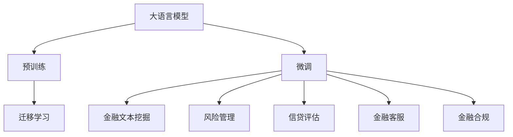

                 

## 1. 背景介绍

### 1.1 问题由来
金融科技(Fintech)正在迅速改变传统金融行业的业务模式，推动金融服务的数字化、智能化转型。在Fintech领域，数据驱动决策、高频交易、风险管理、信贷评估等任务对模型的精度和效率提出了严苛的要求。大语言模型(Big Language Models, BLMs)的出现，为金融科技领域带来了新的契机。BLMs以其卓越的语言处理能力，能够挖掘和分析海量金融文本数据，助力金融机构实现业务智能化、运营效率化。

### 1.2 问题核心关键点
BLMs在大模型微调下的金融科技应用，具有以下核心关键点：

- **金融文本数据挖掘**：利用BLMs处理自然语言，进行金融新闻、公告、报告等文本数据的情感分析和主题提取，挖掘其中的价值信息。
- **风险管理**：通过分析客户社交媒体、金融新闻、市场评论等文本数据，预测金融市场的波动和风险事件，辅助决策者制定应对策略。
- **信贷评估**：通过分析客户的文本数据，评估其信用风险和还款能力，提高信贷评估的准确性和效率。
- **金融客服**：使用BLMs构建智能客服系统，解答客户咨询，提供个性化推荐，提升客户体验。
- **金融合规**：通过分析金融文档、规则、法律法规等文本，识别合规风险，确保业务合规运营。

这些关键点展示了BLMs在金融科技领域的应用潜力，有望大大提升金融机构的业务能力和运营效率。

## 2. 核心概念与联系

### 2.1 核心概念概述

在金融科技领域，大语言模型微调（Fine-Tuning）是一个重要的概念。BLMs通过大规模无监督预训练获得语言知识，而微调则是将这些知识应用于特定金融场景，提升模型的领域适应性和性能。

- **大语言模型(BLMs)**：如GPT-3、BERT等，基于Transformer等架构，通过海量的文本数据预训练，具备强大的语言理解能力。
- **预训练(Pre-training)**：在大规模无标签文本数据上进行自监督学习，学习通用的语言表示。
- **微调(Fine-Tuning)**：在预训练模型的基础上，利用金融领域的少量标注数据进行有监督学习，提升模型在特定金融任务上的性能。
- **迁移学习(Transfer Learning)**：将预训练模型在金融场景下的知识迁移应用，通过微调进一步优化。

这些概念之间的逻辑关系可以通过以下Mermaid流程图来展示：



这个流程图展示了BLMs在金融科技领域的核心概念及其之间的关系：

1. 大语言模型通过预训练获得语言知识。
2. 微调将预训练知识应用于特定金融任务。
3. 迁移学习进一步优化金融场景下的模型性能。

## 3. 核心算法原理 & 具体操作步骤
### 3.1 算法原理概述

在金融科技领域，基于大语言模型的微调方法主要是利用BLMs在海量文本数据上预训练得到的语言表示，针对特定金融任务进行微调。其核心原理包括以下几个方面：

- **数据准备**：收集金融领域的标注数据，如新闻、公告、报告等，构建训练集。
- **模型适配**：在预训练模型基础上添加任务适配层，如情感分析、主题提取、风险预测等。
- **模型训练**：使用优化器（如AdamW、SGD等），根据标注数据训练模型，最小化损失函数。
- **模型评估**：在验证集和测试集上评估模型性能，选择最优模型进行部署。

### 3.2 算法步骤详解

以下是一个金融文本挖掘任务的微调步骤：

**Step 1: 准备金融文本数据和标签**
- 收集金融领域的文本数据，如财经新闻、公司公告、分析师报告等。
- 标注文本数据的情感类别（正面、负面、中性）或主题类别（股市、债市、政策等）。
- 将文本数据划分为训练集、验证集和测试集。

**Step 2: 选择预训练模型并加载**
- 选择适合的预训练语言模型，如BERT、GPT-3等。
- 使用Transformers库或其他深度学习框架加载预训练模型。

**Step 3: 添加任务适配层**
- 根据任务类型，在预训练模型基础上添加相应的输出层和损失函数。
- 对于情感分析任务，可以添加softmax层和交叉熵损失函数。
- 对于主题提取任务，可以添加softmax层和交叉熵损失函数，或者使用多标签分类任务。

**Step 4: 设置微调超参数**
- 选择合适的优化器及其参数，如AdamW、SGD等。
- 设置学习率、批大小、迭代轮数等超参数。
- 设置正则化技术，如L2正则、Dropout等。

**Step 5: 执行梯度训练**
- 将训练集数据分批次输入模型，前向传播计算损失函数。
- 反向传播计算参数梯度，根据设定的优化算法和学习率更新模型参数。
- 周期性在验证集上评估模型性能，根据性能指标决定是否触发Early Stopping。
- 重复上述步骤直至满足预设的迭代轮数或Early Stopping条件。

**Step 6: 测试和部署**
- 在测试集上评估微调后模型，对比微调前后的精度提升。
- 使用微调后的模型对新样本进行推理预测，集成到金融服务系统中。
- 持续收集新的数据，定期重新微调模型，以适应数据分布的变化。

### 3.3 算法优缺点

基于大语言模型的金融微调方法具有以下优点：

- **高效准确**：在少量标注数据下，仍能快速获得较高的精度。
- **易于扩展**：金融领域任务多样，微调方法可轻松应用于不同类型的任务。
- **鲁棒性高**：金融数据的复杂性较高，微调模型具备较强的鲁棒性。

同时，也存在以下缺点：

- **数据依赖性强**：金融文本数据收集和标注成本较高，且质量要求严格。
- **参数量大**：大语言模型参数规模大，对计算资源需求高。
- **可解释性差**：金融模型的决策过程复杂，难以解释模型的内部逻辑。
- **过拟合风险**：金融数据噪音较多，模型容易过拟合训练数据。

## 4. 数学模型和公式 & 详细讲解 & 举例说明

### 4.1 数学模型构建

在金融文本挖掘任务中，我们假设训练集为$D=\{(x_i, y_i)\}_{i=1}^N$，其中$x_i$表示金融文本，$y_i$表示文本的情感类别或主题标签。我们的目标是最小化预测输出与真实标签之间的损失函数。

定义损失函数为交叉熵损失函数：
$$
\mathcal{L}(\theta) = -\frac{1}{N} \sum_{i=1}^N y_i \log \hat{y}_i + (1-y_i) \log (1-\hat{y}_i)
$$
其中，$\hat{y}_i$表示模型对文本$x_i$的情感或主题预测，$y_i$表示真实标签。

### 4.2 公式推导过程

我们使用softmax回归模型进行微调，假设模型参数为$\theta$，则模型的输出层为：
$$
\hat{y}_i = \text{softmax}(W \cdot x_i + b)
$$
其中，$W$为权重矩阵，$b$为偏置向量，$x_i$为文本的预训练嵌入向量。

通过链式法则，损失函数对$\theta$的梯度为：
$$
\nabla_{\theta}\mathcal{L}(\theta) = -\frac{1}{N} \sum_{i=1}^N \left[ y_i \frac{\exp(-\hat{y}_i)}{\sum_k \exp(-\hat{y}_k)} + (1-y_i) \frac{\exp(-(1-\hat{y}_i)}{\sum_k \exp(-(1-\hat{y}_k))} \right] (W \cdot x_i + b)
$$

### 4.3 案例分析与讲解

假设我们有一个金融新闻文本$x_i$，其真实情感为正面，模型预测结果为正面，此时损失函数$\mathcal{L}(\theta)$的值为：
$$
\mathcal{L}(\theta) = -\frac{1}{N} (y_i \log \hat{y}_i + (1-y_i) \log (1-\hat{y}_i))
$$
如果模型预测错误，即模型预测为负面，此时损失函数$\mathcal{L}(\theta)$的值为：
$$
\mathcal{L}(\theta) = -\frac{1}{N} (y_i \log (1-\hat{y}_i) + (1-y_i) \log \hat{y}_i)
$$

通过反向传播算法，计算梯度$\frac{\partial \mathcal{L}(\theta)}{\partial \theta}$，并使用优化器（如AdamW）更新模型参数$\theta$，以最小化损失函数$\mathcal{L}(\theta)$。

## 5. 项目实践：代码实例和详细解释说明

### 5.1 开发环境搭建

在开始金融文本挖掘任务的微调实践前，我们需要准备好开发环境。以下是使用Python进行PyTorch开发的环境配置流程：

1. 安装Anaconda：从官网下载并安装Anaconda，用于创建独立的Python环境。
2. 创建并激活虚拟环境：
```bash
conda create -n pytorch-env python=3.8 
conda activate pytorch-env
```
3. 安装PyTorch：根据CUDA版本，从官网获取对应的安装命令。例如：
```bash
conda install pytorch torchvision torchaudio cudatoolkit=11.1 -c pytorch -c conda-forge
```
4. 安装Transformers库：
```bash
pip install transformers
```
5. 安装各类工具包：
```bash
pip install numpy pandas scikit-learn matplotlib tqdm jupyter notebook ipython
```
完成上述步骤后，即可在`pytorch-env`环境中开始微调实践。

### 5.2 源代码详细实现

以下是一个金融文本挖掘任务的微调代码实现。

首先，定义任务数据处理函数：

```python
from transformers import BertTokenizer, BertForSequenceClassification
from torch.utils.data import Dataset
import torch

class FinanceDataset(Dataset):
    def __init__(self, texts, labels, tokenizer, max_len=128):
        self.texts = texts
        self.labels = labels
        self.tokenizer = tokenizer
        self.max_len = max_len
        
    def __len__(self):
        return len(self.texts)
    
    def __getitem__(self, item):
        text = self.texts[item]
        label = self.labels[item]
        
        encoding = self.tokenizer(text, return_tensors='pt', max_length=self.max_len, padding='max_length', truncation=True)
        input_ids = encoding['input_ids'][0]
        attention_mask = encoding['attention_mask'][0]
        
        # 将标签转化为模型所需的格式
        encoded_labels = torch.tensor([label], dtype=torch.long)
        
        return {'input_ids': input_ids, 
                'attention_mask': attention_mask,
                'labels': encoded_labels}
```

然后，定义模型和优化器：

```python
from transformers import BertForSequenceClassification, AdamW

model = BertForSequenceClassification.from_pretrained('bert-base-cased', num_labels=3)
optimizer = AdamW(model.parameters(), lr=2e-5)
```

接着，定义训练和评估函数：

```python
from torch.utils.data import DataLoader
from tqdm import tqdm
from sklearn.metrics import classification_report

device = torch.device('cuda') if torch.cuda.is_available() else torch.device('cpu')
model.to(device)

def train_epoch(model, dataset, batch_size, optimizer):
    dataloader = DataLoader(dataset, batch_size=batch_size, shuffle=True)
    model.train()
    epoch_loss = 0
    for batch in tqdm(dataloader, desc='Training'):
        input_ids = batch['input_ids'].to(device)
        attention_mask = batch['attention_mask'].to(device)
        labels = batch['labels'].to(device)
        model.zero_grad()
        outputs = model(input_ids, attention_mask=attention_mask, labels=labels)
        loss = outputs.loss
        epoch_loss += loss.item()
        loss.backward()
        optimizer.step()
    return epoch_loss / len(dataloader)

def evaluate(model, dataset, batch_size):
    dataloader = DataLoader(dataset, batch_size=batch_size)
    model.eval()
    preds, labels = [], []
    with torch.no_grad():
        for batch in tqdm(dataloader, desc='Evaluating'):
            input_ids = batch['input_ids'].to(device)
            attention_mask = batch['attention_mask'].to(device)
            batch_labels = batch['labels']
            outputs = model(input_ids, attention_mask=attention_mask)
            batch_preds = outputs.logits.argmax(dim=1).to('cpu').tolist()
            batch_labels = batch_labels.to('cpu').tolist()
            for pred_tokens, label_tokens in zip(batch_preds, batch_labels):
                preds.append(pred_tokens)
                labels.append(label_tokens)
                
    print(classification_report(labels, preds))
```

最后，启动训练流程并在测试集上评估：

```python
epochs = 5
batch_size = 16

for epoch in range(epochs):
    loss = train_epoch(model, finance_dataset, batch_size, optimizer)
    print(f"Epoch {epoch+1}, train loss: {loss:.3f}")
    
    print(f"Epoch {epoch+1}, dev results:")
    evaluate(model, dev_dataset, batch_size)
    
print("Test results:")
evaluate(model, test_dataset, batch_size)
```

以上就是使用PyTorch对BERT进行金融文本挖掘任务微调的完整代码实现。可以看到，得益于Transformers库的强大封装，我们可以用相对简洁的代码完成BERT模型的加载和微调。

### 5.3 代码解读与分析

让我们再详细解读一下关键代码的实现细节：

**FinanceDataset类**：
- `__init__`方法：初始化文本、标签、分词器等关键组件。
- `__len__`方法：返回数据集的样本数量。
- `__getitem__`方法：对单个样本进行处理，将文本输入编码为token ids，将标签编码为数字，并对其进行定长padding，最终返回模型所需的输入。

**模型和优化器**：
- 使用BertForSequenceClassification类加载预训练模型，并设置3个分类标签（正面、负面、中性）。
- 使用AdamW优化器，设置学习率为2e-5。

**训练和评估函数**：
- 使用PyTorch的DataLoader对数据集进行批次化加载，供模型训练和推理使用。
- 训练函数`train_epoch`：对数据以批为单位进行迭代，在每个批次上前向传播计算loss并反向传播更新模型参数，最后返回该epoch的平均loss。
- 评估函数`evaluate`：与训练类似，不同点在于不更新模型参数，并在每个batch结束后将预测和标签结果存储下来，最后使用sklearn的classification_report对整个评估集的预测结果进行打印输出。

**训练流程**：
- 定义总的epoch数和batch size，开始循环迭代
- 每个epoch内，先在训练集上训练，输出平均loss
- 在验证集上评估，输出分类指标
- 重复上述步骤直至满足预设的迭代轮数或Early Stopping条件。

可以看到，PyTorch配合Transformers库使得BERT微调的代码实现变得简洁高效。开发者可以将更多精力放在数据处理、模型改进等高层逻辑上，而不必过多关注底层的实现细节。

当然，工业级的系统实现还需考虑更多因素，如模型的保存和部署、超参数的自动搜索、更灵活的任务适配层等。但核心的微调范式基本与此类似。

## 6. 实际应用场景
### 6.1 智能投顾

智能投顾（Robo-Advisors）利用金融文本挖掘技术，分析市场新闻、分析师报告、社交媒体等信息，生成量化投资策略，提供个性化投资建议。通过微调，智能投顾可以动态调整投资策略，降低风险，提升收益。例如，利用微调后的BERT模型，可以根据用户的投资偏好和风险承受能力，生成与其匹配的股票组合，并进行风险评估，提供最优投资建议。

### 6.2 风险预警

金融市场的波动性和不确定性较高，需要实时监测和预警。通过微调，金融文本挖掘技术可以识别金融新闻、分析师评论等文本信息中的情绪和主题，预测市场走势，提前预警风险事件。例如，微调后的BERT模型可以分析公司财报和新闻，预测公司股票的下跌概率，及时提醒投资者进行风险控制。

### 6.3 智能合规

金融机构需要遵守复杂的法规和合规要求，需要自动化的合规检测系统。通过微调，金融文本挖掘技术可以分析金融文档、规则、法律法规等文本，识别合规风险，确保业务合规运营。例如，利用微调后的BERT模型，可以自动化分析贷款合同、保险条款等文本，识别不合规内容，提高合规审核效率。

### 6.4 未来应用展望

随着大语言模型和微调方法的不断发展，基于微调范式将在更多金融科技应用中得到应用，为金融行业带来变革性影响。

在智慧银行领域，基于微调的金融文本挖掘技术可以分析客户的文本数据，评估其信用风险和还款能力，提高信贷评估的准确性和效率。通过智能投顾和风险预警系统，银行可以为客户提供个性化投资建议和实时风险监控，提升客户体验和业务效益。

在保险行业，微调后的BERT模型可以自动分析保险合同和条款，识别潜在风险点，提高保险产品的质量和合规性。通过智能客服系统，保险公司可以及时解答客户疑问，提升客户满意度。

在证券市场，微调后的BERT模型可以实时分析市场新闻和社交媒体，生成量化投资策略，提高交易决策的准确性。通过智能投顾系统，证券公司可以提供定制化的投资方案，提高客户黏性和收益。

此外，在财富管理、私募基金、金融科技平台等领域，微调技术的应用也将不断扩展，为金融行业注入新的活力和创新力。

## 7. 工具和资源推荐
### 7.1 学习资源推荐

为了帮助开发者系统掌握大语言模型微调的理论基础和实践技巧，这里推荐一些优质的学习资源：

1. 《Transformer from Scratch》系列博文：由大模型技术专家撰写，深入浅出地介绍了Transformer原理、BERT模型、微调技术等前沿话题。

2. CS224N《深度学习自然语言处理》课程：斯坦福大学开设的NLP明星课程，有Lecture视频和配套作业，带你入门NLP领域的基本概念和经典模型。

3. 《Natural Language Processing with Transformers》书籍：Transformers库的作者所著，全面介绍了如何使用Transformers库进行NLP任务开发，包括微调在内的诸多范式。

4. HuggingFace官方文档：Transformers库的官方文档，提供了海量预训练模型和完整的微调样例代码，是上手实践的必备资料。

5. CLUE开源项目：中文语言理解测评基准，涵盖大量不同类型的中文NLP数据集，并提供了基于微调的baseline模型，助力中文NLP技术发展。

通过对这些资源的学习实践，相信你一定能够快速掌握大语言模型微调的精髓，并用于解决实际的NLP问题。

### 7.2 开发工具推荐

高效的开发离不开优秀的工具支持。以下是几款用于大语言模型微调开发的常用工具：

1. PyTorch：基于Python的开源深度学习框架，灵活动态的计算图，适合快速迭代研究。大部分预训练语言模型都有PyTorch版本的实现。

2. TensorFlow：由Google主导开发的开源深度学习框架，生产部署方便，适合大规模工程应用。同样有丰富的预训练语言模型资源。

3. Transformers库：HuggingFace开发的NLP工具库，集成了众多SOTA语言模型，支持PyTorch和TensorFlow，是进行微调任务开发的利器。

4. Weights & Biases：模型训练的实验跟踪工具，可以记录和可视化模型训练过程中的各项指标，方便对比和调优。与主流深度学习框架无缝集成。

5. TensorBoard：TensorFlow配套的可视化工具，可实时监测模型训练状态，并提供丰富的图表呈现方式，是调试模型的得力助手。

6. Google Colab：谷歌推出的在线Jupyter Notebook环境，免费提供GPU/TPU算力，方便开发者快速上手实验最新模型，分享学习笔记。

合理利用这些工具，可以显著提升大语言模型微调任务的开发效率，加快创新迭代的步伐。

### 7.3 相关论文推荐

大语言模型和微调技术的发展源于学界的持续研究。以下是几篇奠基性的相关论文，推荐阅读：

1. Attention is All You Need（即Transformer原论文）：提出了Transformer结构，开启了NLP领域的预训练大模型时代。

2. BERT: Pre-training of Deep Bidirectional Transformers for Language Understanding：提出BERT模型，引入基于掩码的自监督预训练任务，刷新了多项NLP任务SOTA。

3. Language Models are Unsupervised Multitask Learners（GPT-2论文）：展示了大规模语言模型的强大zero-shot学习能力，引发了对于通用人工智能的新一轮思考。

4. Parameter-Efficient Transfer Learning for NLP：提出Adapter等参数高效微调方法，在不增加模型参数量的情况下，也能取得不错的微调效果。

5. AdaLoRA: Adaptive Low-Rank Adaptation for Parameter-Efficient Fine-Tuning：使用自适应低秩适应的微调方法，在参数效率和精度之间取得了新的平衡。

这些论文代表了大语言模型微调技术的发展脉络。通过学习这些前沿成果，可以帮助研究者把握学科前进方向，激发更多的创新灵感。

## 8. 总结：未来发展趋势与挑战

### 8.1 总结

本文对基于大语言模型的金融科技微调方法进行了全面系统的介绍。首先阐述了大语言模型和微调技术的研究背景和意义，明确了微调在拓展预训练模型应用、提升金融任务性能方面的独特价值。其次，从原理到实践，详细讲解了金融文本挖掘任务的微调过程，给出了微调任务开发的完整代码实例。同时，本文还广泛探讨了微调方法在智能投顾、风险预警、智能合规等多个金融科技应用场景中的具体应用，展示了微调范式的巨大潜力。

通过本文的系统梳理，可以看到，基于大语言模型的微调方法正在成为金融科技领域的重要范式，极大地提升了金融机构的业务能力和运营效率。未来，伴随预训练语言模型和微调方法的持续演进，基于微调范式将在更多金融科技应用中得到应用，为金融行业带来变革性影响。

### 8.2 未来发展趋势

展望未来，大语言模型微调技术将呈现以下几个发展趋势：

1. **模型规模持续增大**：随着算力成本的下降和数据规模的扩张，预训练语言模型的参数量还将持续增长。超大规模语言模型蕴含的丰富语言知识，有望支撑更加复杂多变的金融任务微调。

2. **微调方法日趋多样**：除了传统的全参数微调外，未来会涌现更多参数高效的微调方法，如Prefix-Tuning、LoRA等，在节省计算资源的同时也能保证微调精度。

3. **持续学习成为常态**：随着数据分布的不断变化，微调模型也需要持续学习新知识以保持性能。如何在不遗忘原有知识的同时，高效吸收新样本信息，将成为重要的研究课题。

4. **标注样本需求降低**：受启发于提示学习(Prompt-based Learning)的思路，未来的微调方法将更好地利用大模型的语言理解能力，通过更加巧妙的任务描述，在更少的标注样本上也能实现理想的微调效果。

5. **多模态微调崛起**：当前的微调主要聚焦于纯文本数据，未来会进一步拓展到图像、视频、语音等多模态数据微调。多模态信息的融合，将显著提升语言模型对现实世界的理解和建模能力。

6. **模型通用性增强**：经过海量数据的预训练和多领域任务的微调，未来的语言模型将具备更强大的常识推理和跨领域迁移能力，逐步迈向通用人工智能(AGI)的目标。

以上趋势凸显了大语言模型微调技术的广阔前景。这些方向的探索发展，必将进一步提升金融科技系统的性能和应用范围，为金融行业数字化转型升级提供新的技术路径。

### 8.3 面临的挑战

尽管大语言模型微调技术已经取得了瞩目成就，但在迈向更加智能化、普适化应用的过程中，它仍面临着诸多挑战：

1. **标注成本瓶颈**：金融文本数据收集和标注成本较高，且质量要求严格。如何进一步降低微调对标注样本的依赖，将是一大难题。

2. **模型鲁棒性不足**：金融数据的复杂性较高，模型容易过拟合训练数据。如何提高微调模型的鲁棒性，避免灾难性遗忘，还需要更多理论和实践的积累。

3. **推理效率有待提高**：大语言模型虽然精度高，但在实际部署时往往面临推理速度慢、内存占用大等效率问题。如何在保证性能的同时，简化模型结构，提升推理速度，优化资源占用，将是重要的优化方向。

4. **可解释性亟需加强**：金融模型的决策过程复杂，难以解释模型的内部逻辑。对于高风险应用，算法的可解释性和可审计性尤为重要。

5. **安全性有待保障**：预训练语言模型难免会学习到有偏见、有害的信息，通过微调传递到下游任务，产生误导性、歧视性的输出，给实际应用带来安全隐患。

6. **知识整合能力不足**：现有的微调模型往往局限于任务内数据，难以灵活吸收和运用更广泛的先验知识。如何让微调过程更好地与外部知识库、规则库等专家知识结合，形成更加全面、准确的信息整合能力，还有很大的想象空间。

正视微调面临的这些挑战，积极应对并寻求突破，将是大语言模型微调走向成熟的必由之路。相信随着学界和产业界的共同努力，这些挑战终将一一被克服，大语言模型微调必将在构建安全、可靠、可解释、可控的智能系统铺平道路。

### 8.4 研究展望

面对大语言模型微调所面临的种种挑战，未来的研究需要在以下几个方面寻求新的突破：

1. **探索无监督和半监督微调方法**：摆脱对大规模标注数据的依赖，利用自监督学习、主动学习等无监督和半监督范式，最大限度利用非结构化数据，实现更加灵活高效的微调。

2. **研究参数高效和计算高效的微调范式**：开发更加参数高效的微调方法，在固定大部分预训练参数的同时，只更新极少量的任务相关参数。同时优化微调模型的计算图，减少前向传播和反向传播的资源消耗，实现更加轻量级、实时性的部署。

3. **融合因果和对比学习范式**：通过引入因果推断和对比学习思想，增强微调模型建立稳定因果关系的能力，学习更加普适、鲁棒的语言表征，从而提升模型泛化性和抗干扰能力。

4. **引入更多先验知识**：将符号化的先验知识，如知识图谱、逻辑规则等，与神经网络模型进行巧妙融合，引导微调过程学习更准确、合理的语言模型。同时加强不同模态数据的整合，实现视觉、语音等多模态信息与文本信息的协同建模。

5. **结合因果分析和博弈论工具**：将因果分析方法引入微调模型，识别出模型决策的关键特征，增强输出解释的因果性和逻辑性。借助博弈论工具刻画人机交互过程，主动探索并规避模型的脆弱点，提高系统稳定性。

6. **纳入伦理道德约束**：在模型训练目标中引入伦理导向的评估指标，过滤和惩罚有偏见、有害的输出倾向。同时加强人工干预和审核，建立模型行为的监管机制，确保输出符合人类价值观和伦理道德。

这些研究方向的探索，必将引领大语言模型微调技术迈向更高的台阶，为构建安全、可靠、可解释、可控的智能系统铺平道路。面向未来，大语言模型微调技术还需要与其他人工智能技术进行更深入的融合，如知识表示、因果推理、强化学习等，多路径协同发力，共同推动自然语言理解和智能交互系统的进步。只有勇于创新、敢于突破，才能不断拓展语言模型的边界，让智能技术更好地造福人类社会。

## 9. 附录：常见问题与解答

**Q1：大语言模型微调是否适用于所有金融任务？**

A: 大语言模型微调在大多数金融任务上都能取得不错的效果，特别是对于数据量较小的任务。但对于一些特定领域的任务，如市场监管、信用评估等，仅依赖通用语料预训练的模型可能难以很好地适应。此时需要在特定领域语料上进一步预训练，再进行微调，才能获得理想效果。

**Q2：微调过程中如何选择合适的学习率？**

A: 微调的学习率一般要比预训练时小1-2个数量级，如果使用过大的学习率，容易破坏预训练权重，导致过拟合。一般建议从1e-5开始调参，逐步减小学习率，直至收敛。也可以使用warmup策略，在开始阶段使用较小的学习率，再逐渐过渡到预设值。需要注意的是，不同的优化器(如AdamW、Adafactor等)以及不同的学习率调度策略，可能需要设置不同的学习率阈值。

**Q3：采用大模型微调时会面临哪些资源瓶颈？**

A: 目前主流的预训练大模型动辄以亿计的参数规模，对算力、内存、存储都提出了很高的要求。GPU/TPU等高性能设备是必不可少的，但即便如此，超大批次的训练和推理也可能遇到显存不足的问题。因此需要采用一些资源优化技术，如梯度积累、混合精度训练、模型并行等，来突破硬件瓶颈。同时，模型的存储和读取也可能占用大量时间和空间，需要采用模型压缩、稀疏化存储等方法进行优化。

**Q4：如何缓解微调过程中的过拟合问题？**

A: 过拟合是微调面临的主要挑战，尤其是在标注数据不足的情况下。常见的缓解策略包括：
1. 数据增强：通过回译、近义替换等方式扩充训练集
2. 正则化：使用L2正则、Dropout、Early Stopping等避免过拟合
3. 对抗训练：引入对抗样本，提高模型鲁棒性
4. 参数高效微调：只调整少量参数(如Adapter、Prefix等)，减小过拟合风险
5. 多模型集成：训练多个微调模型，取平均输出，抑制过拟合

这些策略往往需要根据具体任务和数据特点进行灵活组合。只有在数据、模型、训练、推理等各环节进行全面优化，才能最大限度地发挥大模型微调的威力。

**Q5：微调模型在落地部署时需要注意哪些问题？**

A: 将微调模型转化为实际应用，还需要考虑以下因素：
1. 模型裁剪：去除不必要的层和参数，减小模型尺寸，加快推理速度
2. 量化加速：将浮点模型转为定点模型，压缩存储空间，提高计算效率
3. 服务化封装：将模型封装为标准化服务接口，便于集成调用
4. 弹性伸缩：根据请求流量动态调整资源配置，平衡服务质量和成本
5. 监控告警：实时采集系统指标，设置异常告警阈值，确保服务稳定性
6. 安全防护：采用访问鉴权、数据脱敏等措施，保障数据和模型安全

大语言模型微调为金融文本挖掘任务提供了强大的工具，但如何将强大的性能转化为稳定、高效、安全的业务价值，还需要工程实践的不断打磨。唯有从数据、算法、工程、业务等多个维度协同发力，才能真正实现人工智能技术在金融领域的规模化落地。总之，微调需要开发者根据具体任务，不断迭代和优化模型、数据和算法，方能得到理想的效果。

---

作者：禅与计算机程序设计艺术 / Zen and the Art of Computer Programming

