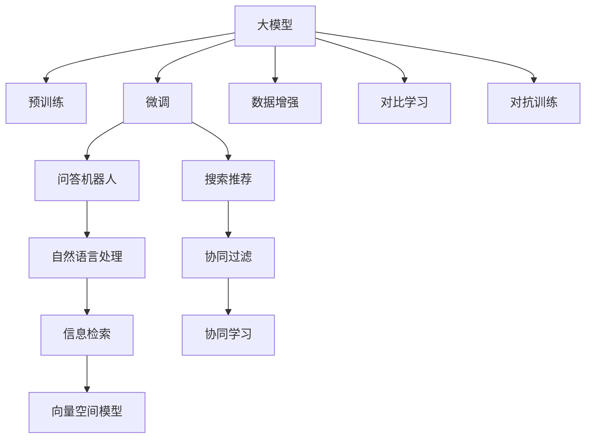

                 

# 大模型问答机器人与搜索推荐的互补性

## 1. 背景介绍

在人工智能领域，无论是NLP还是推荐系统，都面临着如何高效、准确地理解和处理海量数据的问题。传统的基于规则和手工特征工程的解决方案，随着数据量和任务复杂度的提升，显得愈发力不从心。而基于大模型的方法，通过预训练和微调，已经展现出强大的学习和推理能力，成为了推动AI技术进步的重要驱动力。在这篇文章中，我们将深入探讨大模型在问答机器人和搜索推荐两个领域的互补性，以及如何通过结合这些技术，实现更高效、更智能的应用。

## 2. 核心概念与联系

### 2.1 核心概念概述

在探索问答机器人和搜索推荐的互补性之前，我们先要了解这些核心概念：

- **大模型**：指通过大规模数据进行预训练的语言模型，如GPT、BERT等。这些模型具有高度的自监督学习能力，能够学习到丰富的语言表示和模式。
- **问答机器人**：指能够理解自然语言问题，并给出准确回答的系统。通常基于大模型进行微调，以提升对特定领域知识的理解和应用能力。
- **搜索推荐**：指在大量数据中找到用户感兴趣的信息。搜索推荐系统利用用户行为数据、物品属性等，预测用户可能感兴趣的内容。
- **数据增强**：通过增加数据量和多样性，提高模型的泛化能力和鲁棒性。
- **对比学习**：指使用对比学习方法，提高模型的表示能力和泛化能力。
- **对抗训练**：通过在训练中加入对抗样本，提高模型的鲁棒性和泛化能力。

这些概念之间存在着紧密的联系。大模型通过预训练学习到语言的一般规律，再通过微调针对具体领域或任务进行优化。问答机器人利用大模型的语言理解能力，实现对自然语言问题的理解与回答。搜索推荐系统则利用大模型的泛化能力，提升对用户行为的预测和推荐效果。

### 2.2 核心概念原理和架构的 Mermaid 流程图



这个流程图展示了从预训练到大模型微调，再到问答机器人和搜索推荐的过程。大模型通过预训练学习到语言的通用表示，再通过微调针对具体任务进行优化。问答机器人利用大模型的语言理解能力，实现自然语言理解与生成。搜索推荐系统则通过大模型的泛化能力，提升信息检索和协同过滤的效果。

## 3. 核心算法原理 & 具体操作步骤

### 3.1 算法原理概述

问答机器人和搜索推荐的互补性，主要体现在大模型的语言理解能力和搜索推荐系统的数据驱动能力上。

- **问答机器人**：利用大模型的语言理解能力，对自然语言问题进行理解，并根据预训练的知识库或特定的领域知识库，给出准确的回答。
- **搜索推荐**：利用大模型的泛化能力，对用户的行为和历史数据进行分析，预测用户可能感兴趣的内容，进行精准的推荐。

两者的互补性在于：
- 问答机器人能够处理复杂的自然语言问题，帮助用户快速获取信息，提升用户体验。
- 搜索推荐系统能够基于用户行为数据，推荐相关内容，增强信息获取的效率和准确性。

### 3.2 算法步骤详解

#### 3.2.1 问答机器人的实现步骤

1. **预训练**：选择合适的预训练语言模型，如BERT、GPT等，在通用数据集上进行预训练。
2. **微调**：在特定领域的数据集上进行微调，优化模型对领域知识的理解。
3. **推理**：对用户输入的自然语言问题进行推理，生成回答。

#### 3.2.2 搜索推荐的实现步骤

1. **数据收集**：收集用户行为数据、物品属性等。
2. **特征提取**：使用大模型对数据进行编码，提取高维特征。
3. **训练模型**：使用特征训练推荐模型，如协同过滤、深度学习等。
4. **推荐**：对用户进行推荐，输出相关内容。

### 3.3 算法优缺点

#### 3.3.1 问答机器人

**优点**：
- 能够理解自然语言问题，回答复杂、个性化的问题。
- 可以不断学习新的知识，提升回答的准确性。

**缺点**：
- 对数据质量有较高要求，需要高质量的训练数据。
- 回答速度较慢，难以处理大规模并发请求。

#### 3.3.2 搜索推荐

**优点**：
- 能够快速、高效地推荐相关内容。
- 可以处理大规模数据，具有较好的扩展性。

**缺点**：
- 推荐结果可能存在偏差，需要定期更新和优化。
- 对用户行为的预测可能不够准确，影响推荐效果。

### 3.4 算法应用领域

- **客服**：问答机器人可以处理客户的常见问题，提升服务效率。
- **电商**：搜索推荐系统可以推荐用户感兴趣的商品，提高销售额。
- **教育**：问答机器人可以回答学生的学习问题，推荐学习资源。
- **金融**：搜索推荐系统可以推荐投资建议，提供个性化的理财方案。

## 4. 数学模型和公式 & 详细讲解 & 举例说明

### 4.1 数学模型构建

假设问答机器人的预训练模型为 $M_{\theta}$，用户输入的自然语言问题为 $x$，答案为 $y$。搜索推荐的预训练模型为 $N_{\varphi}$，用户的历史行为数据为 $u$，目标物品为 $i$。

**问答机器人**：
- **输入**：$x$
- **输出**：$y$
- **损失函数**：$\mathcal{L}_{QA} = \frac{1}{N}\sum_{i=1}^N \ell(M_{\theta}(x),y_i)$

**搜索推荐**：
- **输入**：$u$
- **输出**：$i$
- **损失函数**：$\mathcal{L}_{RS} = \frac{1}{N}\sum_{i=1}^N \ell(N_{\varphi}(u),i_i)$

### 4.2 公式推导过程

对于问答机器人，假设 $M_{\theta}$ 为预训练模型，$M_{\hat{\theta}}$ 为微调后的模型。输入 $x$ 的编码为 $x_e$，输出 $y$ 的概率为 $P(y|x)$，训练数据集为 $D=\{(x_i,y_i)\}_{i=1}^N$。微调的优化目标为：

$$
\hat{\theta} = \mathop{\arg\min}_{\theta} \mathcal{L}_{QA} = \frac{1}{N}\sum_{i=1}^N \ell(M_{\hat{\theta}}(x_i),y_i)
$$

对于搜索推荐，假设 $N_{\varphi}$ 为预训练模型，$N_{\hat{\varphi}}$ 为微调后的模型。输入 $u$ 的编码为 $u_e$，目标物品 $i$ 的概率为 $P(i|u)$，训练数据集为 $D=\{(u_i,i_i)\}_{i=1}^N$。微调的优化目标为：

$$
\hat{\varphi} = \mathop{\arg\min}_{\varphi} \mathcal{L}_{RS} = \frac{1}{N}\sum_{i=1}^N \ell(N_{\hat{\varphi}}(u_i),i_i)
$$

### 4.3 案例分析与讲解

以电商平台的商品推荐为例，用户输入 "我想买一些智能手表"，系统通过问答机器人理解问题，推荐相关商品。同时，系统收集用户的历史浏览记录、购买记录等，利用搜索推荐系统，预测用户可能感兴趣的商品，并给出推荐。

## 5. 项目实践：代码实例和详细解释说明

### 5.1 开发环境搭建

1. **安装 Python**：确保Python环境为最新版本。
2. **安装 Transformers 库**：使用 `pip install transformers` 命令安装。
3. **安装 PyTorch**：使用 `pip install torch` 命令安装。
4. **配置 GPU 环境**：确保 GPU 环境配置正确，可以正常运行 PyTorch。

### 5.2 源代码详细实现

以基于 Transformer 的问答机器人为例，代码实现如下：

```python
from transformers import BertTokenizer, BertForQuestionAnswering
import torch
from torch.utils.data import DataLoader

# 加载数据集
tokenizer = BertTokenizer.from_pretrained('bert-base-uncased')
model = BertForQuestionAnswering.from_pretrained('bert-base-uncased')

# 定义数据集
class QADataset:
    def __init__(self, data):
        self.data = data
        self.tokenizer = tokenizer

    def __len__(self):
        return len(self.data)

    def __getitem__(self, index):
        question = self.data[index]['question']
        context = self.data[index]['context']
        answer_start = self.data[index]['answer_start']
        answer_end = self.data[index]['answer_end']
        inputs = tokenizer(question, context, return_tensors='pt', padding='max_length')
        targets = torch.tensor([[answer_start, answer_end]])
        return {'input_ids': inputs['input_ids'], 'attention_mask': inputs['attention_mask'], 'targets': targets}

# 定义训练和测试数据集
train_dataset = QADataset(train_data)
test_dataset = QADataset(test_data)

# 定义模型和优化器
device = torch.device('cuda' if torch.cuda.is_available() else 'cpu')
model.to(device)
optimizer = torch.optim.Adam(model.parameters(), lr=2e-5)

# 定义训练函数
def train_epoch(model, dataset, batch_size, optimizer):
    model.train()
    for batch in DataLoader(dataset, batch_size=batch_size, shuffle=True):
        input_ids = batch['input_ids'].to(device)
        attention_mask = batch['attention_mask'].to(device)
        targets = batch['targets'].to(device)
        optimizer.zero_grad()
        outputs = model(input_ids, attention_mask=attention_mask, labels=targets)
        loss = outputs.loss
        loss.backward()
        optimizer.step()
        print(f'Epoch: {epoch+1}, Loss: {loss.item()}')

# 定义测试函数
def evaluate(model, dataset, batch_size):
    model.eval()
    correct = 0
    total = 0
    with torch.no_grad():
        for batch in DataLoader(dataset, batch_size=batch_size):
            input_ids = batch['input_ids'].to(device)
            attention_mask = batch['attention_mask'].to(device)
            targets = batch['targets'].to(device)
            outputs = model(input_ids, attention_mask=attention_mask, labels=targets)
            _, preds = torch.max(outputs.logits, dim=2)
            total += targets.size(0)
            correct += (preds == targets).sum().item()
    return correct / total

# 训练模型
for epoch in range(num_epochs):
    train_epoch(model, train_dataset, batch_size, optimizer)
    accuracy = evaluate(model, test_dataset, batch_size)
    print(f'Epoch: {epoch+1}, Accuracy: {accuracy:.4f}')

# 输出结果
print(f'Final Accuracy: {evaluate(model, test_dataset, batch_size):.4f}')
```

### 5.3 代码解读与分析

上述代码中，我们使用了 Transformers 库提供的预训练模型 `BertForQuestionAnswering` 和 `BertTokenizer`，分别用于问答机器人和预训练模型的编码。在训练函数 `train_epoch` 中，我们使用了 PyTorch 的 DataLoader 来加载数据集，并使用 Adam 优化器进行参数更新。在测试函数 `evaluate` 中，我们计算了模型在测试集上的准确率，并打印输出。

## 6. 实际应用场景

### 6.1 电商推荐

在电商平台上，搜索推荐系统可以根据用户的历史浏览和购买行为，推荐相关商品。同时，问答机器人可以回答用户关于商品的信息，提供更详细的商品介绍和用户评价，提升用户体验。

### 6.2 智能客服

智能客服系统可以使用问答机器人解答用户常见问题，提供快速、准确的答案。同时，系统可以记录用户的问题和回答，用于后续的训练和优化。

### 6.3 金融理财

金融理财应用可以使用搜索推荐系统推荐投资组合和理财方案，同时使用问答机器人回答用户关于投资和理财的疑问，提供个性化的建议。

## 7. 工具和资源推荐

### 7.1 学习资源推荐

- **《深度学习》课程**：由斯坦福大学提供，涵盖深度学习的基本概念和算法。
- **《自然语言处理基础》**：讲解自然语言处理的基本原理和技术。
- **Transformers 官方文档**：提供了丰富的预训练模型和代码示例。
- **Hugging Face 博客**：提供了大量的 NLP 应用案例和最佳实践。

### 7.2 开发工具推荐

- **Jupyter Notebook**：交互式的数据分析和代码实现工具。
- **TensorBoard**：可视化训练过程和模型性能的工具。
- **PyTorch Lightning**：简化深度学习模型训练的框架。

### 7.3 相关论文推荐

- **Attention is All You Need**：介绍 Transformer 模型的经典论文。
- **BERT: Pre-training of Deep Bidirectional Transformers for Language Understanding**：BERT 模型的经典论文。
- **Reinforced Learning for Recommendation**：基于强化学习的推荐系统论文。
- **Neural Conversation Models**：基于神经网络的对话系统论文。

## 8. 总结：未来发展趋势与挑战

### 8.1 研究成果总结

本文探讨了大模型在问答机器人和搜索推荐两个领域的互补性，并详细讲解了相关核心算法和操作步骤。通过结合问答机器人和搜索推荐，能够提升信息获取的效率和准确性，提升用户体验。

### 8.2 未来发展趋势

- **大模型技术的发展**：未来的预训练语言模型将更加庞大，包含更多语言知识和常识。这将提升问答机器人和搜索推荐系统的能力。
- **多模态数据融合**：将文本数据与其他模态数据（如图像、语音）进行融合，提升系统的综合能力。
- **联邦学习和隐私保护**：在保护用户隐私的前提下，利用联邦学习技术进行模型训练和优化。

### 8.3 面临的挑战

- **数据隐私和安全**：在处理用户数据时，需要确保数据隐私和安全。
- **计算资源**：大模型的训练和推理需要大量计算资源，需要优化算法和硬件配置。
- **模型鲁棒性**：需要提高模型的鲁棒性和泛化能力，避免过拟合。

### 8.4 研究展望

- **跨领域知识融合**：将不同领域的数据和知识进行融合，提升系统的综合能力。
- **可解释性**：提高模型的可解释性，增强用户信任和接受度。
- **实时化**：实现模型的实时化部署和优化，提升用户体验。

## 9. 附录：常见问题与解答

**Q1: 问答机器人和搜索推荐在技术上有哪些差异？**

A: 问答机器人主要依赖大模型的语言理解能力，对自然语言问题进行理解，并给出回答。搜索推荐系统则主要依赖大模型的泛化能力，对用户行为数据进行分析和推荐。

**Q2: 大模型在问答机器人和搜索推荐中的应用是否存在冲突？**

A: 不存在冲突，两者可以互补。问答机器人可以回答用户复杂问题，搜索推荐系统可以推荐相关内容，提高信息获取的效率和准确性。

**Q3: 问答机器人和搜索推荐在实际应用中需要注意哪些问题？**

A: 需要注意用户隐私保护、数据质量、计算资源等问题。同时，需要不断优化算法和模型，提高系统的性能和可靠性。

---

作者：禅与计算机程序设计艺术 / Zen and the Art of Computer Programming

