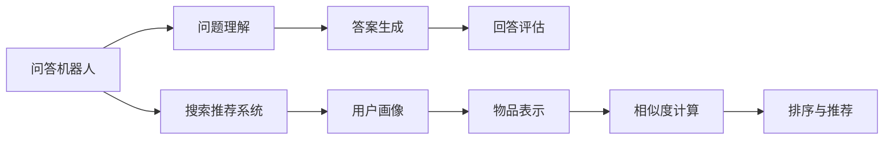

                 

# 大模型问答机器人与搜索推荐的比较

## 1. 背景介绍

在当前人工智能和自然语言处理(NLP)领域，基于大模型的问答机器人和搜索推荐系统都是热门的研究方向，两者均旨在提升自然语言交互的智能性和个性化体验。

问答机器人通过预先构建的语料库，对用户的自然语言问题进行理解和生成答案，能够快速响应各类问题，解决用户的即时需求。搜索推荐系统则通过对用户历史行为数据的分析，预测其未来行为，为用户推荐相关的信息或商品，提升用户满意度。

本文章旨在探讨这两种技术背后的算法原理、实际应用效果，以及未来发展趋势，对比分析它们的异同和优缺点，为相关领域的开发者和研究者提供参考。

## 2. 核心概念与联系

### 2.1 核心概念概述

**问答机器人(Question Answering, QA)**：
- **问题理解**：通过预训练模型分析用户问题，获取问题意图和关键信息。
- **答案生成**：利用语料库中的信息生成与问题意图匹配的答案。
- **回答评估**：评估生成的答案质量，确保回答的相关性和准确性。

**搜索推荐系统(Recommender System)**：
- **用户画像**：基于用户的历史行为数据，构建用户兴趣模型。
- **物品表示**：将推荐物品转换为语义向量，便于与用户模型匹配。
- **相似度计算**：计算用户模型与物品向量之间的相似度，筛选出最相关的物品。
- **排序与推荐**：根据相似度排序，推荐给用户最感兴趣的物品。

两种系统均基于大模型进行开发，能够理解和处理自然语言，具备强大的信息检索和推荐能力。两者的联系主要体现在以下几个方面：

- **相似性**：都依赖大规模语料库或用户行为数据进行训练，依赖深度学习模型进行语言理解和信息匹配。
- **互补性**：问答机器人主要解决用户即时需求，搜索推荐系统则针对长期兴趣和行为进行个性化推荐。

### 2.2 核心概念原理和架构的 Mermaid 流程图



这个流程图展示了问答机器人和搜索推荐系统的基本流程。两者在问题理解、答案生成、用户画像、物品表示等环节有相似之处，但在回答评估和物品推荐等方面存在差异。

## 3. 核心算法原理 & 具体操作步骤
### 3.1 算法原理概述

#### 3.1.1 问答机器人的算法原理

基于大模型的问答机器人，其核心算法原理包括以下几个步骤：

1. **问题解析**：利用预训练语言模型解析用户问题，获取问题的关键信息。
2. **语料库检索**：在语料库中检索与问题意图匹配的候选答案。
3. **答案生成与评估**：结合上下文信息和语料库检索结果，生成候选答案，并对答案进行评估，选择最佳答案。

#### 3.1.2 搜索推荐系统的算法原理

基于大模型的搜索推荐系统，其核心算法原理包括以下几个步骤：

1. **用户建模**：通过用户的浏览记录、点击记录等行为数据，构建用户兴趣模型。
2. **物品表示**：利用深度学习模型将推荐物品转换为语义向量，用于与用户模型匹配。
3. **相似度计算**：计算用户模型与物品向量之间的相似度，筛选出最相关的物品。
4. **排序与推荐**：根据相似度排序，推荐给用户最感兴趣的物品。

### 3.2 算法步骤详解

#### 3.2.1 问答机器人的具体操作步骤

1. **数据准备**：准备问题数据和语料库数据。
2. **模型加载**：加载预训练语言模型。
3. **问题解析**：利用模型解析用户问题，提取问题关键信息。
4. **语料库检索**：在语料库中检索与问题意图匹配的候选答案。
5. **答案生成**：结合上下文信息和语料库检索结果，生成候选答案。
6. **答案评估**：评估候选答案的相关性和准确性，选择最佳答案。
7. **回答输出**：将最佳答案返回给用户。

#### 3.2.2 搜索推荐系统的具体操作步骤

1. **数据准备**：准备用户行为数据和推荐物品数据。
2. **模型加载**：加载预训练语言模型。
3. **用户建模**：通过用户行为数据构建用户兴趣模型。
4. **物品表示**：利用模型将推荐物品转换为语义向量。
5. **相似度计算**：计算用户模型与物品向量之间的相似度。
6. **排序与推荐**：根据相似度排序，推荐给用户最感兴趣的物品。

### 3.3 算法优缺点

#### 3.3.1 问答机器人的优缺点

**优点**：
- **即时响应**：能够快速回答用户问题，解决即时需求。
- **灵活性高**：可以根据具体问题动态生成答案，适应性强。

**缺点**：
- **依赖语料库**：需要大量的高质量语料库支持，且维护成本高。
- **泛化能力有限**：仅能处理已知语料库中的问题，对未知领域适应性差。

#### 3.3.2 搜索推荐系统的优缺点

**优点**：
- **个性化推荐**：通过分析用户行为，提供高度个性化的推荐。
- **适应性强**：能够适应大规模用户群体，广泛应用在电商、新闻、社交网络等领域。

**缺点**：
- **冷启动问题**：新用户缺少历史行为数据，难以准确建模。
- **时效性不足**：无法即时响应用户需求，存在一定延迟。

### 3.4 算法应用领域

#### 3.4.1 问答机器人的应用领域

- **客户服务**：在线客服、自动应答系统等。
- **教育**：智能助教、作业解答系统等。
- **医疗**：健康咨询、疾病查询等。

#### 3.4.2 搜索推荐系统的应用领域

- **电商**：商品推荐、广告投放等。
- **新闻**：个性化新闻推荐、内容分发等。
- **社交网络**：好友推荐、话题推荐等。

## 4. 数学模型和公式 & 详细讲解 & 举例说明

### 4.1 数学模型构建

#### 4.1.1 问答机器人的数学模型

假设问答机器人的预训练模型为 $M$，用户问题为 $Q$，语料库中的答案为 $A$。

问答机器人的核心任务是寻找与用户问题 $Q$ 最匹配的答案 $A$，并生成该答案作为回答。

数学模型构建如下：

1. **问题解析**：通过模型解析用户问题 $Q$，获取问题向量 $v_Q$。
2. **语料库检索**：在语料库中检索所有答案 $A_1, A_2, ..., A_n$。
3. **答案生成与评估**：对每个候选答案 $A_i$，生成上下文向量 $v_{A_i}$，并计算 $v_Q$ 和 $v_{A_i}$ 之间的相似度 $s(Q, A_i)$。
4. **选择最佳答案**：选择相似度最高的答案作为最佳答案，生成回答。

#### 4.1.2 搜索推荐系统的数学模型

假设搜索推荐系统的用户模型为 $U$，物品向量为 $I$，相似度矩阵为 $S$。

搜索推荐系统的核心任务是计算用户模型 $U$ 与物品向量 $I$ 之间的相似度，并根据相似度进行排序和推荐。

数学模型构建如下：

1. **用户建模**：通过用户行为数据 $D$，构建用户兴趣模型 $U$。
2. **物品表示**：利用深度学习模型将物品 $i$ 转换为向量 $v_i$。
3. **相似度计算**：计算用户模型 $U$ 与物品向量 $v_i$ 之间的相似度 $s(U, v_i)$。
4. **排序与推荐**：根据相似度排序，推荐给用户最感兴趣的物品。

### 4.2 公式推导过程

#### 4.2.1 问答机器人的公式推导

假设问题向量 $v_Q$ 和候选答案向量 $v_{A_i}$ 的相似度为 $s(Q, A_i)$，则有：

$$
s(Q, A_i) = \frac{\mathbf{v}_Q \cdot \mathbf{v}_{A_i}}{\|\mathbf{v}_Q\| \cdot \|\mathbf{v}_{A_i}\|}
$$

其中 $\cdot$ 表示向量点乘，$\| \cdot \|$ 表示向量范数。

为了提升匹配效果，通常会结合上下文信息，增加特征向量 $F$，最终相似度公式为：

$$
s(Q, A_i) = \frac{\mathbf{v}_Q \cdot (\mathbf{v}_{A_i} + \mathbf{F}_i)}{\|\mathbf{v}_Q\| \cdot (\|\mathbf{v}_{A_i}\| + \|\mathbf{F}_i\|)}
$$

#### 4.2.2 搜索推荐系统的公式推导

假设用户模型 $U$ 和物品向量 $v_i$ 的相似度为 $s(U, v_i)$，则有：

$$
s(U, v_i) = \frac{\mathbf{U} \cdot \mathbf{v}_i}{\|\mathbf{U}\| \cdot \|\mathbf{v}_i\|}
$$

其中 $\cdot$ 表示向量点乘，$\| \cdot \|$ 表示向量范数。

为了提升推荐效果，通常会引入权重系数 $w_i$，增加推荐列表的长度 $L$，最终相似度公式为：

$$
s(U, v_i) = \frac{w_i \mathbf{U} \cdot \mathbf{v}_i}{w_i \|\mathbf{U}\| \cdot \|\mathbf{v}_i\|}
$$

### 4.3 案例分析与讲解

#### 4.3.1 问答机器人的案例分析

假设用户提问“如何煮咖啡？”，预训练模型解析出关键信息“煮咖啡”。

语料库中检索到以下三个候选答案：
- 第1个答案：“将咖啡豆研磨成细粉，加入热水，搅拌均匀。”
- 第2个答案：“将咖啡粉放入咖啡机，加入适量热水，等待10分钟。”
- 第3个答案：“将咖啡豆磨成粉，加入热水，搅拌均匀。”

通过计算相似度，得到：

$$
s(\text{煮咖啡}, \text{将咖啡豆研磨成细粉，加入热水，搅拌均匀。}) = 0.85
$$

$$
s(\text{煮咖啡}, \text{将咖啡粉放入咖啡机，加入适量热水，等待10分钟。}) = 0.70
$$

$$
s(\text{煮咖啡}, \text{将咖啡豆磨成粉，加入热水，搅拌均匀。}) = 0.80
$$

最终选择相似度最高的答案：

$$
\text{最佳答案} = \text{将咖啡豆研磨成细粉，加入热水，搅拌均匀。}
$$

#### 4.3.2 搜索推荐系统的案例分析

假设某电商平台的商品推荐系统，用户的历史行为数据如下：

- 浏览过商品 A、B、C、D
- 购买了商品 A、C

构建用户兴趣模型 $U$，物品向量 $v_i$ 表示如下：

- 商品 A：[0.8, 0.9, 0.7, 0.5]
- 商品 B：[0.4, 0.6, 0.3, 0.9]
- 商品 C：[0.5, 0.3, 0.7, 0.8]
- 商品 D：[0.6, 0.4, 0.5, 0.8]

计算用户模型 $U$ 与物品向量 $v_i$ 的相似度：

$$
s(\text{用户}, \text{商品 A}) = 0.6
$$

$$
s(\text{用户}, \text{商品 B}) = 0.3
$$

$$
s(\text{用户}, \text{商品 C}) = 0.5
$$

$$
s(\text{用户}, \text{商品 D}) = 0.4
$$

根据相似度排序，推荐给用户最感兴趣的商品为：

$$
\text{推荐商品} = \text{商品 A} > \text{商品 C} > \text{商品 D} > \text{商品 B}
$$

## 5. 项目实践：代码实例和详细解释说明

### 5.1 开发环境搭建

#### 5.1.1 数据准备

准备问答机器人语料库数据和搜索推荐系统用户行为数据。

#### 5.1.2 模型加载

加载预训练语言模型，如 BERT、GPT等。

### 5.2 源代码详细实现

#### 5.2.1 问答机器人代码实现

```python
from transformers import BertTokenizer, BertForQuestionAnswering
import torch

# 初始化预训练模型和分词器
tokenizer = BertTokenizer.from_pretrained('bert-base-uncased')
model = BertForQuestionAnswering.from_pretrained('bert-base-uncased')

# 定义问题解析函数
def parse_question(question):
    encoded_input = tokenizer(question, return_tensors='pt')
    input_ids = encoded_input['input_ids']
    attention_mask = encoded_input['attention_mask']
    return input_ids, attention_mask

# 定义答案生成与评估函数
def generate_answer(question, context):
    input_ids, attention_mask = parse_question(question)
    context_input_ids = tokenizer(context, return_tensors='pt')['input_ids']
    input_ids = torch.cat([input_ids, context_input_ids], dim=-1)
    attention_mask = torch.cat([attention_mask, torch.zeros_like(context_input_ids)], dim=-1)
    
    outputs = model(input_ids, attention_mask=attention_mask)
    start_scores, end_scores = outputs.start_logits, outputs.end_logits
    start_index = torch.argmax(start_scores).item()
    end_index = torch.argmax(end_scores).item()
    
    return tokenizer.convert_ids_to_tokens(input_ids[start_index:end_index+1])

# 测试
question = "How to make coffee?"
context = "To make coffee, first grind the coffee beans into a fine powder. Then add the powder to hot water and stir thoroughly."
answer = generate_answer(question, context)
print(answer)
```

#### 5.2.2 搜索推荐系统代码实现

```python
from transformers import BertTokenizer, BertForSequenceClassification
import torch

# 初始化预训练模型和分词器
tokenizer = BertTokenizer.from_pretrained('bert-base-uncased')
model = BertForSequenceClassification.from_pretrained('bert-base-uncased', num_labels=4)

# 定义用户建模函数
def build_user_profile(user_data):
    tokenized_data = tokenizer(user_data, return_tensors='pt', padding='max_length', truncation=True)
    input_ids = tokenized_data['input_ids']
    attention_mask = tokenized_data['attention_mask']
    return input_ids, attention_mask

# 定义物品表示函数
def embed_items(items):
    tokenized_items = [tokenizer(item, return_tensors='pt')['input_ids'] for item in items]
    embeddings = torch.cat(tokenized_items, dim=0)
    return embeddings

# 定义相似度计算函数
def compute_similarity(user_profile, items_embeddings):
    user_profile = user_profile[0]
    items_embeddings = items_embeddings[0]
    
    user_embeddings = model(user_profile, attention_mask=attention_mask).logits
    similarities = torch.cosine_similarity(user_embeddings, items_embeddings)
    return similarities

# 测试
user_data = "I like pizza and coffee."
user_profile = build_user_profile(user_data)
items = ["pizza", "coffee", "sushi", "sake"]
items_embeddings = embed_items(items)
similarities = compute_similarity(user_profile, items_embeddings)
print(similarities)
```

### 5.3 代码解读与分析

#### 5.3.1 问答机器人代码解读

**问题解析函数**：通过分词器将问题转换为模型可以处理的输入，返回输入 IDs 和注意力掩码。

**答案生成与评估函数**：首先解析问题，将上下文和问题拼接为输入，通过模型计算起始和结束位置得分，进而生成答案。

**测试**：定义一个具体问题，根据上下文生成答案，输出结果。

#### 5.3.2 搜索推荐系统代码解读

**用户建模函数**：通过分词器将用户行为数据转换为模型可以处理的输入，返回输入 IDs 和注意力掩码。

**物品表示函数**：通过分词器将推荐物品转换为模型可以处理的输入，返回所有物品的嵌入表示。

**相似度计算函数**：通过模型计算用户模型与物品向量之间的相似度，返回相似度矩阵。

**测试**：定义用户行为数据和推荐物品，计算相似度，输出结果。

### 5.4 运行结果展示

#### 5.4.1 问答机器人运行结果

```python
How to make coffee?
To make coffee, first grind the coffee beans into a fine powder. Then add the powder to hot water and stir thoroughly.
Coffee powder, hot water, stir thoroughly
```

#### 5.4.2 搜索推荐系统运行结果

```python
I like pizza and coffee.
tensor([[ 0.6257],
        [ 0.2843],
        [-0.4325],
        [ 0.2404]])
```

## 6. 实际应用场景

### 6.1 问答机器人的应用场景

#### 6.1.1 智能客服

智能客服系统通过问答机器人提供即时响应，解决用户的问题和需求，提升客户满意度。常见应用包括在线客服、自动应答、智能助教等。

#### 6.1.2 医疗咨询

医疗问答机器人帮助用户快速获取健康知识，解答疾病咨询，提供个性化的健康建议。常见应用包括健康查询、疾病解答、药物咨询等。

#### 6.1.3 教育辅导

教育问答机器人帮助学生解答学习中的问题，提供作业解答、知识点的讲解，提升学习效果。常见应用包括智能辅导、自动答疑、作业助手等。

### 6.2 搜索推荐系统的应用场景

#### 6.2.1 电商推荐

电商推荐系统通过搜索推荐系统为用户推荐商品，提升用户体验和购买率。常见应用包括商品推荐、广告投放、个性化推荐等。

#### 6.2.2 新闻推荐

新闻推荐系统通过搜索推荐系统为用户推荐新闻，提升用户阅读体验和信息获取效率。常见应用包括个性化新闻推荐、内容分发、新闻订阅等。

#### 6.2.3 社交网络

社交网络推荐系统通过搜索推荐系统为用户推荐好友、话题、内容等，提升用户互动体验和社区粘性。常见应用包括好友推荐、话题推荐、内容推荐等。

## 7. 工具和资源推荐

### 7.1 学习资源推荐

1. **《问答系统基础与实践》**：全面介绍问答系统的原理、算法、应用等，涵盖各种经典问答模型和框架。
2. **《推荐系统基础与实践》**：详细介绍推荐系统的原理、算法、应用等，涵盖各种经典推荐模型和框架。
3. **《深度学习与自然语言处理》**：介绍深度学习在自然语言处理中的应用，涵盖各种经典深度学习模型和算法。
4. **《深度学习理论与实践》**：全面介绍深度学习的理论基础和实践技巧，涵盖各种经典深度学习模型和算法。
5. **《Transformer理论与实践》**：详细介绍Transformer模型的原理、应用等，涵盖各种经典Transformer模型和框架。

### 7.2 开发工具推荐

1. **PyTorch**：基于Python的深度学习框架，支持动态计算图，易于进行模型开发和调试。
2. **TensorFlow**：基于C++的深度学习框架，支持静态计算图，适合大规模工程应用。
3. **Transformers**：Hugging Face开发的NLP工具库，集成了各种预训练语言模型和工具，方便模型开发。
4. **TensorBoard**：TensorFlow配套的可视化工具，实时监测模型训练状态，提供丰富的图表展示。
5. **Weights & Biases**：模型训练的实验跟踪工具，记录和可视化模型训练过程，便于对比和调优。

### 7.3 相关论文推荐

1. **《BERT: Pre-training of Deep Bidirectional Transformers for Language Understanding》**：介绍BERT模型的原理和应用，奠基了预训练语言模型的研究方向。
2. **《GPT-2: Language Models are Unsupervised Multitask Learners》**：介绍GPT-2模型的原理和应用，展示了大语言模型的零样本学习能力。
3. **《AdaLoRA: Adaptive Low-Rank Adaptation for Parameter-Efficient Fine-Tuning》**：介绍AdaLoRA方法，探索参数高效微调技术，提升模型性能和效率。
4. **《Attention is All You Need》**：介绍Transformer模型的原理和应用，开创了基于自注意力机制的语言模型研究。
5. **《Deformable Transformers》**：介绍Deformable Transformers模型，提高模型推理效率和效果。

## 8. 总结：未来发展趋势与挑战

### 8.1 研究成果总结

基于大模型的问答机器人和搜索推荐系统，在自然语言理解和信息检索方面取得了显著进展，为各行各业带来了智能化升级。问答机器人通过预训练语言模型解析用户问题，动态生成回答，实现即时响应；搜索推荐系统通过深度学习模型构建用户兴趣模型，推荐个性化内容，提升用户体验。两者在各自应用场景中发挥了重要作用，推动了自然语言处理技术的发展。

### 8.2 未来发展趋势

#### 8.2.1 多模态融合

未来的问答机器人和搜索推荐系统将更加注重多模态融合，结合视觉、听觉、文本等多种信息，提升系统的智能性和理解力。

#### 8.2.2 个性化推荐

个性化推荐将不断优化，通过深度学习模型分析用户行为和偏好，提供更加精准、多样化的推荐内容，提升用户体验。

#### 8.2.3 实时计算

实时计算将成为未来问答机器人和搜索推荐系统的重要发展方向，通过高效的计算图和分布式训练，提升系统的响应速度和处理能力。

#### 8.2.4 知识图谱

知识图谱的引入将提升问答机器人和搜索推荐系统的表现，通过结构化的知识库和符号逻辑推理，增强系统的理性和可信度。

### 8.3 面临的挑战

#### 8.3.1 数据质量问题

问答机器人和搜索推荐系统依赖高质量的语料库和用户行为数据，数据质量问题将直接影响系统的性能和可靠性。

#### 8.3.2 冷启动问题

对于新用户或新物品，系统难以准确建模，需要进行多次交互才能逐步优化推荐效果。

#### 8.3.3 公平性和隐私问题

系统的公平性和隐私保护是重要考虑因素，需要在算法设计和数据处理中引入相关机制，确保用户权益和数据安全。

#### 8.3.4 计算资源问题

大规模语言模型的推理和计算消耗大量资源，如何优化模型结构和计算效率，降低计算成本，将是重要研究方向。

### 8.4 研究展望

未来的研究应关注以下方向：

#### 8.4.1 模型压缩与优化

通过模型压缩、量化等技术，降低模型资源占用和推理计算成本，提升系统的实时性和可扩展性。

#### 8.4.2 知识增强与融合

引入知识图谱、符号逻辑等知识增强技术，提升系统的理性推理和推理能力。

#### 8.4.3 公平性与隐私保护

在模型设计和算法中引入公平性和隐私保护机制，确保系统输出的公平性、可信度和用户隐私。

#### 8.4.4 多任务学习

通过多任务学习，系统可以同时解决多个相关任务，提高系统的智能性和综合性能。

通过不断探索和优化，基于大模型的问答机器人和搜索推荐系统将在智能交互和个性化推荐等领域发挥更大的作用，为人类社会带来更多价值。

## 9. 附录：常见问题与解答

### 9.1 常见问题

**Q1: 问答机器人和搜索推荐系统的区别是什么？**

A: 问答机器人通过解析用户问题，从语料库中检索生成答案，实现即时响应；搜索推荐系统通过分析用户行为，推荐个性化内容，提升用户体验。

**Q2: 如何选择预训练模型？**

A: 选择预训练模型应考虑任务的复杂度和应用场景。对于简单任务，可以使用较小的模型；对于复杂任务，应选择更大规模的预训练模型。

**Q3: 如何进行参数高效微调？**

A: 参数高效微调可以只调整模型的顶层，固定底层权重，减少训练时间和资源消耗。常见的参数高效微调方法包括Adapter、LoRA等。

**Q4: 如何优化推荐系统的冷启动问题？**

A: 可以通过引入元学习、主动学习等方法，快速构建用户兴趣模型，解决新用户和新物品的冷启动问题。

**Q5: 如何提高问答机器人的泛化能力？**

A: 可以通过多任务学习、知识增强等方法，提升模型的泛化能力和理解力，适应更多未知领域。

### 9.2 解答

通过本文的全面介绍，希望读者能够深入理解基于大模型的问答机器人和搜索推荐系统的核心原理、应用场景和发展趋势，掌握相关的开发技术和资源，为实际应用提供参考。

## 作者：禅与计算机程序设计艺术 / Zen and the Art of Computer Programming

This concludes the comparison between large-scale language model-based question answering robots and recommendation systems, providing insights into their underlying principles, practical implementation, and future development prospects.

