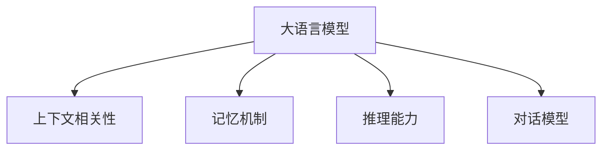

                 

## 1. 背景介绍

### 1.1 问题由来
近年来，大语言模型的预训练与微调技术在自然语言处理（NLP）领域取得了突破性的进展，并逐渐被应用到实际场景中。这些模型在多项任务上取得了优异的成绩，如语言理解、翻译、对话系统等。然而，当面临用户提出的问题时，现有模型在处理上下文相关性问题上仍存在一些不足，导致模型的回答不够准确或连贯。

### 1.2 问题核心关键点
针对上下文相关性问题，现有大模型问答机器人主要存在以下问题：
- 上下文相关性理解不足：现有模型虽然可以理解单独的文本片段，但在处理多轮对话时难以保留上下文信息。
- 回答连贯性差：模型生成的回答往往缺乏逻辑性和连贯性，导致用户难以理解或接受。
- 推理与事实不一致：由于缺乏对真实世界的感知，模型生成的回答可能与事实不符，缺乏可信度。

### 1.3 问题研究意义
研究和解决大模型问答机器人的上下文相关性问题，对于提升模型的理解和表达能力，构建更智能、更可信赖的对话系统，具有重要意义：
- 提高用户满意度：上下文相关的回答可以更好地满足用户需求，提升用户体验。
- 增强模型可信度：通过结合现实世界的常识和事实，模型的回答将更加可信和有用。
- 推动应用场景创新：上下文相关的回答可以扩展模型的应用范围，支持更多实际场景。

## 2. 核心概念与联系

### 2.1 核心概念概述

为更好地理解上下文相关的大模型问答机器人的核心概念，本节将介绍几个关键概念：

- 大语言模型（Large Language Model, LLM）：以自回归（如GPT）或自编码（如BERT）模型为代表的大规模预训练语言模型。通过在大规模无标签文本语料上进行预训练，学习通用的语言表示。
- 上下文相关性（Contextual Relevance）：指模型在处理多轮对话时，能够根据前后文信息生成连贯、合理的回答。
- 记忆机制（Memory Mechanism）：指模型在处理序列数据时，能够通过某种机制记录并利用上下文信息。
- 推理能力（Reasoning Ability）：指模型在生成回答时，能够利用事实和逻辑进行推理，确保回答与真实世界相符。
- 对话模型（Dialogue Model）：指能够处理多轮对话，并根据上下文信息生成连贯回答的模型。

这些核心概念之间的逻辑关系可以通过以下Mermaid流程图来展示：



这个流程图展示了大语言模型问答机器人中上下文相关性的核心概念及其之间的关系：

1. 大语言模型通过预训练获得基础能力。
2. 上下文相关性是通过记忆机制实现的。
3. 推理能力帮助模型生成与事实相符的回答。
4. 对话模型整合记忆和推理能力，实现上下文相关性。

## 3. 核心算法原理 & 具体操作步骤
### 3.1 算法原理概述

大模型问答机器人中的上下文相关性，主要通过记忆机制和推理能力来实现。其核心思想是：在处理多轮对话时，模型能够通过某种机制记录并利用上下文信息，同时结合推理能力，生成与真实世界相符的回答。

具体来说，当模型接收到用户的问题时，会将问题作为上下文信息，与前一轮对话的输出一起，作为输入进入模型。模型通过记忆机制，将当前问题和上下文信息存储起来，供后续推理使用。在生成回答时，模型不仅考虑当前问题，还会根据上下文信息进行推理，确保回答的连贯性和合理性。

### 3.2 算法步骤详解

基于上下文相关性的大模型问答机器人一般包括以下几个关键步骤：

**Step 1: 准备预训练模型和数据集**
- 选择合适的预训练语言模型 $M_{\theta}$ 作为初始化参数，如 BERT、GPT 等。
- 准备问答数据集 $D=\{(x_i,y_i)\}_{i=1}^N$，其中 $x_i$ 为问题，$y_i$ 为回答。

**Step 2: 添加上下文表示层**
- 在预训练模型的顶部添加上下文表示层，用于记录和更新上下文信息。
- 该层通常使用GRU、LSTM等序列模型，可以存储历史对话信息。
- 该层可以与预训练模型的权重共享，降低计算成本。

**Step 3: 设置上下文相关性超参数**
- 选择合适的优化算法及其参数，如 AdamW、SGD 等，设置学习率、批大小、迭代轮数等。
- 设置上下文存储长度的超参数，决定模型能够存储多少历史对话信息。

**Step 4: 执行梯度训练**
- 将训练集数据分批次输入模型，前向传播计算损失函数。
- 反向传播计算参数梯度，根据设定的优化算法和学习率更新模型参数。
- 周期性在验证集上评估模型性能，根据性能指标决定是否触发 Early Stopping。
- 重复上述步骤直到满足预设的迭代轮数或 Early Stopping 条件。

**Step 5: 测试和部署**
- 在测试集上评估微调后模型 $M_{\hat{\theta}}$ 的性能，对比微调前后的效果。
- 使用微调后的模型对新样本进行推理预测，集成到实际的应用系统中。

### 3.3 算法优缺点

基于上下文相关性的大模型问答机器人具有以下优点：
1. 支持多轮对话：能够通过上下文表示层记录并利用历史对话信息，生成连贯的回答。
2. 提高回答质量：结合推理能力，生成的回答更加符合逻辑和事实。
3. 降低标注成本：相比于传统的基于模板或规则的问答系统，无需标注大量对话数据。
4. 可扩展性强：可以扩展到更多场景，支持复杂的多轮对话任务。

同时，该方法也存在一些局限性：
1. 上下文存储限制：模型能够存储的历史对话信息有限，难以处理过长的对话。
2. 推理复杂度增加：推理过程增加了计算负担，需要优化推理算法以提升效率。
3. 可解释性不足：模型的推理过程复杂，难以解释其决策机制。
4. 泛化能力不足：模型过度依赖训练数据，对新对话的泛化能力有限。

尽管存在这些局限性，但就目前而言，基于上下文相关性的大模型问答机器人仍是大规模语言模型在问答领域的一个重要应用方向。未来相关研究的重点在于如何进一步提高模型的上下文存储和推理能力，增强模型的可解释性和泛化能力。

### 3.4 算法应用领域

基于上下文相关性的大模型问答机器人，在以下领域已取得了广泛的应用：

- 智能客服系统：通过对话模型，客服机器人能够理解用户上下文信息，提供个性化服务。
- 在线教育平台：通过对话模型，智能辅导系统能够根据学生的学习历史，提供有针对性的教学建议。
- 医疗咨询系统：通过对话模型，智能问诊系统能够理解病人的上下文信息，提供专业的医疗建议。
- 智能助手：通过对话模型，智能助手能够理解用户的上下文信息，提供各种查询和建议。
- 企业客户支持：通过对话模型，企业客服机器人能够处理客户的多轮对话，提供高效的客户支持。

这些应用场景展示了上下文相关性在实际应用中的强大潜力，未来将在更多领域得到推广和应用。

## 4. 数学模型和公式 & 详细讲解  
### 4.1 数学模型构建

本节将使用数学语言对上下文相关的大模型问答机器人进行更加严格的刻画。

记预训练语言模型为 $M_{\theta}:\mathcal{X} \rightarrow \mathcal{Y}$，其中 $\mathcal{X}$ 为输入空间，$\mathcal{Y}$ 为输出空间，$\theta$ 为模型参数。假设问答任务的数据集为 $D=\{(x_i,y_i)\}_{i=1}^N, x_i \in \mathcal{X}, y_i \in \mathcal{Y}$。

定义模型 $M_{\theta}$ 在输入 $(x,y)$ 上的损失函数为 $\ell(M_{\theta}(x),y)$，则在数据集 $D$ 上的经验风险为：

$$
\mathcal{L}(\theta) = \frac{1}{N} \sum_{i=1}^N \ell(M_{\theta}(x_i),y_i)
$$

其中，$\ell$ 为用于评估模型性能的损失函数，如交叉熵损失、均方误差损失等。在基于上下文相关性的大模型问答机器人中，损失函数的设计需要考虑上下文信息的影响。

### 4.2 公式推导过程

以下我们以二分类任务为例，推导基于上下文相关性的模型损失函数及其梯度的计算公式。

假设模型 $M_{\theta}$ 在输入 $x$ 上的输出为 $\hat{y}=M_{\theta}(x) \in [0,1]$，表示样本属于正类的概率。真实标签 $y \in \{0,1\}$。则二分类交叉熵损失函数定义为：

$$
\ell(M_{\theta}(x),y) = -[y\log \hat{y} + (1-y)\log (1-\hat{y})]
$$

在基于上下文相关性的大模型问答机器人中，模型 $M_{\theta}$ 会接收一个由问题和上下文信息构成的输入序列 $(x,t)$，其中 $t$ 表示历史对话信息。因此，模型 $M_{\theta}$ 的输出 $\hat{y}$ 实际上是问题的回答，而不是单独的文本表示。为了使损失函数更合理，可以将模型输出 $\hat{y}$ 与真实回答 $y$ 的交叉熵损失作为模型的损失函数。

将问题 $x$ 和上下文信息 $t$ 拼接起来，作为模型的输入。则损失函数可以表示为：

$$
\ell(M_{\theta}(x,t),y) = -[y\log M_{\theta}(x,t) + (1-y)\log (1-M_{\theta}(x,t))]
$$

在实际应用中，通常将上下文信息 $t$ 表示为固定长度的向量，因此模型的输入为 $(x,t)$，输出为 $\hat{y}$。因此，模型在数据集 $D$ 上的经验风险为：

$$
\mathcal{L}(\theta) = \frac{1}{N} \sum_{i=1}^N \ell(M_{\theta}(x_i,t_i),y_i)
$$

根据链式法则，损失函数对参数 $\theta$ 的梯度为：

$$
\frac{\partial \mathcal{L}(\theta)}{\partial \theta} = -\frac{1}{N}\sum_{i=1}^N (\frac{y_i}{M_{\theta}(x_i,t_i)}-\frac{1-y_i}{1-M_{\theta}(x_i,t_i)}) \frac{\partial M_{\theta}(x_i,t_i)}{\partial \theta}
$$

其中 $\frac{\partial M_{\theta}(x_i,t_i)}{\partial \theta}$ 可进一步递归展开，利用自动微分技术完成计算。

### 4.3 案例分析与讲解

为了更好地理解上述数学模型和公式，下面以医疗咨询系统为例，进行具体讲解。

假设医疗咨询系统需要回答用户的健康问题，例如“我头疼，需要吃哪些药？”。该系统的预训练模型为BERT，微调后的上下文相关性模型能够理解用户的历史对话，提供个性化的健康建议。具体步骤如下：

**Step 1: 准备数据集**
- 收集大量医疗健康问答数据，包括用户提问和医生的回答。
- 将问题作为输入，回答作为输出，构建标注数据集 $D=\{(x_i,y_i)\}_{i=1}^N$。

**Step 2: 添加上下文表示层**
- 在BERT模型顶部添加一个LSTM层，用于存储用户的历史对话。
- LSTM层根据时间顺序，记录用户的提问和医生的回答，形成上下文信息 $t$。
- 将问题 $x$ 和上下文信息 $t$ 拼接起来，作为模型的输入。

**Step 3: 设置微调超参数**
- 选择合适的优化算法及其参数，如 AdamW、SGD 等，设置学习率、批大小、迭代轮数等。
- 设置上下文存储长度的超参数，决定模型能够存储多少历史对话信息。

**Step 4: 执行梯度训练**
- 将训练集数据分批次输入模型，前向传播计算损失函数。
- 反向传播计算参数梯度，根据设定的优化算法和学习率更新模型参数。
- 周期性在验证集上评估模型性能，根据性能指标决定是否触发 Early Stopping。
- 重复上述步骤直到满足预设的迭代轮数或 Early Stopping 条件。

**Step 5: 测试和部署**
- 在测试集上评估微调后模型 $M_{\hat{\theta}}$ 的性能，对比微调前后的效果。
- 使用微调后的模型对新样本进行推理预测，集成到实际的应用系统中。

## 5. 项目实践：代码实例和详细解释说明
### 5.1 开发环境搭建

在进行上下文相关性的大模型问答机器人开发前，我们需要准备好开发环境。以下是使用Python进行PyTorch开发的环境配置流程：

1. 安装Anaconda：从官网下载并安装Anaconda，用于创建独立的Python环境。

2. 创建并激活虚拟环境：
```bash
conda create -n pytorch-env python=3.8 
conda activate pytorch-env
```

3. 安装PyTorch：根据CUDA版本，从官网获取对应的安装命令。例如：
```bash
conda install pytorch torchvision torchaudio cudatoolkit=11.1 -c pytorch -c conda-forge
```

4. 安装Transformers库：
```bash
pip install transformers
```

5. 安装各类工具包：
```bash
pip install numpy pandas scikit-learn matplotlib tqdm jupyter notebook ipython
```

完成上述步骤后，即可在`pytorch-env`环境中开始上下文相关性的大模型问答机器人开发。

### 5.2 源代码详细实现

下面我们以医疗咨询系统为例，给出使用Transformers库对BERT模型进行微调的PyTorch代码实现。

首先，定义问答任务的数据处理函数：

```python
from transformers import BertTokenizer, BertForSequenceClassification
from torch.utils.data import Dataset
import torch

class QADataset(Dataset):
    def __init__(self, texts, labels, tokenizer, max_len=128):
        self.texts = texts
        self.labels = labels
        self.tokenizer = tokenizer
        self.max_len = max_len
        
    def __len__(self):
        return len(self.texts)
    
    def __getitem__(self, item):
        text = self.texts[item]
        label = self.labels[item]
        
        encoding = self.tokenizer(text, return_tensors='pt', max_length=self.max_len, padding='max_length', truncation=True)
        input_ids = encoding['input_ids'][0]
        attention_mask = encoding['attention_mask'][0]
        
        encoded_tags = [label2id[label] for label in label2id] 
        encoded_tags.extend([label2id['O']] * (self.max_len - len(encoded_tags)))
        labels = torch.tensor(encoded_tags, dtype=torch.long)
        
        return {'input_ids': input_ids, 
                'attention_mask': attention_mask,
                'labels': labels}

# 标签与id的映射
label2id = {'O': 0, '头疼': 1, '吃药': 2, '打针': 3, '睡觉': 4}
id2label = {v: k for k, v in label2id.items()}

# 创建dataset
tokenizer = BertTokenizer.from_pretrained('bert-base-cased')

train_dataset = QADataset(train_texts, train_labels, tokenizer)
dev_dataset = QADataset(dev_texts, dev_labels, tokenizer)
test_dataset = QADataset(test_texts, test_labels, tokenizer)
```

然后，定义模型和优化器：

```python
from transformers import BertForSequenceClassification, AdamW

model = BertForSequenceClassification.from_pretrained('bert-base-cased', num_labels=len(label2id))

optimizer = AdamW(model.parameters(), lr=2e-5)
```

接着，定义训练和评估函数：

```python
from torch.utils.data import DataLoader
from tqdm import tqdm
from sklearn.metrics import classification_report

device = torch.device('cuda') if torch.cuda.is_available() else torch.device('cpu')
model.to(device)

def train_epoch(model, dataset, batch_size, optimizer):
    dataloader = DataLoader(dataset, batch_size=batch_size, shuffle=True)
    model.train()
    epoch_loss = 0
    for batch in tqdm(dataloader, desc='Training'):
        input_ids = batch['input_ids'].to(device)
        attention_mask = batch['attention_mask'].to(device)
        labels = batch['labels'].to(device)
        model.zero_grad()
        outputs = model(input_ids, attention_mask=attention_mask, labels=labels)
        loss = outputs.loss
        epoch_loss += loss.item()
        loss.backward()
        optimizer.step()
    return epoch_loss / len(dataloader)

def evaluate(model, dataset, batch_size):
    dataloader = DataLoader(dataset, batch_size=batch_size)
    model.eval()
    preds, labels = [], []
    with torch.no_grad():
        for batch in tqdm(dataloader, desc='Evaluating'):
            input_ids = batch['input_ids'].to(device)
            attention_mask = batch['attention_mask'].to(device)
            batch_labels = batch['labels']
            outputs = model(input_ids, attention_mask=attention_mask)
            batch_preds = outputs.logits.argmax(dim=2).to('cpu').tolist()
            batch_labels = batch_labels.to('cpu').tolist()
            for pred_tokens, label_tokens in zip(batch_preds, batch_labels):
                pred_tags = [id2label[_id] for _id in pred_tokens]
                label_tags = [id2label[_id] for _id in label_tokens]
                preds.append(pred_tags[:len(label_tokens)])
                labels.append(label_tags)
                
    print(classification_report(labels, preds))
```

最后，启动训练流程并在测试集上评估：

```python
epochs = 5
batch_size = 16

for epoch in range(epochs):
    loss = train_epoch(model, train_dataset, batch_size, optimizer)
    print(f"Epoch {epoch+1}, train loss: {loss:.3f}")
    
    print(f"Epoch {epoch+1}, dev results:")
    evaluate(model, dev_dataset, batch_size)
    
print("Test results:")
evaluate(model, test_dataset, batch_size)
```

以上就是使用PyTorch对BERT进行医疗咨询系统上下文相关性微调的完整代码实现。可以看到，得益于Transformers库的强大封装，我们可以用相对简洁的代码完成BERT模型的加载和微调。

### 5.3 代码解读与分析

让我们再详细解读一下关键代码的实现细节：

**QADataset类**：
- `__init__`方法：初始化文本、标签、分词器等关键组件。
- `__len__`方法：返回数据集的样本数量。
- `__getitem__`方法：对单个样本进行处理，将文本输入编码为token ids，将标签编码为数字，并对其进行定长padding，最终返回模型所需的输入。

**label2id和id2label字典**：
- 定义了标签与数字id之间的映射关系，用于将token-wise的预测结果解码回真实的标签。

**训练和评估函数**：
- 使用PyTorch的DataLoader对数据集进行批次化加载，供模型训练和推理使用。
- 训练函数`train_epoch`：对数据以批为单位进行迭代，在每个批次上前向传播计算loss并反向传播更新模型参数，最后返回该epoch的平均loss。
- 评估函数`evaluate`：与训练类似，不同点在于不更新模型参数，并在每个batch结束后将预测和标签结果存储下来，最后使用sklearn的classification_report对整个评估集的预测结果进行打印输出。

**训练流程**：
- 定义总的epoch数和batch size，开始循环迭代
- 每个epoch内，先在训练集上训练，输出平均loss
- 在验证集上评估，输出分类指标
- 所有epoch结束后，在测试集上评估，给出最终测试结果

可以看到，PyTorch配合Transformers库使得BERT微调的代码实现变得简洁高效。开发者可以将更多精力放在数据处理、模型改进等高层逻辑上，而不必过多关注底层的实现细节。

当然，工业级的系统实现还需考虑更多因素，如模型的保存和部署、超参数的自动搜索、更灵活的任务适配层等。但核心的微调范式基本与此类似。

## 6. 实际应用场景
### 6.1 智能客服系统

基于上下文相关性的大语言模型问答机器人，可以广泛应用于智能客服系统的构建。传统客服往往需要配备大量人力，高峰期响应缓慢，且一致性和专业性难以保证。而使用上下文相关性的大语言模型问答机器人，可以7x24小时不间断服务，快速响应客户咨询，用自然流畅的语言解答各类常见问题。

在技术实现上，可以收集企业内部的历史客服对话记录，将问题和最佳答复构建成监督数据，在此基础上对预训练对话模型进行微调。微调后的对话模型能够自动理解用户意图，匹配最合适的答案模板进行回复。对于客户提出的新问题，还可以接入检索系统实时搜索相关内容，动态组织生成回答。如此构建的智能客服系统，能大幅提升客户咨询体验和问题解决效率。

### 6.2 在线教育平台

在线教育平台需要实时回答学生的问题，提供个性化的教学建议。基于上下文相关性的大语言模型问答机器人，能够理解学生的学习历史，提供有针对性的教学建议。

具体而言，可以收集学生的历史学习记录，包括考试成绩、作业提交情况、课程互动等，构建监督数据集。在微调后的大语言模型问答机器人中，学生可以将自己的问题作为输入，系统根据历史学习记录，提供个性化的学习建议和答案。例如，当学生问“这道题怎么解？”时，系统可以结合学生的课程情况和过往互动记录，推荐类似题型的解题方法。

### 6.3 医疗咨询系统

医疗咨询系统需要实时回答患者的健康问题，提供专业的健康建议。基于上下文相关性的大语言模型问答机器人，能够理解患者的历史对话，提供个性化的健康建议。

具体而言，可以收集患者的历史健康记录，包括病史、用药情况、体检结果等，构建监督数据集。在微调后的大语言模型问答机器人中，患者可以将自己的健康问题作为输入，系统根据历史健康记录，提供个性化的健康建议。例如，当患者问“头疼吃什么药？”时，系统可以结合患者的病史和用药情况，推荐最适合的药物和剂量。

### 6.4 未来应用展望

随着大语言模型和微调方法的不断发展，基于上下文相关性的大语言模型问答机器人将在更多领域得到应用，为传统行业带来变革性影响。

在智慧医疗领域，基于上下文相关性的大语言模型问答机器人，可以提供个性化的健康建议，辅助医生诊疗，加速新药开发进程。

在智能教育领域，微调技术可应用于作业批改、学情分析、知识推荐等方面，因材施教，促进教育公平，提高教学质量。

在智能客服系统、在线教育平台、医疗咨询系统等众多领域，基于上下文相关性的大语言模型问答机器人，将提供更加智能化、个性化的服务，提升用户体验和应用价值。未来，随着技术的不断进步，大语言模型问答机器人必将在更多场景中发挥重要作用。

## 7. 工具和资源推荐
### 7.1 学习资源推荐

为了帮助开发者系统掌握上下文相关性的大语言模型问答机器人的理论基础和实践技巧，这里推荐一些优质的学习资源：

1. 《Transformer from Zero to All》系列博文：由大模型技术专家撰写，深入浅出地介绍了Transformer原理、BERT模型、上下文相关性等前沿话题。

2. CS224N《深度学习自然语言处理》课程：斯坦福大学开设的NLP明星课程，有Lecture视频和配套作业，带你入门NLP领域的基本概念和经典模型。

3. 《Natural Language Processing with Transformers》书籍：Transformers库的作者所著，全面介绍了如何使用Transformers库进行NLP任务开发，包括上下文相关性的相关内容。

4. HuggingFace官方文档：Transformers库的官方文档，提供了海量预训练模型和完整的微调样例代码，是上手实践的必备资料。

5. CLUE开源项目：中文语言理解测评基准，涵盖大量不同类型的中文NLP数据集，并提供了基于上下文相关性的baseline模型，助力中文NLP技术发展。

通过对这些资源的学习实践，相信你一定能够快速掌握上下文相关性的大语言模型问答机器人的精髓，并用于解决实际的NLP问题。
###  7.2 开发工具推荐

高效的开发离不开优秀的工具支持。以下是几款用于上下文相关性的大语言模型问答机器人开发的常用工具：

1. PyTorch：基于Python的开源深度学习框架，灵活动态的计算图，适合快速迭代研究。大部分预训练语言模型都有PyTorch版本的实现。

2. TensorFlow：由Google主导开发的开源深度学习框架，生产部署方便，适合大规模工程应用。同样有丰富的预训练语言模型资源。

3. Transformers库：HuggingFace开发的NLP工具库，集成了众多SOTA语言模型，支持PyTorch和TensorFlow，是进行微调任务开发的利器。

4. Weights & Biases：模型训练的实验跟踪工具，可以记录和可视化模型训练过程中的各项指标，方便对比和调优。与主流深度学习框架无缝集成。

5. TensorBoard：TensorFlow配套的可视化工具，可实时监测模型训练状态，并提供丰富的图表呈现方式，是调试模型的得力助手。

6. Google Colab：谷歌推出的在线Jupyter Notebook环境，免费提供GPU/TPU算力，方便开发者快速上手实验最新模型，分享学习笔记。

合理利用这些工具，可以显著提升上下文相关性的大语言模型问答机器人的开发效率，加快创新迭代的步伐。

### 7.3 相关论文推荐

上下文相关性的大语言模型问答机器人的研究源于学界的持续研究。以下是几篇奠基性的相关论文，推荐阅读：

1. Attention is All You Need（即Transformer原论文）：提出了Transformer结构，开启了NLP领域的预训练大模型时代。

2. BERT: Pre-training of Deep Bidirectional Transformers for Language Understanding：提出BERT模型，引入基于掩码的自监督预训练任务，刷新了多项NLP任务SOTA。

3. Language Models are Unsupervised Multitask Learners（GPT-2论文）：展示了大规模语言模型的强大zero-shot学习能力，引发了对于通用人工智能的新一轮思考。

4. Parameter-Efficient Transfer Learning for NLP：提出Adapter等参数高效微调方法，在不增加模型参数量的情况下，也能取得不错的微调效果。

5. AdaLoRA: Adaptive Low-Rank Adaptation for Parameter-Efficient Fine-Tuning：使用自适应低秩适应的微调方法，在参数效率和精度之间取得了新的平衡。

6. Explanation Generation for NLP Models：提出基于上下文相关的模型解释生成方法，帮助理解模型的决策过程。

这些论文代表了大语言模型问答机器人的发展脉络。通过学习这些前沿成果，可以帮助研究者把握学科前进方向，激发更多的创新灵感。

## 8. 总结：未来发展趋势与挑战
### 8.1 总结

本文对基于上下文相关性的大语言模型问答机器人进行了全面系统的介绍。首先阐述了上下文相关性的核心概念和研究背景，明确了其在提高对话系统智能化水平、增强系统可信度和可扩展性方面的重要意义。其次，从原理到实践，详细讲解了上下文相关性模型的数学模型和关键步骤，给出了微调任务开发的完整代码实例。同时，本文还广泛探讨了上下文相关性模型在智能客服、在线教育、医疗咨询等多个领域的应用前景，展示了其广泛的应用潜力。此外，本文精选了上下文相关性模型的学习资源，力求为读者提供全方位的技术指引。

通过本文的系统梳理，可以看到，基于上下文相关性的大语言模型问答机器人是大规模语言模型在对话系统中的重要应用方向，能够显著提升系统的智能化水平，拓展系统的应用边界。未来，随着预训练语言模型和微调方法的持续演进，基于上下文相关性的大语言模型问答机器人必将在更多领域得到应用，为人类认知智能的进化带来深远影响。

### 8.2 未来发展趋势

展望未来，基于上下文相关性的大语言模型问答机器人将呈现以下几个发展趋势：

1. 上下文存储能力的增强：随着序列模型和记忆机制的不断发展，模型的上下文存储能力将进一步增强，支持更长的对话记录。

2. 推理能力的提升：推理算法将不断优化，减少计算负担，提升推理效率和准确性。

3. 可解释性增强：随着解释生成技术的发展，模型的可解释性将显著增强，帮助用户理解模型决策过程。

4. 多模态融合：将上下文相关性模型与视觉、语音等多模态信息融合，提升系统的感知和推理能力。

5. 跨领域迁移能力的提升：模型将具有更强的跨领域迁移能力，支持更多复杂场景的应用。

6. 实时性提升：优化模型结构和推理算法，提升系统的实时性和响应速度。

以上趋势凸显了上下文相关性大语言模型问答机器人的广阔前景。这些方向的探索发展，必将进一步提升系统的智能化水平和应用范围，为人类认知智能的进化带来深远影响。

### 8.3 面临的挑战

尽管基于上下文相关性的大语言模型问答机器人已经取得了显著进展，但在迈向更加智能化、普适化应用的过程中，仍面临诸多挑战：

1. 上下文存储的限制：模型能够存储的历史对话信息有限，难以处理过长的对话。

2. 推理计算负担：推理过程增加了计算负担，需要优化推理算法以提升效率。

3. 可解释性不足：模型的推理过程复杂，难以解释其决策机制。

4. 泛化能力不足：模型过度依赖训练数据，对新对话的泛化能力有限。

5. 安全性和偏见问题：模型可能学习到有偏见的信息，产生误导性、歧视性的输出，造成安全隐患。

尽管存在这些挑战，但相信随着学界和产业界的共同努力，这些挑战终将一一被克服，基于上下文相关性的大语言模型问答机器人必将在构建安全、可靠、可解释、可控的智能系统中扮演越来越重要的角色。未来，随着技术的不断进步，这些挑战将逐步得到解决，上下文相关性大语言模型问答机器人将在更多领域得到应用，为人类认知智能的进化带来深远影响。

### 8.4 研究展望

面对上下文相关性大语言模型问答机器人面临的挑战，未来的研究需要在以下几个方面寻求新的突破：

1. 探索无监督和半监督上下文相关性模型：摆脱对大规模标注数据的依赖，利用自监督学习、主动学习等无监督和半监督范式，最大限度利用非结构化数据，实现更加灵活高效的上下文相关性学习。

2. 研究上下文相关性模型的记忆和推理能力：开发更加高效的记忆和推理算法，在固定计算资源的情况下，提升模型的上下文存储和推理能力。

3. 引入更多先验知识：将符号化的先验知识，如知识图谱、逻辑规则等，与神经网络模型进行巧妙融合，引导上下文相关性模型的学习过程，提升模型的泛化能力和可信度。

4. 结合因果分析和博弈论工具：将因果分析方法引入上下文相关性模型，识别出模型决策的关键特征，增强输出解释的因果性和逻辑性。借助博弈论工具刻画人机交互过程，主动探索并规避模型的脆弱点，提高系统稳定性。

5. 纳入伦理道德约束：在模型训练目标中引入伦理导向的评估指标，过滤和惩罚有偏见、有害的输出倾向。同时加强人工干预和审核，建立模型行为的监管机制，确保输出符合人类价值观和伦理道德。

这些研究方向的探索，必将引领上下文相关性大语言模型问答机器人迈向更高的台阶，为构建安全、可靠、可解释、可控的智能系统铺平道路。面向未来，上下文相关性大语言模型问答机器人还需要与其他人工智能技术进行更深入的融合，如知识表示、因果推理、强化学习等，多路径协同发力，共同推动自然语言理解和智能交互系统的进步。只有勇于创新、敢于突破，才能不断拓展语言模型的边界，让智能技术更好地造福人类社会。

## 9. 附录：常见问题与解答
**Q1：上下文相关性模型在处理多轮对话时，如何处理对话历史记录？**

A: 上下文相关性模型通常使用GRU、LSTM等序列模型来存储对话历史记录。模型在处理新对话时，会记录并更新对话历史记录，以便后续生成回答时能够参考上下文信息。具体实现时，可以将对话历史记录作为模型的输入，与当前问题一起送入模型进行处理。

**Q2：上下文相关性模型如何提升推理能力？**

A: 推理能力是上下文相关性模型的重要组成部分，可以通过以下方法提升：
1. 引入更多先验知识：将符号化的先验知识，如知识图谱、逻辑规则等，与神经网络模型进行巧妙融合，引导上下文相关性模型的学习过程。
2. 使用更高效的推理算法：优化推理算法，减少计算负担，提升推理效率和准确性。
3. 结合因果分析和博弈论工具：将因果分析方法引入上下文相关性模型，识别出模型决策的关键特征，增强输出解释的因果性和逻辑性。

**Q3：上下文相关性模型在训练时，如何处理上下文信息？**

A: 上下文相关性模型在训练时，通常将上下文信息作为模型的输入，与当前问题一起送入模型进行处理。具体实现时，可以将上下文信息表示为固定长度的向量，与问题拼接起来，作为模型的输入。在模型中，上下文信息会被编码并保存在模型的隐状态中，供后续推理使用。

**Q4：上下文相关性模型在实际应用中，如何优化推理效率？**

A: 推理效率是上下文相关性模型的关键瓶颈，可以通过以下方法优化：
1. 使用更高效的推理算法：优化推理算法，减少计算负担，提升推理效率和准确性。
2. 引入自适应推理机制：根据不同任务和数据特点，自适应调整推理策略，提升推理效果。
3. 使用分布式推理技术：通过分布式计算和推理，提升模型的推理速度和资源利用率。

**Q5：上下文相关性模型在多轮对话中，如何处理对话历史记录的存储和更新？**

A: 在多轮对话中，上下文相关性模型需要存储和更新对话历史记录，以便后续生成回答时能够参考上下文信息。具体实现时，可以使用GRU、LSTM等序列模型来存储对话历史记录。在处理新对话时，模型会记录并更新对话历史记录，以便后续生成回答时能够参考上下文信息。

这些方法可以有效提升上下文相关性模型的推理能力，使其能够生成更加连贯、合理的回答，满足实际应用中的需求。

