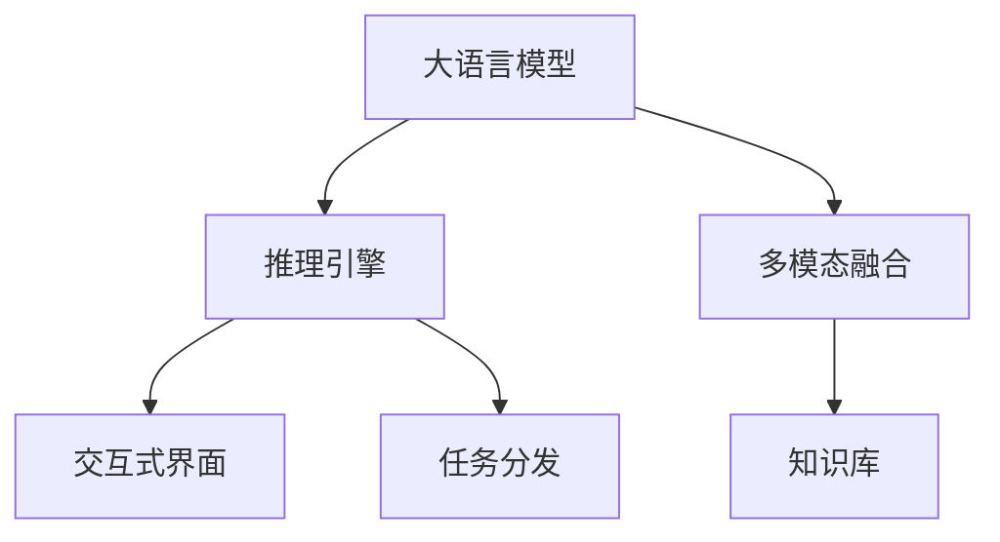

                 

# 大模型问答机器人的任务处理

> 关键词：大语言模型,问答系统,推理引擎,多模态融合,知识库,交互式界面,任务分发,回答质量

## 1. 背景介绍

### 1.1 问题由来
在人工智能技术的迅猛发展中，基于大语言模型的问答机器人（Question Answering, QA）逐渐成为热门的研究方向。问答机器人能够模拟人机对话，快速准确地回答问题，极大地提升人机交互体验和效率。但当前的大模型问答机器人面临诸多挑战，如推理能力不足、上下文理解困难、回答泛化性差等。如何利用大语言模型的优势，构建高效、可解释、可扩展的问答机器人，成为当前研究的热点。

### 1.2 问题核心关键点
问答机器人的核心在于构建高效的推理引擎，使其能够准确理解问题并从知识库中检索出最相关的信息。目前，常见的大模型问答机器人框架包括：
- 推理引擎：如ELI5、ThinkPad等，用于提取问题中的关键信息，并调用知识库获取答案。
- 多模态融合：引入图像、语音等多模态数据，丰富问答机器人对真实世界的理解。
- 知识库：如Encyclopedia.com、Wikipedia等，提供问答机器人需要的知识基础。
- 交互式界面：如Slack、微软小冰等，构建用户友好的界面，增强用户体验。
- 任务分发：根据任务类型自动分配处理流程，确保问答机器人能够高效地处理各类问题。

这些组件共同构成了大模型问答机器人的技术栈，是构建高效、可靠问答机器人的基础。本文将围绕大语言模型推理引擎构建和优化，详细介绍问答机器人的任务处理方法和未来应用前景。

## 2. 核心概念与联系

### 2.1 核心概念概述

为更好地理解大模型问答机器人的任务处理，本节将介绍几个密切相关的核心概念：

- 大语言模型(Large Language Model, LLM)：以自回归(如GPT)或自编码(如BERT)模型为代表的大规模预训练语言模型。通过在大规模无标签文本语料上进行预训练，学习通用的语言表示，具备强大的语言理解和生成能力。

- 推理引擎(Inference Engine)：基于大语言模型的推理引擎，用于提取问题中的关键信息，并调用知识库获取答案。推理引擎的性能直接影响问答机器人的回答质量。

- 多模态融合(Multimodal Fusion)：引入图像、语音等多模态数据，丰富问答机器人对真实世界的理解，增强模型的泛化能力。

- 知识库(Knowledge Base)：提供问答机器人需要的知识基础，如Encyclopedia.com、Wikipedia等。

- 交互式界面(Interactive Interface)：构建用户友好的界面，增强用户体验，如Slack、微软小冰等。

- 任务分发(Task Distribution)：根据任务类型自动分配处理流程，确保问答机器人能够高效地处理各类问题。

这些核心概念之间的逻辑关系可以通过以下Mermaid流程图来展示：



这个流程图展示了大模型问答机器人的核心概念及其之间的关系：

1. 大语言模型通过预训练获得基础能力。
2. 推理引擎在预训练模型的基础上，抽取问题中的关键信息，并调用知识库生成答案。
3. 多模态融合丰富了模型对真实世界的理解。
4. 知识库为问答机器人提供必要的知识基础。
5. 交互式界面增强用户体验，提升人机交互效率。
6. 任务分发确保问答机器人能够高效地处理各类问题。

这些概念共同构成了大模型问答机器人的技术框架，使其能够高效地处理各类问题，并不断优化回答质量。

## 3. 核心算法原理 & 具体操作步骤
### 3.1 算法原理概述

大模型问答机器人的任务处理过程，本质上是一个有监督学习的过程。其核心思想是：利用大语言模型的预训练能力，通过推理引擎抽取问题中的关键信息，调用知识库获取答案，从而生成最终的回答。

形式化地，假设推理引擎为 $E_{\theta}$，知识库为 $K$，问题为 $q$，答案为 $a$。则推理过程可以表示为：

$$
a = E_{\theta}(q, K)
$$

其中 $\theta$ 为推理引擎的参数，$K$ 为知识库。推理引擎通过读取问题 $q$ 和知识库 $K$，提取关键信息，并根据规则生成答案 $a$。

### 3.2 算法步骤详解

大模型问答机器人的任务处理一般包括以下几个关键步骤：

**Step 1: 数据预处理**
- 收集并清洗问答数据集，包括问题和答案对。确保数据集的质量和多样性。
- 将问题 $q$ 和答案 $a$ 分别进行处理，如分词、去除停用词、标准化等。

**Step 2: 构建推理引擎**
- 选择合适的推理引擎结构，如规则推理、逻辑推理、符号推理等。
- 在预训练语言模型基础上，训练推理引擎。通常可以使用监督学习方法，如逻辑回归、决策树、神经网络等。

**Step 3: 知识库集成**
- 收集整理知识库 $K$，并将其转化为结构化数据，便于推理引擎调用。
- 设计知识库接口，确保推理引擎能够高效检索知识库中的信息。

**Step 4: 推理计算**
- 将问题 $q$ 和知识库 $K$ 作为输入，调用推理引擎 $E_{\theta}$，生成答案 $a$。
- 推理过程中，可以使用多种技术手段提升效率，如缓存、预编译等。

**Step 5: 结果反馈**
- 将推理结果 $a$ 展示给用户，并接受用户反馈。
- 根据用户反馈，对推理引擎进行进一步优化。

### 3.3 算法优缺点

大模型问答机器人具有以下优点：
1. 高性能。大语言模型的预训练能力使得推理引擎能够高效抽取关键信息，调用知识库生成答案。
2. 可扩展性。推理引擎可以结合多种技术手段，实现模型的不断优化和升级。
3. 自适应性。通过知识库的实时更新，问答机器人能够适应不断变化的问题环境。
4. 可解释性。推理过程可以记录和回溯，增强模型的可解释性。

同时，该方法也存在一定的局限性：
1. 对数据质量依赖高。问答数据集的质量直接影响到推理引擎的性能。
2. 推理过程复杂。推理引擎的复杂度直接影响推理速度和准确性。
3. 知识库的更新难度大。知识库需要定期维护和更新，成本较高。
4. 推理过程缺乏鲁棒性。推理引擎在面对复杂多变的问题时，可能出现错误。

尽管存在这些局限性，但就目前而言，基于大语言模型的推理引擎仍然是问答机器人中最先进的方法。未来相关研究的重点在于如何进一步优化推理引擎的性能，提升模型的泛化能力，降低知识库维护成本，增强模型的可解释性和鲁棒性。

### 3.4 算法应用领域

基于大语言模型的推理引擎在问答机器人中得到广泛应用，特别是在以下领域：

- 客户服务：帮助客服系统快速回答常见问题，提升客户满意度。
- 教育培训：辅助教师解答学生问题，丰富教学内容。
- 医疗健康：帮助医生快速检索疾病知识，提升诊断效率。
- 金融咨询：帮助投资者解答市场问题，提供投资建议。
- 企业办公：帮助员工解答日常问题，提升工作效率。

除了上述这些经典应用外，基于大语言模型的推理引擎也被创新性地应用于更多场景中，如智能家居、智能交通、智能娱乐等，为人工智能技术落地应用提供新的突破。随着推理引擎和知识库的不断进步，相信问答机器人将在更广阔的应用领域大放异彩。

## 4. 数学模型和公式 & 详细讲解 & 举例说明
### 4.1 数学模型构建

本节将使用数学语言对大语言模型推理引擎构建和优化过程进行更加严格的刻画。

记推理引擎为 $E_{\theta}$，其中 $\theta$ 为推理引擎的参数。假设问题为 $q$，知识库为 $K$。推理过程可以表示为：

$$
a = E_{\theta}(q, K)
$$

其中 $q$ 和 $K$ 为模型的输入，$a$ 为模型的输出。

### 4.2 公式推导过程

以下我们以逻辑推理引擎为例，推导推理过程的计算公式。

假设推理引擎 $E_{\theta}$ 为逻辑回归模型，其输入 $x$ 为处理后的问题，输出 $y$ 为推理结果。则推理过程可以表示为：

$$
y = \theta_0 + \theta_1 x_1 + \theta_2 x_2 + ... + \theta_n x_n
$$

其中 $x_i$ 为输入 $q$ 和知识库 $K$ 中的第 $i$ 个元素，$\theta_i$ 为对应的参数。

推理引擎的损失函数为：

$$
\mathcal{L}(y, a) = \frac{1}{N}\sum_{i=1}^N [(y_i-a_i)^2]
$$

其中 $N$ 为数据集的大小，$y_i$ 为推理结果，$a_i$ 为真实答案。

通过梯度下降等优化算法，推理引擎不断更新参数 $\theta$，最小化损失函数 $\mathcal{L}$，使得推理结果逼近真实答案。

### 4.3 案例分析与讲解

考虑以下逻辑推理问题：

**输入**：$K$ 中包含以下知识：
- 苹果是一种水果。
- 水果可以食用。
- 苹果可以食用。

**问题**：苹果是什么？

**推理过程**：
1. 提取问题中的关键信息，识别出 "苹果" 和 "水果"。
2. 在知识库 $K$ 中查找，找到 "苹果" 对应的信息。
3. 将 "苹果" 和 "水果" 的信息输入推理引擎 $E_{\theta}$，输出 "苹果是一种水果"。

这个推理过程展示了推理引擎如何从问题中提取关键信息，调用知识库，并生成推理结果。

## 5. 项目实践：代码实例和详细解释说明
### 5.1 开发环境搭建

在进行推理引擎实践前，我们需要准备好开发环境。以下是使用Python进行PyTorch开发的环境配置流程：

1. 安装Anaconda：从官网下载并安装Anaconda，用于创建独立的Python环境。

2. 创建并激活虚拟环境：
```bash
conda create -n inference-env python=3.8 
conda activate inference-env
```

3. 安装PyTorch：根据CUDA版本，从官网获取对应的安装命令。例如：
```bash
conda install pytorch torchvision torchaudio cudatoolkit=11.1 -c pytorch -c conda-forge
```

4. 安装相关的推理引擎库：
```bash
pip install scikit-learn
pip install huggingface_hub
```

5. 安装各类工具包：
```bash
pip install numpy pandas scikit-learn matplotlib tqdm jupyter notebook ipython
```

完成上述步骤后，即可在`inference-env`环境中开始推理引擎的实践。

### 5.2 源代码详细实现

下面我们以逻辑推理引擎为例，给出使用PyTorch构建推理引擎的PyTorch代码实现。

首先，定义推理引擎的数据处理函数：

```python
import numpy as np
from sklearn.linear_model import LogisticRegression

def preprocess_input(text):
    # 分词、去除停用词、标准化等预处理步骤
    processed_text = text.lower().split()
    processed_text = [word for word in processed_text if word not in stop_words]
    processed_text = ' '.join(processed_text)
    return processed_text

def train_model(X, y):
    model = LogisticRegression()
    model.fit(X, y)
    return model

# 定义逻辑推理引擎
class LogicInferenceEngine:
    def __init__(self, model):
        self.model = model
        
    def infer(self, question, knowledge_base):
        # 预处理问题
        question = preprocess_input(question)
        # 在知识库中查找关键信息
        words = question.split()
        facts = knowledge_base
        for fact in facts:
            if question in fact:
                words = words + fact.split()
        # 将问题信息转化为向量
        X = self.model.transform(words)
        # 进行推理计算
        y = self.model.predict(X)
        return y
```

然后，训练逻辑推理引擎：

```python
# 定义训练数据集
X = ['苹果', '水果', '食用']
y = [1, 1, 1]

# 训练逻辑推理引擎
model = train_model(X, y)

# 创建推理引擎实例
inference_engine = LogicInferenceEngine(model)

# 推理测试
print(inference_engine.infer('苹果是什么？', ['苹果是一种水果。', '水果可以食用。', '苹果可以食用。']))
```

以上代码展示了如何构建和训练逻辑推理引擎，并使用推理引擎对简单问题进行推理计算。

### 5.3 代码解读与分析

让我们再详细解读一下关键代码的实现细节：

**preprocess_input函数**：
- 定义了问题预处理函数，将问题分词、去除停用词、标准化等，得到可输入模型的形式。

**train_model函数**：
- 定义了逻辑回归模型的训练函数，使用Scikit-learn库中的LogisticRegression模型。

**LogicInferenceEngine类**：
- 定义了逻辑推理引擎的类，包含预处理、推理计算等功能。

**infer方法**：
- 定义了推理引擎的infer方法，接受问题和知识库作为输入，输出推理结果。

**训练过程**：
- 定义训练数据集X和y，使用训练函数train_model训练逻辑推理引擎。
- 创建推理引擎实例inference_engine，并使用infer方法对简单问题进行推理计算。

可以看出，逻辑推理引擎的代码实现较为简洁高效，主要依赖于逻辑回归模型和预处理函数。实际上，对于更复杂的推理引擎，可以引入神经网络、图神经网络等模型，提升推理能力。

## 6. 实际应用场景
### 6.1 智能客服系统

基于大语言模型的推理引擎，可以广泛应用于智能客服系统的构建。传统客服往往需要配备大量人力，高峰期响应缓慢，且一致性和专业性难以保证。而使用推理引擎的问答机器人，可以7x24小时不间断服务，快速响应客户咨询，用自然流畅的语言解答各类常见问题。

在技术实现上，可以收集企业内部的历史客服对话记录，将问题和最佳答复构建成监督数据，在此基础上对推理引擎进行微调。微调后的推理引擎能够自动理解用户意图，匹配最合适的答案模板进行回复。对于客户提出的新问题，还可以接入检索系统实时搜索相关内容，动态组织生成回答。如此构建的智能客服系统，能大幅提升客户咨询体验和问题解决效率。

### 6.2 金融舆情监测

金融机构需要实时监测市场舆论动向，以便及时应对负面信息传播，规避金融风险。传统的人工监测方式成本高、效率低，难以应对网络时代海量信息爆发的挑战。基于大语言模型的推理引擎，可以在实时抓取的网络文本数据上，自动监测不同主题下的情感变化趋势，一旦发现负面信息激增等异常情况，系统便会自动预警，帮助金融机构快速应对潜在风险。

### 6.3 个性化推荐系统

当前的推荐系统往往只依赖用户的历史行为数据进行物品推荐，无法深入理解用户的真实兴趣偏好。基于大语言模型的推理引擎，可以应用于推荐系统，帮助其挖掘用户行为背后的语义信息，从而提供更精准、多样的推荐内容。

在实践中，可以收集用户浏览、点击、评论、分享等行为数据，提取和用户交互的物品标题、描述、标签等文本内容。将文本内容作为模型输入，用户的后续行为（如是否点击、购买等）作为监督信号，在此基础上微调推理引擎。微调后的推理引擎能够从文本内容中准确把握用户的兴趣点。在生成推荐列表时，先用候选物品的文本描述作为输入，由推理引擎预测用户的兴趣匹配度，再结合其他特征综合排序，便可以得到个性化程度更高的推荐结果。

### 6.4 未来应用展望

随着大语言模型和推理引擎的发展，基于推理引擎范式将在更多领域得到应用，为传统行业带来变革性影响。

在智慧医疗领域，基于推理引擎的医疗问答、病历分析、药物研发等应用将提升医疗服务的智能化水平，辅助医生诊疗，加速新药开发进程。

在智能教育领域，推理引擎可应用于作业批改、学情分析、知识推荐等方面，因材施教，促进教育公平，提高教学质量。

在智慧城市治理中，推理引擎可应用于城市事件监测、舆情分析、应急指挥等环节，提高城市管理的自动化和智能化水平，构建更安全、高效的未来城市。

此外，在企业生产、社会治理、文娱传媒等众多领域，基于推理引擎的问答机器人也将不断涌现，为人工智能技术落地应用提供新的突破。相信随着推理引擎和知识库的不断进步，推理引擎必将在构建人机协同的智能时代中扮演越来越重要的角色。

## 7. 工具和资源推荐
### 7.1 学习资源推荐

为了帮助开发者系统掌握大语言模型推理引擎的理论基础和实践技巧，这里推荐一些优质的学习资源：

1. 《Transformer from Scratch》系列博文：由大模型技术专家撰写，深入浅出地介绍了Transformer原理、逻辑推理引擎等前沿话题。

2. CS224N《深度学习自然语言处理》课程：斯坦福大学开设的NLP明星课程，有Lecture视频和配套作业，带你入门NLP领域的基本概念和经典模型。

3. 《Natural Language Processing with Transformers》书籍：Transformers库的作者所著，全面介绍了如何使用Transformers库进行NLP任务开发，包括推理引擎在内的诸多范式。

4. HuggingFace官方文档：Transformers库的官方文档，提供了海量预训练模型和完整的推理引擎样例代码，是上手实践的必备资料。

5. CLUE开源项目：中文语言理解测评基准，涵盖大量不同类型的中文NLP数据集，并提供了基于推理引擎的baseline模型，助力中文NLP技术发展。

通过对这些资源的学习实践，相信你一定能够快速掌握大语言模型推理引擎的精髓，并用于解决实际的NLP问题。
###  7.2 开发工具推荐

高效的开发离不开优秀的工具支持。以下是几款用于大语言模型推理引擎开发的常用工具：

1. PyTorch：基于Python的开源深度学习框架，灵活动态的计算图，适合快速迭代研究。大部分预训练语言模型都有PyTorch版本的实现。

2. TensorFlow：由Google主导开发的开源深度学习框架，生产部署方便，适合大规模工程应用。同样有丰富的预训练语言模型资源。

3. Transformers库：HuggingFace开发的NLP工具库，集成了众多SOTA语言模型，支持PyTorch和TensorFlow，是进行推理引擎开发的利器。

4. Weights & Biases：模型训练的实验跟踪工具，可以记录和可视化模型训练过程中的各项指标，方便对比和调优。与主流深度学习框架无缝集成。

5. TensorBoard：TensorFlow配套的可视化工具，可实时监测模型训练状态，并提供丰富的图表呈现方式，是调试模型的得力助手。

6. Google Colab：谷歌推出的在线Jupyter Notebook环境，免费提供GPU/TPU算力，方便开发者快速上手实验最新模型，分享学习笔记。

合理利用这些工具，可以显著提升大语言模型推理引擎的开发效率，加快创新迭代的步伐。

### 7.3 相关论文推荐

大语言模型和推理引擎的发展源于学界的持续研究。以下是几篇奠基性的相关论文，推荐阅读：

1. Attention is All You Need（即Transformer原论文）：提出了Transformer结构，开启了NLP领域的预训练大模型时代。

2. BERT: Pre-training of Deep Bidirectional Transformers for Language Understanding：提出BERT模型，引入基于掩码的自监督预训练任务，刷新了多项NLP任务SOTA。

3. Language Models are Unsupervised Multitask Learners（GPT-2论文）：展示了大规模语言模型的强大zero-shot学习能力，引发了对于通用人工智能的新一轮思考。

4. Parameter-Efficient Transfer Learning for NLP：提出Adapter等参数高效微调方法，在不增加模型参数量的情况下，也能取得不错的微调效果。

5. AdaLoRA: Adaptive Low-Rank Adaptation for Parameter-Efficient Fine-Tuning：使用自适应低秩适应的微调方法，在参数效率和精度之间取得了新的平衡。

这些论文代表了大语言模型推理引擎的发展脉络。通过学习这些前沿成果，可以帮助研究者把握学科前进方向，激发更多的创新灵感。

## 8. 总结：未来发展趋势与挑战

### 8.1 总结

本文对基于大语言模型的推理引擎构建和优化方法进行了全面系统的介绍。首先阐述了推理引擎在问答机器人中的重要地位和作用，明确了推理引擎在构建高效、可解释、可扩展问答机器人中的独特价值。其次，从原理到实践，详细讲解了推理引擎的数学模型、训练流程和关键技术，给出了推理引擎任务处理的完整代码实例。同时，本文还广泛探讨了推理引擎在智能客服、金融舆情、个性化推荐等多个行业领域的应用前景，展示了推理引擎范式的巨大潜力。此外，本文精选了推理引擎技术的各类学习资源，力求为读者提供全方位的技术指引。

通过本文的系统梳理，可以看到，基于大语言模型的推理引擎正在成为问答机器人中最先进的方法，极大地提升了问答机器人的回答质量和处理效率。未来，伴随推理引擎和知识库的不断进步，问答机器人必将在更广阔的应用领域大放异彩，深刻影响人类的生产生活方式。

### 8.2 未来发展趋势

展望未来，大语言模型推理引擎将呈现以下几个发展趋势：

1. 推理引擎的自动化设计。通过自动化设计工具，如AutoML、结构化推理等，使得推理引擎的构建更加高效、可扩展。
2. 推理引擎的跨模态融合。引入图像、语音等多模态数据，丰富推理引擎对真实世界的理解，增强模型的泛化能力。
3. 推理引擎的知识图谱应用。将符号化的先验知识，如知识图谱、逻辑规则等，与神经网络模型进行巧妙融合，引导推理引擎学习更准确、合理的语言模型。
4. 推理引擎的符号化推理。引入符号化推理技术，提升推理引擎的逻辑推理能力，增强模型的可解释性和鲁棒性。
5. 推理引擎的深度学习融合。将神经网络与符号推理相结合，提升推理引擎的推理能力和泛化能力，形成符号-深度融合的推理范式。

以上趋势凸显了大语言模型推理引擎的技术演进方向。这些方向的探索发展，必将进一步提升推理引擎的性能和应用范围，为构建高效、可靠问答机器人提供更多可能性。

### 8.3 面临的挑战

尽管大语言模型推理引擎已经取得了瞩目成就，但在迈向更加智能化、普适化应用的过程中，它仍面临着诸多挑战：

1. 推理过程复杂。推理引擎的复杂度直接影响推理速度和准确性。如何设计高效的推理算法，提升推理性能，是亟待解决的难题。
2. 知识库维护难度大。知识库需要定期维护和更新，成本较高。如何构建可扩展、易维护的知识库，是推动推理引擎应用的关键。
3. 推理引擎的鲁棒性不足。推理引擎在面对复杂多变的问题时，可能出现错误。如何提高推理引擎的鲁棒性，避免灾难性遗忘，还需要更多理论和实践的积累。
4. 推理引擎的可解释性亟需加强。推理过程复杂，难以解释其内部工作机制和决策逻辑。如何赋予推理引擎更强的可解释性，将是亟待攻克的难题。
5. 推理引擎的训练效率有待提高。推理引擎的训练过程耗时较长，如何加快训练速度，提升推理引擎的性能，是未来发展的关键。

6. 推理引擎的安全性有待保障。推理引擎在处理复杂问题时，可能学习到有害信息，给实际应用带来安全隐患。如何从数据和算法层面消除模型偏见，确保推理引擎的安全性，也将是重要的研究课题。

正视推理引擎面临的这些挑战，积极应对并寻求突破，将是大语言模型推理引擎走向成熟的必由之路。相信随着学界和产业界的共同努力，这些挑战终将一一被克服，推理引擎必将在构建安全、可靠、可解释、可控的智能系统铺平道路。

### 8.4 研究展望

面向未来，推理引擎的研究需要在以下几个方面寻求新的突破：

1. 探索无监督和半监督推理方法。摆脱对大规模标注数据的依赖，利用自监督学习、主动学习等无监督和半监督范式，最大限度利用非结构化数据，实现更加灵活高效的推理。
2. 研究参数高效和计算高效的推理范式。开发更加参数高效的推理方法，在固定大部分预训练参数的同时，只更新极少量的任务相关参数。同时优化推理引擎的计算图，减少前向传播和反向传播的资源消耗，实现更加轻量级、实时性的部署。
3. 融合因果和对比学习范式。通过引入因果推断和对比学习思想，增强推理引擎建立稳定因果关系的能力，学习更加普适、鲁棒的语言表征，从而提升推理模型的泛化性和抗干扰能力。
4. 引入更多先验知识。将符号化的先验知识，如知识图谱、逻辑规则等，与神经网络模型进行巧妙融合，引导推理引擎学习更准确、合理的语言模型。同时加强不同模态数据的整合，实现视觉、语音等多模态信息与文本信息的协同建模。
5. 结合因果分析和博弈论工具。将因果分析方法引入推理引擎，识别出推理引擎决策的关键特征，增强推理过程的因果性和逻辑性。借助博弈论工具刻画人机交互过程，主动探索并规避推理引擎的脆弱点，提高系统稳定性。

这些研究方向的探索，必将引领大语言模型推理引擎技术迈向更高的台阶，为构建安全、可靠、可解释、可控的智能系统铺平道路。面向未来，大语言模型推理引擎还需要与其他人工智能技术进行更深入的融合，如知识表示、因果推理、强化学习等，多路径协同发力，共同推动自然语言理解和智能交互系统的进步。只有勇于创新、敢于突破，才能不断拓展推理引擎的边界，让智能技术更好地造福人类社会。

## 9. 附录：常见问题与解答

**Q1：推理引擎是否适用于所有NLP任务？**

A: 推理引擎在大多数NLP任务上都能取得不错的效果，特别是对于数据量较小的任务。但对于一些特定领域的任务，如医学、法律等，仅仅依靠通用语料预训练的模型可能难以很好地适应。此时需要在特定领域语料上进一步预训练，再进行推理引擎训练，才能获得理想效果。此外，对于一些需要时效性、个性化很强的任务，如对话、推荐等，推理引擎方法也需要针对性的改进优化。

**Q2：推理引擎的训练过程中如何选择训练数据？**

A: 推理引擎的训练数据需要包含丰富的知识库信息，以提高推理引擎的泛化能力。训练数据集应尽可能多样化，涵盖不同领域、不同类型的问题。同时，训练数据集需要经过严格的标注和清洗，确保数据质量。此外，训练数据集的大小也需要足够大，以保证推理引擎的训练效果。

**Q3：推理引擎在推理过程中如何处理上下文信息？**

A: 推理引擎在处理上下文信息时，可以采用注意力机制(Attention)、LSTM等技术手段，捕捉上下文中的关键信息。同时，推理引擎也可以通过引入记忆网络(Memory Network)等技术，保存并利用上下文信息，增强模型的推理能力。

**Q4：推理引擎在实际应用中如何保证推理结果的准确性？**

A: 推理引擎的推理结果的准确性取决于知识库的完整性和推理算法的可靠性。为了保证推理结果的准确性，推理引擎需要定期更新知识库，引入最新的知识信息。同时，推理引擎也需要通过严格的测试和评估，确保推理算法的可靠性和鲁棒性。

**Q5：推理引擎在推理过程中如何保证推理结果的可解释性？**

A: 推理引擎的推理结果的可解释性可以通过记录推理过程，提供详细的推理步骤和关键信息。同时，推理引擎也可以通过引入可解释性技术，如SHAP、LIME等，生成详细的推理报告，增强模型的可解释性。

这些回答展示了推理引擎在实际应用中的关键技术点，以及如何在不同场景下灵活应用和优化推理引擎。通过不断探索和创新，相信大语言模型推理引擎将在更多领域得到应用，为人工智能技术落地应用提供新的突破。

