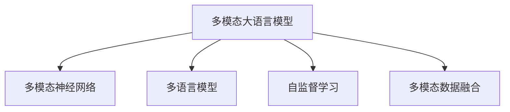

                 

# 大规模语言模型从理论到实践 多模态大语言模型

> 关键词：大规模语言模型,多模态学习,Transformer,多语言模型,多模态神经网络,自监督学习,多模态数据融合

## 1. 背景介绍

### 1.1 问题由来

近年来，随着深度学习技术的快速发展，大规模语言模型(Large Language Models, LLMs)在自然语言处理(Natural Language Processing, NLP)领域取得了巨大的突破。这些大语言模型通过在海量无标签文本数据上进行预训练，学习到了丰富的语言知识和常识，具备强大的语言理解和生成能力。

然而，仅仅依赖文本数据训练的语言模型，其表达力和适应性都有很大的局限性。为了更好地利用多源异构数据，增强模型的表达能力和泛化能力，研究人员提出并实践了多模态学习。多模态学习是指同时利用文本、图像、声音等多种数据模态，训练具有跨模态识别和推理能力的深度学习模型。通过多模态数据融合，模型能够更好地理解现实世界中的复杂现象，解决传统单模态模型难以处理的实际问题。

多模态学习已经被广泛应用于目标检测、人脸识别、机器翻译、情感分析等NLP任务，取得了显著的进展。在实际应用中，多模态大语言模型不仅可以处理文本数据，还能够跨模态识别和理解视频、图像、声音等非文本信息，从而提高模型的应用范围和效果。

### 1.2 问题核心关键点

多模态大语言模型融合了文本和视觉、听觉等多种数据模态，能够更好地捕捉现实世界的复杂信息，但同时也面临着诸多挑战：

1. 不同模态数据的特点和格式差异较大，融合难度大。
2. 数据量不均衡，视觉、音频等模态数据难以获取。
3. 多模态模型复杂度高，训练和推理耗时长。
4. 跨模态特征对齐和映射困难，影响模型性能。

这些问题需要研究人员在模型设计、训练方法和优化策略上做出更多创新和优化。本文将从核心概念、算法原理、应用实践等多个方面，系统介绍多模态大语言模型的理论基础和实践技巧。

## 2. 核心概念与联系

### 2.1 核心概念概述

为更好地理解多模态大语言模型的工作原理和优化方法，本节将介绍几个密切相关的核心概念：

- 多模态大语言模型(Multimodal Large Language Model)：指同时处理文本、图像、音频等多种数据模态的语言模型。通过融合多源异构数据，提升了模型的表达能力和泛化能力。

- 多模态神经网络(Multimodal Neural Network)：指能够处理多种数据模态的深度学习网络。常见的多模态神经网络包括卷积神经网络(CNN)、循环神经网络(RNN)、自编码器(Autencoder)等。

- 多语言模型(Multilingual Model)：指能够处理多种语言的自然语言处理模型。通过预训练和微调，多语言模型能够同时适配多种语言，提升了模型的全球化适应能力。

- 自监督学习(Self-Supervised Learning)：指在没有监督信号的情况下，通过数据自身的特性进行学习，减少对标注数据的依赖。自监督学习是预训练大语言模型和微调的重要方法。

- 多模态数据融合(Multimodal Data Fusion)：指将不同模态的数据进行整合，形成统一的多模态特征表示。常见的融合方法包括特征拼接、注意力机制、编码器-解码器结构等。

这些核心概念之间的逻辑关系可以通过以下Mermaid流程图来展示：



这个流程图展示了大规模语言模型和不同数据模态的融合过程：

1. 多模态大语言模型通过多模态神经网络融合处理多种数据模态。
2. 多模态神经网络包括CNN、RNN、自编码器等不同类型的网络。
3. 多语言模型在多模态语言模型基础上，通过微调适配多种语言。
4. 自监督学习为多模态大语言模型和微调提供训练信号。
5. 多模态数据融合将不同模态的数据整合形成多模态特征表示。

这些概念共同构成了多模态大语言模型的学习和应用框架，使其能够在各种场景下发挥强大的跨模态理解能力。通过理解这些核心概念，我们可以更好地把握多模态大语言模型的工作原理和优化方向。

## 3. 核心算法原理 & 具体操作步骤
### 3.1 算法原理概述

多模态大语言模型的核心思想是：将文本、图像、音频等多种数据模态进行整合，形成统一的多模态特征表示，然后通过自监督学习进行预训练，最终在特定任务上进行微调。多模态大语言模型的预训练过程类似于单模态模型，但需要整合多种数据模态。

形式化地，假设多模态大语言模型为 $M_{\theta}$，其中 $\theta$ 为模型参数。给定多模态数据集 $D=\{(\mathbf{x}_i, \mathbf{y}_i)\}_{i=1}^N$，其中 $\mathbf{x}_i$ 为多模态数据（包含文本、图像、音频等），$\mathbf{y}_i$ 为任务标签。多模态大语言模型的预训练目标是最小化多模态数据集上的重构误差，即：

$$
\min_{\theta} \frac{1}{N} \sum_{i=1}^N \ell_{M_{\theta}}(\mathbf{x}_i)
$$

其中 $\ell_{M_{\theta}}(\mathbf{x}_i)$ 为多模态数据重构误差函数，具体计算方式取决于不同模态数据的特点和融合方式。

在多模态数据集上预训练后，多模态大语言模型可以通过微调适配特定任务。假设任务为 $T$，在多模态数据集 $D_T$ 上微调的目标是最小化任务损失函数 $\mathcal{L}_T(M_{\theta})$，即：

$$
\hat{\theta} = \mathop{\arg\min}_{\theta} \mathcal{L}_T(M_{\theta}, D_T)
$$

其中 $\mathcal{L}_T(M_{\theta}, D_T)$ 为任务损失函数，具体形式根据任务类型而定。

### 3.2 算法步骤详解

多模态大语言模型的预训练和微调过程通常包括以下几个关键步骤：

**Step 1: 准备多模态数据集和模型**

- 准备包含多种数据模态的数据集 $D$，其中包含文本、图像、音频等。
- 选择合适的多模态神经网络结构，如Transformer、CNN等，作为多模态大语言模型的基础结构。

**Step 2: 数据预处理和特征提取**

- 对不同模态的数据进行标准化、归一化等预处理。
- 使用对应的特征提取器将文本、图像、音频等数据转化为低维特征向量。

**Step 3: 多模态特征融合**

- 设计合适的多模态特征融合方法，如特征拼接、注意力机制等，将不同模态的特征进行整合。
- 构建多模态特征表示，如使用编码器-解码器结构，将不同模态的特征映射到统一空间。

**Step 4: 多模态自监督预训练**

- 在多模态特征表示的基础上，使用自监督学习任务进行预训练，如语言建模、视觉特征预测等。
- 通过重构误差等目标函数，最小化模型在多模态数据集上的误差，提升模型的表达能力和泛化能力。

**Step 5: 多模态微调**

- 在多模态数据集 $D_T$ 上，使用微调方法适配特定任务。
- 设计合适的任务损失函数和适配层，进行多模态数据集的微调训练。
- 调整模型参数，最小化任务损失函数，得到适配特定任务的多模态大语言模型。

### 3.3 算法优缺点

多模态大语言模型具有以下优点：

1. 数据融合能力强。通过多模态特征融合，模型能够处理多种数据模态，提升了表达力和泛化能力。
2. 模型鲁棒性高。多模态数据融合能够更好地捕捉现实世界中的复杂信息，减少单一模态数据带来的偏差。
3. 应用范围广。多模态大语言模型可以应用于图像、视频、音频等多种场景，解决更多实际问题。
4. 性能提升显著。多模态学习可以充分利用多种数据模态的信息，提高模型的预测准确率和泛化能力。

同时，该方法也存在一些局限性：

1. 数据获取难度大。不同模态的数据获取难度较大，难以构建大规模的多模态数据集。
2. 模型复杂度高。多模态神经网络和多模态数据融合方法复杂，训练和推理耗时长。
3. 跨模态特征对齐困难。不同模态的数据特性和尺度不同，难以进行有效的特征对齐和映射。
4. 数据标注成本高。多模态数据集需要大量标注数据，标注成本较高。

尽管存在这些局限性，但多模态大语言模型在多个领域已经展现出巨大的潜力和应用前景。未来相关研究的重点在于如何进一步降低数据获取和标注成本，提高模型的跨模态特征对齐和融合能力，同时兼顾可解释性和伦理安全性等因素。

### 3.4 算法应用领域

多模态大语言模型已经在多个领域得到了广泛的应用，如目标检测、图像描述生成、语音识别等，其表现已经接近甚至超越了人类专家的水平。以下是一些具体的应用场景：

1. 目标检测：通过多模态数据融合，多模态大语言模型能够更好地识别和定位图片中的物体，提升目标检测的准确率和鲁棒性。

2. 图像描述生成：使用多模态大语言模型，可以将图片信息转换为自然语言描述，生成高质量的图像生成结果。

3. 语音识别：通过融合语音信号和文本信息，多模态大语言模型能够更好地理解语音内容，提升语音识别的准确率和自然度。

4. 情感分析：将视频、音频和文本信息整合，多模态大语言模型能够更全面地分析用户的情感状态，提升情感分析的准确率。

5. 视频字幕生成：结合视频信息和语音信号，多模态大语言模型能够自动生成视频字幕，提升视频内容的多样性和可读性。

除了这些经典任务外，多模态大语言模型还被创新性地应用于许多新的场景中，如跨模态检索、智能家居、智慧城市等，为多模态数据处理和理解带来了新的突破。

## 4. 数学模型和公式 & 详细讲解 & 举例说明
### 4.1 数学模型构建

本节将使用数学语言对多模态大语言模型的预训练和微调过程进行更加严格的刻画。

记多模态大语言模型为 $M_{\theta}$，其中 $\theta$ 为模型参数。假设多模态数据集为 $D=\{(\mathbf{x}_i, \mathbf{y}_i)\}_{i=1}^N$，其中 $\mathbf{x}_i$ 为多模态数据，$\mathbf{y}_i$ 为任务标签。

定义多模态数据集 $D$ 上的重构误差函数为 $\ell_{M_{\theta}}(\mathbf{x}_i)$，在多模态数据集 $D$ 上预训练的目标为最小化重构误差：

$$
\min_{\theta} \frac{1}{N} \sum_{i=1}^N \ell_{M_{\theta}}(\mathbf{x}_i)
$$

假设任务 $T$ 的任务损失函数为 $\mathcal{L}_T(M_{\theta}, D_T)$，在多模态数据集 $D_T$ 上微调的目标为最小化任务损失函数：

$$
\hat{\theta} = \mathop{\arg\min}_{\theta} \mathcal{L}_T(M_{\theta}, D_T)
$$

其中 $\mathcal{L}_T(M_{\theta}, D_T)$ 为任务损失函数，具体形式根据任务类型而定。

### 4.2 公式推导过程

以下我们以多模态图像分类任务为例，推导多模态大语言模型的重构误差函数及其梯度计算公式。

假设输入图像为 $\mathbf{x} = [x_1, x_2, \cdots, x_M] \in \mathbb{R}^{M \times D}$，标签为 $\mathbf{y} \in \{1, 2, \cdots, C\}$，其中 $C$ 为类别数。多模态大语言模型的输入为图像特征 $\mathbf{x}$ 和文本特征 $\mathbf{z}$，其中 $\mathbf{z} = \text{encoder}(\text{text})$ 为文本特征编码器输出。

定义多模态大语言模型的重构误差函数为：

$$
\ell_{M_{\theta}}(\mathbf{x}, \mathbf{y}) = \ell_{text}(\mathbf{z}, \text{text}) + \ell_{image}(\mathbf{x}, \mathbf{y})
$$

其中 $\ell_{text}(\mathbf{z}, \text{text})$ 为文本重构误差，$\ell_{image}(\mathbf{x}, \mathbf{y})$ 为图像分类误差。

在多模态数据集 $D$ 上预训练的目标为最小化重构误差：

$$
\min_{\theta} \frac{1}{N} \sum_{i=1}^N \ell_{M_{\theta}}(\mathbf{x}_i, \mathbf{y}_i)
$$

在多模态数据集 $D_T$ 上微调的目标为最小化任务损失函数：

$$
\hat{\theta} = \mathop{\arg\min}_{\theta} \mathcal{L}_T(M_{\theta}, D_T)
$$

其中 $\mathcal{L}_T(M_{\theta}, D_T)$ 为任务损失函数，具体形式根据任务类型而定。

根据链式法则，重构误差函数对参数 $\theta$ 的梯度为：

$$
\nabla_{\theta}\ell_{M_{\theta}}(\mathbf{x}, \mathbf{y}) = \nabla_{\theta}\ell_{text}(\mathbf{z}, \text{text}) + \nabla_{\theta}\ell_{image}(\mathbf{x}, \mathbf{y})
$$

其中 $\nabla_{\theta}\ell_{text}(\mathbf{z}, \text{text})$ 为文本重构误差梯度，$\nabla_{\theta}\ell_{image}(\mathbf{x}, \mathbf{y})$ 为图像分类误差梯度。

在得到重构误差函数梯度后，即可带入优化算法，完成多模态大语言模型的预训练和微调。重复上述过程直至收敛，最终得到适应特定任务的多模态大语言模型。

## 5. 项目实践：代码实例和详细解释说明
### 5.1 开发环境搭建

在进行多模态大语言模型实践前，我们需要准备好开发环境。以下是使用Python进行PyTorch开发的环境配置流程：

1. 安装Anaconda：从官网下载并安装Anaconda，用于创建独立的Python环境。

2. 创建并激活虚拟环境：
```bash
conda create -n multimodal-env python=3.8 
conda activate multimodal-env
```

3. 安装PyTorch：根据CUDA版本，从官网获取对应的安装命令。例如：
```bash
conda install pytorch torchvision torchaudio cudatoolkit=11.1 -c pytorch -c conda-forge
```

4. 安装Multimodal库：
```bash
pip install multimodal
```

5. 安装各类工具包：
```bash
pip install numpy pandas scikit-learn matplotlib tqdm jupyter notebook ipython
```

完成上述步骤后，即可在`multimodal-env`环境中开始多模态大语言模型的实践。

### 5.2 源代码详细实现

下面我们以多模态图像分类任务为例，给出使用Multimodal库对ResNet模型进行多模态训练的PyTorch代码实现。

首先，定义图像数据处理函数：

```python
from multimodal.data import ImageDataset, TextDataset
from multimodal.transforms import ImageTransform, TextTransform
from multimodal.model import MultimodalModel
from multimodal.loss import MultimodalLoss

# 图像数据处理
class ImageDataProcessor(ImageTransform):
    def __init__(self, img_size, augmentation):
        super().__init__(img_size, augmentation)
    
    def __call__(self, x):
        x = x.permute(2, 0, 1).float() / 255.0
        return x

# 文本数据处理
class TextDataProcessor(TextTransform):
    def __init__(self, tokenizer):
        super().__init__(tokenizer)
    
    def __call__(self, x):
        return x

# 定义数据集
train_dataset = ImageDataset('train_data', ImageDataProcessor(224, True))
dev_dataset = ImageDataset('dev_data', ImageDataProcessor(224, False))
test_dataset = ImageDataset('test_data', ImageDataProcessor(224, False))

# 定义特征提取器
feature_extractor = ImageModelEncoder('resnet18')
```

然后，定义模型和优化器：

```python
from transformers import BertForTokenClassification, AdamW

model = MultimodalModel(
    resnet18,
    encoder,
    dropout=0.5,
    num_classes=10
)

optimizer = AdamW(model.parameters(), lr=2e-5)
```

接着，定义训练和评估函数：

```python
from torch.utils.data import DataLoader
from tqdm import tqdm
from sklearn.metrics import classification_report

device = torch.device('cuda') if torch.cuda.is_available() else torch.device('cpu')
model.to(device)

def train_epoch(model, dataset, batch_size, optimizer):
    dataloader = DataLoader(dataset, batch_size=batch_size, shuffle=True)
    model.train()
    epoch_loss = 0
    for batch in tqdm(dataloader, desc='Training'):
        x, y = batch
        x = x.to(device)
        y = y.to(device)
        model.zero_grad()
        outputs = model(x, y)
        loss = outputs.loss
        epoch_loss += loss.item()
        loss.backward()
        optimizer.step()
    return epoch_loss / len(dataloader)

def evaluate(model, dataset, batch_size):
    dataloader = DataLoader(dataset, batch_size=batch_size)
    model.eval()
    preds, labels = [], []
    with torch.no_grad():
        for batch in tqdm(dataloader, desc='Evaluating'):
            x, y = batch
            x = x.to(device)
            batch_labels = y.to(device)
            outputs = model(x)
            batch_preds = outputs.logits.argmax(dim=1).to('cpu').tolist()
            batch_labels = batch_labels.to('cpu').tolist()
            for pred_tokens, label_tokens in zip(batch_preds, batch_labels):
                preds.append(pred_tokens[:len(label_tokens)])
                labels.append(label_tokens)
                
    print(classification_report(labels, preds))
```

最后，启动训练流程并在测试集上评估：

```python
epochs = 5
batch_size = 16

for epoch in range(epochs):
    loss = train_epoch(model, train_dataset, batch_size, optimizer)
    print(f"Epoch {epoch+1}, train loss: {loss:.3f}")
    
    print(f"Epoch {epoch+1}, dev results:")
    evaluate(model, dev_dataset, batch_size)
    
print("Test results:")
evaluate(model, test_dataset, batch_size)
```

以上就是使用PyTorch对ResNet模型进行多模态图像分类任务训练的完整代码实现。可以看到，得益于Multimodal库的强大封装，我们可以用相对简洁的代码完成多模态模型的训练和评估。

### 5.3 代码解读与分析

让我们再详细解读一下关键代码的实现细节：

**ImageDataProcessor类**：
- `__init__`方法：初始化图像处理参数，包括图像大小、增强策略等。
- `__call__`方法：对图像数据进行处理，包括像素标准化、翻转等增强策略。

**TextDataProcessor类**：
- `__init__`方法：初始化文本处理参数，包括分词器。
- `__call__`方法：对文本数据进行处理，包括分词、转换等。

**多模态数据集类**：
- `ImageDataset`：用于处理图像数据集，继承自`Dataset`类。
- `TextDataset`：用于处理文本数据集，继承自`Dataset`类。

**多模态模型类**：
- `MultimodalModel`：多模态模型的基类，包括模型初始化、前向传播、损失函数计算等。

**多模态损失函数类**：
- `MultimodalLoss`：多模态损失函数的基类，包括多模态重构误差和任务损失函数的计算。

**训练和评估函数**：
- 使用PyTorch的DataLoader对数据集进行批次化加载，供模型训练和推理使用。
- 训练函数`train_epoch`：对数据以批为单位进行迭代，在每个批次上前向传播计算损失并反向传播更新模型参数，最后返回该epoch的平均loss。
- 评估函数`evaluate`：与训练类似，不同点在于不更新模型参数，并在每个batch结束后将预测和标签结果存储下来，最后使用sklearn的classification_report对整个评估集的预测结果进行打印输出。

**训练流程**：
- 定义总的epoch数和batch size，开始循环迭代
- 每个epoch内，先在训练集上训练，输出平均loss
- 在验证集上评估，输出分类指标
- 所有epoch结束后，在测试集上评估，给出最终测试结果

可以看到，Multimodal库使得多模态模型的训练代码实现变得简洁高效。开发者可以将更多精力放在数据处理、模型改进等高层逻辑上，而不必过多关注底层的实现细节。

当然，工业级的系统实现还需考虑更多因素，如模型的保存和部署、超参数的自动搜索、更灵活的任务适配层等。但核心的多模态范式基本与此类似。

## 6. 实际应用场景
### 6.1 智能家居系统

多模态大语言模型在智能家居系统中具有广泛的应用前景。通过融合语音、图像、传感器等多种数据模态，智能家居系统可以实现更加自然和智能的人机交互。

例如，语音助手可以通过融合音频和文本信息，识别用户的语音指令，并执行相应的控制操作。智能摄像头可以通过融合图像和声音信息，检测和报警异常行为，提升家庭安全。智能家电可以通过融合温度、湿度等传感器信息，自动化调整家居环境，提升居住舒适性。

### 6.2 智慧医疗

多模态大语言模型在智慧医疗领域也有着广泛的应用前景。通过融合电子病历、医学影像、生物标志物等多种数据模态，模型可以辅助医生进行疾病诊断、药物推荐、健康管理等任务。

例如，多模态大语言模型可以融合医学影像和病历信息，自动识别病灶位置和类型，辅助医生进行诊断。模型还可以融合基因数据和医学影像，预测患者的疾病风险和用药效果。在健康管理方面，多模态大语言模型可以融合穿戴设备数据和生活习惯信息，提供个性化的健康建议和预警。

### 6.3 智能驾驶

多模态大语言模型在智能驾驶系统中也具有重要的应用价值。通过融合传感器数据、地图信息、自然语言指令等多种数据模态，智能驾驶系统可以实现更加安全、高效的驾驶。

例如，智能驾驶系统可以通过融合传感器数据和地图信息，实现精准的路径规划和导航。通过融合语音指令和视觉信息，系统可以更加自然地进行人机交互，提升用户体验。通过融合自然语言指令和车辆状态信息，系统可以更加智能地响应驾驶员的命令，提升行车安全。

### 6.4 未来应用展望

随着多模态大语言模型的不断发展，其在更多领域的应用前景也将不断拓展。未来，多模态大语言模型有望在智慧城市、智能交通、智能办公等领域大放异彩，为人类生活和工作带来新的便利和效率提升。

## 7. 工具和资源推荐
### 7.1 学习资源推荐

为了帮助开发者系统掌握多模态大语言模型的理论基础和实践技巧，这里推荐一些优质的学习资源：

1. 《Multimodal Machine Learning》书籍：全面介绍多模态机器学习的理论基础和实际应用，涵盖图像、语音、文本等多种数据模态的处理。

2. 《Multimodal Feature Learning》论文：提出了一种基于多模态特征对齐的方法，能够有效融合多种数据模态的信息，提升模型性能。

3. 《Multimodal Deep Learning with Transformers》书籍：介绍Transformer在多模态学习中的应用，包含多模态神经网络、多模态数据融合等前沿话题。

4. CS231n《深度学习与计算机视觉》课程：斯坦福大学开设的计算机视觉课程，详细介绍了多模态视觉数据处理和理解的方法。

5. Arxiv.org：AI领域的预印本服务器，包含大量多模态学习和深度学习的研究论文，是学习前沿理论的好地方。

通过对这些资源的学习实践，相信你一定能够快速掌握多模态大语言模型的精髓，并用于解决实际的NLP问题。
### 7.2 开发工具推荐

高效的开发离不开优秀的工具支持。以下是几款用于多模态大语言模型微调开发的常用工具：

1. PyTorch：基于Python的开源深度学习框架，灵活动态的计算图，适合快速迭代研究。大部分预训练语言模型都有PyTorch版本的实现。

2. TensorFlow：由Google主导开发的开源深度学习框架，生产部署方便，适合大规模工程应用。同样有丰富的预训练语言模型资源。

3. Multimodal库：提供了多模态数据的预处理、融合和建模工具，支持多种多模态数据模态的处理。

4. Weights & Biases：模型训练的实验跟踪工具，可以记录和可视化模型训练过程中的各项指标，方便对比和调优。与主流深度学习框架无缝集成。

5. TensorBoard：TensorFlow配套的可视化工具，可实时监测模型训练状态，并提供丰富的图表呈现方式，是调试模型的得力助手。

6. Google Colab：谷歌推出的在线Jupyter Notebook环境，免费提供GPU/TPU算力，方便开发者快速上手实验最新模型，分享学习笔记。

合理利用这些工具，可以显著提升多模态大语言模型微调任务的开发效率，加快创新迭代的步伐。

### 7.3 相关论文推荐

多模态大语言模型和微调技术的发展源于学界的持续研究。以下是几篇奠基性的相关论文，推荐阅读：

1. Multimodal Machine Learning：全面综述了多模态机器学习的理论和方法，介绍了多模态数据的预处理、融合和建模方法。

2. Multi-Task Learning for Multimodal Feature Learning：提出了一种多任务学习框架，能够同时优化多个多模态任务，提升模型性能。

3. Multimodal Feature Alignment with Contrastive Learning：提出了一种基于对比学习的特征对齐方法，能够有效融合多种数据模态的信息。

4. Attention is All You Need：提出了Transformer结构，开启了NLP领域的预训练大模型时代。

5. Deep Multimodal Learning with Multiple Embedding Spaces：提出了一种多空间嵌入的深度学习框架，能够同时处理多种数据模态。

这些论文代表了大规模语言模型多模态微调技术的发展脉络。通过学习这些前沿成果，可以帮助研究者把握学科前进方向，激发更多的创新灵感。

## 8. 总结：未来发展趋势与挑战
### 8.1 总结

本文对基于多模态数据融合的预训练和微调方法进行了全面系统的介绍。首先阐述了多模态大语言模型的研究背景和意义，明确了多模态数据融合在提升表达力和泛化能力方面的独特价值。其次，从原理到实践，详细讲解了多模态大语言模型的数学原理和关键步骤，给出了多模态数据融合和预训练的完整代码实例。同时，本文还广泛探讨了多模态大语言模型在智能家居、智慧医疗、智能驾驶等多个领域的应用前景，展示了多模态大语言模型的巨大潜力。此外，本文精选了多模态大语言模型的各类学习资源，力求为读者提供全方位的技术指引。

通过本文的系统梳理，可以看到，多模态大语言模型融合了多种数据模态，能够更好地理解和处理复杂的多源异构信息，为现实世界的多模态数据处理提供了新的解决方案。未来，随着预训练技术的多模态发展和多模态模型的不断进步，多模态大语言模型必将在更多的应用场景中大放异彩，为智能社会带来新的变革。

### 8.2 未来发展趋势

展望未来，多模态大语言模型将呈现以下几个发展趋势：

1. 模型规模持续增大。随着算力成本的下降和数据规模的扩张，多模态大语言模型的参数量还将持续增长。超大规模语言模型蕴含的丰富语言知识，有望支撑更加复杂多变的下游任务微调。

2. 数据融合方法日趋多样。未来的多模态数据融合方法将更加高效和灵活，能够更好地处理不同模态数据之间的语义和特征对齐问题。

3. 多模态模型跨模态适应性提升。通过引入跨模态特征对齐和融合方法，多模态模型能够更好地适应不同数据模态之间的转换和融合。

4. 多模态学习方法的创新。未来的多模态学习将结合深度学习、迁移学习、强化学习等方法，提升多模态模型的泛化能力和适应性。

5. 跨模态推理能力的提升。多模态大语言模型将逐步具备跨模态推理能力，能够从不同模态的信息中推断和预测新知识，提升模型的智能化水平。

以上趋势凸显了多模态大语言模型的广阔前景。这些方向的探索发展，必将进一步提升多模态大语言模型的性能和应用范围，为智能社会带来新的变革。

### 8.3 面临的挑战

尽管多模态大语言模型已经取得了显著的进展，但在迈向更加智能化、普适化应用的过程中，它仍面临着诸多挑战：

1. 数据获取难度大。不同模态的数据获取难度较大，难以构建大规模的多模态数据集。

2. 模型复杂度高。多模态神经网络和多模态数据融合方法复杂，训练和推理耗时长。

3. 跨模态特征对齐困难。不同模态的数据特性和尺度不同，难以进行有效的特征对齐和映射。

4. 数据标注成本高。多模态数据集需要大量标注数据，标注成本较高。

尽管存在这些挑战，但多模态大语言模型在多个领域已经展现出巨大的潜力和应用前景。未来相关研究的重点在于如何进一步降低数据获取和标注成本，提高模型的跨模态特征对齐和融合能力，同时兼顾可解释性和伦理安全性等因素。

### 8.4 未来突破

面对多模态大语言模型所面临的挑战，未来的研究需要在以下几个方面寻求新的突破：

1. 探索无监督和半监督多模态学习方法。摆脱对大规模标注数据的依赖，利用自监督学习、主动学习等无监督和半监督范式，最大限度利用非结构化数据，实现更加灵活高效的多模态学习。

2. 研究参数高效和计算高效的融合方法。开发更加参数高效的多模态融合方法，在固定大部分预训练参数的同时，只更新极少量的任务相关参数。同时优化多模态模型的计算图，减少前向传播和反向传播的资源消耗，实现更加轻量级、实时性的部署。

3. 引入更多先验知识。将符号化的先验知识，如知识图谱、逻辑规则等，与神经网络模型进行巧妙融合，引导多模态学习过程学习更准确、合理的语言模型。同时加强不同模态数据的整合，实现视觉、语音等多模态信息与文本信息的协同建模。

4. 结合因果分析和博弈论工具。将因果分析方法引入多模态学习模型，识别出模型决策的关键特征，增强输出解释的因果性和逻辑性。借助博弈论工具刻画人机交互过程，主动探索并规避模型的脆弱点，提高系统稳定性。

5. 纳入伦理道德约束。在模型训练目标中引入伦理导向的评估指标，过滤和惩罚有偏见、有害的输出倾向。同时加强人工干预和审核，建立模型行为的监管机制，确保输出符合人类价值观和伦理道德。

这些研究方向的探索，必将引领多模态大语言模型迈向更高的台阶，为构建安全、可靠、可解释、可控的智能系统铺平道路。面向未来，多模态大语言模型还需要与其他人工智能技术进行更深入的融合，如知识表示、因果推理、强化学习等，多路径协同发力，共同推动自然语言理解和智能交互系统的进步。只有勇于创新、敢于突破，才能不断拓展语言模型的边界，让智能技术更好地造福人类社会。

## 9. 附录：常见问题与解答

**Q1：多模态大语言模型能否处理所有数据模态？**

A: 多模态大语言模型可以处理多种数据模态，但不同模态的数据特点和处理方式不同。例如，图像数据通常需要进行像素级别的处理，而文本数据需要进行词级别的处理。因此，需要根据具体任务和数据类型，选择合适的多模态融合方法和特征表示方法。

**Q2：多模态大语言模型是否需要大量的标注数据？**

A: 多模态大语言模型通常需要大量的标注数据进行微调，但可以通过数据增强、迁移学习等方法降低对标注数据的依赖。例如，使用无监督预训练和少量标注数据进行微调，能够在不增加标注成本的前提下提升模型性能。

**Q3：多模态大语言模型的训练和推理耗时如何？**

A: 多模态大语言模型的训练和推理耗时较长，主要原因是模型复杂度高。不同模态的数据需要进行融合和特征对齐，增加了模型的计算量。通过优化模型结构和数据处理方式，可以显著提高模型的训练和推理效率。

**Q4：多模态大语言模型在跨模态转换时如何保证语义一致性？**

A: 跨模态特征对齐是保证多模态大语言模型语义一致性的关键。常用的特征对齐方法包括投影对齐、时间序列对齐、注意力对齐等。通过合理选择对齐方法，可以提升模型的跨模态推理能力，减少语义不一致的风险。

**Q5：多模态大语言模型在实际应用中有哪些伦理和安全问题？**

A: 多模态大语言模型在实际应用中可能面临数据隐私、模型偏见等伦理和安全问题。例如，模型可能泄露用户的隐私信息，或者因为数据偏见导致不公正的输出。需要在模型训练和应用过程中，引入伦理导向的评估指标，确保模型的安全和公正性。

这些问题的解答帮助理解了多模态大语言模型的关键概念和应用实践，希望能对你在使用和开发多模态大语言模型时有所帮助。

---

作者：禅与计算机程序设计艺术 / Zen and the Art of Computer Programming

