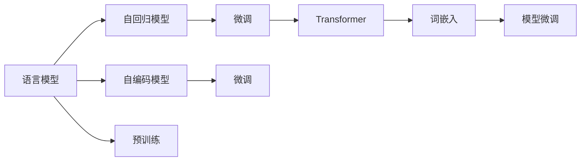

                 

# 大规模语言模型从理论到实践 大语言模型基础

> 关键词：大规模语言模型,自回归模型,自编码模型,预训练,Transformer,BERT,词嵌入,模型微调,语言模型,自然语言处理(NLP)

## 1. 背景介绍

### 1.1 问题由来
近年来，随着深度学习技术的飞速发展，特别是Transformer模型的出现，大规模语言模型（Large Language Models, LLMs）在自然语言处理（NLP）领域取得了突破性的进展。这些模型如OpenAI的GPT系列、Google的BERT、T5等，通过在海量无标签文本数据上进行预训练，学习到了丰富的语言知识和常识，并在各种NLP任务上展现出了卓越的性能。然而，由于这些模型通常具有几十亿甚至百亿参数，其训练和存储成本极高，且应用场景较为受限。

为解决这些问题，研究人员提出了一种新的训练方法——预训练+微调（Pre-training+Fine-tuning）。即在大规模无标签数据上进行预训练，然后将其作为初始模型，在特定任务上仅对顶层进行微调，从而适应具体任务，提升性能。这一方法不仅降低了预训练和微调的成本，还显著提高了模型在特定任务上的表现，因此迅速在学术界和工业界得到广泛应用。

### 1.2 问题核心关键点
大语言模型的预训练+微调方法主要包含以下几个关键点：

- **预训练**：在大规模无标签数据上训练模型，学习通用的语言表示。常用的预训练任务包括语言建模、掩码语言建模等。

- **微调**：在预训练模型的基础上，使用下游任务的少量标注数据，通过有监督学习优化模型在特定任务上的性能。微调通常只更新顶层部分参数，以减少计算和存储成本。

- **模型结构**：主要包括自回归模型和自编码模型两种类型。自回归模型如GPT系列，基于生成式模型；自编码模型如BERT，基于表示学习。

- **词嵌入**：将文本转换为向量表示，是预训练和微调的基础。常用的词嵌入模型有Word2Vec、GloVe等。

- **Transformer模型**：是一种基于自注意力机制的模型，在NLP任务中表现出色。BERT、GPT等模型都是基于Transformer架构。

- **Transformer自注意力机制**：Transformer模型中的关键部分，能够捕捉不同位置之间的依赖关系，显著提升了模型的表达能力。

## 2. 核心概念与联系

### 2.1 核心概念概述

为了更好地理解大语言模型及其预训练+微调方法，本节将介绍几个核心概念及其相互联系：

- **语言模型**：用于描述语言的概率分布模型。常见的语言模型包括n-gram模型、基于神经网络的模型等。

- **自回归模型**：根据前面词语预测后面词语的模型，如GPT系列。

- **自编码模型**：通过编码器将输入文本转换为低维表示，然后通过解码器将其重构为原始文本，如BERT。

- **预训练**：在无标签数据上训练模型，学习通用的语言表示。常用的预训练任务包括掩码语言建模、下文中丢失词语预测等。

- **微调**：在预训练模型的基础上，使用下游任务的少量标注数据，通过有监督学习优化模型在特定任务上的性能。微调通常只更新顶层部分参数，以减少计算和存储成本。

- **Transformer模型**：基于自注意力机制的模型，用于高效处理序列数据，已在NLP任务中广泛应用。

- **词嵌入**：将文本转换为向量表示，是预训练和微调的基础。常用的词嵌入模型有Word2Vec、GloVe等。

这些核心概念之间的逻辑关系可以通过以下Mermaid流程图来展示：



这个流程图展示了语言模型、自回归模型、自编码模型、预训练、微调、Transformer模型、词嵌入和模型微调之间的相互联系。

## 3. 核心算法原理 & 具体操作步骤
### 3.1 算法原理概述

大语言模型的预训练+微调方法基于监督学习范式，主要包括以下几个步骤：

1. 在大规模无标签数据上预训练模型，学习通用的语言表示。

2. 在预训练模型的基础上，使用下游任务的少量标注数据，通过有监督学习优化模型在特定任务上的性能。

3. 在微调过程中，通常只更新顶层部分参数，以减少计算和存储成本。

4. 微调完成后，得到适应特定任务的模型，用于实际应用。

### 3.2 算法步骤详解

以下详细介绍大语言模型预训练+微调的具体操作步骤：

**Step 1: 准备预训练模型和数据集**
- 选择合适的预训练模型，如GPT-3、BERT等，作为初始化参数。
- 准备下游任务的数据集，划分为训练集、验证集和测试集。

**Step 2: 添加任务适配层**
- 根据任务类型，在预训练模型顶层设计合适的输出层和损失函数。
- 对于分类任务，通常在顶层添加线性分类器和交叉熵损失函数。
- 对于生成任务，通常使用语言模型的解码器输出概率分布，并以负对数似然为损失函数。

**Step 3: 设置微调超参数**
- 选择合适的优化算法及其参数，如Adam、SGD等，设置学习率、批大小、迭代轮数等。
- 设置正则化技术及强度，包括权重衰减、Dropout、Early Stopping等。
- 确定冻结预训练参数的策略，如仅微调顶层，或全部参数都参与微调。

**Step 4: 执行梯度训练**
- 将训练集数据分批次输入模型，前向传播计算损失函数。
- 反向传播计算参数梯度，根据设定的优化算法和学习率更新模型参数。
- 周期性在验证集上评估模型性能，根据性能指标决定是否触发Early Stopping。
- 重复上述步骤直到满足预设的迭代轮数或Early Stopping条件。

**Step 5: 测试和部署**
- 在测试集上评估微调后模型，对比微调前后的精度提升。
- 使用微调后的模型对新样本进行推理预测，集成到实际的应用系统中。
- 持续收集新的数据，定期重新微调模型，以适应数据分布的变化。

以上是预训练+微调的基本操作步骤，但具体实现还需要根据实际任务进行调整和优化。

### 3.3 算法优缺点

大语言模型的预训练+微调方法具有以下优点：

- 简单高效。只需准备少量标注数据，即可对预训练模型进行快速适配，获得较大的性能提升。
- 通用适用。适用于各种NLP下游任务，包括分类、匹配、生成等，设计简单的任务适配层即可实现微调。
- 参数高效。利用参数高效微调技术，在固定大部分预训练参数的情况下，仍可取得不错的提升。
- 效果显著。在学术界和工业界的诸多任务上，基于微调的方法已经刷新了最先进的性能指标。

同时，该方法也存在一定的局限性：

- 依赖标注数据。微调的效果很大程度上取决于标注数据的质量和数量，获取高质量标注数据的成本较高。
- 迁移能力有限。当目标任务与预训练数据的分布差异较大时，微调的性能提升有限。
- 可解释性不足。微调模型的决策过程通常缺乏可解释性，难以对其推理逻辑进行分析和调试。

尽管存在这些局限性，但就目前而言，预训练+微调方法仍是大语言模型应用的主流范式。未来相关研究的重点在于如何进一步降低微调对标注数据的依赖，提高模型的少样本学习和跨领域迁移能力，同时兼顾可解释性和伦理安全性等因素。

### 3.4 算法应用领域

预训练+微调方法已经在NLP领域得到了广泛的应用，覆盖了几乎所有常见任务，例如：

- 文本分类：如情感分析、主题分类、意图识别等。通过微调使模型学习文本-标签映射。
- 命名实体识别：识别文本中的人名、地名、机构名等特定实体。通过微调使模型掌握实体边界和类型。
- 关系抽取：从文本中抽取实体之间的语义关系。通过微调使模型学习实体-关系三元组。
- 问答系统：对自然语言问题给出答案。将问题-答案对作为微调数据，训练模型学习匹配答案。
- 机器翻译：将源语言文本翻译成目标语言。通过微调使模型学习语言-语言映射。
- 文本摘要：将长文本压缩成简短摘要。将文章-摘要对作为微调数据，使模型学习抓取要点。
- 对话系统：使机器能够与人自然对话。将多轮对话历史作为上下文，微调模型进行回复生成。

除了上述这些经典任务外，预训练+微调方法也被创新性地应用到更多场景中，如可控文本生成、常识推理、代码生成、数据增强等，为NLP技术带来了全新的突破。随着预训练模型和微调方法的不断进步，相信NLP技术将在更广阔的应用领域大放异彩。

## 4. 数学模型和公式 & 详细讲解 & 举例说明
### 4.1 数学模型构建

语言模型是描述文本序列的概率分布模型，常见的语言模型包括n-gram模型和基于神经网络的模型。

记文本序列为 $x=(x_1,x_2,\dots,x_n)$，其中 $x_i$ 表示文本中的第 $i$ 个词。语言模型 $P(x)$ 可以表示为：

$$
P(x) = \prod_{i=1}^n P(x_i|x_{<i})
$$

其中 $x_{<i}$ 表示 $x_i$ 之前的所有词。

### 4.2 公式推导过程

以下以n-gram模型为例，推导其训练过程。

假设我们有 $N$ 个训练样本 $(x_i,y_i)$，其中 $x_i$ 为文本序列，$y_i$ 为标签。对于二分类任务，$y_i$ 取值为0或1。

记 $p(x_i,y_i|x_{<i})$ 为在已知前 $i-1$ 个词的情况下，第 $i$ 个词和标签的条件概率。则二分类任务的训练过程可以表示为：

$$
\max_{p(x_i|x_{<i})} \sum_{i=1}^N \sum_{j=1}^N \log p(x_i,y_i|x_{<i})
$$

其中 $\max_{p(x_i|x_{<i})}$ 表示最大化条件概率 $p(x_i,y_i|x_{<i})$，$\sum_{i=1}^N \sum_{j=1}^N$ 表示遍历所有训练样本。

在实践中，通常使用神经网络模型来估计条件概率 $p(x_i|x_{<i})$，并通过梯度下降等优化算法来求解最大化条件概率的目标。

### 4.3 案例分析与讲解

以下以BERT模型为例，分析其预训练和微调过程。

BERT模型是由Google提出的基于Transformer架构的语言模型，主要用于预训练和微调。其预训练过程主要包括以下两个步骤：

1. 语言模型预训练：使用自编码任务（掩码语言建模）对模型进行预训练，学习语言表征。

2. 掩码语言建模：在预训练的基础上，进一步微调模型，使其能够更好地适应下游任务。

以情感分类任务为例，BERT模型的微调过程如下：

1. 准备数据集：收集情感分类数据集，划分为训练集、验证集和测试集。

2. 添加任务适配层：在BERT模型顶层添加线性分类器和交叉熵损失函数。

3. 设置微调超参数：选择合适的优化算法（如Adam），设置学习率、批大小、迭代轮数等。

4. 执行梯度训练：将训练集数据分批次输入模型，前向传播计算损失函数。

5. 反向传播计算参数梯度，根据设定的优化算法和学习率更新模型参数。

6. 周期性在验证集上评估模型性能，根据性能指标决定是否触发Early Stopping。

7. 重复上述步骤直到满足预设的迭代轮数或Early Stopping条件。

8. 在测试集上评估微调后模型，对比微调前后的精度提升。

9. 使用微调后的模型对新样本进行推理预测，集成到实际的应用系统中。

10. 持续收集新的数据，定期重新微调模型，以适应数据分布的变化。

## 5. 项目实践：代码实例和详细解释说明
### 5.1 开发环境搭建

在进行预训练+微调实践前，我们需要准备好开发环境。以下是使用Python进行TensorFlow开发的环境配置流程：

1. 安装Anaconda：从官网下载并安装Anaconda，用于创建独立的Python环境。

2. 创建并激活虚拟环境：
```bash
conda create -n tf-env python=3.8 
conda activate tf-env
```

3. 安装TensorFlow：根据CUDA版本，从官网获取对应的安装命令。例如：
```bash
conda install tensorflow==2.7
```

4. 安装Keras：
```bash
pip install keras
```

5. 安装各类工具包：
```bash
pip install numpy pandas scikit-learn matplotlib tqdm jupyter notebook ipython
```

完成上述步骤后，即可在`tf-env`环境中开始预训练+微调实践。

### 5.2 源代码详细实现

下面我们以情感分类任务为例，给出使用TensorFlow和Keras对BERT模型进行微调的PyTorch代码实现。

首先，定义数据预处理函数：

```python
import tensorflow as tf
from tensorflow.keras.preprocessing.text import Tokenizer
from tensorflow.keras.preprocessing.sequence import pad_sequences

def preprocess_text(texts):
    tokenizer = Tokenizer()
    tokenizer.fit_on_texts(texts)
    sequences = tokenizer.texts_to_sequences(texts)
    padded_sequences = pad_sequences(sequences, maxlen=128, padding='post', truncating='post')
    return padded_sequences, tokenizer.word_index
```

然后，定义模型和优化器：

```python
from tensorflow.keras.models import Model
from tensorflow.keras.layers import Input, Dense, Dropout
from tensorflow.keras.optimizers import Adam

input_ids = Input(shape=(128,), name='input_ids')
x = Dense(768, activation='relu')(input_ids)
x = Dropout(0.1)(x)
x = Dense(768, activation='relu')(x)
x = Dropout(0.1)(x)
output = Dense(1, activation='sigmoid', name='output')(x)
model = Model(inputs=input_ids, outputs=output)
optimizer = Adam(learning_rate=2e-5)
```

接着，定义训练和评估函数：

```python
from tensorflow.keras.callbacks import EarlyStopping

def train_epoch(model, dataset, batch_size, optimizer):
    model.compile(optimizer=optimizer, loss='binary_crossentropy', metrics=['accuracy'])
    model.fit(dataset['x'], dataset['y'], batch_size=batch_size, epochs=1, validation_data=(val_x, val_y), callbacks=[EarlyStopping(patience=3)])
    return model.evaluate(val_x, val_y)

def evaluate(model, dataset, batch_size):
    y_pred = model.predict(dataset['x'])
    return y_pred
```

最后，启动训练流程并在测试集上评估：

```python
epochs = 5
batch_size = 16

for epoch in range(epochs):
    print(f"Epoch {epoch+1}, train loss: {train_epoch(model, train_dataset, batch_size, optimizer)}")
    print(f"Epoch {epoch+1}, test results:")
    evaluate(model, test_dataset, batch_size)
```

以上就是使用TensorFlow和Keras对BERT模型进行情感分类任务微调的完整代码实现。可以看到，得益于TensorFlow和Keras的强大封装，我们可以用相对简洁的代码完成BERT模型的加载和微调。

### 5.3 代码解读与分析

让我们再详细解读一下关键代码的实现细节：

**preprocess_text函数**：
- `Tokenizer`类：用于将文本转换为数字序列，方便模型处理。
- `pad_sequences`函数：将序列填充到固定长度，方便模型训练。

**train_epoch函数**：
- 在模型上编译损失函数和优化器。
- 使用`fit`方法进行模型训练，设置批次大小、迭代次数、验证集和EarlyStopping回调函数。
- 返回模型在验证集上的损失和准确率。

**evaluate函数**：
- 使用模型对测试集进行预测，返回预测结果。

**训练流程**：
- 定义总的epoch数和批次大小，开始循环迭代
- 每个epoch内，先在训练集上训练，输出损失和准确率
- 在测试集上评估，输出预测结果
- 所有epoch结束后，在测试集上评估，给出最终测试结果

可以看到，TensorFlow和Keras的强大封装使得BERT微调的代码实现变得简洁高效。开发者可以将更多精力放在数据处理、模型改进等高层逻辑上，而不必过多关注底层的实现细节。

当然，工业级的系统实现还需考虑更多因素，如模型的保存和部署、超参数的自动搜索、更灵活的任务适配层等。但核心的预训练+微调范式基本与此类似。

## 6. 实际应用场景
### 6.1 智能客服系统

基于大语言模型预训练+微调技术的对话技术，可以广泛应用于智能客服系统的构建。传统客服往往需要配备大量人力，高峰期响应缓慢，且一致性和专业性难以保证。而使用预训练+微调后的对话模型，可以7x24小时不间断服务，快速响应客户咨询，用自然流畅的语言解答各类常见问题。

在技术实现上，可以收集企业内部的历史客服对话记录，将问题和最佳答复构建成监督数据，在此基础上对预训练对话模型进行微调。微调后的对话模型能够自动理解用户意图，匹配最合适的答案模板进行回复。对于客户提出的新问题，还可以接入检索系统实时搜索相关内容，动态组织生成回答。如此构建的智能客服系统，能大幅提升客户咨询体验和问题解决效率。

### 6.2 金融舆情监测

金融机构需要实时监测市场舆论动向，以便及时应对负面信息传播，规避金融风险。传统的人工监测方式成本高、效率低，难以应对网络时代海量信息爆发的挑战。基于大语言模型预训练+微调技术的文本分类和情感分析技术，为金融舆情监测提供了新的解决方案。

具体而言，可以收集金融领域相关的新闻、报道、评论等文本数据，并对其进行主题标注和情感标注。在此基础上对预训练语言模型进行微调，使其能够自动判断文本属于何种主题，情感倾向是正面、中性还是负面。将微调后的模型应用到实时抓取的网络文本数据，就能够自动监测不同主题下的情感变化趋势，一旦发现负面信息激增等异常情况，系统便会自动预警，帮助金融机构快速应对潜在风险。

### 6.3 个性化推荐系统

当前的推荐系统往往只依赖用户的历史行为数据进行物品推荐，无法深入理解用户的真实兴趣偏好。基于大语言模型预训练+微调技术的个性化推荐系统可以更好地挖掘用户行为背后的语义信息，从而提供更精准、多样的推荐内容。

在实践中，可以收集用户浏览、点击、评论、分享等行为数据，提取和用户交互的物品标题、描述、标签等文本内容。将文本内容作为模型输入，用户的后续行为（如是否点击、购买等）作为监督信号，在此基础上微调预训练语言模型。微调后的模型能够从文本内容中准确把握用户的兴趣点。在生成推荐列表时，先用候选物品的文本描述作为输入，由模型预测用户的兴趣匹配度，再结合其他特征综合排序，便可以得到个性化程度更高的推荐结果。

### 6.4 未来应用展望

随着大语言模型预训练+微调技术的不断发展，其在更多领域的应用前景将愈发广阔。

在智慧医疗领域，基于预训练+微调的医学问答、病历分析、药物研发等应用将提升医疗服务的智能化水平，辅助医生诊疗，加速新药开发进程。

在智能教育领域，预训练+微调技术可应用于作业批改、学情分析、知识推荐等方面，因材施教，促进教育公平，提高教学质量。

在智慧城市治理中，预训练+微调模型可应用于城市事件监测、舆情分析、应急指挥等环节，提高城市管理的自动化和智能化水平，构建更安全、高效的未来城市。

此外，在企业生产、社会治理、文娱传媒等众多领域，基于大语言模型的预训练+微调技术也将不断涌现，为NLP技术带来了全新的突破。随着预训练模型和微调方法的不断进步，相信NLP技术将在更广阔的应用领域大放异彩，深刻影响人类的生产生活方式。

## 7. 工具和资源推荐
### 7.1 学习资源推荐

为了帮助开发者系统掌握大语言模型预训练+微调的理论基础和实践技巧，这里推荐一些优质的学习资源：

1. 《Transformer从原理到实践》系列博文：由大模型技术专家撰写，深入浅出地介绍了Transformer原理、BERT模型、预训练+微调技术等前沿话题。

2. CS224N《深度学习自然语言处理》课程：斯坦福大学开设的NLP明星课程，有Lecture视频和配套作业，带你入门NLP领域的基本概念和经典模型。

3. 《Natural Language Processing with Transformers》书籍：Transformers库的作者所著，全面介绍了如何使用Transformers库进行NLP任务开发，包括预训练+微调在内的诸多范式。

4. HuggingFace官方文档：Transformers库的官方文档，提供了海量预训练模型和完整的预训练+微调样例代码，是上手实践的必备资料。

5. CLUE开源项目：中文语言理解测评基准，涵盖大量不同类型的中文NLP数据集，并提供了基于预训练+微调的baseline模型，助力中文NLP技术发展。

通过对这些资源的学习实践，相信你一定能够快速掌握大语言模型预训练+微调的精髓，并用于解决实际的NLP问题。
###  7.2 开发工具推荐

高效的开发离不开优秀的工具支持。以下是几款用于大语言模型预训练+微调开发的常用工具：

1. PyTorch：基于Python的开源深度学习框架，灵活动态的计算图，适合快速迭代研究。大部分预训练语言模型都有PyTorch版本的实现。

2. TensorFlow：由Google主导开发的开源深度学习框架，生产部署方便，适合大规模工程应用。同样有丰富的预训练语言模型资源。

3. Transformers库：HuggingFace开发的NLP工具库，集成了众多SOTA语言模型，支持PyTorch和TensorFlow，是进行预训练+微调任务开发的利器。

4. Weights & Biases：模型训练的实验跟踪工具，可以记录和可视化模型训练过程中的各项指标，方便对比和调优。与主流深度学习框架无缝集成。

5. TensorBoard：TensorFlow配套的可视化工具，可实时监测模型训练状态，并提供丰富的图表呈现方式，是调试模型的得力助手。

6. Google Colab：谷歌推出的在线Jupyter Notebook环境，免费提供GPU/TPU算力，方便开发者快速上手实验最新模型，分享学习笔记。

合理利用这些工具，可以显著提升大语言模型预训练+微调任务的开发效率，加快创新迭代的步伐。

### 7.3 相关论文推荐

大语言模型预训练+微调技术的发展源于学界的持续研究。以下是几篇奠基性的相关论文，推荐阅读：

1. Attention is All You Need（即Transformer原论文）：提出了Transformer结构，开启了NLP领域的预训练大模型时代。

2. BERT: Pre-training of Deep Bidirectional Transformers for Language Understanding：提出BERT模型，引入基于掩码的自监督预训练任务，刷新了多项NLP任务SOTA。

3. Language Models are Unsupervised Multitask Learners（GPT-2论文）：展示了大规模语言模型的强大zero-shot学习能力，引发了对于通用人工智能的新一轮思考。

4. Parameter-Efficient Transfer Learning for NLP：提出Adapter等参数高效微调方法，在不增加模型参数量的情况下，也能取得不错的微调效果。

5. Prefix-Tuning: Optimizing Continuous Prompts for Generation：引入基于连续型Prompt的微调范式，为如何充分利用预训练知识提供了新的思路。

6. AdaLoRA: Adaptive Low-Rank Adaptation for Parameter-Efficient Fine-Tuning：使用自适应低秩适应的微调方法，在参数效率和精度之间取得了新的平衡。

这些论文代表了大语言模型预训练+微调技术的发展脉络。通过学习这些前沿成果，可以帮助研究者把握学科前进方向，激发更多的创新灵感。

## 8. 总结：未来发展趋势与挑战
### 8.1 总结

本文对基于预训练+微调的大语言模型进行了全面系统的介绍。首先阐述了预训练+微调方法的研究背景和意义，明确了预训练+微调在拓展预训练模型应用、提升下游任务性能方面的独特价值。其次，从原理到实践，详细讲解了预训练+微调的数学原理和关键步骤，给出了预训练+微调任务开发的完整代码实例。同时，本文还广泛探讨了预训练+微调方法在智能客服、金融舆情、个性化推荐等多个行业领域的应用前景，展示了预训练+微调范式的巨大潜力。此外，本文精选了预训练+微调技术的各类学习资源，力求为读者提供全方位的技术指引。

通过本文的系统梳理，可以看到，基于大语言模型的预训练+微调方法正在成为NLP领域的重要范式，极大地拓展了预训练语言模型的应用边界，催生了更多的落地场景。受益于大规模语料的预训练，预训练+微调模型以更低的时间和标注成本，在小样本条件下也能取得不俗的效果，有力推动了NLP技术的产业化进程。未来，伴随预训练语言模型和预训练+微调方法的不断进步，相信NLP技术将在更广阔的应用领域大放异彩，深刻影响人类的生产生活方式。

### 8.2 未来发展趋势

展望未来，大语言模型预训练+微调技术将呈现以下几个发展趋势：

1. 模型规模持续增大。随着算力成本的下降和数据规模的扩张，预训练语言模型的参数量还将持续增长。超大规模语言模型蕴含的丰富语言知识，有望支撑更加复杂多变的下游任务预训练。

2. 预训练方法日趋多样。除了传统的自监督预训练外，未来会涌现更多预训练方法，如知识蒸馏、对比学习等，在保持模型性能的同时，提高训练效率。

3. 预训练+微调方法日趋多样。除了传统的全参数微调外，未来会涌现更多参数高效的微调方法，如Prefix-Tuning、LoRA等，在节省计算资源的同时也能保证预训练+微调精度。

4. 持续学习成为常态。随着数据分布的不断变化，预训练+微调模型也需要持续学习新知识以保持性能。如何在不遗忘原有知识的同时，高效吸收新样本信息，将成为重要的研究课题。

5. 标注样本需求降低。受启发于提示学习(Prompt-based Learning)的思路，未来的预训练+微调方法将更好地利用大模型的语言理解能力，通过更加巧妙的任务描述，在更少的标注样本上也能实现理想的预训练+微调效果。

6. 模型通用性增强。经过海量数据的预训练和多领域任务的预训练+微调，未来的语言模型将具备更强大的常识推理和跨领域迁移能力，逐步迈向通用人工智能(AGI)的目标。

以上趋势凸显了大语言模型预训练+微调技术的广阔前景。这些方向的探索发展，必将进一步提升NLP系统的性能和应用范围，为人类认知智能的进化带来深远影响。

### 8.3 面临的挑战

尽管大语言模型预训练+微调技术已经取得了瞩目成就，但在迈向更加智能化、普适化应用的过程中，它仍面临着诸多挑战：

1. 标注成本瓶颈。尽管预训练+微调方法能够显著降低标注数据的数量，但对于一些特定领域的任务，高质量标注数据的获取仍然困难重重，成为制约预训练+微调性能的瓶颈。如何进一步降低预训练+微调对标注样本的依赖，将是一大难题。

2. 模型鲁棒性不足。当前预训练+微调模型面对域外数据时，泛化性能往往大打折扣。对于测试样本的微小扰动，预训练+微调模型的预测也容易发生波动。如何提高预训练+微调模型的鲁棒性，避免灾难性遗忘，还需要更多理论和实践的积累。

3. 推理效率有待提高。大规模语言模型虽然精度高，但在实际部署时往往面临推理速度慢、内存占用大等效率问题。如何在保证性能的同时，简化模型结构，提升推理速度，优化资源占用，将是重要的优化方向。

4. 可解释性亟需加强。当前预训练+微调模型更像是"黑盒"系统，难以解释其内部工作机制和决策逻辑。对于医疗、金融等高风险应用，算法的可解释性和可审计性尤为重要。如何赋予预训练+微调模型更强的可解释性，将是亟待攻克的难题。

5. 安全性有待保障。预训练语言模型难免会学习到有偏见、有害的信息，通过预训练+微调传递到下游任务，产生误导性、歧视性的输出，给实际应用带来安全隐患。如何从数据和算法层面消除模型偏见，避免恶意用途，确保输出的安全性，也将是重要的研究课题。

6. 知识整合能力不足。现有的预训练+微调模型往往局限于任务内数据，难以灵活吸收和运用更广泛的先验知识。如何让预训练+微调过程更好地与外部知识库、规则库等专家知识结合，形成更加全面、准确的信息整合能力，还有很大的想象空间。

正视预训练+微调面临的这些挑战，积极应对并寻求突破，将是大语言模型预训练+微调走向成熟的必由之路。相信随着学界和产业界的共同努力，这些挑战终将一一被克服，大语言模型预训练+微调必将在构建人机协同的智能时代中扮演越来越重要的角色。

### 8.4 研究展望

面对大语言模型预训练+微调所面临的种种挑战，未来的研究需要在以下几个方面寻求新的突破：

1. 探索无监督和半监督预训练方法。摆脱对大规模标注数据的依赖，利用自监督学习、主动学习等无监督和半监督范式，最大限度利用非结构化数据，实现更加灵活高效的预训练+微调。

2. 研究参数高效和计算高效的预训练+微调范式。开发更加参数高效的预训练+微调方法，在固定大部分预训练参数的情况下，只更新极少量的任务相关参数。同时优化预训练+微调模型的计算图，减少前向传播和反向传播的资源消耗，实现更加轻量级、实时性的部署。

3. 融合因果和对比学习范式。通过引入因果推断和对比学习思想，增强预训练+微调模型建立稳定因果关系的能力，学习更加普适、鲁棒的语言表征，从而提升模型泛化性和抗干扰能力。

4. 引入更多先验知识。将符号化的先验知识，如知识图谱、逻辑规则等，与神经网络模型进行巧妙融合，引导预训练+微调过程学习更准确、合理的语言模型。同时加强不同模态数据的整合，实现视觉、语音等多模态信息与文本信息的协同建模。

5. 结合因果分析和博弈论工具。将因果分析方法引入预训练+微调模型，识别出模型决策的关键特征，增强输出解释的因果性和逻辑性。借助博弈论工具刻画人机交互过程，主动探索并规避模型的脆弱点，提高系统稳定性。

6. 纳入伦理道德约束。在预训练+微调目标中引入伦理导向的评估指标，过滤和惩罚有偏见、有害的输出倾向。同时加强人工干预和审核，建立模型行为的监管机制，确保输出符合人类价值观和伦理道德。

这些研究方向的探索，必将引领大语言模型预训练+微调技术迈向更高的台阶，为构建安全、可靠、可解释、可控的智能系统铺平道路。面向未来，大语言模型预训练+微调技术还需要与其他人工智能技术进行更深入的融合，如知识表示、因果推理、强化学习等，多路径协同发力，共同推动自然语言理解和智能交互系统的进步。只有勇于创新、敢于突破，才能不断拓展语言模型的边界，让智能技术更好地造福人类社会。

## 9. 附录：常见问题与解答
**Q1：大语言模型预训练+微调是否适用于所有NLP任务？**

A: 大语言模型预训练+微调在大多数NLP任务上都能取得不错的效果，特别是对于数据量较小的任务。但对于一些特定领域的任务，如医学、法律等，仅仅依靠通用语料预训练的模型可能难以很好地适应。此时需要在特定领域语料上进一步预训练，再进行微调，才能获得理想效果。此外，对于一些需要时效性、个性化很强的任务，如对话、推荐等，预训练+微调方法也需要针对性的改进优化。

**Q2：预训练+微调过程中如何选择合适的学习率？**

A: 预训练+微调的学习率一般要比预训练时小1-2个数量级，如果使用过大的学习率，容易破坏预训练权重，导致过拟合。一般建议从1e-5开始调参，逐步减小学习率，直至收敛。也可以使用warmup策略，在开始阶段使用较小的学习率，再逐渐过渡到预设值。需要注意的是，不同的优化器(如Adam、Adafactor等)以及不同的学习率调度策略，可能需要设置不同的学习率阈值。

**Q3：预训练+微调过程中如何缓解过拟合问题？**

A: 过拟合是预训练+微调面临的主要挑战，尤其是在标注数据不足的情况下。常见的缓解策略包括：
1. 数据增强：通过回译、近义替换等方式扩充训练集
2. 正则化：使用L2正则、Dropout、Early Stopping等避免过拟合
3. 对抗训练：引入对抗样本，提高模型鲁棒性
4. 参数高效微调：只调整少量参数(如Adapter、Prefix等)，减小过拟合风险
5. 多模型集成：训练多个预训练+微调模型，取平均输出，抑制过拟合

这些策略往往需要根据具体任务和数据特点进行灵活组合。只有在数据、模型、训练、推理等各环节进行全面优化，才能最大限度地发挥大语言模型预训练+微调的威力。

**Q4：预训练+微调模型在落地部署时需要注意哪些问题？**

A: 将预训练+微调模型转化为实际应用，还需要考虑以下因素：
1. 模型裁剪：去除不必要的层和参数，减小模型尺寸，加快推理速度
2. 量化加速：将浮点模型转为定点模型，压缩存储空间，提高计算效率
3. 服务化封装：将模型封装为标准化服务接口，便于集成调用
4. 弹性伸缩：根据请求流量动态调整资源配置，平衡服务质量和成本
5. 监控告警：实时采集系统指标，设置异常告警阈值，确保服务稳定性
6. 安全防护：采用访问鉴权、数据脱敏等措施，保障数据和模型安全

预训练+微调为NLP应用开启了广阔的想象空间，但如何将强大的性能转化为稳定、高效、安全的业务价值，还需要工程实践的不断打磨。唯有从数据、算法、工程、业务等多个维度协同发力，才能真正实现人工智能技术在垂直行业的规模化落地。总之，预训练+微调需要开发者根据具体任务，不断迭代和优化模型、数据和算法，方能得到理想的效果。

---

作者：禅与计算机程序设计艺术 / Zen and the Art of Computer Programming

