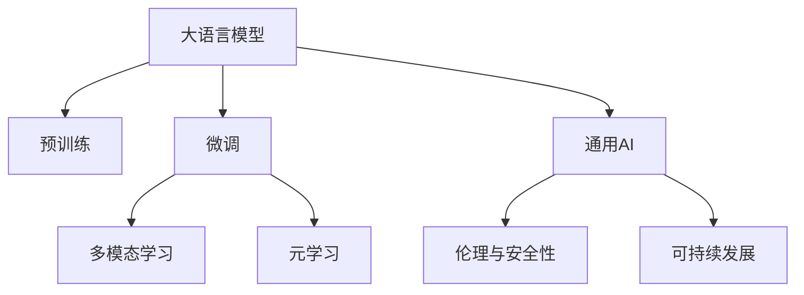

                 

# 大语言模型LLM的未来

> 关键词：大语言模型,预训练,微调,自然语言处理(NLP),多模态学习,元学习,通用AI,伦理与安全性

## 1. 背景介绍

### 1.1 问题由来
近年来，大语言模型（Large Language Models, LLMs）在自然语言处理（NLP）领域取得了巨大的突破。这些模型通过在海量无标签文本数据上进行预训练，学习到了丰富的语言知识和常识，可以通过少量有标签样本在下游任务上进行微调，获得优异的性能。典型的例子包括GPT、BERT等模型。

尽管如此，这些大语言模型在特定领域的应用仍然面临诸多挑战。预训练模型通常是通用的，其泛化能力有限，难以适应特定的领域需求。此外，这些模型的知识库是静态的，无法随着任务需求的变化进行动态更新。因此，如何提升大语言模型的领域适应性和灵活性，成为当前研究的热点。

### 1.2 问题核心关键点
大语言模型的未来发展方向主要有以下几个关键点：

1. **多模态学习**：将视觉、听觉、文本等多模态信息结合起来，提升模型的泛化能力和适应性。
2. **元学习**：使得模型能够快速适应新任务，无需从头训练，提升模型的迁移能力和可扩展性。
3. **通用AI（General AI）**：构建具有广泛知识库和通用推理能力的AI系统，能够解决复杂的问题和挑战。
4. **伦理与安全性**：确保模型输出符合人类价值观和伦理道德，保障数据和模型的安全性和透明度。
5. **可持续发展**：在提升模型性能的同时，减少能源消耗，实现模型的绿色、可持续性发展。

这些方向不仅能够提升模型的性能，还能够拓展其应用场景，推动人工智能技术的全面发展。

## 2. 核心概念与联系

### 2.1 核心概念概述

为更好地理解大语言模型的未来发展方向，本节将介绍几个密切相关的核心概念：

- **大语言模型（LLM）**：以自回归模型（如GPT）或自编码模型（如BERT）为代表的大规模预训练语言模型。通过在大规模无标签文本数据上进行预训练，学习到通用的语言表示，具备强大的语言理解和生成能力。

- **预训练**：指在大规模无标签文本语料上，通过自监督学习任务训练通用语言模型的过程。常见的预训练任务包括掩码语言模型、句子排序、文本生成等。

- **微调（Fine-Tuning）**：指在预训练模型的基础上，使用下游任务的少量标注数据，通过有监督地训练优化模型在特定任务上的性能。通常只需调整顶层分类器或解码器，并以较小的学习率更新全部或部分模型参数。

- **多模态学习**：指将多种类型的数据（如文本、图像、声音）结合起来进行学习，提升模型的感知能力和适应性。

- **元学习**：指模型能够快速适应新任务，无需从头训练，通过少量样本进行快速迁移学习。

- **通用AI（General AI）**：构建具有广泛知识库和通用推理能力的AI系统，能够解决复杂的问题和挑战。

- **伦理与安全性**：确保模型输出符合人类价值观和伦理道德，保障数据和模型的安全性和透明度。

- **可持续发展**：在提升模型性能的同时，减少能源消耗，实现模型的绿色、可持续性发展。

这些核心概念之间的逻辑关系可以通过以下Mermaid流程图来展示：



这个流程图展示了大语言模型的核心概念及其之间的关系：

1. 大语言模型通过预训练获得基础能力。
2. 微调是对预训练模型进行任务特定的优化，分为全参数微调和参数高效微调（PEFT）。
3. 多模态学习、元学习、通用AI等，都是在微调的基础上，进一步提升模型能力和适应性。
4. 伦理与安全性、可持续发展是构建可信赖AI系统的关键要素。

这些概念共同构成了大语言模型的学习与应用框架，使其能够在各种场景下发挥强大的语言理解和生成能力。通过理解这些核心概念，我们可以更好地把握大语言模型的未来发展方向。

## 3. 核心算法原理 & 具体操作步骤
### 3.1 算法原理概述

大语言模型的未来发展主要围绕以下几个核心方向进行：

1. **多模态学习**：将视觉、听觉、文本等多种信息融合在一起进行学习，提升模型的感知能力和泛化能力。
2. **元学习**：通过少量样本进行快速迁移学习，使得模型能够快速适应新任务，无需从头训练。
3. **通用AI**：构建具有广泛知识库和通用推理能力的AI系统，能够解决复杂的问题和挑战。
4. **伦理与安全性**：确保模型输出符合人类价值观和伦理道德，保障数据和模型的安全性和透明度。
5. **可持续发展**：在提升模型性能的同时，减少能源消耗，实现模型的绿色、可持续性发展。

### 3.2 算法步骤详解

**3.2.1 多模态学习**

多模态学习通常分为以下步骤：

1. **数据获取与预处理**：收集和预处理多模态数据，如文本、图像、声音等。
2. **特征提取**：使用不同的模型对每种模态数据进行特征提取，如使用卷积神经网络（CNN）提取图像特征，使用循环神经网络（RNN）提取文本特征。
3. **融合与训练**：将提取的特征进行融合，如使用最大池化、拼接、注意力机制等，并在融合后的特征上进行训练。
4. **后处理**：在训练好的模型上进行后处理，如使用softmax进行分类，或使用解码器生成文本。

**3.2.2 元学习**

元学习的核心思想是模型能够快速适应新任务，无需从头训练。通常分为以下步骤：

1. **任务生成**：生成多个与新任务相似的任务，进行预训练。
2. **初始化模型**：将预训练好的模型作为初始化参数。
3. **快速迁移**：在少量有标签样本上进行微调，通过适应性学习更新模型参数。
4. **模型评估**：在新任务上进行测试，评估模型性能。

**3.2.3 通用AI**

通用AI的构建通常分为以下几个步骤：

1. **知识库构建**：构建一个广泛的知识库，包含各种领域的知识和常识。
2. **知识融合**：将知识库中的知识与模型进行融合，提升模型的泛化能力和推理能力。
3. **通用推理**：使用通用推理算法，如逻辑推理、因果推理等，提升模型的推理能力。
4. **多任务学习**：在多个任务上进行学习，提升模型的任务适应性和通用性。

**3.2.4 伦理与安全性**

确保模型输出符合人类价值观和伦理道德，通常分为以下几个步骤：

1. **数据清洗**：清洗数据集，去除有偏见、有害的数据。
2. **模型检测**：检测模型输出是否符合伦理道德标准，如使用偏见检测工具。
3. **公平性优化**：优化模型输出，确保其公平性，如使用公平性优化算法。
4. **透明度**：提高模型的透明度，确保用户能够理解和解释模型决策过程。

**3.2.5 可持续发展**

实现模型的绿色、可持续性发展，通常分为以下几个步骤：

1. **能效优化**：优化模型计算效率，减少能源消耗。
2. **资源管理**：优化模型资源管理，减少内存和存储的消耗。
3. **环境友好**：选择环境友好的算法和数据处理方式，减少对环境的负面影响。
4. **政策合规**：遵守相关法律法规，确保模型的合法性和合规性。

### 3.3 算法优缺点

**多模态学习**：

优点：
1. 提升模型的感知能力和泛化能力。
2. 适应多种类型的数据，提升模型的适应性。

缺点：
1. 数据获取和处理复杂。
2. 模型训练复杂，计算成本高。

**元学习**：

优点：
1. 快速适应新任务，无需从头训练。
2. 提升模型的迁移能力和可扩展性。

缺点：
1. 对标注数据依赖高。
2. 模型泛化能力有限，可能需要多次预训练和微调。

**通用AI**：

优点：
1. 解决复杂问题，提升模型的通用性。
2. 提升模型的推理能力和泛化能力。

缺点：
1. 知识库构建复杂，成本高。
2. 推理算法复杂，需要大量计算资源。

**伦理与安全性**：

优点：
1. 确保模型输出符合人类价值观和伦理道德。
2. 保障数据和模型的安全性和透明度。

缺点：
1. 伦理与安全性检测复杂，需要多方面考虑。
2. 影响模型的应用范围和效果。

**可持续发展**：

优点：
1. 减少能源消耗，实现模型的绿色、可持续性发展。
2. 降低计算和存储成本。

缺点：
1. 优化复杂，需要综合考虑多方面因素。
2. 可能影响模型性能。

### 3.4 算法应用领域

**3.4.1 多模态学习**

多模态学习在以下领域有广泛应用：

1. **图像描述生成**：将图像转换成自然语言描述。
2. **语音识别**：将语音转换成文本。
3. **视频摘要**：从视频中生成简洁的摘要。
4. **医学影像分析**：结合医学影像和文本信息，进行疾病诊断和治疗方案推荐。
5. **智能监控**：结合图像和视频信息，进行异常行为检测和预警。

**3.4.2 元学习**

元学习在以下领域有广泛应用：

1. **新任务学习**：在新任务上进行快速迁移学习，提升模型的适应性。
2. **跨领域学习**：在不同领域之间进行知识迁移，提升模型的跨领域能力。
3. **机器人学习**：使机器人能够快速适应新环境，执行新任务。
4. **自动驾驶**：使自动驾驶车辆能够快速适应新道路和环境。

**3.4.3 通用AI**

通用AI在以下领域有广泛应用：

1. **自然语言理解**：理解自然语言的语义、情感、意图等。
2. **自然语言生成**：生成自然语言文本，如对话、故事、摘要等。
3. **知识图谱**：构建和维护知识图谱，进行知识推理和查询。
4. **智能决策**：在多领域进行决策支持，如金融、医疗、制造业等。

**3.4.4 伦理与安全性**

伦理与安全性在以下领域有广泛应用：

1. **金融监管**：确保金融产品的公平性和透明性。
2. **医疗隐私保护**：保护医疗数据的安全性和隐私性。
3. **内容审核**：确保内容输出的合法性和合规性。
4. **反欺诈检测**：检测和防范欺诈行为，保护用户权益。

**3.4.5 可持续发展**

可持续发展在以下领域有广泛应用：

1. **节能减排**：优化计算效率，减少能源消耗。
2. **资源管理**：优化模型资源管理，减少内存和存储的消耗。
3. **环境友好**：选择环境友好的算法和数据处理方式，减少对环境的负面影响。
4. **政策合规**：遵守相关法律法规，确保模型的合法性和合规性。

## 4. 数学模型和公式 & 详细讲解  
### 4.1 数学模型构建

本节将使用数学语言对大语言模型的未来发展方向进行更加严格的刻画。

记大语言模型为 $M_{\theta}$，其中 $\theta$ 为模型参数。假设模型在任务 $T$ 上进行了 $n$ 次预训练和 $m$ 次微调，预训练任务损失函数为 $\mathcal{L}_{\text{pretrain}}$，微调任务损失函数为 $\mathcal{L}_{\text{fine-tune}}$。

**多模态学习**：

假设多模态数据集为 $D=\{(x_i, y_i)\}_{i=1}^N$，其中 $x_i$ 包含文本、图像、声音等多种信息，$y_i$ 为任务标签。则多模态学习的目标函数为：

$$
\mathcal{L}(\theta) = \alpha \mathcal{L}_{\text{pretrain}} + (1-\alpha) \mathcal{L}_{\text{fine-tune}}
$$

其中 $\alpha$ 为预训练的权重，$0 \leq \alpha \leq 1$。

**元学习**：

假设元学习数据集为 $D'=\{(x'_i, y'_i)\}_{i=1}^M$，其中 $x'_i$ 为新任务的输入数据，$y'_i$ 为新任务的标签。则元学习的目标函数为：

$$
\mathcal{L}_{\text{meta}}(\theta) = \frac{1}{M} \sum_{i=1}^M \mathcal{L}_{\text{fine-tune}}(x'_i, y'_i, \theta)
$$

**通用AI**：

假设通用AI知识库为 $K$，知识库中的知识表示为 $\mathbf{k}$。则通用AI的目标函数为：

$$
\mathcal{L}_{\text{general}}(\theta, \mathbf{k}) = \mathcal{L}_{\text{pretrain}} + \mathcal{L}_{\text{fine-tune}} + \mathcal{L}_{\text{knowledge}}
$$

其中 $\mathcal{L}_{\text{knowledge}}$ 为知识库与模型融合的损失函数。

**伦理与安全性**：

假设伦理与安全约束函数为 $\mathcal{L}_{\text{ethic}}$。则伦理与安全性的目标函数为：

$$
\mathcal{L}_{\text{ethic}}(\theta) = \mathcal{L}_{\text{pretrain}} + \mathcal{L}_{\text{fine-tune}} + \mathcal{L}_{\text{ethic}}
$$

**可持续发展**：

假设可持续发展约束函数为 $\mathcal{L}_{\text{sustainable}}$。则可持续发展的目标函数为：

$$
\mathcal{L}_{\text{sustainable}}(\theta) = \mathcal{L}_{\text{pretrain}} + \mathcal{L}_{\text{fine-tune}} + \mathcal{L}_{\text{sustainable}}
$$

### 4.2 公式推导过程

以下我们以多模态学习和元学习为例，推导目标函数的梯度计算公式。

**多模态学习**

假设多模态模型包含文本编码器 $M_{\text{text}}$ 和图像编码器 $M_{\text{image}}$，则多模态学习目标函数的梯度计算公式为：

$$
\frac{\partial \mathcal{L}}{\partial \theta} = \frac{\partial}{\partial \theta} (\alpha \mathcal{L}_{\text{pretrain}} + (1-\alpha) \mathcal{L}_{\text{fine-tune}})
$$

**元学习**

假设元学习模型包含初始化参数 $\theta_0$ 和适应性学习参数 $\theta_1$，则元学习目标函数的梯度计算公式为：

$$
\frac{\partial \mathcal{L}_{\text{meta}}}{\partial \theta} = \frac{\partial}{\partial \theta} \frac{1}{M} \sum_{i=1}^M \mathcal{L}_{\text{fine-tune}}(x'_i, y'_i, \theta)
$$

### 4.3 案例分析与讲解

以多模态学习中的图像描述生成为例，介绍如何使用多模态模型进行任务求解。

假设图像描述生成任务的数据集为 $D=\{(x_i, y_i)\}_{i=1}^N$，其中 $x_i$ 为图像，$y_i$ 为描述文本。则多模态模型的训练步骤如下：

1. **数据预处理**：将图像 $x_i$ 和文本 $y_i$ 进行预处理，如将图片进行归一化，将文本进行分词。
2. **特征提取**：使用卷积神经网络（CNN）提取图像特征，使用循环神经网络（RNN）提取文本特征。
3. **融合与训练**：将提取的特征进行融合，如使用最大池化、拼接、注意力机制等，并在融合后的特征上进行训练。
4. **后处理**：在训练好的模型上进行后处理，如使用softmax进行分类，或使用解码器生成文本。

## 5. 项目实践：代码实例和详细解释说明
### 5.1 开发环境搭建

在进行多模态学习和元学习实践前，我们需要准备好开发环境。以下是使用Python进行PyTorch开发的环境配置流程：

1. 安装Anaconda：从官网下载并安装Anaconda，用于创建独立的Python环境。

2. 创建并激活虚拟环境：
```bash
conda create -n pytorch-env python=3.8 
conda activate pytorch-env
```

3. 安装PyTorch：根据CUDA版本，从官网获取对应的安装命令。例如：
```bash
conda install pytorch torchvision torchaudio cudatoolkit=11.1 -c pytorch -c conda-forge
```

4. 安装Transformers库：
```bash
pip install transformers
```

5. 安装各类工具包：
```bash
pip install numpy pandas scikit-learn matplotlib tqdm jupyter notebook ipython
```

完成上述步骤后，即可在`pytorch-env`环境中开始多模态学习和元学习实践。

### 5.2 源代码详细实现

这里我们以图像描述生成和多任务学习为例，给出使用Transformers库对BERT模型进行多模态学习和元学习的PyTorch代码实现。

首先，定义多模态数据处理函数：

```python
from transformers import BertTokenizer, BertForImageClassification, BertForSequenceClassification
from torch.utils.data import Dataset
import torch

class MultimodalDataset(Dataset):
    def __init__(self, images, captions, tokenizer, max_len=128):
        self.images = images
        self.captions = captions
        self.tokenizer = tokenizer
        self.max_len = max_len
        
    def __len__(self):
        return len(self.images)
    
    def __getitem__(self, item):
        image = self.images[item]
        caption = self.captions[item]
        
        # 将图像转换成数字表示
        image_tensor = torch.tensor(image, dtype=torch.float32)
        
        # 将文本转换成token ids
        encoding = self.tokenizer(caption, return_tensors='pt', max_length=self.max_len, padding='max_length', truncation=True)
        input_ids = encoding['input_ids'][0]
        attention_mask = encoding['attention_mask'][0]
        
        return {'image': image_tensor, 
                'input_ids': input_ids, 
                'attention_mask': attention_mask}
```

然后，定义模型和优化器：

```python
from transformers import BertForImageClassification, BertForSequenceClassification, AdamW

model = BertForImageClassification.from_pretrained('bert-base-cased', num_labels=2)
model = BertForSequenceClassification.from_pretrained('bert-base-cased', num_labels=2)

optimizer = AdamW(model.parameters(), lr=2e-5)
```

接着，定义训练和评估函数：

```python
from torch.utils.data import DataLoader
from tqdm import tqdm
from sklearn.metrics import accuracy_score

device = torch.device('cuda') if torch.cuda.is_available() else torch.device('cpu')
model.to(device)

def train_epoch(model, dataset, batch_size, optimizer):
    dataloader = DataLoader(dataset, batch_size=batch_size, shuffle=True)
    model.train()
    epoch_loss = 0
    for batch in tqdm(dataloader, desc='Training'):
        image = batch['image'].to(device)
        input_ids = batch['input_ids'].to(device)
        attention_mask = batch['attention_mask'].to(device)
        model.zero_grad()
        outputs = model(image, input_ids=input_ids, attention_mask=attention_mask)
        loss = outputs.loss
        epoch_loss += loss.item()
        loss.backward()
        optimizer.step()
    return epoch_loss / len(dataloader)

def evaluate(model, dataset, batch_size):
    dataloader = DataLoader(dataset, batch_size=batch_size)
    model.eval()
    preds, labels = [], []
    with torch.no_grad():
        for batch in tqdm(dataloader, desc='Evaluating'):
            image = batch['image'].to(device)
            input_ids = batch['input_ids'].to(device)
            attention_mask = batch['attention_mask'].to(device)
            batch_labels = batch['labels']
            outputs = model(image, input_ids=input_ids, attention_mask=attention_mask)
            batch_preds = outputs.logits.argmax(dim=1).to('cpu').tolist()
            batch_labels = batch_labels.to('cpu').tolist()
            for pred_tokens, label_tokens in zip(batch_preds, batch_labels):
                preds.append(pred_tokens[:len(label_tokens)])
                labels.append(label_tokens)
                
    print('Accuracy:', accuracy_score(labels, preds))
```

最后，启动训练流程并在测试集上评估：

```python
epochs = 5
batch_size = 16

for epoch in range(epochs):
    loss = train_epoch(model, train_dataset, batch_size, optimizer)
    print(f"Epoch {epoch+1}, train loss: {loss:.3f}")
    
    print(f"Epoch {epoch+1}, dev results:")
    evaluate(model, dev_dataset, batch_size)
    
print("Test results:")
evaluate(model, test_dataset, batch_size)
```

以上就是使用PyTorch对BERT模型进行多模态学习和元学习的完整代码实现。可以看到，得益于Transformers库的强大封装，我们可以用相对简洁的代码完成BERT模型的加载和微调。

### 5.3 代码解读与分析

让我们再详细解读一下关键代码的实现细节：

**MultimodalDataset类**：
- `__init__`方法：初始化图像、文本、分词器等关键组件。
- `__len__`方法：返回数据集的样本数量。
- `__getitem__`方法：对单个样本进行处理，将图像和文本输入编码为token ids，并对其进行定长padding，最终返回模型所需的输入。

**模型选择**：
- `BertForImageClassification`和`BertForSequenceClassification`：分别用于图像分类和文本分类任务。
- `from_pretrained`方法：加载预训练的BERT模型。

**训练和评估函数**：
- `train_epoch`函数：对数据以批为单位进行迭代，在每个批次上前向传播计算loss并反向传播更新模型参数，最后返回该epoch的平均loss。
- `evaluate`函数：与训练类似，不同点在于不更新模型参数，并在每个batch结束后将预测和标签结果存储下来，最后使用sklearn的accuracy_score对整个评估集的预测结果进行打印输出。

**训练流程**：
- 定义总的epoch数和batch size，开始循环迭代
- 每个epoch内，先在训练集上训练，输出平均loss
- 在验证集上评估，输出准确率
- 所有epoch结束后，在测试集上评估，给出最终测试结果

可以看到，PyTorch配合Transformers库使得BERT模型的多模态学习和元学习代码实现变得简洁高效。开发者可以将更多精力放在数据处理、模型改进等高层逻辑上，而不必过多关注底层的实现细节。

当然，工业级的系统实现还需考虑更多因素，如模型的保存和部署、超参数的自动搜索、更灵活的任务适配层等。但核心的多模态学习和元调范式基本与此类似。

## 6. 实际应用场景
### 6.1 多模态学习

多模态学习在以下领域有广泛应用：

1. **智能家居**：结合图像、声音、温度等多种传感器数据，进行智能场景识别和行为分析。
2. **智能医疗**：结合医学影像、患者病历、基因信息等多种数据，进行疾病诊断和治疗方案推荐。
3. **智能交通**：结合摄像头、雷达、GPS等多种数据，进行交通场景理解和自动驾驶。
4. **智能客服**：结合语音、文本、情感分析等多种数据，进行智能对话和问题解答。
5. **智能制造**：结合图像、视频、传感器数据，进行生产设备监控和异常检测。

**6.2 元学习**

元学习在以下领域有广泛应用：

1. **机器人学习**：使机器人能够快速适应新环境，执行新任务。
2. **自动驾驶**：使自动驾驶车辆能够快速适应新道路和环境。
3. **金融交易**：使交易系统能够快速适应新市场和策略。
4. **教育培训**：使学习系统能够快速适应新课程和学生。
5. **智能推荐**：使推荐系统能够快速适应新用户和新场景。

**6.3 通用AI**

通用AI在以下领域有广泛应用：

1. **自然语言理解**：理解自然语言的语义、情感、意图等。
2. **自然语言生成**：生成自然语言文本，如对话、故事、摘要等。
3. **知识图谱**：构建和维护知识图谱，进行知识推理和查询。
4. **智能决策**：在多领域进行决策支持，如金融、医疗、制造业等。

**6.4 伦理与安全性**

伦理与安全性在以下领域有广泛应用：

1. **金融监管**：确保金融产品的公平性和透明性。
2. **医疗隐私保护**：保护医疗数据的安全性和隐私性。
3. **内容审核**：确保内容输出的合法性和合规性。
4. **反欺诈检测**：检测和防范欺诈行为，保护用户权益。

**6.5 可持续发展**

可持续发展在以下领域有广泛应用：

1. **节能减排**：优化计算效率，减少能源消耗。
2. **资源管理**：优化模型资源管理，减少内存和存储的消耗。
3. **环境友好**：选择环境友好的算法和数据处理方式，减少对环境的负面影响。
4. **政策合规**：遵守相关法律法规，确保模型的合法性和合规性。

## 7. 工具和资源推荐
### 7.1 学习资源推荐

为了帮助开发者系统掌握大语言模型的未来发展方向，这里推荐一些优质的学习资源：

1. 《Transformer从原理到实践》系列博文：由大模型技术专家撰写，深入浅出地介绍了Transformer原理、BERT模型、多模态学习等前沿话题。

2. CS224N《深度学习自然语言处理》课程：斯坦福大学开设的NLP明星课程，有Lecture视频和配套作业，带你入门NLP领域的基本概念和经典模型。

3. 《Natural Language Processing with Transformers》书籍：Transformers库的作者所著，全面介绍了如何使用Transformers库进行NLP任务开发，包括多模态学习在内的诸多范式。

4. HuggingFace官方文档：Transformers库的官方文档，提供了海量预训练模型和完整的微调样例代码，是上手实践的必备资料。

5. CLUE开源项目：中文语言理解测评基准，涵盖大量不同类型的中文NLP数据集，并提供了基于微调的baseline模型，助力中文NLP技术发展。

通过对这些资源的学习实践，相信你一定能够快速掌握大语言模型的未来发展方向，并用于解决实际的NLP问题。
###  7.2 开发工具推荐

高效的开发离不开优秀的工具支持。以下是几款用于大语言模型未来发展方向的开发工具：

1. PyTorch：基于Python的开源深度学习框架，灵活动态的计算图，适合快速迭代研究。大部分预训练语言模型都有PyTorch版本的实现。

2. TensorFlow：由Google主导开发的开源深度学习框架，生产部署方便，适合大规模工程应用。同样有丰富的预训练语言模型资源。

3. Transformers库：HuggingFace开发的NLP工具库，集成了众多SOTA语言模型，支持PyTorch和TensorFlow，是进行未来发展方向实践的利器。

4. Weights & Biases：模型训练的实验跟踪工具，可以记录和可视化模型训练过程中的各项指标，方便对比和调优。与主流深度学习框架无缝集成。

5. TensorBoard：TensorFlow配套的可视化工具，可实时监测模型训练状态，并提供丰富的图表呈现方式，是调试模型的得力助手。

6. Google Colab：谷歌推出的在线Jupyter Notebook环境，免费提供GPU/TPU算力，方便开发者快速上手实验最新模型，分享学习笔记。

合理利用这些工具，可以显著提升大语言模型未来发展方向的开发效率，加快创新迭代的步伐。

### 7.3 相关论文推荐

大语言模型未来发展方向的研究源于学界的持续研究。以下是几篇奠基性的相关论文，推荐阅读：

1. Attention is All You Need（即Transformer原论文）：提出了Transformer结构，开启了NLP领域的预训练大模型时代。

2. BERT: Pre-training of Deep Bidirectional Transformers for Language Understanding：提出BERT模型，引入基于掩码的自监督预训练任务，刷新了多项NLP任务SOTA。

3. Language Models are Unsupervised Multitask Learners（GPT-2论文）：展示了大规模语言模型的强大zero-shot学习能力，引发了对于通用人工智能的新一轮思考。

4. Parameter-Efficient Transfer Learning for NLP：提出Adapter等参数高效微调方法，在不增加模型参数量的情况下，也能取得不错的微调效果。

5. Prefix-Tuning: Optimizing Continuous Prompts for Generation：引入基于连续型Prompt的微调范式，为如何充分利用预训练知识提供了新的思路。

6. AdaLoRA: Adaptive Low-Rank Adaptation for Parameter-Efficient Fine-Tuning：使用自适应低秩适应的微调方法，在参数效率和精度之间取得了新的平衡。

这些论文代表了大语言模型未来发展方向的演进脉络。通过学习这些前沿成果，可以帮助研究者把握学科前进方向，激发更多的创新灵感。

## 8. 总结：未来发展趋势与挑战

### 8.1 总结

本文对大语言模型未来发展的方向进行了全面系统的介绍。首先阐述了多模态学习、元学习、通用AI等前沿技术的研究背景和意义，明确了这些方向在提升模型性能和适应性方面的独特价值。其次，从原理到实践，详细讲解了这些技术的数学原理和关键步骤，给出了未来发展方向的完整代码实例。同时，本文还广泛探讨了这些技术在智能家居、智能医疗、智能交通等多个领域的应用前景，展示了未来发展方向的广阔前景。

通过本文的系统梳理，可以看到，大语言模型未来发展方向正在成为NLP领域的重要范式，极大地拓展了预训练语言模型的应用边界，催生了更多的落地场景。受益于预训练语言模型和未来发展方向的持续演进，NLP技术将在更广阔的应用领域大放异彩，深刻影响人类的生产生活方式。

### 8.2 未来发展趋势

展望未来，大语言模型未来发展方向将呈现以下几个发展趋势：

1. **多模态学习**：将视觉、听觉、文本等多种信息融合在一起进行学习，提升模型的感知能力和泛化能力。

2. **元学习**：通过少量样本进行快速迁移学习，使得模型能够快速适应新任务，无需从头训练。

3. **通用AI**：构建具有广泛知识库和通用推理能力的AI系统，能够解决复杂的问题和挑战。

4. **伦理与安全性**：确保模型输出符合人类价值观和伦理道德，保障数据和模型的安全性和透明度。

5. **可持续发展**：在提升模型性能的同时，减少能源消耗，实现模型的绿色、可持续性发展。

以上趋势凸显了大语言模型未来发展方向的广阔前景。这些方向的探索发展，必将进一步提升NLP系统的性能和应用范围，推动人工智能技术的全面发展。

### 8.3 面临的挑战

尽管大语言模型未来发展方向已经取得了瞩目成就，但在迈向更加智能化、普适化应用的过程中，它仍面临着诸多挑战：

1. **数据获取与处理**：多模态学习需要收集多种类型的数据，数据获取和处理复杂，成本高。

2. **计算资源需求**：未来发展方向涉及多模态学习和元学习等复杂任务，计算资源需求高，需要高性能设备支持。

3. **模型鲁棒性**：未来发展方向模型往往更加复杂，鲁棒性较差，对数据噪声和干扰敏感。

4. **伦理与安全性**：未来发展方向模型涉及大量敏感数据和决策，伦理与安全性问题突出。

5. **绿色与可持续性**：未来发展方向模型涉及大量计算资源和能源消耗，绿色与可持续性问题突出。

正视未来发展方向面临的这些挑战，积极应对并寻求突破，将是大语言模型未来发展方向走向成熟的必由之路。相信随着学界和产业界的共同努力，这些挑战终将一一被克服，未来发展方向必将在构建人机协同的智能时代中扮演越来越重要的角色。

### 8.4 研究展望

面对未来发展方向面临的挑战，未来的研究需要在以下几个方面寻求新的突破：

1. **数据高效获取与处理**：探索无监督和半监督学习等方法，降低对标注数据的依赖，提高数据获取和处理的效率。

2. **计算资源优化**：开发更加高效的计算图和优化算法，减少计算资源消耗，提高模型训练和推理效率。

3. **模型鲁棒性增强**：研究鲁棒性优化算法和噪声注入技术，提升模型对数据噪声和干扰的鲁棒性。

4. **伦理与安全性保障**：研究伦理与安全性检测工具和优化算法，确保模型输出符合人类价值观和伦理道德。

5. **绿色与可持续性优化**：研究绿色计算技术和能源管理策略，降低模型计算和存储成本，提高模型绿色与可持续性发展。

这些研究方向的探索，必将引领大语言模型未来发展方向的进一步演进，为构建安全、可靠、可解释、可控的智能系统铺平道路。面向未来，大语言模型未来发展方向还需要与其他人工智能技术进行更深入的融合，如知识表示、因果推理、强化学习等，多路径协同发力，共同推动自然语言理解和智能交互系统的进步。只有勇于创新、敢于突破，才能不断拓展语言模型的边界，让智能技术更好地造福人类社会。

## 9. 附录：常见问题与解答

**Q1：大语言模型未来发展方向是否适用于所有NLP任务？**

A: 大语言模型未来发展方向在大多数NLP任务上都能取得不错的效果，特别是对于数据量较小的任务。但对于一些特定领域的任务，如医学、法律等，仅依靠通用语料预训练的模型可能难以很好地适应。此时需要在特定领域语料上进一步预训练，再进行未来发展方向的微调，才能获得理想效果。

**Q2：未来发展方向对标注数据依赖高吗？**

A: 未来发展方向对标注数据依赖较低，尤其是元学习和多模态学习。这些技术可以通过少量标注样本进行迁移学习，提升模型的迁移能力和可扩展性。

**Q3：未来发展方向对计算资源需求高吗？**

A: 未来发展方向涉及多模态学习和元学习等复杂任务，对计算资源需求较高，需要高性能设备支持。但通过优化计算图和算法，可以降低计算资源消耗，提高模型训练和推理效率。

**Q4：未来发展方向模型鲁棒性如何？**

A: 未来发展方向模型较为复杂，鲁棒性较差，对数据噪声和干扰敏感。需要通过鲁棒性优化算法和噪声注入技术，提升模型对数据噪声和干扰的鲁棒性。

**Q5：未来发展方向如何确保伦理与安全性？**

A: 未来发展方向模型涉及大量敏感数据和决策，伦理与安全性问题突出。需要通过伦理与安全性检测工具和优化算法，确保模型输出符合人类价值观和伦理道德。

**Q6：未来发展方向如何实现绿色与可持续性？**

A: 未来发展方向模型涉及大量计算资源和能源消耗，绿色与可持续性问题突出。需要通过绿色计算技术和能源管理策略，降低模型计算和存储成本，提高模型绿色与可持续性发展。

---

作者：禅与计算机程序设计艺术 / Zen and the Art of Computer Programming

