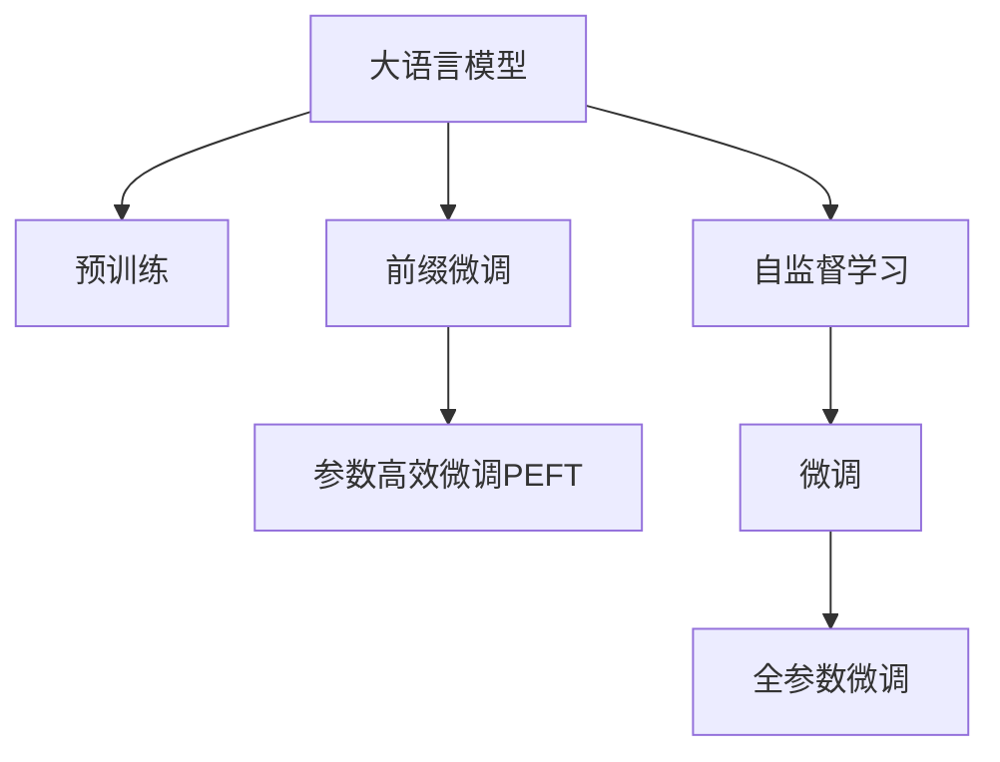

                 

# 大语言模型原理与工程实践：前缀微调

> 关键词：大语言模型,前缀微调,参数高效微调,Transformer,BERT,自监督学习,微调

## 1. 背景介绍

### 1.1 问题由来
随着深度学习技术的飞速发展，大规模预训练语言模型（Large Language Models, LLMs）在自然语言处理（Natural Language Processing, NLP）领域取得了显著突破。预训练语言模型通过在大规模无标签文本数据上进行自监督学习，获得广泛而丰富的语言知识，并在下游任务上通过微调（Fine-tuning）获得优异性能。例如，OpenAI的GPT系列模型、Google的BERT等。

尽管预训练模型具有强大的泛化能力，但由于其广泛的语料来源，可能包含一些偏见或不一致的语言表达。因此，为了使模型更好地适应特定任务，研究人员和工程师通常会在预训练模型上进行微调。然而，传统的微调方法依赖于大规模有标签数据集，对于某些特定领域或小规模任务，数据获取成本高、标注工作量大。

针对这一问题，参数高效微调（Parameter-Efficient Fine-Tuning, PEFT）方法应运而生。PEFT方法在微调过程中仅更新部分模型参数，保留预训练模型的核心参数，从而降低微调对数据和计算资源的依赖，同时保持模型的性能和泛化能力。前缀微调（Prefix-Tuning）是PEFT中的一种重要技术，通过在模型输入中添加特定的前缀（Prefix）来引导模型生成或分类，实现高效微调。

本文将系统介绍前缀微调的基本原理、算法步骤和应用场景，并通过一个具体例子展示其实现过程。

## 2. 核心概念与联系

### 2.1 核心概念概述

- **大语言模型（Large Language Model, LLM）**：指基于Transformer等架构、参数量巨大的预训练语言模型，如GPT、BERT等。这些模型通过自监督学习在大规模无标签数据上预训练，学习到丰富的语言知识和语法结构。

- **前缀微调（Prefix-Tuning）**：一种参数高效微调方法，通过在模型输入中添加特定的前缀，引导模型生成或分类，从而在保持预训练模型核心参数不变的情况下，实现高效微调。

- **参数高效微调（Parameter-Efficient Fine-Tuning, PEFT）**：指在微调过程中仅更新部分模型参数，保留预训练模型的核心参数不变，以减少微调对数据和计算资源的依赖。

- **Transformer**：一种基于自注意力机制的深度学习模型，用于处理序列数据，广泛应用于NLP任务中。

- **BERT（Bidirectional Encoder Representations from Transformers）**：一种基于Transformer的预训练语言模型，通过双向编码的方式学习文本语义。

- **自监督学习（Self-Supervised Learning）**：指通过无标签数据进行训练，学习模型参数的过程。

这些概念之间的联系通过以下Mermaid流程图展示：



## 3. 核心算法原理 & 具体操作步骤

### 3.1 算法原理概述

前缀微调的基本原理是通过在模型输入中添加特定的前缀，引导模型生成或分类。前缀通常是一个或多个单词、短语或句子，其设计目的是为了告诉模型输入的上下文和任务要求，从而提高模型的性能和泛化能力。前缀微调的具体流程如下：

1. **数据准备**：收集下游任务的少量有标签数据，将其划分为训练集和验证集。
2. **模型选择**：选择合适的预训练语言模型作为初始化参数，如BERT或GPT系列模型。
3. **前缀设计**：根据下游任务的特点，设计合适的前缀，用于引导模型的生成或分类过程。
4. **微调训练**：在训练集上使用前缀引导的模型进行微调，使用Adam等优化算法，逐步更新模型参数。
5. **验证评估**：在验证集上评估微调后模型的性能，根据评估结果调整超参数，继续微调训练。
6. **测试部署**：在测试集上测试微调后模型的性能，部署模型到实际应用中。

### 3.2 算法步骤详解

以下是一个具体的算法步骤示例，以问答任务为例：

1. **数据准备**：
   - 收集问答任务的有标签数据，如QA-Pairs（问题和答案对）。
   - 将数据划分为训练集、验证集和测试集。

2. **模型选择**：
   - 选择预训练语言模型，如BERT，作为初始化参数。

3. **前缀设计**：
   - 设计合适的前缀，例如：“Given context, what is the answer to this question?”，即“给定上下文，这个问题的答案是什么？”。

4. **微调训练**：
   - 在训练集上使用前缀引导的模型进行微调，例如，对于每个问题，模型会先输出上下文表示，然后再根据前缀生成答案。
   - 使用Adam等优化算法，逐步更新模型参数。

5. **验证评估**：
   - 在验证集上评估微调后模型的性能，例如，使用BLEU、ROUGE等指标衡量生成的答案与实际答案的相似度。
   - 根据评估结果调整超参数，如学习率、批大小等，继续微调训练。

6. **测试部署**：
   - 在测试集上测试微调后模型的性能，例如，使用BLEU、ROUGE等指标衡量生成的答案与实际答案的相似度。
   - 部署模型到实际应用中，如聊天机器人、问答系统等。

### 3.3 算法优缺点

前缀微调具有以下优点：
- **参数高效**：仅更新部分模型参数，保留预训练模型的核心参数，减少对数据和计算资源的依赖。
- **泛化能力强**：通过前缀引导，模型能够更好地适应新任务，提高泛化能力。
- **易于实现**：前缀设计灵活，模型训练过程与传统微调相似，易于实现和调整。

然而，前缀微调也存在一些缺点：
- **前缀设计复杂**：需要根据具体任务设计合适的前缀，设计不当可能影响模型性能。
- **性能提升有限**：虽然参数高效，但对于某些任务，性能提升可能有限，需要结合其他技术进行优化。

### 3.4 算法应用领域

前缀微调在NLP领域有广泛的应用，例如：

- **问答系统**：通过前缀引导，模型能够生成或选择正确的答案，提高问答系统的准确性和响应速度。
- **对话系统**：在对话中，前缀可以用于引导模型生成或选择合适的回复，提高对话的自然性和流畅性。
- **机器翻译**：通过前缀引导，模型能够生成更准确的翻译结果，提高机器翻译的准确性和自然度。
- **文本生成**：通过前缀引导，模型能够生成与给定上下文相匹配的文本，提高文本生成的连贯性和一致性。

## 4. 数学模型和公式 & 详细讲解 & 举例说明

### 4.1 数学模型构建

假设我们有一个预训练的Transformer模型 $M_\theta$，其中 $\theta$ 表示模型参数。我们希望在问答任务上进行前缀微调，即给定问题和上下文，模型能够生成或选择正确的答案。设问题为 $q$，上下文为 $c$，答案为 $a$。问题-答案对可以表示为 $(x, y) = (q, a)$。

我们的目标是最小化损失函数 $\mathcal{L}(\theta)$，即：
$$
\mathcal{L}(\theta) = \frac{1}{N} \sum_{i=1}^N \ell(M_\theta(x_i), y_i)
$$

其中 $x_i$ 表示问题-上下文对，$y_i$ 表示答案。$\ell$ 表示损失函数，例如交叉熵损失或均方误差损失。

### 4.2 公式推导过程

以交叉熵损失为例，我们的目标是最小化：
$$
\mathcal{L}(\theta) = -\frac{1}{N} \sum_{i=1}^N \sum_{j=1}^K \mathbb{1}(y_j=i) \log M_\theta(x_i)_{j}
$$

其中 $K$ 表示答案类别数。我们的模型输出 $M_\theta(x_i)$ 表示模型在输入 $x_i$ 上的预测结果。

我们的目标是通过前缀 $p$ 引导模型生成或选择正确的答案 $a$。前缀可以表示为 $p = \text{Prefix}(c, q)$，其中 $c$ 为上下文，$q$ 为问题。我们的模型输入为 $p$ 和 $c$，输出为模型生成的答案。

我们的目标是最小化以下损失函数：
$$
\mathcal{L}(\theta) = -\frac{1}{N} \sum_{i=1}^N \sum_{j=1}^K \mathbb{1}(y_j=i) \log M_\theta(p_i, c_i)_{j}
$$

其中 $p_i$ 表示前缀引导的输入，$c_i$ 表示上下文。

### 4.3 案例分析与讲解

以问答任务为例，我们的模型输入为 $p$ 和 $c$，输出为模型生成的答案。例如，对于问题“Who is the president of the United States?”，我们可以设计如下前缀：“Who is the president of the United States?”。模型在输入该前缀和上下文后，输出一个概率分布，选择最可能的答案。

我们的目标是最小化以下损失函数：
$$
\mathcal{L}(\theta) = -\frac{1}{N} \sum_{i=1}^N \sum_{j=1}^K \mathbb{1}(y_j=i) \log M_\theta(p_i, c_i)_{j}
$$

其中 $p_i$ 表示前缀引导的输入，$c_i$ 表示上下文。我们的目标是最小化模型生成的答案与实际答案之间的差异。

## 5. 项目实践：代码实例和详细解释说明

### 5.1 开发环境搭建

在进行前缀微调实践前，我们需要准备好开发环境。以下是使用Python进行PyTorch开发的环境配置流程：

1. 安装Anaconda：从官网下载并安装Anaconda，用于创建独立的Python环境。

2. 创建并激活虚拟环境：
```bash
conda create -n pytorch-env python=3.8 
conda activate pytorch-env
```

3. 安装PyTorch：根据CUDA版本，从官网获取对应的安装命令。例如：
```bash
conda install pytorch torchvision torchaudio cudatoolkit=11.1 -c pytorch -c conda-forge
```

4. 安装Transformers库：
```bash
pip install transformers
```

5. 安装各类工具包：
```bash
pip install numpy pandas scikit-learn matplotlib tqdm jupyter notebook ipython
```

完成上述步骤后，即可在`pytorch-env`环境中开始微调实践。

### 5.2 源代码详细实现

这里我们以问答任务为例，给出使用Transformers库对BERT模型进行前缀微调的PyTorch代码实现。

首先，定义问答任务的数据处理函数：

```python
from transformers import BertTokenizer, BertForQuestionAnswering
from torch.utils.data import Dataset
import torch

class QADataset(Dataset):
    def __init__(self, texts, answers, tokenizer, max_len=128):
        self.texts = texts
        self.answers = answers
        self.tokenizer = tokenizer
        self.max_len = max_len
        
    def __len__(self):
        return len(self.texts)
    
    def __getitem__(self, item):
        text = self.texts[item]
        answer = self.answers[item]
        
        encoding = self.tokenizer(text, return_tensors='pt', max_length=self.max_len, padding='max_length', truncation=True)
        input_ids = encoding['input_ids'][0]
        attention_mask = encoding['attention_mask'][0]
        
        # 将答案进行编码
        encoded_answer = self.tokenizer(answer, return_tensors='pt')
        encoded_answer_ids = encoded_answer['input_ids'][0]
        encoded_answer_mask = encoded_answer['attention_mask'][0]
        
        return {'input_ids': input_ids, 
                'attention_mask': attention_mask,
                'answer_ids': encoded_answer_ids,
                'answer_mask': encoded_answer_mask}
```

然后，定义模型和优化器：

```python
from transformers import BertForQuestionAnswering, AdamW

model = BertForQuestionAnswering.from_pretrained('bert-base-cased')
optimizer = AdamW(model.parameters(), lr=2e-5)
```

接着，定义训练和评估函数：

```python
from torch.utils.data import DataLoader
from tqdm import tqdm

device = torch.device('cuda') if torch.cuda.is_available() else torch.device('cpu')
model.to(device)

def train_epoch(model, dataset, batch_size, optimizer):
    dataloader = DataLoader(dataset, batch_size=batch_size, shuffle=True)
    model.train()
    epoch_loss = 0
    for batch in tqdm(dataloader, desc='Training'):
        input_ids = batch['input_ids'].to(device)
        attention_mask = batch['attention_mask'].to(device)
        answer_ids = batch['answer_ids'].to(device)
        answer_mask = batch['answer_mask'].to(device)
        model.zero_grad()
        outputs = model(input_ids, attention_mask=attention_mask, labels=answer_ids, segment_ids=answer_mask)
        loss = outputs.loss
        epoch_loss += loss.item()
        loss.backward()
        optimizer.step()
    return epoch_loss / len(dataloader)

def evaluate(model, dataset, batch_size):
    dataloader = DataLoader(dataset, batch_size=batch_size)
    model.eval()
    preds, labels = [], []
    with torch.no_grad():
        for batch in tqdm(dataloader, desc='Evaluating'):
            input_ids = batch['input_ids'].to(device)
            attention_mask = batch['attention_mask'].to(device)
            batch_labels = batch['answer_ids'].to(device)
            batch_masks = batch['answer_mask'].to(device)
            outputs = model(input_ids, attention_mask=attention_mask, labels=batch_labels, segment_ids=batch_masks)
            batch_preds = outputs.logits.argmax(dim=2).to('cpu').tolist()
            batch_labels = batch_labels.to('cpu').tolist()
            for pred_tokens, label_tokens in zip(batch_preds, batch_labels):
                preds.append(pred_tokens[:len(label_tokens)])
                labels.append(label_tokens)
                
    print(classification_report(labels, preds))
```

最后，启动训练流程并在测试集上评估：

```python
epochs = 5
batch_size = 16

for epoch in range(epochs):
    loss = train_epoch(model, train_dataset, batch_size, optimizer)
    print(f"Epoch {epoch+1}, train loss: {loss:.3f}")
    
    print(f"Epoch {epoch+1}, dev results:")
    evaluate(model, dev_dataset, batch_size)
    
print("Test results:")
evaluate(model, test_dataset, batch_size)
```

以上就是使用PyTorch对BERT进行问答任务前缀微调的完整代码实现。可以看到，得益于Transformers库的强大封装，我们可以用相对简洁的代码完成BERT模型的加载和微调。

### 5.3 代码解读与分析

让我们再详细解读一下关键代码的实现细节：

**QADataset类**：
- `__init__`方法：初始化文本、答案、分词器等关键组件。
- `__len__`方法：返回数据集的样本数量。
- `__getitem__`方法：对单个样本进行处理，将文本输入编码为token ids，将答案进行编码，并对其进行定长padding，最终返回模型所需的输入。

**模型和优化器**：
- 使用BertForQuestionAnswering从预训练模型中加载模型。
- 定义AdamW优化器，并设置学习率为2e-5。

**训练和评估函数**：
- 使用PyTorch的DataLoader对数据集进行批次化加载，供模型训练和推理使用。
- 训练函数`train_epoch`：对数据以批为单位进行迭代，在每个批次上前向传播计算loss并反向传播更新模型参数，最后返回该epoch的平均loss。
- 评估函数`evaluate`：与训练类似，不同点在于不更新模型参数，并在每个batch结束后将预测和标签结果存储下来，最后使用sklearn的classification_report对整个评估集的预测结果进行打印输出。

**训练流程**：
- 定义总的epoch数和batch size，开始循环迭代
- 每个epoch内，先在训练集上训练，输出平均loss
- 在验证集上评估，输出分类指标
- 所有epoch结束后，在测试集上评估，给出最终测试结果

可以看到，PyTorch配合Transformers库使得BERT微调的代码实现变得简洁高效。开发者可以将更多精力放在数据处理、模型改进等高层逻辑上，而不必过多关注底层的实现细节。

当然，工业级的系统实现还需考虑更多因素，如模型的保存和部署、超参数的自动搜索、更灵活的任务适配层等。但核心的微调范式基本与此类似。

## 6. 实际应用场景

### 6.1 智能客服系统

基于前缀微调的对话技术，可以广泛应用于智能客服系统的构建。传统客服往往需要配备大量人力，高峰期响应缓慢，且一致性和专业性难以保证。而使用前缀微调后的对话模型，可以7x24小时不间断服务，快速响应客户咨询，用自然流畅的语言解答各类常见问题。

在技术实现上，可以收集企业内部的历史客服对话记录，将问题和最佳答复构建成监督数据，在此基础上对预训练对话模型进行前缀微调。微调后的对话模型能够自动理解用户意图，匹配最合适的答案模板进行回复。对于客户提出的新问题，还可以接入检索系统实时搜索相关内容，动态组织生成回答。如此构建的智能客服系统，能大幅提升客户咨询体验和问题解决效率。

### 6.2 金融舆情监测

金融机构需要实时监测市场舆论动向，以便及时应对负面信息传播，规避金融风险。传统的人工监测方式成本高、效率低，难以应对网络时代海量信息爆发的挑战。基于前缀微调的文本分类和情感分析技术，为金融舆情监测提供了新的解决方案。

具体而言，可以收集金融领域相关的新闻、报道、评论等文本数据，并对其进行主题标注和情感标注。在此基础上对预训练语言模型进行前缀微调，使其能够自动判断文本属于何种主题，情感倾向是正面、中性还是负面。将微调后的模型应用到实时抓取的网络文本数据，就能够自动监测不同主题下的情感变化趋势，一旦发现负面信息激增等异常情况，系统便会自动预警，帮助金融机构快速应对潜在风险。

### 6.3 个性化推荐系统

当前的推荐系统往往只依赖用户的历史行为数据进行物品推荐，无法深入理解用户的真实兴趣偏好。基于前缀微调的推荐系统可以更好地挖掘用户行为背后的语义信息，从而提供更精准、多样的推荐内容。

在实践中，可以收集用户浏览、点击、评论、分享等行为数据，提取和用户交互的物品标题、描述、标签等文本内容。将文本内容作为模型输入，用户的后续行为（如是否点击、购买等）作为监督信号，在此基础上微调预训练语言模型。微调后的模型能够从文本内容中准确把握用户的兴趣点。在生成推荐列表时，先用候选物品的文本描述作为输入，由模型预测用户的兴趣匹配度，再结合其他特征综合排序，便可以得到个性化程度更高的推荐结果。

### 6.4 未来应用展望

随着前缀微调方法的不断发展，其在NLP领域的应用前景广阔。

在智慧医疗领域，基于前缀微调的医疗问答、病历分析、药物研发等应用将提升医疗服务的智能化水平，辅助医生诊疗，加速新药开发进程。

在智能教育领域，前缀微调可应用于作业批改、学情分析、知识推荐等方面，因材施教，促进教育公平，提高教学质量。

在智慧城市治理中，前缀微调技术可应用于城市事件监测、舆情分析、应急指挥等环节，提高城市管理的自动化和智能化水平，构建更安全、高效的未来城市。

此外，在企业生产、社会治理、文娱传媒等众多领域，基于前缀微调的人工智能应用也将不断涌现，为NLP技术带来了全新的突破。相信随着预训练语言模型和微调方法的持续演进，未来前缀微调技术将迎来更多的应用场景，为人类认知智能的进化带来深远影响。

## 7. 工具和资源推荐

### 7.1 学习资源推荐

为了帮助开发者系统掌握前缀微调的理论基础和实践技巧，这里推荐一些优质的学习资源：

1. 《Transformer从原理到实践》系列博文：由大模型技术专家撰写，深入浅出地介绍了Transformer原理、BERT模型、前缀微调技术等前沿话题。

2. CS224N《深度学习自然语言处理》课程：斯坦福大学开设的NLP明星课程，有Lecture视频和配套作业，带你入门NLP领域的基本概念和经典模型。

3. 《Natural Language Processing with Transformers》书籍：Transformers库的作者所著，全面介绍了如何使用Transformers库进行NLP任务开发，包括前缀微调在内的诸多范式。

4. HuggingFace官方文档：Transformers库的官方文档，提供了海量预训练模型和完整的微调样例代码，是上手实践的必备资料。

5. CLUE开源项目：中文语言理解测评基准，涵盖大量不同类型的中文NLP数据集，并提供了基于前缀微调的baseline模型，助力中文NLP技术发展。

通过对这些资源的学习实践，相信你一定能够快速掌握前缀微调的精髓，并用于解决实际的NLP问题。

### 7.2 开发工具推荐

高效的开发离不开优秀的工具支持。以下是几款用于前缀微调开发的常用工具：

1. PyTorch：基于Python的开源深度学习框架，灵活动态的计算图，适合快速迭代研究。大部分预训练语言模型都有PyTorch版本的实现。

2. TensorFlow：由Google主导开发的开源深度学习框架，生产部署方便，适合大规模工程应用。同样有丰富的预训练语言模型资源。

3. Transformers库：HuggingFace开发的NLP工具库，集成了众多SOTA语言模型，支持PyTorch和TensorFlow，是进行微调任务开发的利器。

4. Weights & Biases：模型训练的实验跟踪工具，可以记录和可视化模型训练过程中的各项指标，方便对比和调优。与主流深度学习框架无缝集成。

5. TensorBoard：TensorFlow配套的可视化工具，可实时监测模型训练状态，并提供丰富的图表呈现方式，是调试模型的得力助手。

6. Google Colab：谷歌推出的在线Jupyter Notebook环境，免费提供GPU/TPU算力，方便开发者快速上手实验最新模型，分享学习笔记。

合理利用这些工具，可以显著提升前缀微调任务的开发效率，加快创新迭代的步伐。

### 7.3 相关论文推荐

前缀微调技术的发展源于学界的持续研究。以下是几篇奠基性的相关论文，推荐阅读：

1. Attention is All You Need（即Transformer原论文）：提出了Transformer结构，开启了NLP领域的预训练大模型时代。

2. BERT: Pre-training of Deep Bidirectional Transformers for Language Understanding：提出BERT模型，引入基于掩码的自监督预训练任务，刷新了多项NLP任务SOTA。

3. Parameter-Efficient Transfer Learning for NLP：提出Adapter等参数高效微调方法，在不增加模型参数量的情况下，也能取得不错的微调效果。

4. Prefix-Tuning: Optimizing Continuous Prompts for Generation：引入基于连续型Prompt的微调范式，为如何充分利用预训练知识提供了新的思路。

5. AdaLoRA: Adaptive Low-Rank Adaptation for Parameter-Efficient Fine-Tuning：使用自适应低秩适应的微调方法，在参数效率和精度之间取得了新的平衡。

这些论文代表了大语言模型前缀微调技术的发展脉络。通过学习这些前沿成果，可以帮助研究者把握学科前进方向，激发更多的创新灵感。

## 8. 总结：未来发展趋势与挑战

### 8.1 总结

本文对前缀微调的基本原理、算法步骤和应用场景进行了详细讲解。首先阐述了前缀微调在大语言模型中的应用背景和优势，明确了其在参数高效微调、模型泛化能力提升等方面的独特价值。其次，从原理到实践，详细讲解了前缀微调的数学模型和算法步骤，给出了微调任务开发的完整代码实例。同时，本文还广泛探讨了前缀微调在智能客服、金融舆情、个性化推荐等多个行业领域的应用前景，展示了前缀微调范式的巨大潜力。此外，本文精选了前缀微调技术的各类学习资源，力求为读者提供全方位的技术指引。

通过本文的系统梳理，可以看到，前缀微调技术在大语言模型微调中的重要地位，以及其广泛的应用前景和显著的性能优势。未来，随着大语言模型的不断发展，前缀微调技术也将不断演进，为NLP技术带来更多创新和突破。

### 8.2 未来发展趋势

展望未来，前缀微调技术将呈现以下几个发展趋势：

1. **模型规模持续增大**：随着算力成本的下降和数据规模的扩张，预训练语言模型的参数量还将持续增长。超大规模语言模型蕴含的丰富语言知识，将进一步提升前缀微调的性能和泛化能力。

2. **参数高效微调方法不断涌现**：开发更加参数高效的微调方法，如Prefix-Tuning、LoRA等，在固定大部分预训练参数的同时，只更新极少量的任务相关参数，实现更加轻量级、实时性的部署。

3. **持续学习成为常态**：随着数据分布的不断变化，前缀微调模型也需要持续学习新知识以保持性能。如何在不遗忘原有知识的同时，高效吸收新样本信息，将是重要的研究课题。

4. **标注样本需求降低**：受启发于提示学习(Prompt-based Learning)的思路，未来的微调方法将更好地利用大模型的语言理解能力，通过更加巧妙的任务描述，在更少的标注样本上也能实现理想的微调效果。

5. **多模态微调崛起**：当前的微调主要聚焦于纯文本数据，未来会进一步拓展到图像、视频、语音等多模态数据微调。多模态信息的融合，将显著提升语言模型对现实世界的理解和建模能力。

6. **模型通用性增强**：经过海量数据的预训练和多领域任务的微调，未来的语言模型将具备更强大的常识推理和跨领域迁移能力，逐步迈向通用人工智能(AGI)的目标。

以上趋势凸显了前缀微调技术的广阔前景。这些方向的探索发展，必将进一步提升前缀微调技术在大语言模型微调中的应用效果，推动NLP技术的发展。

### 8.3 面临的挑战

尽管前缀微调技术已经取得了显著成就，但在迈向更加智能化、普适化应用的过程中，它仍面临诸多挑战：

1. **标注成本瓶颈**：尽管前缀微调方法降低了对标注样本的依赖，但对于长尾应用场景，数据获取成本仍然较高。如何进一步降低微调对标注样本的依赖，将是重要研究方向。

2. **模型鲁棒性不足**：当前前缀微调模型面对域外数据时，泛化性能往往不足，容易受到小样本干扰。如何提高前缀微调模型的鲁棒性，避免灾难性遗忘，还需要更多理论和实践的积累。

3. **推理效率有待提高**：大规模语言模型虽然精度高，但在实际部署时往往面临推理速度慢、内存占用大等效率问题。如何简化模型结构，提升推理速度，优化资源占用，将是重要的优化方向。

4. **可解释性亟需加强**：当前前缀微调模型更像是“黑盒”系统，难以解释其内部工作机制和决策逻辑。对于高风险应用，算法的可解释性和可审计性尤为重要。如何赋予前缀微调模型更强的可解释性，将是亟待攻克的难题。

5. **安全性有待保障**：预训练语言模型难免会学习到有偏见、有害的信息，通过前缀微调传递到下游任务，可能产生误导性、歧视性的输出，给实际应用带来安全隐患。如何从数据和算法层面消除模型偏见，避免恶意用途，确保输出的安全性，也将是重要的研究课题。

6. **知识整合能力不足**：现有的前缀微调模型往往局限于任务内数据，难以灵活吸收和运用更广泛的先验知识。如何让前缀微调过程更好地与外部知识库、规则库等专家知识结合，形成更加全面、准确的信息整合能力，还有很大的想象空间。

正视前缀微调面临的这些挑战，积极应对并寻求突破，将是大语言模型前缀微调技术走向成熟的必由之路。相信随着学界和产业界的共同努力，这些挑战终将一一被克服，前缀微调技术必将在构建智能系统方面发挥更大的作用。

### 8.4 研究展望

面向未来，前缀微调技术的研究将在以下几个方向寻求新的突破：

1. **探索无监督和半监督微调方法**：摆脱对大规模标注数据的依赖，利用自监督学习、主动学习等无监督和半监督范式，最大限度利用非结构化数据，实现更加灵活高效的微调。

2. **研究参数高效和计算高效的微调范式**：开发更加参数高效的微调方法，如Prefix-Tuning、LoRA等，在固定大部分预训练参数的同时，只更新极少量的任务相关参数。同时优化微调模型的计算图，减少前向传播和反向传播的资源消耗，实现更加轻量级、实时性的部署。

3. **融合因果和对比学习范式**：通过引入因果推断和对比学习思想，增强前缀微调模型建立稳定因果关系的能力，学习更加普适、鲁棒的语言表征，从而提升模型泛化性和抗干扰能力。

4. **引入更多先验知识**：将符号化的先验知识，如知识图谱、逻辑规则等，与神经网络模型进行巧妙融合，引导前缀微调过程学习更准确、合理的语言模型。同时加强不同模态数据的整合，实现视觉、语音等多模态信息与文本信息的协同建模。

5. **结合因果分析和博弈论工具**：将因果分析方法引入前缀微调模型，识别出模型决策的关键特征，增强输出解释的因果性和逻辑性。借助博弈论工具刻画人机交互过程，主动探索并规避模型的脆弱点，提高系统稳定性。

6. **纳入伦理道德约束**：在模型训练目标中引入伦理导向的评估指标，过滤和惩罚有偏见、有害的输出倾向。同时加强人工干预和审核，建立模型行为的监管机制，确保输出符合人类价值观和伦理道德。

这些研究方向的探索，必将引领前缀微调技术迈向更高的台阶，为构建安全、可靠、可解释、可控的智能系统铺平道路。面向未来，前缀微调技术还需要与其他人工智能技术进行更深入的融合，如知识表示、因果推理、强化学习等，多路径协同发力，共同推动自然语言理解和智能交互系统的进步。只有勇于创新、敢于突破，才能不断拓展语言模型的边界，让智能技术更好地造福人类社会。

## 9. 附录：常见问题与解答

**Q1：前缀微调是否适用于所有NLP任务？**

A: 前缀微调在大多数NLP任务上都能取得不错的效果，特别是对于数据量较小的任务。但对于一些特定领域的任务，如医学、法律等，仅仅依靠通用语料预训练的模型可能难以很好地适应。此时需要在特定领域语料上进一步预训练，再进行前缀微调。此外，对于一些需要时效性、个性化很强的任务，如对话、推荐等，前缀微调方法也需要针对性的改进优化。

**Q2：如何选择合适的前缀？**

A: 选择合适的前缀是前缀微调成功的关键。前缀应该简洁明了，能够清楚地表达任务要求和上下文信息。通常需要根据具体任务设计合适的前缀，例如：
- 问答任务：“Given context, what is the answer to this question?”
- 对话任务：“As a customer service representative, how would you respond to this inquiry?”

设计前缀时，应避免过长，保证模型能够快速理解并生成响应。同时，前缀应尽可能避免歧义，确保模型生成的响应符合任务要求。

**Q3：前缀微调在微调过程中是否更新所有参数？**

A: 前缀微调只更新部分模型参数，保留预训练模型的核心参数不变。这样可以减少微调对数据和计算资源的依赖，同时保持模型的泛化能力。通常，前缀微调只更新模型中的嵌入层和部分解码器参数，而保留Transformer层的权重不变。

**Q4：前缀微调是否需要大量标注数据？**

A: 前缀微调相比传统微调方法，对标注数据的需求相对较低。通过精心设计的前缀，可以引导模型生成或分类，从而在一定程度上降低对标注样本的依赖。对于长尾应用场景，可以通过设计更有效的前缀来进一步减少对标注数据的依赖。

**Q5：前缀微调是否适用于多模态任务？**

A: 前缀微调主要适用于纯文本数据，但在多模态任务中，可以通过将前缀设计为文本-图像、文本-语音等形式，实现多模态数据的前缀微调。例如，在视觉问答任务中，可以将问题作为文本前缀，图像作为输入，进行前缀微调。

**Q6：前缀微调是否需要预训练模型？**

A: 是的，前缀微调通常需要基于预训练模型进行。预训练模型蕴含的丰富语言知识，在前缀微调过程中起到至关重要的作用。只有在大规模预训练语言模型的基础上，前缀微调才能充分发挥其优势。

通过本文的系统梳理，可以看到，前缀微调技术在大语言模型微调中的重要地位，以及其广泛的应用前景和显著的性能优势。未来，随着大语言模型的不断发展，前缀微调技术也将不断演进，为NLP技术带来更多创新和突破。

---

作者：禅与计算机程序设计艺术 / Zen and the Art of Computer Programming

