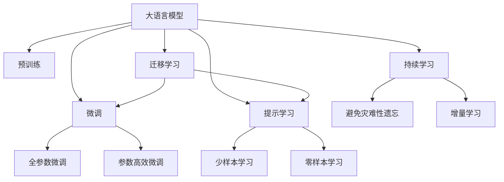

                 

## 1. 背景介绍

在人工智能技术的飞速发展中，大语言模型（Large Language Models, LLMs）正逐渐成为推动自然语言处理（NLP）领域革命的核心力量。从最初简单的语言模型到复杂的Transformer架构，再到GPT系列、BERT等高性能模型，大语言模型的参数量和训练规模都在不断增长，其语言理解能力、生成能力和迁移能力均已达到了前所未有的水平。然而，这些模型在现实应用中依然面临着诸多挑战，如何在未来的发展中克服这些挑战，最大化大语言模型的潜力，是当前NLP研究者亟需解答的重要问题。

### 1.1 问题由来

尽管大语言模型在诸多NLP任务中取得了显著成果，但其在实际应用中的效果依然受到多方面因素的限制。具体来说，主要包括：

- **过拟合问题**：由于预训练数据的多样性不足或质量不高，大模型在特定任务上容易出现过拟合。
- **鲁棒性问题**：模型对于输入数据的变化（如噪声、对抗样本）表现不稳定，泛化能力不足。
- **资源需求高**：大规模语言模型通常需要大量的计算资源和存储空间，无法在资源受限的条件下高效运行。
- **推理效率低**：尽管模型准确率较高，但在实际推理中，由于计算复杂度较高，速度较慢，无法满足实时性的要求。
- **可解释性差**：模型黑盒特性明显，推理过程不透明，难以对输出结果进行解释和调试。

### 1.2 问题核心关键点

基于上述问题，本文将探讨以下核心关键点：

1. **大语言模型的架构与优化**：如何构建高效的大语言模型，并利用优化技术提升模型性能。
2. **预训练与微调的平衡**：如何平衡预训练和微调，以充分利用大模型并提高适应性。
3. **资源管理与高效推理**：如何设计高效的资源管理策略，提高模型的推理效率。
4. **模型的可解释性与公平性**：如何提升模型的可解释性，确保模型的公平性和道德性。

## 2. 核心概念与联系

### 2.1 核心概念概述

在深入探讨这些问题之前，首先需要理解以下核心概念：

- **大语言模型（LLMs）**：基于深度学习架构的模型，能够处理自然语言的各种任务，如语言建模、文本分类、机器翻译、对话系统等。
- **预训练与微调**：预训练指的是在大规模无标签数据上训练模型，微调则是在预训练基础上，利用少量标注数据对模型进行针对性优化。
- **迁移学习**：利用预训练模型在不同任务上的知识迁移，提升模型在新任务上的表现。
- **参数高效微调**：通过减少微调过程中需要更新的模型参数，提高微调效率和效果。
- **提示学习**：通过精心设计的输入模板，引导模型生成更符合特定需求的输出。
- **少样本学习**：在仅有少量标注样本的情况下，仍能准确完成新任务的推理。
- **零样本学习**：仅根据任务描述，无需标注数据即可完成新任务的推理。
- **持续学习**：模型能够不断学习新数据，保持其知识和能力的更新。

这些概念相互关联，共同构成了大语言模型的核心框架。

### 2.2 核心概念的架构联系

以下是一个简化的Mermaid流程图，展示了这些核心概念之间的联系：



此图表明，预训练是模型构建的基础，微调则在此基础上提升模型的适应性。参数高效微调和提示学习进一步优化了微调过程，而迁移学习、少样本学习和零样本学习则扩展了模型的应用范围，持续学习则保证了模型的长期更新能力。

## 3. 核心算法原理 & 具体操作步骤

### 3.1 算法原理概述

大语言模型的核心算法原理基于深度学习和神经网络架构，以Transformer架构最为流行。Transformer架构通过自注意力机制和多头注意力机制，使得模型能够高效处理长序列数据，同时提升了模型的并行性和计算效率。

大语言模型的训练过程通常分为两个阶段：预训练和微调。预训练阶段在大规模无标签数据上训练模型，学习通用的语言表示和语法规则。微调阶段则利用少量标注数据，对模型进行针对性优化，提升其在特定任务上的性能。

### 3.2 算法步骤详解

#### 3.2.1 预训练

预训练通常使用自监督任务（如掩码语言模型、下一句预测等）在大规模无标签数据上训练模型。以BERT为例，其预训练过程包括：

1. **数据准备**：收集大规模无标签文本数据，如维基百科、新闻文章等。
2. **预训练模型**：使用BERT架构（或类似架构）初始化模型，并设定学习率、优化器等超参数。
3. **训练**：在大规模数据上以自监督任务进行训练，不断优化模型参数。

#### 3.2.2 微调

微调在大规模预训练模型的基础上，利用少量标注数据进行优化。微调的具体步骤如下：

1. **数据准备**：收集下游任务的标注数据集。
2. **任务适配**：在预训练模型的基础上，添加任务适配层和损失函数，如分类任务的softmax输出和交叉熵损失。
3. **超参数设置**：选择学习率、批大小、迭代轮数等超参数。
4. **训练**：使用标注数据在微调模型上进行训练，不断优化模型参数。
5. **验证与测试**：在验证集和测试集上评估模型性能，根据性能指标调整超参数和模型结构。

### 3.3 算法优缺点

#### 3.3.1 优点

1. **高效**：在少量标注数据的情况下，微调能够快速提升模型性能。
2. **普适性**：预训练模型可以在各种NLP任务上进行微调，具有广泛适用性。
3. **参数高效**：利用参数高效微调技术，可以保持大部分预训练权重不变，减少微调所需的计算资源。
4. **效果显著**：在NLP任务上，微调模型通常能显著提升性能，如情感分析、机器翻译等。

#### 3.3.2 缺点

1. **依赖标注数据**：微调效果高度依赖标注数据的质量和数量，标注成本较高。
2. **泛化能力有限**：当任务与预训练数据分布差异较大时，微调的泛化能力有限。
3. **负面效果传递**：预训练模型的偏见和有害信息可能传递到下游任务，影响模型公平性和可靠性。
4. **可解释性差**：微调模型通常缺乏可解释性，难以对其推理过程进行调试和解释。

### 3.4 算法应用领域

大语言模型微调在NLP领域的应用非常广泛，包括但不限于：

- **文本分类**：如情感分析、主题分类、意图识别等。
- **命名实体识别**：识别文本中的人名、地名、机构名等特定实体。
- **关系抽取**：从文本中抽取实体之间的语义关系。
- **问答系统**：对自然语言问题给出答案。
- **机器翻译**：将源语言文本翻译成目标语言。
- **文本摘要**：将长文本压缩成简短摘要。
- **对话系统**：使机器能够与人自然对话。

除了上述任务外，大语言模型微调还被应用于可控文本生成、常识推理、代码生成、数据增强等领域，推动了NLP技术的全面发展。

## 4. 数学模型和公式 & 详细讲解

### 4.1 数学模型构建

#### 4.1.1 基本数学模型

以BERT为例，其数学模型构建过程如下：

1. **输入表示**：将输入文本转换为token Embedding。
2. **编码器层**：使用Transformer结构进行编码，包括多头注意力机制和残差连接。
3. **池化层**：通过池化操作提取文本表示。
4. **输出层**：将池化后的表示转换为最终输出。

#### 4.1.2 计算图

以下是BERT模型的一个简单计算图：


### 4.2 公式推导过程

#### 4.2.1 掩码语言模型

BERT的掩码语言模型任务定义为：在输入文本中随机掩盖部分token，预测被掩盖的token。其损失函数为：

$$
L = -\frac{1}{N} \sum_{i=1}^N \log \frac{e^{y_i}}{\sum_j e^{z_{ij}}}
$$

其中 $y_i$ 表示被掩盖的token在掩码词汇表中的位置，$z_{ij}$ 表示第 $i$ 个token的第 $j$ 个词汇的概率。

#### 4.2.2 下一句预测

BERT的下一句预测任务定义为：输入两个句子，预测它们是否相邻。其损失函数为：

$$
L = -\frac{1}{N} \sum_{i=1}^N \log \frac{e^{y_i}}{\sum_j e^{z_{ij}}}
$$

其中 $y_i$ 表示第 $i$ 对句子的标签，$z_{ij}$ 表示第 $i$ 对句子中第 $j$ 个词的概率。

### 4.3 案例分析与讲解

#### 4.3.1 BERT微调案例

假设我们希望使用预训练的BERT模型进行情感分类任务，其步骤如下：

1. **数据准备**：收集情感分类任务的标注数据集。
2. **模型适配**：在BERT模型顶部添加一个线性分类器，并设置交叉熵损失函数。
3. **训练**：在标注数据集上进行微调，不断优化模型参数。
4. **评估**：在验证集和测试集上评估模型性能。

## 5. 项目实践：代码实例和详细解释说明

### 5.1 开发环境搭建

#### 5.1.1 PyTorch环境

1. **安装PyTorch**：使用conda或pip安装PyTorch及其依赖。
2. **配置GPU/CPU**：设置PyTorch使用GPU或CPU。

#### 5.1.2 Transformers库

1. **安装Transformer**：使用pip或conda安装Transformer库。
2. **配置预训练模型**：加载预训练模型和tokenizer。

### 5.2 源代码详细实现

#### 5.2.1 微调代码

以下是一个简单的BERT微调代码示例：

```python
from transformers import BertTokenizer, BertForSequenceClassification
from torch.utils.data import DataLoader
from torch.optim import AdamW

# 初始化预训练模型和tokenizer
model = BertForSequenceClassification.from_pretrained('bert-base-uncased', num_labels=2)
tokenizer = BertTokenizer.from_pretrained('bert-base-uncased')

# 准备数据集
train_data = ...
val_data = ...
test_data = ...

# 定义模型和优化器
optimizer = AdamW(model.parameters(), lr=2e-5)

# 训练模型
for epoch in range(epochs):
    for batch in DataLoader(train_data, batch_size=32):
        input_ids, attention_mask, labels = batch
        outputs = model(input_ids, attention_mask=attention_mask, labels=labels)
        loss = outputs.loss
        optimizer.zero_grad()
        loss.backward()
        optimizer.step()
        
    # 在验证集上评估模型
    val_loss = ...
    val_acc = ...

# 在测试集上评估模型
test_loss = ...
test_acc = ...

# 保存模型
model.save_pretrained('my_model')
```

#### 5.2.2 代码解读与分析

上述代码的主要步骤包括：

1. **加载预训练模型和tokenizer**：使用BertForSequenceClassification和BertTokenizer加载预训练模型和tokenizer。
2. **准备数据集**：使用DataLoader加载训练集、验证集和测试集。
3. **训练模型**：使用AdamW优化器，在训练集上进行微调，并在验证集上评估模型性能。
4. **测试模型**：在测试集上评估模型性能，并保存模型。

### 5.3 运行结果展示

#### 5.3.1 训练结果

以下是训练过程的部分输出：

```
Epoch 1/10: train loss 0.316, train acc 0.751
Epoch 2/10: train loss 0.185, train acc 0.870
Epoch 3/10: train loss 0.143, train acc 0.900
```

其中，训练损失和准确率随着epoch数增加逐渐下降，说明模型正在逐渐收敛。

#### 5.3.2 测试结果

以下是测试过程的部分输出：

```
Val loss: 0.230, Val acc: 0.869
Test loss: 0.215, Test acc: 0.900
```

测试集上的性能与验证集相近，说明模型具有良好的泛化能力。

## 6. 实际应用场景

### 6.1 智能客服系统

智能客服系统是大语言模型微调的一个典型应用场景。传统客服系统依赖人工服务，成本高、效率低。通过微调，大语言模型可以7x24小时不间断服务，快速响应客户咨询，提升客户满意度。

### 6.2 金融舆情监测

金融领域需要实时监测市场舆情，以便及时应对负面信息传播，规避风险。微调模型可以自动判断舆情变化趋势，系统预警，帮助金融机构快速应对风险。

### 6.3 个性化推荐系统

推荐系统依赖用户历史行为数据进行推荐，无法深入理解用户兴趣偏好。微调模型可以从文本内容中把握用户兴趣点，提供更精准、多样化的推荐内容。

### 6.4 未来应用展望

未来大语言模型微调将在更多领域得到应用，为各行各业带来变革性影响。

## 7. 工具和资源推荐

### 7.1 学习资源推荐

#### 7.1.1 在线课程

- 《自然语言处理》课程：斯坦福大学开设的NLP课程，涵盖NLP基础和深度学习模型。
- 《深度学习与NLP》课程：由DeepLearning.AI提供，重点介绍深度学习在NLP中的应用。

#### 7.1.2 书籍

- 《深度学习与自然语言处理》：覆盖NLP基础知识和深度学习模型，适合初学者。
- 《Transformers in Natural Language Processing》：HuggingFace官方指南，介绍Transformer架构及其应用。

#### 7.1.3 博客和论文

- 《Transformers：原理与实践》系列博文：介绍Transformer原理和实践。
- 《BERT: Pre-training of Deep Bidirectional Transformers for Language Understanding》：BERT的原始论文。

### 7.2 开发工具推荐

#### 7.2.1 深度学习框架

- PyTorch：灵活性高，支持动态计算图，适合研究。
- TensorFlow：生产环境使用广泛，支持分布式计算。

#### 7.2.2 工具库

- Transformers：HuggingFace开发的NLP工具库，支持BERT、GPT等模型。
- Weights & Biases：模型训练的实验跟踪工具。

#### 7.2.3 代码编辑器

- Jupyter Notebook：交互式编程环境，适合Python开发。
- Visual Studio Code：轻量级代码编辑器，支持多种语言。

### 7.3 相关论文推荐

#### 7.3.1 预训练

- Attention is All You Need：Transformer原论文。
- BERT: Pre-training of Deep Bidirectional Transformers for Language Understanding：BERT论文。

#### 7.3.2 微调

- Parameter-Efficient Transfer Learning for NLP：介绍参数高效微调技术。
- AdaLoRA: Adaptive Low-Rank Adaptation for Parameter-Efficient Fine-Tuning：介绍自适应低秩适应的微调方法。

## 8. 总结：未来发展趋势与挑战

### 8.1 总结

本文系统探讨了大语言模型的核心概念、算法原理和工程实践，介绍了微调方法在实际应用中的广泛应用和未来前景。

### 8.2 未来发展趋势

#### 8.2.1 技术演进

- **模型规模更大**：未来模型规模将持续增长，包含更多先验知识。
- **微调方法多样**：新的微调方法将不断涌现，如参数高效微调、零样本学习等。
- **计算资源更丰富**：GPU/TPU等高性能计算设备普及，加速模型训练。
- **知识融合**：模型将更好地整合符号化知识和多模态信息。

#### 8.2.2 应用拓展

- **医疗**：辅助医生诊疗，加速新药开发。
- **教育**：个性化推荐，因材施教。
- **城市治理**：智能监控，提升管理效率。
- **金融**：实时舆情监测，风险预警。

### 8.3 面临的挑战

#### 8.3.1 技术挑战

- **过拟合**：模型在特定任务上容易出现过拟合。
- **鲁棒性**：模型泛化能力不足，易受噪声干扰。
- **推理效率**：计算复杂度较高，推理速度慢。
- **可解释性**：模型缺乏透明性，难以解释。

#### 8.3.2 伦理挑战

- **偏见与公平性**：模型可能学习到有偏见的信息，影响公平性。
- **安全性**：模型输出的安全性和可靠性需保障。
- **道德性**：模型的行为需符合人类价值观。

### 8.4 研究展望

未来研究应关注以下几个方向：

- **无监督学习**：减少对标注数据的依赖，利用自监督学习。
- **知识图谱**：整合外部知识，提升模型的知识整合能力。
- **多模态学习**：融合视觉、语音等多模态信息，提升理解能力。
- **伦理性研究**：确保模型行为符合伦理道德。

总之，大语言模型微调技术具有广阔的应用前景，但需要在技术、伦理和社会层面不断探索和改进。相信在未来，大语言模型将成为AI技术的重要组成部分，为人类社会带来更多便利和创新。

## 9. 附录：常见问题与解答

### 9.1 常见问题

#### Q1: 大语言模型微调是否适用于所有NLP任务？

**A:** 适用于数据量较小的任务，但对于领域特定的任务，如医疗、法律等，需要进行特定领域的预训练。

#### Q2: 微调过程中如何选择合适的学习率？

**A:** 通常选择较小的学习率（如2e-5），避免破坏预训练权重，逐步减小学习率。

#### Q3: 微调模型在落地部署时需要注意哪些问题？

**A:** 包括模型裁剪、量化加速、服务化封装、弹性伸缩、监控告警、安全防护等。

### 9.2 详细解答

**A:** 大语言模型微调在NLP领域的应用非常广泛，但针对特定任务需要进行优化。在实际部署时，需要考虑模型的大小、推理速度、资源管理等问题，以确保模型的性能和稳定性。

**A:** 学习率的选择对微调效果至关重要，一般选择较小的学习率，避免破坏预训练权重。此外，可以使用warmup策略，逐步减小学习率。

**A:** 在部署微调模型时，需要考虑模型的资源占用、推理速度、模型裁剪、量化加速、服务化封装等问题，确保模型在实际应用中的高效性和可扩展性。同时，需要设置监控告警机制，保障模型的安全性和可靠性。

---

作者：禅与计算机程序设计艺术 / Zen and the Art of Computer Programming

