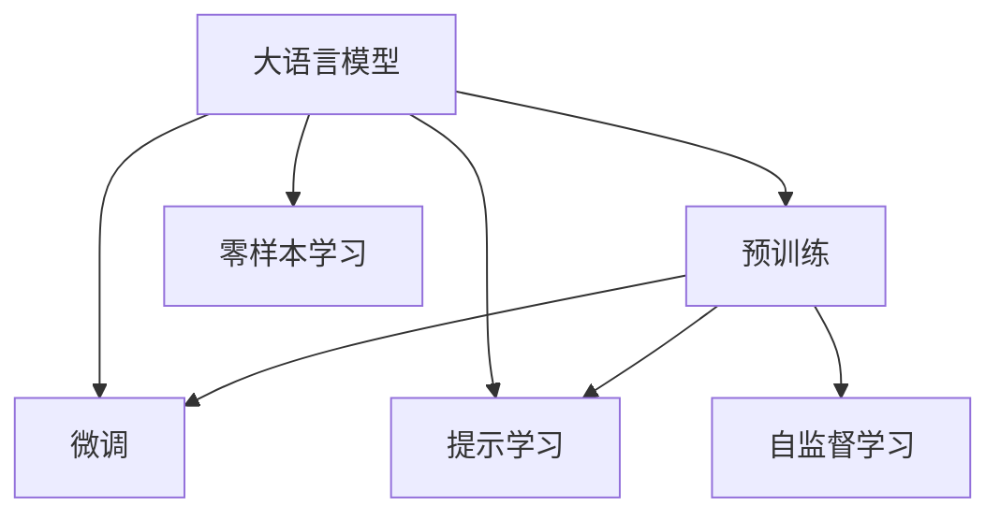

                 

# 大语言模型原理基础与前沿 不需要额外训练即可利用预训练模型

> 关键词：大语言模型,预训练模型,微调,零样本学习,提示学习,自监督学习

## 1. 背景介绍

### 1.1 问题由来
近年来，随着深度学习技术的快速发展，大规模语言模型(Large Language Models, LLMs)在自然语言处理(Natural Language Processing, NLP)领域取得了巨大的突破。这些大语言模型通过在海量无标签文本数据上进行预训练，学习到了丰富的语言知识和常识，具备了强大的语言理解和生成能力。

预训练模型通常采用自回归模型(如GPT)或自编码模型(如BERT)。其中，GPT系列模型采用Transformer架构，具有极高的并行性和计算效率；而BERT模型则通过两个方向的预训练任务(掩码语言模型和下一句预测)，在语言表示的全面性和准确性方面表现优异。

然而，由于预训练模型的广泛性和泛化能力的不足，这些通用大语言模型在特定领域应用时，效果往往难以达到实际应用的要求。因此，如何高效地利用预训练模型的语言表示能力，成为当前大语言模型研究和应用的一个重要方向。

### 1.2 问题核心关键点
目前，大语言模型的高效利用主要依赖于预训练-微调(Fine-tuning)的范式，即在预训练模型的基础上，使用下游任务的少量标注数据，通过有监督学习优化模型在该任务上的性能。微调能够显著提升模型在特定任务上的表现，但也面临着数据成本高、模型泛化能力有限、推理效率低等挑战。

针对这些挑战，研究者们提出了零样本学习(Zero-shot Learning)和提示学习(Prompt Learning)两种新方法。零样本学习是指模型在没有任何标注数据的情况下，仅凭任务描述就能够执行新任务的能力；提示学习则是通过在输入文本中添加提示模板(Prompt Template)，引导大语言模型进行特定任务的推理和生成，从而在不更新模型参数的情况下实现微调。

这些方法都利用了预训练模型所学到的语言知识，避免了额外训练和标注数据的消耗，能够在数据匮乏的领域和场景中发挥重要作用。

### 1.3 问题研究意义
研究大语言模型的高效利用方法，对于拓展大模型的应用范围，提升下游任务的性能，加速NLP技术的产业化进程，具有重要意义：

1. 降低应用开发成本。利用预训练模型，可以显著减少从头开发所需的数据、计算和人力等成本投入。
2. 提升模型效果。预训练模型已经学习到了广泛的语言知识，通过高效的利用方法，可以在特定任务上获得更优的性能。
3. 加速开发进度。standing on the shoulders of giants，利用预训练模型可以更快地完成任务适配，缩短开发周期。
4. 带来技术创新。零样本学习和提示学习等方法，促进了对预训练-微调的深入研究，催生了新的研究方向和应用场景。
5. 赋能产业升级。预训练模型的语言表示能力，能够被各行各业所采用，为传统行业数字化转型升级提供新的技术路径。

## 2. 核心概念与联系

### 2.1 核心概念概述

为更好地理解大语言模型的高效利用方法，本节将介绍几个密切相关的核心概念：

- 大语言模型(Large Language Model, LLM)：以自回归(如GPT)或自编码(如BERT)模型为代表的大规模预训练语言模型。通过在海量无标签文本语料上进行预训练，学习通用的语言表示，具备强大的语言理解和生成能力。

- 预训练(Pre-training)：指在大规模无标签文本语料上，通过自监督学习任务训练通用语言模型的过程。常见的预训练任务包括言语建模、遮挡语言模型等。

- 微调(Fine-tuning)：指在预训练模型的基础上，使用下游任务的少量标注数据，通过有监督学习优化模型在该任务上的性能。通常只需要调整顶层分类器或解码器，并以较小的学习率更新全部或部分的模型参数。

- 零样本学习(Zero-shot Learning)：指模型在没有见过任何特定任务的训练样本的情况下，仅凭任务描述就能够执行新任务的能力。

- 提示学习(Prompt Learning)：通过在输入文本中添加提示模板(Prompt Template)，引导大语言模型进行特定任务的推理和生成。可以在不更新模型参数的情况下，实现少样本或零样本学习。

- 自监督学习(Self-supervised Learning)：指通过无监督学习的方式，利用文本数据自身的信息，训练模型学习语言表示的技术。常见的自监督学习任务包括掩码语言模型、Next Sentence Prediction等。

这些核心概念之间的逻辑关系可以通过以下Mermaid流程图来展示：



这个流程图展示了大语言模型的核心概念及其之间的关系：

1. 大语言模型通过预训练获得基础能力。
2. 微调是对预训练模型进行任务特定的优化，可以分为全参数微调和参数高效微调。
3. 零样本学习是一种不更新模型参数的方法，可以在没有标注数据的情况下执行新任务。
4. 提示学习是一种利用预训练模型的语言知识，引导模型进行特定任务的推理和生成的方法。
5. 自监督学习是预训练模型的训练方式，利用无标签数据训练模型。

这些概念共同构成了大语言模型的学习框架，使其能够在各种场景下发挥强大的语言理解和生成能力。通过理解这些核心概念，我们可以更好地把握大语言模型的学习和应用范式。

## 3. 核心算法原理 & 具体操作步骤
### 3.1 算法原理概述

大语言模型的高效利用方法主要基于零样本学习和提示学习两种技术，均利用了预训练模型所学到的语言知识，避免了额外训练和标注数据的消耗。

零样本学习是指模型在没有任何标注数据的情况下，仅凭任务描述就能够执行新任务的能力。这种技术要求模型具备强大的语义理解能力和常识推理能力，能够在任务描述的基础上，自动推断出任务的具体实现方式。

提示学习则是通过在输入文本中添加提示模板(Prompt Template)，引导大语言模型进行特定任务的推理和生成。提示模板通常包含对任务的简短描述和相关的上下文信息，模型在处理这些信息时，能够根据上下文线索进行推理，输出符合任务要求的答案或生成文本。

这两种方法的核心在于如何利用预训练模型所学到的语言表示能力，将其应用于新任务的求解。它们利用了预训练模型在大规模文本数据上学习到的语言表示，通过简单的上下文理解和提示引导，实现了对新任务的快速适应和解决。

### 3.2 算法步骤详解

下面以提示学习为例，详细介绍提示学习在大语言模型中的应用步骤：

1. 确定任务：选择需要解决的具体任务，如文本分类、问答系统、文本摘要等。
2. 设计提示模板：根据任务类型，设计合适的提示模板，确保模板能够清晰表达任务要求。例如，对于问答系统，可以设计类似“根据<context>，回答<question>”的模板。
3. 编码输入：将输入文本和提示模板一起输入到预训练模型中，通常使用自回归模型(如GPT)进行编码。
4. 生成输出：模型根据编码后的输入，输出预测结果，例如分类标签、答案文本或摘要文本。
5. 评估结果：根据任务的实际需求，对生成的输出进行评估，如准确率、F1-score、BLEU等指标。
6. 迭代优化：根据评估结果，调整提示模板和输入内容，不断优化生成效果。

以上是提示学习在大语言模型中的应用步骤。需要注意的是，提示学习的效果依赖于提示模板的设计，设计不当的提示模板可能导致模型输出错误或不相关结果。

### 3.3 算法优缺点

提示学习和零样本学习方法具有以下优点：

1. 数据需求低：两种方法均不需要额外的标注数据，能够在新领域或小样本情况下进行任务求解。
2. 简单易用：只需要设计合适的提示模板，即可快速应用到新任务中，无需额外训练。
3. 泛化能力强：利用预训练模型所学到的语言表示，能够对多种类型的任务进行求解，具有良好的泛化能力。

同时，这些方法也存在一定的局限性：

1. 依赖高质量模板：提示模板的设计质量直接影响模型的输出效果，设计不当可能导致模型输出错误或不相关结果。
2. 鲁棒性不足：提示模板和输入内容的微小变化可能对模型输出产生较大影响，模型对输入的鲁棒性有待提升。
3. 可解释性不足：提示学习和零样本学习通常是"黑盒"系统，难以解释模型的内部工作机制和推理过程。

尽管存在这些局限性，但零样本学习和提示学习为高效利用大语言模型提供了新的思路，尤其适用于数据匮乏或新任务快速部署的场景。未来相关研究的重点在于如何设计更加高效、鲁棒的提示模板，以及如何提高模型的可解释性和鲁棒性。

### 3.4 算法应用领域

零样本学习和提示学习方法在大语言模型的应用领域十分广泛，以下列举了几个典型的应用场景：

1. 智能客服系统：利用预训练模型的语言表示能力，快速解答客户咨询问题，提升客服系统的自动化水平。
2. 金融舆情监测：利用预训练模型在文本分类、情感分析等任务上的表现，监测金融市场的舆情动态，辅助风险控制。
3. 个性化推荐系统：利用预训练模型在用户行为分析、意图识别等方面的能力，为不同用户推荐个性化的内容或商品。
4. 自然语言理解与生成：利用预训练模型的语言生成能力，进行文本摘要、翻译、对话生成等任务，提升自然语言处理的智能化水平。

除了这些应用场景，零样本学习和提示学习还被广泛应用于机器学习、计算机视觉、语音识别等多个领域，推动了相关技术的快速发展。

## 4. 数学模型和公式 & 详细讲解  
### 4.1 数学模型构建

以提示学习为例，下面将使用数学语言对提示学习的大语言模型微调过程进行更加严格的刻画。

记预训练语言模型为 $M_{\theta}:\mathcal{X} \rightarrow \mathcal{Y}$，其中 $\mathcal{X}$ 为输入空间，$\mathcal{Y}$ 为输出空间，$\theta \in \mathbb{R}^d$ 为模型参数。假设提示学习任务的输入为 $p$，目标输出为 $y$，提示模板为 $q$。

定义提示学习任务的损失函数为 $L(p,y,M_{\theta})$，用于衡量模型根据输入 $p$ 生成的提示 $q$ 与真实输出 $y$ 的匹配程度。

提示学习的大语言模型微调过程可以形式化为如下优化问题：

$$
\theta^* = \mathop{\arg\min}_{\theta} \mathbb{E}_{p,y} [L(p,y,M_{\theta}(p,q))]
$$

其中，$\mathbb{E}_{p,y}$ 表示对输入 $p$ 和目标输出 $y$ 的期望，$L(p,y,M_{\theta}(p,q))$ 表示模型在输入 $p$ 和提示 $q$ 下，根据生成结果与真实输出 $y$ 的损失函数。

### 4.2 公式推导过程

以下我们以文本分类任务为例，推导提示学习的损失函数及其梯度的计算公式。

假设模型 $M_{\theta}$ 在输入 $x$ 上的输出为 $\hat{y}=M_{\theta}(x) \in [0,1]$，表示样本属于正类的概率。提示模板为 $q$，输入 $p$ 和提示 $q$ 一起输入到模型中，得到模型预测结果 $y'=M_{\theta}(p,q)$。

定义提示学习任务的损失函数为：

$$
L(p,y,M_{\theta}(p,q)) = -[y\log M_{\theta}(p,q) + (1-y)\log (1-M_{\theta}(p,q))]
$$

将提示模板 $q$ 和输入 $p$ 拼接成新的输入 $x'$，则模型的损失函数可以表示为：

$$
\mathcal{L}(\theta) = -\frac{1}{N}\sum_{i=1}^N [y_i\log M_{\theta}(x_i',q_i) + (1-y_i)\log (1-M_{\theta}(x_i',q_i))]
$$

根据链式法则，损失函数对参数 $\theta_k$ 的梯度为：

$$
\frac{\partial \mathcal{L}(\theta)}{\partial \theta_k} = -\frac{1}{N}\sum_{i=1}^N (\frac{y_i}{M_{\theta}(x_i',q_i)}-\frac{1-y_i}{1-M_{\theta}(x_i',q_i)}) \frac{\partial M_{\theta}(x_i',q_i)}{\partial \theta_k}
$$

其中 $\frac{\partial M_{\theta}(x_i',q_i)}{\partial \theta_k}$ 可进一步递归展开，利用自动微分技术完成计算。

在得到损失函数的梯度后，即可带入参数更新公式，完成模型的迭代优化。重复上述过程直至收敛，最终得到适应下游任务的最优模型参数 $\theta^*$。

## 5. 项目实践：代码实例和详细解释说明
### 5.1 开发环境搭建

在进行提示学习实践前，我们需要准备好开发环境。以下是使用Python进行PyTorch开发的环境配置流程：

1. 安装Anaconda：从官网下载并安装Anaconda，用于创建独立的Python环境。

2. 创建并激活虚拟环境：
```bash
conda create -n pytorch-env python=3.8 
conda activate pytorch-env
```

3. 安装PyTorch：根据CUDA版本，从官网获取对应的安装命令。例如：
```bash
conda install pytorch torchvision torchaudio cudatoolkit=11.1 -c pytorch -c conda-forge
```

4. 安装Transformers库：
```bash
pip install transformers
```

5. 安装各类工具包：
```bash
pip install numpy pandas scikit-learn matplotlib tqdm jupyter notebook ipython
```

完成上述步骤后，即可在`pytorch-env`环境中开始提示学习实践。

### 5.2 源代码详细实现

这里我们以文本分类任务为例，给出使用Transformers库对BERT模型进行提示学习的PyTorch代码实现。

首先，定义文本分类任务的数据处理函数：

```python
from transformers import BertTokenizer
from torch.utils.data import Dataset
import torch

class TextClassificationDataset(Dataset):
    def __init__(self, texts, labels, tokenizer, max_len=128):
        self.texts = texts
        self.labels = labels
        self.tokenizer = tokenizer
        self.max_len = max_len
        
    def __len__(self):
        return len(self.texts)
    
    def __getitem__(self, item):
        text = self.texts[item]
        label = self.labels[item]
        
        encoding = self.tokenizer(text, return_tensors='pt', max_length=self.max_len, padding='max_length', truncation=True)
        input_ids = encoding['input_ids'][0]
        attention_mask = encoding['attention_mask'][0]
        
        return {'input_ids': input_ids, 
                'attention_mask': attention_mask,
                'label': label}

# 标签与id的映射
tag2id = {'positive': 1, 'negative': 0}
id2tag = {v: k for k, v in tag2id.items()}

# 创建dataset
tokenizer = BertTokenizer.from_pretrained('bert-base-cased')

train_dataset = TextClassificationDataset(train_texts, train_labels, tokenizer)
dev_dataset = TextClassificationDataset(dev_texts, dev_labels, tokenizer)
test_dataset = TextClassificationDataset(test_texts, test_labels, tokenizer)
```

然后，定义模型和优化器：

```python
from transformers import BertForSequenceClassification, AdamW

model = BertForSequenceClassification.from_pretrained('bert-base-cased', num_labels=len(tag2id))

optimizer = AdamW(model.parameters(), lr=2e-5)
```

接着，定义训练和评估函数：

```python
from torch.utils.data import DataLoader
from tqdm import tqdm
from sklearn.metrics import classification_report

device = torch.device('cuda') if torch.cuda.is_available() else torch.device('cpu')
model.to(device)

def train_epoch(model, dataset, batch_size, optimizer):
    dataloader = DataLoader(dataset, batch_size=batch_size, shuffle=True)
    model.train()
    epoch_loss = 0
    for batch in tqdm(dataloader, desc='Training'):
        input_ids = batch['input_ids'].to(device)
        attention_mask = batch['attention_mask'].to(device)
        labels = batch['label'].to(device)
        model.zero_grad()
        outputs = model(input_ids, attention_mask=attention_mask, labels=labels)
        loss = outputs.loss
        epoch_loss += loss.item()
        loss.backward()
        optimizer.step()
    return epoch_loss / len(dataloader)

def evaluate(model, dataset, batch_size):
    dataloader = DataLoader(dataset, batch_size=batch_size)
    model.eval()
    preds, labels = [], []
    with torch.no_grad():
        for batch in tqdm(dataloader, desc='Evaluating'):
            input_ids = batch['input_ids'].to(device)
            attention_mask = batch['attention_mask'].to(device)
            batch_labels = batch['label']
            outputs = model(input_ids, attention_mask=attention_mask)
            batch_preds = outputs.logits.argmax(dim=2).to('cpu').tolist()
            batch_labels = batch_labels.to('cpu').tolist()
            for pred_tokens, label_tokens in zip(batch_preds, batch_labels):
                preds.append(pred_tokens[:len(label_tokens)])
                labels.append(label_tokens)
                
    print(classification_report(labels, preds))
```

最后，启动训练流程并在测试集上评估：

```python
epochs = 5
batch_size = 16

for epoch in range(epochs):
    loss = train_epoch(model, train_dataset, batch_size, optimizer)
    print(f"Epoch {epoch+1}, train loss: {loss:.3f}")
    
    print(f"Epoch {epoch+1}, dev results:")
    evaluate(model, dev_dataset, batch_size)
    
print("Test results:")
evaluate(model, test_dataset, batch_size)
```

以上就是使用PyTorch对BERT进行提示学习的完整代码实现。可以看到，得益于Transformers库的强大封装，我们可以用相对简洁的代码完成BERT模型的提示学习。

### 5.3 代码解读与分析

让我们再详细解读一下关键代码的实现细节：

**TextClassificationDataset类**：
- `__init__`方法：初始化文本、标签、分词器等关键组件。
- `__len__`方法：返回数据集的样本数量。
- `__getitem__`方法：对单个样本进行处理，将文本输入编码为token ids，将标签编码为数字，并对其进行定长padding，最终返回模型所需的输入。

**tag2id和id2tag字典**：
- 定义了标签与数字id之间的映射关系，用于将token-wise的预测结果解码回真实的标签。

**训练和评估函数**：
- 使用PyTorch的DataLoader对数据集进行批次化加载，供模型训练和推理使用。
- 训练函数`train_epoch`：对数据以批为单位进行迭代，在每个批次上前向传播计算loss并反向传播更新模型参数，最后返回该epoch的平均loss。
- 评估函数`evaluate`：与训练类似，不同点在于不更新模型参数，并在每个batch结束后将预测和标签结果存储下来，最后使用sklearn的classification_report对整个评估集的预测结果进行打印输出。

**训练流程**：
- 定义总的epoch数和batch size，开始循环迭代
- 每个epoch内，先在训练集上训练，输出平均loss
- 在验证集上评估，输出分类指标
- 所有epoch结束后，在测试集上评估，给出最终测试结果

可以看到，PyTorch配合Transformers库使得提示学习的代码实现变得简洁高效。开发者可以将更多精力放在数据处理、模型改进等高层逻辑上，而不必过多关注底层的实现细节。

当然，工业级的系统实现还需考虑更多因素，如模型的保存和部署、超参数的自动搜索、更灵活的任务适配层等。但核心的提示学习范式基本与此类似。

## 6. 实际应用场景
### 6.1 智能客服系统

基于大语言模型的提示学习，可以广泛应用于智能客服系统的构建。传统客服往往需要配备大量人力，高峰期响应缓慢，且一致性和专业性难以保证。而使用提示学习后的对话模型，可以7x24小时不间断服务，快速响应客户咨询，用自然流畅的语言解答各类常见问题。

在技术实现上，可以收集企业内部的历史客服对话记录，将问题和最佳答复构建成监督数据，在此基础上对预训练对话模型进行提示学习。提示学习后的对话模型能够自动理解用户意图，匹配最合适的答案模板进行回复。对于客户提出的新问题，还可以接入检索系统实时搜索相关内容，动态组织生成回答。如此构建的智能客服系统，能大幅提升客户咨询体验和问题解决效率。

### 6.2 金融舆情监测

金融机构需要实时监测市场舆论动向，以便及时应对负面信息传播，规避金融风险。传统的人工监测方式成本高、效率低，难以应对网络时代海量信息爆发的挑战。基于大语言模型的文本分类和情感分析技术，为金融舆情监测提供了新的解决方案。

具体而言，可以收集金融领域相关的新闻、报道、评论等文本数据，并对其进行主题标注和情感标注。在此基础上对预训练语言模型进行提示学习，使其能够自动判断文本属于何种主题，情感倾向是正面、中性还是负面。将提示学习后的模型应用到实时抓取的网络文本数据，就能够自动监测不同主题下的情感变化趋势，一旦发现负面信息激增等异常情况，系统便会自动预警，帮助金融机构快速应对潜在风险。

### 6.3 个性化推荐系统

当前的推荐系统往往只依赖用户的历史行为数据进行物品推荐，无法深入理解用户的真实兴趣偏好。基于大语言模型的提示学习技术，个性化推荐系统可以更好地挖掘用户行为背后的语义信息，从而提供更精准、多样的推荐内容。

在实践中，可以收集用户浏览、点击、评论、分享等行为数据，提取和用户交互的物品标题、描述、标签等文本内容。将文本内容作为模型输入，用户的后续行为（如是否点击、购买等）作为监督信号，在此基础上进行提示学习。提示学习后的模型能够从文本内容中准确把握用户的兴趣点。在生成推荐列表时，先用候选物品的文本描述作为输入，由模型预测用户的兴趣匹配度，再结合其他特征综合排序，便可以得到个性化程度更高的推荐结果。

### 6.4 未来应用展望

随着大语言模型和提示学习技术的发展，基于提示学习范式将在更多领域得到应用，为传统行业带来变革性影响。

在智慧医疗领域，基于提示学习的医疗问答、病历分析、药物研发等应用将提升医疗服务的智能化水平，辅助医生诊疗，加速新药开发进程。

在智能教育领域，提示学习可应用于作业批改、学情分析、知识推荐等方面，因材施教，促进教育公平，提高教学质量。

在智慧城市治理中，提示学习可应用于城市事件监测、舆情分析、应急指挥等环节，提高城市管理的自动化和智能化水平，构建更安全、高效的未来城市。

此外，在企业生产、社会治理、文娱传媒等众多领域，基于大语言模型的提示学习应用也将不断涌现，为经济社会发展注入新的动力。相信随着技术的日益成熟，提示学习方法将成为NLP落地应用的重要范式，推动人工智能技术在垂直行业的规模化落地。

## 7. 工具和资源推荐
### 7.1 学习资源推荐

为了帮助开发者系统掌握大语言模型的高效利用方法，这里推荐一些优质的学习资源：

1. 《Transformer从原理到实践》系列博文：由大模型技术专家撰写，深入浅出地介绍了Transformer原理、BERT模型、提示学习等前沿话题。

2. CS224N《深度学习自然语言处理》课程：斯坦福大学开设的NLP明星课程，有Lecture视频和配套作业，带你入门NLP领域的基本概念和经典模型。

3. 《Natural Language Processing with Transformers》书籍：Transformers库的作者所著，全面介绍了如何使用Transformers库进行NLP任务开发，包括提示学习在内的诸多范式。

4. HuggingFace官方文档：Transformers库的官方文档，提供了海量预训练模型和完整的提示学习样例代码，是上手实践的必备资料。

5. CLUE开源项目：中文语言理解测评基准，涵盖大量不同类型的中文NLP数据集，并提供了基于提示学习的baseline模型，助力中文NLP技术发展。

通过对这些资源的学习实践，相信你一定能够快速掌握大语言模型提示学习的精髓，并用于解决实际的NLP问题。
###  7.2 开发工具推荐

高效的开发离不开优秀的工具支持。以下是几款用于大语言模型提示学习的常用工具：

1. PyTorch：基于Python的开源深度学习框架，灵活动态的计算图，适合快速迭代研究。大部分预训练语言模型都有PyTorch版本的实现。

2. TensorFlow：由Google主导开发的开源深度学习框架，生产部署方便，适合大规模工程应用。同样有丰富的预训练语言模型资源。

3. Transformers库：HuggingFace开发的NLP工具库，集成了众多SOTA语言模型，支持PyTorch和TensorFlow，是进行提示学习任务的开发的利器。

4. Weights & Biases：模型训练的实验跟踪工具，可以记录和可视化模型训练过程中的各项指标，方便对比和调优。与主流深度学习框架无缝集成。

5. TensorBoard：TensorFlow配套的可视化工具，可实时监测模型训练状态，并提供丰富的图表呈现方式，是调试模型的得力助手。

6. Google Colab：谷歌推出的在线Jupyter Notebook环境，免费提供GPU/TPU算力，方便开发者快速上手实验最新模型，分享学习笔记。

合理利用这些工具，可以显著提升大语言模型提示学习的开发效率，加快创新迭代的步伐。

### 7.3 相关论文推荐

大语言模型和提示学习的发展源于学界的持续研究。以下是几篇奠基性的相关论文，推荐阅读：

1. Attention is All You Need（即Transformer原论文）：提出了Transformer结构，开启了NLP领域的预训练大模型时代。

2. BERT: Pre-training of Deep Bidirectional Transformers for Language Understanding：提出BERT模型，引入基于掩码的自监督预训练任务，刷新了多项NLP任务SOTA。

3. Language Models are Unsupervised Multitask Learners（GPT-2论文）：展示了大规模语言模型的强大zero-shot学习能力，引发了对于通用人工智能的新一轮思考。

4. Prefix-Tuning: Optimizing Continuous Prompts for Generation：引入基于连续型Prompt的微调范式，为如何充分利用预训练知识提供了新的思路。

5. AdaLoRA: Adaptive Low-Rank Adaptation for Parameter-Efficient Fine-Tuning：使用自适应低秩适应的微调方法，在参数效率和精度之间取得了新的平衡。

6. Prompt-Tuning: A Simple Method to Adapt Big Pre-trained Language Models to NLP Tasks with Limited Data：提出了一种基于提示模板的微调方法，能在少样本条件下实现良好的性能。

这些论文代表了大语言模型提示学习的发展脉络。通过学习这些前沿成果，可以帮助研究者把握学科前进方向，激发更多的创新灵感。

## 8. 总结：未来发展趋势与挑战
### 8.1 总结

本文对大语言模型的高效利用方法进行了全面系统的介绍。首先阐述了大语言模型和提示学习技术的研究背景和意义，明确了提示学习在拓展预训练模型应用、提升下游任务性能方面的独特价值。其次，从原理到实践，详细讲解了提示学习的数学原理和关键步骤，给出了提示学习任务开发的完整代码实例。同时，本文还广泛探讨了提示学习方法在智能客服、金融舆情、个性化推荐等多个行业领域的应用前景，展示了提示学习范式的巨大潜力。此外，本文精选了提示学习技术的各类学习资源，力求为读者提供全方位的技术指引。

通过本文的系统梳理，可以看到，基于提示学习的大语言模型高效利用方法正在成为NLP领域的重要范式，极大地拓展了预训练语言模型的应用边界，催生了更多的落地场景。受益于大规模语料的预训练，提示学习模型以更低的时间和标注成本，在小样本条件下也能取得不俗的效果，有力推动了NLP技术的产业化进程。未来，伴随预训练语言模型和提示学习方法的持续演进，相信NLP技术将在更广阔的应用领域大放异彩，深刻影响人类的生产生活方式。

### 8.2 未来发展趋势

展望未来，大语言模型提示学习技术将呈现以下几个发展趋势：

1. 模型规模持续增大。随着算力成本的下降和数据规模的扩张，预训练语言模型的参数量还将持续增长。超大批次的训练和推理也可能遇到显存不足的问题。因此需要采用一些资源优化技术，如梯度积累、混合精度训练、模型并行等，来突破硬件瓶颈。

2. 提示模板设计多样化。提示模板的设计质量直接影响提示学习的效果，未来将探索更多高效、鲁棒的提示模板设计方法，以提升提示学习的性能。

3. 应用场景进一步拓展。提示学习已经被广泛应用于智能客服、金融舆情、个性化推荐等多个领域，未来将继续拓展到更多垂直行业，推动相关领域的智能化转型。

4. 零样本学习与提示学习结合。将零样本学习和提示学习相结合，利用零样本学习获取任务模板，再在提示模板上做微调，能够在更少的标注数据下取得更好的效果。

5. 多模态数据融合。提示学习目前主要应用于文本数据，未来将进一步拓展到图像、视频、语音等多模态数据融合，提升模型的跨模态理解和生成能力。

6. 模型通用性和适应性增强。利用预训练模型的广泛知识，提示学习模型能够更好地适应不同领域和任务，提高模型的通用性和泛化能力。

以上趋势凸显了大语言模型提示学习技术的广阔前景。这些方向的探索发展，必将进一步提升提示学习模型的性能和应用范围，为人工智能技术在垂直行业的规模化落地提供新的动力。

### 8.3 面临的挑战

尽管大语言模型提示学习技术已经取得了瞩目成就，但在迈向更加智能化、普适化应用的过程中，它仍面临着诸多挑战：

1. 数据成本问题。虽然提示学习能够在小样本条件下进行任务求解，但在某些领域，仍需要大量标注数据进行模型微调。如何降低数据成本，提高模型泛化能力，还需要更多理论和实践的积累。

2. 模型鲁棒性不足。提示模板和输入内容的微小变化可能对模型输出产生较大影响，提示学习模型的鲁棒性有待提升。

3. 可解释性不足。提示学习和零样本学习通常是"黑盒"系统，难以解释模型的内部工作机制和推理过程。如何提高模型的可解释性，将是未来的重要研究方向。

4. 安全性问题。预训练语言模型难免会学习到有偏见、有害的信息，通过提示学习传递到下游任务，产生误导性、歧视性的输出，给实际应用带来安全隐患。如何从数据和算法层面消除模型偏见，确保输出的安全性，也将是重要的研究课题。

5. 知识整合能力不足。现有的提示学习模型往往局限于任务内数据，难以灵活吸收和运用更广泛的先验知识。如何让提示学习过程更好地与外部知识库、规则库等专家知识结合，形成更加全面、准确的信息整合能力，还有很大的想象空间。

正视提示学习面临的这些挑战，积极应对并寻求突破，将是大语言模型提示学习走向成熟的必由之路。相信随着学界和产业界的共同努力，这些挑战终将一一被克服，大语言模型提示学习必将在构建人机协同的智能时代中扮演越来越重要的角色。

### 8.4 研究展望

面对大语言模型提示学习所面临的种种挑战，未来的研究需要在以下几个方面寻求新的突破：

1. 探索无监督和半监督提示学习方法。摆脱对大规模标注数据的依赖，利用自监督学习、主动学习等无监督和半监督范式，最大限度利用非结构化数据，实现更加灵活高效的提示学习。

2. 研究更加参数高效的提示学习范式。开发更加参数高效的提示学习方法，在固定大部分预训练参数的同时，只更新极少量的任务相关参数。

3. 引入因果推断和对比学习思想。通过引入因果推断和对比学习，增强提示学习模型建立稳定因果关系的能力，学习更加普适、鲁棒的语言表征。

4. 引入更多先验知识。将符号化的先验知识，如知识图谱、逻辑规则等，与神经网络模型进行巧妙融合，引导提示学习过程学习更准确、合理的语言模型。同时加强不同模态数据的整合，实现视觉、语音等多模态信息与文本信息的协同建模。

5. 结合因果分析和博弈论工具。将因果分析方法引入提示学习模型，识别出模型决策的关键特征，增强输出解释的因果性和逻辑性。借助博弈论工具刻画人机交互过程，主动探索并规避模型的脆弱点，提高系统稳定性。

6. 纳入伦理道德约束。在模型训练目标中引入伦理导向的评估指标，过滤和惩罚有偏见、有害的输出倾向。同时加强人工干预和审核，建立模型行为的监管机制，确保输出符合人类价值观和伦理道德。

这些研究方向的探索，必将引领大语言模型提示学习技术迈向更高的台阶，为构建安全、可靠、可解释、可控的智能系统铺平道路。面向未来，大语言模型提示学习技术还需要与其他人工智能技术进行更深入的融合，如知识表示、因果推理、强化学习等，多路径协同发力，共同推动自然语言理解和智能交互系统的进步。只有勇于创新、敢于突破，才能不断拓展语言模型的边界，让智能技术更好地造福人类社会。

## 9. 附录：常见问题与解答
**Q1：大语言模型提示学习是否适用于所有NLP任务？**

A: 大语言模型提示学习在大多数NLP任务上都能取得不错的效果，特别是对于数据量较小的任务。但对于一些特定领域的任务，如医学、法律等，仅仅依靠通用语料预训练的模型可能难以很好地适应。此时需要在特定领域语料上进一步预训练，再进行提示学习，才能获得理想效果。此外，对于一些需要时效性、个性化很强的任务，如对话、推荐等，提示学习方法也需要针对性的改进优化。

**Q2：提示模板设计对提示学习的效果有何影响？**

A: 提示模板的设计质量直接影响提示学习的效果。设计不当的提示模板可能导致模型输出错误或不相关结果。一个好的提示模板应该能够清晰表达任务要求，涵盖必要的上下文信息，同时避免冗余和歧义。

**Q3：提示学习在实际应用中需要注意哪些问题？**

A: 提示学习在实际应用中需要注意以下几个问题：

1. 数据准备：需要收集和标注高质量的训练数据，以确保模型能够在特定任务上取得良好的效果。

2. 提示模板设计：需要设计合适的提示模板，涵盖任务的描述、上下文信息和目标输出，确保模型能够正确理解和生成。

3. 模型优化：需要选择合适的优化器和学习率，并进行适当的正则化和超参数调优，以提升模型的泛化能力和鲁棒性。

4. 结果评估：需要选择合适的评估指标，如准确率、F1-score、BLEU等，对模型的输出结果进行评估和改进。

5. 部署与优化：需要将提示学习模型部署到实际应用中，并进行必要的优化和调整，以确保模型在生产环境中的稳定性和性能。

通过合理设计提示模板、优化模型参数、评估结果和部署优化，提示学习模型能够在新任务和新数据上快速适应和生成，具备强大的实用性和灵活性。

**Q4：提示学习和零样本学习有何异同？**

A: 提示学习和零样本学习都是基于大语言模型的高效利用方法，但具体实现方式有所不同：

1. 数据需求：提示学习需要少量标注数据作为训练信号，而零样本学习完全不需要标注数据。

2. 任务类型：提示学习适用于数据量较小、任务描述清晰的任务，而零样本学习适用于任务描述复杂、数据匮乏的情况。

3. 模型表现：提示学习通常需要输入提示模板，对模型的任务描述能力有较高要求；零样本学习则完全依赖模型的自适应能力，对任务描述的依赖较小。

4. 模型泛化：提示学习模型能够在已有数据和提示模板的基础上进行泛化，对新任务和新数据的适应能力较强；零样本学习模型需要更强的零样本学习能力，能够在没有任何训练数据的情况下进行任务求解。

总的来说，提示学习和零样本学习都是利用预训练模型所学到的语言知识，避免额外训练和标注数据的消耗，具有高效、灵活的特点，适用于不同的应用场景。

**Q5：提示学习在多模态数据融合中的应用前景？**

A: 提示学习不仅适用于文本数据，还具备在多模态数据融合中应用的前景。通过将文本、图像、语音等多种数据形式融合，提示学习模型可以更全面地理解用户的意图和需求，提供更加多样化和个性化的服务。

例如，在智能医疗领域，提示学习模型可以通过文本、影像和语音等多种数据形式，综合判断病人的症状和需求，提供更准确的诊断和建议。在智能家居领域，提示学习模型可以通过语音和图像等多种形式，理解用户的指令和偏好，提供个性化的服务和建议。

提示学习在多模态数据融合中的应用，将进一步拓展其应用场景和价值，推动人工智能技术在更多垂直行业的应用和发展。

---

作者：禅与计算机程序设计艺术 / Zen and the Art of Computer Programming

