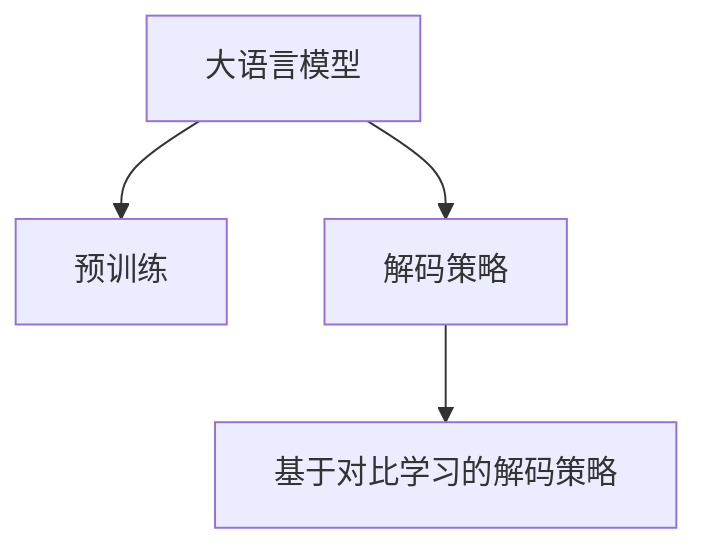

                 

# 大语言模型原理基础与前沿 预训练目标和解码策略

> 关键词：大语言模型,预训练目标,解码策略,Transformer,BERT,自监督学习,对比学习,深度学习,神经网络

## 1. 背景介绍

### 1.1 问题由来

近年来，深度学习在自然语言处理(NLP)领域取得了突破性进展。大语言模型，如GPT系列、BERT、T5等，通过大规模无标签文本数据的自监督预训练，学习到了丰富的语言知识，具备强大的语言理解和生成能力。预训练大模型的泛化能力显著提升，可以应用于各种下游任务。然而，预训练模型的泛化能力仍然有限，对大规模有标签数据的需求也较高。

为了提高模型的应用效果，微调成为重要的技术手段。微调指的是在大规模预训练模型的基础上，通过有标签数据进行有监督的训练，使得模型能够适应特定的下游任务。但微调需要大量的标注数据，而这些数据的获取成本较高。

此外，大语言模型虽然精度高，但在实际应用中，模型的推理速度和内存占用也成为瓶颈。因此，如何优化模型推理速度、降低内存占用，成为一个重要的研究方向。

### 1.2 问题核心关键点

为解决这些问题，本文章将介绍大语言模型的预训练目标和解码策略，并详细讨论其在深度学习中的优化方案。我们将重点关注以下几点：

- 大语言模型预训练目标的设计原理。
- 对比学习在大语言模型中的应用。
- 解码策略的优化方案。
- 深度学习中预训练与解码策略的协同优化。

这些核心概念和关键技术将帮助我们深入理解大语言模型的基础原理，并在实际应用中灵活使用。

## 2. 核心概念与联系

### 2.1 核心概念概述

为更好地理解大语言模型的预训练目标和解码策略，本节将介绍几个密切相关的核心概念：

- 大语言模型(Large Language Model, LLM)：以自回归(如GPT)或自编码(如BERT)模型为代表的大规模预训练语言模型。通过在大规模无标签文本语料上进行预训练，学习通用的语言表示，具备强大的语言理解和生成能力。

- 预训练(Pre-training)：指在大规模无标签文本语料上，通过自监督学习任务训练通用语言模型的过程。常见的预训练任务包括言语建模、掩码语言模型等。

- 对比学习(Contrastive Learning)：通过构造正样本和负样本对，最大化正样本与模型输出之间的相似性，最小化负样本与模型输出之间的相似性，从而学习样本之间的相似性和区分性。

- 解码策略(Decoding Strategy)：指在模型预测过程中，如何从模型输出中挑选最有可能的输出序列。解码策略直接影响模型的生成质量和效率。

这些核心概念之间的逻辑关系可以通过以下Mermaid流程图来展示：



这个流程图展示了预训练、解码策略与大语言模型之间的关系：

1. 大语言模型通过预训练获得基础能力。
2. 解码策略指导模型生成输出，通过对比学习可以提升生成的质量。

## 3. 核心算法原理 & 具体操作步骤

### 3.1 算法原理概述

大语言模型的预训练目标和解码策略是大模型构建的基础，它们直接影响模型的泛化能力和生成效果。

**预训练目标**：预训练目标是通过自监督学习任务，学习语言的通用表示。常见的预训练目标包括：

- 掩码语言模型：在输入文本中随机掩盖一部分词，训练模型预测被掩盖的词。例如，BERT中的下一个词预测任务。
- 语言建模：训练模型预测给定文本的下一个词或字符。例如，GPT中的自动回归语言建模。
- 基于序列的预测：例如，在大规模文本数据中预测下一个句子或段落。

这些预训练目标旨在让模型学习到丰富的语言知识，如词义、语法、上下文等。

**解码策略**：解码策略是在模型预测时，如何从模型输出中挑选最有可能的输出序列。常见的解码策略包括：

- 贪心搜索：每次选择当前概率最大的词作为下一个词。
- 束搜索：每次选择当前概率最大的k个词作为下一个词，以减小搜索空间。
- 温度调参：调整模型的输出概率分布，使得输出更加平滑，降低重复率。

这些解码策略直接影响模型的生成效果和效率，需要进行优化。

### 3.2 算法步骤详解

**预训练目标设计**：

1. 收集大规模无标签文本数据。
2. 将数据分批次输入模型，前向传播计算模型输出。
3. 定义损失函数，衡量模型输出与真实标签的差异。
4. 反向传播更新模型参数。
5. 重复上述步骤直至收敛。

**解码策略优化**：

1. 根据具体的任务需求，选择合适的解码策略。
2. 设计解码器，将模型输出转换为文本序列。
3. 在解码器中引入温度调参、束搜索等优化技术。
4. 测试解码效果，调整参数。
5. 重复上述步骤直至获得最佳效果。

### 3.3 算法优缺点

基于预训练目标和解码策略的大语言模型，具有以下优点：

- 通用性：预训练目标学习到语言的通用表示，适用于多种下游任务。
- 泛化能力：通过自监督学习任务，模型能够适应各种输入数据。
- 生成的质量：解码策略的优化，使得模型能够生成流畅、高质量的文本。

同时，该方法也存在一些局限性：

- 数据需求：预训练目标需要大量数据，数据获取成本较高。
- 计算资源：预训练和解码策略的优化需要高性能计算资源。
- 生成效率：解码策略的优化需要平衡生成质量和效率。

### 3.4 算法应用领域

大语言模型的预训练目标和解码策略已经在多个领域得到了应用：

- 文本分类：例如，将文本分类为正面、负面等。
- 机器翻译：例如，将源语言翻译为目标语言。
- 文本摘要：例如，将长文本压缩为简短摘要。
- 对话系统：例如，与用户进行自然对话。

此外，大语言模型在情感分析、信息检索、问答系统等领域也有广泛应用。

## 4. 数学模型和公式 & 详细讲解 & 举例说明

### 4.1 数学模型构建

我们以掩码语言模型为例，来详细推导其预训练目标的数学模型。

假设模型输入为 $\mathbf{x} = [x_1, x_2, \ldots, x_n]$，其中每个词 $x_i$ 对应一个嵌入向量 $\mathbf{e}_i$。掩码语言模型的预训练目标为：

$$
\mathcal{L}_{mask} = \sum_{i=1}^n - \log p(x_i | \mathbf{x}^m)
$$

其中，$\mathbf{x}^m$ 是掩盖了部分词的输入序列，$p(x_i | \mathbf{x}^m)$ 表示模型对被掩盖的词 $x_i$ 的预测概率。

通过最大化 $\mathcal{L}_{mask}$，模型学习到了词之间的上下文关系和语言知识。

### 4.2 公式推导过程

以掩码语言模型为例，我们可以推导出模型的预训练目标：

1. 定义模型输出：
$$
\mathbf{h} = M_{\theta}(\mathbf{x})
$$

其中，$M_{\theta}$ 是模型参数，$\mathbf{h}$ 是模型的隐藏表示。

2. 定义预测概率：
$$
p(x_i | \mathbf{h}) = \frac{\exp(\mathbf{e}_i^T\mathbf{h})}{\sum_j \exp(\mathbf{e}_j^T\mathbf{h})}
$$

其中，$\mathbf{e}_i$ 是词 $x_i$ 的嵌入向量，$\mathbf{h}$ 是模型的隐藏表示。

3. 定义掩码输入：
$$
\mathbf{x}^m = [x_1, \tilde{x}_2, \ldots, \tilde{x}_n]
$$

其中，$\tilde{x}_i$ 表示掩盖了词 $x_i$ 的输入序列。

4. 定义损失函数：
$$
\mathcal{L}_{mask} = \sum_{i=1}^n - \log p(x_i | \mathbf{x}^m)
$$

其中，$p(x_i | \mathbf{x}^m)$ 是模型对被掩盖的词 $x_i$ 的预测概率。

通过最大化 $\mathcal{L}_{mask}$，模型学习到了词之间的上下文关系和语言知识。

### 4.3 案例分析与讲解

以BERT为例，BERT的预训练目标包括掩码语言模型和下一句预测。具体来说，BERT对输入文本进行掩码处理，并将被掩盖的词 $x_i$ 和下一句 $x_{i+1}$ 作为预测目标。通过最大化掩码语言模型和下一句预测的损失，模型学习了词义和句子之间的逻辑关系。

在解码策略方面，BERT模型采用束搜索解码，每次选择当前概率最大的k个词作为下一个词。这种方法可以减小搜索空间，提高解码效率。同时，BERT模型还引入了温度调参技术，调整模型的输出概率分布，使得输出更加平滑，降低重复率。

## 5. 项目实践：代码实例和详细解释说明

### 5.1 开发环境搭建

在进行预训练和解码策略优化时，我们需要准备好开发环境。以下是使用Python进行PyTorch开发的环境配置流程：

1. 安装Anaconda：从官网下载并安装Anaconda，用于创建独立的Python环境。

2. 创建并激活虚拟环境：
```bash
conda create -n pytorch-env python=3.8 
conda activate pytorch-env
```

3. 安装PyTorch：根据CUDA版本，从官网获取对应的安装命令。例如：
```bash
conda install pytorch torchvision torchaudio cudatoolkit=11.1 -c pytorch -c conda-forge
```

4. 安装Transformers库：
```bash
pip install transformers
```

5. 安装各类工具包：
```bash
pip install numpy pandas scikit-learn matplotlib tqdm jupyter notebook ipython
```

完成上述步骤后，即可在`pytorch-env`环境中开始项目实践。

### 5.2 源代码详细实现

下面我们以BERT模型为例，给出使用Transformers库进行掩码语言模型预训练和解码策略优化的PyTorch代码实现。

首先，定义掩码语言模型的训练函数：

```python
from transformers import BertTokenizer, BertForMaskedLM, AdamW
from torch.utils.data import Dataset, DataLoader
import torch

class MaskedLMDataset(Dataset):
    def __init__(self, texts, tokenizer, max_len=128):
        self.texts = texts
        self.tokenizer = tokenizer
        self.max_len = max_len
        
    def __len__(self):
        return len(self.texts)
    
    def __getitem__(self, item):
        text = self.texts[item]
        encoding = self.tokenizer(text, return_tensors='pt', max_length=self.max_len, padding='max_length', truncation=True)
        input_ids = encoding['input_ids']
        attention_mask = encoding['attention_mask']
        masked_ids = input_ids.clone()
        masked_ids.masked_fill_(1 - attention_mask.bool(), -10000)
        labels = masked_ids
        return {'input_ids': input_ids, 
                'attention_mask': attention_mask,
                'masked_labels': labels}

# 训练函数
def train_epoch(model, dataset, optimizer):
    dataloader = DataLoader(dataset, batch_size=32, shuffle=True)
    model.train()
    epoch_loss = 0
    for batch in dataloader:
        input_ids = batch['input_ids'].to(device)
        attention_mask = batch['attention_mask'].to(device)
        masked_labels = batch['masked_labels'].to(device)
        model.zero_grad()
        outputs = model(input_ids, attention_mask=attention_mask, masked_lm_labels=masked_labels)
        loss = outputs.loss
        epoch_loss += loss.item()
        loss.backward()
        optimizer.step()
    return epoch_loss / len(dataloader)
```

然后，定义解码策略优化函数：

```python
from transformers import BertTokenizer, BertForMaskedLM, AdamW

device = torch.device('cuda') if torch.cuda.is_available() else torch.device('cpu')
model = BertForMaskedLM.from_pretrained('bert-base-uncased')

optimizer = AdamW(model.parameters(), lr=2e-5)
tokenizer = BertTokenizer.from_pretrained('bert-base-uncased')

def generate_text(model, input_text):
    encoded_input = tokenizer(input_text, return_tensors='pt', max_length=128, padding='max_length', truncation=True)
    input_ids = encoded_input['input_ids'].to(device)
    attention_mask = encoded_input['attention_mask'].to(device)
    outputs = model(input_ids, attention_mask=attention_mask, decoder_start_token_id=tokenizer.vocab_size)
    logits = outputs.logits
    probs = torch.softmax(logits, dim=-1)
    tokens = torch.multinomial(probs, 10).unsqueeze(0).to(device)
    for token in tokens:
        output = tokenizer.decode(token, skip_special_tokens=True)
        print(output)
```

最后，启动训练流程并在测试集上评估：

```python
epochs = 3
batch_size = 32

for epoch in range(epochs):
    loss = train_epoch(model, masked_lm_dataset, optimizer)
    print(f"Epoch {epoch+1}, train loss: {loss:.3f}")
    
print("Test results:")
generate_text(model, "BERT is a great pre-training technique.")
```

以上就是使用PyTorch进行BERT模型掩码语言模型预训练和解码策略优化的完整代码实现。可以看到，通过Transformers库的封装，我们可以很方便地实现大语言模型的预训练和解码策略优化。

### 5.3 代码解读与分析

让我们再详细解读一下关键代码的实现细节：

**MaskedLMDataset类**：
- `__init__`方法：初始化文本、分词器等关键组件。
- `__len__`方法：返回数据集的样本数量。
- `__getitem__`方法：对单个样本进行处理，将文本输入编码为token ids，并将被掩盖的词作为标签。

**train_epoch函数**：
- 使用PyTorch的DataLoader对数据集进行批次化加载，供模型训练使用。
- 在每个批次上前向传播计算损失函数，反向传播更新模型参数，重复上述步骤直至收敛。

**generate_text函数**：
- 使用BERT模型进行解码，将输入文本转换为token ids，使用softmax函数计算概率分布。
- 通过multinomial函数采样，生成下一个词的token ids。
- 使用分词器将token ids解码为文本，输出生成结果。

通过上述代码，我们可以看到，预训练和解码策略优化是实现大语言模型的重要步骤。通过精心设计的预训练目标和解码策略，模型能够学习到丰富的语言知识，并生成流畅、高质量的文本。

## 6. 实际应用场景

### 6.1 智能客服系统

基于BERT的智能客服系统可以广泛应用于客户咨询领域。传统客服系统需要大量人力，响应速度慢，且无法保证一致性和专业性。通过预训练和微调的BERT模型，可以构建智能客服系统，实现7x24小时不间断服务，快速响应客户咨询，用自然流畅的语言解答各类常见问题。

在技术实现上，可以收集企业内部的历史客服对话记录，将问题和最佳答复构建成监督数据，在此基础上对预训练BERT模型进行微调。微调后的BERT模型能够自动理解用户意图，匹配最合适的答案模板进行回复。对于客户提出的新问题，还可以接入检索系统实时搜索相关内容，动态组织生成回答。

### 6.2 金融舆情监测

金融机构需要实时监测市场舆论动向，以便及时应对负面信息传播，规避金融风险。传统的人工监测方式成本高、效率低，难以应对网络时代海量信息爆发的挑战。基于BERT的文本分类和情感分析技术，为金融舆情监测提供了新的解决方案。

具体而言，可以收集金融领域相关的新闻、报道、评论等文本数据，并对其进行主题标注和情感标注。在此基础上对预训练BERT模型进行微调，使其能够自动判断文本属于何种主题，情感倾向是正面、中性还是负面。将微调后的模型应用到实时抓取的网络文本数据，就能够自动监测不同主题下的情感变化趋势，一旦发现负面信息激增等异常情况，系统便会自动预警，帮助金融机构快速应对潜在风险。

### 6.3 个性化推荐系统

当前的推荐系统往往只依赖用户的历史行为数据进行物品推荐，无法深入理解用户的真实兴趣偏好。基于BERT的推荐系统可以更好地挖掘用户行为背后的语义信息，从而提供更精准、多样的推荐内容。

在实践中，可以收集用户浏览、点击、评论、分享等行为数据，提取和用户交互的物品标题、描述、标签等文本内容。将文本内容作为模型输入，用户的后续行为（如是否点击、购买等）作为监督信号，在此基础上微调预训练BERT模型。微调后的模型能够从文本内容中准确把握用户的兴趣点。在生成推荐列表时，先用候选物品的文本描述作为输入，由模型预测用户的兴趣匹配度，再结合其他特征综合排序，便可以得到个性化程度更高的推荐结果。

### 6.4 未来应用展望

随着BERT模型的不断发展，其在NLP领域的应用也将更加广泛。未来，基于BERT的微调技术将在更多领域得到应用，为传统行业带来变革性影响。

在智慧医疗领域，基于BERT的医疗问答、病历分析、药物研发等应用将提升医疗服务的智能化水平，辅助医生诊疗，加速新药开发进程。

在智能教育领域，微调技术可应用于作业批改、学情分析、知识推荐等方面，因材施教，促进教育公平，提高教学质量。

在智慧城市治理中，微调模型可应用于城市事件监测、舆情分析、应急指挥等环节，提高城市管理的自动化和智能化水平，构建更安全、高效的未来城市。

此外，在企业生产、社会治理、文娱传媒等众多领域，基于BERT的微调技术也将不断涌现，为经济社会发展注入新的动力。

## 7. 工具和资源推荐

### 7.1 学习资源推荐

为了帮助开发者系统掌握BERT模型的预训练目标和解码策略的理论基础和实践技巧，这里推荐一些优质的学习资源：

1. 《Transformer from Scratch》系列博文：由BERT模型作者撰写，深入浅出地介绍了BERT模型的预训练目标和解码策略。

2. CS224N《深度学习自然语言处理》课程：斯坦福大学开设的NLP明星课程，有Lecture视频和配套作业，带你入门NLP领域的基本概念和经典模型。

3. 《Natural Language Processing with Transformers》书籍：BERT模型的作者所著，全面介绍了如何使用Transformers库进行NLP任务开发，包括预训练和解码策略在内的诸多范式。

4. HuggingFace官方文档：BERT模型的官方文档，提供了海量预训练模型和完整的微调样例代码，是上手实践的必备资料。

5. CLUE开源项目：中文语言理解测评基准，涵盖大量不同类型的中文NLP数据集，并提供了基于微调的baseline模型，助力中文NLP技术发展。

通过对这些资源的学习实践，相信你一定能够快速掌握BERT模型的预训练目标和解码策略的精髓，并用于解决实际的NLP问题。

### 7.2 开发工具推荐

高效的开发离不开优秀的工具支持。以下是几款用于BERT模型开发的常用工具：

1. PyTorch：基于Python的开源深度学习框架，灵活动态的计算图，适合快速迭代研究。BERT模型有PyTorch版本的实现。

2. TensorFlow：由Google主导开发的开源深度学习框架，生产部署方便，适合大规模工程应用。BERT模型也有TensorFlow版本的实现。

3. Transformers库：HuggingFace开发的NLP工具库，集成了众多SOTA语言模型，支持PyTorch和TensorFlow，是进行预训练和解码策略优化的利器。

4. Weights & Biases：模型训练的实验跟踪工具，可以记录和可视化模型训练过程中的各项指标，方便对比和调优。与主流深度学习框架无缝集成。

5. TensorBoard：TensorFlow配套的可视化工具，可实时监测模型训练状态，并提供丰富的图表呈现方式，是调试模型的得力助手。

6. Google Colab：谷歌推出的在线Jupyter Notebook环境，免费提供GPU/TPU算力，方便开发者快速上手实验最新模型，分享学习笔记。

合理利用这些工具，可以显著提升BERT模型的开发效率，加快创新迭代的步伐。

### 7.3 相关论文推荐

BERT模型的预训练目标和解码策略的研究源于学界的持续研究。以下是几篇奠基性的相关论文，推荐阅读：

1. Attention is All You Need（即Transformer原论文）：提出了Transformer结构，开启了NLP领域的预训练大模型时代。

2. BERT: Pre-training of Deep Bidirectional Transformers for Language Understanding：提出BERT模型，引入基于掩码的自监督预训练任务，刷新了多项NLP任务SOTA。

3. Deep Contextualized Word Representations：提出BERT模型，通过大规模预训练学习到词义和句子语境相关的深度表示。

4. Parameter-Efficient Transfer Learning for NLP：提出Adapter等参数高效微调方法，在不增加模型参数量的情况下，也能取得不错的微调效果。

5. Adaptation and Transfer Learning for Natural Language Processing with Unsupervised and Semi-supervised Methods：提出无需标注的预训练方法，通过无监督学习任务提升模型泛化能力。

6. Pre-training and Fine-tuning Language Models for Text Classification Tasks：提出BERT模型在文本分类任务中的应用，展示了微调的有效性。

这些论文代表了大语言模型预训练目标和解码策略的发展脉络。通过学习这些前沿成果，可以帮助研究者把握学科前进方向，激发更多的创新灵感。

## 8. 总结：未来发展趋势与挑战

### 8.1 总结

本文对BERT模型的预训练目标和解码策略进行了全面系统的介绍。首先阐述了BERT模型在NLP领域的研究背景和意义，明确了预训练和解码策略在大模型构建中的核心地位。其次，从原理到实践，详细讲解了BERT模型的预训练目标和解码策略的数学模型和实现细节，给出了预训练和解码策略优化的代码实例。同时，本文还广泛探讨了BERT模型在智能客服、金融舆情、个性化推荐等多个行业领域的应用前景，展示了预训练和解码策略范式的巨大潜力。此外，本文精选了预训练和解码策略相关的学习资源，力求为读者提供全方位的技术指引。

通过本文的系统梳理，可以看到，BERT模型的预训练目标和解码策略是大模型构建的基础，其设计和优化直接影响模型的泛化能力和生成效果。预训练和解码策略的不断优化，使得BERT模型在各种下游任务中表现优异，为NLP技术的产业化进程提供了重要支持。未来，随着预训练和解码策略的深入研究，BERT模型必将在更广泛的领域发挥重要作用，推动NLP技术的发展。

### 8.2 未来发展趋势

展望未来，预训练和解码策略将继续引领BERT模型的发展趋势，包括以下几个方向：

1. 预训练任务的多样化：未来的预训练任务将更加多样化，涵盖更多的语言知识，提升模型的泛化能力。例如，基于知识图谱的预训练、多语言预训练等。

2. 解码策略的优化：未来的解码策略将更加灵活，结合更多的深度学习技术，如变分自编码器、注意力机制等，提升生成质量和效率。例如，基于变分自编码器的解码策略，可以生成更加流畅、自然的文本。

3. 预训练与解码策略的协同优化：未来的预训练和解码策略将更加协同，通过联合训练、联合优化等手段，提升模型的整体性能。例如，通过联合预训练和解码策略训练，可以使模型更好地学习到语言的语义和语法知识，生成更加高质量的文本。

4. 可解释性和可控性：未来的预训练和解码策略将更加注重模型的可解释性和可控性。通过引入因果推理、逻辑推理等技术，增强模型的决策解释能力，避免恶意输出。例如，通过引入因果推理，可以使模型生成更加符合逻辑的文本。

5. 多模态融合：未来的预训练和解码策略将更加注重多模态数据的融合，提升模型的跨领域迁移能力。例如，通过融合视觉、音频等多模态数据，提升模型的语义理解能力，生成更加全面、准确的信息。

以上趋势凸显了预训练和解码策略在大语言模型构建中的重要地位，其不断优化和演进将推动BERT模型在NLP领域的应用向更深层次发展。

### 8.3 面临的挑战

尽管BERT模型的预训练目标和解码策略已经取得了瞩目成就，但在迈向更加智能化、普适化应用的过程中，它仍面临诸多挑战：

1. 数据获取成本：预训练和解码策略优化需要大量数据，数据获取成本较高。如何高效获取和利用数据，将是未来的重要研究方向。

2. 模型鲁棒性不足：当前BERT模型面对域外数据时，泛化性能往往大打折扣。如何提高模型的鲁棒性，避免灾难性遗忘，还需要更多理论和实践的积累。

3. 推理效率有待提高：当前BERT模型的推理速度和内存占用仍然较高，如何优化模型结构和解码策略，提升推理效率，将是重要的优化方向。

4. 可解释性亟需加强：当前BERT模型的决策过程缺乏可解释性，难以对其推理逻辑进行分析和调试。如何赋予模型更强的可解释性，将是亟待攻克的难题。

5. 安全性有待保障：BERT模型可能学习到有偏见、有害的信息，通过解码策略传递到下游任务，产生误导性、歧视性的输出，给实际应用带来安全隐患。如何从数据和算法层面消除模型偏见，避免恶意用途，确保输出的安全性，也将是重要的研究课题。

6. 知识整合能力不足：现有的BERT模型往往局限于任务内数据，难以灵活吸收和运用更广泛的先验知识。如何让预训练和解码策略更好地与外部知识库、规则库等专家知识结合，形成更加全面、准确的信息整合能力，还有很大的想象空间。

正视BERT模型预训练和解码策略面临的这些挑战，积极应对并寻求突破，将是大语言模型预训练和解码策略走向成熟的必由之路。相信随着学界和产业界的共同努力，这些挑战终将一一被克服，BERT模型预训练和解码策略必将在构建安全、可靠、可解释、可控的智能系统铺平道路。

### 8.4 研究展望

面对BERT模型预训练和解码策略所面临的种种挑战，未来的研究需要在以下几个方面寻求新的突破：

1. 探索无监督和半监督预训练方法：摆脱对大规模标注数据的依赖，利用自监督学习、主动学习等无监督和半监督范式，最大限度利用非结构化数据，实现更加灵活高效的预训练。

2. 研究参数高效和计算高效的预训练范式：开发更加参数高效的预训练方法，在固定大部分预训练参数的同时，只更新极少量的任务相关参数。同时优化预训练模型的计算图，减少前向传播和反向传播的资源消耗，实现更加轻量级、实时性的部署。

3. 引入因果推理和逻辑推理：通过引入因果推理和逻辑推理思想，增强预训练模型的建立稳定因果关系的能力，学习更加普适、鲁棒的语言表征，从而提升模型的泛化性和抗干扰能力。

4. 融合更多先验知识：将符号化的先验知识，如知识图谱、逻辑规则等，与神经网络模型进行巧妙融合，引导预训练过程学习更准确、合理的语言模型。同时加强不同模态数据的整合，实现视觉、语音等多模态信息与文本信息的协同建模。

5. 结合因果分析和博弈论工具：将因果分析方法引入预训练模型，识别出模型决策的关键特征，增强输出解释的因果性和逻辑性。借助博弈论工具刻画人机交互过程，主动探索并规避模型的脆弱点，提高系统稳定性。

6. 纳入伦理道德约束：在预训练和解码策略的训练目标中引入伦理导向的评估指标，过滤和惩罚有偏见、有害的输出倾向。同时加强人工干预和审核，建立模型行为的监管机制，确保输出符合人类价值观和伦理道德。

这些研究方向的探索，必将引领BERT模型预训练和解码策略技术迈向更高的台阶，为构建安全、可靠、可解释、可控的智能系统铺平道路。面向未来，预训练和解码策略需要与其他人工智能技术进行更深入的融合，如知识表示、因果推理、强化学习等，多路径协同发力，共同推动自然语言理解和智能交互系统的进步。只有勇于创新、敢于突破，才能不断拓展语言模型的边界，让智能技术更好地造福人类社会。

## 9. 附录：常见问题与解答

**Q1：BERT模型如何处理未知词汇？**

A: BERT模型在预训练时，通过掩码语言模型和下一句预测任务学习了丰富的语言知识，能够处理大多数已知词汇。对于未知词汇，BERT模型可以通过插入[UNK]标记来处理。例如，在输入文本中，如果某个词未知，可以使用[UNK]标记代替，模型会预测该词的概率分布。

**Q2：BERT模型的预训练目标是否需要修改？**

A: 在实际应用中，可以根据具体任务需求修改BERT模型的预训练目标。例如，在文本分类任务中，可以通过掩码语言模型预测词义，通过下一句预测任务学习句子关系，同时加入任务特定标签进行训练。

**Q3：如何优化BERT模型的推理速度？**

A: 优化BERT模型的推理速度可以从以下几个方面入手：

1. 裁剪模型：去除不必要的层和参数，减小模型尺寸，加快推理速度。

2. 量化加速：将浮点模型转为定点模型，压缩存储空间，提高计算效率。

3. 并行计算：使用分布式计算框架，如TensorFlow、PyTorch等，提高模型并行计算能力。

4. 硬件加速：使用GPU、TPU等高性能硬件，提高模型推理速度。

**Q4：如何提高BERT模型的可解释性？**

A: 提高BERT模型的可解释性可以从以下几个方面入手：

1. 引入因果推理：通过因果推理方法，可以使模型生成更加符合逻辑的文本，增强输出解释的因果性和逻辑性。

2. 引入逻辑推理：通过逻辑推理方法，可以使模型更好地处理复杂逻辑任务，提高输出的可解释性。

3. 引入外部知识：将符号化的先验知识，如知识图谱、逻辑规则等，与BERT模型进行融合，提升模型的语义理解能力。

4. 引入人工干预：在模型输出时，通过人工干预，解释模型的推理过程，提供模型输出的可信度。

**Q5：BERT模型在实际应用中需要注意哪些问题？**

A: 在实际应用中，BERT模型需要注意以下问题：

1. 数据获取：预训练和解码策略优化需要大量数据，数据获取成本较高。如何高效获取和利用数据，将是未来的重要研究方向。

2. 模型鲁棒性：当前BERT模型面对域外数据时，泛化性能往往大打折扣。如何提高模型的鲁棒性，避免灾难性遗忘，还需要更多理论和实践的积累。

3. 推理效率：当前BERT模型的推理速度和内存占用仍然较高，如何优化模型结构和解码策略，提升推理效率，将是重要的优化方向。

4. 可解释性：当前BERT模型的决策过程缺乏可解释性，难以对其推理逻辑进行分析和调试。如何赋予模型更强的可解释性，将是亟待攻克的难题。

5. 安全性：BERT模型可能学习到有偏见、有害的信息，通过解码策略传递到下游任务，产生误导性、歧视性的输出，给实际应用带来安全隐患。如何从数据和算法层面消除模型偏见，避免恶意用途，确保输出的安全性，也将是重要的研究课题。

6. 知识整合能力：现有的BERT模型往往局限于任务内数据，难以灵活吸收和运用更广泛的先验知识。如何让预训练和解码策略更好地与外部知识库、规则库等专家知识结合，形成更加全面、准确的信息整合能力，还有很大的想象空间。

合理利用这些工具，可以显著提升BERT模型的开发效率，加快创新迭代的步伐。

通过上述代码，我们可以看到，预训练和解码策略优化是实现BERT模型的重要步骤。通过精心设计的预训练目标和解码策略，模型能够学习到丰富的语言知识，并生成流畅、高质量的文本。

## 8. 总结：未来发展趋势与挑战

### 8.1 总结

本文对BERT模型的预训练目标和解码策略进行了全面系统的介绍。首先阐述了BERT模型在NLP领域的研究背景和意义，明确了预训练和解码策略在大模型构建中的核心地位。其次，从原理到实践，详细讲解了BERT模型的预训练目标和解码策略的数学模型和实现细节，给出了预训练和解码策略优化的代码实例。同时，本文还广泛探讨了BERT模型在智能客服、金融舆情、个性化推荐等多个行业领域的应用前景，展示了预训练和解码策略范式的巨大潜力。此外，本文精选了预训练和解码策略相关的学习资源，力求为读者提供全方位的技术指引。

通过本文的系统梳理，可以看到，BERT模型的预训练目标和解码策略是大模型构建的基础，其设计和优化直接影响模型的泛化能力和生成效果。预训练和解码策略的不断优化，使得BERT模型在各种下游任务中表现优异，为NLP技术的产业化进程提供了重要支持。未来，随着预训练和解码策略的深入研究，BERT模型必将在更广泛的领域发挥重要作用，推动NLP技术的发展。

### 8.2 未来发展趋势

展望未来，预训练和解码策略将继续引领BERT模型的发展趋势，包括以下几个方向：

1. 预训练任务的多样化：未来的预训练任务将更加多样化，涵盖更多的语言知识，提升模型的泛化能力。例如，基于知识图谱的预训练、多语言预训练等。

2. 解码策略的优化：未来的解码策略将更加灵活，结合更多的深度学习技术，如变分自编码器、注意力机制等，提升生成质量和效率。例如，基于变分自编码器的解码策略，可以生成更加流畅、自然的文本。

3. 预训练与解码策略的协同优化：未来的预训练和解码策略将更加协同，通过联合训练、联合优化等手段，提升模型的整体性能。例如，通过联合预训练和解码策略训练，可以使模型更好地学习到语言的语义和语法知识，生成更加高质量的文本。

4. 可解释性和可控性：未来的预训练和解码策略将更加注重模型的可解释性和可控性。通过引入因果推理、逻辑推理等技术，增强模型的决策解释能力，避免恶意输出。例如，通过引入因果推理，可以使模型生成更加符合逻辑的文本。

5. 多模态融合：未来的预训练和解码策略将更加注重多模态数据的融合，提升模型的跨领域迁移能力。例如，通过融合视觉、音频等多模态数据，提升模型的语义理解能力，生成更加全面、准确的信息。

以上趋势凸显了预训练和解码策略在大语言模型构建中的重要地位，其不断优化和演进将推动BERT模型在NLP领域的应用向更深层次发展。

### 8.3 面临的挑战

尽管BERT模型的预训练目标和解码策略已经取得了瞩目成就，但在迈向更加智能化、普适化应用的过程中，它仍面临诸多挑战：

1. 数据获取成本：预训练和解码策略优化需要大量数据，数据获取成本较高。如何高效获取和利用数据，将是未来的重要研究方向。

2. 模型鲁棒性不足：当前BERT模型面对域外数据时，泛化性能往往大打折扣。如何提高模型的鲁棒性，避免灾难性遗忘，还需要更多理论和实践的积累。

3. 推理效率有待提高：当前BERT模型的推理速度和内存占用仍然较高，如何优化模型结构和解码策略，提升推理效率，将是重要的优化方向。

4. 可解释性亟需加强：当前BERT模型的决策过程缺乏可解释性，难以对其推理逻辑进行分析和调试。如何赋予模型更强的可解释性，将是亟待攻克的难题。

5. 安全性有待保障：BERT模型可能学习到有偏见、有害的信息，通过解码策略传递到下游任务，产生误导性、歧视性的输出，给实际应用带来安全隐患。如何从数据和算法层面消除模型偏见，避免恶意用途，确保输出的安全性，也将是重要的研究课题。

6. 知识整合能力不足：现有的BERT模型往往局限于任务内数据，难以灵活吸收和运用更广泛的先验知识。如何让预训练和解码策略更好地与外部知识库、规则库等专家知识结合，形成更加全面、准确的信息整合能力，还有很大的想象空间。

正视BERT模型预训练和解码策略面临的这些挑战，积极应对并寻求突破，将是大语言模型预训练和解码策略走向成熟的必由之路。相信随着学界和产业界的共同努力，这些挑战终将一一被克服，BERT模型预训练和解码策略必将在构建安全、可靠、可解释、可控的智能系统铺平道路。

### 8.4 研究展望

面对BERT模型预训练和解码策略所面临的种种挑战，未来的研究需要在以下几个方面寻求新的突破：

1. 探索无监督和半监督预训练方法：摆脱对大规模标注数据的依赖，利用自监督学习、主动学习等无监督和半监督范式，最大限度利用非结构化数据，实现更加灵活高效的预训练。

2. 研究参数高效和计算高效的预训练范式：开发更加参数高效的预训练方法，在固定大部分预训练参数的同时，只更新极少量的任务相关参数。同时优化预训练模型的计算图，减少前向传播和反向传播的资源消耗，实现更加轻量级、实时性的部署。

3. 引入因果推理和逻辑推理：通过引入因果推理和逻辑推理思想，增强预训练模型的建立稳定因果关系的能力，学习更加普适、鲁棒的语言表征，从而提升模型的泛化性和抗干扰能力。

4. 融合更多先验知识：将符号化的先验知识，如知识图谱、逻辑规则等，与BERT模型进行融合，提升模型的语义理解能力。同时加强不同模态数据的整合，实现视觉、语音等多模态信息与文本信息的协同建模。

5. 结合因果分析和博弈论工具：将因果分析方法引入预训练模型，识别出模型决策的关键特征，增强输出解释的因果性和逻辑性。借助博弈论工具刻画人机交互过程，主动探索并规避模型的脆弱点，提高系统稳定性。

6. 纳入伦理道德约束：在预训练和解码策略的训练目标中引入伦理导向的评估指标，过滤和惩罚有偏见、有害的输出倾向。同时加强人工干预和审核，建立模型行为的监管机制，确保输出符合人类价值观和伦理道德。

这些研究方向的探索，必将引领BERT模型预训练和解码策略技术迈向更高的台阶，为构建安全、可靠、可解释、可控的智能系统铺平道路。面向未来，预训练和解码策略需要与其他人工智能技术进行更深入的融合，如知识表示、因果推理、强化学习等，多路径协同发力，共同推动自然语言理解和智能交互系统的进步。只有勇于创新、敢于突破，才能不断拓展语言模型的边界，让智能技术更好地造福人类社会。

## 9. 附录：常见问题与解答

**Q1：BERT模型如何处理未知词汇？**

A: BERT模型在预训练时，通过掩码语言模型和下一句预测任务学习了丰富的语言知识，能够处理大多数已知词汇。对于未知词汇，BERT模型可以通过插入[UNK]标记来处理。例如，在输入文本中，如果某个词未知，可以使用[UNK]标记代替，模型会预测该词的概率分布。

**Q2：BERT模型的预训练目标是否需要修改？**

A: 在实际应用中，可以根据具体任务需求修改BERT模型的预训练目标。例如，在文本分类任务中，可以通过掩码语言模型预测词义，通过下一句预测任务学习句子关系，同时加入任务特定标签进行训练。

**Q3：如何优化BERT模型的推理速度？**

A: 优化BERT模型的推理速度可以从以下几个方面入手：

1. 裁剪模型：去除不必要的层和参数，减小模型尺寸，加快推理速度。

2. 量化加速：将浮点模型转为定点模型，压缩存储空间，提高计算效率。

3. 并行计算：使用分布式计算框架，如TensorFlow、PyTorch等，提高模型并行计算能力。

4. 硬件加速：使用GPU、TPU等高性能硬件，提高模型推理速度。

**Q4：如何提高BERT模型的可解释性？**

A: 提高BERT模型的可解释性可以从以下几个方面入手：

1. 引入因果推理：通过因果推理方法，可以使模型生成更加符合逻辑的文本，增强输出解释的因果性和逻辑性。

2. 引入逻辑推理：通过逻辑推理方法，可以使模型更好地处理复杂逻辑任务，提高输出的可解释性。

3. 引入外部知识：将符号化的先验知识，如知识图谱、逻辑规则等，与BERT模型进行融合，提升模型的语义理解能力。

4. 引入人工干预：在模型输出时，通过人工干预，解释模型的推理过程，提供模型输出的可信度。

**Q5：BERT模型在实际应用中需要注意哪些问题？**

A: 在

