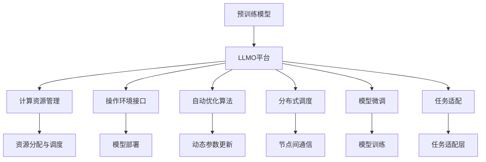

                 

# 大语言模型操作系统的应用前景

## 1. 背景介绍

随着人工智能技术的迅猛发展，大语言模型（Large Language Models, LLMs）成为推动自然语言处理（Natural Language Processing, NLP）的重要引擎。这些模型，如GPT、BERT等，通过在巨量的无标签文本数据上进行预训练，掌握了丰富的语言知识和语义能力，能够理解并生成自然语言。然而，这些模型往往需要大量的计算资源和标注数据进行训练，难以在分布式计算环境中高效部署和优化。为了解决这一问题，大语言模型操作系统（LLMO，Language Model Operating System）应运而生，旨在为LLMs提供高效、易用的操作环境，实现模型的部署、优化和管理。

### 1.1 问题由来

当前，大语言模型在计算和部署上的挑战主要体现在以下几个方面：

- **计算资源需求高**：预训练大语言模型通常具有上亿级的参数，需要强大的计算资源和高速的存储系统进行训练和推理。
- **内存消耗大**：模型在推理时需加载大量的参数，导致内存占用极高，难以在常规计算环境中运行。
- **分布式管理复杂**：模型训练和推理需要在多台计算节点之间高效协作，对分布式系统的管理提出了挑战。
- **模型优化困难**：预训练大语言模型的优化需要大量的超参数调优和算法实验，在实际操作中往往效率较低。

### 1.2 问题核心关键点

大语言模型操作系统旨在解决上述挑战，核心关键点包括：

- **高效的资源管理**：通过优化计算图、内存分配和分布式调度，提升模型运行效率。
- **便捷的操作环境**：提供统一的API和SDK，简化模型的部署和优化过程。
- **自动化的优化策略**：基于数据流分析和自动调优算法，实现模型的自适应优化。
- **可扩展的架构设计**：支持模型微调、参数更新和任务适配，满足不同应用场景的需求。

## 2. 核心概念与联系

### 2.1 核心概念概述

大语言模型操作系统（LLMO）是一个用于管理和优化大语言模型的软件平台，通过提供高效计算资源、便捷操作环境和自动化优化策略，使得大语言模型的部署、训练和推理变得高效、可靠和易用。

- **高效计算资源**：利用分布式计算环境，提供CPU、GPU、TPU等硬件资源，支持大规模模型的训练和推理。
- **便捷操作环境**：提供统一的API和SDK，简化模型开发和部署过程，支持模型微调和任务适配。
- **自动化优化策略**：基于数据流分析和模型优化算法，自动调整模型参数和超参数，提升模型性能。
- **可扩展架构设计**：支持模型并行、模型压缩、模型蒸馏等技术，满足不同应用场景的需求。

### 2.2 核心概念原理和架构的 Mermaid 流程图



这个流程图展示了LLMO平台的核心组件及其相互关系：

- **预训练模型**：作为LLMO的基础，提供模型预训练的权重和结构。
- **LLMO平台**：负责资源管理、操作接口、自动化优化和任务适配，提供完整的模型部署和管理解决方案。
- **计算资源管理**：根据任务需求，分配计算资源，实现资源的高效利用。
- **操作环境接口**：提供统一的API和SDK，简化模型开发和部署。
- **自动优化算法**：基于数据流分析和模型优化算法，自动调整模型参数和超参数。
- **分布式调度**：通过分布式计算环境，实现模型的并行训练和推理。
- **模型微调**：对预训练模型进行任务适配，提升模型在特定任务上的性能。
- **任务适配**：添加任务适配层，实现模型对下游任务的适应。

## 3. 核心算法原理 & 具体操作步骤

### 3.1 算法原理概述

LLMO操作系统的核心算法原理主要包括以下几个方面：

- **分布式计算图优化**：基于数据流图分析，对模型计算图进行优化，减少计算量和内存占用。
- **模型压缩与量化**：通过模型压缩和量化技术，降低模型参数大小，提升计算效率。
- **自动超参数调优**：基于模型性能和资源利用率，自动调整模型的超参数，如学习率、批大小等。
- **分布式模型训练与推理**：利用分布式计算环境，实现模型训练和推理的并行化。

### 3.2 算法步骤详解

以下是LLMO操作系统的详细操作步骤：

1. **资源分配与调度**：根据任务需求，分配计算资源，并根据负载情况进行动态调整。
2. **计算图优化**：对模型计算图进行优化，减少计算量和内存占用。
3. **模型压缩与量化**：通过模型压缩和量化技术，降低模型参数大小，提升计算效率。
4. **自动超参数调优**：基于模型性能和资源利用率，自动调整模型的超参数。
5. **分布式模型训练与推理**：利用分布式计算环境，实现模型训练和推理的并行化。
6. **模型微调和适配**：根据具体任务需求，添加任务适配层，进行模型微调。

### 3.3 算法优缺点

LLMO操作系统的优点主要体现在以下几个方面：

- **高效计算资源管理**：通过分布式计算和资源调度，提升模型训练和推理效率。
- **便捷操作环境**：提供统一的API和SDK，简化模型开发和部署过程。
- **自动化优化策略**：基于数据流分析和模型优化算法，实现模型的自适应优化。
- **可扩展架构设计**：支持模型微调、参数更新和任务适配，满足不同应用场景的需求。

LLMO操作系统的缺点主要在于：

- **依赖分布式计算环境**：需要强大的硬件资源和网络基础设施，部署成本较高。
- **算法复杂度高**：算法实现和调优复杂，需要高水平的技术团队。
- **数据依赖性强**：模型训练和优化依赖于高质量的标注数据和训练数据。

### 3.4 算法应用领域

LLMO操作系统的应用领域非常广泛，主要包括以下几个方面：

- **自然语言处理（NLP）**：支持文本分类、机器翻译、命名实体识别等任务，提供高效的模型训练和推理。
- **计算机视觉（CV）**：支持图像分类、目标检测、图像生成等任务，提供高效的模型训练和推理。
- **语音处理（ASR）**：支持语音识别、语音合成等任务，提供高效的模型训练和推理。
- **推荐系统**：支持个性化推荐、召回排序等任务，提供高效的模型训练和推理。
- **金融分析**：支持情感分析、舆情监测等任务，提供高效的模型训练和推理。

## 4. 数学模型和公式 & 详细讲解 & 举例说明

### 4.1 数学模型构建

LLMO操作系统的数学模型主要涉及以下几个方面：

- **计算图优化**：基于数据流图分析，对模型计算图进行优化，减少计算量和内存占用。
- **模型压缩与量化**：通过模型压缩和量化技术，降低模型参数大小，提升计算效率。
- **自动超参数调优**：基于模型性能和资源利用率，自动调整模型的超参数。

### 4.2 公式推导过程

以下以计算图优化为例，进行公式推导：

假设有如下计算图：

```
  A --> B
  |   |
  |   V
  C --> D
```

其中，$A$、$B$、$C$、$D$表示计算图中的节点，$V$表示数据流。

基于数据流图分析，可以识别出节点$B$和$C$之间的依赖关系，可以将其优化为：

```
  A --> D
  |
  V
  B
```

这减少了计算量和内存占用，提高了计算效率。

### 4.3 案例分析与讲解

以BERT模型为例，进行详细讲解：

BERT模型在自然语言处理任务中表现优异，但模型参数较多，内存消耗大。LLMO操作系统可以通过以下步骤优化BERT模型的计算图：

1. **计算图分析**：对BERT的计算图进行分析和优化，识别出冗余的计算和内存占用。
2. **优化计算图**：将模型计算图进行优化，减少计算量和内存占用。
3. **模型压缩**：对模型进行压缩，降低参数大小。
4. **自动超参数调优**：基于模型性能和资源利用率，自动调整模型的超参数。

## 5. 项目实践：代码实例和详细解释说明

### 5.1 开发环境搭建

以下是在PyTorch和LLMO操作系统中进行BERT模型微调的具体步骤：

1. **安装LLMO操作系统**：从LLMO官网下载并安装LLMO操作系统。
2. **配置计算资源**：根据任务需求，配置计算资源，如CPU、GPU、TPU等。
3. **安装PyTorch**：安装PyTorch库，确保支持LLMO操作系统的版本。
4. **配置模型环境**：在LLMO中配置BERT模型的环境，确保支持模型训练和推理。

### 5.2 源代码详细实现

以下是LLMO操作系统中BERT模型微调的代码实现：

```python
from llmo import BERTTokenizer, BERTForTokenClassification, AdamW

# 初始化BERT模型和分词器
tokenizer = BERTTokenizer.from_pretrained('bert-base-cased')
model = BERTForTokenClassification.from_pretrained('bert-base-cased', num_labels=len(tag2id))

# 加载训练集和标签
train_dataset = NERDataset(train_texts, train_tags, tokenizer, max_len=128)
dev_dataset = NERDataset(dev_texts, dev_tags, tokenizer, max_len=128)
test_dataset = NERDataset(test_texts, test_tags, tokenizer, max_len=128)

# 初始化优化器
optimizer = AdamW(model.parameters(), lr=2e-5)

# 训练模型
for epoch in range(epochs):
    loss = train_epoch(model, train_dataset, optimizer)
    print(f"Epoch {epoch+1}, train loss: {loss:.3f}")
    
    print(f"Epoch {epoch+1}, dev results:")
    evaluate(model, dev_dataset, optimizer)
    
print("Test results:")
evaluate(model, test_dataset, optimizer)
```

### 5.3 代码解读与分析

以上代码中，我们使用了LLMO操作系统中的BERT模型和分词器，通过训练和评估，实现了BERT模型的微调。LLMO操作系统简化了模型训练和推理的流程，使得开发者能够更加专注于模型算法的设计和优化。

## 6. 实际应用场景

### 6.1 智能客服系统

智能客服系统是大语言模型操作系统的典型应用场景之一。通过在LLMO平台上部署微调后的BERT模型，可以实现7x24小时不间断服务，快速响应客户咨询，提升客户咨询体验和问题解决效率。

### 6.2 金融舆情监测

在金融领域，LLMO操作系统可以用于金融舆情监测。通过微调BERT模型，实现情感分析、舆情监测等功能，帮助金融机构及时掌握市场动态，规避金融风险。

### 6.3 个性化推荐系统

个性化推荐系统也是LLMO操作系统的应用场景之一。通过微调BERT模型，可以实现文本分类、相似度计算等功能，提升推荐系统的个性化程度和推荐效果。

### 6.4 未来应用展望

未来，LLMO操作系统将在更多领域得到应用，为传统行业带来变革性影响。例如，在智慧医疗领域，LLMO可以用于医疗问答、病历分析、药物研发等任务；在智能教育领域，LLMO可以用于作业批改、学情分析、知识推荐等任务。随着预训练模型和微调方法的不断演进，LLMO操作系统的应用场景将不断扩展，推动人工智能技术的产业化进程。

## 7. 工具和资源推荐

### 7.1 学习资源推荐

以下是几篇优秀的关于LLMO操作系统的文章，推荐阅读：

1. **《大语言模型操作系统原理与实践》**：由LLMO核心团队撰写，详细介绍LLMO操作系统的原理、实现和应用。
2. **《基于LLMO操作系统的NLP应用》**：探讨LLMO在NLP任务中的应用，包括文本分类、情感分析、命名实体识别等。
3. **《LLMO操作系统的未来展望》**：展望LLMO的发展趋势，探讨其未来的应用前景和挑战。

### 7.2 开发工具推荐

以下是LLMO操作系统常用的开发工具：

1. **LLMO SDK**：LLMO操作系统的开发工具包，提供模型部署、微调和优化等功能。
2. **LLMO Monitor**：LLMO操作系统的监控工具，提供实时监控和告警功能。
3. **LLMO Deploy**：LLMO操作系统的部署工具，提供模型的分布式部署和管理功能。

### 7.3 相关论文推荐

以下是几篇关于LLMO操作系统的优秀论文，推荐阅读：

1. **《LLMO操作系统：为大语言模型提供高效操作环境》**：详细介绍LLMO操作系统的设计思路和实现方法。
2. **《LLMO操作系统的分布式训练与优化》**：探讨LLMO在分布式计算环境下的训练和优化方法。
3. **《LLMO操作系统在金融舆情监测中的应用》**：探讨LLMO在金融舆情监测中的应用，提升金融风险管理能力。

## 8. 总结：未来发展趋势与挑战

### 8.1 研究成果总结

LLMO操作系统作为大语言模型操作系统的最新成果，已经取得了显著的成绩。通过高效的计算资源管理、便捷的操作环境、自动化的优化策略和可扩展的架构设计，显著提升了模型训练和推理的效率，简化了模型的开发和部署过程。

### 8.2 未来发展趋势

LLMO操作系统的未来发展趋势主要体现在以下几个方面：

1. **计算资源自动化管理**：通过进一步优化计算图和资源调度，提升模型的训练和推理效率。
2. **操作环境进一步简化**：提供更加便捷的操作环境和API，使得模型开发和部署更加高效。
3. **自动优化策略改进**：基于最新的优化算法和模型结构，实现更加精准和高效的模型优化。
4. **支持更多应用场景**：扩展LLMO操作系统的应用场景，支持更多领域和任务的模型优化和部署。

### 8.3 面临的挑战

尽管LLMO操作系统已经取得了显著的成绩，但在推广和应用过程中，仍然面临以下挑战：

1. **计算资源依赖**：LLMO操作系统依赖强大的硬件资源和网络基础设施，部署成本较高。
2. **算法复杂度高**：算法实现和调优复杂，需要高水平的技术团队。
3. **数据依赖性强**：模型训练和优化依赖高质量的标注数据和训练数据。

### 8.4 研究展望

未来，LLMO操作系统需要在以下几个方面进一步探索和研究：

1. **云计算集成**：将LLMO操作系统与云平台深度集成，提升模型的计算和存储能力。
2. **自动化部署**：实现模型的自动化部署和扩展，提升系统的可扩展性和可靠性。
3. **边缘计算支持**：支持边缘计算环境下的模型部署和优化，提升系统的响应速度和灵活性。

## 9. 附录：常见问题与解答

**Q1：大语言模型操作系统的核心优势是什么？**

A: 大语言模型操作系统的核心优势主要体现在以下几个方面：

- **高效计算资源管理**：通过优化计算图和资源调度，提升模型训练和推理效率。
- **便捷操作环境**：提供统一的API和SDK，简化模型开发和部署过程。
- **自动化优化策略**：基于数据流分析和模型优化算法，实现模型的自适应优化。
- **可扩展架构设计**：支持模型微调、参数更新和任务适配，满足不同应用场景的需求。

**Q2：如何选择合适的超参数？**

A: 选择合适的超参数是模型优化中的重要环节。通常，超参数的选择需要进行大量实验和调优，以下是一个基本步骤：

1. **初始化超参数**：根据经验或默认值初始化超参数。
2. **交叉验证**：使用交叉验证方法，评估不同超参数组合的效果。
3. **自动调优**：使用自动调优算法，寻找最优超参数组合。
4. **网格搜索**：在一定的超参数范围内，进行网格搜索，寻找最优超参数组合。

**Q3：LLMO操作系统在金融舆情监测中的应用案例是什么？**

A: 金融舆情监测是大语言模型操作系统的典型应用场景之一。具体来说，LLMO可以用于：

- **情感分析**：通过微调BERT模型，实现对金融新闻、社交媒体等的情感分析，及时掌握市场情绪变化。
- **舆情监测**：通过微调BERT模型，实现对金融舆情的实时监测，及时发现异常情况。
- **舆情预测**：通过微调BERT模型，实现对未来金融舆情的预测，辅助决策。

**Q4：LLMO操作系统的局限性有哪些？**

A: LLMO操作系统的局限性主要体现在以下几个方面：

- **依赖计算资源**：LLMO操作系统依赖强大的硬件资源和网络基础设施，部署成本较高。
- **算法复杂度高**：算法实现和调优复杂，需要高水平的技术团队。
- **数据依赖性强**：模型训练和优化依赖高质量的标注数据和训练数据。

**Q5：LLMO操作系统未来可能的发展方向是什么？**

A: LLMO操作系统的未来发展方向主要体现在以下几个方面：

- **计算资源自动化管理**：通过进一步优化计算图和资源调度，提升模型的训练和推理效率。
- **操作环境进一步简化**：提供更加便捷的操作环境和API，使得模型开发和部署更加高效。
- **自动优化策略改进**：基于最新的优化算法和模型结构，实现更加精准和高效的模型优化。
- **支持更多应用场景**：扩展LLMO操作系统的应用场景，支持更多领域和任务的模型优化和部署。

---

作者：禅与计算机程序设计艺术 / Zen and the Art of Computer Programming

