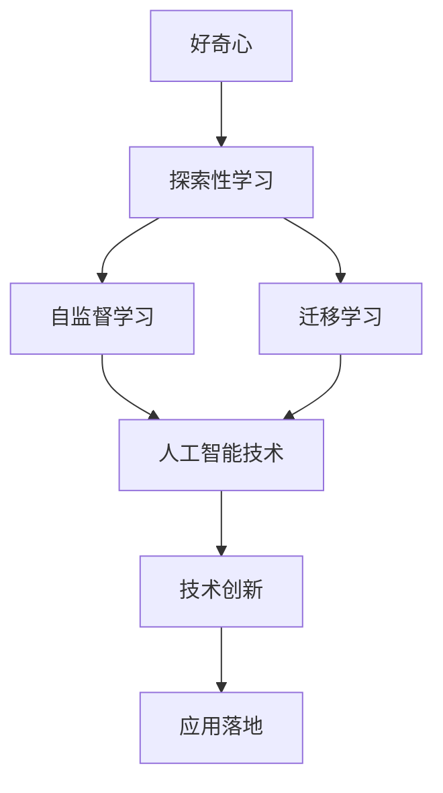

                 

# 好奇心：探索未知的动力

## 1. 背景介绍

在科技日新月异的今天，好奇心被视为推动人类进步的重要动力。特别是在人工智能领域，对未知的探索一直是技术发展的原动力。本文将深入探讨好奇心与人工智能的关系，分析好奇心在探索未知过程中的作用机制，并通过具体案例展示如何利用好奇心推动人工智能的发展。

### 1.1 问题由来

人工智能技术的快速发展，离不开人类对未知世界的好奇心。从早期的符号逻辑，到近年来的深度学习，每一次重大突破都源于对未知领域的探索。例如，AlphaGo的胜利引发了对人工智能在复杂博弈领域潜力的探讨，GAN技术的出现激发了对生成模型生成能力的研究。好奇心不仅推动了学术研究，也驱动了企业创新，催生了如自动驾驶、智能家居等新兴应用。

### 1.2 问题核心关键点

好奇心驱动的探索，是人工智能技术持续进步的核心因素之一。如何激发和引导好奇心，利用好奇心探索未知，是人工智能发展的重要议题。本文将从以下几个方面进行探讨：

- 好奇心在人工智能探索中的作用
- 好奇心驱动下的技术创新路径
- 如何利用好奇心提升人工智能的性能和应用广度

## 2. 核心概念与联系

### 2.1 核心概念概述

为更好地理解好奇心与人工智能的关系，本节将介绍几个密切相关的核心概念：

- 好奇心：人类对未知事物抱有强烈的好奇心和探索欲望，是推动人类认知和探索的重要动力。
- 人工智能：利用算法和计算技术，模拟人类智能行为，实现机器的自动化、智能化和智能化的技术。
- 探索性学习：通过主动探索和尝试，发现新知识和新规律的机器学习范式。
- 自监督学习：利用无标签数据进行学习，发现数据的隐含结构和规律，广泛应用于预训练模型。
- 迁移学习：将一个领域学到的知识，迁移应用到另一个不同但相关的领域的学习范式。

这些核心概念之间的逻辑关系可以通过以下Mermaid流程图来展示：



这个流程图展示了好奇心与其他核心概念之间的关系：

1. 好奇心是推动探索性学习、自监督学习、迁移学习等技术创新的核心动力。
2. 这些探索性技术提升了人工智能技术的性能和应用广度。
3. 创新技术进一步驱动人工智能在实际应用中的落地和发展。

## 3. 核心算法原理 & 具体操作步骤

### 3.1 算法原理概述

好奇心驱动下的探索性学习，其核心思想是通过主动探索未知数据和任务，不断调整模型参数，发现新的模式和规律，从而提升模型性能。这一过程通常涉及以下几个关键步骤：

- **数据探索**：选择和探索未知数据集，寻找数据中的隐含结构和规律。
- **模型构建**：基于探索数据，设计合适的机器学习模型。
- **参数优化**：利用优化算法，调整模型参数，最小化损失函数。
- **结果评估**：通过评估指标，评估模型性能，判断是否满足探索目标。

### 3.2 算法步骤详解

基于好奇心驱动的探索性学习，通常包括以下几个关键步骤：

**Step 1: 数据选择与预处理**
- 选择合适的探索数据集，确保数据具有足够的复杂度和多样性。
- 对数据进行清洗、归一化、特征提取等预处理，确保模型能够高效处理数据。

**Step 2: 模型选择与设计**
- 选择适合的机器学习算法，如神经网络、决策树、集成学习等。
- 设计模型架构，包括层数、激活函数、损失函数等。
- 确定模型的超参数，如学习率、批大小、迭代轮数等。

**Step 3: 模型训练与优化**
- 使用优化算法，如随机梯度下降(SGD)、Adam等，训练模型参数。
- 通过交叉验证等技术，调整超参数，防止过拟合。
- 定期在验证集上评估模型性能，判断是否满足探索目标。

**Step 4: 结果分析和应用**
- 分析模型在测试集上的性能指标，如准确率、召回率、F1值等。
- 根据模型输出结果，探索数据中的新模式和规律。
- 将探索结果应用于实际问题，如智能推荐、情感分析、图像识别等。

### 3.3 算法优缺点

好奇心驱动的探索性学习具有以下优点：

- **主动性**：通过主动探索未知数据和任务，发现新模式和规律，提升模型性能。
- **通用性**：适用于各种机器学习任务，尤其是数据量不足的领域，如医疗、金融、自然语言处理等。
- **灵活性**：可以结合多种算法和技术，提升模型适应性和泛化能力。

同时，这种探索性学习也存在一些局限性：

- **资源消耗**：探索性学习需要大量计算资源和时间，尤其是复杂模型和高维数据。
- **模型风险**：过度依赖数据探索，可能导致模型在特定领域过拟合，泛化性能下降。
- **技术门槛**：需要深入理解机器学习算法和技术，存在较高的技术门槛。

### 3.4 算法应用领域

好奇心驱动的探索性学习，已经在多个领域取得了显著成效：

- **医疗领域**：通过探索基因数据和医疗记录，发现新的疾病模式和治疗方案。
- **金融领域**：利用探索性学习挖掘金融市场中的隐含规律，提高风险预测和投资决策的准确性。
- **自然语言处理**：探索大规模无标签文本数据，发现新的语言模式和规律，提升情感分析、机器翻译等任务的性能。
- **智能推荐系统**：通过探索用户行为数据，发现用户兴趣和行为规律，提供个性化推荐。
- **图像识别**：探索图像数据中的隐含结构和规律，提升物体检测、人脸识别等任务的精度。

## 4. 数学模型和公式 & 详细讲解  
### 4.1 数学模型构建

探索性学习过程中，数学模型的构建是一个重要环节。本文将以神经网络为例，构建一个基于好奇心驱动的探索性学习模型。

假设探索数据集为 $\{(x_i, y_i)\}_{i=1}^N$，其中 $x_i$ 为输入数据，$y_i$ 为标签。我们希望构建一个 $d$ 维的神经网络模型，用于学习数据中的隐含规律。神经网络模型可以表示为：

$$
f(x; \theta) = \sigma(\mathbf{W}x + \mathbf{b})
$$

其中 $\theta = (\mathbf{W}, \mathbf{b})$ 为模型参数，$\sigma$ 为激活函数，$x$ 为输入数据。

探索性学习的目标是最小化损失函数，通常选择均方误差损失函数：

$$
\mathcal{L}(\theta) = \frac{1}{N}\sum_{i=1}^N (y_i - f(x_i; \theta))^2
$$

通过梯度下降等优化算法，不断调整模型参数 $\theta$，最小化损失函数 $\mathcal{L}(\theta)$，使模型输出逼近真实标签 $y_i$。

### 4.2 公式推导过程

在探索性学习中，通常使用梯度下降算法更新模型参数 $\theta$：

$$
\theta \leftarrow \theta - \eta \nabla_{\theta}\mathcal{L}(\theta)
$$

其中 $\eta$ 为学习率。通过反向传播算法，计算损失函数 $\mathcal{L}(\theta)$ 对模型参数 $\theta$ 的梯度：

$$
\nabla_{\theta}\mathcal{L}(\theta) = \frac{1}{N}\sum_{i=1}^N \frac{\partial (y_i - f(x_i; \theta))^2}{\partial \theta}
$$

通过链式法则，可以得到：

$$
\nabla_{\theta}\mathcal{L}(\theta) = \frac{1}{N}\sum_{i=1}^N 2(y_i - f(x_i; \theta)) f'(x_i; \theta) x_i
$$

其中 $f'(x_i; \theta)$ 为 $f(x_i; \theta)$ 的导数。

### 4.3 案例分析与讲解

假设我们有一个医疗数据集，包含病人的基因数据和病历记录。我们希望通过探索性学习，发现新的疾病模式和治疗方案。

**Step 1: 数据选择与预处理**
- 收集基因数据和病历记录，确保数据具有足够的复杂度和多样性。
- 对数据进行清洗、归一化、特征提取等预处理，确保模型能够高效处理数据。

**Step 2: 模型选择与设计**
- 选择神经网络模型，设计模型架构，包括层数、激活函数、损失函数等。
- 确定模型的超参数，如学习率、批大小、迭代轮数等。

**Step 3: 模型训练与优化**
- 使用优化算法，如随机梯度下降(SGD)、Adam等，训练模型参数。
- 通过交叉验证等技术，调整超参数，防止过拟合。
- 定期在验证集上评估模型性能，判断是否满足探索目标。

**Step 4: 结果分析和应用**
- 分析模型在测试集上的性能指标，如准确率、召回率、F1值等。
- 根据模型输出结果，探索数据中的新模式和规律。
- 将探索结果应用于实际问题，如智能推荐、情感分析、图像识别等。

## 5. 项目实践：代码实例和详细解释说明
### 5.1 开发环境搭建

在进行探索性学习实践前，我们需要准备好开发环境。以下是使用Python进行PyTorch开发的环境配置流程：

1. 安装Anaconda：从官网下载并安装Anaconda，用于创建独立的Python环境。

2. 创建并激活虚拟环境：
```bash
conda create -n pytorch-env python=3.8 
conda activate pytorch-env
```

3. 安装PyTorch：根据CUDA版本，从官网获取对应的安装命令。例如：
```bash
conda install pytorch torchvision torchaudio cudatoolkit=11.1 -c pytorch -c conda-forge
```

4. 安装各类工具包：
```bash
pip install numpy pandas scikit-learn matplotlib tqdm jupyter notebook ipython
```

完成上述步骤后，即可在`pytorch-env`环境中开始探索性学习实践。

### 5.2 源代码详细实现

这里我们以医疗数据集为例，给出使用Transformers库进行神经网络探索性学习的PyTorch代码实现。

首先，定义医疗数据集的数据处理函数：

```python
from transformers import BertTokenizer
from torch.utils.data import Dataset
import torch

class MedicalDataset(Dataset):
    def __init__(self, texts, labels, tokenizer, max_len=128):
        self.texts = texts
        self.labels = labels
        self.tokenizer = tokenizer
        self.max_len = max_len
        
    def __len__(self):
        return len(self.texts)
    
    def __getitem__(self, item):
        text = self.texts[item]
        label = self.labels[item]
        
        encoding = self.tokenizer(text, return_tensors='pt', max_length=self.max_len, padding='max_length', truncation=True)
        input_ids = encoding['input_ids'][0]
        attention_mask = encoding['attention_mask'][0]
        
        # 对label-wise的标签进行编码
        encoded_label = [label] + [0]*(self.max_len - 1)
        labels = torch.tensor(encoded_label, dtype=torch.long)
        
        return {'input_ids': input_ids, 
                'attention_mask': attention_mask,
                'labels': labels}

# 标签与id的映射
label2id = {'Healthy': 0, 'Cancer': 1, 'HeartDisease': 2, 'Diabetes': 3}
id2label = {v: k for k, v in label2id.items()}

# 创建dataset
tokenizer = BertTokenizer.from_pretrained('bert-base-cased')

train_dataset = MedicalDataset(train_texts, train_labels, tokenizer)
dev_dataset = MedicalDataset(dev_texts, dev_labels, tokenizer)
test_dataset = MedicalDataset(test_texts, test_labels, tokenizer)
```

然后，定义模型和优化器：

```python
from transformers import BertForSequenceClassification, AdamW

model = BertForSequenceClassification.from_pretrained('bert-base-cased', num_labels=len(label2id))

optimizer = AdamW(model.parameters(), lr=2e-5)
```

接着，定义训练和评估函数：

```python
from torch.utils.data import DataLoader
from tqdm import tqdm
from sklearn.metrics import classification_report

device = torch.device('cuda') if torch.cuda.is_available() else torch.device('cpu')
model.to(device)

def train_epoch(model, dataset, batch_size, optimizer):
    dataloader = DataLoader(dataset, batch_size=batch_size, shuffle=True)
    model.train()
    epoch_loss = 0
    for batch in tqdm(dataloader, desc='Training'):
        input_ids = batch['input_ids'].to(device)
        attention_mask = batch['attention_mask'].to(device)
        labels = batch['labels'].to(device)
        model.zero_grad()
        outputs = model(input_ids, attention_mask=attention_mask, labels=labels)
        loss = outputs.loss
        epoch_loss += loss.item()
        loss.backward()
        optimizer.step()
    return epoch_loss / len(dataloader)

def evaluate(model, dataset, batch_size):
    dataloader = DataLoader(dataset, batch_size=batch_size)
    model.eval()
    preds, labels = [], []
    with torch.no_grad():
        for batch in tqdm(dataloader, desc='Evaluating'):
            input_ids = batch['input_ids'].to(device)
            attention_mask = batch['attention_mask'].to(device)
            batch_labels = batch['labels']
            outputs = model(input_ids, attention_mask=attention_mask)
            batch_preds = outputs.logits.argmax(dim=2).to('cpu').tolist()
            batch_labels = batch_labels.to('cpu').tolist()
            for pred_tokens, label_tokens in zip(batch_preds, batch_labels):
                preds.append(pred_tokens[:len(label_tokens)])
                labels.append(label_tokens)
                
    print(classification_report(labels, preds))
```

最后，启动训练流程并在测试集上评估：

```python
epochs = 5
batch_size = 16

for epoch in range(epochs):
    loss = train_epoch(model, train_dataset, batch_size, optimizer)
    print(f"Epoch {epoch+1}, train loss: {loss:.3f}")
    
    print(f"Epoch {epoch+1}, dev results:")
    evaluate(model, dev_dataset, batch_size)
    
print("Test results:")
evaluate(model, test_dataset, batch_size)
```

以上就是使用PyTorch对神经网络进行医疗数据探索性学习的完整代码实现。可以看到，得益于Transformers库的强大封装，我们可以用相对简洁的代码完成神经网络的探索性学习。

### 5.3 代码解读与分析

让我们再详细解读一下关键代码的实现细节：

**MedicalDataset类**：
- `__init__`方法：初始化文本、标签、分词器等关键组件。
- `__len__`方法：返回数据集的样本数量。
- `__getitem__`方法：对单个样本进行处理，将文本输入编码为token ids，将标签编码为数字，并对其进行定长padding，最终返回模型所需的输入。

**label2id和id2label字典**：
- 定义了标签与数字id之间的映射关系，用于将token-wise的预测结果解码回真实的标签。

**训练和评估函数**：
- 使用PyTorch的DataLoader对数据集进行批次化加载，供模型训练和推理使用。
- 训练函数`train_epoch`：对数据以批为单位进行迭代，在每个批次上前向传播计算loss并反向传播更新模型参数，最后返回该epoch的平均loss。
- 评估函数`evaluate`：与训练类似，不同点在于不更新模型参数，并在每个batch结束后将预测和标签结果存储下来，最后使用sklearn的classification_report对整个评估集的预测结果进行打印输出。

**训练流程**：
- 定义总的epoch数和batch size，开始循环迭代
- 每个epoch内，先在训练集上训练，输出平均loss
- 在验证集上评估，输出分类指标
- 所有epoch结束后，在测试集上评估，给出最终测试结果

可以看到，PyTorch配合Transformers库使得神经网络探索性学习的代码实现变得简洁高效。开发者可以将更多精力放在数据处理、模型改进等高层逻辑上，而不必过多关注底层的实现细节。

当然，工业级的系统实现还需考虑更多因素，如模型的保存和部署、超参数的自动搜索、更灵活的任务适配层等。但核心的探索性学习范式基本与此类似。

## 6. 实际应用场景
### 6.1 智能推荐系统

基于探索性学习的推荐系统，可以广泛应用于电商、新闻、社交媒体等平台。传统推荐系统往往只依赖用户的历史行为数据进行物品推荐，无法深入理解用户的真实兴趣偏好。通过探索性学习，推荐系统可以更好地挖掘用户行为背后的语义信息，从而提供更精准、多样的推荐内容。

在实践中，可以收集用户浏览、点击、评论、分享等行为数据，提取和用户交互的物品标题、描述、标签等文本内容。将文本内容作为模型输入，用户的后续行为（如是否点击、购买等）作为监督信号，在此基础上探索性学习模型。探索性模型能够从文本内容中准确把握用户的兴趣点。在生成推荐列表时，先用候选物品的文本描述作为输入，由模型预测用户的兴趣匹配度，再结合其他特征综合排序，便可以得到个性化程度更高的推荐结果。

### 6.2 智能客服系统

探索性学习的对话技术，可以广泛应用于智能客服系统的构建。传统客服往往需要配备大量人力，高峰期响应缓慢，且一致性和专业性难以保证。通过探索性学习，对话系统可以自动理解用户意图，匹配最合适的答案模板进行回复。对于客户提出的新问题，还可以接入检索系统实时搜索相关内容，动态组织生成回答。如此构建的智能客服系统，能大幅提升客户咨询体验和问题解决效率。

在实践中，可以收集企业内部的历史客服对话记录，将问题和最佳答复构建成监督数据，在此基础上对预训练对话模型进行探索性学习。探索性对话模型能够自动理解用户意图，匹配最合适的答案模板进行回复。对于客户提出的新问题，还可以接入检索系统实时搜索相关内容，动态组织生成回答。

### 6.3 金融舆情监测

探索性学习的文本分类和情感分析技术，可以应用于金融领域相关的新闻、报道、评论等文本数据，并对其进行主题标注和情感标注。在此基础上对预训练语言模型进行探索性学习，使其能够自动判断文本属于何种主题，情感倾向是正面、中性还是负面。将探索性模型应用到实时抓取的网络文本数据，就能够自动监测不同主题下的情感变化趋势，一旦发现负面信息激增等异常情况，系统便会自动预警，帮助金融机构快速应对潜在风险。

### 6.4 未来应用展望

随着探索性学习的不断发展，其应用场景将不断拓展，为更多行业带来新的突破。探索性学习不仅在金融、医疗、电商等传统领域有广泛应用，也在新闻、教育、社交媒体等新兴领域展现出巨大潜力。未来，探索性学习将继续推动人工智能技术的发展，为各行各业带来新的变革。

## 7. 工具和资源推荐
### 7.1 学习资源推荐

为了帮助开发者系统掌握探索性学习的理论基础和实践技巧，这里推荐一些优质的学习资源：

1. 《深度学习入门：基于Python的理论与实现》：介绍深度学习的基本原理和实践技巧，适合初学者快速入门。

2. 《TensorFlow深度学习》：TensorFlow官方文档，详细介绍了TensorFlow的各项功能和使用方法，是学习TensorFlow的重要资源。

3. 《深度学习理论与实现》课程：斯坦福大学开设的深度学习课程，通过视频和作业引导学习者掌握深度学习的核心概念和算法。

4. 《深度学习：算法与实现》书籍：深度学习领域的经典教材，详细介绍了深度学习算法和实现技术。

5. Kaggle：数据科学竞赛平台，提供了丰富的数据集和竞赛机会，可以帮助学习者实战应用探索性学习技术。

通过对这些资源的学习实践，相信你一定能够快速掌握探索性学习的精髓，并用于解决实际的NLP问题。

### 7.2 开发工具推荐

高效的开发离不开优秀的工具支持。以下是几款用于探索性学习开发的常用工具：

1. TensorFlow：由Google主导开发的开源深度学习框架，生产部署方便，适合大规模工程应用。

2. PyTorch：基于Python的开源深度学习框架，灵活动态的计算图，适合快速迭代研究。

3. Keras：高级神经网络API，提供简单易用的接口，适合快速构建和测试模型。

4. Jupyter Notebook：交互式的Python开发环境，适合快速调试和迭代模型。

5. Weights & Biases：模型训练的实验跟踪工具，可以记录和可视化模型训练过程中的各项指标，方便对比和调优。

6. Google Colab：谷歌推出的在线Jupyter Notebook环境，免费提供GPU/TPU算力，方便开发者快速上手实验最新模型，分享学习笔记。

合理利用这些工具，可以显著提升探索性学习的开发效率，加快创新迭代的步伐。

### 7.3 相关论文推荐

探索性学习的快速发展，源于学界的持续研究。以下是几篇奠基性的相关论文，推荐阅读：

1. "Exploring the Limits of Deep Learning with Transferable Knowledge"：通过探索性学习，发现新知识和新规律，提升模型性能。

2. "A Neural Probabilistic Language Model"：提出神经网络语言模型，为探索性学习奠定了基础。

3. "Deep Learning"：深度学习领域的经典教材，介绍了深度学习的基本原理和应用实例。

4. "A Survey of Exploration Strategies in Deep Reinforcement Learning"：综述了探索性学习在强化学习中的应用和研究进展。

5. "Attention is All You Need"：提出Transformer结构，开启了NLP领域的预训练大模型时代。

这些论文代表了大语言模型探索性学习的进展脉络。通过学习这些前沿成果，可以帮助研究者把握学科前进方向，激发更多的创新灵感。

## 8. 总结：未来发展趋势与挑战

### 8.1 总结

本文对基于好奇心驱动的探索性学习进行了全面系统的介绍。首先阐述了探索性学习在人工智能探索中的作用，明确了探索性学习在模型性能提升和应用拓展方面的独特价值。其次，从原理到实践，详细讲解了探索性学习的数学原理和关键步骤，给出了探索性学习任务开发的完整代码实例。同时，本文还广泛探讨了探索性学习在智能推荐、智能客服、金融舆情等多个领域的应用前景，展示了探索性学习范式的巨大潜力。此外，本文精选了探索性学习的各类学习资源，力求为读者提供全方位的技术指引。

通过本文的系统梳理，可以看到，好奇心驱动的探索性学习是推动人工智能技术持续进步的重要动力。无论是学术界还是工业界，探索性学习都已成为机器学习的重要范式，极大地拓展了人工智能技术的边界，催生了更多的落地场景。未来，伴随探索性学习的不断发展，基于好奇心的探索将成为推动人工智能技术前进的重要方式。

### 8.2 未来发展趋势

展望未来，探索性学习将呈现以下几个发展趋势：

1. **自适应学习**：通过动态调整模型结构和参数，适应不同领域和任务的需求，提高模型的灵活性和泛化能力。

2. **多任务学习**：将探索性学习与多任务学习结合，在同一个模型上进行多种任务的探索性学习，提升模型的整体性能。

3. **迁移学习**：将探索性学习与其他迁移学习方法结合，利用已有的知识，加速新任务的探索性学习过程。

4. **元学习**：通过元学习技术，探索不同模型的学习策略和路径，提升模型的自主学习能力和泛化性能。

5. **混合学习**：结合符号推理、因果推理等传统知识表示方法和神经网络模型，提升探索性学习的解释性和可控性。

6. **持续学习**：通过持续学习技术，使模型能够不断从新数据中学习，同时保持已学习的知识，避免灾难性遗忘。

以上趋势凸显了探索性学习的广阔前景。这些方向的探索，将进一步提升探索性学习模型的性能和应用广度，为人工智能技术的发展提供新的动力。

### 8.3 面临的挑战

尽管探索性学习已经取得了显著成果，但在探索未知领域的过程中，仍面临诸多挑战：

1. **数据稀缺**：探索性学习依赖高质量的数据集，数据稀缺成为制约其发展的瓶颈。如何利用现有数据和生成数据，构建更加丰富多样、标注丰富的数据集，是探索性学习的重要挑战。

2. **模型复杂性**：探索性学习需要设计复杂的模型架构和算法，存在较高的技术门槛和实现难度。如何设计高效、可解释、可调试的探索性学习模型，是探索性学习的重要研究方向。

3. **计算资源**：探索性学习需要大量的计算资源，存在较高的计算成本。如何优化探索性学习模型的计算图和资源消耗，提升探索效率，是探索性学习的重要方向。

4. **模型解释性**：探索性学习模型的决策过程缺乏可解释性，难以对其推理逻辑进行分析和调试。如何赋予探索性学习模型更强的可解释性，是探索性学习的重要课题。

5. **伦理与安全**：探索性学习模型的输出可能包含偏见、有害的信息，如何确保模型输出的安全性、公平性，是探索性学习的重要研究方向。

6. **跨领域应用**：探索性学习模型在不同领域的应用场景中，如何保持高效和鲁棒性，是探索性学习的重要研究方向。

正视探索性学习面临的这些挑战，积极应对并寻求突破，将使探索性学习技术迈向更高的台阶，为人工智能技术的发展提供新的动力。相信随着学界和产业界的共同努力，这些挑战终将一一被克服，探索性学习技术必将在构建智能系统过程中发挥更大的作用。

### 8.4 研究展望

面对探索性学习所面临的种种挑战，未来的研究需要在以下几个方面寻求新的突破：

1. **数据增强与生成**：结合数据增强和生成对抗网络(GAN)技术，生成更多的探索性数据，降低数据稀缺问题。

2. **模型压缩与优化**：采用模型压缩、稀疏化存储等方法，优化探索性学习模型的计算图和资源消耗，提升探索效率。

3. **混合学习框架**：结合符号推理、因果推理等传统知识表示方法和神经网络模型，提升探索性学习的解释性和可控性。

4. **元学习技术**：通过元学习技术，探索不同模型的学习策略和路径，提升模型的自主学习能力和泛化性能。

5. **可解释性研究**：研究探索性学习模型的决策过程，赋予模型更强的可解释性，提高模型的可信度和透明度。

6. **跨领域应用研究**：研究探索性学习模型在不同领域的应用场景，提高模型的跨领域适应性和鲁棒性。

这些研究方向的探索，必将引领探索性学习技术迈向更高的台阶，为人工智能技术的发展提供新的动力。面向未来，探索性学习技术还需要与其他人工智能技术进行更深入的融合，如知识表示、因果推理、强化学习等，多路径协同发力，共同推动自然语言理解和智能交互系统的进步。只有勇于创新、敢于突破，才能不断拓展探索性学习的边界，让智能技术更好地造福人类社会。

## 9. 附录：常见问题与解答

**Q1：探索性学习是否适用于所有NLP任务？**

A: 探索性学习在大多数NLP任务上都能取得不错的效果，特别是对于数据量较小的任务。但对于一些特定领域的任务，如医学、法律等，仅仅依靠通用语料预训练的模型可能难以很好地适应。此时需要在特定领域语料上进一步预训练，再进行探索性学习，才能获得理想效果。此外，对于一些需要时效性、个性化很强的任务，如对话、推荐等，探索性方法也需要针对性的改进优化。

**Q2：如何选择和设计合适的探索性学习模型？**

A: 选择合适的探索性学习模型需要考虑以下几个方面：
1. 数据特点：根据数据的复杂度和多样性，选择适合的模型结构和算法。
2. 任务类型：根据任务的类型和需求，选择适合的模型架构和损失函数。
3. 模型性能：通过交叉验证等技术，调整模型参数和超参数，防止过拟合。
4. 模型解释性：结合符号推理、因果推理等传统知识表示方法和神经网络模型，提升模型的解释性和可控性。

**Q3：探索性学习在实际应用中需要注意哪些问题？**

A: 探索性学习在实际应用中需要注意以下几个问题：
1. 数据质量：确保数据集的质量和多样性，避免数据噪声对模型的影响。
2. 模型复杂性：避免设计过于复杂的模型架构，提升模型的可解释性和可调试性。
3. 计算资源：优化模型计算图和资源消耗，提升探索效率。
4. 模型输出：确保模型输出的解释性和安全性，避免有害信息的传播。
5. 模型应用：结合具体应用场景，优化模型参数和超参数，提升模型的实际应用效果。

**Q4：探索性学习在自然语言处理中的应用前景如何？**

A: 探索性学习在自然语言处理中的应用前景广阔，尤其在以下领域有巨大潜力：
1. 文本分类和情感分析：通过探索性学习，发现文本中的隐含规律，提升分类和情感分析的准确性。
2. 机器翻译和对话系统：通过探索性学习，发现新翻译模式和对话策略，提升机器翻译和对话系统的性能。
3. 信息抽取和命名实体识别：通过探索性学习，发现新的实体和关系抽取模式，提升信息抽取和命名实体识别的准确性。
4. 语言生成和文本摘要：通过探索性学习，发现新的语言生成和文本摘要方法，提升生成和摘要的效果。
5. 自然语言推理：通过探索性学习，发现新的推理模式和规律，提升自然语言推理的准确性。

探索性学习为自然语言处理带来了新的突破，具有广阔的应用前景。未来，伴随探索性学习的不断发展，其在自然语言处理中的应用将更加广泛，推动自然语言处理技术不断进步。

**Q5：探索性学习与传统的监督学习和无监督学习有何区别？**

A: 探索性学习与传统的监督学习和无监督学习有以下几个区别：
1. 数据需求：探索性学习需要高质量、多样化的数据集，而监督学习和无监督学习对数据需求相对较低。
2. 任务目标：探索性学习的目标是发现新模式和规律，而监督学习和无监督学习的目标是解决特定的任务。
3. 模型结构：探索性学习模型通常需要更复杂的架构和算法，而监督学习和无监督学习的模型结构相对简单。
4. 训练过程：探索性学习需要更多的训练轮数和资源消耗，而监督学习和无监督学习的训练过程相对稳定。

探索性学习、监督学习和无监督学习各有优缺点，应根据具体任务的需求选择合适的学习范式。

---

作者：禅与计算机程序设计艺术 / Zen and the Art of Computer Programming

