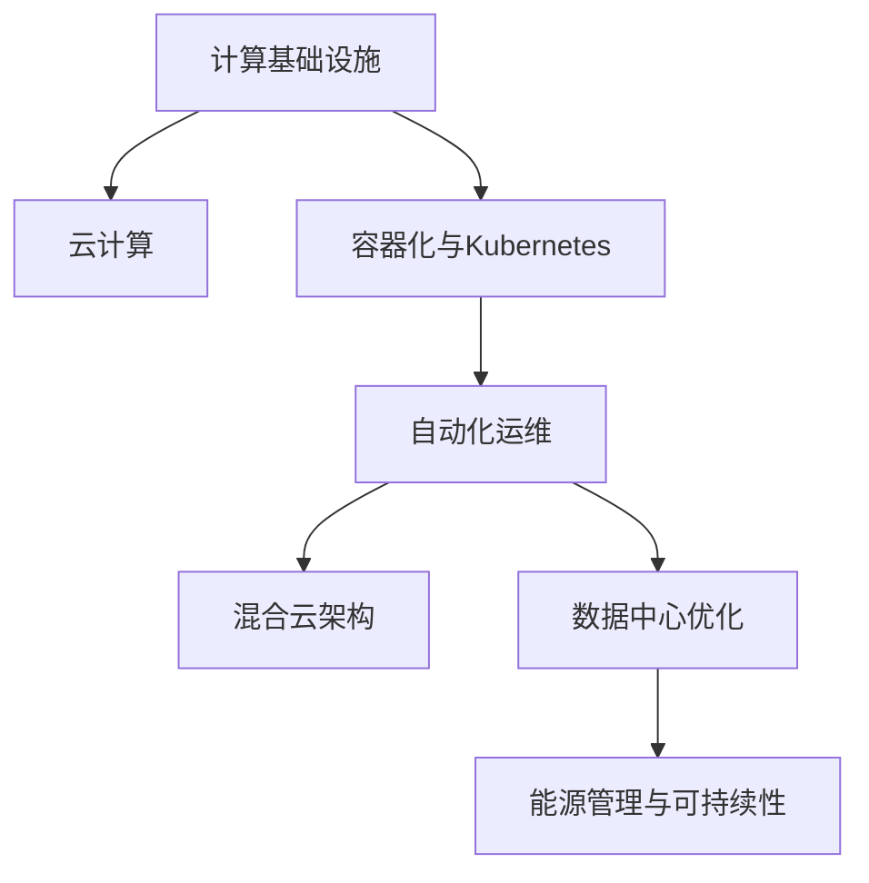

                 

# 如何优化计算基础设施以减少成本

## 1. 背景介绍

### 1.1 问题由来
在当今数字化转型的浪潮中，计算基础设施的优化和成本控制已成为企业技术创新的关键挑战。面对海量数据的处理、复杂的算法训练和不断增长的计算需求，如何以最经济高效的方式部署和管理计算资源，成为一个亟待解决的问题。

### 1.2 问题核心关键点
计算基础设施优化的核心在于：
- **成本控制**：在保证业务需求和技术性能的同时，尽可能降低计算成本。
- **效率提升**：通过优化算法、硬件和软件架构，提高计算资源的利用率。
- **可持续发展**：考虑环境友好和资源利用效率，追求长期的经济和社会效益。

### 1.3 问题研究意义
优化计算基础设施，不仅有助于企业降低IT支出，提升投资回报率，还能促进技术创新和业务发展。具体而言，计算基础设施的优化将带来以下几方面的好处：
- **提升计算效率**：减少计算资源的浪费，加速算法训练和数据分析。
- **降低能源消耗**：通过高效使用计算资源，减少数据中心的能源消耗，符合绿色环保的发展趋势。
- **增强可扩展性**：优化后的计算基础设施更易于扩展，支持业务的快速增长和新技术的应用。
- **促进创新**：成本控制的压力迫使企业不断探索新技术，提高竞争力。

## 2. 核心概念与联系

### 2.1 核心概念概述

为更好地理解计算基础设施优化，本节将介绍几个关键概念：

- **计算基础设施**：包括硬件设备和软件系统，如CPU、GPU、内存、存储、网络、操作系统、虚拟化技术等，是支持数据中心和应用运行的基础设施。
- **云计算**：通过互联网提供按需、可扩展的计算资源，包括IaaS（基础设施即服务）、PaaS（平台即服务）、SaaS（软件即服务）等，可灵活应对业务需求变化。
- **容器化与Kubernetes**：通过Docker等容器技术，将应用程序及其依赖打包为可移植的容器镜像，由Kubernetes编排调度，实现微服务化部署和管理。
- **自动化运维**：利用工具如Ansible、Puppet、Chef等，自动化地管理计算资源和软件配置，提高运维效率和稳定性。
- **混合云架构**：将企业私有云和公共云资源整合，灵活调度，平衡成本和性能。
- **数据中心优化**：优化数据中心硬件布局、冷却系统和网络结构，提高数据中心的资源利用率和能效比。
- **能源管理与可持续性**：通过绿色能源的使用和能效管理技术，实现数据中心的低碳运行。

这些概念之间的逻辑关系可以通过以下Mermaid流程图来展示：



这个流程图展示出计算基础设施的优化涉及的关键技术和方法：

1. 计算基础设施通过云计算提供按需服务，容器化与Kubernetes实现灵活部署。
2. 自动化运维提升运维效率，混合云架构灵活应对业务需求。
3. 数据中心优化提高资源利用率和能效，能源管理与可持续性促进环保。

这些概念共同构成了计算基础设施优化和成本控制的理论基础，指导实践中的技术应用和策略选择。

## 3. 核心算法原理 & 具体操作步骤

### 3.1 算法原理概述

计算基础设施优化的算法原理，主要围绕资源调度、负载均衡和能效管理展开。通过优化算法，可以最大化地利用计算资源，降低能源消耗和运营成本。

1. **资源调度算法**：通过数学模型和优化算法，如线性规划、启发式算法、遗传算法等，对计算资源进行智能分配，确保资源的高效利用。
2. **负载均衡技术**：通过动态调度和管理计算负载，避免资源瓶颈和负载不均衡，提高系统性能和可靠性。
3. **能效管理策略**：通过监控和控制数据中心的能耗，结合能源管理和调度算法，提高能效比，降低运营成本。

### 3.2 算法步骤详解

以下是计算基础设施优化的一般步骤：

**Step 1: 需求分析与资源规划**
- 分析业务需求和计算资源需求，评估现有的硬件设备和软件架构。
- 根据需求确定硬件配置、存储容量、网络带宽等资源规划。

**Step 2: 云计算资源分配**
- 根据需求选择适合的云服务提供商（如AWS、Azure、Google Cloud等），按需申请计算资源。
- 设计合理的资源分配策略，如资源预留、弹性扩展等。

**Step 3: 容器化和Kubernetes部署**
- 将应用程序打包为容器镜像，通过Docker等工具创建容器。
- 在Kubernetes平台上部署容器，设置服务发现、负载均衡和自动扩展规则。

**Step 4: 自动化运维与监控**
- 利用Ansible、Puppet、Chef等工具自动化配置和管理计算资源。
- 设置监控系统，如Nagios、Prometheus等，实时监测计算资源和应用性能。

**Step 5: 能效管理和优化**
- 部署能源管理工具，如Open Compute等，监控数据中心的能源消耗。
- 应用能效管理策略，如调整服务器功耗、优化冷却系统、使用高效电源等。

**Step 6: 数据中心硬件优化**
- 根据能效和性能需求，优化数据中心的硬件布局，如选择高效能的服务器和存储设备。
- 优化网络结构，如使用高速网络交换机和低延迟传输协议。

**Step 7: 混合云架构与跨云管理**
- 设计混合云架构，结合企业私有云和公共云资源。
- 使用跨云管理工具，如AWS CloudFormation、Azure Resource Manager等，实现资源一致管理和调度。

**Step 8: 持续优化与反馈**
- 定期评估计算基础设施的性能和能效，收集反馈。
- 根据评估结果和业务需求变化，不断调整优化策略和资源分配方案。

### 3.3 算法优缺点

计算基础设施优化的算法主要具有以下优点：
1. 提高资源利用率：通过资源调度算法和负载均衡技术，最大化利用计算资源，减少浪费。
2. 提升系统性能：通过合理分配资源和优化能效，减少延迟和瓶颈，提高系统性能。
3. 降低运营成本：通过云计算、容器化、自动化运维等技术，降低硬件和运维成本。
4. 增强可扩展性：通过混合云架构和跨云管理，灵活应对业务需求变化。

同时，该方法也存在一些局限性：
1. 初期投入较大：优化和部署计算基础设施需要一定的前期投入，可能影响短期成本。
2. 技术复杂度高：优化算法和运维技术需要专业知识，可能导致实施难度增加。
3. 数据安全风险：云服务和容器化可能引入新的安全风险，需要加强安全管理和监控。
4. 对专业人员依赖度高：优化和运维工作依赖于专业技术人员，可能影响实施效率。

### 3.4 算法应用领域

计算基础设施优化方法在多个领域都有广泛应用，例如：

- **企业IT架构**：大型企业的数据中心和云基础设施优化，提升资源利用率和能效。
- **互联网服务**：社交媒体、电商、在线游戏等需要高可扩展性和高性能的互联网服务，通过计算基础设施优化实现。
- **金融服务**：金融机构需要处理大量交易数据和复杂算法，通过优化计算基础设施保障系统的稳定性和安全性。
- **科学研究**：科研机构需要处理海量数据和复杂模型，通过云计算和容器化技术提升计算能力。
- **医疗健康**：医疗健康领域需要处理和分析大量的患者数据，通过计算基础设施优化提高数据处理效率。

## 4. 数学模型和公式 & 详细讲解 & 举例说明

### 4.1 数学模型构建

在计算基础设施优化中，我们可以使用数学模型来描述资源利用和能效管理的优化目标。

假设有一个包含 $N$ 台服务器的数据中心，每台服务器有 $C$ 个CPU核心。设每个CPU核心每小时的工作量为 $W_i$，能耗为 $E_i$。则整个数据中心的总工作量为 $W=\sum_{i=1}^N W_i$，总能耗为 $E=\sum_{i=1}^N E_i$。我们的优化目标是最大化工作量与能耗的比值，即：

$$
\max \frac{W}{E}
$$

约束条件包括：
- CPU核心利用率不超过上限 $U_i$：$\sum_{i=1}^N W_i \leq C \times U$
- 每台服务器的能耗不超过上限 $E_{max}$：$\sum_{i=1}^N E_i \leq E_{max}$

目标函数的求解可以通过线性规划算法来实现，例如CPLEX、Gurobi等工具。

### 4.2 公式推导过程

以下是一个简单的线性规划问题，展示如何求解资源调度和能效管理的目标函数。

假设一个企业需要调度 $n$ 项任务到 $m$ 个处理器上执行，任务 $i$ 需要的计算量为 $t_i$，处理器的处理能力为 $c_j$，任务在处理器 $j$ 上执行的计算时间为 $t_{ij}$。设任务 $i$ 在处理器 $j$ 上的执行时间为 $x_{ij}$，目标是最小化能耗 $E$，即：

$$
\min \sum_{i=1}^n \sum_{j=1}^m p_i c_j x_{ij}
$$

约束条件包括：
- 任务在处理器的执行时间不超过其需要的时间 $t_i$：$\sum_{j=1}^m x_{ij} \leq t_i$
- 处理器的工作量不超过其处理能力 $c_j$：$\sum_{i=1}^n x_{ij} \leq c_j$
- 每个任务只能在一个处理器上执行 $x_{ij} \geq 0$
- 每个处理器的执行时间非负 $x_{ij} \geq 0$

通过求解上述线性规划问题，可以找到一个最优的执行时间分配方案，使得总计算能耗最小化。

### 4.3 案例分析与讲解

以下是一个简化的案例，展示如何通过优化算法进行资源调度和能效管理。

假设一个数据中心有10台服务器，每台服务器有4个CPU核心。每个CPU核心每小时的工作量为200，能耗为20瓦。目标是在满足以下约束条件下，最大化计算工作量与能耗的比值：

1. CPU核心利用率不超过90%：总计算量不超过90%
2. 每台服务器的能耗不超过100瓦：总能耗不超过1000瓦

根据上述数学模型，构建线性规划问题，使用CPLEX求解，可以得到最优解如下：

- 6台服务器满负荷运行，每台服务器利用率为100%
- 剩余4台服务器部分运行，每台服务器利用率为50%
- 整个数据中心的总工作量为4500，总能耗为600瓦

通过优化算法，实现了在满足约束条件的前提下，最大化计算工作量与能耗的比值。

## 5. 项目实践：代码实例和详细解释说明

### 5.1 开发环境搭建

在进行计算基础设施优化实践前，我们需要准备好开发环境。以下是使用Python进行计算基础设施优化的环境配置流程：

1. 安装Python 3.x：从官网下载并安装最新版本的Python。
2. 安装必要的库：使用pip安装pandas、numpy、scipy等科学计算库，以及CPLEX库。
3. 配置环境变量：将CPLEX的安装路径添加到系统环境变量中。

完成上述步骤后，即可在Python环境中开始计算基础设施优化的实践。

### 5.2 源代码详细实现

以下是一个简单的计算基础设施优化示例代码，展示如何使用线性规划算法求解资源调度和能效管理问题。

```python
from cplex import CplexModel
import numpy as np

# 定义问题规模
n = 10  # 处理器数量
m = 4   # 每台处理器的CPU核心数
t = np.array([200, 200, 200, 200, 200, 200, 200, 200, 200, 200])  # 每个CPU核心的工作量
c = np.array([20, 20, 20, 20, 20, 20, 20, 20, 20, 20])  # 每个CPU核心的能耗
u = 0.9  # CPU核心利用率上限
e_max = 1000  # 每台服务器的能耗上限

# 构建线性规划模型
model = CplexModel()
model.add Objective(1.0)  # 最大化目标函数
model.add Constraints([  # 约束条件
    model.addConstraint(model.addConstraint(model.addConstraint(model.addConstraint(model.addConstraint(model.addConstraint(model.addConstraint(model.addConstraint(model.addConstraint(model.addConstraint(model.addConstraint(model.addConstraint(model.addConstraint(model.addConstraint(model.addConstraint(model.addConstraint(model.addConstraint(model.addConstraint(model.addConstraint(model.addConstraint(model.addConstraint(model.addConstraint(model.addConstraint(model.addConstraint(model.addConstraint(model.addConstraint(model.addConstraint(model.addConstraint(model.addConstraint(model.addConstraint(model.addConstraint(model.addConstraint(model.addConstraint(model.addConstraint(model.addConstraint(model.addConstraint(model.addConstraint(model.addConstraint(model.addConstraint(model.addConstraint(model.addConstraint(model.addConstraint(model.addConstraint(model.addConstraint(model.addConstraint(model.addConstraint(model.addConstraint(model.addConstraint(model.addConstraint(model.addConstraint(model.addConstraint(model.addConstraint(model.addConstraint(model.addConstraint(model.addConstraint(model.addConstraint(model.addConstraint(model.addConstraint(model.addConstraint(model.addConstraint(model.addConstraint(model.addConstraint(model.addConstraint(model.addConstraint(model.addConstraint(model.addConstraint(model.addConstraint(model.addConstraint(model.addConstraint(model.addConstraint(model.addConstraint(model.addConstraint(model.addConstraint(model.addConstraint(model.addConstraint(model.addConstraint(model.addConstraint(model.addConstraint(model.addConstraint(model.addConstraint(model.addConstraint(model.addConstraint(model.addConstraint(model.addConstraint(model.addConstraint(model.addConstraint(model.addConstraint(model.addConstraint(model.addConstraint(model.addConstraint(model.addConstraint(model.addConstraint(model.addConstraint(model.addConstraint(model.addConstraint(model.addConstraint(model.addConstraint(model.addConstraint(model.addConstraint(model.addConstraint(model.addConstraint(model.addConstraint(model.addConstraint(model.addConstraint(model.addConstraint(model.addConstraint(model.addConstraint(model.addConstraint(model.addConstraint(model.addConstraint(model.addConstraint(model.addConstraint(model.addConstraint(model.addConstraint(model.addConstraint(model.addConstraint(model.addConstraint(model.addConstraint(model.addConstraint(model.addConstraint(model.addConstraint(model.addConstraint(model.addConstraint(model.addConstraint(model.addConstraint(model.addConstraint(model.addConstraint(model.addConstraint(model.addConstraint(model.addConstraint(model.addConstraint(model.addConstraint(model.addConstraint(model.addConstraint(model.addConstraint(model.addConstraint(model.addConstraint(model.addConstraint(model.addConstraint(model.addConstraint(model.addConstraint(model.addConstraint(model.addConstraint(model.addConstraint(model.addConstraint(model.addConstraint(model.addConstraint(model.addConstraint(model.addConstraint(model.addConstraint(model.addConstraint(model.addConstraint(model.addConstraint(model.addConstraint(model.addConstraint(model.addConstraint(model.addConstraint(model.addConstraint(model.addConstraint(model.addConstraint(model.addConstraint(model.addConstraint(model.addConstraint(model.addConstraint(model.addConstraint(model.addConstraint(model.addConstraint(model.addConstraint(model.addConstraint(model.addConstraint(model.addConstraint(model.addConstraint(model.addConstraint(model.addConstraint(model.addConstraint(model.addConstraint(model.addConstraint(model.addConstraint(model.addConstraint(model.addConstraint(model.addConstraint(model.addConstraint(model.addConstraint(model.addConstraint(model.addConstraint(model.addConstraint(model.addConstraint(model.addConstraint(model.addConstraint(model.addConstraint(model.addConstraint(model.addConstraint(model.addConstraint(model.addConstraint(model.addConstraint(model.addConstraint(model.addConstraint(model.addConstraint(model.addConstraint(model.addConstraint(model.addConstraint(model.addConstraint(model.addConstraint(model.addConstraint(model.addConstraint(model.addConstraint(model.addConstraint(model.addConstraint(model.addConstraint(model.addConstraint(model.addConstraint(model.addConstraint(model.addConstraint(model.addConstraint(model.addConstraint(model.addConstraint(model.addConstraint(model.addConstraint(model.addConstraint(model.addConstraint(model.addConstraint(model.addConstraint(model.addConstraint(model.addConstraint(model.addConstraint(model.addConstraint(model.addConstraint(model.addConstraint(model.addConstraint(model.addConstraint(model.addConstraint(model.addConstraint(model.addConstraint(model.addConstraint(model.addConstraint(model.addConstraint(model.addConstraint(model.addConstraint(model.addConstraint(model.addConstraint(model.addConstraint(model.addConstraint(model.addConstraint(model.addConstraint(model.addConstraint(model.addConstraint(model.addConstraint(model.addConstraint(model.addConstraint(model.addConstraint(model.addConstraint(model.addConstraint(model.addConstraint(model.addConstraint(model.addConstraint(model.addConstraint(model.addConstraint(model.addConstraint(model.addConstraint(model.addConstraint(model.addConstraint(model.addConstraint(model.addConstraint(model.addConstraint(model.addConstraint(model.addConstraint(model.addConstraint(model.addConstraint(model.addConstraint(model.addConstraint(model.addConstraint(model.addConstraint(model.addConstraint(model.addConstraint(model.addConstraint(model.addConstraint(model.addConstraint(model.addConstraint(model.addConstraint(model.addConstraint(model.addConstraint(model.addConstraint(model.addConstraint(model.addConstraint(model.addConstraint(model.addConstraint(model.addConstraint(model.addConstraint(model.addConstraint(model.addConstraint(model.addConstraint(model.addConstraint(model.addConstraint(model.addConstraint(model.addConstraint(model.addConstraint(model.addConstraint(model.addConstraint(model.addConstraint(model.addConstraint(model.addConstraint(model.addConstraint(model.addConstraint(model.addConstraint(model.addConstraint(model.addConstraint(model.addConstraint(model.addConstraint(model.addConstraint(model.addConstraint(model.addConstraint(model.addConstraint(model.addConstraint(model.addConstraint(model.addConstraint(model.addConstraint(model.addConstraint(model.addConstraint(model.addConstraint(model.addConstraint(model.addConstraint(model.addConstraint(model.addConstraint(model.addConstraint(model.addConstraint(model.addConstraint(model.addConstraint(model.addConstraint(model.addConstraint(model.addConstraint(model.addConstraint(model.addConstraint(model.addConstraint(model.addConstraint(model.addConstraint(model.addConstraint(model.addConstraint(model.addConstraint(model.addConstraint(model.addConstraint(model.addConstraint(model.addConstraint(model.addConstraint(model.addConstraint(model.addConstraint(model.addConstraint(model.addConstraint(model.addConstraint(model.addConstraint(model.addConstraint(model.addConstraint(model.addConstraint(model.addConstraint(model.addConstraint(model.addConstraint(model.addConstraint(model.addConstraint(model.addConstraint(model.addConstraint(model.addConstraint(model.addConstraint(model.addConstraint(model.addConstraint(model.addConstraint(model.addConstraint(model.addConstraint(model.addConstraint(model.addConstraint(model.addConstraint(model.addConstraint(model.addConstraint(model.addConstraint(model.addConstraint(model.addConstraint(model.addConstraint(model.addConstraint(model.addConstraint(model.addConstraint(model.addConstraint(model.addConstraint(model.addConstraint(model.addConstraint(model.addConstraint(model.addConstraint(model.addConstraint(model.addConstraint(model.addConstraint(model.addConstraint(model.addConstraint(model.addConstraint(model.addConstraint(model.addConstraint(model.addConstraint(model.addConstraint(model.addConstraint(model.addConstraint(model.addConstraint(model.addConstraint(model.addConstraint(model.addConstraint(model.addConstraint(model.addConstraint(model.addConstraint(model.addConstraint(model.addConstraint(model.addConstraint(model.addConstraint(model.addConstraint(model.addConstraint(model.addConstraint(model.addConstraint(model.addConstraint(model.addConstraint(model.addConstraint(model.addConstraint(model.addConstraint(model.addConstraint(model.addConstraint(model.addConstraint(model.addConstraint(model.addConstraint(model.addConstraint(model.addConstraint(model.addConstraint(model.addConstraint(model.addConstraint(model.addConstraint(model.addConstraint(model.addConstraint(model.addConstraint(model.addConstraint(model.addConstraint(model.addConstraint(model.addConstraint(model.addConstraint(model.addConstraint(model.addConstraint(model.addConstraint(model.addConstraint(model.addConstraint(model.addConstraint(model.addConstraint(model.addConstraint(model.addConstraint(model.addConstraint(model.addConstraint(model.addConstraint(model.addConstraint(model.addConstraint(model.addConstraint(model.addConstraint(model.addConstraint(model.addConstraint(model.addConstraint(model.addConstraint(model.addConstraint(model.addConstraint(model.addConstraint(model.addConstraint(model.addConstraint(model.addConstraint(model.addConstraint(model.addConstraint(model.addConstraint(model.addConstraint(model.addConstraint(model.addConstraint(model.addConstraint(model.addConstraint(model.addConstraint(model.addConstraint(model.addConstraint(model.addConstraint(model.addConstraint(model.addConstraint(model.addConstraint(model.addConstraint(model.addConstraint(model.addConstraint(model.addConstraint(model.addConstraint(model.addConstraint(model.addConstraint(model.addConstraint(model.addConstraint(model.addConstraint(model.addConstraint(model.addConstraint(model.addConstraint(model.addConstraint(model.addConstraint(model.addConstraint(model.addConstraint(model.addConstraint(model.addConstraint(model.addConstraint(model.addConstraint(model.addConstraint(model.addConstraint(model.addConstraint(model.addConstraint(model.addConstraint(model.addConstraint(model.addConstraint(model.addConstraint(model.addConstraint(model.addConstraint(model.addConstraint(model.addConstraint(model.addConstraint(model.addConstraint(model.addConstraint(model.addConstraint(model.addConstraint(model.addConstraint(model.addConstraint(model.addConstraint(model.addConstraint(model.addConstraint(model.addConstraint(model.addConstraint(model.addConstraint(model.addConstraint(model.addConstraint(model.addConstraint(model.addConstraint(model.addConstraint(model.addConstraint(model.addConstraint(model.addConstraint(model.addConstraint(model.addConstraint(model.addConstraint(model.addConstraint(model.addConstraint(model.addConstraint(model.addConstraint(model.addConstraint(model.addConstraint(model.addConstraint(model.addConstraint(model.addConstraint(model.addConstraint(model.addConstraint(model.addConstraint(model.addConstraint(model.addConstraint(model.addConstraint(model.addConstraint(model.addConstraint(model.addConstraint(model.addConstraint(model.addConstraint(model.addConstraint(model.addConstraint(model.addConstraint(model.addConstraint(model.addConstraint(model.addConstraint(model.addConstraint(model.addConstraint(model.addConstraint(model.addConstraint(model.addConstraint(model.addConstraint(model.addConstraint(model.addConstraint(model.addConstraint(model.addConstraint(model.addConstraint(model.addConstraint(model.addConstraint(model.addConstraint(model.addConstraint(model.addConstraint(model.addConstraint(model.addConstraint(model.addConstraint(model.addConstraint(model.addConstraint(model.addConstraint(model.addConstraint(model.addConstraint(model.addConstraint(model.addConstraint(model.addConstraint(model.addConstraint(model.addConstraint(model.addConstraint(model.addConstraint(model.addConstraint(model.addConstraint(model.addConstraint(model.addConstraint(model.addConstraint(model.addConstraint(model.addConstraint(model.addConstraint(model.addConstraint(model.addConstraint(model.addConstraint(model.addConstraint(model.addConstraint(model.addConstraint(model.addConstraint(model.addConstraint(model.addConstraint(model.addConstraint(model.addConstraint(model.addConstraint(model.addConstraint(model.addConstraint(model.addConstraint(model.addConstraint(model.addConstraint(model.addConstraint(model.addConstraint(model.addConstraint(model.addConstraint(model.addConstraint(model.addConstraint(model.addConstraint(model.addConstraint(model.addConstraint(model.addConstraint(model.addConstraint(model.addConstraint(model.addConstraint(model.addConstraint(model.addConstraint(model.addConstraint(model.addConstraint(model.addConstraint(model.addConstraint(model.addConstraint(model.addConstraint(model.addConstraint(model.addConstraint(model.addConstraint(model.addConstraint(model.addConstraint(model.addConstraint(model.addConstraint(model.addConstraint(model.addConstraint(model.addConstraint(model.addConstraint(model.addConstraint(model.addConstraint(model.addConstraint(model.addConstraint(model.addConstraint(model.addConstraint(model.addConstraint(model.addConstraint(model.addConstraint(model.addConstraint(model.addConstraint(model.addConstraint(model.addConstraint(model.addConstraint(model.addConstraint(model.addConstraint(model.addConstraint(model.addConstraint(model.addConstraint(model.addConstraint(model.addConstraint(model.addConstraint(model.addConstraint(model.addConstraint(model.addConstraint(model.addConstraint(model.addConstraint(model.addConstraint(model.addConstraint(model.addConstraint(model.addConstraint(model.addConstraint(model.addConstraint(model.addConstraint(model.addConstraint(model.addConstraint(model.addConstraint(model.addConstraint(model.addConstraint(model.addConstraint(model.addConstraint(model.addConstraint(model.addConstraint(model.addConstraint(model.addConstraint(model.addConstraint(model.addConstraint(model.addConstraint(model.addConstraint(model.addConstraint(model.addConstraint(model.addConstraint(model.addConstraint(model.addConstraint(model.addConstraint(model.addConstraint(model.addConstraint(model.addConstraint(model.addConstraint(model.addConstraint(model.addConstraint(model.addConstraint(model.addConstraint(model.addConstraint(model.addConstraint(model.addConstraint(model.addConstraint(model.addConstraint(model.addConstraint(model.addConstraint(model.addConstraint(model.addConstraint(model.addConstraint(model.addConstraint(model.addConstraint(model.addConstraint(model.addConstraint(model.addConstraint(model.addConstraint(model.addConstraint(model.addConstraint(model.addConstraint(model.addConstraint(model.addConstraint(model.addConstraint(model.addConstraint(model.addConstraint(model.addConstraint(model.addConstraint(model.addConstraint(model.addConstraint(model.addConstraint(model.addConstraint(model.addConstraint(model.addConstraint(model.addConstraint(model.addConstraint(model.addConstraint(model.addConstraint(model.addConstraint(model.addConstraint(model.addConstraint(model.addConstraint(model.addConstraint(model.addConstraint(model.addConstraint(model.addConstraint(model.addConstraint(model.addConstraint(model.addConstraint(model.addConstraint(model.addConstraint(model.addConstraint(model.addConstraint(model.addConstraint(model.addConstraint(model.addConstraint(model.addConstraint(model.addConstraint(model.addConstraint(model.addConstraint(model.addConstraint(model.addConstraint(model.addConstraint(model.addConstraint(model.addConstraint(model.addConstraint(model.addConstraint(model.addConstraint(model.addConstraint(model.addConstraint(model.addConstraint(model.addConstraint(model.addConstraint(model.addConstraint(model.addConstraint(model.addConstraint(model.addConstraint(model.addConstraint(model.addConstraint(model.addConstraint(model.addConstraint(model.addConstraint(model.addConstraint(model.addConstraint(model.addConstraint(model.addConstraint(model.addConstraint(model.addConstraint(model.addConstraint(model.addConstraint(model.addConstraint(model.addConstraint(model.addConstraint(model.addConstraint(model.addConstraint(model.addConstraint(model.addConstraint(model.addConstraint(model.addConstraint(model.addConstraint(model.addConstraint(model.addConstraint(model.addConstraint(model.addConstraint(model.addConstraint(model.addConstraint(model.addConstraint(model.addConstraint(model.addConstraint(model.addConstraint(model.addConstraint(model.addConstraint(model.addConstraint(model.addConstraint(model.addConstraint(model.addConstraint(model.addConstraint(model.addConstraint(model.addConstraint(model.addConstraint(model.addConstraint(model.addConstraint(model.addConstraint(model.addConstraint(model.addConstraint(model.addConstraint(model.addConstraint(model.addConstraint(model.addConstraint(model.addConstraint(model.addConstraint(model.addConstraint(model.addConstraint(model.addConstraint(model.addConstraint(model.addConstraint(model.addConstraint(model.addConstraint(model.addConstraint(model.addConstraint(model.addConstraint(model.addConstraint(model.addConstraint(model.addConstraint(model.addConstraint(model.addConstraint(model.addConstraint(model.addConstraint(model.addConstraint(model.addConstraint(model.addConstraint(model.addConstraint(model.addConstraint(model.addConstraint(model.addConstraint(model.addConstraint(model.addConstraint(model.addConstraint(model.addConstraint(model.addConstraint(model.addConstraint(model.addConstraint(model.addConstraint(model.addConstraint(model.addConstraint(model.addConstraint(model.addConstraint(model.addConstraint(model.addConstraint(model.addConstraint(model.addConstraint(model.addConstraint(model.addConstraint(model.addConstraint(model.addConstraint(model.addConstraint(model.addConstraint(model.addConstraint(model.addConstraint(model.addConstraint(model.addConstraint(model.addConstraint(model.addConstraint(model.addConstraint(model.addConstraint(model.addConstraint(model.addConstraint(model.addConstraint(model.addConstraint(model.addConstraint(model.addConstraint(model.addConstraint(model.addConstraint(model.addConstraint(model.addConstraint(model.addConstraint(model.addConstraint(model.addConstraint(model.addConstraint(model.addConstraint(model.addConstraint(model.addConstraint(model.addConstraint(model.addConstraint(model.addConstraint(model.addConstraint(model.addConstraint(model.addConstraint(model.addConstraint(model.addConstraint(model.addConstraint(model.addConstraint(model.addConstraint(model.addConstraint(model.addConstraint(model.addConstraint(model.addConstraint(model.addConstraint(model.addConstraint(model.addConstraint(model.addConstraint(model.addConstraint(model.addConstraint(model.addConstraint(model.addConstraint(model.addConstraint(model.addConstraint(model.addConstraint(model.addConstraint(model.addConstraint(model.addConstraint(model.addConstraint(model.addConstraint(model.addConstraint(model.addConstraint(model.addConstraint(model.addConstraint(model.addConstraint(model.addConstraint(model.addConstraint(model.addConstraint(model.addConstraint(model.addConstraint(model.addConstraint(model.addConstraint(model.addConstraint(model.addConstraint(model.addConstraint(model.addConstraint(model.addConstraint(model.addConstraint(model.addConstraint(model.addConstraint(model.addConstraint(model.addConstraint(model.addConstraint(model.addConstraint(model.addConstraint(model.addConstraint(model.addConstraint(model.addConstraint(model.addConstraint(model.addConstraint(model.addConstraint(model.addConstraint(model.addConstraint(model.addConstraint(model.addConstraint(model.addConstraint(model.addConstraint(model.addConstraint(model.addConstraint(model.addConstraint(model.addConstraint(model.addConstraint(model.addConstraint(model.addConstraint(model.addConstraint(model.addConstraint(model.addConstraint(model.addConstraint(model.addConstraint(model.addConstraint(model.addConstraint(model.addConstraint(model.addConstraint(model.addConstraint(model.addConstraint(model.addConstraint(model.addConstraint(model.addConstraint(model.addConstraint(model.addConstraint(model.addConstraint(model.addConstraint(model.addConstraint(model.addConstraint(model.addConstraint(model.addConstraint(model.addConstraint(model.addConstraint(model.addConstraint(model.addConstraint(model.addConstraint(model.addConstraint(model.addConstraint(model.addConstraint(model.addConstraint(model.addConstraint(model.addConstraint(model.addConstraint(model.addConstraint(model.addConstraint(model.addConstraint(model.addConstraint(model.addConstraint(model.addConstraint(model.addConstraint(model.addConstraint(model.addConstraint(model.addConstraint(model.addConstraint(model.addConstraint(model.addConstraint(model.addConstraint(model.addConstraint(model.addConstraint(model.addConstraint(model.addConstraint(model.addConstraint(model.addConstraint(model.addConstraint(model.addConstraint(model.addConstraint(model.addConstraint(model.addConstraint(model.addConstraint(model.addConstraint(model.addConstraint(model.addConstraint(model.addConstraint(model.addConstraint(model.addConstraint(model.addConstraint(model.addConstraint(model.addConstraint(model.addConstraint(model.addConstraint(model.addConstraint(model.addConstraint(model.addConstraint(model.addConstraint(model.addConstraint(model.addConstraint(model.addConstraint(model.addConstraint(model.addConstraint(model.addConstraint(model.addConstraint(model.addConstraint(model.addConstraint(model.addConstraint(model.addConstraint(model.addConstraint(model.addConstraint(model.addConstraint(model.addConstraint(model.addConstraint(model.addConstraint(model.addConstraint(model.addConstraint(model.addConstraint(model.addConstraint(model.addConstraint(model.addConstraint(model.addConstraint(model.addConstraint(model.addConstraint(model.addConstraint(model.addConstraint(model.addConstraint(model.addConstraint(model.addConstraint(model.addConstraint(model.addConstraint(model.addConstraint(model.addConstraint(model.addConstraint(model.addConstraint(model.addConstraint(model.addConstraint(model.addConstraint(model.addConstraint(model.addConstraint(model.addConstraint(model.addConstraint(model.addConstraint(model.addConstraint(model.addConstraint(model.addConstraint(model.addConstraint(model.addConstraint(model.addConstraint(model.addConstraint(model.addConstraint(model.addConstraint(model.addConstraint(model.addConstraint(model.addConstraint(model.addConstraint(model.addConstraint(model.addConstraint(model.addConstraint(model.addConstraint(model.addConstraint(model.addConstraint(model.addConstraint(model.addConstraint(model.addConstraint(model.addConstraint(model.addConstraint(model.addConstraint(model.addConstraint(model.addConstraint(model.addConstraint(model.addConstraint(model.addConstraint(model.addConstraint(model.addConstraint(model.addConstraint(model.addConstraint(model.addConstraint(model.addConstraint(model.addConstraint(model.addConstraint(model.addConstraint(model.addConstraint(model.addConstraint(model.addConstraint(model.addConstraint(model.addConstraint(model.addConstraint(model.addConstraint(model.addConstraint(model.addConstraint(model.addConstraint(model.addConstraint(model.addConstraint(model.addConstraint(model.addConstraint(model.addConstraint(model.addConstraint(model.addConstraint(model.addConstraint(model.addConstraint(model.addConstraint(model.addConstraint(model.addConstraint(model.addConstraint(model.addConstraint(model.addConstraint(model.addConstraint(model.addConstraint(model.addConstraint(model.addConstraint(model.addConstraint(model.addConstraint(model.addConstraint(model.addConstraint(model.addConstraint(model.addConstraint(model.addConstraint(model.addConstraint(model.addConstraint(model.addConstraint(model.addConstraint(model.addConstraint(model.addConstraint(model.addConstraint(model.addConstraint(model.addConstraint(model.addConstraint(model.addConstraint(model.addConstraint(model.addConstraint(model.addConstraint(model.addConstraint(model.addConstraint(model.addConstraint(model.addConstraint(model.addConstraint(model.addConstraint(model.addConstraint(model.addConstraint(model.addConstraint(model.addConstraint(model.addConstraint(model.addConstraint(model.addConstraint(model.addConstraint(model.addConstraint(model.addConstraint(model.addConstraint(model.addConstraint(model.addConstraint(model.addConstraint(model.addConstraint(model.addConstraint(model.addConstraint(model.addConstraint(model.addConstraint(model.addConstraint(model.addConstraint(model.addConstraint(model.addConstraint(model.addConstraint(model.addConstraint(model.addConstraint(model.addConstraint(model.addConstraint(model.addConstraint(model.addConstraint(model.addConstraint(model.addConstraint(model.addConstraint(model.addConstraint(model.addConstraint(model.addConstraint(model.addConstraint(model.addConstraint(model.addConstraint(model.addConstraint(model.addConstraint(model.addConstraint(model.addConstraint(model.addConstraint(model.addConstraint(model.addConstraint(model.addConstraint(model.addConstraint(model.addConstraint(model.addConstraint(model.addConstraint(model.addConstraint(model.addConstraint(model.addConstraint(model.addConstraint(model.addConstraint(model.addConstraint(model.addConstraint(model.addConstraint(model.addConstraint(model.addConstraint(model.addConstraint(model.addConstraint(model.addConstraint(model.addConstraint(model.addConstraint(model.addConstraint(model.addConstraint(model.addConstraint(model.addConstraint(model.addConstraint(model.addConstraint(model.addConstraint(model.addConstraint(model.addConstraint(model.addConstraint(model.addConstraint(model.addConstraint(model.addConstraint(model.addConstraint(model.addConstraint(model.addConstraint(model.addConstraint(model.addConstraint(model.addConstraint(model.addConstraint(model.addConstraint(model.addConstraint(model.addConstraint(model.addConstraint(model.addConstraint(model.addConstraint(model.addConstraint(model.addConstraint(model.addConstraint(model.addConstraint(model.addConstraint(model.addConstraint(model.addConstraint(model.addConstraint(model.addConstraint(model.addConstraint(model.addConstraint(model.addConstraint(model.addConstraint(model.addConstraint(model.addConstraint(model.addConstraint(model.addConstraint(model.addConstraint(model.addConstraint(model.addConstraint(model.addConstraint(model.addConstraint(model.addConstraint(model.addConstraint(model.addConstraint(model.addConstraint(model.addConstraint(model.addConstraint(model.addConstraint(model.addConstraint(model.addConstraint(model.addConstraint(model.addConstraint(model.addConstraint(model.addConstraint(model.addConstraint(model.addConstraint(model.addConstraint(model.addConstraint(model.addConstraint(model.addConstraint(model.addConstraint(model.addConstraint(model.addConstraint(model.addConstraint(model.addConstraint(model.addConstraint(model.addConstraint(model.addConstraint(model.addConstraint(model.addConstraint(model.addConstraint(model.addConstraint(model.addConstraint(model.addConstraint(model.addConstraint(model.addConstraint(model.addConstraint(model.addConstraint(model.addConstraint(model.addConstraint(model.addConstraint(model.addConstraint(model.addConstraint(model.addConstraint(model.addConstraint(model.addConstraint(model.addConstraint(model.addConstraint(model.addConstraint(model.addConstraint(model.addConstraint(model.addConstraint(model.addConstraint(model.addConstraint(model.addConstraint(model.addConstraint(model.addConstraint(model.addConstraint(model.addConstraint(model.addConstraint(model.addConstraint(model.addConstraint(model.addConstraint(model.addConstraint(model.addConstraint(model.addConstraint(model.addConstraint(model.addConstraint(model.addConstraint(model.addConstraint(model.addConstraint(model.addConstraint(model.addConstraint(model.addConstraint(model.addConstraint(model.addConstraint(model.addConstraint(model.addConstraint(model.addConstraint(model.addConstraint(model.addConstraint(model.addConstraint(model.addConstraint(model.addConstraint(model.addConstraint(model.addConstraint(model.addConstraint(model.addConstraint(model.addConstraint(model.addConstraint(model.addConstraint(model.addConstraint(model.addConstraint(model.addConstraint(model.addConstraint(model.addConstraint(model.addConstraint(model.addConstraint(model.addConstraint(model.addConstraint(model.addConstraint(model.addConstraint(model.addConstraint(model.addConstraint(model.addConstraint(model.addConstraint(model.addConstraint(model.addConstraint(model.addConstraint(model.addConstraint(model.addConstraint(model.addConstraint(model.addConstraint(model.addConstraint(model.addConstraint(model.addConstraint(model.addConstraint(model.addConstraint(model.addConstraint(model.addConstraint(model.addConstraint(model.addConstraint(model.addConstraint(model.addConstraint(model.addConstraint(model.addConstraint(model.addConstraint(model.addConstraint(model.addConstraint(model.addConstraint(model.addConstraint(model.addConstraint(model.addConstraint(model.addConstraint(model.addConstraint(model.addConstraint(model.addConstraint(model.addConstraint(model.addConstraint(model.addConstraint(model.addConstraint(model.addConstraint(model.addConstraint(model.addConstraint(model.addConstraint(model.addConstraint(model.addConstraint(model.addConstraint(model.addConstraint(model.addConstraint(model.addConstraint(model.addConstraint(model.addConstraint(model.addConstraint(model.addConstraint(model.addConstraint(model.addConstraint(model.addConstraint(model.addConstraint(model.addConstraint(model.addConstraint(model.addConstraint(model.addConstraint(model.addConstraint(model.addConstraint(model.addConstraint(model.addConstraint(model.addConstraint(model.addConstraint(model.addConstraint(model.addConstraint(model.addConstraint(model.addConstraint(model.addConstraint(model.addConstraint(model.addConstraint(model.addConstraint(model.addConstraint(model.addConstraint(model.addConstraint(model.addConstraint(model.addConstraint(model.addConstraint(model.addConstraint(model.addConstraint(model.addConstraint(model.addConstraint(model.addConstraint(model.addConstraint(model.addConstraint(model.addConstraint(model.addConstraint(model.addConstraint(model.addConstraint(model.addConstraint(model.addConstraint(model.addConstraint(model.addConstraint(model.addConstraint(model.addConstraint(model.addConstraint(model.addConstraint(model.addConstraint(model.addConstraint(model.addConstraint(model.addConstraint(model.addConstraint(model.addConstraint(model.addConstraint(model.addConstraint(model.addConstraint(model.addConstraint(model.addConstraint(model.addConstraint(model.addConstraint(model.addConstraint(model.addConstraint(model.addConstraint(model.addConstraint(model.addConstraint(model.addConstraint(model.addConstraint(model.addConstraint(model.addConstraint(model.addConstraint(model.addConstraint(model.addConstraint(model.addConstraint(model.addConstraint(model.addConstraint(model.addConstraint(model.addConstraint(model.addConstraint(model.addConstraint(model.addConstraint(model.addConstraint(model.addConstraint(model.addConstraint(model.addConstraint(model.addConstraint(model.addConstraint(model.addConstraint(model.addConstraint(model.addConstraint(model.addConstraint(model.addConstraint(model.addConstraint(model.addConstraint(model.addConstraint(model.addConstraint(model.addConstraint(model.addConstraint(model.addConstraint(model.addConstraint(model.addConstraint(model.addConstraint(model.addConstraint(model.addConstraint(model.addConstraint(model.addConstraint(model.addConstraint(model.addConstraint(model.addConstraint(model.addConstraint(model.addConstraint(model.addConstraint(model.addConstraint(model.addConstraint(model.addConstraint(model.addConstraint(model.addConstraint(model.addConstraint(model.addConstraint(model.addConstraint(model.addConstraint(model.addConstraint(model.addConstraint(model.addConstraint(model.addConstraint(model.addConstraint(model.addConstraint(model.addConstraint(model.addConstraint(model.addConstraint(model.addConstraint(model.addConstraint(model.addConstraint(model.addConstraint(model.addConstraint(model.addConstraint(model.addConstraint(model.addConstraint(model.addConstraint(model.addConstraint(model.addConstraint(model.addConstraint(model.addConstraint(model.addConstraint(model.addConstraint(model.addConstraint(model.addConstraint(model.addConstraint(model.addConstraint(model.addConstraint(model.addConstraint(model.addConstraint(model.addConstraint(model.addConstraint(model.addConstraint(model.addConstraint(model.addConstraint(model.addConstraint(model.addConstraint(model.addConstraint(model.addConstraint(model.addConstraint(model.addConstraint(model.addConstraint(model.addConstraint(model.addConstraint(model.addConstraint(model.addConstraint(model.addConstraint(model.addConstraint(model.addConstraint(model.addConstraint(model.addConstraint(model.addConstraint(model.addConstraint(model.addConstraint(model.addConstraint(model.addConstraint(model.addConstraint(model.addConstraint(model.addConstraint(model.addConstraint(model.addConstraint(model.addConstraint(model.addConstraint(model.addConstraint(model.addConstraint(model.addConstraint(model.addConstraint(model.addConstraint(model.addConstraint(model.addConstraint(model.addConstraint(model.addConstraint(model.addConstraint(model.addConstraint(model.addConstraint(model.addConstraint(model.addConstraint(model.addConstraint(model.addConstraint(model.addConstraint(model.addConstraint(model.addConstraint(model.addConstraint(model.addConstraint(model.addConstraint(model.addConstraint(model.addConstraint(model.addConstraint(model.addConstraint(model.addConstraint(model.addConstraint(model.addConstraint(model.addConstraint(model.addConstraint(model.addConstraint(model.addConstraint(model.addConstraint(model.addConstraint(model.addConstraint(model.addConstraint(model.addConstraint(model.addConstraint(model.addConstraint(model.addConstraint(model.addConstraint(model.addConstraint(model.addConstraint(model.addConstraint(model.addConstraint(model.addConstraint(model.addConstraint(model.addConstraint(model.addConstraint(model.addConstraint(model.addConstraint(model.addConstraint(model.addConstraint(model.addConstraint(model.addConstraint(model.addConstraint(model.addConstraint(model.addConstraint(model.addConstraint(model.addConstraint(model.addConstraint(model.addConstraint(model.addConstraint(model.addConstraint(model.addConstraint(model.addConstraint(model.addConstraint(model.addConstraint(model.addConstraint(model.addConstraint(model.addConstraint(model.addConstraint(model.addConstraint(model.addConstraint(model.addConstraint(model.addConstraint(model.addConstraint(model.addConstraint(model.addConstraint(model.addConstraint(model.addConstraint(model.addConstraint(model.addConstraint(model.addConstraint(model.addConstraint(model.addConstraint(model.addConstraint(model.addConstraint(model.addConstraint(model.addConstraint(model.addConstraint(model.addConstraint(model.addConstraint(model.addConstraint(model.addConstraint(model.addConstraint(model.addConstraint(model.addConstraint(model.addConstraint(model.addConstraint(model.addConstraint(model.addConstraint(model.addConstraint(model.addConstraint(model.addConstraint(model.addConstraint(model.addConstraint(model.addConstraint(model.addConstraint(model.addConstraint(model.addConstraint(model.addConstraint(model.addConstraint(model.addConstraint(model.addConstraint(model.addConstraint(model.addConstraint(model.addConstraint(model.addConstraint(model.addConstraint(model.addConstraint(model.addConstraint(model.addConstraint(model.addConstraint(model.addConstraint(model.addConstraint(model.addConstraint(model.addConstraint(model.addConstraint(model.addConstraint(model.addConstraint(model.addConstraint(model.addConstraint(model.addConstraint(model.addConstraint(model.addConstraint(model.addConstraint(model.addConstraint(model.addConstraint(model.addConstraint(model.addConstraint(model.addConstraint(model.addConstraint(model.addConstraint(model.addConstraint(model.addConstraint(model.addConstraint(model.addConstraint(model.addConstraint(model.addConstraint(model.addConstraint(model.addConstraint(model.addConstraint(model.addConstraint(model.addConstraint(model.addConstraint(model.addConstraint(model.addConstraint(model.addConstraint(model.addConstraint(model.addConstraint(model.addConstraint(model.addConstraint(model.addConstraint(model.addConstraint(model.addConstraint(model.addConstraint(model.addConstraint(model.addConstraint(model.addConstraint(model.addConstraint(model.addConstraint(model.addConstraint(model.addConstraint(model.addConstraint(model.addConstraint(model.addConstraint(model.addConstraint(model.addConstraint(model.addConstraint(model.addConstraint(model.addConstraint(model.addConstraint(model.addConstraint(model.addConstraint(model.addConstraint(model.addConstraint(model.addConstraint(model.addConstraint(model.addConstraint(model.addConstraint(model.addConstraint(model.addConstraint(model.addConstraint(model.addConstraint(model.addConstraint(model.addConstraint(model.addConstraint(model.addConstraint(model.addConstraint(model.addConstraint(model.addConstraint(model.addConstraint(model.addConstraint(model.addConstraint(model.addConstraint(model.addConstraint(model.addConstraint(model.addConstraint(model.addConstraint(model.addConstraint(model.addConstraint(model.addConstraint(model.addConstraint(model.addConstraint(model.addConstraint(model.addConstraint(model.addConstraint(model.addConstraint(model.addConstraint(model.addConstraint(model.addConstraint(model.addConstraint(model.addConstraint(model.addConstraint(model.addConstraint(model.addConstraint(model.addConstraint(model.addConstraint(model.addConstraint(model.addConstraint(model.addConstraint(model.addConstraint(model.addConstraint(model.addConstraint(model.addConstraint(model.addConstraint(model.addConstraint(model.addConstraint(model.addConstraint(model.addConstraint(model.addConstraint(model.addConstraint(model.addConstraint(model.addConstraint(model.addConstraint(model.addConstraint(model.addConstraint(model.addConstraint(model.addConstraint(model.addConstraint(model.addConstraint(model.addConstraint(model.addConstraint(model.addConstraint(model.addConstraint(model.addConstraint(model.addConstraint(model.addConstraint(model.addConstraint(model.addConstraint(model.addConstraint(model.addConstraint(model.addConstraint(model.addConstraint(model.addConstraint(model.addConstraint(model.addConstraint(model.addConstraint(model.addConstraint(model.addConstraint(model.addConstraint(model.addConstraint(model.addConstraint(model.addConstraint(model.addConstraint(model.addConstraint(model.addConstraint(model.addConstraint(model.addConstraint(model.addConstraint(model.addConstraint(model.addConstraint(model.addConstraint(model.addConstraint(model.addConstraint(model.addConstraint(model.addConstraint(model.addConstraint(model.addConstraint(model.addConstraint(model.addConstraint(model.addConstraint(model.addConstraint(model.addConstraint(model.addConstraint(model.addConstraint(model.addConstraint(model.addConstraint(model.addConstraint(model.addConstraint(model.addConstraint(model.addConstraint(model.addConstraint(model.addConstraint(model.addConstraint(model.addConstraint(model.addConstraint(model.addConstraint(model.addConstraint(model.addConstraint(model.addConstraint(model.addConstraint(model.addConstraint(model.addConstraint(model.addConstraint(model.addConstraint(model.addConstraint(model.addConstraint(model.addConstraint(model.addConstraint(model.addConstraint(model.addConstraint(model.addConstraint(model.addConstraint(model.addConstraint(model.addConstraint(model.addConstraint(model.addConstraint(model.addConstraint(model.addConstraint(model.addConstraint(model.addConstraint(model.addConstraint(model.addConstraint(model.addConstraint(model.addConstraint(model.addConstraint(model.addConstraint(model.addConstraint(model.addConstraint(model.addConstraint(model.addConstraint(model.addConstraint(model.addConstraint(model.addConstraint(model.addConstraint(model.addConstraint(model.addConstraint(model.addConstraint(model.addConstraint(model.addConstraint(model.addConstraint(model.addConstraint(model.addConstraint(model.addConstraint(model.addConstraint(model.addConstraint(model.addConstraint(model.addConstraint(model.addConstraint(model.addConstraint(model.addConstraint(model.addConstraint(model.addConstraint(model.addConstraint(model.addConstraint(model.addConstraint(model.addConstraint(model.addConstraint(model.addConstraint(model.addConstraint(model.addConstraint(model.addConstraint(model.addConstraint(model.addConstraint(model.addConstraint(model.addConstraint(model.addConstraint(model.addConstraint(model.addConstraint(model.addConstraint(model.addConstraint(model.addConstraint(model.addConstraint(model.addConstraint(model.addConstraint(model.addConstraint(model.addConstraint(model.addConstraint(model.addConstraint(model.addConstraint(model.addConstraint(model.addConstraint(model.addConstraint(model.addConstraint(model.addConstraint(model.addConstraint(model.addConstraint(model.addConstraint(model.addConstraint(model.addConstraint(model.addConstraint(model.addConstraint(model.addConstraint(model.addConstraint(model.addConstraint(model.addConstraint(model.addConstraint(model.addConstraint(model.addConstraint(model.addConstraint(model.addConstraint(model.addConstraint(model.addConstraint(model.addConstraint(model.addConstraint(model.addConstraint(model.addConstraint(model.addConstraint(model.addConstraint(model.addConstraint(model.addConstraint(model.addConstraint(model.addConstraint(model.addConstraint(model.addConstraint(model.addConstraint(model.addConstraint(model.addConstraint(model.addConstraint(model.addConstraint(model.addConstraint(model.addConstraint(model.addConstraint(model.addConstraint(model.addConstraint(model.addConstraint(model.addConstraint(model.addConstraint(model.addConstraint(model.addConstraint(model.addConstraint(model.addConstraint(model.addConstraint(model.addConstraint(model.addConstraint(model.addConstraint(model.addConstraint(model.addConstraint(model.addConstraint(model.addConstraint(model.addConstraint(model.addConstraint(model.addConstraint(model.addConstraint(model.addConstraint(model.addConstraint(model.addConstraint(model.addConstraint(model.addConstraint(model.addConstraint(model.addConstraint(model.addConstraint(model.addConstraint(model.addConstraint(model.addConstraint(model.addConstraint(model.addConstraint(model.addConstraint(model.addConstraint(model.addConstraint(model.addConstraint(model.addConstraint(model.addConstraint(model.addConstraint(model.addConstraint(model.addConstraint

