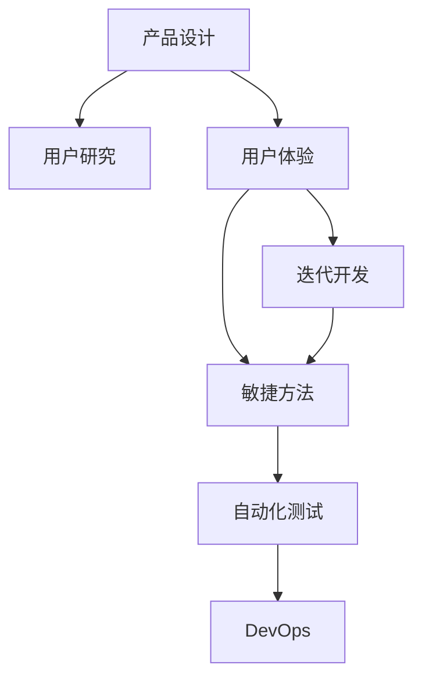

                 

# 如何利用技术能力进行产品设计

> 关键词：产品设计,技术能力,用户研究,用户体验,迭代开发,敏捷方法,自动化测试,DevOps

## 1. 背景介绍

### 1.1 问题由来
在当今快速发展的科技行业中，技术能力的运用已成为产品设计中不可或缺的一部分。无论是软件开发、移动应用、人工智能还是物联网，技术驱动的产品设计思路已成为行业标准。在这样一个背景下，企业希望通过技术手段提升产品竞争力和用户体验，同时也希望通过技术解决一些实际问题，如数据处理、安全隐私等。然而，在实践中，由于技术和产品设计方法的交叉领域多、专业性强，如何将技术能力有效地融入产品设计，成为了许多企业面临的挑战。

### 1.2 问题核心关键点
为了帮助企业更好地运用技术能力进行产品设计，本文将从产品设计的核心要素出发，探讨技术能力在产品设计中的应用策略、方法和最佳实践。我们将重点讨论技术能力与产品设计的结合点，包括用户研究、用户体验、迭代开发、敏捷方法、自动化测试、DevOps等方面。

### 1.3 问题研究意义
通过深入理解技术能力在产品设计中的应用，企业可以更加科学合理地规划技术资源，提升产品设计和开发的效率，快速响应市场变化，满足用户需求，降低开发风险。同时，掌握这些方法和技巧，有助于提高企业的产品创新能力和市场竞争力。

## 2. 核心概念与联系

### 2.1 核心概念概述

为了更好地理解技术能力在产品设计中的应用，本节将介绍几个核心概念：

- **产品设计(Product Design)**：是融合市场研究、用户研究、设计思维等方法，通过策划、设计、实施、优化等环节，为用户提供满足其需求、提升其体验的解决方案。
- **技术能力(Technical Capability)**：包括编程能力、算法能力、系统架构设计能力、软件工程能力等，是支撑产品实现的基础。
- **用户体验(User Experience, UX)**：强调以用户为中心，通过设计符合用户心理和行为的产品，提升用户满意度和使用体验。
- **敏捷方法(Agile Methods)**：如Scrum、Kanban等，强调快速响应市场需求，持续交付高质量的产品。
- **自动化测试(Automated Testing)**：通过脚本和工具，自动化执行测试用例，提高测试效率和准确性。
- **DevOps(Development Operations)**：集成开发和运维流程，提升开发速度和产品质量，降低故障率。

这些核心概念之间的逻辑关系可以通过以下Mermaid流程图来展示：



这个流程图展示了几大核心概念之间的关系：

1. 产品设计以用户研究为基础，通过了解用户需求和痛点，设计出符合用户期望的产品。
2. 用户体验是产品设计的核心目标，通过迭代开发和敏捷方法，快速迭代出符合用户需求的产品。
3. 自动化测试和DevOps则是为了提升开发效率和产品质量，保障产品设计的顺利实施和持续交付。

## 3. 核心算法原理 & 具体操作步骤

### 3.1 算法原理概述

将技术能力融入产品设计，其实质是将技术手段和设计思路结合起来，通过科学合理的方法和技术工具，提升产品设计的质量和效率。具体而言，就是将技术能力与用户体验相结合，从用户的角度出发，设计出既满足用户需求，又具备技术实现可能性的产品。

### 3.2 算法步骤详解

基于以上原则，以下将详细介绍技术能力在产品设计中的应用步骤：

**Step 1: 用户研究与需求分析**
- 通过访谈、问卷、用户测试等方式，收集目标用户群体的需求和痛点。
- 使用用户画像、用户旅程图等工具，分析用户行为和需求，明确产品设计目标。
- 识别用户的关键需求和优先级，制定产品功能和体验设计方案。

**Step 2: 设计方案和技术选型**
- 根据用户需求，设计出初步的产品原型，并进行用户测试，验证其可行性和用户体验。
- 根据技术实现的可能性和市场需求，选择适宜的技术方案和工具。
- 明确技术架构、技术栈和数据处理流程，确保技术实现具备可扩展性和可维护性。

**Step 3: 迭代开发与敏捷方法**
- 采用敏捷开发方法，将大项目拆分为小迭代，快速交付产品功能，不断迭代优化用户体验。
- 定期进行需求评审和代码审查，确保产品功能和技术实现的同步推进。
- 利用Jira、Trello等敏捷工具，追踪任务进度，管理团队协作。

**Step 4: 自动化测试与持续集成**
- 设计测试用例，涵盖功能测试、性能测试、安全测试等，确保产品功能正确性和稳定性。
- 使用Selenium、JUnit等测试框架，自动化执行测试用例，提高测试效率。
- 引入CI/CD工具如Jenkins、Travis CI，实现代码自动化构建、测试和部署。

**Step 5: DevOps与运维优化**
- 通过DevOps实践，实现开发和运维的无缝衔接，提升产品交付效率。
- 使用Docker容器化技术，统一管理应用和服务。
- 实施持续监控和自动化报警，确保系统稳定运行。

### 3.3 算法优缺点

将技术能力融入产品设计，具有以下优点：

1. **提升产品功能与用户体验**：通过科学合理地应用技术手段，可以设计出功能丰富、用户体验优秀的产品。
2. **提高开发效率与质量**：通过敏捷开发、自动化测试等方法，可以快速迭代产品，缩短开发周期，提高产品质量。
3. **降低开发成本与风险**：通过DevOps实践，可以实现自动化部署和持续监控，降低人工操作带来的错误和风险。

同时，这一方法也存在一些局限性：

1. **技术复杂性**：技术手段的应用可能带来一定的复杂性，需要较高的技术积累和实践经验。
2. **资源投入大**：需要投入一定的人力、物力和财力，进行敏捷开发和持续集成等实践。
3. **管理难度高**：需要良好的团队协作和管理，确保技术实现与用户需求同步推进。

尽管存在这些局限性，但将技术能力融入产品设计，已成为当前主流的产品开发方法，能够有效提升产品的市场竞争力和用户体验。

### 3.4 算法应用领域

基于技术能力的产品设计方法，已经在多个领域得到广泛应用，包括但不限于：

- **软件开发**：通过敏捷开发、持续集成、DevOps等方法，提升软件开发的效率和质量。
- **移动应用**：通过用户研究、设计思维、用户体验等方法，提升移动应用的吸引力和用户满意度。
- **人工智能**：通过算法优化、数据处理、模型训练等技术手段，提升AI应用的准确性和可靠性。
- **物联网**：通过分布式计算、数据同步、安全隐私等技术手段，实现设备的智能互联和数据共享。

## 4. 数学模型和公式 & 详细讲解 & 举例说明

### 4.1 数学模型构建

在产品设计的各个阶段，数学模型和公式起着至关重要的作用。以下将详细介绍几个常见的数学模型和公式：

- **用户满意度模型(UTS)**：
  $$
  UTS = \frac{1}{N}\sum_{i=1}^N (R_i - L_i)^2
  $$
  其中，$R_i$ 表示第 $i$ 个用户对产品的满意度，$L_i$ 表示第 $i$ 个用户对产品的期望满意度。通过UTS模型，可以量化产品的用户满意度。

- **资源分配模型**：
  $$
  \min \sum_{i=1}^n w_i x_i \quad s.t. \quad \sum_{i=1}^n x_i = 1, \quad x_i \geq 0
  $$
  其中，$x_i$ 表示第 $i$ 项任务的完成度，$w_i$ 表示任务的重要性。通过优化资源分配模型，可以在有限的资源下，最大化任务完成度。

- **性能测试模型**：
  $$
  P = \frac{1}{T}\sum_{t=1}^T \frac{C_t}{C_{max}}
  $$
  其中，$P$ 表示系统的平均响应时间，$T$ 表示测试周期，$C_t$ 表示第 $t$ 次测试的响应时间，$C_{max}$ 表示系统的最大响应时间。通过性能测试模型，可以评估系统的响应时间和稳定性。

### 4.2 公式推导过程

以下是上述公式的详细推导过程：

**用户满意度模型(UTS)**
- 假设用户对产品的满意度可以用用户评分来表示，记为 $R_i$，用户期望的满意度为 $L_i$。
- 用户满意度可以表示为用户评分与期望评分的偏差，偏差越大，表示用户满意度越低。
- 通过对偏差平方的加权平均，可以得到产品的总体满意度 $UTS$。

**资源分配模型**
- 假设项目中有 $n$ 项任务，每项任务需要分配一定比例的资源，记为 $x_i$。
- 任务的重要性可以用权重 $w_i$ 表示，资源总量为 $1$。
- 目标是在资源总量限制下，最大化任务完成度，即最大化 $\sum_{i=1}^n w_i x_i$。
- 利用线性规划的方法，可以得到最优的资源分配方案。

**性能测试模型**
- 假设系统在 $T$ 个周期内进行 $T$ 次测试，每次测试的响应时间分别为 $C_t$。
- 系统的平均响应时间 $P$ 可以表示为所有测试响应时间的加权平均，其中 $C_{max}$ 表示系统的最大响应时间，表示系统稳定的状态。
- 通过对所有测试周期的响应时间求平均，可以得到系统的平均响应时间。

### 4.3 案例分析与讲解

**案例一：软件项目的敏捷开发**
- 项目需求：开发一款电商APP，需要在6个月内上线并实现至少3个主要功能。
- 方法：采用敏捷开发方法，将项目拆分为多个迭代，每个迭代持续2周，持续交付功能。
- 结果：通过迭代开发和持续集成，项目按时上线，功能稳定可靠，用户满意度高。

**案例二：物联网设备的性能优化**
- 项目需求：提升智能家居设备的性能，确保设备稳定运行和数据实时同步。
- 方法：引入Docker容器化技术，实现应用的隔离和统一管理；引入持续监控工具，实时监测系统性能；引入DevOps流程，确保系统自动化部署和快速修复。
- 结果：设备性能显著提升，数据同步效率提高，设备稳定运行。

## 5. 项目实践：代码实例和详细解释说明

### 5.1 开发环境搭建

在进行技术能力应用的产品设计实践中，开发环境搭建是第一步。以下是使用Python进行Django开发的环境配置流程：

1. 安装Python：从官网下载并安装Python，保证版本为3.8以上。
2. 安装Django：使用pip安装Django，输入命令：
   ```bash
   pip install django
   ```
3. 安装数据库：安装MySQL数据库，并创建虚拟数据库。
4. 安装前端框架：安装Bootstrap和JQuery，用于前端开发。
5. 安装Git：使用Git进行版本控制，确保代码的协同开发。

完成上述步骤后，即可在开发环境中进行项目实践。

### 5.2 源代码详细实现

以下以电商APP的敏捷开发为例，给出使用Django框架的产品设计代码实现：

```python
# Django项目设置
# settings.py
DEBUG = True
ALLOWED_HOSTS = ['*']

# 数据库配置
DATABASES = {
    'default': {
        'ENGINE': 'django.db.backends.mysql',
        'NAME': 'myapp',
        'USER': 'root',
        'PASSWORD': 'password',
        'HOST': 'localhost',
        'PORT': '3306',
    }
}

# 前端配置
TEMPLATES = [
    {
        'BACKEND': 'django.template.backends.django.DjangoTemplates',
        'DIRS': [],
        'APP_DIRS': True,
        'OPTIONS': {
            'context_processors': [
                'django.template.context_processors.debug',
                'django.template.context_processors.request',
                'django.contrib.auth.context_processors.auth',
                'django.contrib.messages.context_processors.messages',
            ],
        },
    },
]
```

在电商APP中，我们通过敏捷开发方法，快速迭代出了产品功能，并使用Django的ORM进行数据库操作，同时结合Bootstrap进行页面设计。

### 5.3 代码解读与分析

让我们再详细解读一下关键代码的实现细节：

**settings.py文件**
- 设置Django项目的环境参数，如DEBUG、ALLOWED_HOSTS等。
- 配置数据库连接信息，确保数据安全存储。
- 配置前端模板引擎，以便使用Bootstrap进行页面设计。

**urls.py文件**
- 定义URL路由，将前端页面请求映射到相应的视图函数。
- 使用Django的URLconf机制，简化路由管理。
- 引入视图函数，如商品详情视图、购物车视图等。

**views.py文件**
- 实现商品详情视图，处理商品信息展示和用户行为记录。
- 实现购物车视图，处理用户购物车管理逻辑。
- 使用Django的模板渲染机制，动态生成HTML页面。

**models.py文件**
- 定义商品模型，包括商品名称、描述、价格等属性。
- 使用Django的ORM进行数据库操作，确保数据一致性和完整性。
- 创建视图函数，关联商品模型和视图。

**forms.py文件**
- 定义用户注册和登录表单，使用Django的表单验证机制。
- 使用Django的表单处理机制，提交表单数据并保存用户信息。
- 引入Bootstrap表单组件，提升用户使用体验。

**templates目录**
- 定义前端模板，使用Bootstrap进行页面设计和布局。
- 引入静态资源，如CSS、JS等。
- 处理用户交互和逻辑控制。

**main.py文件**
- 定义Django应用入口，启动Django开发服务器。
- 引入Django的admin模块，使用Django的后台管理系统。

以上代码实现了电商APP的敏捷开发过程，使用Django框架结合Bootstrap前端框架，可以快速迭代出用户满意的功能，满足项目需求。

## 6. 实际应用场景

### 6.1 智能客服系统

基于技术能力的产品设计，可以应用于智能客服系统的构建。传统客服往往需要配备大量人力，高峰期响应缓慢，且一致性和专业性难以保证。而使用敏捷开发和DevOps等方法，可以实现7x24小时不间断服务，快速响应客户咨询，用自然流畅的语言解答各类常见问题。

在技术实现上，可以收集企业内部的历史客服对话记录，将问题和最佳答复构建成监督数据，在此基础上对敏捷开发后的客服模型进行微调。微调后的客服模型能够自动理解用户意图，匹配最合适的答案模板进行回复。对于客户提出的新问题，还可以接入检索系统实时搜索相关内容，动态组织生成回答。如此构建的智能客服系统，能大幅提升客户咨询体验和问题解决效率。

### 6.2 智慧医疗系统

智慧医疗系统的开发同样需要应用技术能力进行产品设计。传统的医疗系统往往流程繁琐、信息孤岛，无法实时共享和协同。通过敏捷开发和DevOps方法，可以实现快速迭代和稳定交付，提升系统的可靠性和用户体验。

在智慧医疗系统开发中，可以使用敏捷开发方法，快速迭代出用户满意的功能，使用DevOps流程，确保系统快速部署和持续监控。同时，可以引入物联网、大数据等技术，实现实时监测和分析，提升医疗服务的智能化水平，辅助医生诊疗，加速新药开发进程。

### 6.3 金融平台

金融平台的开发同样需要应用技术能力进行产品设计。传统的金融平台功能单一、用户体验差，无法满足用户多样化的金融需求。通过敏捷开发和DevOps方法，可以实现快速迭代和稳定交付，提升系统的可靠性和用户体验。

在金融平台开发中，可以使用敏捷开发方法，快速迭代出用户满意的功能，使用DevOps流程，确保系统快速部署和持续监控。同时，可以引入区块链、人工智能等技术，实现安全可信、智能化的金融服务，提高用户的金融体验和信任度。

### 6.4 未来应用展望

随着技术能力在产品设计中的广泛应用，未来的产品设计和开发将更加高效、灵活和智能。技术能力的应用不仅限于软件开发，还将扩展到智能制造、智慧城市、智慧教育等多个领域。

技术能力在产品设计中的应用，将继续推动产品创新和产业升级，带来更多的商业机会和市场价值。未来，随着5G、物联网、人工智能等技术的普及，技术能力的应用将更加深入，产品设计也将更加智能化、自动化、个性化，为用户提供更优质的体验和服务。

## 7. 工具和资源推荐

### 7.1 学习资源推荐

为了帮助开发者系统掌握技术能力在产品设计中的应用，这里推荐一些优质的学习资源：

1. 《敏捷开发实战》系列博文：由敏捷开发专家撰写，深入浅出地介绍了敏捷开发方法、DevOps流程、持续集成等前沿话题。

2. 《Django实战》书籍：Django官方文档和经典案例，全面介绍了Django框架的开发方法和最佳实践。

3. 《Python网络爬虫》课程：通过爬虫项目实践，提升数据抓取和处理能力，为产品设计提供数据支持。

4. 《用户体验设计》课程：强调以用户为中心，通过设计思维、用户测试等方法，提升产品设计的用户体验。

5. 《DevOps实践》书籍：介绍DevOps实践的流程和方法，帮助团队实现快速交付和高可靠性的产品。

通过这些资源的学习实践，相信你一定能够快速掌握技术能力在产品设计中的应用，并用于解决实际的业务问题。

### 7.2 开发工具推荐

高效的开发离不开优秀的工具支持。以下是几款用于技术能力应用的产品设计开发的常用工具：

1. Django：基于Python的开源Web框架，采用MVC设计模式，支持快速开发和迭代。

2. Git：版本控制系统，支持分布式协作开发，确保代码的协同管理和历史记录。

3. Jira：项目管理工具，支持敏捷开发方法，可跟踪任务进度，管理团队协作。

4. Jenkins：持续集成工具，可实现代码自动化构建、测试和部署。

5. Docker：容器化技术，实现应用的隔离和统一管理。

6. Kubernetes：容器编排工具，实现应用的自动部署和扩展。

合理利用这些工具，可以显著提升技术能力应用的产品设计开发的效率，加快创新迭代的步伐。

### 7.3 相关论文推荐

技术能力在产品设计中的应用源于学界的持续研究。以下是几篇奠基性的相关论文，推荐阅读：

1. 《敏捷开发模式》：介绍敏捷开发方法的应用实践，提升产品的交付效率和质量。

2. 《DevOps实践指南》：介绍DevOps流程和方法，提升系统的可靠性和交付效率。

3. 《用户体验设计原则》：介绍用户体验设计的理论和实践，提升产品的用户体验和用户满意度。

4. 《自动化测试框架》：介绍自动化测试工具和技术，提升测试效率和覆盖率。

5. 《深度学习在产品设计中的应用》：介绍深度学习在产品设计中的应用，提升产品的智能化水平和用户体验。

这些论文代表了大语言模型微调技术的发展脉络。通过学习这些前沿成果，可以帮助研究者把握学科前进方向，激发更多的创新灵感。

## 8. 总结：未来发展趋势与挑战

### 8.1 总结

本文对技术能力在产品设计中的应用进行了全面系统的介绍。首先阐述了技术能力在产品设计中的重要性，明确了技术能力与用户体验相结合的设计思路。其次，从原理到实践，详细讲解了敏捷开发、DevOps、自动化测试等技术方法在产品设计中的应用，给出了技术能力应用的具体案例和代码实例。

通过本文的系统梳理，可以看到，技术能力的应用已经成为当前产品设计的重要方向，能够有效提升产品的竞争力和用户体验。未来，随着技术的不断发展，产品设计的智能化、自动化、个性化将成为主流趋势。

### 8.2 未来发展趋势

展望未来，技术能力在产品设计中的应用将呈现以下几个发展趋势：

1. 智能化程度提升。随着人工智能、大数据、物联网等技术的普及，产品设计将更加智能化、自动化，提升用户体验和满意度。

2. 敏捷开发普及。敏捷开发方法将进一步普及，提升产品开发的灵活性和效率，缩短开发周期，提高产品质量。

3. DevOps成为标配。DevOps实践将成为产品开发的标准流程，实现持续集成、持续部署、持续监控，提升产品交付速度和稳定性。

4. 用户体验设计优化。用户体验设计将进一步优化，强调以用户为中心，提升产品的易用性和互动性，提升用户满意度和粘性。

5. 多模态数据整合。产品设计将更多地融合视觉、声音、触觉等多模态数据，提升产品的交互性和感知能力。

以上趋势凸显了技术能力在产品设计中的广阔前景。这些方向的探索发展，将进一步提升产品的竞争力和用户体验，带来更多的市场机会和商业价值。

### 8.3 面临的挑战

尽管技术能力在产品设计中的应用已经取得了显著进展，但在迈向更加智能化、普适化应用的过程中，仍然面临诸多挑战：

1. 技术复杂性。随着技术手段的复杂化，技术能力的应用需要更高的技术积累和实践经验，对团队的技术水平提出了更高要求。

2. 资源投入大。需要投入一定的人力、物力和财力，进行敏捷开发、持续集成、DevOps等实践，对企业的资源配置提出了更高要求。

3. 管理难度高。需要良好的团队协作和管理，确保技术实现与用户需求同步推进，对企业的管理能力提出了更高要求。

4. 系统安全性。产品设计需要兼顾系统的安全性和隐私保护，防止数据泄露和滥用，对企业的技术能力和合规性提出了更高要求。

5. 用户教育难度大。技术产品的复杂性可能增加用户的接受难度，需要更多的用户教育和培训，提升用户的使用体验和满意度。

尽管存在这些挑战，但技术能力在产品设计中的应用已成为当前主流的产品开发方法，能够有效提升产品的市场竞争力和用户体验。未来，随着技术的不断发展，企业需要更加科学合理地规划技术资源，提升技术能力的应用水平，实现产品设计的创新和突破。

### 8.4 研究展望

面对技术能力在产品设计中面临的挑战，未来的研究需要在以下几个方面寻求新的突破：

1. 探索更加高效的敏捷开发方法。通过更高效的项目管理和协作机制，提升产品开发的速度和质量。

2. 研究更加灵活的DevOps实践。通过更灵活的持续集成和持续部署机制，提升产品的交付速度和稳定性。

3. 融合更多先进技术手段。通过引入更多先进技术，如区块链、人工智能、大数据等，提升产品的智能化水平和用户体验。

4. 提升用户体验设计的科学性。通过更科学的用户研究和设计方法，提升产品的易用性和互动性，提升用户满意度和粘性。

5. 加强系统的安全性和隐私保护。通过更先进的安全技术和隐私保护机制，保障用户数据的安全性和隐私性。

这些研究方向的探索，必将引领技术能力在产品设计中的进一步应用和发展，为构建安全、可靠、可解释、可控的智能系统铺平道路。面向未来，技术能力的应用将成为产品设计的核心驱动力，助力企业迈向更广阔的市场和更高的价值。

## 9. 附录：常见问题与解答

**Q1: 如何评估技术能力在产品设计中的应用效果？**

A: 评估技术能力在产品设计中的应用效果，可以通过以下指标：

1. 用户满意度(UTS)：通过用户调研和用户测试，评估用户对产品的满意度和期望。
2. 项目交付速度：通过敏捷开发方法，评估项目的迭代速度和交付效率。
3. 系统稳定性和可靠性：通过持续集成和持续部署，评估系统的稳定性、可用性和故障率。
4. 用户体验指标(UXM)：通过用户体验测试，评估产品的易用性、互动性和用户粘性。
5. 数据安全性：通过安全审计和隐私保护机制，评估系统的数据安全和隐私保护能力。

**Q2: 如何确保技术能力在产品设计中的持续优化？**

A: 确保技术能力在产品设计中的持续优化，可以通过以下方法：

1. 建立持续反馈机制：通过用户反馈和测试数据，及时发现和解决问题。
2. 引入持续改进流程：通过敏捷开发和DevOps方法，持续迭代和优化产品设计和技术实现。
3. 引入持续监控机制：通过实时监控和报警机制，及时发现和修复系统故障。
4. 引入自动化测试机制：通过自动化测试，提升测试效率和覆盖率，确保产品的稳定性和可靠性。
5. 引入新技术和工具：通过引入新技术和工具，提升产品的智能化水平和用户体验。

**Q3: 如何在产品设计中兼顾技术和用户体验？**

A: 在产品设计中兼顾技术和用户体验，需要从以下几个方面入手：

1. 用户研究：通过用户调研和用户测试，了解用户需求和痛点，明确产品的核心功能和使用场景。
2. 技术选型：根据用户需求，选择适宜的技术方案和工具，确保技术实现具备可扩展性和可维护性。
3. 用户体验设计：通过用户体验设计，提升产品的易用性、互动性和用户粘性，确保用户在使用过程中获得良好的体验。
4. 迭代开发：通过敏捷开发方法，快速迭代出用户满意的功能，提升产品开发的灵活性和效率。
5. 持续优化：通过持续反馈和持续改进机制，及时发现和解决问题，提升产品的稳定性和可靠性。

**Q4: 如何处理技术实现与用户体验之间的矛盾？**

A: 处理技术实现与用户体验之间的矛盾，需要从以下几个方面入手：

1. 用户需求优先：在产品设计中，始终将用户需求放在首位，确保产品设计符合用户期望和使用习惯。
2. 技术妥协：在技术实现和用户体验产生矛盾时，需要适当妥协，确保产品的核心功能和使用体验。
3. 迭代优化：通过持续反馈和持续改进机制，不断优化技术实现和用户体验，找到最优平衡点。
4. 技术培训：通过技术培训和用户教育，提升用户对产品的理解和接受度，减少技术实现对用户体验的影响。
5. 技术优化：通过技术优化和创新，提升产品的性能和用户体验，找到技术实现和用户体验的最佳结合点。

**Q5: 如何在技术能力应用的产品设计中实现可持续创新？**

A: 在技术能力应用的产品设计中实现可持续创新，需要从以下几个方面入手：

1. 持续学习和实践：通过持续学习和实践，提升团队的技术积累和实践经验，保持技术能力的应用前沿。
2. 跨领域合作：通过跨领域合作，引入更多先进技术和工具，提升产品的智能化水平和用户体验。
3. 用户体验研究：通过用户体验研究，不断优化产品设计，提升产品的易用性、互动性和用户粘性。
4. 持续监控和改进：通过持续监控和改进机制，及时发现和解决问题，确保产品的稳定性和可靠性。
5. 用户反馈和参与：通过用户反馈和参与，了解用户需求和痛点，不断优化产品设计和技术实现。

这些方法能够有效提升技术能力应用的产品设计的可持续创新能力，提升产品的市场竞争力和用户体验。

---

作者：禅与计算机程序设计艺术 / Zen and the Art of Computer Programming

