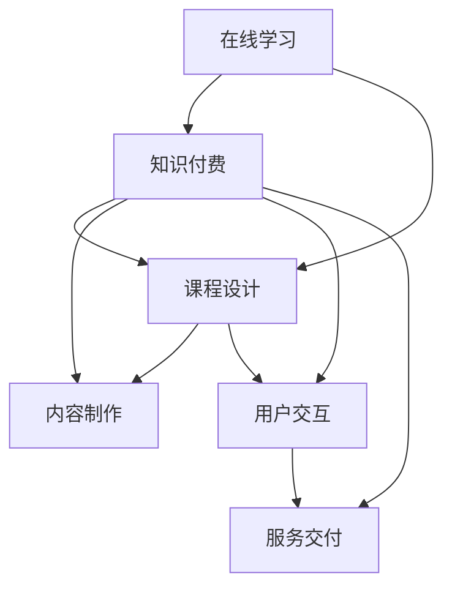

                 

# 如何利用知识付费实现在线学习与在线学习指导？

在当今快速发展的技术时代，在线学习已经成为了获取知识、技能和提升个人能力的重要方式。而知识付费作为一种新兴的商业模式，正通过提供高质量的在线课程和指导服务，推动在线学习的普及和深化。本文将探讨如何利用知识付费实现在线学习和在线学习指导，并提出一系列实现策略。

## 1. 背景介绍

### 1.1 问题由来

随着互联网的普及和技术的进步，在线学习成为了一种便捷、灵活的学习方式，满足了广大学习者对知识和技能的需求。然而，在线学习的质量和效果往往受到诸多因素的制约，如课程设计、学习内容、学习体验等。知识付费的出现，为在线学习的质量提升提供了一种新的解决方案。

知识付费是指通过收取一定费用，提供给用户专业、系统的学习资源和指导服务，以实现更高质量的学习效果。与传统的免费在线课程相比，知识付费模式通过筛选高质量的课程内容，结合专业的学习指导，提升学习者的学习效率和满意度。

### 1.2 问题核心关键点

知识付费的实现涉及多个核心环节，包括课程设计、内容制作、用户交互、服务交付等。其核心在于如何通过有效的商业模式和技术手段，确保提供给用户高价值的学习资源和指导服务，同时实现商业上的可持续性。

- **课程设计**：选择合适的学习主题，设计合理的课程结构，保证内容的系统性和实用性。
- **内容制作**：高质量的制作课程内容，如视频、音频、文本等，并提供互动和反馈机制。
- **用户交互**：通过在线平台和工具，实现与用户的有效互动和沟通，提高学习体验。
- **服务交付**：确保服务的高效、稳定和可靠，实现用户的长期满意和留存。

## 2. 核心概念与联系

### 2.1 核心概念概述

为更好地理解知识付费的实现机制，本节将介绍几个密切相关的核心概念：

- **在线学习**：通过互联网平台，提供系统、灵活的学习资源和工具，让用户随时随地进行学习。
- **知识付费**：提供高质量的学习资源和指导服务，并通过收费模式获取回报的商业模式。
- **课程设计**：选择或设计学习主题，规划课程内容，确保学习效果的最大化。
- **内容制作**：利用视频、音频、文本等形式制作课程内容，并集成互动和反馈机制。
- **用户交互**：通过在线平台实现与用户的互动，提供个性化的学习支持和指导。
- **服务交付**：确保服务的高效、稳定和可靠，提升用户满意度和留存率。

这些核心概念之间的逻辑关系可以通过以下Mermaid流程图来展示：



这个流程图展示了在线学习与知识付费的相互关系，以及各核心概念之间的联系。在线学习通过知识付费模式，提供高质量的学习资源和指导服务，而课程设计、内容制作、用户交互和服务交付则构成了知识付费的实现框架。

## 3. 核心算法原理 & 具体操作步骤

### 3.1 算法原理概述

知识付费的实现基于在线学习平台，通过提供系统、灵活的学习资源和指导服务，以收费模式实现商业上的可持续性。其核心算法原理主要包括：

1. **课程设计算法**：选择合适的学习主题，设计合理的课程结构，确保内容的系统性和实用性。
2. **内容制作算法**：高质量的制作课程内容，如视频、音频、文本等，并提供互动和反馈机制。
3. **用户交互算法**：通过在线平台和工具，实现与用户的有效互动和沟通，提高学习体验。
4. **服务交付算法**：确保服务的高效、稳定和可靠，实现用户的长期满意和留存。

### 3.2 算法步骤详解

#### 3.2.1 课程设计

1. **选择主题**：根据市场需求和用户兴趣，选择具有潜力和价值的课程主题。
2. **设计课程结构**：将课程内容划分为若干模块，每个模块包括若干子主题和知识点，确保内容系统性和实用性。
3. **制定教学目标**：明确每个模块和子主题的教学目标和要求，确保学习效果。

#### 3.2.2 内容制作

1. **视频制作**：录制高质量的视频内容，涵盖课程各个模块和知识点，提供互动和反馈机制。
2. **音频制作**：制作高质量的音频内容，包括讲解、答疑、互动等，方便用户随时随地学习。
3. **文本制作**：制作课程讲义、习题、参考资料等文本内容，提供丰富的学习材料。

#### 3.2.3 用户交互

1. **平台建设**：开发和维护在线学习平台，提供课程注册、学习、互动等功能。
2. **社区建设**：建立学习社区，提供用户之间的交流和互动，增强学习氛围。
3. **个性化服务**：根据用户的学习行为和反馈，提供个性化的学习建议和支持。

#### 3.2.4 服务交付

1. **技术保障**：确保平台的高效、稳定和可靠，提供良好的用户体验。
2. **用户反馈**：建立用户反馈机制，及时解决用户问题和需求。
3. **持续优化**：根据用户反馈和市场变化，持续优化课程内容和平台功能，提升服务质量。

### 3.3 算法优缺点

知识付费的实现方式具有以下优点：

- **高质量内容**：通过筛选和制作高质量课程内容，确保用户获得有价值的知识和技能。
- **专业指导**：提供专业的学习指导和支持，提升学习效率和效果。
- **个性化服务**：根据用户的学习行为和反馈，提供个性化的学习建议，提高学习体验。

同时，也存在一些局限性：

- **成本较高**：高质量课程内容和专业指导的开发和维护需要较高成本。
- **用户依赖**：过度依赖平台和指导服务，可能影响用户自主学习能力的培养。
- **市场竞争**：市场竞争激烈，需要不断创新和优化，以保持竞争力。

### 3.4 算法应用领域

知识付费的实现方式广泛应用于多个领域，包括但不限于：

- **教育培训**：提供各类职业资格、技能提升、学科知识等在线课程和指导服务。
- **职业技能**：提供各类职业技能培训、项目管理、数据分析等课程，提升职业竞争力。
- **生活休闲**：提供各类兴趣爱好、生活技能、心理健康等课程，丰富生活内容。

这些应用领域涵盖了知识付费的主要市场和用户需求，为在线学习的普及和深化提供了重要保障。

## 4. 数学模型和公式 & 详细讲解 & 举例说明

### 4.1 数学模型构建

本节将使用数学语言对知识付费的实现机制进行更加严格的刻画。

假设用户数量为 $U$，课程数量为 $C$，内容数量为 $V$，用户与课程的匹配度为 $M_{UC}$，用户与内容的匹配度为 $M_{UV}$。知识付费平台的目标是通过用户订阅和付费，最大化平台收益 $R$。

模型构建的目标是最大化收益 $R$，考虑用户订阅、内容制作、平台运营等成本，建立收益最大化模型：

$$
R = \max_{M_{UC}, M_{UV}} \left( \sum_{i=1}^{U} \left( 1 - C_i \right) \cdot p_i \cdot M_{UC}^i \cdot M_{UV}^i - \sum_{j=1}^{C} C_j \cdot p_j \cdot M_{UC}^j \cdot M_{UV}^j - \sum_{k=1}^{V} V_k \cdot p_k \cdot M_{UV}^k \right)
$$

其中，$C_i$ 表示用户 $i$ 的订阅数量，$p_i$ 表示用户 $i$ 的订阅价格，$C_j$ 表示课程 $j$ 的制作成本，$p_j$ 表示课程 $j$ 的订阅价格，$V_k$ 表示内容 $k$ 的制作成本，$p_k$ 表示内容 $k$ 的订阅价格。

### 4.2 公式推导过程

以课程设计为例，推导课程设计算法的基本步骤：

1. **选择主题**：根据市场需求和用户兴趣，选择具有潜力和价值的课程主题。设课程主题数量为 $T$，主题选择概率为 $P_{T}$，则主题选择概率矩阵为 $P_{T}$。
2. **设计课程结构**：将课程内容划分为若干模块，每个模块包括若干子主题和知识点，确保内容系统性和实用性。设模块数量为 $S$，子主题数量为 $O$，则课程结构设计矩阵为 $P_{SO}$。
3. **制定教学目标**：明确每个模块和子主题的教学目标和要求，确保学习效果。设目标满足度为 $A$，目标满足度矩阵为 $P_{A}$。

综合以上步骤，课程设计算法的基本模型为：

$$
P_{SO} = P_{SO} \cdot P_{T} \cdot P_{A}
$$

其中 $P_{SO}$ 为课程结构设计矩阵，$P_{T}$ 为主题选择概率矩阵，$P_{A}$ 为目标满足度矩阵。

### 4.3 案例分析与讲解

以在线编程课程为例，分析知识付费实现的具体过程：

1. **课程设计**：选择编程语言、开发框架、项目实战等主题，设计课程结构和教学目标。
2. **内容制作**：录制高质量的视频内容，制作详细的课程讲义和习题，提供互动和反馈机制。
3. **用户交互**：开发在线学习平台，提供课程注册、学习、互动等功能，建立学习社区。
4. **服务交付**：确保平台高效稳定，提供技术支持，收集用户反馈并进行持续优化。

## 5. 项目实践：代码实例和详细解释说明

### 5.1 开发环境搭建

在进行知识付费平台开发前，我们需要准备好开发环境。以下是使用Python进行Django开发的环境配置流程：

1. 安装Anaconda：从官网下载并安装Anaconda，用于创建独立的Python环境。

2. 创建并激活虚拟环境：
```bash
conda create -n django-env python=3.8 
conda activate django-env
```

3. 安装Django：
```bash
pip install django
```

4. 安装必要的第三方库：
```bash
pip install django-rest-framework markdown django-guardian
```

完成上述步骤后，即可在`django-env`环境中开始项目开发。

### 5.2 源代码详细实现

下面我们以在线编程课程为例，给出使用Django进行知识付费平台开发的PyTorch代码实现。

```python
from django.contrib.auth.models import User
from django.contrib.auth import authenticate, login, logout
from django.shortcuts import render
from django.http import HttpResponse, HttpResponseRedirect
from .models import Course, Content, UserCourse
from .forms import UserCourseForm
import markdown

def course_detail(request, course_id):
    course = Course.objects.get(id=course_id)
    user = request.user
    user_course = UserCourse.objects.filter(course=course, user=user).first()
    if not user_course:
        user_course = UserCourse(user=user, course=course)
        user_course.save()
    return render(request, 'course_detail.html', {'course': course, 'user_course': user_course})

def course_list(request):
    courses = Course.objects.all()
    return render(request, 'course_list.html', {'courses': courses})

def login_view(request):
    if request.method == 'POST':
        username = request.POST['username']
        password = request.POST['password']
        user = authenticate(request, username=username, password=password)
        if user is not None:
            login(request, user)
            return HttpResponseRedirect('/course_list/')
        else:
            return HttpResponse("Invalid credentials")
    return render(request, 'login.html')

def logout_view(request):
    logout(request)
    return HttpResponseRedirect('/login/')

def user_course_list(request):
    user = request.user
    user_courses = UserCourse.objects.filter(user=user).all()
    courses = [course for course in user_courses]
    return render(request, 'user_course_list.html', {'courses': courses})
```

以上代码实现了用户注册、登录、登出、课程列表、课程详情等基本功能。通过Django的ORM框架，我们可以便捷地操作数据库，完成用户管理和课程信息的管理。

### 5.3 代码解读与分析

让我们再详细解读一下关键代码的实现细节：

**login_view函数**：
- 接收POST请求的用户名和密码，通过authenticate函数验证登录信息。
- 如果登录信息正确，则调用login函数完成用户登录，并重定向至课程列表页面。
- 如果登录信息错误，则返回“Invalid credentials”提示信息。

**logout_view函数**：
- 调用logout函数完成用户注销，并重定向至登录页面。

**user_course_list函数**：
- 获取当前登录用户，通过UserCourse模型查询用户已购买的课程。
- 将课程列表返回给用户，并渲染对应的页面。

通过Django的简洁和强大的ORM框架，我们能够快速开发出知识付费平台的基本功能。然而，要想实现高质量的课程内容和互动反馈，还需要结合多种技术手段，如视频制作、互动插件等。

## 6. 实际应用场景

### 6.1 在线编程教育

在线编程教育是知识付费的重要应用场景之一。传统的编程教育往往依赖于面对面的授课方式，难以大规模推广。通过知识付费模式，编程教育能够以低成本、高质量的方式普及开来。

具体而言，可以邀请知名编程专家，录制高质量的视频课程，涵盖编程语言、算法、数据结构等内容。同时提供丰富的编程练习和项目实战，增强学习效果。通过在线平台和社区，实现与用户的高效互动，提供及时的学习支持和指导。

### 6.2 职业资格培训

职业资格培训是知识付费的另一重要应用场景。传统的职业资格培训往往需要长时间的面对面培训，成本高、效率低。通过知识付费模式，职业资格培训能够以更加灵活、高效的方式进行。

具体而言，可以邀请行业专家，设计系统、实用的课程内容，涵盖职业资格要求的各种知识点。通过在线平台和社区，实现与用户的互动和支持，提供个性化的学习建议。通过在线测试和认证，确保学习效果和职业资格的获取。

### 6.3 职业技能提升

职业技能提升是知识付费的广泛应用领域。传统的职业技能提升往往依赖于企业内部培训或外部培训课程，时间和成本较高。通过知识付费模式，职业技能提升能够以低成本、高效率的方式进行。

具体而言，可以邀请行业专家，设计系统、实用的课程内容，涵盖各类职业技能，如项目管理、数据分析、人工智能等。通过在线平台和社区，实现与用户的互动和支持，提供个性化的学习建议。通过在线测试和认证，确保学习效果和职业技能提升。

### 6.4 未来应用展望

随着知识付费模式的不断成熟，未来在更多领域都将看到知识付费的应用。

在医疗健康领域，在线医疗咨询、健康管理等课程将帮助用户提升健康水平和医疗知识。在法律金融领域，在线法律咨询、金融理财等课程将帮助用户提升法律和金融知识，防范风险。在生活休闲领域，在线美食制作、旅行攻略等课程将丰富用户的日常生活。

未来，知识付费平台将不断扩展其应用领域，涵盖更多细分市场和用户需求，成为教育培训、职业发展、生活提升等领域的重要平台。

## 7. 工具和资源推荐

### 7.1 学习资源推荐

为了帮助开发者系统掌握知识付费的实现原理和实践技巧，这里推荐一些优质的学习资源：

1. **《在线学习与知识付费》系列博文**：由知识付费技术专家撰写，深入浅出地介绍了在线学习的基本原理和知识付费的实现方法。

2. **Coursera和edX课程**：这两家在线教育平台提供了大量优质的课程内容，涵盖了各类知识和技能，是学习知识付费的良好资源。

3. **Udacity和Udemy课程**：这两家在线教育平台提供了丰富的职业技能培训课程，涵盖了项目管理、数据分析、人工智能等领域，是职业技能提升的重要资源。

4. **Codecademy和LeetCode**：这两家在线教育平台提供了高质量的编程教育课程，涵盖多种编程语言和技能，是编程教育的重要资源。

通过对这些资源的学习实践，相信你一定能够快速掌握知识付费的实现原理和实践技巧，并将其应用于实际项目中。

### 7.2 开发工具推荐

高效的开发离不开优秀的工具支持。以下是几款用于知识付费平台开发的常用工具：

1. **Django**：基于Python的开源Web框架，功能强大，易于扩展，是开发知识付费平台的首选。

2. **TensorFlow和PyTorch**：这两个深度学习框架提供了丰富的神经网络库，可用于课程内容的生成和推荐系统等。

3. **Jupyter Notebook**：一个开源的Web应用程序，提供交互式计算环境，方便开发和测试课程内容。

4. **Kaggle**：一个数据科学和机器学习竞赛平台，提供了丰富的数据集和模型库，可用于课程内容的制作和优化。

5. **GitHub和Bitbucket**：这两个代码托管平台提供了协作开发和版本控制功能，方便团队合作和代码管理。

合理利用这些工具，可以显著提升知识付费平台开发的效率，加速创新迭代的步伐。

### 7.3 相关论文推荐

知识付费的发展源于学界的持续研究。以下是几篇奠基性的相关论文，推荐阅读：

1. **《在线教育技术的发展与趋势》**：该论文深入探讨了在线教育技术的现状和未来发展方向，是了解在线教育技术的重要资源。

2. **《知识付费的市场机制和商业模式》**：该论文分析了知识付费的市场机制和商业模式，为知识付费平台的设计提供了理论基础。

3. **《在线课程设计与评估》**：该论文介绍了在线课程的设计和评估方法，为高质量课程内容的开发提供了指导。

4. **《个性化推荐系统》**：该论文介绍了个性化推荐系统的工作原理和实现方法，为推荐系统的设计提供了参考。

这些论文代表了大语言模型微调技术的发展脉络。通过学习这些前沿成果，可以帮助研究者把握学科前进方向，激发更多的创新灵感。

## 8. 总结：未来发展趋势与挑战

### 8.1 总结

本文对知识付费的实现机制进行了全面系统的介绍。首先阐述了知识付费在在线学习中的重要地位和应用场景，明确了知识付费在提升学习效果、实现商业可持续性方面的独特价值。其次，从原理到实践，详细讲解了知识付费的数学模型和关键步骤，给出了知识付费平台开发的完整代码实例。同时，本文还广泛探讨了知识付费平台在多个领域的应用前景，展示了知识付费模式的巨大潜力。此外，本文精选了知识付费技术的各类学习资源，力求为读者提供全方位的技术指引。

通过本文的系统梳理，可以看到，知识付费模式正在成为在线学习的重要方式，极大地提升了学习效果和用户体验，为教育培训、职业技能提升等领域带来了新的机遇。未来，伴随知识付费模式的不断成熟，知识付费平台将在更多行业领域得到应用，为各行各业的人才培养和技能提升提供新的动力。

### 8.2 未来发展趋势

展望未来，知识付费技术将呈现以下几个发展趋势：

1. **内容丰富化**：随着在线教育的普及，知识付费平台将提供更加多样化的课程内容，涵盖更多细分领域和技能。

2. **互动强化**：通过引入互动和反馈机制，增强学习体验，提升学习效果。如实时答疑、在线测试、互动讨论等。

3. **个性化推荐**：通过推荐系统，实现用户与课程的精准匹配，提高用户满意度。结合用户行为和偏好，提供个性化的课程推荐。

4. **技术融合**：结合大数据、人工智能等技术，提升课程内容和推荐系统的精准度和个性化水平。

5. **社区建设**：建立用户社区，增强用户间的互动和交流，提升学习氛围。

6. **国际化扩展**：面向全球用户，提供多语言支持，拓展国际市场。

以上趋势凸显了知识付费技术的广阔前景。这些方向的探索发展，必将进一步提升知识付费平台的竞争力和用户满意度，为在线学习的普及和深化提供坚实保障。

### 8.3 面临的挑战

尽管知识付费模式已经取得了瞩目成就，但在迈向更加智能化、普适化应用的过程中，它仍面临着诸多挑战：

1. **内容质量瓶颈**：高质量课程内容的开发需要高成本和高要求，如何保证课程质量是亟待解决的问题。

2. **用户体验不足**：用户交互和反馈机制的优化不足，难以满足用户的个性化需求和互动需求。

3. **市场竞争激烈**：知识付费市场竞争激烈，如何提升平台的差异化和竞争力，需要更多的创新和优化。

4. **商业可持续性**：如何平衡商业利益和社会价值，实现知识付费平台的可持续性，还需要进一步探讨。

5. **数据隐私和安全**：用户数据的保护和隐私安全是知识付费平台必须面对的重要问题，需要建立完善的数据保护机制。

6. **技术挑战**：知识付费平台涉及多种技术，如大数据、人工智能、Web开发等，技术复杂度较高。

正视知识付费面临的这些挑战，积极应对并寻求突破，将使知识付费平台更加成熟和完善，为在线学习的发展提供坚实保障。

### 8.4 研究展望

面对知识付费面临的挑战，未来的研究需要在以下几个方面寻求新的突破：

1. **内容质量提升**：采用高质量的教学资源和团队，提升课程内容的系统性和实用性。引入专家团队，提供高水平的专业指导。

2. **用户体验优化**：通过技术手段和社区建设，增强用户互动和反馈机制，提升学习体验。如引入实时答疑、在线测试、互动讨论等。

3. **平台差异化**：通过差异化服务和技术创新，提升平台的竞争力和用户满意度。如个性化推荐、多语言支持等。

4. **商业模式创新**：结合知识付费模式和其它商业模式，实现平台的可持续发展。如内容订阅、广告收入、社区合作等。

5. **技术融合**：结合大数据、人工智能等技术，提升课程内容和推荐系统的精准度和个性化水平。

6. **数据隐私保护**：建立完善的数据保护机制，保障用户数据的隐私和安全。如数据脱敏、访问控制等。

这些研究方向的探索，必将引领知识付费技术迈向更高的台阶，为在线学习的普及和深化提供新的动力。面向未来，知识付费技术还需要与其他人工智能技术进行更深入的融合，共同推动在线学习的进步。

## 9. 附录：常见问题与解答

**Q1：知识付费的商业可持续性如何保障？**

A: 知识付费的商业可持续性保障需要综合考虑多个方面：

1. **高质量内容**：通过筛选和制作高质量课程内容，确保用户获得有价值的知识和技能。
2. **差异化服务**：提供差异化的课程和个性化服务，满足用户的个性化需求。
3. **品牌建设**：建立品牌声誉，提升用户信任和满意度。
4. **用户粘性**：通过互动和反馈机制，增强用户粘性，提升用户留存率。
5. **多元化收入**：结合课程订阅、广告收入、社区合作等多种收入来源，实现商业可持续发展。

只有通过高质量内容、差异化服务、品牌建设、用户粘性和多元化收入等多方面共同努力，才能保障知识付费平台的商业可持续性。

**Q2：知识付费如何实现用户个性化服务？**

A: 实现用户个性化服务需要综合考虑多个因素：

1. **用户画像**：通过用户注册和行为数据，构建用户画像，了解用户的学习兴趣和需求。
2. **推荐系统**：结合用户画像和课程内容，建立推荐系统，实现个性化课程推荐。
3. **互动反馈**：通过实时答疑、在线测试等互动机制，获取用户反馈，优化个性化服务。
4. **社区建设**：建立学习社区，增强用户间的互动和交流，提升学习体验。

只有通过用户画像、推荐系统、互动反馈和社区建设等多方面的共同努力，才能实现高效的用户个性化服务。

**Q3：知识付费平台如何提升内容质量？**

A: 提升内容质量需要综合考虑多个方面：

1. **专家团队**：邀请行业专家，提供高质量的课程内容。
2. **内容制作**：采用高质量的教学资源和制作团队，提升课程内容的系统性和实用性。
3. **质量评估**：建立课程质量评估机制，定期评估课程内容，确保内容质量。
4. **用户反馈**：收集用户反馈，及时调整和优化课程内容。
5. **持续优化**：通过持续优化和迭代，提升课程内容的质量和效果。

只有通过专家团队、内容制作、质量评估、用户反馈和持续优化等多方面的共同努力，才能提升知识付费平台的内容质量。

**Q4：知识付费如何实现技术创新？**

A: 实现技术创新需要综合考虑多个方面：

1. **技术手段**：采用大数据、人工智能等先进技术，提升课程内容和推荐系统的精准度和个性化水平。
2. **团队协作**：建立高效的研发团队，鼓励技术创新和协同研发。
3. **技术支持**：提供技术支持和培训，帮助用户掌握和使用新技术。
4. **技术评估**：建立技术评估机制，定期评估和优化技术手段。

只有通过技术手段、团队协作、技术支持和技术评估等多方面的共同努力，才能实现技术创新和突破。

**Q5：知识付费平台如何应对市场竞争？**

A: 应对市场竞争需要综合考虑多个方面：

1. **差异化服务**：提供差异化的课程和个性化服务，满足用户的个性化需求。
2. **品牌建设**：建立品牌声誉，提升用户信任和满意度。
3. **多元化收入**：结合课程订阅、广告收入、社区合作等多种收入来源，实现商业可持续发展。
4. **技术创新**：采用先进技术和手段，提升平台的竞争力和用户体验。
5. **社区建设**：建立学习社区，增强用户间的互动和交流，提升学习氛围。

只有通过差异化服务、品牌建设、多元化收入、技术创新和社区建设等多方面的共同努力，才能应对市场竞争，实现平台的可持续发展。

通过以上系统梳理和探讨，相信你一定能够全面了解知识付费的实现机制，掌握其核心原理和实践技巧。希望本文能够为你在知识付费领域的研究和实践提供有价值的参考。

---

作者：禅与计算机程序设计艺术 / Zen and the Art of Computer Programming

