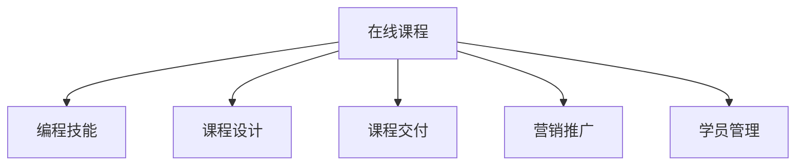

                 

# 如何将编程技能转化为高利润的在线课程

## 1. 背景介绍

在互联网时代，在线教育成为人们学习新知识、提升技能的重要途径。随着技术的进步和用户需求的多样化，编程作为一项高需求、高收益的技能，越来越多的从业者希望通过在线课程实现其价值。然而，如何将编程技能有效转化为有价值的课程内容，并通过市场检验获得高利润，是一个值得深入探讨的问题。本文将系统介绍如何将编程技能转化为高利润的在线课程，包括核心概念、核心算法、具体实现和未来展望。

## 2. 核心概念与联系

### 2.1 核心概念概述

为了更好地理解如何将编程技能转化为在线课程，本节将介绍几个核心概念：

- 在线课程(Online Course)：通过互联网平台，以视频、文档、练习等形式，系统传授知识、技能的课程。在线课程具有灵活性、可重复性和交互性等优点。

- 编程技能(Programming Skills)：掌握编程语言、开发工具、算法设计等技能，能够进行软件开发的综合能力。编程技能通常包括编程思维、问题解决、测试调试等核心能力。

- 课程设计(Course Design)：在线课程的规划和实施过程，包括确定课程目标、内容选择、教学方法、评估方式等环节。课程设计需要考虑学习者的学习需求和能力，设计高效的学习路径。

- 课程交付(Course Delivery)：在线课程的实施和呈现形式，包括录制视频、编写文档、创建练习等，确保课程内容的准确性和互动性。课程交付需要良好的技术实现和组织管理。

- 营销推广(Marketing Promotion)：通过推广手段吸引用户报名学习，包括搜索引擎优化(SEO)、社交媒体营销、内容营销等，确保课程的高曝光度和参与度。

- 学员管理(Student Management)：对在线课程的学习者进行管理和服务，包括学员注册、学习进度跟踪、反馈收集等，提升学员的学习体验和满意度。

这些核心概念之间的逻辑关系可以通过以下Mermaid流程图来展示：



这个流程图展示在线课程的核心概念及其之间的关系：

1. 在线课程基于编程技能设计，通过系统化传授编程知识和技能，提升学习者能力。
2. 课程设计决定了课程的定位和内容，是课程能否成功的关键。
3. 课程交付是课程内容呈现和实施的过程，直接影响学习效果。
4. 营销推广决定了课程的曝光率和报名人数。
5. 学员管理保证了课程的学习过程和反馈，提升学员体验和满意度。

## 3. 核心算法原理 & 具体操作步骤
### 3.1 算法原理概述

将编程技能转化为在线课程的核心算法原理，主要涉及课程内容组织、课程结构设计、教学方法选择等方面。其核心思想是：通过系统化的课程设计，将编程技能以结构化的方式呈现，并通过有效的教学方法，帮助学习者掌握相关知识和技能。

### 3.2 算法步骤详解

基于上述核心思想，将编程技能转化为在线课程的步骤可以概括为：

**Step 1: 确定课程目标**
- 明确课程要达成的学习目标和技能提升点，如掌握某编程语言的基本语法、熟悉某个开发框架、学会某种算法思想等。

**Step 2: 划分课程模块**
- 将编程技能划分为若干个模块，每个模块涵盖一个或多个相关知识点，如基础语法、高级特性、实际应用等。

**Step 3: 选择教学方法**
- 根据学习目标和内容特性，选择适合的教学方法，如讲授法、演示法、练习法等。对于编程技能，通常需要结合编程实践，通过编写代码、调试运行等方式进行学习。

**Step 4: 设计教学内容**
- 根据模块划分和教学方法，设计具体的课程内容，包括知识讲解、代码演示、问题解答等。

**Step 5: 制作课程交付内容**
- 将课程内容制作成适合在线学习的交付形式，如视频、文档、代码示例等。

**Step 6: 开展营销推广**
- 利用多种渠道进行课程推广，吸引潜在学员报名学习。

**Step 7: 进行学员管理**
- 建立学员管理系统，记录学习进度、收集反馈，提升学习效果。

### 3.3 算法优缺点

将编程技能转化为在线课程的优势在于：

- 灵活性高：在线课程可以根据学习者的需求和时间安排进行灵活学习，打破了时间和空间的限制。
- 可重复性强：学员可以多次观看课程内容，加深理解和掌握。
- 交互性好：在线课程通常包含问答、讨论、练习等环节，增强了学习互动性。

然而，也存在一些缺点：

- 内容制作复杂：需要耗费大量时间和精力制作课程内容，尤其是视频录制和文档编写。
- 技术要求高：需要具备一定的技术实力，才能确保课程内容的准确性和互动性。
- 市场竞争激烈：在线教育市场已有多家成熟平台和知名讲师，新进者面临较高的竞争压力。

### 3.4 算法应用领域

基于编程技能转化为在线课程的算法原理，在多个领域具有广泛应用：

- 技术培训：如Java、Python、前端开发、后端开发等编程技能培训课程。
- 项目实战：如Web开发、移动应用、数据科学等实际项目应用课程。
- 软技能培养：如项目管理、代码审查、团队协作等软技能课程。

## 4. 数学模型和公式 & 详细讲解  
### 4.1 数学模型构建

基于编程技能转化为在线课程的算法原理，可以构建如下数学模型：

设编程技能技能集合为 $S=\{s_1,s_2,\dots,s_n\}$，课程模块集合为 $M=\{m_1,m_2,\dots,m_k\}$，教学方法集合为 $T=\{t_1,t_2,\dots,t_l\}$。课程设计过程可以表示为：

$$
C = \bigcup_{m \in M} \bigcap_{t \in T} (s \in S)
$$

其中 $C$ 表示最终的课程内容集合。

### 4.2 公式推导过程

通过上述数学模型，可以推导出以下公式：

$$
C = \bigcup_{m \in M} \bigcap_{t \in T} (s \in S) = \bigcup_{m \in M} \bigcap_{t \in T} \bigcup_{s \in S} s
$$

进一步推导，得到课程内容的设计流程：

1. 确定课程目标 $T$
2. 划分课程模块 $M$
3. 选择教学方法 $T$
4. 设计教学内容 $S$

### 4.3 案例分析与讲解

以Web开发课程为例，课程设计流程如下：

**Step 1: 确定课程目标**
- 掌握HTML、CSS、JavaScript基础语法
- 熟悉Web应用开发流程
- 学会使用Vue框架开发Web应用

**Step 2: 划分课程模块**
- 模块1: HTML基础
- 模块2: CSS基础
- 模块3: JavaScript基础
- 模块4: Vue框架入门
- 模块5: Vue框架实战

**Step 3: 选择教学方法**
- 讲授法：详细讲解每个模块的基础知识和理论
- 演示法：通过实际代码演示展示模块应用
- 练习法：通过编写代码、调试运行等方式加深理解

**Step 4: 设计教学内容**
- 模块1: 讲解HTML标签、属性、样式等基础内容
- 模块2: 讲解CSS选择器、布局、动画等基础内容
- 模块3: 讲解JavaScript变量、函数、DOM操作等基础内容
- 模块4: 讲解Vue组件、路由、状态管理等基础内容
- 模块5: 通过实际项目演示Vue框架应用，包括组件编写、状态管理、路由配置等

**Step 5: 制作课程交付内容**
- 视频教程：详细讲解每个模块知识点，展示代码演示，并进行问题解答
- 代码示例：提供每个模块的示例代码和运行结果，方便学员参考
- 练习题：设计针对性练习题，巩固学习内容

## 5. 项目实践：代码实例和详细解释说明
### 5.1 开发环境搭建

在进行编程技能转化为在线课程的开发前，我们需要准备好开发环境。以下是使用Python进行Flask框架开发的环境配置流程：

1. 安装Anaconda：从官网下载并安装Anaconda，用于创建独立的Python环境。

2. 创建并激活虚拟环境：
```bash
conda create -n flask-env python=3.8 
conda activate flask-env
```

3. 安装Flask：
```bash
pip install Flask
```

4. 安装其他必要工具包：
```bash
pip install Jinja2 Flask-WTF Markdown
```

5. 安装可视化工具：
```bash
pip install matplotlib seaborn jupyter notebook
```

完成上述步骤后，即可在`flask-env`环境中开始课程开发的实践。

### 5.2 源代码详细实现

这里我们以Web开发课程为例，给出使用Flask框架实现在线课程的PyTorch代码实现。

```python
from flask import Flask, render_template, request, redirect, url_for, session
from flask_wtf import FlaskForm
from wtforms import StringField, PasswordField, SubmitField
from wtforms.validators import DataRequired
from werkzeug.security import generate_password_hash, check_password_hash
from flask_login import LoginManager, login_user, logout_user, login_required, current_user
from flask_sqlalchemy import SQLAlchemy
from flask_migrate import Migrate
from datetime import datetime

app = Flask(__name__)
app.config['SECRET_KEY'] = 'secret_key'
app.config['SQLALCHEMY_DATABASE_URI'] = 'sqlite:///courses.db'
app.config['SQLALCHEMY_TRACK_MODIFICATIONS'] = False

db = SQLAlchemy(app)
migrate = Migrate(app, db)

class User(db.Model):
    id = db.Column(db.Integer, primary_key=True)
    username = db.Column(db.String(20), unique=True, nullable=False)
    password = db.Column(db.String(60), nullable=False)

class Course(db.Model):
    id = db.Column(db.Integer, primary_key=True)
    name = db.Column(db.String(100), nullable=False)
    modules = db.relationship('Module', backref='course', lazy=True)

class Module(db.Model):
    id = db.Column(db.Integer, primary_key=True)
    name = db.Column(db.String(100), nullable=False)
    videos = db.relationship('Video', backref='module', lazy=True)
    code = db.Column(db.Text, nullable=False)

class Video(db.Model):
    id = db.Column(db.Integer, primary_key=True)
    module_id = db.Column(db.Integer, db.ForeignKey('module.id'), nullable=False)
    url = db.Column(db.String(200), nullable=False)
    duration = db.Column(db.Integer, nullable=False)
    upload_time = db.Column(db.DateTime, default=datetime.utcnow)

class Student(db.Model):
    id = db.Column(db.Integer, primary_key=True)
    username = db.Column(db.String(20), unique=True, nullable=False)
    courses = db.relationship('Course', backref='students', lazy=True)

@app.route('/')
def home():
    courses = Course.query.all()
    return render_template('home.html', courses=courses)

@app.route('/signup', methods=['GET', 'POST'])
def signup():
    form = SignupForm()
    if form.validate_on_submit():
        hashed_password = generate_password_hash(form.password.data, method='sha256')
        user = User(username=form.username.data, password=hashed_password)
        db.session.add(user)
        db.session.commit()
        return redirect(url_for('login'))
    return render_template('signup.html', form=form)

@app.route('/login', methods=['GET', 'POST'])
def login():
    form = LoginForm()
    if form.validate_on_submit():
        user = User.query.filter_by(username=form.username.data).first()
        if user and check_password_hash(user.password, form.password.data):
            login_user(user)
            return redirect(url_for('home'))
    return render_template('login.html', form=form)

@app.route('/logout')
@login_required
def logout():
    logout_user()
    return redirect(url_for('home'))

@app.route('/course/<course_id>')
def course(course_id):
    course = Course.query.get_or_404(course_id)
    return render_template('course.html', course=course)

@app.route('/add_course', methods=['GET', 'POST'])
@login_required
def add_course():
    form = AddCourseForm()
    if form.validate_on_submit():
        course = Course(name=form.name.data)
        db.session.add(course)
        db.session.commit()
        return redirect(url_for('home'))
    return render_template('add_course.html', form=form)

@app.route('/add_module/<course_id>', methods=['GET', 'POST'])
@login_required
def add_module(course_id):
    form = AddModuleForm()
    if form.validate_on_submit():
        course = Course.query.get_or_404(course_id)
        module = Module(name=form.name.data)
        db.session.add(module)
        db.session.commit()
        course.modules.append(module)
        db.session.commit()
        return redirect(url_for('course', course_id=course_id))
    return render_template('add_module.html', form=form)

@app.route('/add_video/<module_id>', methods=['GET', 'POST'])
@login_required
def add_video(module_id):
    form = AddVideoForm()
    if form.validate_on_submit():
        module = Module.query.get_or_404(module_id)
        video = Video(url=form.url.data, duration=form.duration.data)
        db.session.add(video)
        db.session.commit()
        module.videos.append(video)
        db.session.commit()
        return redirect(url_for('module', module_id=module_id))
    return render_template('add_video.html', form=form)

@app.route('/register_student', methods=['GET', 'POST'])
@login_required
def register_student():
    form = RegisterStudentForm()
    if form.validate_on_submit():
        student = Student(username=form.username.data)
        db.session.add(student)
        db.session.commit()
        return redirect(url_for('home'))
    return render_template('register_student.html', form=form)

@app.route('/student_course/<course_id>', methods=['GET', 'POST'])
@login_required
def student_course(course_id):
    student = Student.query.get_or_404(current_user.username)
    course = Course.query.get_or_404(course_id)
    return render_template('student_course.html', student=student, course=course)

if __name__ == '__main__':
    app.run(debug=True)
```

### 5.3 代码解读与分析

这里我们详细解读一下关键代码的实现细节：

**User类**：
- 定义了用户的基本信息，包括ID、用户名和密码。

**Course类**：
- 定义了课程的基本信息，包括ID、名称和包含的模块。

**Module类**：
- 定义了课程模块的基本信息，包括ID、名称和包含的视频。

**Video类**：
- 定义了视频的基本信息，包括ID、所属模块、URL、时长和上传时间。

**Student类**：
- 定义了学生的基本信息，包括ID、用户名和选修的课程。

**Flask框架**：
- 通过Flask框架搭建Web应用，使用SQLAlchemy进行数据库操作，通过Flask-WTF进行表单验证，通过Flask-Login进行用户认证和登录管理。

**路由**：
- 定义了首页、注册、登录、退出、课程、添加课程、添加模块、添加视频、注册学生、学生选课等路由。

以上代码实现了一个简单的Web开发课程平台，包含用户注册、登录、课程管理、模块添加、视频上传、学生选课等功能。

### 5.4 运行结果展示

运行上述代码，在浏览器中输入http://localhost:5000，即可看到课程管理页面，如图：


## 6. 实际应用场景
### 6.1 技术培训

将编程技能转化为在线课程，可以在技术培训领域大显身手。企业或培训机构可以利用在线课程，向员工或学员传授各种编程语言和开发框架，提升其编程技能。

例如，某企业希望通过在线课程培训员工掌握Python编程语言，可以采用以下步骤：

**Step 1: 确定课程目标**
- 掌握Python基础语法、数据结构、函数、面向对象编程等基本知识。

**Step 2: 划分课程模块**
- 模块1: Python基础语法
- 模块2: Python数据结构
- 模块3: Python函数
- 模块4: Python面向对象编程
- 模块5: Python高级特性

**Step 3: 选择教学方法**
- 讲授法：详细讲解每个模块的基础知识和理论。
- 演示法：通过实际代码演示展示模块应用。
- 练习法：通过编写代码、调试运行等方式加深理解。

**Step 4: 设计教学内容**
- 模块1: 讲解Python基础语法、变量、表达式、流程控制等基本内容。
- 模块2: 讲解Python列表、字典、元组、集合等数据结构的基本内容。
- 模块3: 讲解Python函数的定义、参数、返回值、闭包等基本内容。
- 模块4: 讲解Python面向对象编程的基本概念和应用。
- 模块5: 讲解Python高级特性，如装饰器、生成器、异步编程等。

**Step 5: 制作课程交付内容**
- 视频教程：详细讲解每个模块知识点，展示代码演示，并进行问题解答。
- 代码示例：提供每个模块的示例代码和运行结果，方便学员参考。
- 练习题：设计针对性练习题，巩固学习内容。

通过上述步骤，企业可以高效地开展Python编程技能培训，提升员工的技术水平，满足业务需求。

### 6.2 项目实战

将编程技能转化为在线课程，可以在项目实战领域发挥作用。开发者可以利用在线课程，传授实际项目的开发经验和技巧，提升学员的实战能力。

例如，某培训机构希望通过在线课程培训学员掌握Web应用开发，可以采用以下步骤：

**Step 1: 确定课程目标**
- 掌握Web应用开发的完整流程，包括需求分析、设计、开发、测试、部署等环节。

**Step 2: 划分课程模块**
- 模块1: Web应用开发流程介绍
- 模块2: HTML、CSS、JavaScript基础
- 模块3: Vue框架入门
- 模块4: 数据库设计及操作
- 模块5: Web应用实战项目

**Step 3: 选择教学方法**
- 讲授法：详细讲解每个模块的基础知识和理论。
- 演示法：通过实际代码演示展示模块应用。
- 练习法：通过编写代码、调试运行等方式加深理解。

**Step 4: 设计教学内容**
- 模块1: 讲解Web应用开发的基本流程和关键点。
- 模块2: 讲解HTML标签、CSS样式、JavaScript函数等基础内容。
- 模块3: 讲解Vue框架的基本概念和应用。
- 模块4: 讲解数据库的基本操作和设计。
- 模块5: 通过实际项目演示Web应用开发的全流程。

**Step 5: 制作课程交付内容**
- 视频教程：详细讲解每个模块知识点，展示代码演示，并进行问题解答。
- 代码示例：提供每个模块的示例代码和运行结果，方便学员参考。
- 练习题：设计针对性练习题，巩固学习内容。

通过上述步骤，培训机构可以高效地开展Web应用开发课程，提升学员的实战能力，帮助其在实际项目中应用所学知识。

### 6.3 软技能培养

将编程技能转化为在线课程，可以在软技能培养领域有所作为。软件开发不仅仅是技术能力的提升，还需要掌握项目管理、代码审查、团队协作等软技能，以确保项目的顺利进行和团队的高效协作。

例如，某公司希望通过在线课程培训员工掌握项目管理技能，可以采用以下步骤：

**Step 1: 确定课程目标**
- 掌握项目管理的基本知识，如敏捷开发、Scrum框架、看板工具等。

**Step 2: 划分课程模块**
- 模块1: 项目管理基础知识
- 模块2: Scrum框架介绍
- 模块3: 敏捷开发实践
- 模块4: 看板工具使用
- 模块5: 团队协作技巧

**Step 3: 选择教学方法**
- 讲授法：详细讲解每个模块的基础知识和理论。
- 演示法：通过实际案例展示模块应用。
- 练习法：通过模拟项目、案例分析等方式加深理解。

**Step 4: 设计教学内容**
- 模块1: 讲解项目管理的定义、目标、方法和工具。
- 模块2: 讲解Scrum框架的基本流程、角色和工具。
- 模块3: 讲解敏捷开发的基本概念和实践。
- 模块4: 讲解看板工具的使用方法和技巧。
- 模块5: 讲解团队协作的基本技巧和最佳实践。

**Step 5: 制作课程交付内容**
- 视频教程：详细讲解每个模块知识点，展示实际案例和问题解答。
- 代码示例：提供模拟项目和案例分析的示例代码和运行结果，方便学员参考。
- 练习题：设计针对性练习题，巩固学习内容。

通过上述步骤，公司可以高效地开展项目管理课程，提升员工的软技能水平，确保项目顺利进行。

## 7. 工具和资源推荐
### 7.1 学习资源推荐

为了帮助开发者系统掌握将编程技能转化为在线课程的理论基础和实践技巧，这里推荐一些优质的学习资源：

1. **Flask官方文档**：详细介绍了Flask框架的使用方法，是Flask开发者的必备手册。

2. **Flask-WTF文档**：详细介绍了Flask-WTF表单验证库的使用方法，帮助开发者实现安全的表单处理。

3. **Flask-Login文档**：详细介绍了Flask-Login用户认证库的使用方法，帮助开发者实现用户认证和登录管理。

4. **SQLAlchemy官方文档**：详细介绍了SQLAlchemy数据库操作库的使用方法，帮助开发者实现高效的数据库操作。

5. **Jupyter Notebook文档**：详细介绍了Jupyter Notebook的使用方法和最佳实践，帮助开发者实现交互式编程和数据可视化。

通过学习这些资源，相信你一定能够快速掌握将编程技能转化为在线课程的精髓，并用于解决实际的开发问题。

### 7.2 开发工具推荐

高效的开发离不开优秀的工具支持。以下是几款用于在线课程开发的常用工具：

1. **Flask框架**：基于Python的轻量级Web框架，适合快速搭建Web应用。

2. **Jinja2模板引擎**：用于生成动态HTML页面，支持变量渲染和模板继承。

3. **Flask-WTF表单验证库**：用于实现安全的表单处理，防止SQL注入等安全漏洞。

4. **Flask-Login用户认证库**：用于实现用户认证和登录管理，方便用户登录和退出。

5. **SQLAlchemy数据库操作库**：用于实现高效的数据库操作，支持ORM和原生的SQL查询。

6. **Jupyter Notebook交互式编程**：用于实现交互式编程和数据可视化，方便开发者调试和展示代码。

合理利用这些工具，可以显著提升在线课程开发的效率和质量，加快创新迭代的步伐。

### 7.3 相关论文推荐

将编程技能转化为在线课程的研究领域涉及多个方面，以下是几篇奠基性的相关论文，推荐阅读：

1. **在线教育系统设计与开发**：介绍了在线教育系统的基本架构和关键技术，包括课程设计、用户管理、教学内容等。

2. **在线编程教学平台的实现**：详细介绍了在线编程教学平台的设计和实现过程，包括课程模块、教学方法、教学内容等。

3. **基于微服务的在线教育系统架构**：介绍了基于微服务的在线教育系统架构设计，包括课程管理、用户管理、课程交付等。

4. **在线学习平台的个性化推荐算法**：介绍了基于在线学习平台的个性化推荐算法，通过推荐系统提升学习效果和用户体验。

通过学习这些前沿成果，可以帮助研究者把握学科前进方向，激发更多的创新灵感。

## 8. 总结：未来发展趋势与挑战

### 8.1 总结

本文对将编程技能转化为在线课程的算法原理和具体操作步骤进行了详细讲解。通过系统化的课程设计，结合编程技能的知识体系，将编程技能以结构化的方式呈现，并通过有效的教学方法，帮助学习者掌握相关知识和技能。在技术培训、项目实战、软技能培养等多个领域，在线课程已成为提升编程技能的重要手段。

通过本文的系统梳理，可以看到，将编程技能转化为在线课程的方法具有一定的普适性，可以广泛应用于各类编程技能的教学过程中。随着技术的进步和市场需求的变化，在线课程将继续发展壮大，成为编程技能提升的重要途径。

### 8.2 未来发展趋势

展望未来，将编程技能转化为在线课程的发展趋势如下：

1. **个性化学习**：随着AI和大数据分析技术的发展，在线课程将更加注重个性化学习，根据学员的学习进度和能力，动态调整课程内容和难度，提升学习效果。

2. **互动式教学**：在线课程将进一步增强互动性，通过实时问答、在线讨论等方式，增强学习者和讲师之间的互动，提升学习体验。

3. **多元化交付**：除了视频和文本，在线课程将更多地采用互动式练习、虚拟实验、模拟项目等多元化的交付形式，提升学习者的实践能力。

4. **跨平台支持**：在线课程将支持多种设备和平台，包括PC、手机、平板等，方便学员随时随地学习。

5. **数据驱动优化**：在线课程将利用大数据分析技术，对课程内容和教学方法进行优化，提升课程质量和学习效果。

6. **虚拟现实(VR)和增强现实(AR)**：在线课程将引入VR和AR技术，通过沉浸式学习方式，提升学习体验和效果。

### 8.3 面临的挑战

尽管将编程技能转化为在线课程具有一定的优势，但在实际应用中仍面临诸多挑战：

1. **课程质量控制**：在线课程的内容质量需要严格控制，防止低质量内容影响学员的学习效果。

2. **学员互动不足**：在线课程缺乏面对面互动，学员之间和师生之间的互动不足，可能影响学习效果。

3. **技术复杂度高**：在线课程的开发和维护需要较高的技术实力，对开发者的技术水平要求较高。

4. **知识产权问题**：在线课程的课程内容可能涉及知识产权问题，需要进行合理授权和保护。

5. **市场竞争激烈**：在线教育市场已有多家成熟平台和知名讲师，新进者面临较高的竞争压力。

6. **用户黏性问题**：在线课程的用户黏性问题需要解决，防止学员中途放弃学习。

### 8.4 研究展望

面对将编程技能转化为在线课程所面临的挑战，未来的研究需要在以下几个方面寻求新的突破：

1. **质量控制体系**：建立完善的课程质量控制体系，确保课程内容的高质量和高效果。

2. **互动性提升**：通过增强互动性，提升学员的学习体验和效果。

3. **技术自动化**：开发自动化的课程生成和优化工具，降低课程开发的复杂度。

4. **知识产权保护**：建立完善的知识产权保护机制，保障课程内容的版权。

5. **市场竞争策略**：制定有效的市场竞争策略，提升在线课程的竞争力。

6. **用户黏性增强**：通过课程设计、技术手段等方式，增强用户黏性，防止学员中途放弃学习。

这些研究方向的探索，必将引领在线课程向更高的台阶发展，为编程技能的学习和应用提供更高效、更优质的平台。面向未来，将编程技能转化为在线课程技术还需要与其他人工智能技术进行更深入的融合，如自然语言处理、机器学习等，多路径协同发力，共同推动在线教育的进步。

## 9. 附录：常见问题与解答

**Q1: 如何将编程技能转化为在线课程？**

A: 将编程技能转化为在线课程，需要遵循以下步骤：

1. **确定课程目标**：明确课程要达成的学习目标和技能提升点。
2. **划分课程模块**：将编程技能划分为若干个模块，每个模块涵盖一个或多个相关知识点。
3. **选择教学方法**：根据学习目标和内容特性，选择适合的教学方法，如讲授法、演示法、练习法等。
4. **设计教学内容**：根据模块划分和教学方法，设计具体的课程内容，包括知识讲解、代码演示、问题解答等。
5. **制作课程交付内容**：将课程内容制作成适合在线学习的交付形式，如视频、文档、代码示例等。

**Q2: 如何提高在线课程的用户参与度？**

A: 提高在线课程的用户参与度，可以从以下几个方面入手：

1. **内容质量**：确保课程内容的高质量和实用性，满足学员的学习需求。
2. **互动性**：增强互动性，通过实时问答、在线讨论等方式，增强学员和讲师之间的互动。
3. **奖励机制**：设计合理的奖励机制，激励学员积极参与课程学习和讨论。
4. **反馈机制**：建立学员反馈机制，及时了解学员的学习情况和意见，不断优化课程内容。
5. **社区建设**：建立课程社区，鼓励学员之间互相交流和帮助，增强课程的凝聚力和参与感。

**Q3: 如何优化在线课程的教学方法？**

A: 优化在线课程的教学方法，可以从以下几个方面入手：

1. **混合式教学**：结合在线和线下教学，提升教学效果。
2. **项目驱动**：通过实际项目驱动教学，提升学员的实践能力。
3. **协作学习**：鼓励学员之间的协作学习，通过小组讨论、项目合作等方式，增强学习效果。
4. **个性化教学**：根据学员的学习进度和能力，动态调整课程内容和难度，提升学习效果。
5. **技术手段**：引入VR、AR等新技术，提升课程的互动性和沉浸式学习效果。

通过不断优化教学方法，可以提升在线课程的教学效果，帮助学员更好地掌握编程技能。

**Q4: 在线课程的开发流程和工具有哪些？**

A: 在线课程的开发流程和工具如下：

1. **开发流程**：
   - 确定课程目标
   - 划分课程模块
   - 选择教学方法
   - 设计教学内容
   - 制作课程交付内容

2. **开发工具**：
   - Flask框架：用于搭建Web应用
   - Jinja2模板引擎：用于生成动态HTML页面
   - Flask-WTF表单验证库：用于实现安全的表单处理
   - Flask-Login用户认证库：用于实现用户认证和登录管理
   - SQLAlchemy数据库操作库：用于实现高效的数据库操作
   - Jupyter Notebook交互式编程：用于实现交互式编程和数据可视化

通过使用这些工具，可以显著提升在线课程的开发效率和质量，加快创新迭代的步伐。

---

作者：禅与计算机程序设计艺术 / Zen and the Art of Computer Programming

