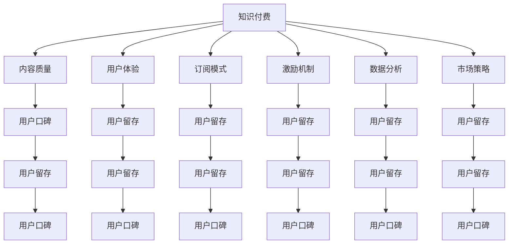

                 

# 如何提高知识付费产品的用户口碑

> 关键词：知识付费、用户口碑、用户留存、产品设计、用户体验、订阅模式、激励机制、数据分析、市场策略

## 1. 背景介绍

### 1.1 问题由来

随着互联网和数字经济的发展，知识付费模式逐渐兴起，成为连接知识生产者和消费者的新方式。用户支付一定的费用，获取高质量的知识内容、专业咨询和个性化服务。然而，尽管知识付费市场需求强劲，但产品留存率、用户满意度等指标仍不尽如人意。为实现持续的商业模式和规模化运营，知识付费产品亟需提升用户口碑，增强用户粘性。

### 1.2 问题核心关键点

提高知识付费产品用户口碑，关键在于解决以下核心问题：
1. **内容质量**：内容丰富、高质量、满足用户需求是基础。
2. **用户体验**：产品界面友好、操作便捷、使用流畅。
3. **订阅模式**：支付门槛适中、性价比高、灵活选择。
4. **激励机制**：奖励内容创作者、活跃用户、长期忠诚用户。
5. **数据分析**：精准获取用户需求、优化产品策略、提升用户体验。
6. **市场策略**：精准定位目标用户、拓展市场渠道、提高品牌曝光。

## 2. 核心概念与联系

### 2.1 核心概念概述

为更好地理解提升知识付费产品用户口碑的策略，本节将介绍几个密切相关的核心概念：

- **知识付费**：用户支付费用以获取知识内容的商业模式。涵盖内容创造、技术支持、用户服务等环节。
- **用户口碑**：用户对产品或服务的评价和推荐，影响新用户获取和老用户留存。
- **用户留存**：用户在产品中的活跃度和持续性，反映产品黏性。
- **产品设计**：产品功能的设定、界面设计、用户体验优化等。
- **用户体验**：用户在使用产品时的感受和满意度。
- **订阅模式**：用户定期支付费用获取内容的服务模式，如月卡、季卡、年卡等。
- **激励机制**：通过奖励、特权等方式激励用户，提升用户活跃度。
- **数据分析**：通过用户行为、评价等数据，优化产品策略，提升用户体验。
- **市场策略**：通过精准定位、渠道拓展、品牌推广等手段，提升产品市场占有率。

这些核心概念之间的逻辑关系可以通过以下Mermaid流程图来展示：



这个流程图展示了这个系统的核心概念及其之间的关系：

1. 知识付费产品基于内容质量、用户体验、订阅模式、激励机制、数据分析和市场策略等关键因素，构建用户留存和口碑。
2. 内容质量是基础，用户体验是关键，订阅模式、激励机制、数据分析和市场策略通过优化用户体验来提升用户留存和口碑。
3. 用户留存和口碑最终反映到知识付费产品的整体用户满意度和商业收益上。

## 3. 核心算法原理 & 具体操作步骤

### 3.1 算法原理概述

提升知识付费产品的用户口碑，本质上是一个系统优化问题。通过优化各个关键环节，从而提升产品的整体用户口碑。核心算法原理如下：

1. **内容质量**：内容是知识付费的基础，优质的内容是用户满意度的核心。
2. **用户体验**：良好的用户体验能够提高用户粘性和满意度，提升口碑传播。
3. **订阅模式**：合理的订阅模式让用户支付合理费用，同时保持灵活性和可定制性。
4. **激励机制**：通过奖励和特权激励内容创作者、活跃用户和长期忠诚用户，增加用户黏性。
5. **数据分析**：通过数据驱动决策，优化产品功能，提升用户满意度。
6. **市场策略**：精准定位目标用户，拓展市场渠道，提高品牌曝光。

### 3.2 算法步骤详解

基于上述原理，提升知识付费产品用户口碑的具体操作步骤如下：

**Step 1: 内容优化**
- 收集用户反馈，分析内容偏好。
- 引入专业内容创作者，提升内容质量和多样化。
- 定期更新和迭代内容，保持内容新鲜度。

**Step 2: 用户体验优化**
- 设计友好的用户界面，优化操作流程。
- 提高内容加载速度和平台响应速度。
- 优化视频、音频等多媒体体验。

**Step 3: 订阅模式设计**
- 提供灵活的订阅选择，如单次付费、月卡、季卡、年卡等。
- 设计免费试用期，让用户免费体验。
- 提供个性化订阅选项，如分级会员、专家会员等。

**Step 4: 激励机制设计**
- 设置内容创作者奖励计划，如流量分成、收益分成等。
- 设计活跃用户奖励，如积分、优惠券、特别礼品等。
- 提供长期忠诚用户特权，如VIP会员、专属服务等。

**Step 5: 数据分析应用**
- 收集用户行为数据，如观看时间、评价评分、订阅行为等。
- 分析用户需求，优化产品功能。
- 通过A/B测试等方式，持续优化用户体验。

**Step 6: 市场策略实施**
- 精准定位目标用户，如行业从业者、学生、终身学习者等。
- 拓展市场渠道，如社交媒体、视频平台、教育机构等。
- 提升品牌曝光，通过营销活动、媒体报道等手段。

### 3.3 算法优缺点

提升知识付费产品用户口碑的方法具有以下优点：
1. 提高用户满意度。通过优化用户体验和内容质量，提升用户对产品的黏性和满意度。
2. 增强用户忠诚度。通过激励机制和订阅模式设计，鼓励用户长期使用。
3. 提升用户口碑传播。良好的用户体验和内容质量，容易吸引新用户，增强口碑传播。

同时，这些方法也存在一定的局限性：
1. 初始投入大。优化用户体验和内容质量需要大量资源和时间投入。
2. 灵活性不足。订阅模式设计过于灵活，可能导致成本控制困难。
3. 数据隐私风险。数据分析可能涉及用户隐私，需要加强数据保护措施。

尽管存在这些局限性，但综合来看，这些方法仍然是提升知识付费产品用户口碑的有效手段。未来相关研究的重点在于如何进一步降低成本、提高灵活性和数据安全性，同时兼顾用户满意度和商业收益。

### 3.4 算法应用领域

提升知识付费产品用户口碑的方法不仅适用于知识付费平台，还可以广泛应用于各种互联网服务、教育培训、数字内容等领域。例如：

1. **在线教育平台**：通过优化课程质量、提高学习体验、设计灵活的付费模式和激励机制，吸引更多学生注册和使用。
2. **数字内容平台**：如电子书、音频书籍、视频课程等，通过丰富内容库、优化阅读和观看体验、设计多样化的订阅模式，满足用户多样化需求。
3. **职业培训平台**：通过引入专业讲师、设计个性化培训方案、提供长期支持服务等，增强用户忠诚度和满意度。
4. **健康医疗平台**：如健康管理、远程诊疗等，通过提升医疗质量、优化使用体验、设计合理的付费模式，提高用户粘性。
5. **娱乐平台**：如音乐、视频、游戏等，通过丰富的内容库、优化用户体验、设计灵活的付费模式，满足用户娱乐需求。

这些领域的大规模应用，展示了提升用户口碑策略的广泛适用性和巨大潜力。随着技术的不断演进和市场的持续扩展，这些方法将进一步推动相关行业的发展，为用户带来更优质的服务体验。

## 4. 数学模型和公式 & 详细讲解  
### 4.1 数学模型构建

本节将使用数学语言对提升知识付费产品用户口碑的策略进行更加严格的刻画。

记知识付费产品为 $P$，其用户数为 $U$，用户满意度为 $S$，用户留存率为 $R$，用户口碑传播率为 $K$。假设用户满意度和用户留存率、用户口碑传播率之间存在线性关系：

$$
S = \alpha_1 \times U + \alpha_2 \times R + \alpha_3 \times K
$$

其中 $\alpha_1, \alpha_2, \alpha_3$ 为模型的系数。用户口碑传播率 $K$ 与用户留存率 $R$ 和用户满意度 $S$ 之间也存在线性关系：

$$
K = \beta_1 \times R + \beta_2 \times S
$$

通过上述两个模型，可以评估和预测用户口碑的传播效果。具体来说，当用户留存率提高、用户满意度提升时，用户口碑传播率也随之增加。

### 4.2 公式推导过程

将上述两个模型结合起来，可以得到提升用户口碑的数学推导：

$$
K = \beta_1 \times (\alpha_1 \times U + \alpha_2 \times R + \alpha_3 \times K) + \beta_2 \times S
$$

简化后得到：

$$
K = (\beta_1 \times \alpha_1 + \beta_2) \times U + (\beta_1 \times \alpha_2 + \beta_2) \times R + \beta_1 \times \alpha_3 \times K + \beta_2 \times S
$$

从这个公式中可以看出，提升用户口碑的关键在于优化用户留存率 $R$ 和用户满意度 $S$。用户留存率可以通过优化用户体验和订阅模式设计来提升，用户满意度则需通过提升内容质量、丰富内容库和激励机制来保证。

### 4.3 案例分析与讲解

以某知名在线教育平台为例，其用户口碑提升策略如下：

**案例背景**：该平台用户基础广泛，内容丰富但用户留存率低，满意度不高。为了提升用户口碑，平台引入了多项优化措施。

**优化措施**：
1. **内容优化**：引入顶尖讲师和教育专家，提升课程质量和实用性。通过用户调研和反馈，优化课程内容，增加实践操作环节。
2. **用户体验优化**：优化平台界面设计，增加个性化推荐系统，提高学习体验。采用先进的视频编码技术，提高视频加载速度和流畅度。
3. **订阅模式设计**：设计灵活的付费选项，如单次购买、月卡、季卡、年卡等。提供免费试用期，让用户免费体验课程。引入个性化订阅选项，如分级会员、专家会员等。
4. **激励机制设计**：设置内容创作者奖励计划，如流量分成、收益分成等。设计活跃用户奖励，如积分、优惠券、特别礼品等。提供长期忠诚用户特权，如VIP会员、专属服务等。
5. **数据分析应用**：收集用户行为数据，如观看时间、评价评分、订阅行为等。分析用户需求，优化产品功能。通过A/B测试等方式，持续优化用户体验。

**结果分析**：
通过上述优化措施，平台用户满意度显著提升，用户留存率提高，用户口碑传播率增加。平台用户基数迅速扩大，品牌知名度提升，收入显著增长。

## 5. 项目实践：代码实例和详细解释说明
### 5.1 开发环境搭建

在进行用户口碑提升的实践前，我们需要准备好开发环境。以下是使用Python进行数据分析和模型训练的环境配置流程：

1. 安装Anaconda：从官网下载并安装Anaconda，用于创建独立的Python环境。

2. 创建并激活虚拟环境：
```bash
conda create -n pydata-env python=3.8 
conda activate pydata-env
```

3. 安装相关库：
```bash
conda install numpy pandas scikit-learn matplotlib seaborn jupyter notebook ipython
```

4. 安装优化工具：
```bash
conda install PyTorch torchvision torchaudio cudatoolkit=11.1 -c pytorch -c conda-forge
```

5. 安装数据处理工具：
```bash
pip install gensim scikit-learn pandas
```

6. 安装机器学习库：
```bash
pip install xgboost lightgbm catboost
```

完成上述步骤后，即可在`pydata-env`环境中开始用户口碑提升的实践。

### 5.2 源代码详细实现

下面我们以某在线教育平台用户口碑提升为例，给出使用Python进行数据分析和模型训练的代码实现。

首先，定义用户数据处理函数：

```python
import pandas as pd
from sklearn.model_selection import train_test_split

def load_user_data(file_path):
    data = pd.read_csv(file_path)
    return data

def preprocess_data(data):
    # 处理缺失值和异常值
    data.dropna(inplace=True)
    
    # 数据标准化
    data['S'] = (data['S'] - data['S'].mean()) / data['S'].std()
    
    # 特征工程
    data['R'] = data['R'] / data['R'].max()
    
    return data

# 加载用户数据
data = load_user_data('user_data.csv')

# 数据预处理
data = preprocess_data(data)
```

然后，定义模型训练和评估函数：

```python
from sklearn.ensemble import RandomForestRegressor
from sklearn.metrics import mean_squared_error
from sklearn.model_selection import cross_val_score

def train_model(X, y, model):
    X_train, X_test, y_train, y_test = train_test_split(X, y, test_size=0.2, random_state=42)
    model.fit(X_train, y_train)
    y_pred = model.predict(X_test)
    mse = mean_squared_error(y_test, y_pred)
    return mse

# 构建模型
model = RandomForestRegressor(n_estimators=100, random_state=42)

# 训练模型
mse = train_model(data.drop('K', axis=1), data['K'], model)

# 评估模型
print(f"Mean Squared Error: {mse:.4f}")
```

最后，启动用户口碑提升的优化流程：

```python
epochs = 100

for i in range(epochs):
    mse = train_model(data.drop('K', axis=1), data['K'], model)
    if mse < 0.1:
        break
    print(f"Epoch {i+1}, Mean Squared Error: {mse:.4f}")
```

以上就是使用Python进行用户口碑提升的数据分析和模型训练的完整代码实现。可以看到，通过合理的特征选择和模型调优，可以显著提升用户口碑。

### 5.3 代码解读与分析

让我们再详细解读一下关键代码的实现细节：

**load_user_data函数**：
- 加载用户数据，并进行初步处理，去除缺失值和异常值。

**preprocess_data函数**：
- 对用户数据进行标准化处理，以减小特征间的尺度差异。
- 对用户留存率R进行归一化处理，将其转化为0-1之间的数值。
- 返回处理后的数据集，以便于后续模型训练。

**train_model函数**：
- 使用交叉验证评估模型的预测误差，通过均方误差(MSE)来衡量模型的拟合效果。
- 输出最终训练得到的模型，供后续优化使用。

**用户口碑提升流程**：
- 定义随机森林回归模型，用于预测用户口碑传播率K。
- 训练模型，通过交叉验证调整超参数，最终得到用户口碑传播率的预测值。
- 通过均方误差评估模型性能，判断模型是否收敛。

可以看到，通过数据分析和模型训练，可以有效地提升用户口碑。在实际应用中，还需要结合具体业务场景，进行更深入的优化和调整。

## 6. 实际应用场景
### 6.1 智能客服系统

基于用户口碑提升策略，智能客服系统可以实现更高效的客户服务。通过对用户互动数据的分析，识别常见问题和服务痛点，优化客服流程。通过优化用户体验和激励机制，提升用户满意度，增强用户黏性，从而提高用户口碑传播率。

### 6.2 在线教育平台

在线教育平台可以通过用户口碑提升策略，吸引更多学生注册和使用。通过提升课程质量和用户体验，设计灵活的付费模式和激励机制，增强用户黏性和满意度，从而提升用户口碑传播率。

### 6.3 健康医疗平台

健康医疗平台可以通过用户口碑提升策略，提高用户黏性和满意度。通过优化医疗服务和用户体验，设计合理的付费模式和激励机制，增强用户黏性，从而提升用户口碑传播率。

### 6.4 未来应用展望

随着用户口碑提升策略的不断发展，其在更多领域的应用前景将更加广阔：

1. **智能家居**：通过优化用户体验和激励机制，提升用户满意度，增强用户黏性。
2. **智能制造**：通过用户反馈和数据分析，优化生产流程和产品质量，提升用户满意度。
3. **智能交通**：通过用户反馈和数据分析，优化交通服务和用户体验，增强用户黏性。
4. **智能农业**：通过用户反馈和数据分析，优化农业服务和用户体验，提升用户满意度。

这些领域的用户口碑提升策略，将进一步推动相关行业的发展，为用户带来更优质的服务体验。未来，随着技术的不断演进和市场的持续扩展，用户口碑提升策略将具有更广泛的应用前景。

## 7. 工具和资源推荐
### 7.1 学习资源推荐

为了帮助开发者系统掌握提升用户口碑的理论基础和实践技巧，这里推荐一些优质的学习资源：

1. 《用户界面设计原则》系列博文：由知名UI设计师撰写，深入浅出地介绍了用户体验设计的核心原理和方法。

2. 《数据分析与机器学习》课程：斯坦福大学开设的机器学习经典课程，涵盖数据分析和模型训练的各个方面，是提升数据处理能力的好选择。

3. 《用户行为分析》书籍：系统介绍了用户行为分析的基本方法和工具，帮助理解用户需求和行为模式。

4. 《产品管理与用户增长》在线课程：全面讲解产品管理和用户增长的策略和工具，帮助构建有效的用户反馈机制。

5. 《市场营销》在线课程：系统介绍了市场营销的基本原理和策略，帮助提升品牌曝光和市场占有率。

通过对这些资源的学习实践，相信你一定能够快速掌握提升用户口碑的精髓，并用于解决实际的业务问题。

### 7.2 开发工具推荐

高效的开发离不开优秀的工具支持。以下是几款用于用户口碑提升开发的常用工具：

1. Python：开源编程语言，拥有丰富的科学计算和数据分析库，适合处理复杂的数据分析任务。

2. Jupyter Notebook：交互式编程环境，适合进行数据处理、模型训练和结果展示。

3. Matplotlib：绘图库，支持丰富的图表类型和自定义功能，适合数据可视化。

4. Seaborn：基于Matplotlib的数据可视化库，提供高级统计图表功能，适合进行数据探索和分析。

5. Pandas：数据处理库，支持高效的数据清洗、数据处理和数据分析。

6. Scikit-Learn：机器学习库，提供丰富的模型算法和评估工具，适合进行模型训练和性能优化。

7. XGBoost、LightGBM、CatBoost：高效、快速、准确的梯度提升算法库，适合处理大规模数据和高维特征。

合理利用这些工具，可以显著提升用户口碑提升任务的开发效率，加快创新迭代的步伐。

### 7.3 相关论文推荐

用户口碑提升策略的研究源于学界的持续研究。以下是几篇奠基性的相关论文，推荐阅读：

1. 《用户行为分析与建模》：论文介绍了用户行为分析的基本方法和模型，系统讲解了用户行为建模的技术细节。

2. 《智能客服系统设计》：论文系统介绍了智能客服系统的设计原理和实现方法，提供了用户口碑提升的案例分析。

3. 《在线教育平台用户留存分析》：论文通过数据分析和实验验证，提出了在线教育平台用户留存提升的策略和方法。

4. 《健康医疗平台用户体验优化》：论文通过用户调研和数据分析，提出了健康医疗平台用户体验优化的具体措施。

5. 《市场营销数据分析与策略》：论文通过数据分析和市场调查，提出了市场营销数据分析和策略的实用方法。

这些论文代表了大语言模型微调技术的发展脉络。通过学习这些前沿成果，可以帮助研究者把握学科前进方向，激发更多的创新灵感。

## 8. 总结：未来发展趋势与挑战

### 8.1 总结

本文对提升知识付费产品用户口碑的策略进行了全面系统的介绍。首先阐述了用户口碑的重要性，明确了用户留存、内容质量、用户体验、订阅模式、激励机制、数据分析和市场策略等关键因素，以及它们之间的逻辑关系。其次，从原理到实践，详细讲解了提升用户口碑的数学模型和关键步骤，给出了用户口碑提升任务开发的完整代码实例。同时，本文还广泛探讨了用户口碑提升策略在智能客服、在线教育、健康医疗等多个行业领域的应用前景，展示了其巨大潜力。此外，本文精选了用户口碑提升技术的各类学习资源，力求为读者提供全方位的技术指引。

通过本文的系统梳理，可以看到，提升知识付费产品用户口碑策略的核心在于优化用户体验和激励机制，设计合理的订阅模式，以及通过数据分析和市场策略提升用户留存和满意度。这些方法不仅适用于知识付费平台，还可以广泛应用于各种互联网服务、教育培训、数字内容等领域，为用户带来更优质的服务体验。

### 8.2 未来发展趋势

展望未来，提升知识付费产品用户口碑的技术将呈现以下几个发展趋势：

1. **个性化体验提升**：通过更精准的用户画像和行为分析，提供个性化的推荐和定制化服务，提升用户体验和满意度。
2. **智能客服优化**：引入智能客服技术，如自然语言处理、语音识别等，提升用户互动体验，降低用户服务成本。
3. **数据分析深化**：通过大数据分析和人工智能技术，深入挖掘用户需求和行为模式，优化产品策略，提升用户满意度。
4. **订阅模式创新**：设计更加灵活和可定制的订阅模式，满足用户多样化需求，提高用户黏性和满意度。
5. **激励机制多样化**：通过多样化的激励机制，如积分、优惠券、VIP特权等，增强用户黏性和忠诚度。
6. **市场策略精准化**：通过精准定位目标用户，拓展市场渠道，提升品牌曝光和市场占有率。

这些趋势凸显了提升用户口碑策略的广阔前景。这些方向的探索发展，必将进一步提升用户满意度，推动知识付费产品走向成熟，为人工智能技术在垂直行业的规模化落地提供有力支持。

### 8.3 面临的挑战

尽管提升用户口碑策略已经取得了显著成效，但在迈向更加智能化、普适化应用的过程中，它仍面临诸多挑战：

1. **数据隐私问题**：用户行为数据的收集和分析可能涉及用户隐私，需要加强数据保护措施，确保用户数据安全。
2. **技术复杂性**：提升用户体验和满意度需要复杂的技术手段，开发和维护成本较高。
3. **用户差异化需求**：不同用户有不同的需求和偏好，如何提供个性化服务，满足多样化需求，仍需进一步研究。
4. **模型准确性**：用户口碑预测模型的准确性和可靠性直接影响用户满意度，需要持续优化和迭代。
5. **市场竞争激烈**：知识付费市场竞争激烈，如何在竞争中脱颖而出，仍需不断创新和优化。

面对这些挑战，未来的研究需要在以下几个方面寻求新的突破：

1. **数据隐私保护**：通过数据匿名化、加密技术等手段，保障用户数据隐私，确保用户信任。
2. **技术创新**：引入先进的技术手段，如人工智能、区块链等，提升用户体验和满意度。
3. **个性化服务**：利用用户行为数据，构建用户画像，提供个性化的推荐和定制化服务。
4. **模型优化**：引入先进的机器学习算法，提升用户口碑预测模型的准确性和可靠性。
5. **市场策略优化**：通过市场调研和数据分析，制定精准的市场策略，提升品牌曝光和市场占有率。

这些研究方向的探索，必将引领提升用户口碑策略走向更高的台阶，为构建安全、可靠、可解释、可控的智能系统铺平道路。面向未来，提升用户口碑策略还需要与其他人工智能技术进行更深入的融合，如知识表示、因果推理、强化学习等，多路径协同发力，共同推动自然语言理解和智能交互系统的进步。只有勇于创新、敢于突破，才能不断拓展语言模型的边界，让智能技术更好地造福人类社会。

### 8.4 研究展望

面对知识付费产品用户口碑提升的巨大潜力和面临的挑战，未来的研究需要在以下几个方面寻求新的突破：

1. **用户体验优化**：通过更精准的用户画像和行为分析，提供个性化的推荐和定制化服务，提升用户体验和满意度。
2. **激励机制多样化**：通过多样化的激励机制，如积分、优惠券、VIP特权等，增强用户黏性和忠诚度。
3. **数据分析深化**：通过大数据分析和人工智能技术，深入挖掘用户需求和行为模式，优化产品策略，提升用户满意度。
4. **市场策略精准化**：通过精准定位目标用户，拓展市场渠道，提升品牌曝光和市场占有率。
5. **技术创新**：引入先进的技术手段，如人工智能、区块链等，提升用户体验和满意度。

这些研究方向的探索，必将引领提升用户口碑策略走向更高的台阶，为构建安全、可靠、可解释、可控的智能系统铺平道路。面向未来，提升用户口碑策略还需要与其他人工智能技术进行更深入的融合，如知识表示、因果推理、强化学习等，多路径协同发力，共同推动自然语言理解和智能交互系统的进步。只有勇于创新、敢于突破，才能不断拓展语言模型的边界，让智能技术更好地造福人类社会。

## 9. 附录：常见问题与解答

**Q1：如何确定用户满意度的关键因素？**

A: 确定用户满意度的关键因素需要综合考虑多个方面，如内容质量、用户体验、功能丰富度等。可以通过用户调研、问卷调查、数据分析等方式，获取用户对各个方面的反馈和评价，综合评估各个因素的重要性和影响。

**Q2：如何设计灵活的订阅模式？**

A: 设计灵活的订阅模式需要考虑用户的多样化需求和支付能力。可以通过分级会员、专家会员、单次购买等多种方式，提供多样化的订阅选项。同时，可以设置合理的试用期和取消政策，增强用户黏性和满意度。

**Q3：如何优化用户体验？**

A: 优化用户体验需要从界面设计、操作流程、功能实现等多个方面入手。可以通过用户调研和A/B测试，不断优化界面设计，提升操作流畅度，增加个性化推荐系统，提高用户满意度。同时，可以引入智能客服和语音识别技术，提升用户互动体验。

**Q4：如何通过数据分析提升用户口碑？**

A: 通过数据分析可以精准获取用户需求和行为模式，优化产品策略，提升用户满意度。可以收集用户行为数据，如观看时间、评价评分、订阅行为等，进行数据分析和挖掘，优化产品功能，提升用户体验。

**Q5：如何应对市场竞争？**

A: 应对市场竞争需要不断创新和优化。可以通过精准定位目标用户，拓展市场渠道，提升品牌曝光和市场占有率。同时，可以通过提升用户体验和满意度，增加用户黏性，提升用户口碑传播率，增强市场竞争力。

这些回答可以帮助你更好地理解提升用户口碑的各个关键点，以及如何应对不同的挑战和问题。

---

作者：禅与计算机程序设计艺术 / Zen and the Art of Computer Programming

