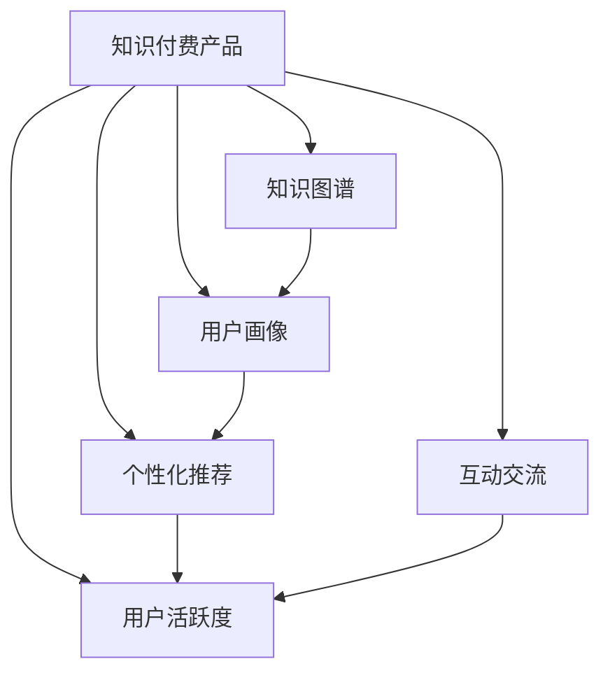

                 

## 1. 背景介绍

### 1.1 问题由来

随着互联网和移动智能设备的普及，用户对于知识付费的需求日益增长，知识付费产品也迅速崛起。这些产品如在线课程、专业文章、音频播客、视频讲座等，通过向用户提供有价值的内容，满足其知识学习、技能提升、个人兴趣等需求。然而，尽管市场竞争激烈，用户流失率依然高企，如何提高用户活跃度成为知识付费行业亟待解决的问题。

### 1.2 问题核心关键点

用户活跃度是一个多维度、多层次的综合指标，涉及用户的参与程度、时间投入、反馈评价等多个方面。影响知识付费产品用户活跃度的因素复杂多样，包括产品体验、内容质量、付费门槛、营销策略、用户群体特性等。

- **内容质量**：内容的深度、广度、时效性等，直接关系到用户的学习效果和满意度。
- **产品体验**：包括UI/UX设计、交互流畅度、功能便利性等，直接影响用户的访问和使用体验。
- **付费门槛**：过于昂贵的订阅价格或单次课程费用，容易使用户产生放弃意愿。
- **营销策略**：有效的推广和引导策略，能够吸引潜在用户，并持续保持用户兴趣。
- **用户群体特性**：不同年龄、职业、兴趣的用户群体，对内容的需求和偏好有所不同。

本文聚焦于如何通过技术手段提升知识付费产品的用户活跃度，涵盖内容推荐、个性化体验、互动交流等多个方面，力求为知识付费产品的设计和运营提供全面、系统的技术指导。

## 2. 核心概念与联系

### 2.1 核心概念概述

为更好地理解如何提高知识付费产品的用户活跃度，本节将介绍几个关键概念及其相互关系：

- **知识付费产品**：指通过互联网平台提供的专业知识内容，用户需支付费用以获得访问和使用权的在线服务。
- **用户活跃度**：指用户与知识付费产品互动的频度和深度，包括浏览、学习、评价、分享等行为。
- **个性化推荐**：根据用户的历史行为和兴趣，为其推荐个性化内容，以提升用户粘性和满意度。
- **知识图谱**：通过语义关系图谱化的方式，构建知识节点之间的关联网络，提供全面的知识结构。
- **用户画像**：基于用户行为数据，构建详尽的用户特征画像，为个性化服务提供依据。
- **互动交流**：通过论坛、评论、直播等形式，增强用户间的互动和社群感，提升用户参与度。

这些核心概念之间的逻辑关系可以通过以下Mermaid流程图来展示：



该流程图展示了知识付费产品提升用户活跃度的关键环节及其相互关系：

1. 知识付费产品提供个性化推荐、知识图谱、用户画像和互动交流等工具，为用户活跃度的提升提供技术支撑。
2. 个性化推荐和用户画像通过知识图谱辅助，进一步提升推荐效果和用户画像的准确性。
3. 互动交流和用户画像相互配合，增强用户的参与感和社群归属感。

这些概念共同构成了提升知识付费产品用户活跃度的技术框架，通过细致设计和协同工作，实现用户粘性和满意度的最大化。

## 3. 核心算法原理 & 具体操作步骤
### 3.1 算法原理概述

提升知识付费产品的用户活跃度，本质上是一个多目标优化问题，涉及用户参与度、满意度、转化率等多个维度的综合优化。通过构建用户画像、知识图谱、个性化推荐等技术，实现对用户行为和兴趣的全面理解，进而采取针对性措施，提升用户活跃度。

形式化地，假设知识付费产品为 $P$，用户群体为 $U$，产品功能为 $F$。目标是通过优化策略 $S$，最大化用户活跃度 $A$，即：

$$
\max_{S} A = \sum_{i \in U} \alpha_i f_i(S)
$$

其中 $f_i(S)$ 为第 $i$ 个用户对策略 $S$ 的满意度，$\alpha_i$ 为用户 $i$ 对整体活跃度的贡献权重。

### 3.2 算法步骤详解

提升知识付费产品用户活跃度的算法步骤包括：

**Step 1: 数据收集与用户画像构建**

- 收集用户行为数据（如浏览记录、学习时长、评价反馈等）。
- 使用数据挖掘和机器学习技术，构建详尽的用户画像，包括兴趣偏好、学习历史、付费行为等。

**Step 2: 知识图谱构建**

- 收集知识库中的各种数据（如书籍、文章、视频、专家信息等）。
- 使用自然语言处理和图谱构建技术，将数据转换为语义化的知识节点，并建立知识节点之间的关联关系。

**Step 3: 个性化推荐系统设计**

- 设计个性化推荐算法，如协同过滤、内容基推荐、深度学习等，根据用户画像和知识图谱，为每个用户推荐相关内容。
- 实时监控推荐效果，根据用户反馈不断优化推荐模型。

**Step 4: 互动交流功能优化**

- 在产品中引入论坛、评论、直播等功能，鼓励用户之间的交流互动。
- 分析用户互动数据，识别热门话题和用户兴趣，优化互动功能和内容引导。

**Step 5: 用户参与度提升策略**

- 定期举办线上活动（如直播讲座、知识竞赛等），激发用户参与热情。
- 提供积分、折扣等激励措施，引导用户完成课程学习、分享推荐等行为。

**Step 6: 持续反馈与优化**

- 定期收集用户反馈，评估产品活跃度提升效果。
- 根据反馈数据，不断调整优化产品策略，实现持续改进。

### 3.3 算法优缺点

提升知识付费产品用户活跃度的算法具有以下优点：

- 个性化推荐和用户画像可以显著提升用户体验，增加用户粘性。
- 知识图谱构建能够为用户提供全面、结构化的知识结构，提升学习效果。
- 互动交流功能可以增加用户间的互动和社群感，提升用户参与度。
- 用户参与度提升策略可以有效激励用户行为，增加产品粘性。

同时，该算法也存在一些缺点：

- 需要收集和处理大量用户数据，对隐私保护和数据安全提出较高要求。
- 个性化推荐和用户画像的构建较为复杂，需要较强的技术实现能力。
- 知识图谱构建需要大量的数据资源和处理能力，短期内较难实现。
- 用户活跃度提升策略的实施需综合考虑多方面因素，执行难度较高。

尽管存在这些局限性，但就目前而言，这种多维度、多层次的提升策略仍是大语言模型应用的最主流范式。未来相关研究的重点在于如何进一步降低算法对数据的需求，提高系统的鲁棒性和可扩展性，同时兼顾可解释性和伦理安全性等因素。

### 3.4 算法应用领域

提升知识付费产品用户活跃度的算法方法，在在线教育、培训、出版、科研等多个领域已经得到了广泛的应用，取得了显著的效果。

- **在线教育**：通过个性化推荐和互动交流功能，提升课程学习效果，增加用户黏性。
- **职业培训**：提供基于用户画像的职业路径推荐，增加用户参与度和学习效果。
- **科研出版**：构建知识图谱和个性化推荐系统，提升学术资源的使用效率。
- **数字化出版**：通过个性化推荐和互动交流，提升电子书和数字课程的阅读体验和用户粘性。

除了上述这些经典应用外，知识图谱和个性化推荐技术还被创新性地应用到更多场景中，如智能搜索、内容聚合、社区推荐等，为知识付费产品的创新发展提供了新的思路和方向。

## 4. 数学模型和公式 & 详细讲解 & 举例说明
### 4.1 数学模型构建

本节将使用数学语言对提升知识付费产品用户活跃度的算法进行更加严格的刻画。

假设知识付费产品为 $P$，用户群体为 $U$，产品功能为 $F$。用户画像为 $P_u$，知识图谱为 $G_k$，个性化推荐系统为 $R$。用户活跃度为 $A$，由多个子指标 $A_1, A_2, \dots, A_n$ 组成。

定义用户画像与知识图谱之间的关联矩阵为 $M$，个性化推荐系统的预测准确率为 $P$，互动交流的活跃度为 $I$，用户参与度提升策略的效果为 $E$。则整体用户活跃度的数学模型为：

$$
A = w_1 A_1 + w_2 A_2 + \dots + w_n A_n
$$

其中 $w_i$ 为第 $i$ 个指标的权重，需根据用户需求和产品目标进行设定。

### 4.2 公式推导过程

以下我们以课程推荐为例，推导个性化推荐系统的准确率计算公式。

假设课程推荐系统接收用户画像 $P_u$ 和知识图谱 $G_k$，为用户推荐 $N$ 门课程 $C=\{c_1, c_2, \dots, c_N\}$。每门课程的评分 $s_c$ 和推荐度 $r_c$ 分别为 $s_c = (s_{c1}, s_{c2}, \dots, s_{cN})$ 和 $r_c = (r_{c1}, r_{c2}, \dots, r_{cN})$。则个性化推荐系统的预测准确率 $P$ 定义为：

$$
P = \frac{\sum_{i=1}^N \mathbb{I}(s_c[i] \cdot r_c[i] > 0)}{N}
$$

其中 $\mathbb{I}$ 为指示函数，当 $s_c[i] \cdot r_c[i] > 0$ 时，表示课程 $c_i$ 在用户画像 $P_u$ 和知识图谱 $G_k$ 的联合作用下，被评为正向推荐，指示函数值为1；否则为0。

### 4.3 案例分析与讲解

**案例1：个性化推荐系统的实现**

假设有一个知识付费平台，拥有数万门课程和数百万用户。为了提高用户活跃度，平台引入了个性化推荐系统。具体实现步骤如下：

1. 收集用户行为数据，如浏览课程、学习时长、评价反馈等。
2. 使用协同过滤算法，分析用户和课程之间的相似性，构建用户画像 $P_u$。
3. 构建知识图谱 $G_k$，将课程和知识点映射为语义节点，建立关联关系。
4. 根据用户画像和知识图谱，计算每门课程的推荐度 $r_c$。
5. 对用户推荐的课程进行排序，并显示在前N门课程中。

**案例2：互动交流功能的优化**

假设同一个知识付费平台上，用户可以通过论坛、评论、直播等功能进行互动交流。平台希望通过这些功能，增加用户活跃度。具体优化步骤如下：

1. 分析用户互动数据，识别热门话题和用户兴趣。
2. 引入热门话题论坛和直播功能，激发用户讨论热情。
3. 分析用户评论和反馈，优化内容推荐和互动引导策略。
4. 设计社区排行榜和积分奖励机制，激励用户积极参与。

## 5. 项目实践：代码实例和详细解释说明
### 5.1 开发环境搭建

在进行用户活跃度提升的实践前，我们需要准备好开发环境。以下是使用Python进行Keras和TensorFlow开发的环境配置流程：

1. 安装Anaconda：从官网下载并安装Anaconda，用于创建独立的Python环境。

2. 创建并激活虚拟环境：
```bash
conda create -n py-env python=3.8 
conda activate py-env
```

3. 安装Keras和TensorFlow：
```bash
conda install keras tensorflow
```

4. 安装各类工具包：
```bash
pip install numpy pandas scikit-learn matplotlib tqdm jupyter notebook ipython
```

完成上述步骤后，即可在`py-env`环境中开始项目实践。

### 5.2 源代码详细实现

这里我们以个性化推荐系统的实现为例，给出使用Keras和TensorFlow进行知识付费产品个性化推荐代码的实现。

首先，定义推荐系统的训练数据和模型参数：

```python
import tensorflow as tf
from tensorflow import keras

# 定义训练数据集
train_data = tf.data.Dataset.from_tensor_slices((
    user_features, course_features, course_labels
))

# 定义模型参数
embedding_dim = 16
num_users = 1000
num_courses = 10000
num_epochs = 10
learning_rate = 0.001
batch_size = 256
```

然后，定义推荐模型的结构和损失函数：

```python
# 定义推荐模型结构
model = keras.Sequential([
    keras.layers.Embedding(num_users, embedding_dim),
    keras.layers.Dense(32, activation='relu'),
    keras.layers.Dense(num_courses, activation='sigmoid')
])

# 定义损失函数
loss_fn = keras.losses.BinaryCrossentropy()

# 编译模型
model.compile(optimizer=keras.optimizers.Adam(learning_rate=learning_rate),
              loss=loss_fn,
              metrics=['accuracy'])
```

接着，进行模型训练和评估：

```python
# 训练模型
model.fit(train_data,
          epochs=num_epochs,
          batch_size=batch_size)

# 评估模型
test_data = tf.data.Dataset.from_tensor_slices((test_user_features, test_course_features, test_course_labels))
loss, accuracy = model.evaluate(test_data)
print(f'Test loss: {loss:.4f}')
print(f'Test accuracy: {accuracy:.4f}')
```

最后，实现个性化推荐系统的应用代码：

```python
# 根据用户画像和知识图谱，计算每门课程的推荐度
def predict_course_recommendations(user_profile, course_graph):
    user_features = tf.constant(user_profile)
    course_features = tf.sparse.to_dense(course_graph)
    recommendations = model.predict([user_features, course_features])
    return recommendations

# 对用户推荐课程
user_profile = [1.0, 0.5, 0.8]  # 用户画像特征
course_graph = tf.sparse.from_dense([[0.5, 0.7, 0.3, 0.9], 
                                   [0.2, 0.1, 0.6, 0.4]])
recommendations = predict_course_recommendations(user_profile, course_graph)
print(recommendations)
```

以上就是使用Keras和TensorFlow进行知识付费产品个性化推荐系统的完整代码实现。可以看到，利用深度学习模型，可以高效地实现个性化推荐，提升用户活跃度。

### 5.3 代码解读与分析

让我们再详细解读一下关键代码的实现细节：

**训练数据集**：
- `train_data = tf.data.Dataset.from_tensor_slices(())`：将训练数据集 `(user_features, course_features, course_labels)` 转换为TensorFlow的 `Dataset` 对象，方便数据输入。

**模型结构**：
- `model = keras.Sequential([...])`：定义推荐模型的结构，包括嵌入层、全连接层和输出层。嵌入层将用户和课程特征映射到高维空间，全连接层进行特征提取，输出层预测每门课程的推荐度。

**损失函数**：
- `loss_fn = keras.losses.BinaryCrossentropy()`：使用二元交叉熵作为损失函数，适用于二分类问题的预测准确率评估。

**模型编译**：
- `model.compile(...)`：编译模型，设置优化器、损失函数和评估指标。

**模型训练和评估**：
- `model.fit(...)`：对模型进行训练，设定训练轮数和批大小。
- `model.evaluate(...)`：对模型进行评估，输出测试损失和准确率。

**个性化推荐应用**：
- `predict_course_recommendations(...)`：根据用户画像和知识图谱，预测课程推荐度。
- `course_graph = tf.sparse.from_dense(...)`：将知识图谱转换为稀疏矩阵，方便模型计算。

通过以上代码，我们能够直观地看到如何构建和训练个性化推荐模型，以及如何利用模型预测推荐结果。

## 6. 实际应用场景
### 6.1 智能课程推荐

智能课程推荐是知识付费产品中最为重要的应用场景之一。通过构建个性化推荐系统，平台可以根据用户的兴趣和学习历史，为其推荐最适合的课程，提高用户学习效果和满意度。

具体实现时，可以采用协同过滤、基于内容的推荐、深度学习等技术。例如，协同过滤推荐可以通过用户行为矩阵，计算用户和课程之间的相似性，预测用户可能感兴趣的课程；基于内容的推荐可以分析课程内容特征，找到相似课程进行推荐；深度学习推荐则可以通过神经网络模型，捕捉更加复杂的特征关系，提升推荐效果。

### 6.2 定制化学习路径

定制化学习路径是指根据用户的学习进度和兴趣，为其设计个性化的课程学习路径，提升学习效果和满意度。

具体实现时，可以通过构建用户画像和知识图谱，分析用户的学习历史和兴趣，结合专家知识库，为用户推荐合适的学习路径。例如，根据用户的已有课程学习情况，推荐后续进阶课程；根据用户对某个领域的学习兴趣，推荐相关的课程和专家讲座。

### 6.3 社区互动与协作学习

社区互动与协作学习是指通过在线论坛、讨论组、协作工具等形式，增强用户之间的交流和协作，提升学习效果和用户体验。

具体实现时，可以引入在线论坛、讨论组、学习小组等功能，鼓励用户分享学习经验、交流问题、协作完成项目。平台可以通过分析用户互动数据，识别热门话题和用户兴趣，优化互动功能和内容引导策略。例如，在论坛中引入话题标签、热帖推荐、积分奖励机制，激励用户积极参与。

## 7. 工具和资源推荐
### 7.1 学习资源推荐

为了帮助开发者系统掌握知识付费产品的技术基础和实践技巧，这里推荐一些优质的学习资源：

1. **《深度学习：从算法到实践》**：由深度学习领域权威学者撰写的经典教材，涵盖深度学习算法和实际应用，为知识付费产品的设计提供理论基础。
2. **Coursera和edX课程**：这些平台提供的在线课程，涵盖了机器学习、深度学习、自然语言处理等多个前沿领域，适合进阶学习。
3. **Kaggle竞赛**：通过参加Kaggle机器学习竞赛，积累实战经验，提升解决实际问题的能力。
4. **GitHub代码库**：搜索相关项目代码，学习优秀的推荐系统实现方法和优化技巧。

通过这些资源的学习实践，相信你一定能够快速掌握知识付费产品的技术框架和创新思路，为产品设计和运营提供强有力的技术支撑。

### 7.2 开发工具推荐

高效的开发离不开优秀的工具支持。以下是几款用于知识付费产品开发的常用工具：

1. **Jupyter Notebook**：基于Web的交互式编程环境，适合快速迭代实验和开发。
2. **TensorBoard**：TensorFlow的可视化工具，可实时监测模型训练状态，并提供丰富的图表呈现方式。
3. **TensorFlow Extended (TFX)**：由Google开发的机器学习模型开发平台，提供数据预处理、模型训练、部署等一站式解决方案。
4. **Apache Spark**：大规模数据处理框架，支持分布式计算，适用于处理海量用户数据。

合理利用这些工具，可以显著提升知识付费产品的开发效率，加快创新迭代的步伐。

### 7.3 相关论文推荐

知识付费产品的推荐和互动技术发展源于学界的持续研究。以下是几篇奠基性的相关论文，推荐阅读：

1. **Recommender Systems**：由Tan Yining和Han Xiao撰写的经典教材，全面介绍了推荐系统的发展历史和各类推荐算法。
2. **Community Detection in Large Networks**：由Mina Gheorghe和Jean-Luc Guillaume撰写的论文，介绍了社区检测算法和其在推荐系统中的应用。
3. **Deep Learning for Recommendation Systems**：由Geng Shao和Bing Xu撰写的综述文章，介绍了深度学习在推荐系统中的应用和挑战。
4. **The Practical Aspects of Collaborative Filtering Recommendation Systems**：由Stefan van der Walt和John B. Kruse撰写的论文，介绍了协同过滤推荐系统的实现细节和优化策略。

这些论文代表了大语言模型微调技术的发展脉络。通过学习这些前沿成果，可以帮助研究者把握学科前进方向，激发更多的创新灵感。

## 8. 总结：未来发展趋势与挑战
### 8.1 总结

本文对提升知识付费产品用户活跃度的算法进行了全面系统的介绍。首先阐述了用户活跃度的重要性，明确了个性化推荐、知识图谱、用户画像、互动交流等技术对用户活跃度的提升作用。其次，从原理到实践，详细讲解了推荐系统的数学模型和关键步骤，给出了推荐任务开发的完整代码实例。同时，本文还广泛探讨了推荐系统在智能课程推荐、定制化学习路径、社区互动与协作学习等多个领域的应用前景，展示了推荐范式的巨大潜力。

通过本文的系统梳理，可以看到，个性化推荐和互动交流技术在大语言模型应用中的广泛应用，极大地拓展了知识付费产品的应用边界，提升了用户体验和满意度。未来，伴随推荐技术的持续演进，知识付费产品必将在更加智能化、个性化的方向上，为用户的知识学习提供更好的支持和服务。

### 8.2 未来发展趋势

展望未来，知识付费产品的推荐技术将呈现以下几个发展趋势：

1. **个性化推荐系统的智能化**：推荐系统将更加智能化，能够根据用户的行为数据和反馈，动态调整推荐策略，实现更加精准和个性化的推荐。
2. **推荐系统与用户画像的融合**：结合用户画像和推荐系统，提供更加全面和个性化的服务，提升用户粘性和满意度。
3. **多模态推荐技术的发展**：结合文本、图片、音频等多模态数据，提升推荐效果和用户体验。
4. **推荐系统的实时化**：通过实时分析和处理用户数据，实现动态推荐，提升推荐效果和用户体验。
5. **推荐系统的可解释性**：通过可解释性技术，让用户能够理解推荐系统的决策过程，增强信任感和透明度。

以上趋势凸显了推荐技术的广阔前景。这些方向的探索发展，必将进一步提升知识付费产品的推荐效果和用户体验，为用户的知识学习提供更好的支持和服务。

### 8.3 面临的挑战

尽管知识付费产品的推荐技术已经取得了显著进展，但在迈向更加智能化、个性化应用的过程中，仍面临诸多挑战：

1. **推荐系统对数据的质量和多样性要求高**：需要大量的高质量数据来训练和优化推荐模型，数据获取和处理成本高。
2. **推荐系统的复杂度增加**：多模态、实时化的推荐系统设计复杂，需要综合考虑多个因素，实现难度大。
3. **推荐系统的可解释性不足**：推荐系统的黑盒特性，导致用户难以理解推荐结果的来源和依据，缺乏信任感。
4. **用户隐私保护问题**：推荐系统需要收集大量用户数据，如何保护用户隐私，避免数据滥用，是亟待解决的问题。

正视推荐技术面临的这些挑战，积极应对并寻求突破，将是大语言模型微调走向成熟的必由之路。相信随着学界和产业界的共同努力，这些挑战终将一一被克服，知识付费产品必将在构建人机协同的智能时代中扮演越来越重要的角色。

### 8.4 研究展望

面对知识付费产品推荐系统所面临的种种挑战，未来的研究需要在以下几个方面寻求新的突破：

1. **推荐系统的模型优化**：开发更加高效和可解释的推荐算法，减少对数据的依赖，提高推荐效果和系统可解释性。
2. **推荐系统与大数据的结合**：结合大数据技术，提升推荐系统的实时性和精准度，实现动态推荐。
3. **推荐系统的可扩展性**：开发可扩展的推荐系统架构，支持多模态数据处理和大规模用户群体，提升推荐系统的性能和灵活性。
4. **推荐系统的用户隐私保护**：研究数据保护技术，如差分隐私、联邦学习等，保护用户隐私，增强用户信任感。

这些研究方向的探索，必将引领推荐技术迈向更高的台阶，为知识付费产品的创新发展提供新的思路和方向。面向未来，推荐技术还需要与其他人工智能技术进行更深入的融合，如知识表示、因果推理、强化学习等，多路径协同发力，共同推动知识付费产品的进步。只有勇于创新、敢于突破，才能不断拓展知识付费产品的边界，为用户的知识学习提供更好的支持和服务。

## 9. 附录：常见问题与解答

**Q1：如何构建用户画像？**

A: 构建用户画像的关键在于收集和分析用户行为数据。具体步骤如下：

1. 收集用户行为数据，如浏览记录、学习时长、评价反馈等。
2. 使用数据挖掘和机器学习技术，对数据进行清洗和特征提取，构建用户特征向量。
3. 使用聚类、分类等算法，将用户特征向量进行分组，形成用户画像。

**Q2：如何提高推荐系统的准确率？**

A: 提高推荐系统准确率的关键在于优化推荐算法和数据处理方式。具体方法包括：

1. 引入更高效的推荐算法，如深度学习、协同过滤、基于内容的推荐等。
2. 优化数据处理方式，如使用分布式计算、特征工程、数据增强等技术，提升数据质量。
3. 实时更新模型参数，根据用户反馈不断优化推荐效果。

**Q3：如何设计用户互动功能？**

A: 设计用户互动功能的关键在于提供互动平台和引导用户参与。具体方法包括：

1. 引入在线论坛、讨论组、学习小组等功能，鼓励用户分享学习经验、交流问题、协作完成项目。
2. 分析用户互动数据，识别热门话题和用户兴趣，优化互动功能和内容引导策略。
3. 设计社区排行榜和积分奖励机制，激励用户积极参与。

**Q4：如何平衡用户隐私保护和推荐效果？**

A: 平衡用户隐私保护和推荐效果的关键在于数据保护技术和用户信任建设。具体方法包括：

1. 采用差分隐私、联邦学习等技术，保护用户数据隐私，防止数据滥用。
2. 公开推荐算法和数据处理方式，增强用户对系统的信任感。
3. 引入用户隐私声明和数据使用协议，让用户了解数据的使用范围和目的。

**Q5：推荐系统的可解释性如何提升？**

A: 提升推荐系统可解释性的关键在于提供推荐结果的透明性和可视化。具体方法包括：

1. 引入可解释性技术，如模型可解释性分析、特征重要性分析等，让用户理解推荐结果的依据。
2. 提供推荐过程的可视化界面，让用户查看推荐算法和数据处理过程。
3. 设计推荐系统的反馈机制，让用户能够对推荐结果进行评价和反馈，进一步优化推荐效果。

这些问题的解答，为知识付费产品的推荐系统设计和优化提供了详细指导，帮助开发者更好地应对实际问题，提升用户活跃度。

---

作者：禅与计算机程序设计艺术 / Zen and the Art of Computer Programming

