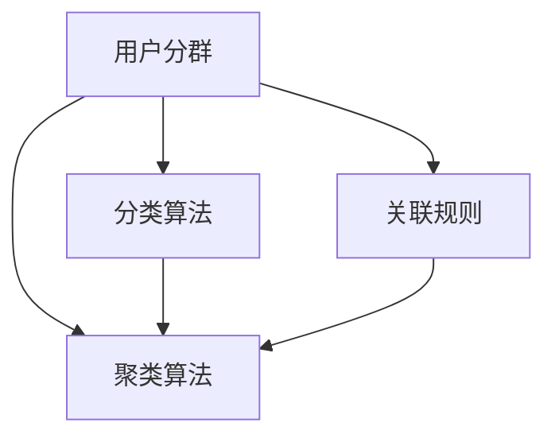

                 

## 1. 背景介绍

在现代互联网业务中，用户分群管理是一个至关重要的环节。通过合理地将用户进行分类，可以更好地理解用户需求，进行个性化的营销和服务，从而提升用户满意度和业务转化率。然而，在实际应用中，用户分群往往面临数据冗余、用户标签冲突、聚类算法选择困难等问题，导致分群效果不佳。为了解决这些问题，本文将系统介绍有效的用户分群管理方法，包括基于聚类、分类和关联规则的分群算法，以及如何利用用户行为数据进行更精准的分群。

## 2. 核心概念与联系

### 2.1 核心概念概述

本节将详细介绍几个与用户分群管理密切相关的核心概念：

- **用户分群**：根据用户的行为、属性、兴趣等特征，将用户划分为不同类别的过程。常见的用户分群方法包括聚类、分类和关联规则等。
- **聚类算法**：将相似特征的用户分到同一类群中的无监督学习方法。常用的聚类算法包括K-Means、层次聚类、DBSCAN等。
- **分类算法**：通过有标签训练数据学习用户分类的模型。常用的分类算法包括逻辑回归、决策树、支持向量机等。
- **关联规则**：描述不同属性之间关系的规则，通过分析用户行为数据找到具有相似行为特征的用户。
- **用户行为数据**：用户在应用中的操作记录、交互数据等，是用户分群的重要依据。

这些核心概念之间的联系可以通过以下Mermaid流程图来展示：



这个流程图展示了用户分群管理过程中，不同算法和技术之间的逻辑关系：

1. 用户分群的目标是将用户按照相似特征分组。
2. 聚类算法通过无监督学习实现用户分组，找到相似特征的用户。
3. 分类算法通过有监督学习，为每个分组赋予明确的标签，提高分群的准确性。
4. 关联规则利用用户行为数据，发现不同属性之间的关系，进一步细化用户分群。

这些核心概念共同构成了用户分群管理的理论基础，帮助企业在实际应用中更有效地进行用户分类和个性化管理。

## 3. 核心算法原理 & 具体操作步骤

### 3.1 算法原理概述

用户分群管理的基本流程可以总结为以下几个步骤：

1. **数据预处理**：清洗、标准化用户数据，处理缺失值和异常值。
2. **特征提取**：从用户数据中提取有意义的特征，如行为时间、浏览路径、消费金额等。
3. **选择算法**：根据数据特性和业务需求选择合适的聚类、分类或关联规则算法。
4. **模型训练**：训练聚类、分类或关联规则模型，得到用户分群的初步结果。
5. **模型评估**：通过交叉验证、指标评估等方法，评估模型的性能和稳定性。
6. **结果优化**：对初步结果进行优化，如调整聚类数目、分类阈值等，得到最终的用户分群结果。

通过这一流程，可以构建出一套有效的用户分群管理系统。

### 3.2 算法步骤详解

以下将详细讲解用户分群管理的具体步骤：

**Step 1: 数据预处理**

用户数据通常包含多种格式和结构，需要进行清洗和标准化处理。预处理的主要任务包括：

- 数据清洗：去除重复数据、缺失数据和异常数据。
- 特征标准化：将不同尺度的特征归一化，便于后续算法处理。
- 特征选择：选择对用户行为有显著影响的特征，去除冗余特征。

**Step 2: 特征提取**

在数据预处理后，需要从中提取出对用户分群有意义的特征。常用的特征提取方法包括：

- 统计特征：如用户活跃度、平均访问时间、消费金额等。
- 行为序列特征：如浏览路径、点击次数、页面停留时间等。
- 文本特征：如用户评论、搜索关键词等。

这些特征的提取需要根据具体业务场景进行调整，确保特征的有效性和完备性。

**Step 3: 选择算法**

根据数据特性和业务需求，选择合适的算法进行用户分群：

- 聚类算法：如K-Means、层次聚类、DBSCAN等。
- 分类算法：如逻辑回归、决策树、支持向量机等。
- 关联规则算法：如Apriori、FP-Growth等。

不同的算法适用于不同的数据特性和业务场景，需要根据具体情况进行选择。

**Step 4: 模型训练**

在选定算法后，训练模型并进行用户分群。具体步骤如下：

- 聚类算法：通过迭代算法得到用户分群的初始结果。
- 分类算法：通过有标签数据训练模型，并应用到未标记数据上进行分类。
- 关联规则算法：通过扫描交易数据，找到频繁项集和关联规则。

**Step 5: 模型评估**

评估模型的性能和稳定性，确保分群结果的准确性和有效性。评估方法包括：

- 交叉验证：通过交叉验证评估模型在不同数据集上的表现。
- 指标评估：使用准确率、召回率、F1值等指标评估分群的准确性。
- 聚类评估：使用轮廓系数、Davies-Bouldin指数等评估聚类的效果。

**Step 6: 结果优化**

对初步分群结果进行优化，调整算法参数，如聚类数目、分类阈值等，得到最终的用户分群结果。

### 3.3 算法优缺点

用户分群管理算法具有以下优点：

- 可解释性强：聚类算法和分类算法的输出结果具有明确的类别含义，易于理解和解释。
- 适用性广：适用于各种类型的数据和业务场景，灵活性高。
- 自动化程度高：自动化算法可以快速处理大量用户数据，提高工作效率。

同时，这些算法也存在一些局限性：

- 数据依赖度高：分群效果高度依赖于输入数据的质量和代表性，数据的偏差会影响分群结果。
- 维度灾难问题：高维数据的处理容易导致维度灾难，影响聚类效果。
- 计算复杂度高：部分算法（如K-Means）在大规模数据集上的计算复杂度较高，需要优化处理。

针对这些缺点，需要根据实际业务场景进行算法优化和调整，确保分群效果的准确性和效率。

### 3.4 算法应用领域

用户分群管理算法广泛应用于各种业务场景，例如：

- **电商零售**：对用户进行分群，针对不同用户群体进行个性化推荐和促销活动。
- **金融理财**：对用户进行财富管理分群，提供个性化的投资建议和服务。
- **社交媒体**：对用户进行兴趣分群，推送相关内容并增加用户粘性。
- **在线教育**：对学生进行学习效果评估分群，提供针对性的辅导和学习方案。
- **医疗健康**：对患者进行分群，提供个性化的健康管理服务。

通过用户分群管理，企业可以更好地理解用户需求，进行精准营销和个性化服务，从而提升用户体验和业务转化率。

## 4. 数学模型和公式 & 详细讲解 & 举例说明

### 4.1 数学模型构建

用户分群管理的数学模型可以基于聚类、分类和关联规则等算法进行构建。以下以K-Means聚类算法为例，构建用户分群模型：

设用户数据集为 $X=\{x_i\}_{i=1}^N$，其中 $x_i=(x_{i1},x_{i2},\dots,x_{id})$ 表示用户 $i$ 的 $d$ 个特征向量。将用户分成 $k$ 个类别，每类 $C_j$ 中用户数为 $n_j$，则聚类问题可以表示为：

$$
\min_{C_1,\dots,C_k} \sum_{j=1}^k \sum_{x_i \in C_j} ||x_i - \mu_j||^2
$$

其中 $\mu_j$ 为类别 $C_j$ 的聚类中心，$||\cdot||$ 为欧几里得距离。

### 4.2 公式推导过程

K-Means算法的基本步骤如下：

1. **初始化聚类中心**：随机选择 $k$ 个样本点作为聚类中心 $\mu_1,\mu_2,\dots,\mu_k$。
2. **迭代聚类**：对每个样本点 $x_i$，计算其到每个聚类中心的距离 $d(x_i,C_j)$，将其归入距离最近的聚类 $C_j$。
3. **更新聚类中心**：重新计算每个类别的聚类中心 $\mu_j$。
4. **收敛判断**：当聚类中心不再变化时，算法收敛。

具体步骤如下：

1. 随机选择 $k$ 个样本点作为初始聚类中心。
2. 对每个样本点 $x_i$，计算其到每个聚类中心的距离，将其归入距离最近的聚类 $C_j$。
3. 更新每个类别的聚类中心 $\mu_j$，计算所有样本点到新聚类中心的距离之和，得到损失函数。
4. 重复迭代2和3步骤，直到聚类中心不再变化。

### 4.3 案例分析与讲解

以下以电商零售为例，展示如何使用K-Means算法进行用户分群：

假设电商网站收集到用户行为数据，包括购买历史、浏览路径、搜索关键词等。可以将这些数据作为特征，应用K-Means算法进行聚类：

1. 数据预处理：清洗数据，去除重复和异常数据，将特征进行标准化处理。
2. 特征提取：提取用户购买历史、浏览路径、搜索关键词等特征。
3. 选择算法：选择K-Means算法进行聚类。
4. 模型训练：随机选择 $k=5$ 个样本点作为初始聚类中心，迭代聚类并更新聚类中心。
5. 模型评估：通过交叉验证评估模型性能，使用轮廓系数评估聚类效果。
6. 结果优化：调整聚类数目，得到最终的用户分群结果。

通过K-Means算法，可以将用户分为不同购买倾向的群体，从而进行有针对性的个性化推荐和促销活动。

## 5. 项目实践：代码实例和详细解释说明

### 5.1 开发环境搭建

在进行用户分群管理实践前，需要准备好开发环境。以下是使用Python进行Scikit-Learn开发的环境配置流程：

1. 安装Anaconda：从官网下载并安装Anaconda，用于创建独立的Python环境。

2. 创建并激活虚拟环境：
```bash
conda create -n user-segmentation python=3.8 
conda activate user-segmentation
```

3. 安装Scikit-Learn：
```bash
pip install scikit-learn
```

4. 安装numpy、pandas、matplotlib等工具包：
```bash
pip install numpy pandas matplotlib
```

完成上述步骤后，即可在`user-segmentation`环境中开始用户分群管理的实践。

### 5.2 源代码详细实现

下面我们以电商用户分群为例，给出使用Scikit-Learn进行K-Means聚类的Python代码实现。

首先，定义数据处理函数：

```python
import pandas as pd
import numpy as np
from sklearn.preprocessing import StandardScaler
from sklearn.cluster import KMeans

def load_data(file_path):
    df = pd.read_csv(file_path)
    return df.dropna() # 去除缺失值

def preprocess_data(df):
    # 数据清洗
    df = load_data(file_path)

    # 特征选择
    features = ['购买历史', '浏览路径', '搜索关键词', '用户活跃度']

    # 标准化处理
    scaler = StandardScaler()
    scaled_features = scaler.fit_transform(df[features])
    
    return scaled_features

def cluster_kmeans(data, n_clusters):
    kmeans = KMeans(n_clusters=n_clusters, random_state=0).fit(data)
    return kmeans.labels_
```

然后，定义模型评估函数：

```python
from sklearn.metrics import silhouette_score

def evaluate_model(kmeans, data):
    labels = kmeans.labels_
    silhouette_avg = silhouette_score(data, labels)
    return silhouette_avg
```

最后，启动用户分群流程：

```python
n_clusters = 5 # 聚类数目

scaled_features = preprocess_data(df)
kmeans = cluster_kmeans(scaled_features, n_clusters)
silhouette_avg = evaluate_model(kmeans, scaled_features)

print(f"Silhouette Score: {silhouette_avg}")
```

以上就是使用Scikit-Learn对电商用户进行K-Means聚类的完整代码实现。可以看到，通过Scikit-Learn库，用户分群管理变得简洁高效。

### 5.3 代码解读与分析

让我们再详细解读一下关键代码的实现细节：

**load_data函数**：
- 定义数据加载函数，用于从CSV文件中读取数据。
- 去除缺失值，确保数据的完整性。

**preprocess_data函数**：
- 定义数据预处理函数，包括数据清洗、特征选择和标准化处理。
- 选择对用户行为有显著影响的特征，如购买历史、浏览路径、搜索关键词等。
- 对特征进行标准化处理，使其在聚类过程中具有可比性。

**cluster_kmeans函数**：
- 定义聚类函数，使用K-Means算法对数据进行聚类。
- 随机选择聚类数目 $n_clusters$，对数据进行聚类。
- 输出每个样本的聚类标签。

**evaluate_model函数**：
- 定义模型评估函数，计算轮廓系数。
- 使用轮廓系数评估聚类效果，返回平均值。

**用户分群流程**：
- 定义聚类数目 $n_clusters$。
- 对数据进行预处理，得到特征数据。
- 使用K-Means算法进行聚类，得到用户分群结果。
- 评估聚类效果，输出轮廓系数。

可以看到，Scikit-Learn库提供了简单易用的接口，帮助用户快速实现聚类算法。

当然，在实际应用中，还需要考虑更多因素，如模型的调参、异常值的处理、聚类数目的选择等。但核心的用户分群过程基本与此类似。

## 6. 实际应用场景

### 6.1 电商零售

在电商零售领域，用户分群管理是一个重要的应用场景。通过分群，电商平台可以更好地理解用户需求，进行个性化推荐和促销活动，从而提升用户满意度和销售额。

具体而言，可以收集用户的历史购买数据、浏览记录、搜索关键词等行为数据，应用聚类算法进行分群。通过对不同群体的行为进行分析，制定个性化的推荐策略，提高用户转化率。

### 6.2 金融理财

在金融理财领域，用户分群管理可以帮助金融机构更好地理解用户需求，提供个性化的金融服务。

例如，可以收集用户的金融交易记录、资产配置、投资偏好等数据，应用聚类算法进行分群。通过对不同群体的行为进行分析，提供个性化的投资建议和服务，提升用户粘性和满意度。

### 6.3 社交媒体

在社交媒体领域，用户分群管理可以帮助社交平台更好地理解用户兴趣，进行内容推荐和广告投放。

例如，可以收集用户的社交互动记录、关注对象、点赞和评论等行为数据，应用分类算法进行分群。通过对不同群体的兴趣进行分析，提供个性化的内容推荐和广告投放，提升用户活跃度和平台收益。

### 6.4 未来应用展望

随着用户分群管理技术的发展，未来将有以下几个趋势：

1. **自动化分群**：通过自动化算法和机器学习，实时进行用户分群，提高分群效率和准确性。
2. **跨领域分群**：结合多领域数据进行分群，如电商、金融、社交媒体等，提升分群效果。
3. **深度学习**：使用深度学习模型，如神经网络、图神经网络等，进行更精准的用户分群。
4. **个性化服务**：基于用户分群结果，提供个性化推荐、个性化广告、个性化内容等，提升用户体验。
5. **隐私保护**：在用户分群过程中，确保用户隐私和数据安全，建立隐私保护机制。

以上趋势展示了用户分群管理的广阔前景，未来将在更多领域得到应用，为企业的数字化转型提供有力支持。

## 7. 工具和资源推荐

### 7.1 学习资源推荐

为了帮助开发者系统掌握用户分群管理的理论基础和实践技巧，这里推荐一些优质的学习资源：

1. 《机器学习实战》书籍：介绍机器学习算法的基本原理和实现方法，包括聚类、分类和关联规则等。

2. 《Python数据科学手册》书籍：介绍Python在数据科学中的应用，包括数据处理、特征工程、模型评估等。

3. 《K-Means算法详解》论文：详细讲解K-Means算法的原理、实现和优化方法。

4. 《机器学习导论》课程：斯坦福大学开设的机器学习入门课程，包含聚类、分类、关联规则等算法讲解。

5. Scikit-Learn官方文档：Scikit-Learn库的官方文档，提供丰富的算法实现和示例代码，适合初学者学习。

通过对这些资源的学习实践，相信你一定能够快速掌握用户分群管理的精髓，并用于解决实际的NLP问题。

### 7.2 开发工具推荐

高效的开发离不开优秀的工具支持。以下是几款用于用户分群管理开发的常用工具：

1. Python：Python语言的简洁性和可读性，使其成为数据分析和机器学习的流行选择。

2. Scikit-Learn：基于Python的机器学习库，提供了丰富的算法实现和评估方法。

3. Pandas：Python数据处理库，提供了高效的数据处理和分析工具。

4. Matplotlib：Python绘图库，提供了丰富的可视化工具，帮助理解数据和模型。

5. Jupyter Notebook：Python数据科学开发工具，支持交互式编程和可视化展示。

合理利用这些工具，可以显著提升用户分群管理的开发效率，加快创新迭代的步伐。

### 7.3 相关论文推荐

用户分群管理技术的发展源于学界的持续研究。以下是几篇奠基性的相关论文，推荐阅读：

1. K-Means算法：D. Arthur和S. Vassilvitskis提出的经典聚类算法，广泛应用于用户分群管理。

2. G-Means算法：M. Elkan对K-Means算法的改进，提升了聚类效率和效果。

3. DBSCAN算法：Ester等人提出的基于密度的聚类算法，适用于不同形状的聚类。

4. LDA算法：D. Blei等人提出的潜在狄利克雷分布模型，用于文本聚类和主题分析。

5. 关联规则挖掘：A. R. Kriegel等人提出的Apriori算法，用于挖掘关联规则和频繁项集。

这些论文代表了大语言模型微调技术的发展脉络。通过学习这些前沿成果，可以帮助研究者把握学科前进方向，激发更多的创新灵感。

## 8. 总结：未来发展趋势与挑战

### 8.1 总结

本文对用户分群管理方法进行了全面系统的介绍。首先阐述了用户分群管理的重要性和基本流程，明确了聚类、分类和关联规则等核心算法的作用。其次，从原理到实践，详细讲解了用户分群管理的数学模型和具体操作步骤，给出了用户分群任务开发的完整代码实例。同时，本文还广泛探讨了用户分群管理在电商、金融、社交媒体等多个领域的应用前景，展示了其广阔的应用空间。此外，本文精选了用户分群管理的各类学习资源，力求为读者提供全方位的技术指引。

通过本文的系统梳理，可以看到，用户分群管理是提升业务效率和用户满意度的重要手段，能够更好地理解用户需求，提供个性化服务。未来，伴随算法和技术的发展，用户分群管理将更加自动化、精准化和个性化，为企业的数字化转型提供有力支持。

### 8.2 未来发展趋势

展望未来，用户分群管理技术将呈现以下几个发展趋势：

1. **自动化分群**：通过自动化算法和机器学习，实时进行用户分群，提高分群效率和准确性。
2. **跨领域分群**：结合多领域数据进行分群，如电商、金融、社交媒体等，提升分群效果。
3. **深度学习**：使用深度学习模型，如神经网络、图神经网络等，进行更精准的用户分群。
4. **个性化服务**：基于用户分群结果，提供个性化推荐、个性化广告、个性化内容等，提升用户体验。
5. **隐私保护**：在用户分群过程中，确保用户隐私和数据安全，建立隐私保护机制。

以上趋势展示了用户分群管理的广阔前景，未来将在更多领域得到应用，为企业的数字化转型提供有力支持。

### 8.3 面临的挑战

尽管用户分群管理技术已经取得了瞩目成就，但在迈向更加智能化、普适化应用的过程中，它仍面临着诸多挑战：

1. **数据质量和多样性**：用户分群的效果高度依赖于输入数据的质量和多样性。数据偏差和多样性不足会影响分群效果。
2. **算法复杂度**：部分聚类和分类算法在大规模数据集上的计算复杂度较高，需要优化处理。
3. **用户隐私**：在用户分群过程中，需要保护用户隐私和数据安全，建立隐私保护机制。
4. **模型可解释性**：分群模型的决策过程需要具备可解释性，便于用户理解和接受。

针对这些挑战，需要从数据质量、算法优化、隐私保护和模型可解释性等多个方面进行改进，确保用户分群管理的有效性和可靠性。

### 8.4 研究展望

面向未来，用户分群管理技术需要在以下几个方向上寻求新的突破：

1. **自动化分群**：开发更高效的自动化分群算法，实时处理大规模数据集，提升分群效果。
2. **跨领域分群**：研究多领域数据的融合算法，实现更全面和精确的用户分群。
3. **深度学习分群**：结合深度学习模型，提升用户分群的精度和泛化能力。
4. **隐私保护**：研究隐私保护技术，如差分隐私、联邦学习等，确保用户隐私和数据安全。
5. **模型可解释性**：开发可解释的模型，提升模型的透明度和可理解性。

这些研究方向的探索发展，必将引领用户分群管理技术迈向更高的台阶，为构建安全、可靠、可解释、可控的智能系统铺平道路。面向未来，用户分群管理技术还需要与其他人工智能技术进行更深入的融合，如知识表示、因果推理、强化学习等，多路径协同发力，共同推动自然语言理解和智能交互系统的进步。

## 9. 附录：常见问题与解答

**Q1：用户分群是否适用于所有业务场景？**

A: 用户分群管理适用于各种业务场景，但不同场景下分群目标和效果可能会有所不同。例如，电商领域更注重用户的购买行为和消费特征，而社交媒体更注重用户的兴趣和互动行为。

**Q2：如何选择合适的聚类算法？**

A: 选择合适的聚类算法需要根据数据特性和业务需求进行综合考虑。常用的聚类算法包括K-Means、层次聚类、DBSCAN等。K-Means适用于数据分布较为规则的情况，层次聚类适用于不同规模的聚类数目，DBSCAN适用于不同形状的聚类。

**Q3：用户分群过程中如何保护用户隐私？**

A: 在用户分群过程中，需要采取数据匿名化、差分隐私、联邦学习等技术，保护用户隐私和数据安全。例如，可以通过去除敏感信息、加密处理等方式，降低用户隐私泄露的风险。

**Q4：用户分群的效果如何评估？**

A: 用户分群的效果可以通过交叉验证、轮廓系数、F1值等指标进行评估。例如，使用轮廓系数可以评估聚类效果的紧密程度和分离程度，使用F1值可以评估分类效果的准确性和召回率。

**Q5：用户分群过程中如何处理异常值？**

A: 异常值处理是用户分群中的重要步骤。可以通过删除、替换或放缩等方法处理异常值。例如，可以使用Z-score方法，将异常值替换为均值或中位数，减小其对分群效果的影响。

通过本文的系统梳理，可以看到，用户分群管理是提升业务效率和用户满意度的重要手段，能够更好地理解用户需求，提供个性化服务。未来，伴随算法和技术的发展，用户分群管理将更加自动化、精准化和个性化，为企业的数字化转型提供有力支持。

