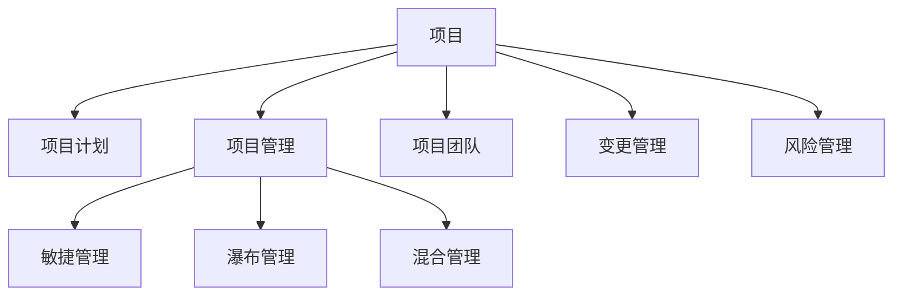

                 

# 如何进行项目管理：如何有效地管理项目和团队？

## 1. 背景介绍

在现代社会，项目管理已经成为了各行各业中不可或缺的一部分。无论是软件开发、建筑施工、还是市场营销，项目管理的目标都是确保项目能够按时、按质、按预算完成。然而，尽管项目管理的重要性不言而喻，但在实际操作中，许多项目往往因为管理不善而未能达到预期效果，甚至导致项目失败。因此，如何有效地管理项目和团队，成为了项目管理领域中最为关键的问题。

### 1.1 项目管理的定义与重要性

项目管理的定义可以追溯到19世纪末的美国，当时美国各大铁路公司为了更好地组织施工，开始采用科学的方法来管理和控制项目进度。随着社会的发展和技术的进步，项目管理逐渐应用于更多领域，成为了一个独立的管理学科。

项目管理的重要性体现在多个方面：

- **确保按时交付**：通过合理的计划和监控，确保项目在预定的时间内完成。
- **控制成本**：通过有效的预算管理和资源分配，确保项目在预算范围内完成。
- **提高质量**：通过严格的质量控制和质量保证措施，确保项目交付的质量符合预期。
- **增强团队协作**：通过明确的角色和职责分配，促进团队成员之间的有效沟通和协作。
- **应对变化**：通过灵活的项目计划和变更管理机制，应对项目实施过程中可能出现的各种变化。

### 1.2 项目管理的挑战

尽管项目管理的重要性不言而喻，但在实际操作中，项目管理的挑战依然存在。这些挑战主要包括：

- **复杂性和不确定性**：项目涉及到的因素众多，包括技术、资源、市场等，使得项目难以预测和控制。
- **人员管理**：项目团队成员的素质、能力和积极性直接影响项目的进展。
- **沟通协作**：跨部门、跨团队之间的沟通和协作难度大，容易导致信息不对称和决策延迟。
- **变更管理**：项目在实施过程中不可避免地会遇到各种变化，如何管理这些变化，保持项目进度和预算的控制，是项目管理的一大挑战。

## 2. 核心概念与联系

### 2.1 核心概念概述

为了更好地理解项目管理的核心概念，本节将介绍几个密切相关的核心概念：

- **项目**：指在特定时间内，为了实现某一目标而进行的一系列相关活动的集合。项目通常具有明确的目标、预算、时间表和负责人。
- **项目计划**：指为了实现项目目标而制定的详细计划，包括项目的范围、时间表、资源分配、质量要求等。
- **项目管理**：指对项目进行规划、执行、监控和控制的一系列活动，确保项目能够按时、按质、按预算完成。
- **项目管理方法**：包括敏捷管理、瀑布管理、混合管理等多种方法，根据项目的性质和规模选择合适的方法。
- **项目团队**：指项目实施过程中所涉及的所有人员，包括项目经理、开发人员、测试人员、客户代表等。
- **变更管理**：指对项目实施过程中可能出现的各种变化进行管理和控制，确保项目的顺利进行。
- **风险管理**：指识别、评估和应对项目实施过程中可能遇到的各种风险，确保项目的稳定性和可靠性。

这些核心概念之间的逻辑关系可以通过以下Mermaid流程图来展示：



这个流程图展示了项目管理的核心概念及其之间的关系：

1. 项目是项目管理的主要对象，所有项目管理活动都是为了确保项目的顺利进行。
2. 项目计划是项目管理的基础，决定了项目的范围、时间表、资源分配和质量要求。
3. 项目管理是项目的核心活动，包括了项目的规划、执行、监控和控制。
4. 项目管理方法包括敏捷管理、瀑布管理和混合管理等多种方法，根据项目的性质和规模选择合适的方法。
5. 项目团队是项目实施过程中所涉及的所有人员，包括项目经理、开发人员、测试人员、客户代表等。
6. 变更管理是对项目实施过程中可能出现的各种变化进行管理和控制，确保项目的顺利进行。
7. 风险管理是对项目实施过程中可能遇到的各种风险进行识别、评估和应对，确保项目的稳定性和可靠性。

这些概念共同构成了项目管理的框架，使其能够有效应对各种挑战，确保项目的成功实施。

## 3. 核心算法原理 & 具体操作步骤

### 3.1 算法原理概述

项目管理中的核心算法原理主要涉及以下几个方面：

- **任务分解**：将大任务分解为小任务，确保每个任务都有明确的目标和负责人。
- **依赖关系管理**：明确任务之间的依赖关系，确保任务按顺序执行。
- **进度跟踪**：通过进度跟踪，及时发现偏差并采取措施。
- **风险识别和评估**：识别项目中可能遇到的风险，评估其对项目的影响，制定应对策略。
- **变更管理**：及时处理项目实施过程中可能出现的各种变化，确保项目进度和预算的控制。

### 3.2 算法步骤详解

以下是项目管理的主要操作步骤：

**Step 1: 项目启动和规划**
- 确定项目目标和范围
- 制定项目计划，包括时间表、预算和质量要求
- 组建项目团队，明确各自的角色和职责

**Step 2: 项目执行**
- 按照项目计划执行任务
- 跟踪进度，及时发现偏差并采取措施
- 管理变更，确保项目进度和预算的控制

**Step 3: 项目监控和控制**
- 监控项目进度和预算，及时发现偏差并采取措施
- 评估项目风险，制定应对策略
- 管理变更，确保项目进度和预算的控制

**Step 4: 项目收尾**
- 完成项目交付，确保交付质量符合预期
- 评估项目绩效，总结经验和教训
- 解散项目团队，进行项目审计和评估

### 3.3 算法优缺点

项目管理的方法有其优点和缺点，具体如下：

**优点**
- **系统性和全面性**：通过系统化的项目管理方法，确保项目各项活动都有明确的规划和控制。
- **提高效率和质量**：通过明确的目标、时间表和责任分配，提高项目的执行效率和交付质量。
- **增强风险管理**：通过风险识别和评估，制定应对策略，提高项目的稳定性和可靠性。

**缺点**
- **复杂性高**：项目管理的复杂性较高，需要系统化的规划和控制。
- **灵活性不足**：部分项目管理方法过于严格，难以应对项目实施过程中可能出现的各种变化。
- **成本较高**：项目管理需要投入大量的资源和时间，成本较高。

### 3.4 算法应用领域

项目管理的应用领域非常广泛，包括但不限于以下领域：

- **软件开发**：通过敏捷管理等方法，确保软件开发项目按时、按质、按预算完成。
- **建筑施工**：通过瀑布管理等方法，确保建筑施工项目按计划进行。
- **市场营销**：通过项目计划和变更管理，确保市场营销活动顺利进行。
- **产品研发**：通过项目管理方法，确保产品研发项目按时完成，提高研发效率和产品质量。
- **项目管理培训**：通过项目管理的理论和方法，培养项目管理人才，提升项目管理能力。

## 4. 数学模型和公式 & 详细讲解 & 举例说明

### 4.1 数学模型构建

项目管理中的数学模型主要包括时间管理模型、成本管理模型和质量管理模型等。以下以时间管理模型为例，介绍其构建过程。

假设项目包含n个任务，每个任务i需要的时间为ti，任务i的先后依赖关系为D，项目总时间为T，则项目时间管理模型可以表示为：

$$
T = \sum_{i=1}^{n} t_i + \sum_{(i,j) \in D} c_{ij}
$$

其中，t为任务的持续时间，c为任务的依赖时间。

### 4.2 公式推导过程

时间管理模型的推导过程如下：

设项目总时间为T，任务i的持续时间为ti，任务j为任务i的前置任务，依赖时间为cij。则任务i的结束时间为：

$$
t_i^{end} = \max(t_i, \sum_{j \in D_i} t_j^{end} + c_{ij})
$$

将上述公式扩展到所有任务，得到项目总时间的计算公式为：

$$
T = \max(\sum_{i=1}^{n} t_i, \sum_{(i,j) \in D} c_{ij})
$$

### 4.3 案例分析与讲解

假设一个软件开发项目包含三个任务，任务1和任务2需要2天完成，任务2和任务3需要3天完成，任务3为最后一个任务，需要5天完成。任务1和任务2之间的依赖关系为1到2，任务2和任务3之间的依赖关系为2到3，任务1和任务3之间的依赖关系为1到3，则项目总时间的计算过程如下：

1. 任务1的结束时间为2天。
2. 任务2的结束时间为$\max(2, 2+3)=5$天。
3. 任务3的结束时间为$\max(5, 2+3+5)=10$天。

因此，项目总时间为10天。

## 5. 项目实践：代码实例和详细解释说明

### 5.1 开发环境搭建

在进行项目管理实践前，我们需要准备好开发环境。以下是使用Python进行项目管理实践的环境配置流程：

1. 安装Anaconda：从官网下载并安装Anaconda，用于创建独立的Python环境。

2. 创建并激活虚拟环境：
```bash
conda create -n project-env python=3.8 
conda activate project-env
```

3. 安装必要的库：
```bash
pip install project-management-library pandas numpy matplotlib pyarrow
```

4. 安装必要的工具：
```bash
pip install jupyter notebook matplotlib
```

完成上述步骤后，即可在`project-env`环境中开始项目管理实践。

### 5.2 源代码详细实现

下面我们以敏捷管理方法为例，给出使用Python实现敏捷项目管理的关键代码。

```python
from project_management_library import ProjectManagement
from project_management_library import AgileManagement
from project_management_library import TeamManagement

project = ProjectManagement()
agile = AgileManagement(project)
team = TeamManagement(project)

# 设置项目目标和范围
project.set objectives("完成软件开发项目")
project.set scope("开发一个功能完善的Web应用")

# 组建项目团队
team.add_member("张三", "开发")
team.add_member("李四", "测试")
team.add_member("王五", "设计")

# 制定项目计划
plan = AgileManagement()
plan.add_task("任务1: 需求分析", "2天")
plan.add_task("任务2: 设计", "3天")
plan.add_task("任务3: 开发", "5天")
plan.add_task("任务4: 测试", "2天")
plan.add_task("任务5: 部署", "1天")

# 执行项目任务
project.execute_task("任务1: 需求分析")
project.execute_task("任务2: 设计")
project.execute_task("任务3: 开发")
project.execute_task("任务4: 测试")
project.execute_task("任务5: 部署")

# 跟踪项目进度
project.track_progress()
```

### 5.3 代码解读与分析

让我们再详细解读一下关键代码的实现细节：

**ProjectManagement类**：
- 定义项目的基本属性和方法，包括项目目标、范围、计划等。

**AgileManagement类**：
- 继承自ProjectManagement类，用于敏捷项目管理，包括任务分解、执行、跟踪等。

**TeamManagement类**：
- 继承自ProjectManagement类，用于团队管理，包括成员添加、任务分配等。

**set objectives和set scope方法**：
- 设置项目的目标和范围，确保项目在正确的方向上进行。

**add_task方法**：
- 添加项目任务，包括任务的描述和持续时间。

**execute_task方法**：
- 执行项目任务，确保任务按计划进行。

**track_progress方法**：
- 跟踪项目进度，及时发现偏差并采取措施。

这些方法通过Python代码实现，使得项目管理过程变得更加系统化和自动化。通过这些方法，可以方便地进行项目管理，确保项目按时、按质、按预算完成。

## 6. 实际应用场景

### 6.1 软件开发

软件开发是项目管理最常见的应用场景之一。通过敏捷管理方法，软件开发项目可以更加灵活、高效地进行。敏捷管理的核心思想是快速迭代、小步快跑，确保软件开发项目能够快速适应变化，同时提高项目的质量。

在实际应用中，敏捷管理方法可以用于以下场景：

- **敏捷迭代**：将软件开发项目分为多个迭代周期，每个迭代周期结束时进行需求评审、代码评审和测试，确保每个迭代周期的交付质量。
- **敏捷协作**：通过Scrum、Kanban等敏捷工具，促进团队成员之间的沟通和协作，确保项目信息的透明和及时传达。
- **敏捷度量**：通过度量指标（如迭代速度、任务完成率等），实时监控项目进展，及时发现偏差并采取措施。

### 6.2 建筑施工

建筑施工项目通常具有复杂性和不确定性，通过项目管理方法可以更好地控制项目进度和成本。在建筑施工项目中，瀑布管理方法较为常见。

瀑布管理方法将项目分为多个阶段，每个阶段独立完成，确保每个阶段的成果达到预期。在实际应用中，瀑布管理方法可以用于以下场景：

- **需求分析**：通过需求分析，明确项目的范围和目标，确保项目在正确的方向上进行。
- **设计阶段**：通过设计，确保项目的可实施性，避免后期修改和返工。
- **施工阶段**：通过施工管理，确保项目的进度和质量，及时发现偏差并采取措施。
- **验收阶段**：通过验收，确保项目交付的质量符合预期，进行项目审计和评估。

### 6.3 市场营销

市场营销项目需要快速响应市场变化，通过项目管理方法可以更好地控制项目进度和预算。在市场营销项目中，敏捷管理方法较为常见。

敏捷管理方法可以用于以下场景：

- **市场调研**：通过市场调研，明确目标客户和市场机会，确保项目在正确的方向上进行。
- **营销活动**：通过敏捷迭代，快速推出营销活动，及时调整策略和方案，确保营销效果。
- **数据分析**：通过数据分析，实时监控营销活动的效果，及时发现偏差并采取措施。
- **团队协作**：通过敏捷协作工具，促进团队成员之间的沟通和协作，确保项目信息的透明和及时传达。

### 6.4 未来应用展望

随着项目管理方法的不断发展和完善，未来项目管理的应用领域将更加广泛。

在智慧城市治理中，项目管理方法可以用于城市事件监测、应急管理等方面，提高城市管理的自动化和智能化水平，构建更安全、高效的未来城市。

在智慧医疗领域，项目管理方法可以用于医疗项目的管理，确保医疗项目的按时、按质、按预算完成，提高医疗服务的智能化水平。

在智能教育领域，项目管理方法可以用于教育项目的管理，确保教育项目的按时完成，提高教育质量和效率。

除此之外，在企业生产、社会治理、文娱传媒等众多领域，项目管理方法也将得到广泛应用，为各行各业的发展提供有力支持。

## 7. 工具和资源推荐

### 7.1 学习资源推荐

为了帮助开发者系统掌握项目管理的方法和技巧，这里推荐一些优质的学习资源：

1. 《项目管理知识体系指南》（PMBOK）：项目管理领域的经典指南，涵盖了项目管理的各个方面，是项目管理从业者的必备参考。

2. 《敏捷项目管理》：介绍了敏捷管理方法的核心理念和实践技巧，适合敏捷项目管理从业者阅读。

3. 《项目管理实战》：结合实际案例，介绍了项目管理方法的各个方面，适合初学者学习。

4. Coursera项目管理课程：Coursera平台提供的项目管理课程，涵盖了项目管理的各个方面，包括理论知识、实践技巧等。

5. Udemy项目管理课程：Udemy平台提供的项目管理课程，适合初学者和进阶者学习。

通过对这些资源的学习实践，相信你一定能够快速掌握项目管理的方法和技巧，并用于解决实际的项目管理问题。

### 7.2 开发工具推荐

高效的工具是项目管理成功的关键。以下是几款用于项目管理开发的常用工具：

1. Microsoft Project：Microsoft提供的项目管理工具，功能全面，适合大中型项目管理。

2. JIRA：Atlassian公司的项目管理工具，支持敏捷管理方法，适合软件开发等项目管理。

3. Trello：Atlassian公司的协作工具，适合敏捷协作，支持任务管理、进度跟踪等功能。

4. Asana：协作工具，支持任务管理、进度跟踪、沟通等功能，适合团队协作。

5. Slack：即时通讯工具，支持项目信息的实时传达和沟通，适合团队协作。

合理利用这些工具，可以显著提升项目管理的效率，降低项目管理的复杂性，提高项目的成功率。

### 7.3 相关论文推荐

项目管理领域的研究成果丰富，以下是几篇经典的论文，推荐阅读：

1. "A Framework for Project Management"：介绍了项目管理的基本框架和原则，适合初学者学习。

2. "The PMBOK Guide"：项目管理领域的经典指南，涵盖了项目管理的各个方面，是项目管理从业者的必备参考。

3. "Agile Project Management with Scrum"：介绍了敏捷项目管理的方法和实践技巧，适合敏捷项目管理从业者阅读。

4. "Lean Project Management"：介绍了精益项目管理的核心理念和实践技巧，适合项目管理从业者阅读。

5. "Critical Chain Project Management"：介绍了关键链项目管理的方法和实践技巧，适合项目管理从业者阅读。

这些论文代表了大项目管理技术的发展脉络。通过学习这些前沿成果，可以帮助研究者把握学科前进方向，激发更多的创新灵感。

## 8. 总结：未来发展趋势与挑战

### 8.1 研究成果总结

本文对项目管理的方法和技巧进行了全面系统的介绍。首先阐述了项目管理的定义和重要性，明确了项目管理在各个领域的应用价值。其次，从原理到实践，详细讲解了项目管理的主要操作步骤和核心算法原理，给出了项目管理的完整代码实现。同时，本文还探讨了项目管理在软件开发、建筑施工、市场营销等多个领域的应用场景，展示了项目管理范式的巨大潜力。最后，本文精选了项目管理的各类学习资源，力求为读者提供全方位的技术指引。

通过本文的系统梳理，可以看到，项目管理的方法和技巧在现代社会发展中具有重要意义。项目管理不仅是企业管理的核心工具，也是现代社会各项活动的基础保障。

### 8.2 未来发展趋势

展望未来，项目管理的方法和技巧将呈现以下几个发展趋势：

1. **数字化和智能化**：随着人工智能和大数据技术的发展，项目管理将更加数字化和智能化，项目管理的效率和质量将得到显著提升。

2. **跨学科融合**：项目管理将与更多学科进行融合，如心理学、社会学、经济学等，提高项目管理的科学性和系统性。

3. **全球化和协作化**：全球化和协作化趋势将使得项目管理更加复杂和多样化，项目管理的跨部门、跨团队协作将更加频繁和深入。

4. **敏捷化和灵活化**：敏捷化和灵活化将成为项目管理的主流趋势，项目管理的迭代周期将更加频繁，项目管理的灵活性将大大提高。

5. **可持续发展**：可持续发展将成为项目管理的重要目标，项目管理将更加注重环境、社会和经济效益的平衡。

这些趋势凸显了项目管理的未来发展方向，也带来了新的挑战和机遇。只有不断创新和探索，才能适应项目管理的发展趋势，确保项目管理的成功实施。

### 8.3 面临的挑战

尽管项目管理的方法和技巧已经得到了广泛应用，但在迈向更加智能化、普适化应用的过程中，它仍面临着诸多挑战：

1. **复杂性高**：项目管理的复杂性较高，需要系统化的规划和控制。

2. **灵活性不足**：部分项目管理方法过于严格，难以应对项目实施过程中可能出现的各种变化。

3. **成本较高**：项目管理需要投入大量的资源和时间，成本较高。

4. **信息不对称**：跨部门、跨团队之间的沟通和协作难度大，容易导致信息不对称和决策延迟。

5. **风险管理**：项目管理需要识别、评估和应对项目实施过程中可能遇到的各种风险，确保项目的稳定性和可靠性。

6. **团队协作**：项目管理需要提高团队协作效率，促进团队成员之间的沟通和协作，确保项目信息的透明和及时传达。

这些挑战凸显了项目管理的复杂性和重要性，也带来了新的探索和研究方向。只有不断改进和优化项目管理的方法和技巧，才能适应项目管理的发展趋势，确保项目管理的成功实施。

### 8.4 研究展望

面对项目管理的挑战，未来的研究需要在以下几个方面寻求新的突破：

1. **项目管理的数字化和智能化**：通过人工智能和大数据技术，提高项目管理的效率和质量，实现项目管理的数字化和智能化。

2. **项目管理的跨学科融合**：将项目管理与更多学科进行融合，提高项目管理的科学性和系统性，实现项目管理的跨学科创新。

3. **项目管理的敏捷化和灵活化**：通过敏捷化和灵活化项目管理的方法和技巧，提高项目管理的灵活性和适应性。

4. **项目管理的可持续发展**：注重环境保护、社会效益和经济效益的平衡，实现项目管理的可持续发展。

这些研究方向的探索，将推动项目管理技术的发展，为项目管理从业者提供更有效的工具和方法，提升项目管理的成功率。

## 9. 附录：常见问题与解答

**Q1：项目管理中的任务依赖关系如何管理？**

A: 项目管理中的任务依赖关系可以通过依赖关系图（Dependency Diagram）来管理。依赖关系图通常包括节点和边，节点表示任务，边表示任务之间的依赖关系。通过依赖关系图，可以清晰地了解每个任务的先后顺序和依赖关系，确保任务按计划执行。

**Q2：如何提高项目管理团队的协作效率？**

A: 提高项目管理团队的协作效率可以通过以下方法：

1. 使用协作工具：如JIRA、Trello等协作工具，支持任务管理、进度跟踪和沟通等功能，促进团队成员之间的协作。

2. 明确角色和职责：通过明确每个团队成员的角色和职责，避免职责重叠和职责缺失，提高团队协作效率。

3. 定期沟通：定期召开项目会议，及时传达项目信息，确保信息透明和及时传达。

4. 跨团队协作：加强跨团队协作，促进不同团队之间的沟通和协作，确保项目信息的透明和及时传达。

5. 团队建设：通过团队建设活动，增强团队凝聚力和协作精神，提高团队协作效率。

**Q3：如何应对项目实施过程中可能出现的各种变化？**

A: 应对项目实施过程中可能出现的各种变化，可以通过以下方法：

1. 定期评估和调整项目计划：通过定期评估项目进展，及时调整项目计划，应对项目实施过程中可能出现的各种变化。

2. 灵活的项目管理方法：采用敏捷管理等灵活的项目管理方法，增强项目管理的灵活性和适应性。

3. 变更管理机制：建立变更管理机制，及时处理项目实施过程中可能出现的各种变化，确保项目进度和预算的控制。

4. 风险管理：通过风险识别和评估，制定应对策略，提高项目的稳定性和可靠性。

5. 应急预案：制定应急预案，在项目实施过程中遇到突发情况时，能够快速响应和处理，确保项目的顺利进行。

这些方法通过项目管理的灵活性和动态性，增强项目管理的适应性和抗干扰能力，确保项目能够按时、按质、按预算完成。

---

作者：禅与计算机程序设计艺术 / Zen and the Art of Computer Programming

