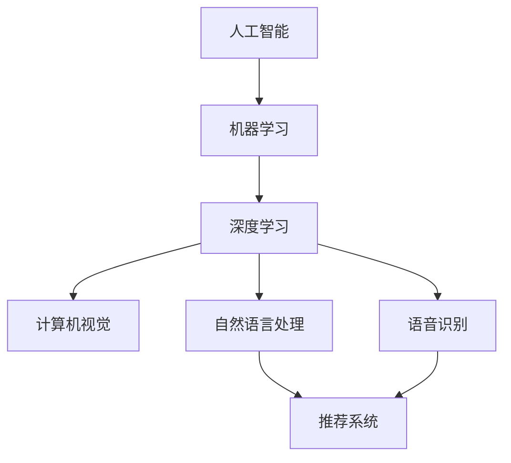

                 

## 1. 背景介绍

### 1.1 问题由来
在当今快速发展的科技时代，人工智能(AI)和机器学习(ML)技术的应用已经渗透到生活的各个方面。无论是自动驾驶、智能家居，还是医疗诊断、金融风控，AI工具都在背后默默支撑着这些高科技的实现。但随之而来的问题也越来越多，比如如何选择合适的AI工具？不同的任务需求是否有最优的解决方案？

### 1.2 问题核心关键点
选择合适的AI工具，不仅需要考虑工具的功能、性能和易用性，还需要考虑其在特定任务上的表现。通过了解不同工具的优缺点，以及它们在各个应用场景中的表现，可以帮助我们更好地选择适合自己的AI工具。

### 1.3 问题研究意义
选择适合自己的AI工具，是AI应用成功的关键。正确的工具能大幅提升开发效率，降低开发成本，提高模型性能和可靠性。选择不当则可能导致开发效率低下，模型性能不理想，甚至无法完成任务。

## 2. 核心概念与联系

### 2.1 核心概念概述

为了更好地理解如何选择适合自己的AI工具，本节将介绍几个密切相关的核心概念：

- **人工智能(AI)**：使用计算机模拟人类智能行为的技术，包括机器学习、计算机视觉、自然语言处理等。
- **机器学习(ML)**：通过数据训练模型，让机器自主学习规律，从而做出预测或决策的技术。
- **深度学习(Deep Learning)**：一种特殊类型的机器学习，使用多层神经网络模拟人脑神经元的工作方式，能够处理非结构化数据。
- **计算机视觉(Computer Vision)**：使计算机能够理解、解释、处理、分析、识别图像、视频等视觉数据的科学和技术。
- **自然语言处理(NLP)**：让计算机能够理解、处理、生成人类语言的技术。
- **语音识别(Speech Recognition)**：将语音转换成文本的技术。
- **推荐系统(Recommendation Systems)**：通过分析用户行为，推荐可能感兴趣的产品或内容的技术。

这些核心概念之间的逻辑关系可以通过以下Mermaid流程图来展示：



这个流程图展示了AI和ML之间的继承关系，以及ML在深度学习、计算机视觉、自然语言处理、语音识别和推荐系统中的应用。

## 3. 核心算法原理 & 具体操作步骤
### 3.1 算法原理概述

选择合适的AI工具，需要了解其背后的算法原理。不同的AI工具使用不同的算法模型和技术，因此需要了解它们的优势和劣势。以下是一些常见AI工具的算法原理概述：

- **机器学习**：包括监督学习、无监督学习、半监督学习等。监督学习使用标记数据训练模型，无监督学习使用未标记数据，半监督学习使用少量标记数据和大量未标记数据。
- **深度学习**：使用多层神经网络模拟人脑神经元的工作方式，能够处理非结构化数据，如图像、文本和语音。
- **计算机视觉**：使用卷积神经网络(CNN)等算法处理图像和视频数据，提取特征和语义信息。
- **自然语言处理**：使用循环神经网络(RNN)、长短期记忆网络(LSTM)、Transformer等算法处理文本数据，提取语义和句法信息。
- **语音识别**：使用深度神经网络、卷积神经网络和循环神经网络处理语音信号，将其转换为文本。
- **推荐系统**：使用协同过滤、内容推荐和混合推荐算法分析用户行为和偏好，推荐相关内容或产品。

### 3.2 算法步骤详解

选择合适的AI工具，需要了解其算法步骤和操作细节。以下是一些常见AI工具的算法步骤详解：

- **机器学习**：
  1. **数据准备**：收集和整理数据集，并将其分为训练集、验证集和测试集。
  2. **特征提取**：从数据集中提取特征，并将其转换为模型可接受的格式。
  3. **模型训练**：使用训练集训练模型，并使用验证集调整超参数。
  4. **模型评估**：使用测试集评估模型性能，并根据需要进行调优。
  5. **模型部署**：将训练好的模型部署到生产环境中，并持续监测其性能。

- **深度学习**：
  1. **数据准备**：收集和整理数据集，并将其分为训练集、验证集和测试集。
  2. **模型设计**：设计多层神经网络模型，并确定其结构。
  3. **模型训练**：使用训练集训练模型，并使用验证集调整超参数。
  4. **模型评估**：使用测试集评估模型性能，并根据需要进行调优。
  5. **模型部署**：将训练好的模型部署到生产环境中，并持续监测其性能。

- **计算机视觉**：
  1. **数据准备**：收集和整理图像或视频数据集，并将其分为训练集、验证集和测试集。
  2. **模型设计**：设计卷积神经网络模型，并确定其结构。
  3. **模型训练**：使用训练集训练模型，并使用验证集调整超参数。
  4. **模型评估**：使用测试集评估模型性能，并根据需要进行调优。
  5. **模型部署**：将训练好的模型部署到生产环境中，并持续监测其性能。

- **自然语言处理**：
  1. **数据准备**：收集和整理文本数据集，并将其分为训练集、验证集和测试集。
  2. **模型设计**：设计循环神经网络或Transformer等模型，并确定其结构。
  3. **模型训练**：使用训练集训练模型，并使用验证集调整超参数。
  4. **模型评估**：使用测试集评估模型性能，并根据需要进行调优。
  5. **模型部署**：将训练好的模型部署到生产环境中，并持续监测其性能。

### 3.3 算法优缺点

不同的AI工具有各自的优缺点，选择合适的工具需要综合考虑其优势和劣势。以下是一些常见AI工具的优缺点：

- **机器学习**：
  - **优点**：简单易用，适合小规模数据集，模型解释性好。
  - **缺点**：依赖数据质量，对特征工程要求高，容易过拟合。

- **深度学习**：
  - **优点**：适用于大规模数据集，模型表现优秀，能够处理非结构化数据。
  - **缺点**：模型复杂度高，计算资源消耗大，训练时间长。

- **计算机视觉**：
  - **优点**：适用于图像和视频数据处理，模型表现优秀，能够提取特征和语义信息。
  - **缺点**：模型复杂度高，计算资源消耗大，训练时间长。

- **自然语言处理**：
  - **优点**：适用于文本数据处理，模型表现优秀，能够提取语义和句法信息。
  - **缺点**：模型复杂度高，计算资源消耗大，训练时间长。

### 3.4 算法应用领域

不同的AI工具适用于不同的应用领域。以下是一些常见AI工具的应用领域：

- **机器学习**：
  - **应用领域**：分类、回归、聚类、推荐系统等。
  - **实际应用**：垃圾邮件过滤、信用评分、客户细分等。

- **深度学习**：
  - **应用领域**：图像识别、语音识别、自然语言处理、推荐系统等。
  - **实际应用**：人脸识别、语音助手、机器翻译、智能推荐等。

- **计算机视觉**：
  - **应用领域**：图像识别、目标检测、图像分割、医学影像分析等。
  - **实际应用**：自动驾驶、安防监控、医疗影像分析等。

- **自然语言处理**：
  - **应用领域**：文本分类、情感分析、命名实体识别、机器翻译等。
  - **实际应用**：智能客服、智能问答、文本摘要、智能推荐等。

## 4. 数学模型和公式 & 详细讲解 & 举例说明

### 4.1 数学模型构建

为了更好地理解如何选择适合自己的AI工具，本节将介绍几个密切相关的数学模型和公式。

假设我们选择了一个分类问题，使用机器学习算法进行建模。假设我们有一个训练集 $D=\{(x_i,y_i)\}_{i=1}^N$，其中 $x_i$ 是输入数据，$y_i$ 是输出标签。我们的目标是找到最优模型参数 $\theta$，使得模型在测试集上的预测准确率最高。

我们定义模型 $f(x;\theta)$ 为输入数据 $x$ 在模型参数 $\theta$ 下的输出结果。我们的目标是最小化模型在测试集上的预测错误率：

$$
\min_\theta \frac{1}{N}\sum_{i=1}^N I(y_i \neq f(x_i;\theta))
$$

其中 $I$ 是示性函数，当 $y_i = f(x_i;\theta)$ 时，$I(y_i \neq f(x_i;\theta))=0$，否则 $I(y_i \neq f(x_i;\theta))=1$。

### 4.2 公式推导过程

为了最小化预测错误率，我们需要使用梯度下降等优化算法来更新模型参数 $\theta$。具体步骤如下：

1. **定义损失函数**：我们需要定义一个损失函数，用于衡量模型预测与真实标签之间的差异。常用的损失函数包括交叉熵损失、均方误差损失等。

2. **计算梯度**：使用链式法则计算损失函数对模型参数 $\theta$ 的梯度。

3. **更新模型参数**：使用梯度下降算法更新模型参数 $\theta$。

4. **重复步骤 2 和 3，直至收敛**：重复上述步骤，直至模型参数收敛。

### 4.3 案例分析与讲解

假设我们有一个二分类问题，输入数据为文本，输出标签为正负样本。我们可以使用支持向量机(SVM)算法进行建模。SVM 的目标是最小化模型在训练集上的分类误差，同时最大化训练集和测试集之间的间隔。

我们定义模型 $f(x;\theta)$ 为输入数据 $x$ 在模型参数 $\theta$ 下的输出结果。我们的目标是最小化模型在训练集上的分类误差：

$$
\min_\theta \frac{1}{N}\sum_{i=1}^N I(y_i \neq f(x_i;\theta))
$$

其中 $I$ 是示性函数，当 $y_i = f(x_i;\theta)$ 时，$I(y_i \neq f(x_i;\theta))=0$，否则 $I(y_i \neq f(x_i;\theta))=1$。

我们定义损失函数 $L(\theta)$ 为：

$$
L(\theta) = \frac{1}{N}\sum_{i=1}^N I(y_i \neq f(x_i;\theta))
$$

定义正则化项 $R(\theta)$ 为：

$$
R(\theta) = \lambda \|\theta\|^2
$$

其中 $\lambda$ 是正则化系数。我们的目标是同时最小化损失函数 $L(\theta)$ 和正则化项 $R(\theta)$：

$$
\min_\theta L(\theta) + \alpha R(\theta)
$$

其中 $\alpha$ 是正则化系数。

## 5. 项目实践：代码实例和详细解释说明

### 5.1 开发环境搭建

在选择适合自己的AI工具之前，我们需要准备好开发环境。以下是使用Python进行TensorFlow开发的典型环境配置流程：

1. 安装Anaconda：从官网下载并安装Anaconda，用于创建独立的Python环境。

2. 创建并激活虚拟环境：
```bash
conda create -n tf-env python=3.8 
conda activate tf-env
```

3. 安装TensorFlow：根据CUDA版本，从官网获取对应的安装命令。例如：
```bash
conda install tensorflow=2.7.0 -c tf -c conda-forge
```

4. 安装各类工具包：
```bash
pip install numpy pandas scikit-learn matplotlib tqdm jupyter notebook ipython
```

完成上述步骤后，即可在`tf-env`环境中开始TensorFlow项目开发。

### 5.2 源代码详细实现

下面是使用TensorFlow实现一个简单的分类任务的示例代码：

```python
import tensorflow as tf
import numpy as np
import matplotlib.pyplot as plt

# 定义输入数据
x = np.array([0.2, 0.4, 0.6, 0.8, 1.0, 1.2, 1.4, 1.6, 1.8, 2.0])
y = np.array([0, 0, 1, 1, 1, 1, 1, 1, 0, 0])

# 定义模型参数
w = tf.Variable(np.random.randn(), name='w')
b = tf.Variable(np.random.randn(), name='b')

# 定义模型
def model(x):
    return x * w + b

# 定义损失函数
def loss(y, prediction):
    return tf.reduce_mean(tf.square(y - prediction))

# 定义优化器
optimizer = tf.optimizers.Adam(learning_rate=0.01)

# 训练模型
def train():
    for i in range(100):
        optimizer.minimize(loss(y, model(x)), var_list=[w, b])
        if i % 10 == 0:
            print("Iteration %d, Loss: %f" % (i, loss(y, model(x)).numpy()))

# 训练模型
train()

# 绘制学习曲线
plt.plot(x, model(x), label='Line')
plt.scatter(x, y, color='r', label='Data')
plt.legend()
plt.show()
```

### 5.3 代码解读与分析

让我们再详细解读一下关键代码的实现细节：

- **输入数据**：定义输入数据 $x$ 和输出标签 $y$。

- **模型参数**：定义模型参数 $w$ 和 $b$。

- **模型**：定义模型函数 $model(x)$，使用线性模型对输入数据进行预测。

- **损失函数**：定义损失函数 $loss(y, prediction)$，使用均方误差计算预测值与真实值之间的差异。

- **优化器**：定义优化器 $optimizer$，使用Adam算法进行模型参数更新。

- **训练模型**：定义训练函数 $train()$，使用梯度下降算法对模型进行训练，并在每10次迭代后输出损失值。

- **绘制学习曲线**：使用Matplotlib绘制学习曲线，展示模型在训练过程中的性能。

## 6. 实际应用场景

### 6.1 智能客服系统

基于AI的智能客服系统，可以通过机器学习和深度学习技术，自动回答客户咨询，提升客户体验和满意度。具体实现时，可以收集历史客服对话记录，使用自然语言处理技术进行文本分析，然后使用分类模型或生成模型进行客户意图识别和回复生成。

### 6.2 金融舆情监测

金融领域需要实时监测舆情动向，以规避风险。可以使用自然语言处理技术，对新闻、报道、评论等文本数据进行情感分析和主题分类，然后使用分类模型或序列模型进行舆情监测。

### 6.3 个性化推荐系统

推荐系统可以根据用户的历史行为和偏好，推荐相关产品或内容。可以使用协同过滤、内容推荐或混合推荐算法，结合机器学习和深度学习技术，构建推荐系统。

### 6.4 未来应用展望

未来，AI工具将广泛应用于更多领域，如智慧医疗、智能家居、智能交通等。随着技术的不断进步，AI工具将变得更加智能和普适，能够更好地满足不同场景的需求。

## 7. 工具和资源推荐

### 7.1 学习资源推荐

为了帮助开发者系统掌握AI工具的原理和实践技巧，这里推荐一些优质的学习资源：

1. **TensorFlow官方文档**：TensorFlow的官方文档，提供了丰富的教程和API文档，是学习TensorFlow的好资源。

2. **PyTorch官方文档**：PyTorch的官方文档，提供了详细的教程和API文档，是学习PyTorch的好资源。

3. **深度学习课程**：斯坦福大学和Coursera上的深度学习课程，提供了全面的理论知识和实践技巧。

4. **自然语言处理课程**：斯坦福大学的自然语言处理课程，提供了自然语言处理的理论知识和实践技巧。

5. **计算机视觉课程**：斯坦福大学的计算机视觉课程，提供了计算机视觉的理论知识和实践技巧。

### 7.2 开发工具推荐

选择适合自己的AI工具，还需要使用一些高效的开发工具。以下是一些常用的开发工具：

1. **TensorFlow**：由Google主导开发的深度学习框架，适用于大规模工程应用。

2. **PyTorch**：由Facebook主导开发的深度学习框架，适用于研究和实验。

3. **Jupyter Notebook**：一个交互式编程环境，适合进行数据处理和模型调试。

4. **Matplotlib**：一个绘图库，适合绘制学习曲线和模型评估图。

5. **TensorBoard**：一个可视化工具，适合监控模型训练状态。

### 7.3 相关论文推荐

AI工具的发展源于学界的持续研究。以下是几篇奠基性的相关论文，推荐阅读：

1. **深度学习**：《ImageNet Classification with Deep Convolutional Neural Networks》（Hinton等，2012）。

2. **计算机视觉**：《Caffe: Convolutional Architecture for Fast Model Training》（Jia等，2014）。

3. **自然语言处理**：《Attention is All You Need》（Vaswani等，2017）。

4. **语音识别**：《Deep Speech 2: End-to-End Speech Recognition in English and Mandarin》（Hinton等，2015）。

5. **推荐系统**：《Trustworthy Online Recommendation: Algorithmic Foundations and Principles》（Chen等，2011）。

这些论文代表了大规模AI工具的研究方向，通过学习这些前沿成果，可以帮助研究者把握学科前进方向，激发更多的创新灵感。

## 8. 总结：未来发展趋势与挑战

### 8.1 总结

本文对如何选择适合自己的AI工具进行了全面系统的介绍。首先阐述了AI工具的研究背景和意义，明确了选择工具的优势和劣势。其次，从原理到实践，详细讲解了机器学习、深度学习、计算机视觉、自然语言处理等AI工具的算法原理和操作步骤。同时，本文还探讨了AI工具在智能客服、金融舆情监测、个性化推荐等多个领域的应用前景，展示了AI工具的广泛应用潜力。此外，本文精选了AI工具的学习资源和开发工具，力求为读者提供全方位的技术指引。

通过本文的系统梳理，可以看到，AI工具在各个领域都有广泛的应用，但不同的AI工具适用于不同的应用场景。选择合适的AI工具，需要综合考虑其优势和劣势，并根据具体应用场景进行灵活选择。只有选择合适的AI工具，才能更好地提升开发效率，降低开发成本，提高模型性能和可靠性。

### 8.2 未来发展趋势

未来，AI工具将呈现出以下几个发展趋势：

1. **模型规模持续增大**：随着算力成本的下降和数据规模的扩张，预训练语言模型的参数量还将持续增长。超大规模语言模型蕴含的丰富语言知识，将支撑更加复杂多变的下游任务。

2. **模型鲁棒性提升**：未来AI工具将更加注重模型鲁棒性的提升，通过对抗训练、正则化等技术，增强模型对数据噪声和攻击的抵抗能力。

3. **模型通用性增强**：未来AI工具将更加注重模型通用性的提升，通过跨领域迁移学习和多模态融合，构建更加全面、准确的信息整合能力。

4. **模型解释性增强**：未来AI工具将更加注重模型解释性的增强，通过可解释性工具和逻辑推理，增强模型的可解释性和可信度。

5. **模型自动化增强**：未来AI工具将更加注重模型的自动化，通过自动调参、自动化生成等技术，提高模型的开发效率和应用便捷性。

6. **模型安全性提升**：未来AI工具将更加注重模型的安全性，通过隐私保护、数据脱敏等技术，保护数据和模型的安全。

以上趋势凸显了AI工具的广阔前景。这些方向的探索发展，将进一步提升AI工具的性能和应用范围，为构建人机协同的智能系统铺平道路。

### 8.3 面临的挑战

尽管AI工具已经取得了瞩目成就，但在迈向更加智能化、普适化应用的过程中，它仍面临诸多挑战：

1. **数据依赖**：AI工具需要大量高质量的数据进行训练，对于小样本数据和长尾数据，模型性能可能会受到影响。

2. **模型复杂性**：AI工具的模型结构复杂，对于计算资源和内存消耗要求较高，需要优化模型结构和训练过程。

3. **模型泛化性**：AI工具的泛化性能较差，对于测试数据和新数据的适应性较差。

4. **模型可解释性**：AI工具的模型复杂度高，难以解释其内部工作机制和决策逻辑。

5. **模型安全性**：AI工具的模型可能存在偏见和歧视，需要采取措施保障模型安全性和公正性。

6. **模型计算效率**：AI工具的计算效率较低，需要优化模型结构和推理过程，提高模型性能。

7. **模型可靠性**：AI工具的模型可能存在漏洞，需要采取措施保障模型的可靠性和稳定性。

以上挑战凸显了AI工具的复杂性和多面性。只有不断优化模型结构和训练过程，才能真正实现AI工具的智能化和普适化。

### 8.4 研究展望

未来，AI工具的研究方向将不断拓展，涉及更加复杂多变的应用场景和更加多样化的数据类型。以下是一些可能的研究方向：

1. **多模态融合**：将视觉、语音、文本等多种数据类型融合，构建更加全面、准确的信息整合能力。

2. **跨领域迁移学习**：将一个领域学到的知识迁移到另一个领域，提升模型泛化性能和适应性。

3. **因果推理**：将因果推断引入AI工具，提升模型的解释性和可信度。

4. **自动化调参**：通过自动化调参技术，提高模型的开发效率和应用便捷性。

5. **隐私保护**：通过隐私保护技术，保障数据和模型的安全。

6. **模型压缩**：通过模型压缩技术，提高模型的计算效率和存储空间。

这些研究方向将进一步提升AI工具的性能和应用范围，为构建人机协同的智能系统铺平道路。

## 9. 附录：常见问题与解答

### Q1：如何选择适合自己的AI工具？

A：选择合适的AI工具，需要考虑以下因素：

1. **任务需求**：根据具体任务的需求，选择适合的AI工具。例如，对于文本分类任务，可以选择BERT或LSTM等模型。

2. **数据质量**：选择高质量的数据集，确保AI工具能够得到良好的训练效果。

3. **计算资源**：根据计算资源和硬件设备，选择适合的AI工具。例如，对于深度学习任务，需要选择GPU或TPU等高性能设备。

4. **开发效率**：根据开发效率和工程实践，选择适合的AI工具。例如，对于小规模任务，可以选择轻量级模型和框架。

5. **性能要求**：根据性能要求和应用场景，选择适合的AI工具。例如，对于实时应用，需要选择性能稳定的AI工具。

### Q2：AI工具在实际应用中需要注意哪些问题？

A：AI工具在实际应用中需要注意以下问题：

1. **数据隐私**：保护用户数据隐私，防止数据泄露和滥用。

2. **模型公正性**：确保模型的公正性，避免模型偏见和歧视。

3. **模型可靠性和鲁棒性**：确保模型的可靠性和鲁棒性，避免模型漏洞和攻击。

4. **模型可解释性**：增强模型的可解释性，提高模型的可信度和应用便捷性。

5. **模型自动化**：提高模型的自动化水平，减少人工干预和调试。

6. **模型计算效率**：提高模型的计算效率，降低计算成本和时间。

7. **模型性能优化**：优化模型的性能，提高模型的精度和鲁棒性。

### Q3：如何选择高效的开发工具？

A：选择高效的开发工具，需要考虑以下因素：

1. **易用性**：选择易用的工具，提高开发效率和便捷性。

2. **功能丰富性**：选择功能丰富的工具，满足开发需求和应用场景。

3. **性能表现**：选择高性能的工具，提高开发效率和应用性能。

4. **社区支持**：选择社区活跃的工具，获得更多的支持和资源。

5. **扩展性**：选择扩展性好的工具，方便未来的扩展和升级。

6. **生态系统**：选择生态系统完善的工具，方便与其他工具和框架的集成和协作。

### Q4：如何选择学习资源？

A：选择学习资源，需要考虑以下因素：

1. **内容质量**：选择高质量的资源，涵盖丰富的理论知识和实践技巧。

2. **资源全面性**：选择全面的资源，涵盖各个领域的AI工具和应用场景。

3. **实践机会**：选择提供实践机会的资源，通过实际操作提升开发技能。

4. **学习平台**：选择易于学习、互动性强的平台，提高学习效果和体验。

5. **社区支持**：选择社区活跃的平台，获得更多的支持和资源。

6. **更新频率**：选择更新频率高的平台，及时获取最新的技术和知识。

### Q5：如何选择相关论文？

A：选择相关论文，需要考虑以下因素：

1. **领域相关性**：选择与领域相关的论文，涵盖研究前沿和最新成果。

2. **引用次数**：选择引用次数高的论文，确保其权威性和可靠性。

3. **研究方法**：选择研究方法科学、严谨的论文，避免误导性研究。

4. **应用场景**：选择应用场景符合实际需求和应用场景的论文，确保其适用性和可行性。

5. **研究结论**：选择结论清晰、可行的论文，避免误导性结论。

6. **研究前景**：选择研究前景广阔的论文，获得更多的创新灵感和研究方向。

作者：禅与计算机程序设计艺术 / Zen and the Art of Computer Programming

