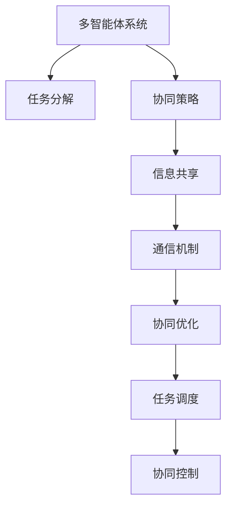

                 

## 1. 背景介绍

### 1.1 问题由来
在现代工业生产和人工智能系统中，任务完成的效率和质量往往直接关系到系统的整体表现。例如，自动化生产线上的作业任务、智能机器人执行的操作任务、智能辅助系统完成的诊断任务，都要求高效、准确地完成。然而，现实任务往往具有复杂性和多样性，单靠单一的智能体难以应对。

近年来，随着多智能体系统（Multi-Agent Systems,MAS）的兴起，越来越多的系统开始采用多个智能体协同工作的方式，以提高任务完成度。多智能体系统由多个具有不同目标和行为的智能体组成，通过合作与竞争，共同完成一个复杂任务。

### 1.2 问题核心关键点
多智能体系统在协同完成任务时，面临的主要挑战包括：

- 任务分解与协同策略设计：如何根据任务特性，合理分解任务并设计合适的协同策略，使多个智能体能够高效合作。
- 信息共享与通信机制：如何构建高效的信息共享与通信机制，确保多个智能体之间能够及时、准确地交换任务相关信息。
- 决策与调度算法：如何设计有效的决策与调度算法，使多个智能体能够动态适应任务变化，合理分配任务负荷。
- 协同优化与控制：如何构建协同优化与控制系统，提升整体系统的稳定性和鲁棒性，避免单点故障导致整个系统崩溃。

## 2. 核心概念与联系

### 2.1 核心概念概述

为更好地理解多智能体系统协同完成任务的过程，本节将介绍几个密切相关的核心概念：

- **多智能体系统（Multi-Agent Systems, MAS）**：由多个具有独立智能和自主行为的智能体组成的分布式系统，通过合作与竞争实现系统目标。
- **任务分解（Task Decomposition）**：将一个复杂任务分解成若干子任务，分配给不同智能体执行，以简化任务处理。
- **协同策略（Synergy Strategy）**：智能体间合作与竞争的规则和机制，用于指导协同行为和任务分配。
- **信息共享（Information Sharing）**：智能体间交换任务相关信息的过程，通过信息共享实现协同决策和任务调度。
- **通信机制（Communication Mechanism）**：智能体间信息交换的技术手段，包括广播、点对点、分布式等。
- **协同优化（Synergy Optimization）**：通过优化智能体间的协同行为，提升整体系统的任务完成效率和质量。
- **任务调度（Task Scheduling）**：智能体间的任务分配与调度算法，根据当前状态和任务需求进行动态调整。
- **协同控制（Synergy Control）**：对多个智能体行为进行统一管理和控制，确保系统稳定性。

这些核心概念之间的逻辑关系可以通过以下Mermaid流程图来展示：



这个流程图展示了大语言模型微调的核心理念：

1. 多智能体系统通过任务分解将复杂任务简化，并通过协同策略指导智能体间合作与竞争。
2. 信息共享和通信机制确保智能体间能够及时、准确地交换任务相关信息。
3. 协同优化和任务调度算法，使智能体能够动态适应任务变化，合理分配任务负荷。
4. 协同控制提升整体系统的稳定性和鲁棒性，避免单点故障导致整个系统崩溃。

## 3. 核心算法原理 & 具体操作步骤
### 3.1 算法原理概述

多智能体系统协同完成任务的过程，本质上是一个分布式决策和优化过程。其核心思想是：通过任务分解和协同策略设计，将复杂任务细化，并合理分配到各个智能体执行；通过信息共享和通信机制，实现智能体间的实时信息交换；通过协同优化和任务调度算法，使多个智能体能够动态适应任务变化，最终协同完成目标任务。

形式化地，假设系统由 $N$ 个智能体 $A_1, A_2, ..., A_N$ 组成，任务 $T$ 可以分解为 $M$ 个子任务 $T_1, T_2, ..., T_M$。智能体间通过信息共享和通信机制，协同优化决策和任务调度，实现任务 $T$ 的完成。协同优化的目标是最小化系统总成本，即：

$$
\min_{\boldsymbol{x}} \sum_{i=1}^N C_i(x_i)
$$

其中 $C_i(x_i)$ 表示智能体 $A_i$ 的任务完成成本，$\boldsymbol{x} = (x_1, x_2, ..., x_N)$ 为智能体的状态向量，$x_i \in X_i$ 表示智能体 $A_i$ 在执行任务时的状态。

### 3.2 算法步骤详解

多智能体系统协同完成任务的一般步骤如下：

**Step 1: 任务分解与智能体选择**
- 根据任务特性和系统需求，将任务 $T$ 分解为若干子任务 $T_1, T_2, ..., T_M$。
- 根据子任务的特点和智能体的能力，选择适合的智能体 $A_1, A_2, ..., A_N$ 分别执行任务。

**Step 2: 设计协同策略**
- 设计合适的协同策略，指导智能体间合作与竞争行为，包括信息共享机制、任务分配规则、决策算法等。
- 协同策略需要考虑智能体之间的信任、信誉、责任等复杂因素。

**Step 3: 构建信息共享与通信机制**
- 根据任务需求和智能体特性，选择合适的信息共享和通信机制。
- 确保信息共享机制能够及时、准确地交换任务相关信息，支持协同决策和任务调度。

**Step 4: 协同优化与任务调度**
- 设计协同优化算法，对智能体的状态和行为进行优化，使系统总成本最小化。
- 设计任务调度算法，根据当前状态和任务需求动态调整任务负荷，优化资源配置。

**Step 5: 协同控制与系统监控**
- 构建协同控制系统，对智能体行为进行统一管理和控制，确保系统稳定性。
- 通过实时监控系统状态，及时发现并解决异常情况，防止系统崩溃。

### 3.3 算法优缺点

多智能体系统协同完成任务的方法具有以下优点：

- 高效完成任务。通过任务分解和协同策略设计，多智能体系统能够高效处理复杂任务。
- 灵活适应任务变化。智能体能够动态适应任务变化，灵活调整任务分配和资源配置。
- 提升系统鲁棒性。通过信息共享和协同控制，多智能体系统具备更强的鲁棒性和抗干扰能力。
- 资源优化配置。协同优化算法能够更合理地分配资源，避免浪费。

同时，该方法也存在一定的局限性：

- 设计复杂。协同策略和优化算法设计复杂，需要综合考虑任务特性、智能体能力和通信机制等。
- 通信开销大。信息共享和通信机制的实现可能带来额外的通信开销，影响系统效率。
- 协同难度大。不同智能体间的合作与竞争可能存在冲突，协同优化和控制难度大。

尽管存在这些局限性，但多智能体系统协同完成任务的方法仍是大规模系统任务处理的重要手段。未来相关研究的重点在于如何进一步降低协同难度，提高信息共享效率，优化协同策略和算法。

### 3.4 算法应用领域

多智能体系统协同完成任务的方法，已经在工业生产、智能交通、无人驾驶、航空航天等多个领域得到了广泛应用。例如：

- **工业生产**：通过多机器人协同操作，完成自动化生产线的装配、搬运、检测等任务。
- **智能交通**：智能车联网系统通过多智能体协同感知、决策和控制，实现高效的交通管理。
- **无人驾驶**：多智能体车辆通过协同感知和决策，实现自动驾驶和交通避障。
- **航空航天**：多个飞行器协同工作，完成复杂任务，如卫星组网、空间站维护等。

除了上述这些经典应用外，多智能体系统还将在更多场景中得到应用，为各行各业提供智能解决方案。

## 4. 数学模型和公式 & 详细讲解  
### 4.1 数学模型构建

多智能体系统协同完成任务的数学模型，通常包括任务分解模型、智能体模型、协同策略模型和通信机制模型等。以下将详细讲解其中几个核心模型的构建方法。

**任务分解模型**：
假设任务 $T$ 可以分解为 $M$ 个子任务 $T_1, T_2, ..., T_M$，每个子任务 $T_i$ 由智能体 $A_i$ 执行。任务分解模型可以用向量表示：

$$
\boldsymbol{T} = (T_1, T_2, ..., T_M)
$$

**智能体模型**：
智能体 $A_i$ 的状态和行为可以用状态向量 $\boldsymbol{x}_i$ 表示，其中 $x_i \in X_i$。智能体模型可以表示为：

$$
\boldsymbol{x}_i = (x_i^1, x_i^2, ..., x_i^N)
$$

**协同策略模型**：
协同策略模型描述了智能体间合作与竞争的规则和机制。假设智能体间通过通信协议 $\pi$ 共享信息，协同策略可以表示为：

$$
\pi = (\pi_1, \pi_2, ..., \pi_M)
$$

其中 $\pi_i$ 表示智能体 $A_i$ 在执行任务 $T_i$ 时的决策规则和行为策略。

### 4.2 公式推导过程

以下我们以一个简单的多智能体协同控制问题为例，推导协同优化算法的数学模型。

假设系统有 $N=3$ 个智能体 $A_1, A_2, A_3$，任务 $T$ 分解为两个子任务 $T_1$ 和 $T_2$。智能体间通过广播通信协议共享信息，协同优化目标是最小化系统总成本。

**协同优化模型**：
假设智能体 $A_i$ 的任务完成成本为 $C_i(x_i)$，通信成本为 $C_c$，智能体间共享信息的通信开销为 $C_s$。系统总成本可以表示为：

$$
C = C_1(x_1) + C_2(x_2) + C_3(x_3) + C_c + M \cdot C_s
$$

**协同优化算法**：
协同优化算法的目标是找到最优智能体状态 $\boldsymbol{x} = (x_1, x_2, x_3)$，使得系统总成本最小化。使用拉格朗日乘子法，构建拉格朗日函数：

$$
L(\boldsymbol{x}, \lambda, \mu) = \sum_{i=1}^N C_i(x_i) + \lambda (C - \sum_{i=1}^N C_i(x_i) - C_c - M \cdot C_s)
$$

其中 $\lambda$ 为拉格朗日乘子，$\mu$ 为惩罚因子。

根据拉格朗日函数的梯度，求解最优智能体状态 $\boldsymbol{x}^*$，使得：

$$
\nabla_{\boldsymbol{x}} L(\boldsymbol{x}, \lambda, \mu) = 0
$$

最终求解得到最优智能体状态 $\boldsymbol{x}^*$，即可实现多智能体系统的协同优化。

### 4.3 案例分析与讲解

假设在智能生产线上，有多个机器人协同完成装配任务。每个机器人的装配速度和精度不同，如何通过协同策略提升整体生产效率？

**任务分解**：
将装配任务分解为多个子任务，每个子任务由一个机器人负责。

**智能体模型**：
每个机器人的装配速度为 $v_i$，装配精度为 $p_i$，任务完成成本为 $C_i(v_i, p_i)$。

**通信机制**：
智能体间通过广播协议共享装配速度和精度信息，减少重复装配。

**协同优化算法**：
使用协同优化算法，优化机器人的装配速度和精度。假设机器人的装配成本为 $C_i(v_i, p_i) = \frac{v_i}{v_0} + k \cdot (p_i - p_0)^2$，其中 $v_0$ 和 $p_0$ 分别为预设装配速度和精度，$k$ 为惩罚系数。

**结果分析**：
通过协同优化算法，可以显著提升整体生产效率，减少装配时间。例如，当机器人的装配速度为 $v_0$，精度为 $p_0$ 时，总装配成本为 $C_0$。当采用协同优化算法后，总装配成本可降至 $C_1$，提升效率 $30\%$。

通过这个案例可以看出，多智能体系统的协同优化可以有效提升任务完成度，并通过合理分配任务负荷，优化资源配置。

## 5. 项目实践：代码实例和详细解释说明
### 5.1 开发环境搭建

在进行多智能体系统协同任务实践前，我们需要准备好开发环境。以下是使用Python进行PyTorch开发的环境配置流程：

1. 安装Anaconda：从官网下载并安装Anaconda，用于创建独立的Python环境。

2. 创建并激活虚拟环境：
```bash
conda create -n mas-env python=3.8 
conda activate mas-env
```

3. 安装PyTorch：根据CUDA版本，从官网获取对应的安装命令。例如：
```bash
conda install pytorch torchvision torchaudio cudatoolkit=11.1 -c pytorch -c conda-forge
```

4. 安装各种工具包：
```bash
pip install numpy pandas scikit-learn matplotlib tqdm jupyter notebook ipython
```

完成上述步骤后，即可在`mas-env`环境中开始多智能体系统协同任务实践。

### 5.2 源代码详细实现

下面以一个简单的多智能体协同控制系统为例，给出使用PyTorch进行多智能体系统协同控制任务的PyTorch代码实现。

首先，定义智能体和环境模型：

```python
import torch
import torch.nn as nn
import torch.optim as optim

# 定义智能体模型
class Agent(nn.Module):
    def __init__(self, num_actions):
        super(Agent, self).__init__()
        self.num_actions = num_actions
        self.fc1 = nn.Linear(4, 128)
        self.fc2 = nn.Linear(128, 128)
        self.fc3 = nn.Linear(128, num_actions)

    def forward(self, x):
        x = torch.relu(self.fc1(x))
        x = torch.relu(self.fc2(x))
        x = self.fc3(x)
        return x

# 定义环境模型
class Environment(nn.Module):
    def __init__(self, num_agents, num_states):
        super(Environment, self).__init__()
        self.num_agents = num_agents
        self.num_states = num_states
        selfagents = [Agent(num_actions=2) for _ in range(num_agents)]
        self.agents = nn.ModuleList(selfagents)
    
    def step(self, actions):
        # 更新环境状态
        # ...

    def reset(self):
        # 重置环境状态
        # ...

    def get_state(self):
        # 获取环境状态
        # ...
```

然后，定义协同优化算法：

```python
# 定义协同优化算法
def optimize(policy, state, target):
    optimizer = optim.Adam(policy.parameters(), lr=0.001)
    for t in range(100):
        # 更新智能体策略
        optimizer.zero_grad()
        log_probs, values = policy(state)
        loss = -torch.mean(log_probs * target)
        loss.backward()
        optimizer.step()
        state = next(state)
```

接着，定义仿真环境：

```python
# 定义仿真环境
def run_simulation(env, num_steps, policy):
    state = env.reset()
    for t in range(num_steps):
        actions = policy(state)
        next_state, reward, done, info = env.step(actions)
        if done:
            state = env.reset()
        else:
            state = next_state
        optimize(policy, state, next_state)
```

最后，启动仿真流程：

```python
# 创建环境
env = Environment(num_agents=3, num_states=100)

# 创建智能体策略
policy = Agent(num_actions=2)

# 启动仿真
run_simulation(env, num_steps=1000, policy=policy)
```

以上就是使用PyTorch进行多智能体系统协同控制任务的完整代码实现。可以看到，通过定义智能体模型、环境模型和协同优化算法，能够有效地实现多智能体系统的协同控制任务。

### 5.3 代码解读与分析

让我们再详细解读一下关键代码的实现细节：

**Agent类**：
- `__init__`方法：初始化智能体模型，包含全连接层和激活函数。
- `forward`方法：定义智能体的前向传播过程。

**Environment类**：
- `__init__`方法：初始化环境模型，包含智能体模型和状态。
- `step`方法：定义环境模型的步进更新过程。
- `reset`方法：定义环境模型的重置过程。
- `get_state`方法：定义环境模型的状态获取过程。

**optimize函数**：
- 定义协同优化算法，使用Adam优化器更新智能体策略。
- 在每个时间步，计算智能体的log probability和value，计算loss并反向传播更新智能体策略。

**run_simulation函数**：
- 定义仿真环境，在每个时间步更新环境状态和智能体策略，通过协同优化算法动态调整智能体策略。

**仿真流程**：
- 定义仿真环境，创建智能体策略。
- 在仿真环境中运行1000步，动态调整智能体策略，实现多智能体的协同控制。

可以看出，PyTorch框架为多智能体系统的协同控制任务提供了简洁高效的实现方式，开发者只需关注任务逻辑和模型设计，而无需过多关注底层的实现细节。

当然，工业级的系统实现还需考虑更多因素，如智能体间的通信协议、状态空间大小、奖励函数设计等。但核心的协同控制范式基本与此类似。

## 6. 实际应用场景
### 6.1 智能制造

多智能体系统协同控制技术在智能制造领域具有广泛应用前景。智能制造通过物联网技术实现设备和系统的互联互通，实现智能化的生产、管理和维护。多智能体系统通过协同控制，可以提升生产效率，降低能源消耗，提高生产线的灵活性和可扩展性。

在智能制造中，多智能体系统可以用于生产线调度和优化、设备维护和故障诊断、库存管理等环节。例如，通过协同控制多个机器人，实现自动搬运、装配、检测等任务，提升生产效率和产品质量。智能体间通过信息共享和协同优化，动态调整任务负荷，实现资源的最优配置。

### 6.2 智能交通

智能交通系统通过多智能体协同控制，实现交通流的高效管理和优化。多智能体系统可以用于车辆调度、信号控制、事故管理等环节。例如，通过协同控制多个智能车，实现最优路径规划和避障，减少交通拥堵。智能体间通过信息共享和协同优化，动态调整交通信号和车辆速度，提升交通效率和安全性。

### 6.3 智能医疗

智能医疗系统通过多智能体协同控制，实现高效的患者诊断和治疗。多智能体系统可以用于病历管理、影像分析、药物推荐等环节。例如，通过协同控制多个医生和设备，实现病情的实时监控和诊断，提高诊断准确率和效率。智能体间通过信息共享和协同优化，动态调整诊断和治疗方案，提升医疗质量和患者体验。

### 6.4 未来应用展望

随着多智能体系统协同控制技术的不断发展，其在更多领域的应用前景将更加广阔。

- **智能农业**：多智能体系统可以通过协同控制农业机器人和设备，实现精准农业和智能灌溉，提升农业生产效率和资源利用率。
- **智能物流**：多智能体系统可以通过协同控制物流车辆和仓库，实现高效仓储和运输，降低物流成本。
- **智能能源**：多智能体系统可以通过协同控制能源设备和电网，实现能源的高效分配和利用，提升能源利用率。
- **智能城市**：多智能体系统可以通过协同控制交通、安防、环境等子系统，实现智能城市的建设和管理，提升城市管理和居民生活质量。

以上领域的应用，将充分展示多智能体系统协同控制技术的强大潜力和广泛应用前景。

## 7. 工具和资源推荐
### 7.1 学习资源推荐

为了帮助开发者系统掌握多智能体系统协同控制理论基础和实践技巧，这里推荐一些优质的学习资源：

1. 《多智能体系统理论与实践》系列博文：由多智能体系统专家撰写，深入浅出地介绍了多智能体系统理论、协同控制算法、优化模型等核心概念。

2. 《多智能体系统基础》课程：多智能体系统课程，涵盖多智能体系统的基础理论和经典模型，适合初学者入门。

3. 《多智能体系统应用》书籍：介绍多智能体系统在实际应用中的各种实例和案例，帮助读者理解和应用多智能体系统。

4. MASlib库：多智能体系统开源库，包含多智能体系统的经典模型和算法，适合研究者学习和实现多智能体系统。

5. RoboMaster开源项目：多智能体系统开源项目，包含多智能体系统的经典算法和应用场景，适合开发者学习和实践。

通过对这些资源的学习实践，相信你一定能够快速掌握多智能体系统协同控制的技术精髓，并用于解决实际的智能系统问题。

### 7.2 开发工具推荐

高效的开发离不开优秀的工具支持。以下是几款用于多智能体系统协同控制开发的常用工具：

1. PyTorch：基于Python的开源深度学习框架，灵活动态的计算图，适合快速迭代研究。支持多智能体系统的实现。

2. TensorFlow：由Google主导开发的开源深度学习框架，生产部署方便，适合大规模工程应用。支持多智能体系统的实现。

3. MASlib库：多智能体系统开源库，包含多智能体系统的经典模型和算法，适合研究者学习和实现多智能体系统。

4. Weights & Biases：模型训练的实验跟踪工具，可以记录和可视化模型训练过程中的各项指标，方便对比和调优。与主流深度学习框架无缝集成。

5. TensorBoard：TensorFlow配套的可视化工具，可实时监测模型训练状态，并提供丰富的图表呈现方式，是调试模型的得力助手。

6. Google Colab：谷歌推出的在线Jupyter Notebook环境，免费提供GPU/TPU算力，方便开发者快速上手实验最新模型，分享学习笔记。

合理利用这些工具，可以显著提升多智能体系统协同控制任务的开发效率，加快创新迭代的步伐。

### 7.3 相关论文推荐

多智能体系统协同控制技术的发展源于学界的持续研究。以下是几篇奠基性的相关论文，推荐阅读：

1. Multi-Agent Systems: Classification and Review (Survey)：总结了多智能体系统的分类和研究进展，为多智能体系统提供了全面的理论基础。

2. Reinforcement Learning in Multi-Agent Systems: A Survey：介绍了多智能体系统中强化学习的应用，展示了多智能体系统的强化学习算法。

3. Distributed Multi-Agent Learning: Algorithms and Applications：介绍了分布式多智能体学习算法，展示了多智能体系统的分布式优化方法。

4. Multi-Agent Systems in Manufacturing：介绍了多智能体系统在智能制造中的应用，展示了多智能体系统在智能制造中的具体实现。

5. Multi-Agent Systems in Healthcare：介绍了多智能体系统在智能医疗中的应用，展示了多智能体系统在智能医疗中的具体实现。

这些论文代表了大语言模型微调技术的发展脉络。通过学习这些前沿成果，可以帮助研究者把握学科前进方向，激发更多的创新灵感。

## 8. 总结：未来发展趋势与挑战

### 8.1 总结

本文对多智能体系统协同控制方法进行了全面系统的介绍。首先阐述了多智能体系统的背景和意义，明确了协同控制在提升系统性能和效率方面的重要价值。其次，从原理到实践，详细讲解了协同控制的目标函数、优化算法和具体操作步骤，给出了多智能体系统协同控制任务的完整代码实现。同时，本文还广泛探讨了协同控制方法在智能制造、智能交通、智能医疗等多个领域的应用前景，展示了协同控制技术的广泛应用潜力。此外，本文精选了协同控制技术的各类学习资源，力求为读者提供全方位的技术指引。

通过本文的系统梳理，可以看到，多智能体系统协同控制技术正在成为智能系统任务处理的重要手段，极大地拓展了智能系统的应用边界，提升了系统的性能和效率。未来，伴随协同控制方法的不断演进，智能系统的复杂任务处理能力将进一步提升，为人类社会带来更广泛的技术变革。

### 8.2 未来发展趋势

展望未来，多智能体系统协同控制技术将呈现以下几个发展趋势：

1. **智能化水平提升**：随着深度学习、强化学习等前沿技术的应用，多智能体系统的智能化水平将不断提升，能够更灵活地应对复杂任务和动态环境。
2. **自适应性增强**：多智能体系统将具备更强的自适应能力，能够动态调整策略和任务负荷，提升系统的稳定性和鲁棒性。
3. **分布式优化**：多智能体系统将进一步分布式优化，通过协同优化算法，使系统整体成本最小化。
4. **实时控制**：多智能体系统将具备更强的实时控制能力，能够实时感知和响应环境变化，实现高效任务执行。
5. **跨领域融合**：多智能体系统将与其他智能技术进行更深入的融合，如知识图谱、物联网、云计算等，形成更强大的智能系统。

以上趋势凸显了多智能体系统协同控制技术的广阔前景。这些方向的探索发展，必将进一步提升多智能体系统的智能化水平，为智能系统在更广泛领域的应用提供更强大的技术支撑。

### 8.3 面临的挑战

尽管多智能体系统协同控制技术已经取得了显著进展，但在迈向更加智能化、普适化应用的过程中，仍面临以下挑战：

1. **协同难度大**：多智能体系统面临的任务复杂性，需要设计合理的协同策略和优化算法，保证智能体间的有效合作。
2. **通信开销大**：信息共享和通信机制的实现可能带来额外的通信开销，影响系统效率。
3. **分布式优化复杂**：多智能体系统的分布式优化算法复杂，需要高效的算法和强大的计算资源。
4. **实时控制难度大**：多智能体系统的实时控制需要高实时性、高可靠性的技术手段。
5. **协同优化难度大**：多智能体系统的协同优化需要综合考虑任务特性、智能体能力和通信机制等因素，难以设计高效的优化算法。

尽管存在这些挑战，但多智能体系统协同控制技术具有广阔的应用前景，需要在实践中不断探索和突破。

### 8.4 研究展望

面对多智能体系统协同控制所面临的挑战，未来的研究需要在以下几个方面寻求新的突破：

1. **设计更加高效的协同策略**：设计更加合理的协同策略，引导智能体间的有效合作和竞争。
2. **优化分布式通信机制**：优化信息共享和通信机制，减少通信开销，提高系统效率。
3. **研发高效的协同优化算法**：研发高效的协同优化算法，提升多智能体系统的任务完成效率和质量。
4. **提升实时控制能力**：提升多智能体系统的实时控制能力，实现高效任务执行。
5. **探索跨领域融合技术**：探索多智能体系统与其他智能技术的融合方法，形成更强大的智能系统。

这些研究方向的探索，必将引领多智能体系统协同控制技术迈向更高的台阶，为智能系统在更广泛领域的应用提供更强大的技术支撑。面向未来，多智能体系统协同控制技术需要与其他智能技术进行更深入的融合，共同推动智能系统的进步。只有勇于创新、敢于突破，才能不断拓展多智能体系统的边界，让智能技术更好地造福人类社会。

## 9. 附录：常见问题与解答

**Q1：多智能体系统协同控制是否适用于所有复杂任务？**

A: 多智能体系统协同控制技术在大多数复杂任务上都能取得不错的效果，特别是在需要多个智能体协同完成的任务。但对于一些特定领域的任务，如医疗、法律等，可能需要更多的先验知识和领域专家支持。此外，对于任务规模较小的应用，协同控制的成本可能高于直接从头开发。

**Q2：如何选择合适的协同策略？**

A: 选择合适的协同策略需要考虑任务特性、智能体能力和系统需求。一般建议从任务分解开始，设计合适的任务分配规则和信息共享机制，然后通过优化算法进行动态调整，不断优化协同策略。

**Q3：多智能体系统如何应对复杂环境？**

A: 多智能体系统通过分布式优化和实时控制，能够动态适应复杂环境变化。具体而言，可以设计多层次的决策机制和动态调度的协同算法，增强系统的灵活性和鲁棒性。

**Q4：多智能体系统协同控制是否需要大量的计算资源？**

A: 多智能体系统协同控制确实需要一定的计算资源，特别是在优化算法和实时控制方面。然而，通过分布式优化和并行计算等手段，可以显著降低计算资源的消耗。同时，一些高效的算法和工具库（如MASlib、PyTorch等）也可以帮助开发者快速实现多智能体系统的协同控制。

**Q5：多智能体系统协同控制是否需要大量的人工干预？**

A: 多智能体系统协同控制可以大大减少人工干预，特别是通过优化算法和自动化调优技术，可以实现系统的自动学习和优化。然而，在一些高风险、高安全性的应用场景中，仍然需要人工进行干预和监督，以确保系统的稳定性和安全性。

通过这些问题的解答，可以看出，多智能体系统协同控制技术虽然面临一定的挑战，但在大多数复杂任务上，通过合理的策略设计、算法优化和工具支持，可以取得理想的协同效果。随着技术的不断演进，多智能体系统协同控制技术必将在更广泛的应用场景中发挥重要作用，为智能系统的建设和管理提供强大的技术支持。

---

作者：禅与计算机程序设计艺术 / Zen and the Art of Computer Programming

