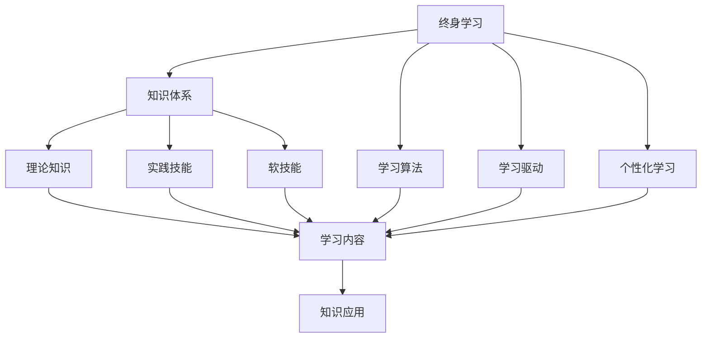

                 

# 学习体系:持续进化的源动力

> 关键词：终身学习,知识体系, 学习算法, 学习驱动, 个性化学习

## 1. 背景介绍

### 1.1 问题由来
随着技术进步，知识体系日新月异。面对不断更新的技术、工具和最佳实践，如何持续学习和更新知识，以保持竞争力？特别是在高速变化的人工智能(AI)和计算技术领域，终身学习变得更加重要。因此，本文旨在探讨终身学习的核心概念，分析学习体系的关键组件，并提出一个实践框架。

### 1.2 问题核心关键点
终身学习强调持续性、灵活性和适应性，目的是在职业生涯中不断吸收新知识，适应新挑战，提升个人和组织的竞争力。这要求构建一个灵活、动态的学习体系，能够适应个人需求变化，并不断更新知识库。

## 2. 核心概念与联系

### 2.1 核心概念概述

以下是构建学习体系所需的核心概念：

- **终身学习**：指在个人整个职业生涯中，持续学习和获取新知识，以应对不断变化的职业环境。
- **知识体系**：由知识和相关概念组成的结构化集合，通常分为理论知识、实践技能和软技能。
- **学习算法**：用于优化学习过程，提高学习效率的算法和模型，如机器学习、深度学习等。
- **学习驱动**：强调以学习为核心动力，主动获取新知识，解决实际问题。
- **个性化学习**：根据个人需求、兴趣和能力，定制化的学习路径和资源，提升学习效果。

这些概念通过合成的逻辑框架联系起来，形成了一个连续进化的学习体系。



这个框架展示了终身学习、知识体系、学习算法、学习驱动和个性化学习之间的逻辑联系。

## 3. 核心算法原理 & 具体操作步骤

### 3.1 算法原理概述

构建一个高效的学习体系，需要理解学习算法的基本原理。这里介绍几种常用的学习算法：

- **强化学习**：通过与环境互动，学习最优策略来最大化奖励。
- **迁移学习**：将一个领域学到的知识迁移到另一个领域。
- **在线学习**：在不断获取新数据的情况下，动态更新模型。
- **增量学习**：无需重新学习全部知识，只需在已有知识的基础上，增量更新。

这些算法体现了学习体系的动态性和适应性，支持终身学习的持续进行。

### 3.2 算法步骤详解

构建学习体系需要以下关键步骤：

**Step 1: 确定学习目标**
- 明确个人或组织的学习需求和目标，制定短期和长期的职业发展计划。

**Step 2: 构建知识体系**
- 基于职业目标，构建相应的知识体系，涵盖理论知识、实践技能和软技能。
- 将知识体系结构化，便于管理和更新。

**Step 3: 选择学习算法**
- 根据学习目标和知识体系，选择合适的学习算法，如强化学习、迁移学习、在线学习等。
- 应用机器学习模型优化学习过程，提高效率和效果。

**Step 4: 设计个性化学习路径**
- 根据个人兴趣、能力和职业发展目标，设计个性化的学习路径和资源。
- 利用推荐算法推荐适合的学习内容。

**Step 5: 实施学习计划**
- 制定详细的学习计划，包括学习内容、时间安排和评估标准。
- 使用工具和技术，如在线课程、MOOCs、学习管理系统等，实施学习计划。

**Step 6: 评估与反馈**
- 定期评估学习效果，检查知识掌握程度和技能提升情况。
- 根据反馈调整学习路径和内容。

**Step 7: 持续迭代和更新**
- 随着技术和环境的变化，不断迭代和更新学习体系。
- 采用最新的学习算法和工具，提升学习效率和效果。

### 3.3 算法优缺点

构建学习体系的算法具有以下优点：
1. **灵活性**：能够根据个人需求和环境变化，灵活调整学习路径和内容。
2. **效率提升**：通过优化学习算法，提高学习效果和效率。
3. **适应性**：能够适应快速变化的技术和职业环境。

但这些算法也存在一些局限性：
1. **学习曲线陡峭**：需要掌握和应用复杂的算法，对初学者可能存在挑战。
2. **资源需求高**：需要大量数据和计算资源，特别是深度学习等算法。
3. **评估困难**：学习效果和进度难以量化和评估，可能影响动机和持续性。

### 3.4 算法应用领域

这些学习算法在多个领域中都有应用：

- **教育培训**：如MOOCs、在线课程、个性化学习管理系统等。
- **企业培训**：如员工发展计划、技能培训和职业发展指导。
- **个人自我提升**：如自学编程、语言学习、专业技能提升等。

## 4. 数学模型和公式 & 详细讲解 & 举例说明

### 4.1 数学模型构建

我们通过一个简单的数学模型来理解学习体系的构建过程：

假设学习目标为掌握某项技能，知识体系由X个知识单元组成，学习算法为F，学习进度为P，最终技能掌握程度为S。则数学模型可以表示为：

$$S = f(P, F, X)$$

其中：
- P：学习进度，可以通过时间、学习量等衡量。
- F：学习算法，如强化学习、迁移学习等。
- X：知识单元，如课程、书籍、视频等。

### 4.2 公式推导过程

我们以强化学习为例，推导学习进度的公式。

假设有一个环境E，学习者与环境互动，每次执行一个行动A，环境返回一个奖励R。强化学习算法通过最大化累积奖励来优化策略。

公式推导如下：

$$\pi^* = \arg\max_{\pi} \sum_{t=1}^{\infty} \gamma^t R_t^\pi$$

其中，$\pi$为策略，$R_t^\pi$为第t步的奖励，$\gamma$为折扣因子。

### 4.3 案例分析与讲解

我们以在线学习为例，分析学习体系的应用。

假设学习者A希望掌握机器学习技能，她制定了3个月的学习计划，每天学习2小时。知识体系包括5门课程，每门课程的学习时间为10小时。

学习者A通过在线学习平台，选择了两门适合她的课程，课程1和课程2，课程1包括5个知识单元，课程2包括3个知识单元。

使用强化学习算法，学习者A每天选择完成一个知识单元，并根据完成情况获得奖励。每次奖励的计算公式为：

$$R_t = \frac{1}{5} * \text{完成知识单元数量}$$

学习者A每天根据奖励调整学习进度，逐步掌握机器学习技能。

## 5. 项目实践：代码实例和详细解释说明

### 5.1 开发环境搭建

为了实践学习体系，我们需要搭建一个开发环境。以下是Python开发环境的搭建步骤：

1. 安装Python 3.8：通过官网下载安装Python。
2. 安装PyTorch：使用pip安装PyTorch，`pip install torch torchvision torchaudio`。
3. 安装TensorFlow：通过官网下载安装TensorFlow。
4. 安装Scikit-learn：使用pip安装Scikit-learn，`pip install scikit-learn`。
5. 安装Jupyter Notebook：通过官网下载安装Jupyter Notebook，`pip install jupyter notebook`。

完成以上步骤后，即可开始编写学习体系相关的代码。

### 5.2 源代码详细实现

以下是使用Python实现的强化学习模型示例代码：

```python
import numpy as np
import gym

class ReinforcementLearningAgent:
    def __init__(self, env):
        self.env = env
        self.learning_rate = 0.1
        self.gamma = 0.9

    def choose_action(self, state):
        # 随机选择动作
        return self.env.action_space.sample()

    def update_policy(self, state, next_state, reward, done):
        # 计算Q值
        Q = self.env.get_state_value(state)
        Q_next = self.env.get_state_value(next_state)

        # 更新Q值
        Q[0] += self.learning_rate * (reward + self.gamma * Q_next - Q[0])

    def learn(self, episodes):
        for episode in range(episodes):
            state = self.env.reset()
            done = False
            while not done:
                action = self.choose_action(state)
                next_state, reward, done, _ = self.env.step(action)
                self.update_policy(state, next_state, reward, done)
                state = next_state

# 创建环境
env = gym.make('CartPole-v0')

# 创建代理
agent = ReinforcementLearningAgent(env)

# 学习
agent.learn(1000)

# 评估
total_reward = 0
for _ in range(100):
    state = env.reset()
    done = False
    while not done:
        action = agent.choose_action(state)
        state, reward, done, _ = env.step(action)
        total_reward += reward
print('Total reward:', total_reward)
```

### 5.3 代码解读与分析

我们详细解读代码中的关键部分：

**ReinforcementLearningAgent类**：
- `__init__`方法：初始化学习率和折扣因子。
- `choose_action`方法：随机选择一个动作。
- `update_policy`方法：根据当前状态和下一步状态、奖励和done标志，更新Q值。
- `learn`方法：模拟学习过程，重复执行选择动作、更新Q值的步骤，直到学习完成。

**gym库**：
- 使用gym库创建CartPole-v0环境，模拟推车与吊杆平衡问题。

**测试**：
- 在1000次学习后，评估学习效果，输出总奖励。

## 6. 实际应用场景

### 6.1 教育培训

在线学习平台和MOOCs为教育培训提供了新的途径。学生可以根据自己的学习进度和需求，选择适合自己的课程和资源，获得个性化的学习体验。

### 6.2 企业培训

企业可以通过学习管理系统(LMS)，为员工提供定制化的培训计划。通过在线课程和虚拟教室，员工可以灵活学习新技能，提升职业能力。

### 6.3 个人自我提升

个人可以利用在线资源，如Coursera、Udemy等平台，自主学习新知识和技能。通过持续学习，个人可以在职业生涯中不断提升，适应新技术和变化。

## 7. 工具和资源推荐

### 7.1 学习资源推荐

为了帮助开发者构建学习体系，以下是一些推荐的学习资源：

1. **Khan Academy**：提供了广泛的数学、科学、编程等课程，适合各个年龄段的学习者。
2. **edX**：提供来自全球顶尖大学的在线课程，涵盖各种学科和技能。
3. **Coursera**：合作伙伴包括斯坦福、耶鲁等知名学府，提供丰富的课程和证书项目。
4. **Udemy**：提供实用的编程、设计、商业等课程，适合职业发展。
5. **Google开发者文档**：提供全面的开发工具和技术文档，适合学习编程和新技术。

### 7.2 开发工具推荐

以下是一些推荐的学习和开发工具：

1. **Jupyter Notebook**：支持Python、R等语言，提供互动式的编程环境。
2. **PyTorch**：深度学习框架，支持动态图和静态图，适合各种深度学习任务。
3. **TensorFlow**：Google开发的深度学习框架，支持分布式计算和大规模训练。
4. **Scikit-learn**：Python科学计算库，支持数据处理和机器学习算法。
5. **Keras**：高级神经网络API，易于上手，支持多种深度学习模型。

### 7.3 相关论文推荐

以下是几篇重要文献，推荐阅读：

1. **Deep Reinforcement Learning for Playing Game of Go**：使用深度强化学习技术，让计算机程序学习下围棋。
2. **Scalable Online Learning with TensorFlow**：介绍TensorFlow的在线学习功能，支持动态更新模型。
3. **Surpassing Human Performance on the ImageNet Classification Task**：使用深度神经网络，在图像识别任务上超越人类。
4. **Personalized Learning with Smart Adaptive Systems**：探讨个性化学习系统的实现，提升学习效果。
5. **Programming for Human Value**：讨论技术开发和应用中的人文价值，强调终身学习的重要性。

## 8. 总结：未来发展趋势与挑战

### 8.1 总结

本文详细介绍了构建学习体系的核心概念、算法原理和具体操作步骤，探讨了其应用场景和未来发展方向。

通过理解学习体系的核心要素和构建步骤，可以更好地应用学习算法和工具，提升个人和组织的终身学习效果。未来，随着技术的发展，学习体系将更加灵活、高效和智能化，适应更多的应用场景。

### 8.2 未来发展趋势

未来，学习体系将呈现以下几个发展趋势：

1. **智能化**：利用AI技术，提供个性化和动态化的学习建议。
2. **跨平台**：支持多种设备和学习场景，如手机、平板、PC等。
3. **多模态学习**：融合视觉、听觉、触觉等多种感官数据，提升学习效果。
4. **社会化学习**：利用社交网络平台，促进知识共享和协作学习。
5. **终身学习平台**：提供全面的学习资源和工具，支持终身学习。

### 8.3 面临的挑战

尽管学习体系带来了诸多优势，但同时也面临一些挑战：

1. **数据隐私**：在收集和处理学习数据时，需要确保用户隐私和数据安全。
2. **技术复杂性**：构建和维护学习体系需要掌握各种技术和算法，对开发者和用户都有一定要求。
3. **资源消耗**：大规模学习体系需要大量的计算和存储资源，可能带来成本问题。
4. **用户动机**：需要设计有效的激励机制，保持用户的学习兴趣和动力。

### 8.4 研究展望

未来研究需要在以下几个方面取得突破：

1. **数据隐私保护**：开发隐私保护技术，保护用户数据隐私。
2. **技术自动化**：提高学习体系的自动化程度，降低技术门槛。
3. **资源优化**：优化计算和存储资源，降低学习成本。
4. **用户激励机制**：设计有效的激励和反馈机制，提升用户参与度。

总之，构建学习体系是终身学习的重要一环，需要在技术、资源和用户行为等多个维度进行全面考虑和优化。未来，随着技术的进步，学习体系将变得更加智能、普适和个性化，为个人和组织提供更加优质的学习体验。

## 9. 附录：常见问题与解答

**Q1：终身学习体系如何适应不同领域的学习需求？**

A: 终身学习体系需要根据不同领域的学习需求进行灵活设计。例如，在医学领域，需要设计涵盖解剖、病理、临床等知识的体系；在技术领域，需要涵盖编程、算法、系统等技能的体系。

**Q2：如何评估学习效果？**

A: 评估学习效果通常需要多维度指标，如知识掌握程度、技能水平、应用能力等。可以通过测试、评估、反馈等方式进行多方面评估。

**Q3：学习体系如何应对技术快速变化？**

A: 学习体系需要不断迭代和更新，引入最新的技术和算法。例如，在机器学习领域，需要定期学习最新的深度学习框架和模型，保持知识体系的前沿性。

**Q4：如何平衡学习时间和工作生活？**

A: 需要制定合理的学习计划，平衡学习时间和工作生活。例如，利用通勤、午休等碎片化时间进行学习，或者利用周末和假期进行系统学习。

**Q5：如何避免学习过程中的过度依赖？**

A: 需要培养自主学习和主动学习的习惯，避免过度依赖学习体系。例如，结合多种学习资源和方式，如在线课程、书籍、实践等，提升学习效果。

通过不断优化学习体系，提升终身学习的效果，我们可以更好地适应技术快速变化和职业发展需求，保持个人和组织的竞争力。未来，随着技术的不断进步，终身学习体系将变得更加智能和普适，为人们带来更加优质的学习体验。

---

作者：禅与计算机程序设计艺术 / Zen and the Art of Computer Programming

