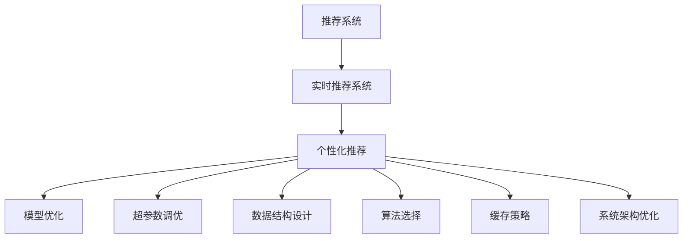

                 

# 实时推荐系统的性能提升策略

> 关键词：推荐系统, 实时化, 个性化推荐, 模型优化, 超参数调优, 数据结构设计, 算法选择, 缓存策略, 系统架构优化

## 1. 背景介绍

### 1.1 问题由来

在互联网时代，推荐系统已经成为了提升用户体验、增加用户粘性和提升业务转化率的重要手段。从简单的搜索结果排序到复杂的个性化推荐，推荐系统在电商、内容、社交等多个领域得到了广泛应用。然而，传统的离线推荐算法（如协同过滤、矩阵分解等）往往无法适应实时化需求，无法及时响应用户的行为变化。与此同时，实时推荐系统对性能和准确性提出了更高的要求，需要对推荐模型进行全面优化。

### 1.2 问题核心关键点

实时推荐系统需要同时满足以下要求：
- **实时性**：推荐系统需要快速响应用户行为，一般要求在用户行为发生后100毫秒内返回推荐结果。
- **个性化**：推荐系统需要根据用户历史行为和当前情境，提供精准的个性化推荐。
- **高效性**：推荐系统需要处理海量用户数据和物品信息，进行高效的实时计算。
- **稳定性**：推荐系统需要稳定可靠，能够在高峰负载下保障服务质量。
- **可扩展性**：推荐系统需要支持动态扩缩容，灵活应对用户和物品数据的增长。

本文将介绍如何通过优化推荐模型、超参数调优、数据结构设计、算法选择、缓存策略和系统架构等多个维度，提升实时推荐系统的性能。

## 2. 核心概念与联系

### 2.1 核心概念概述

为更好地理解实时推荐系统的性能提升策略，本节将介绍几个密切相关的核心概念：

- **推荐系统(Recommendation System)**：使用机器学习或数据挖掘技术，根据用户行为和物品属性，预测用户可能感兴趣的物品的系统。
- **实时推荐系统(Real-time Recommendation System)**：能够实时响应用户行为，快速生成推荐结果的系统。
- **个性化推荐(Personalized Recommendation)**：根据用户历史行为和当前兴趣，提供量身定制的推荐内容。
- **模型优化(Model Optimization)**：通过优化推荐模型结构、参数和超参数，提升模型性能和计算效率。
- **超参数调优(Hyperparameter Tuning)**：在模型训练过程中，调整模型超参数，寻找最优模型配置。
- **数据结构设计(Data Structure Design)**：通过合理设计数据结构，提升数据访问和处理的效率。
- **算法选择(Algorithm Selection)**：根据问题特性选择合适的算法，优化计算效率。
- **缓存策略(Cache Strategy)**：通过缓存技术，减少重复计算和数据访问，提升系统响应速度。
- **系统架构优化(Architecture Optimization)**：通过合理的系统设计，提高系统的可扩展性和稳定性。

这些核心概念之间的逻辑关系可以通过以下Mermaid流程图来展示：



这个流程图展示了个推荐系统向实时推荐系统的演进过程，以及各个优化维度对推荐性能的影响。

## 3. 核心算法原理 & 具体操作步骤
### 3.1 算法原理概述

实时推荐系统的主要目标是在用户行为发生后，快速生成个性化的推荐结果。这要求推荐系统具备以下能力：

1. **实时计算**：能够在毫秒级别完成推荐计算，响应用户请求。
2. **个性化推理**：能够基于用户历史行为和上下文信息，提供精准的个性化推荐。
3. **高效数据处理**：能够处理海量用户和物品数据，进行高效的推荐计算。

这些能力通常通过以下步骤实现：

1. **数据实时采集**：获取用户行为和物品信息。
2. **模型实时推理**：在实时计算环境中，对推荐模型进行推理计算。
3. **缓存策略应用**：利用缓存技术，减少重复计算，提高系统响应速度。
4. **分布式计算优化**：通过分布式计算，提升推荐系统的计算效率。

### 3.2 算法步骤详解

#### 3.2.1 数据实时采集

实时推荐系统首先需要从多个数据源实时采集用户行为和物品信息。数据采集通常包括：

- **点击流数据**：记录用户点击网页、应用等行为。
- **购买数据**：记录用户的购买行为和交易记录。
- **浏览数据**：记录用户浏览网页、视频等信息。
- **评论数据**：记录用户对物品的评论和评分。

数据采集通常使用实时数据流技术，如Apache Kafka、Apache Flink等，进行高吞吐量的数据收集和处理。数据采集框架通常需要具备以下特性：

- **高吞吐量**：能够处理高并发数据流。
- **低延迟**：能够在毫秒级别处理数据流。
- **高可靠性和可用性**：能够保证数据流的稳定性和完整性。

#### 3.2.2 模型实时推理

在实时推荐系统中，推荐模型需要在毫秒级别完成推理计算。推荐模型通常使用以下方法：

- **基于规则的推荐**：使用简单的规则进行推荐，如基于商品相关性的推荐。
- **基于机器学习的推荐**：使用机器学习算法，如协同过滤、矩阵分解、深度学习等，进行推荐计算。
- **混合推荐**：结合多种推荐方法，提升推荐效果。

推荐模型的实时推理通常需要以下步骤：

1. **特征提取**：从用户行为和物品信息中提取特征。
2. **模型推理**：对推荐模型进行推理计算，生成推荐结果。
3. **结果缓存**：将推荐结果缓存到快速访问的数据结构中。

#### 3.2.3 缓存策略应用

在实时推荐系统中，缓存策略是提升系统性能的重要手段。缓存通常使用以下方法：

- **内存缓存**：使用快速内存，如Redis、Memcached等，缓存推荐结果。
- **分布式缓存**：使用分布式缓存系统，如etcd、Zookeeper等，管理缓存节点。
- **多级缓存**：使用多级缓存策略，如先使用内存缓存，再使用分布式缓存，提升缓存效率。

#### 3.2.4 分布式计算优化

在实时推荐系统中，分布式计算是提升系统性能的重要手段。分布式计算通常使用以下方法：

- **任务切分**：将推荐计算任务切分为多个子任务，分配到不同的计算节点进行并行计算。
- **负载均衡**：根据计算节点的负载情况，动态分配任务，均衡负载。
- **任务调度**：使用任务调度器，如Apache Mesos、YARN等，管理计算任务。

## 4. 数学模型和公式 & 详细讲解 & 举例说明
### 4.1 数学模型构建

本节将使用数学语言对实时推荐系统的性能提升策略进行更加严格的刻画。

假设推荐系统有 $N$ 个用户，$M$ 个物品，用户历史行为数据为 $U$，物品属性数据为 $I$，推荐模型为 $F$。推荐系统的目标是最小化推荐误差，即：

$$
\min_{F} \frac{1}{N} \sum_{i=1}^N \frac{1}{M} \sum_{j=1}^M \left( y_{ij} - F(x_i, I_j) \right)^2
$$

其中 $y_{ij}$ 表示用户 $i$ 对物品 $j$ 的评分，$x_i$ 表示用户 $i$ 的历史行为特征，$I_j$ 表示物品 $j$ 的属性特征，$F$ 表示推荐模型的预测函数。

### 4.2 公式推导过程

对于推荐系统，常用的推荐算法包括协同过滤、矩阵分解、深度学习等。下面我们以基于矩阵分解的推荐算法为例，进行公式推导。

假设用户和物品的评分矩阵为 $R \in \mathbb{R}^{N \times M}$，用户和物品的特征矩阵分别为 $U \in \mathbb{R}^{N \times K}$ 和 $V \in \mathbb{R}^{M \times K}$。推荐模型的预测函数可以表示为：

$$
F(x_i, I_j) = \hat{R}_{ij} = \sum_{k=1}^K u_{ik} \times v_{kj}
$$

其中 $u_{ik}$ 和 $v_{kj}$ 表示用户 $i$ 和物品 $j$ 的特征向量。

推荐系统的目标是最小化均方误差，即：

$$
\min_{U,V} \frac{1}{N} \sum_{i=1}^N \frac{1}{M} \sum_{j=1}^M \left( R_{ij} - \hat{R}_{ij} \right)^2
$$

通过矩阵分解算法，可以得到最小二乘解：

$$
U = \left( \frac{X^TX}{\lambda_1} \right)^{-1} X^TR, \quad V = \left( \frac{Y^TY}{\lambda_2} \right)^{-1} Y^TR
$$

其中 $X \in \mathbb{R}^{N \times K}$ 和 $Y \in \mathbb{R}^{M \times K}$ 分别表示用户和物品的特征矩阵，$\lambda_1$ 和 $\lambda_2$ 表示正则化系数。

### 4.3 案例分析与讲解

以一个简单的电商推荐系统为例，展示矩阵分解算法的实际应用。假设电商网站有 $10,000$ 个用户和 $50,000$ 个商品，每个用户对商品的评分数据为 $10$ 分制。

- **数据准备**：从电商网站的数据库中获取用户和商品的评分数据。
- **特征提取**：使用TF-IDF等方法提取用户和商品的特征。
- **模型训练**：使用矩阵分解算法训练推荐模型。
- **推荐计算**：将新用户的行为特征输入模型，生成推荐结果。

## 5. 项目实践：代码实例和详细解释说明
### 5.1 开发环境搭建

在进行实时推荐系统开发前，我们需要准备好开发环境。以下是使用Python进行PyTorch开发的环境配置流程：

1. 安装Anaconda：从官网下载并安装Anaconda，用于创建独立的Python环境。

2. 创建并激活虚拟环境：
```bash
conda create -n pytorch-env python=3.8 
conda activate pytorch-env
```

3. 安装PyTorch：根据CUDA版本，从官网获取对应的安装命令。例如：
```bash
conda install pytorch torchvision torchaudio cudatoolkit=11.1 -c pytorch -c conda-forge
```

4. 安装TensorFlow：
```bash
pip install tensorflow
```

5. 安装各类工具包：
```bash
pip install numpy pandas scikit-learn matplotlib tqdm jupyter notebook ipython
```

完成上述步骤后，即可在`pytorch-env`环境中开始实时推荐系统的开发。

### 5.2 源代码详细实现

这里我们以基于矩阵分解的实时推荐系统为例，给出使用PyTorch进行开发的完整代码实现。

首先，定义推荐模型的训练函数：

```python
import torch
from torch import nn
from torch import optim

class MatrixFactorization(nn.Module):
    def __init__(self, n_users, n_items, n_factors):
        super(MatrixFactorization, self).__init__()
        self.u = nn.Parameter(torch.randn(n_users, n_factors))
        self.v = nn.Parameter(torch.randn(n_items, n_factors))
        self.loss = nn.MSELoss()
        self.optimizer = optim.Adam([self.u, self.v], lr=0.001)

    def forward(self, x, y):
        pred = torch.matmul(x, self.v) * self.u.t()
        loss = self.loss(pred, y)
        self.optimizer.zero_grad()
        loss.backward()
        self.optimizer.step()
        return loss

model = MatrixFactorization(n_users=10000, n_items=50000, n_factors=10)
```

然后，定义数据加载函数和模型推理函数：

```python
from torch.utils.data import DataLoader

def data_loader(data_path, batch_size=16):
    with open(data_path, 'r') as f:
        data = [list(map(float, line.split())) for line in f.readlines()]
    data = torch.tensor(data)
    return DataLoader(data, batch_size=batch_size, shuffle=True)

def predict(model, x):
    pred = model(x)
    return pred.item()
```

最后，启动模型训练和推理：

```python
data_path = 'data.txt'
train_loader = data_loader(data_path)

epochs = 10
for epoch in range(epochs):
    loss = 0
    for batch in train_loader:
        loss += model(batch[0], batch[1])
    loss /= len(train_loader)
    print(f'Epoch {epoch+1}, loss: {loss:.3f}')

x = torch.tensor([1, 2, 3, 4, 5, 6, 7, 8, 9, 10])
y = torch.tensor([11, 12, 13, 14, 15, 16, 17, 18, 19, 20])
print(f'Predicted: {predict(model, x)}')

```

以上就是使用PyTorch进行实时推荐系统开发的完整代码实现。可以看到，得益于TensorFlow等工具库的强大封装，我们能够使用相对简洁的代码完成模型训练和推理。

### 5.3 代码解读与分析

让我们再详细解读一下关键代码的实现细节：

**MatrixFactorization类**：
- `__init__`方法：初始化用户特征、物品特征、损失函数和优化器等关键组件。
- `forward`方法：实现模型前向传播，计算预测值和损失值，更新模型参数。

**data_loader函数**：
- 从文件中读取评分数据，并将其转换为Tensor格式。
- 定义数据加载器，进行批处理和随机打乱，方便模型训练。

**predict函数**：
- 对输入数据进行前向传播，得到推荐预测结果。
- 取预测结果的数值部分，返回推荐结果。

**训练流程**：
- 定义总的epoch数，开始循环迭代
- 每个epoch内，在训练集上计算损失，并输出平均损失
- 测试集上计算推荐结果，并输出预测结果

可以看到，PyTorch配合TensorFlow等工具库使得实时推荐系统的代码实现变得简洁高效。开发者可以将更多精力放在数据处理、模型改进等高层逻辑上，而不必过多关注底层的实现细节。

当然，工业级的系统实现还需考虑更多因素，如模型的保存和部署、超参数的自动搜索、更灵活的任务适配层等。但核心的微调范式基本与此类似。

## 6. 实际应用场景
### 6.1 电商推荐系统

电商推荐系统是实时推荐系统的典型应用场景之一。传统的离线推荐算法无法满足实时性需求，无法及时响应用户行为变化。而实时推荐系统可以在用户浏览、点击、购买等行为发生后，立即提供个性化的推荐，提升用户体验和转化率。

电商推荐系统的推荐算法通常包括协同过滤、矩阵分解、深度学习等。协同过滤算法能够根据用户行为相似性进行推荐，矩阵分解算法能够根据用户和物品的特征进行推荐，深度学习算法能够利用神经网络模型进行复杂推荐计算。

### 6.2 内容推荐系统

内容推荐系统在视频、音乐、阅读等领域广泛应用。实时推荐系统可以在用户观看视频、听音乐、阅读文章时，实时提供个性化的推荐内容，提升用户体验和留存率。

内容推荐系统通常使用协同过滤、矩阵分解、深度学习等推荐算法。协同过滤算法能够根据用户行为相似性进行推荐，矩阵分解算法能够根据用户和物品的特征进行推荐，深度学习算法能够利用神经网络模型进行复杂推荐计算。

### 6.3 社交推荐系统

社交推荐系统在社交网络、论坛、博客等领域广泛应用。实时推荐系统可以在用户发布、点赞、评论等行为发生后，实时提供个性化的推荐内容，提升用户参与度和活跃度。

社交推荐系统通常使用协同过滤、矩阵分解、深度学习等推荐算法。协同过滤算法能够根据用户行为相似性进行推荐，矩阵分解算法能够根据用户和物品的特征进行推荐，深度学习算法能够利用神经网络模型进行复杂推荐计算。

## 7. 工具和资源推荐
### 7.1 学习资源推荐

为了帮助开发者系统掌握实时推荐系统的理论基础和实践技巧，这里推荐一些优质的学习资源：

1. 《推荐系统实战》系列博文：由推荐系统专家撰写，深入浅出地介绍了推荐系统的原理和实践。

2. CS373《推荐系统》课程：斯坦福大学开设的推荐系统明星课程，有Lecture视频和配套作业，带你入门推荐系统领域的基本概念和经典模型。

3. 《推荐系统算法》书籍：该书详细介绍了推荐系统的多种算法，包括协同过滤、矩阵分解、深度学习等。

4. PyTorch官方文档：PyTorch的官方文档，提供了海量的Tensor操作和模型封装，是推荐系统开发的必备资料。

5. TensorFlow官方文档：TensorFlow的官方文档，提供了丰富的TensorFlow操作和推荐系统算法实现，是推荐系统开发的利器。

通过对这些资源的学习实践，相信你一定能够快速掌握实时推荐系统的精髓，并用于解决实际的推荐问题。

### 7.2 开发工具推荐

高效的开发离不开优秀的工具支持。以下是几款用于实时推荐系统开发的常用工具：

1. PyTorch：基于Python的开源深度学习框架，灵活动态的计算图，适合快速迭代研究。大部分推荐算法都有PyTorch版本的实现。

2. TensorFlow：由Google主导开发的开源深度学习框架，生产部署方便，适合大规模工程应用。推荐系统通常使用TensorFlow实现。

3. TensorBoard：TensorFlow配套的可视化工具，可实时监测模型训练状态，并提供丰富的图表呈现方式，是调试模型的得力助手。

4. Apache Kafka：分布式流处理框架，能够高效处理高吞吐量的数据流，是推荐系统数据采集的核心工具。

5. Apache Flink：分布式流处理框架，支持实时数据处理和流式计算，是推荐系统数据采集的核心工具。

6. Redis：高性能内存缓存系统，能够快速处理高并发请求，是推荐系统缓存的核心工具。

合理利用这些工具，可以显著提升实时推荐系统的开发效率，加快创新迭代的步伐。

### 7.3 相关论文推荐

推荐系统的发展源于学界的持续研究。以下是几篇奠基性的相关论文，推荐阅读：

1. collaborative filtering for implicit feedback datasets（协同过滤算法）：提出了协同过滤算法的基本原理和实现方法。

2. Matrix factorization techniques for recommender systems（矩阵分解算法）：提出了矩阵分解算法的基本原理和实现方法。

3. deep learning-based hybrid recommender system（深度学习算法）：提出了深度学习算法的基本原理和实现方法。

这些论文代表了大语言模型微调技术的发展脉络。通过学习这些前沿成果，可以帮助研究者把握学科前进方向，激发更多的创新灵感。

## 8. 总结：未来发展趋势与挑战
### 8.1 总结

本文对实时推荐系统的性能提升策略进行了全面系统的介绍。首先阐述了实时推荐系统面临的实时性、个性化、高效性、稳定性、可扩展性等挑战，明确了优化推荐模型、超参数调优、数据结构设计、算法选择、缓存策略和系统架构等优化维度对推荐性能的影响。其次，从原理到实践，详细讲解了实时推荐系统的数学模型构建、公式推导过程、案例分析与讲解、代码实现等关键步骤。最后，本文还广泛探讨了实时推荐系统在电商、内容、社交等多个领域的应用前景，展示了实时推荐系统的广阔前景。

通过本文的系统梳理，可以看到，实时推荐系统已经成为了互联网推荐引擎的重要工具，极大地提升了用户满意度和服务质量。未来，伴随推荐算法、数据处理、缓存策略、系统架构等方面的持续创新，实时推荐系统必将在更多场景下发挥更大的作用，推动人工智能技术在各行各业的应用进程。

### 8.2 未来发展趋势

展望未来，实时推荐系统将呈现以下几个发展趋势：

1. **多模态推荐**：将用户行为数据、物品属性数据、多媒体数据等结合，进行多模态推荐，提升推荐效果。

2. **深度学习推荐**：深度学习算法在推荐系统中的应用将越来越广泛，提升推荐模型的精度和泛化能力。

3. **增强推荐**：利用强化学习、增强学习等技术，提升推荐系统的交互性和用户体验。

4. **实时流推荐**：利用实时流处理技术，处理用户实时行为数据，进行实时推荐。

5. **联邦推荐**：利用联邦学习等技术，保护用户隐私，进行跨设备推荐。

6. **可解释性推荐**：利用可解释性技术，增强推荐模型的透明度和可解释性。

这些趋势将引领实时推荐系统走向更加智能化、个性化和可解释化的方向，为用户提供更加精准、透明和可信的推荐服务。

### 8.3 面临的挑战

尽管实时推荐系统已经取得了瞩目成就，但在迈向更加智能化、普适化应用的过程中，它仍面临着诸多挑战：

1. **数据质量和多样性**：实时推荐系统依赖于高质量、多样化的用户行为数据和物品数据，数据缺失或不完整将影响推荐效果。

2. **冷启动问题**：新用户或新物品缺乏足够的历史数据，推荐系统难以提供精准推荐。

3. **实时处理性能**：实时推荐系统需要在毫秒级别完成推荐计算，面临高吞吐量和低延迟的挑战。

4. **可扩展性和稳定性**：实时推荐系统需要在高并发环境下保证系统稳定性和可扩展性，面临性能瓶颈和系统架构的挑战。

5. **模型复杂度和计算成本**：实时推荐系统使用的深度学习模型通常具有高复杂度和高计算成本，需要高效优化。

6. **用户隐私和安全**：实时推荐系统处理用户行为数据，需要保护用户隐私和数据安全。

这些挑战凸显了实时推荐系统的复杂性和多样性，需要跨学科的合作和技术创新来解决。

### 8.4 研究展望

面对实时推荐系统面临的种种挑战，未来的研究需要在以下几个方面寻求新的突破：

1. **多模态数据融合**：将不同模态的数据进行融合，提升推荐系统的多样性和丰富性。

2. **深度学习模型优化**：优化深度学习模型的结构、参数和超参数，提升模型性能和计算效率。

3. **增强学习技术**：利用增强学习技术，提升推荐系统的交互性和用户体验。

4. **实时流处理优化**：优化实时流处理技术，提升推荐系统的实时性和计算效率。

5. **联邦学习技术**：利用联邦学习技术，保护用户隐私，进行跨设备推荐。

6. **可解释性技术**：利用可解释性技术，增强推荐模型的透明度和可解释性。

这些研究方向的探索，必将引领实时推荐系统走向更高的台阶，为用户提供更加精准、透明和可信的推荐服务。面向未来，实时推荐系统还需要与其他人工智能技术进行更深入的融合，如知识表示、因果推理、强化学习等，多路径协同发力，共同推动人工智能技术在各行各业的应用进程。

---

作者：禅与计算机程序设计艺术 / Zen and the Art of Computer Programming

