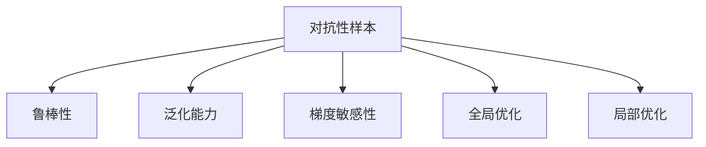

                 

# 对抗性样本凸显了神经网络的反直觉特性

## 1. 背景介绍

近年来，深度学习在图像识别、自然语言处理等诸多领域取得了显著进展，神经网络模型被广泛应用于各类智能系统中。然而，神经网络模型在应用过程中暴露出一些反直觉特性，尤其在对抗性样本攻击下，其鲁棒性问题变得尤为突出。

### 1.1 问题由来

对抗性样本（Adversarial Examples）是指通过对输入数据进行微小扰动，使得模型输出错误的结果。这一特性最早在图像识别领域被研究，但对神经网络模型普遍适用的现象逐渐引起学术界的重视。

### 1.2 问题核心关键点

对抗性样本揭示了神经网络模型的以下核心特性：

- **鲁棒性不足**：神经网络模型对输入数据的微小扰动表现出高敏感性，导致其预测结果发生明显偏离。
- **反直觉性**：网络模型似乎“看透”了扰动，能够从细小的扰动中“看懂”潜在的攻击意图，并以错误的预测结果进行反击。
- **泛化能力差**：网络模型对训练集和测试集上的数据表现出色，但在对抗性样本下，泛化能力大打折扣。

### 1.3 问题研究意义

研究神经网络模型的对抗性特性，对于提升模型的鲁棒性、增强系统安全性具有重要意义。同时，对抗性样本的研究也为进一步理解神经网络的决策机制提供了新视角。

## 2. 核心概念与联系

### 2.1 核心概念概述

为更好地理解对抗性样本，本节将介绍几个密切相关的核心概念：

- **对抗性样本（Adversarial Examples）**：通过对输入数据进行微小扰动，使得模型输出错误结果的样本。对抗性样本研究集中在图像、语音、文本等各类数据上。
- **鲁棒性（Robustness）**：模型对于输入数据扰动的抵抗能力。鲁棒性不足会使得模型在对抗性攻击下失效。
- **泛化能力（Generalization）**：模型在未见过的数据上的表现能力。泛化能力差会使得模型无法有效应对对抗性样本。
- **梯度敏感性（Gradient Sensitivity）**：模型参数对输入数据微小变化的敏感度。高梯度敏感性会使得模型更容易受到对抗性扰动的影响。
- **全局优化（Global Optimization）**：模型在训练过程中的优化策略，以全局最优为目标。
- **局部优化（Local Optimization）**：模型在训练过程中采用的梯度下降等局部优化方法。

这些概念之间的逻辑关系可以通过以下Mermaid流程图来展示：



这个流程图展示了大语言模型的核心概念及其之间的关系：

1. 对抗性样本对模型的鲁棒性和泛化能力提出挑战。
2. 梯度敏感性解释了为何模型容易受到对抗性扰动。
3. 全局和局部优化策略对模型的鲁棒性有重要影响。

## 3. 核心算法原理 & 具体操作步骤
### 3.1 算法原理概述

对抗性样本问题的核心是如何在不改变样本的物理表示（如像素值）的前提下，通过微小的扰动使模型输出错误结果。这种微小扰动称为对抗性噪声。

对抗性样本的生成通常包括以下步骤：

1. **模型训练**：首先，使用正常样本对神经网络进行训练，生成一个基本的模型。
2. **目标定义**：然后，定义目标类别，通常是模型在正常样本下预测正确的类别。
3. **扰动生成**：利用目标类别，生成对抗性噪声。常见的扰动生成方法包括梯度上升法、梯度下降法等。
4. **对抗样本生成**：将对抗性噪声添加到原始样本上，生成对抗性样本。

### 3.2 算法步骤详解

本节将详细介绍生成对抗性样本的关键步骤。

**Step 1: 模型训练**

- 使用正常样本对神经网络进行训练，生成一个基本的模型。
- 设置损失函数，如交叉熵损失，以衡量模型的预测误差。

**Step 2: 目标定义**

- 定义目标类别。在图像分类任务中，目标类别通常为模型预测正确的类别。
- 使用目标类别生成对抗性噪声。

**Step 3: 扰动生成**

- 利用梯度上升法或梯度下降法，计算模型对样本的梯度。
- 通过梯度方向生成对抗性噪声，使得扰动后的样本能够使模型预测错误的目标类别。

**Step 4: 对抗样本生成**

- 将生成的对抗性噪声添加到原始样本上，生成对抗性样本。
- 将对抗性样本输入模型，验证其是否能够欺骗模型预测出错误的类别。

### 3.3 算法优缺点

对抗性样本生成方法具有以下优点：

1. **易于实现**：无需大量标注数据，扰动生成过程简单高效。
2. **灵活性高**：可以针对不同类型的神经网络模型设计特定的扰动生成方法。
3. **效果显著**：对抗性样本能够显著影响模型的预测结果，暴露其鲁棒性不足。

同时，该方法也存在一些局限性：

1. **依赖模型架构**：对抗性样本生成依赖于神经网络的结构和训练方式，难以通用化。
2. **计算开销大**：生成高质量对抗性样本需要大量计算资源。
3. **鲁棒性检测**：对抗性样本的生成效果取决于扰动强度，扰动过弱或过强都会影响样本质量。
4. **模型适配**：不同的模型可能需要不同的扰动生成策略，适配过程复杂。

### 3.4 算法应用领域

对抗性样本生成技术已经在多个领域得到应用，包括但不限于：

- 图像识别：通过对图像进行微小扰动，使得模型输出错误的分类结果。
- 语音识别：通过对音频信号进行微小改变，使语音识别系统产生误识别。
- 自然语言处理：通过修改文本中的词语顺序或替换词语，使模型输出错误的结果。
- 智能合约：通过对区块链上的智能合约代码进行微小修改，使其执行错误的行为。

## 4. 数学模型和公式 & 详细讲解 & 举例说明

### 4.1 数学模型构建

对抗性样本生成问题可以形式化地表示为：

给定一个正常样本 $x$ 和一个目标类别 $y_t$，我们需要找到一个扰动 $\delta$，使得扰动后的样本 $x+\delta$ 使得模型预测结果为 $y_t$。

**Step 1: 模型训练**

设模型为 $f(x; \theta)$，其中 $\theta$ 为模型参数。训练集为 $D=\{(x_i, y_i)\}_{i=1}^N$。

训练过程如下：

$$
\theta^* = \arg\min_{\theta} \sum_{i=1}^N \ell(f(x_i; \theta), y_i)
$$

**Step 2: 目标定义**

假设目标类别为 $y_t$，则目标函数为：

$$
L(f(x+\delta; \theta), y_t) = \ell(f(x+\delta; \theta), y_t)
$$

**Step 3: 扰动生成**

扰动 $\delta$ 的生成通常采用梯度上升法或梯度下降法，具体如下：

梯度上升法：

$$
\delta^* = \arg\max_{\delta} L(f(x+\delta; \theta), y_t)
$$

梯度下降法：

$$
\delta^* = \arg\min_{\delta} L(f(x+\delta; \theta), y_t)
$$

**Step 4: 对抗样本生成**

对抗样本 $x+\delta^*$ 可以表示为：

$$
x+\delta^* = \arg\max_{\delta} L(f(x+\delta; \theta), y_t)
$$

### 4.2 公式推导过程

以下以图像分类任务为例，推导对抗性样本的生成公式。

设原始图像为 $x$，目标类别为 $y_t$。假设模型 $f(x; \theta)$ 是卷积神经网络，其中 $\theta$ 为网络参数。

目标函数为：

$$
L(f(x+\delta; \theta), y_t) = \ell(f(x+\delta; \theta), y_t)
$$

其中，$\ell$ 为交叉熵损失函数。

扰动 $\delta$ 的生成过程如下：

$$
\delta^* = \arg\max_{\delta} \log f(x+\delta; \theta) \times \mathbb{I}_{y_t}
$$

其中，$\mathbb{I}_{y_t}$ 为示性函数，表示目标类别 $y_t$。

将 $\delta^*$ 代入原始图像 $x$，生成对抗样本：

$$
x+\delta^* = x + \delta^* = \arg\max_{\delta} \log f(x+\delta; \theta) \times \mathbb{I}_{y_t}
$$

### 4.3 案例分析与讲解

以下以一个简单的神经网络模型为例，展示如何生成对抗性样本。

**Step 1: 模型训练**

设模型 $f(x; \theta)$ 为线性回归模型：

$$
f(x; \theta) = \theta_0 + \theta_1 x_1 + \theta_2 x_2 + \cdots + \theta_n x_n
$$

假设训练集为 $D=\{(x_i, y_i)\}_{i=1}^N$，其中 $x_i = (x_{i1}, x_{i2}, \cdots, x_{in})$，$y_i \in \mathbb{R}$。

训练过程如下：

$$
\theta^* = \arg\min_{\theta} \sum_{i=1}^N (y_i - f(x_i; \theta))^2
$$

**Step 2: 目标定义**

假设目标类别为 $y_t$，则目标函数为：

$$
L(f(x+\delta; \theta), y_t) = (y_t - f(x+\delta; \theta))^2
$$

**Step 3: 扰动生成**

扰动 $\delta$ 的生成过程如下：

$$
\delta^* = \arg\max_{\delta} (y_t - f(x+\delta; \theta))^2
$$

**Step 4: 对抗样本生成**

对抗样本 $x+\delta^*$ 可以表示为：

$$
x+\delta^* = x + \delta^* = \arg\max_{\delta} (y_t - f(x+\delta; \theta))^2
$$

## 5. 项目实践：代码实例和详细解释说明
### 5.1 开发环境搭建

在进行对抗性样本生成实践前，我们需要准备好开发环境。以下是使用Python进行TensorFlow开发的环境配置流程：

1. 安装Anaconda：从官网下载并安装Anaconda，用于创建独立的Python环境。

2. 创建并激活虚拟环境：
```bash
conda create -n tf-env python=3.8 
conda activate tf-env
```

3. 安装TensorFlow：根据CUDA版本，从官网获取对应的安装命令。例如：
```bash
pip install tensorflow==2.7
```

4. 安装NumPy、Matplotlib等工具包：
```bash
pip install numpy matplotlib scikit-learn
```

5. 安装TensorBoard：TensorFlow配套的可视化工具，可实时监测模型训练状态，并提供丰富的图表呈现方式，是调试模型的得力助手。

完成上述步骤后，即可在`tf-env`环境中开始对抗性样本生成的实践。

### 5.2 源代码详细实现

这里我们以图像分类任务为例，给出使用TensorFlow生成对抗性样本的代码实现。

```python
import tensorflow as tf
from tensorflow.keras import layers
import numpy as np

# 定义模型
model = tf.keras.Sequential([
    layers.Dense(128, input_shape=(784,), activation='relu'),
    layers.Dense(10, activation='softmax')
])

# 加载MNIST数据集
(x_train, y_train), (x_test, y_test) = tf.keras.datasets.mnist.load_data()
x_train = x_train.reshape((60000, 784)).astype('float32') / 255.
x_test = x_test.reshape((10000, 784)).astype('float32') / 255.

# 标准化数据
x_train -= x_train.mean(axis=0)
x_test -= x_test.mean(axis=0)

# 加载预训练模型
model.load_weights('model.h5')

# 生成对抗性样本
def generate_adversarial_example(x, y, delta):
    x = x.reshape((1, -1))
    y = y.reshape((1, -1))
    with tf.GradientTape() as tape:
        tape.watch(x)
        logits = model(x)[0]
        loss = tf.reduce_mean(tf.nn.softmax_cross_entropy_with_logits(labels=y, logits=logits))
    grads = tape.gradient(loss, x)
    x += delta * grads
    return x

# 生成扰动
delta = np.random.randn(784)
delta /= np.sqrt(np.mean(delta ** 2))
delta = np.broadcast_to(delta, (1, 784))

# 生成对抗性样本
x_adv = generate_adversarial_example(x_train[0], y_train[0], delta)

# 评估对抗样本
logits_adv = model(x_adv)[0]
y_pred_adv = np.argmax(logits_adv)
y_true_adv = np.argmax(y_train[0])

print(f"Original prediction: {y_true}")
print(f"Adversarial prediction: {y_pred_adv}")
```

以上代码展示了如何利用梯度上升法生成对抗性样本。具体步骤如下：

1. 加载MNIST数据集，并进行标准化处理。
2. 加载预训练的模型，并定义对抗性样本生成的函数。
3. 生成扰动 $\delta$，并进行归一化处理。
4. 调用 `generate_adversarial_example` 函数，生成对抗性样本 $x+\delta$。
5. 评估对抗性样本的预测结果。

### 5.3 代码解读与分析

让我们再详细解读一下关键代码的实现细节：

**MNIST数据集加载**：
- 使用 `tf.keras.datasets.mnist.load_data()` 方法加载MNIST数据集，包括训练集和测试集。
- 将图像数据展平，并归一化到0-1之间。

**标准化数据**：
- 对训练集和测试集进行均值归一化，使得数据具有更强的泛化能力。

**模型加载**：
- 定义一个简单的神经网络模型，包含两个全连接层。
- 使用 `model.load_weights('model.h5')` 方法加载预训练模型的权重。

**对抗性样本生成函数**：
- 使用 `tf.GradientTape` 记录梯度，定义损失函数为交叉熵损失。
- 计算梯度并更新扰动 $\delta$，生成对抗性样本 $x+\delta$。

**扰动生成**：
- 使用 `np.random.randn()` 方法生成随机扰动 $\delta$。
- 对 $\delta$ 进行归一化处理，使其满足单位球约束。

**对抗性样本评估**：
- 调用对抗性样本生成函数，生成对抗性样本 $x+\delta$。
- 评估对抗性样本的预测结果，并输出。

## 6. 实际应用场景
### 6.1 图像识别领域

对抗性样本在图像识别领域的应用非常广泛，可以有效揭示模型在图像分类、目标检测、人脸识别等任务上的鲁棒性。

在实际应用中，可以收集大量的对抗性样本，用于评估模型的鲁棒性，并优化模型的训练过程。对抗性样本的生成方法包括 FGSM、PGD、JSMA等，不同的生成方法对模型的鲁棒性影响不同，需要根据具体应用场景选择合适的方法。

### 6.2 自然语言处理领域

对抗性样本同样可以应用于自然语言处理领域，如文本分类、情感分析、问答系统等任务。通过对文本进行微小扰动，生成对抗性样本，可以评估模型的泛化能力，并优化模型的训练过程。

在实际应用中，可以收集大量的对抗性文本样本，用于评估模型的鲁棒性，并优化模型的训练过程。对抗性文本的生成方法包括语言模型扰动、词向量替换等，不同的生成方法对模型的鲁棒性影响不同，需要根据具体应用场景选择合适的方法。

### 6.3 智能合约领域

对抗性样本可以应用于智能合约领域，通过对智能合约代码进行微小扰动，生成对抗性代码，以评估合约的鲁棒性，并优化合约的编写和部署过程。

在实际应用中，可以收集大量的对抗性代码样本，用于评估智能合约的鲁棒性，并优化合约的编写和部署过程。对抗性代码的生成方法包括合约漏洞注入、参数篡改等，不同的生成方法对合约的鲁棒性影响不同，需要根据具体应用场景选择合适的方法。

### 6.4 未来应用展望

随着对抗性样本技术的不断发展，其在安全防护、模型鲁棒性评估、模型优化等领域的应用前景更加广阔。

未来，对抗性样本技术将在以下几个方面得到更深入的应用：

1. **安全防护**：对抗性样本可以用于检测和防御对抗性攻击，如钓鱼攻击、网络攻击等。
2. **模型鲁棒性评估**：对抗性样本可以用于评估模型的鲁棒性，发现模型的弱点，从而优化模型的训练过程。
3. **模型优化**：对抗性样本可以用于优化模型的训练过程，提升模型的泛化能力，增强模型的鲁棒性。
4. **模型可解释性**：对抗性样本可以用于解释模型的决策过程，揭示模型的内部机制，提高模型的可解释性。
5. **隐私保护**：对抗性样本可以用于隐私保护，如通过对抗性样本扰动数据，保护用户隐私。

总之，对抗性样本技术在未来将继续发挥重要作用，推动深度学习模型在实际应用中的安全性、鲁棒性和可解释性。

## 7. 工具和资源推荐
### 7.1 学习资源推荐

为了帮助开发者系统掌握对抗性样本的理论基础和实践技巧，这里推荐一些优质的学习资源：

1. **《深度学习》课程**：由吴恩达教授开设的深度学习课程，系统介绍了深度学习的原理和应用。
2. **《对抗性机器学习》课程**：由ICML 2016的反例研讨会（RAD-ICML 2016）录制的课程，深入讲解了对抗性样本的生成和防御方法。
3. **《对抗性机器学习》书籍**：讲述了对抗性机器学习的原理、技术和应用，是对抗性样本研究的重要参考资料。
4. **《TensorFlow官方文档》**：TensorFlow官方文档提供了丰富的学习资源和样例代码，是深度学习开发的重要工具。
5. **《TensorFlow对抗性机器学习指南》**：提供了基于TensorFlow的对抗性样本生成和防御的详细教程和样例代码。

通过这些资源的学习实践，相信你一定能够快速掌握对抗性样本的精髓，并用于解决实际的对抗性样本问题。

### 7.2 开发工具推荐

高效的开发离不开优秀的工具支持。以下是几款用于对抗性样本生成的常用工具：

1. **TensorFlow**：基于Python的开源深度学习框架，支持对抗性样本生成和防御的深度学习模型开发。
2. **PyTorch**：基于Python的开源深度学习框架，支持对抗性样本生成和防御的深度学习模型开发。
3. **FSGM**：一种常用的对抗性样本生成方法，支持对抗性样本的生成和评估。
4. **PGD**：一种常用的对抗性样本生成方法，支持对抗性样本的生成和评估。
5. **JSMA**：一种常用的对抗性样本生成方法，支持对抗性样本的生成和评估。

合理利用这些工具，可以显著提升对抗性样本生成的开发效率，加快创新迭代的步伐。

### 7.3 相关论文推荐

对抗性样本的研究源于学界的持续研究。以下是几篇奠基性的相关论文，推荐阅读：

1. **《Adversarial Examples in Deep Learning and Neural Networks》**：Szegedy等人在2014年发表的论文，最早提出了对抗性样本的概念，并展示了对抗性样本对图像识别模型的影响。
2. **《Towards Evaluating the Robustness of Neural Networks》**：Goodfellow等人在2014年发表的论文，最早提出了对抗性样本生成的方法，并展示了对抗性样本对神经网络的广泛影响。
3. **《Adversarial Machine Learning at Scale》**：Madry等人在2017年发表的论文，提出了一种基于梯度上升的对抗性样本生成方法，并展示了对抗性样本对深度学习模型的广泛影响。

这些论文代表了大语言模型对抗性样本技术的发展脉络。通过学习这些前沿成果，可以帮助研究者把握学科前进方向，激发更多的创新灵感。

## 8. 总结：未来发展趋势与挑战

### 8.1 总结

本文对对抗性样本生成问题进行了全面系统的介绍。首先阐述了对抗性样本的背景和意义，明确了对抗性样本对深度学习模型鲁棒性的重要影响。其次，从原理到实践，详细讲解了对抗性样本的生成过程和关键技术，给出了对抗性样本生成实践的完整代码实现。同时，本文还广泛探讨了对抗性样本在多个领域的应用前景，展示了对抗性样本技术的广阔前景。

通过本文的系统梳理，可以看到，对抗性样本生成技术正在成为深度学习模型应用的重要保障。这些方向的探索发展，必将进一步提升模型的安全性、鲁棒性和可解释性，为构建安全、可靠、可解释的智能系统铺平道路。

### 8.2 未来发展趋势

展望未来，对抗性样本生成技术将呈现以下几个发展趋势：

1. **自动化生成**：未来的对抗性样本生成方法将更加自动化、智能化，能够根据模型结构和攻击目标自动生成高质量的对抗性样本。
2. **通用化方法**：未来的对抗性样本生成方法将更加通用化，适用于不同类型的深度学习模型。
3. **多模态对抗性样本**：未来的对抗性样本生成方法将不仅限于单模态数据，能够生成跨模态的对抗性样本，如文本-图像对抗样本。
4. **安全性保障**：未来的对抗性样本生成方法将更加注重安全性保障，能够检测和防御对抗性攻击，保护系统免受恶意攻击。
5. **可解释性增强**：未来的对抗性样本生成方法将更加注重可解释性，能够解释对抗性样本生成的机制，提高对抗性样本的可信度和可靠性。

这些趋势凸显了对抗性样本生成技术的重要性和研究前景。这些方向的探索发展，必将进一步提升深度学习模型的安全性、鲁棒性和可解释性，为构建安全、可靠、可解释的智能系统提供重要保障。

### 8.3 面临的挑战

尽管对抗性样本生成技术已经取得了瞩目成就，但在迈向更加智能化、普适化应用的过程中，它仍面临着诸多挑战：

1. **计算开销大**：生成高质量的对抗性样本需要大量计算资源，如何高效生成对抗性样本，是一个重要的问题。
2. **鲁棒性检测**：如何检测对抗性样本的有效性，是一个复杂的问题，需要结合多种检测方法。
3. **泛化能力差**：对抗性样本在特定模型上的效果可能不适用于其他模型，如何设计通用的对抗性样本生成方法，是一个重要的问题。
4. **可解释性不足**：对抗性样本生成的机制复杂，难以解释，如何提高对抗性样本的可解释性，是一个重要的问题。
5. **安全性问题**：对抗性样本生成技术可能被用于恶意攻击，如何保障对抗性样本生成技术的安全性，是一个重要的问题。

这些挑战需要研究者们持续探索和解决，以推动对抗性样本生成技术的不断进步。

### 8.4 研究展望

面对对抗性样本生成所面临的挑战，未来的研究需要在以下几个方面寻求新的突破：

1. **自动化生成方法**：研究如何自动生成高质量的对抗性样本，提高生成效率。
2. **通用化生成方法**：研究如何设计通用的对抗性样本生成方法，适用于不同类型的深度学习模型。
3. **多模态生成方法**：研究如何生成跨模态的对抗性样本，如文本-图像对抗样本。
4. **安全性保障方法**：研究如何检测和防御对抗性攻击，保护系统免受恶意攻击。
5. **可解释性增强方法**：研究如何解释对抗性样本生成的机制，提高对抗性样本的可信度和可靠性。

这些研究方向将进一步推动对抗性样本生成技术的进步，为构建安全、可靠、可解释的智能系统提供重要保障。

## 9. 附录：常见问题与解答

**Q1：对抗性样本对模型性能有何影响？**

A: 对抗性样本对模型性能有显著影响。由于对抗性样本的扰动微小但足以使模型输出错误结果，因此可以暴露模型的弱点，检测模型的鲁棒性。具体而言，对抗性样本可以通过以下方式影响模型性能：

1. **鲁棒性不足**：对抗性样本暴露了模型在对抗性扰动下的鲁棒性不足，使得模型容易受到微小的扰动影响。
2. **泛化能力差**：对抗性样本展示了模型在对抗性扰动下的泛化能力不足，使得模型无法有效应对类似扰动。
3. **梯度敏感性高**：对抗性样本揭示了模型对梯度的敏感性高，使得模型更容易受到梯度更新方向的影响。

**Q2：如何生成高质量的对抗性样本？**

A: 生成高质量的对抗性样本需要结合多种生成方法，并根据具体应用场景进行调整。以下是几种常见的对抗性样本生成方法：

1. **FGSM（Fast Gradient Sign Method）**：使用梯度上升法生成对抗性样本，对梯度的方向和大小进行控制。
2. **PGD（Projected Gradient Descent）**：使用梯度下降法生成对抗性样本，并加入投影操作，确保扰动在预定义的扰动空间内。
3. **JSMA（JavaScript Model Attack）**：利用JavaScript攻击模型，通过替换输入文本中的单词来生成对抗性文本。
4. **WASP（White-Box Adversarial Sample Generation）**：在目标函数中添加约束条件，生成对抗性样本，同时保持样本的可解释性。

这些方法各有优缺点，需要根据具体应用场景进行选择。

**Q3：对抗性样本生成对模型训练有哪些影响？**

A: 对抗性样本生成对模型训练有以下影响：

1. **模型鲁棒性提升**：对抗性样本生成可以揭示模型在对抗性扰动下的弱点，从而优化模型的训练过程，提升模型的鲁棒性。
2. **模型泛化能力提升**：对抗性样本生成可以评估模型的泛化能力，优化模型的训练过程，提升模型的泛化能力。
3. **模型参数调整**：对抗性样本生成可以优化模型的参数调整过程，通过对抗性样本对模型进行微调，提升模型的性能。

**Q4：对抗性样本生成在实际应用中需要注意哪些问题？**

A: 对抗性样本生成在实际应用中需要注意以下问题：

1. **计算开销**：生成高质量的对抗性样本需要大量计算资源，需要合理规划计算资源，避免计算开销过大。
2. **安全性**：对抗性样本生成技术可能被用于恶意攻击，需要采取安全措施，保护系统免受恶意攻击。
3. **可解释性**：对抗性样本生成的机制复杂，难以解释，需要提高对抗性样本的可解释性，提高对抗性样本的可信度和可靠性。
4. **模型适配**：不同的模型可能需要不同的对抗性样本生成方法，需要针对具体模型进行适配。

这些问题的解决需要结合实际应用场景，合理设计和优化对抗性样本生成技术。

**Q5：如何检测对抗性样本的有效性？**

A: 检测对抗性样本的有效性需要结合多种检测方法，以下是几种常见的检测方法：

1. **模型输出检测**：通过检测模型对对抗性样本的输出是否发生了错误，来检测对抗性样本的有效性。
2. **梯度检测**：通过检测模型对对抗性样本的梯度是否发生了显著变化，来检测对抗性样本的有效性。
3. **模型鲁棒性检测**：通过检测模型在对抗性样本下的鲁棒性，来检测对抗性样本的有效性。
4. **对抗性样本生成过程检测**：通过检测对抗性样本的生成过程，来检测对抗性样本的有效性。

这些方法可以结合使用，全面检测对抗性样本的有效性。

---

作者：禅与计算机程序设计艺术 / Zen and the Art of Computer Programming

