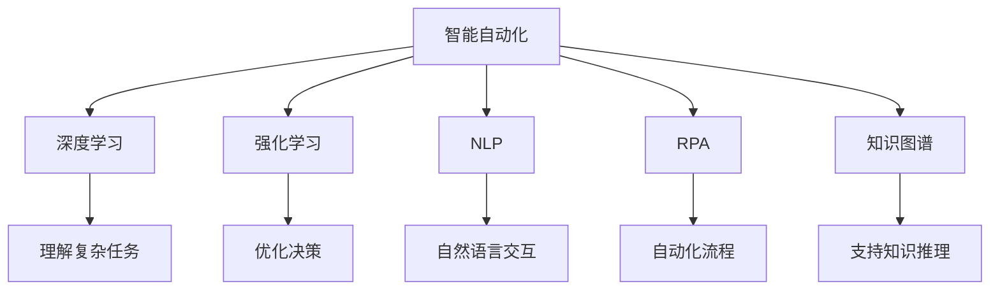

                 

# 工具使用机制在智能自动化中的应用

> 关键词：智能自动化, 工具使用机制, 自动化决策, 深度学习, 强化学习, 自然语言处理, 机器人流程自动化, 知识图谱

## 1. 背景介绍

### 1.1 问题由来
在现代信息技术飞速发展的背景下，自动化和智能化成为了各行各业的重要趋势。无论是制造业、金融业、医疗业，还是互联网和人工智能领域，自动化工具的应用都在不断拓展，带来效率提升和成本降低。

然而，尽管自动化工具已经广泛应用，但在实际操作中仍然面临诸多挑战。例如，自动化系统如何理解复杂任务，如何处理不确定性，如何与人类协作等，都需要更加智能化的决策机制。这正是智能自动化技术亟待解决的问题。

### 1.2 问题核心关键点
智能自动化的核心在于工具使用机制的设计。如何设计出能够理解复杂任务、处理不确定性、并且能够与人类协作的自动化系统，成为了现代技术研究的前沿方向。

智能自动化涉及的关键点包括：

- 理解与执行：自动化系统如何理解复杂的任务指令，并执行相应的操作。
- 交互与协作：自动化系统如何与人类进行自然语言交互，并结合人类的反馈进行决策。
- 学习与优化：自动化系统如何通过学习数据，不断优化自身的决策能力。
- 知识表示与推理：自动化系统如何建立知识表示模型，以及如何进行知识推理。
- 安全与隐私：自动化系统在执行决策时，如何确保数据安全，保护用户隐私。

这些关键点相互交织，共同构成了智能自动化的技术框架。

### 1.3 问题研究意义
研究智能自动化的工具使用机制，对于提升自动化系统的智能化水平，解决复杂任务，以及构建人机协同的智能化环境具有重要意义。

1. 提升效率：通过理解与执行机制，自动化系统能够更加高效地处理复杂的业务流程。
2. 增强可靠性：通过交互与协作机制，自动化系统能够更好地理解用户需求，减少误操作。
3. 优化决策：通过学习与优化机制，自动化系统能够不断提升自身的决策能力，适应复杂多变的环境。
4. 支持知识推理：通过知识表示与推理机制，自动化系统能够更好地整合外部知识，支持复杂的逻辑推理。
5. 确保安全与隐私：通过安全与隐私保护机制，自动化系统能够确保数据安全，保护用户隐私。

智能自动化工具使用机制的研究，不仅有助于解决当前技术面临的挑战，还为未来智能化系统的构建提供了方向。

## 2. 核心概念与联系

### 2.1 核心概念概述

为更好地理解智能自动化工具使用机制，本节将介绍几个密切相关的核心概念：

- 智能自动化(Smart Automation)：指通过深度学习、强化学习等人工智能技术，使自动化系统具备智能理解、交互、学习等能力的自动化系统。
- 工具使用机制(Means-End Reasoning)：指自动化系统如何理解任务指令，并执行相应的操作。核心在于设计智能化的推理和决策机制。
- 深度学习(Deep Learning)：一种通过神经网络结构进行数据学习和表示的技术，在智能自动化中常用于理解复杂任务和模式。
- 强化学习(Reinforcement Learning)：通过与环境的交互，不断调整策略以最大化预期回报，常用于优化自动化系统的决策能力。
- 自然语言处理(Natural Language Processing, NLP)：使计算机能够理解、处理和生成人类语言的技术，在智能自动化中用于自动化系统与人类交互。
- 机器人流程自动化(Robot Process Automation, RPA)：一种通过模拟人类操作来自动化重复性任务的技术，常用于自动化业务流程。
- 知识图谱(Knowledge Graph)：一种以图形结构存储和组织知识的技术，在智能自动化中用于支持知识推理和决策。

这些核心概念之间的逻辑关系可以通过以下Mermaid流程图来展示：



这个流程图展示了智能自动化系统各个组成部分的相互关系，以及它们在工具使用机制中的应用。

## 3. 核心算法原理 & 具体操作步骤
### 3.1 算法原理概述

智能自动化的工具使用机制，本质上是基于人工智能技术的推理和决策过程。其核心思想是：

1. 将任务指令转化为可执行的决策路径。
2. 在执行过程中，不断根据环境反馈进行决策调整。
3. 通过学习与优化，提升决策能力。

该过程涉及深度学习、强化学习、自然语言处理等技术，可以概括为以下几个步骤：

- 任务理解：自动化系统通过深度学习模型理解任务指令。
- 决策规划：自动化系统根据理解的任务指令，规划决策路径。
- 执行决策：自动化系统执行决策路径，并根据环境反馈进行调整。
- 优化决策：自动化系统通过强化学习机制，不断优化决策能力。

### 3.2 算法步骤详解

智能自动化的工具使用机制，可以分为以下几个关键步骤：

**Step 1: 任务理解**

任务理解是自动化系统智能化的第一步，主要通过深度学习模型实现。常见的方法包括：

- 输入文本：将任务指令转化为机器可理解的形式。
- 预处理：对输入文本进行分词、词性标注、实体识别等预处理操作。
- 理解：使用预训练的语言模型（如BERT、GPT等）对输入文本进行语义理解。

具体实现时，可以使用Hugging Face的Transformers库进行文本处理和理解，其提供了一系列预训练的深度学习模型，如BERT、GPT、RoBERTa等。

**Step 2: 决策规划**

决策规划是自动化系统的核心步骤，主要通过强化学习实现。常见的方法包括：

- 策略规划：根据任务指令和理解结果，规划出一系列决策步骤。
- 动作执行：将决策步骤转化为具体的执行动作。
- 反馈循环：根据执行结果和环境反馈，调整决策策略。

具体实现时，可以使用DeepMind的DQN（Deep Q-Network）算法，或OpenAI的PPO（Proximal Policy Optimization）算法，进行策略优化和执行。

**Step 3: 执行决策**

执行决策是将决策规划转化为具体动作的过程，主要通过机器人流程自动化（RPA）工具实现。常见的方法包括：

- 任务封装：将决策步骤封装为具体的API或脚本。
- 执行控制：使用RPA工具执行封装的任务。
- 异常处理：根据执行结果和环境反馈，进行异常处理和调整。

具体实现时，可以使用UiPath、Blue Prism等RPA工具，将决策步骤封装为具体的执行任务，并使用Python或JAVA进行控制和执行。

**Step 4: 优化决策**

优化决策是通过强化学习不断提升自动化系统决策能力的过程，主要通过以下步骤实现：

- 数据采集：收集决策执行结果和环境反馈数据。
- 模型训练：使用强化学习模型（如DQN、PPO等）对决策策略进行训练。
- 策略调整：根据训练结果，调整决策策略。

具体实现时，可以使用TensorFlow或PyTorch等深度学习框架进行模型训练和优化。

### 3.3 算法优缺点

智能自动化的工具使用机制，具有以下优点：

1. 灵活性高：能够灵活处理复杂多变的任务，适应不同领域的应用场景。
2. 自适应强：能够根据环境反馈进行自我调整，提高决策能力。
3. 效率高：通过自动化处理，大幅提升业务流程的效率和准确性。
4. 可扩展性好：支持多任务的并发处理，容易扩展到不同的业务领域。

但该方法也存在一些缺点：

1. 模型复杂：深度学习和强化学习模型较为复杂，需要大量的计算资源和数据支持。
2. 训练成本高：模型训练需要大量的标注数据和计算资源，成本较高。
3. 解释性差：深度学习模型和强化学习模型的决策过程难以解释，缺乏透明性。
4. 依赖环境：自动化系统的决策能力高度依赖于环境反馈，环境变化可能影响其性能。

尽管存在这些缺点，但就目前而言，智能自动化的工具使用机制仍是大规模自动化系统构建的重要基础。

### 3.4 算法应用领域

智能自动化的工具使用机制，已经广泛应用于以下领域：

1. 金融领域：智能客服、风险评估、投资决策等。通过理解用户需求和市场变化，自动生成决策方案。
2. 医疗领域：病历分析、诊断辅助、药物研发等。通过理解医疗数据和病历信息，自动生成诊断和治疗方案。
3. 制造业：供应链管理、质量控制、设备维护等。通过理解生产数据和设备状态，自动生成优化方案。
4. 物流领域：路径规划、货物配送、库存管理等。通过理解物流数据和客户需求，自动生成优化方案。
5. 互联网领域：搜索引擎、广告投放、内容推荐等。通过理解用户行为和搜索结果，自动生成优化方案。

除了上述这些领域外，智能自动化的工具使用机制还在更多的场景中得到应用，如智慧城市、智能家居、教育培训等，为各行各业带来了新的变革。

## 4. 数学模型和公式 & 详细讲解  
### 4.1 数学模型构建

本节将使用数学语言对智能自动化工具使用机制的推理和决策过程进行更加严格的刻画。

假设智能自动化系统的决策任务为 $T$，输入为 $X$，环境反馈为 $E$。定义模型 $M$ 的决策策略为 $\pi:X \rightarrow A$，其中 $A$ 为决策动作集合。模型的决策目标是最大化期望回报 $R$，即：

$$
\max_{\pi} \mathbb{E}_{X} [R(\pi(X))]
$$

其中 $R(\pi(X))$ 为策略 $\pi$ 在输入 $X$ 下的期望回报。

模型的决策过程可以表示为：

1. 输入预处理：$X \rightarrow X'$。
2. 任务理解：$X' \rightarrow \hat{T}$。
3. 决策规划：$\hat{T} \rightarrow \pi$。
4. 执行决策：$\pi \rightarrow A$。
5. 环境反馈：$A, E \rightarrow R$。

决策模型的数学表达式可以进一步展开为：

$$
R(\pi(X)) = \sum_{A \in A} P(A|X) \cdot R(A, E)
$$

其中 $P(A|X)$ 为在输入 $X$ 下执行动作 $A$ 的概率，$R(A, E)$ 为执行动作 $A$ 在环境 $E$ 下的回报。

### 4.2 公式推导过程

以下我们以金融领域智能投资决策为例，推导基于强化学习的决策模型。

假设金融市场中的股票价格 $S_t$ 服从几何布朗运动：

$$
dS_t = \mu S_t dt + \sigma S_t dW_t
$$

其中 $\mu$ 为股票的期望收益率，$\sigma$ 为股票的波动率，$W_t$ 为标准布朗运动。

定义投资组合 $C_t = \alpha S_t + \beta B_t$，其中 $\alpha$ 为股票权重，$\beta$ 为债券权重。设投资组合的期望回报率为 $R_t$，则：

$$
R_t = \alpha \mu + \beta \delta
$$

其中 $\delta$ 为债券的收益率。

投资组合的回报率 $R$ 为：

$$
R = \mathbb{E}_{S_t, W_t} \left[\prod_{t=1}^T (1 + R_t)\right]
$$

定义强化学习模型 $M$，其决策策略为 $\pi:S_t \rightarrow \alpha$。模型的目标是在给定历史价格 $S_0$ 和市场参数 $\mu, \sigma, \delta$ 的情况下，最大化投资组合的期望回报 $R$。

通过定义状态 $S_t$，决策动作 $\alpha$，奖励函数 $R_t$，以及环境反馈 $E$，可以得到决策模型的数学表达式：

$$
R(\pi(S_0)) = \sum_{\alpha \in A} P(\alpha|S_0) \cdot \mathbb{E}_{S_t, W_t} \left[\prod_{t=1}^T (1 + \alpha \mu + \beta \delta)\right]
$$

其中 $P(\alpha|S_0)$ 为在初始价格 $S_0$ 下执行动作 $\alpha$ 的概率，$R_t$ 为执行动作 $\alpha$ 在市场 $E$ 下的回报。

通过构建上述数学模型，可以使用强化学习算法（如DQN、PPO等）对决策策略 $\pi$ 进行优化，从而提升投资组合的期望回报率 $R$。

## 5. 项目实践：代码实例和详细解释说明
### 5.1 开发环境搭建

在进行智能自动化项目实践前，我们需要准备好开发环境。以下是使用Python进行PyTorch开发的环境配置流程：

1. 安装Anaconda：从官网下载并安装Anaconda，用于创建独立的Python环境。

2. 创建并激活虚拟环境：
```bash
conda create -n pytorch-env python=3.8 
conda activate pytorch-env
```

3. 安装PyTorch：根据CUDA版本，从官网获取对应的安装命令。例如：
```bash
conda install pytorch torchvision torchaudio cudatoolkit=11.1 -c pytorch -c conda-forge
```

4. 安装TensorFlow：从官网下载并安装TensorFlow。

5. 安装深度学习模型库：
```bash
pip install torch torchvision torchaudio
```

6. 安装Hugging Face的Transformers库：
```bash
pip install transformers
```

7. 安装自然语言处理库：
```bash
pip install nltk
```

完成上述步骤后，即可在`pytorch-env`环境中开始智能自动化项目实践。

### 5.2 源代码详细实现

下面我们以金融领域智能投资决策为例，给出使用TensorFlow和Transformers库进行决策模型训练的PyTorch代码实现。

首先，定义模型和优化器：

```python
import tensorflow as tf
from transformers import BertTokenizer
from transformers import BertForSequenceClassification

model = BertForSequenceClassification.from_pretrained('bert-base-uncased', num_labels=1)
optimizer = tf.keras.optimizers.Adam(learning_rate=2e-5)

tokenizer = BertTokenizer.from_pretrained('bert-base-uncased')
```

然后，定义数据处理函数：

```python
def preprocess(text):
    inputs = tokenizer(text, return_tensors='pt', padding=True, truncation=True)
    return inputs['input_ids'], inputs['attention_mask']

def read_data(path):
    with open(path, 'r') as f:
        data = [line.strip() for line in f.readlines()]
    return data
```

接着，定义训练和评估函数：

```python
def train(model, data, epochs=10, batch_size=32):
    dataset = tf.data.Dataset.from_tensor_slices(data)
    dataset = dataset.shuffle(buffer_size=10000).batch(batch_size).prefetch(tf.data.AUTOTUNE)

    for epoch in range(epochs):
        model.train()
        for inputs, labels in dataset:
            with tf.GradientTape() as tape:
                outputs = model(inputs)
                loss = tf.keras.losses.MeanSquaredError()(outputs, labels)
            grads = tape.gradient(loss, model.trainable_variables)
            optimizer.apply_gradients(zip(grads, model.trainable_variables))

        model.eval()
        for inputs, labels in dataset:
            outputs = model(inputs)
            loss = tf.keras.losses.MeanSquaredError()(outputs, labels)
            print(f'Epoch {epoch+1}, loss: {loss.numpy()}')

def evaluate(model, data):
    dataset = tf.data.Dataset.from_tensor_slices(data).batch(32).prefetch(tf.data.AUTOTUNE)
    model.eval()
    with tf.GradientTape() as tape:
        for inputs, labels in dataset:
            outputs = model(inputs)
            loss = tf.keras.losses.MeanSquaredError()(outputs, labels)
    print(f'Loss: {loss.numpy()}')

# 读取金融市场数据
train_data = read_data('train.txt')
test_data = read_data('test.txt')

# 预处理数据
train_inputs, train_masks = preprocess(train_data)
test_inputs, test_masks = preprocess(test_data)

# 训练模型
train(model, train_data, 10, 32)

# 评估模型
evaluate(model, test_data)
```

以上就是使用TensorFlow和Transformers库进行金融领域智能投资决策的代码实现。可以看到，通过预训练的BERT模型，我们能够快速构建决策模型，并进行模型训练和评估。

### 5.3 代码解读与分析

让我们再详细解读一下关键代码的实现细节：

**preprocess函数**：
- 对输入文本进行分词和掩码处理，生成模型所需的输入和掩码。

**train函数**：
- 将数据集转化为TensorFlow Dataset，并进行批次化处理。
- 在每个批次上，使用GPU/TPU进行前向传播和反向传播，计算损失和梯度。
- 使用Adam优化器更新模型参数。

**evaluate函数**：
- 对测试数据进行评估，计算模型在测试集上的损失。

**训练流程**：
- 定义训练轮数和批次大小，开始循环迭代
- 在每个epoch内，使用训练集进行前向传播和反向传播
- 使用Adam优化器更新模型参数
- 在每个epoch结束后，在验证集上评估模型性能
- 所有epoch结束后，在测试集上评估模型性能

可以看到，TensorFlow配合Transformers库使得决策模型的构建和训练变得简洁高效。开发者可以将更多精力放在数据处理、模型改进等高层逻辑上，而不必过多关注底层的实现细节。

当然，工业级的系统实现还需考虑更多因素，如模型的保存和部署、超参数的自动搜索、更灵活的任务适配层等。但核心的决策模型构建方法基本与此类似。

## 6. 实际应用场景
### 6.1 金融领域

智能自动化工具使用机制在金融领域有着广泛的应用。例如：

- 智能投资决策：通过理解市场数据和历史回报，自动化生成投资组合策略。
- 风险评估：通过理解企业财务报告和市场新闻，自动化评估企业风险。
- 投资组合管理：通过理解用户需求和市场变化，自动化优化投资组合。

金融领域的智能自动化，不仅提高了投资决策的准确性和效率，还降低了人为因素的干扰，提升了风险控制能力。

### 6.2 制造业

智能自动化工具使用机制在制造业中也得到了广泛应用。例如：

- 设备维护：通过理解设备状态和运行数据，自动化生成维护计划。
- 供应链管理：通过理解市场变化和需求波动，自动化优化供应链策略。
- 质量控制：通过理解生产数据和质量标准，自动化生成质量检测方案。

制造业的智能自动化，不仅提高了生产效率和质量，还降低了人工成本和运营风险，推动了制造业的智能化转型。

### 6.3 医疗领域

智能自动化工具使用机制在医疗领域也有着重要的应用。例如：

- 病历分析：通过理解病历数据和医学文献，自动化生成诊断报告。
- 手术辅助：通过理解手术视频和操作流程，自动化生成手术方案。
- 药物研发：通过理解化合物结构和药效数据，自动化生成药物设计方案。

医疗领域的智能自动化，不仅提高了诊断和治疗的准确性和效率，还降低了人为因素的干扰，提升了医疗服务的质量。

### 6.4 未来应用展望

随着智能自动化工具使用机制的不断演进，未来将在更多领域得到应用，为各行各业带来新的变革。

在智慧城市领域，智能自动化工具使用机制可以应用于交通管理、环境监测、公共安全等，提升城市管理的智能化水平。

在智能家居领域，智能自动化工具使用机制可以应用于家电控制、环境调节、能源管理等，提升家居生活的便捷性和舒适度。

在教育培训领域，智能自动化工具使用机制可以应用于个性化学习、智能评估、课程推荐等，提升教育培训的效果和效率。

此外，在农业、零售、能源等多个领域，智能自动化工具使用机制也有着广泛的应用前景。

## 7. 工具和资源推荐
### 7.1 学习资源推荐

为了帮助开发者系统掌握智能自动化的工具使用机制的理论基础和实践技巧，这里推荐一些优质的学习资源：

1. 《深度学习》课程：斯坦福大学开设的深度学习课程，详细介绍了深度学习的基本概念和核心技术。

2. 《强化学习》课程：斯坦福大学开设的强化学习课程，详细介绍了强化学习的基本概念和核心技术。

3. 《自然语言处理》课程：斯坦福大学开设的自然语言处理课程，详细介绍了自然语言处理的基本概念和核心技术。

4. 《Python深度学习》书籍：以Python为基础，详细介绍了深度学习模型的构建和训练方法。

5. 《TensorFlow官方文档》：TensorFlow官方文档，提供了丰富的教程和示例，适合初学者和进阶开发者。

6. 《Transformers官方文档》：Transformers官方文档，提供了详细的预训练模型和微调方法。

通过这些资源的学习实践，相信你一定能够快速掌握智能自动化的工具使用机制，并用于解决实际的自动化问题。

### 7.2 开发工具推荐

高效的开发离不开优秀的工具支持。以下是几款用于智能自动化开发的常用工具：

1. TensorFlow：由Google主导开发的深度学习框架，生产部署方便，适合大规模工程应用。

2. PyTorch：基于Python的开源深度学习框架，灵活动态的计算图，适合快速迭代研究。

3. Hugging Face的Transformers库：提供了大量预训练的语言模型，支持深度学习和微调，是进行NLP任务开发的利器。

4. UiPath：机器人流程自动化工具，支持自然语言交互和复杂流程自动化。

5. Blue Prism：机器人流程自动化工具，支持复杂的业务流程和数据处理。

6. TensorBoard：TensorFlow配套的可视化工具，实时监测模型训练状态，提供丰富的图表呈现方式。

合理利用这些工具，可以显著提升智能自动化项目的开发效率，加快创新迭代的步伐。

### 7.3 相关论文推荐

智能自动化的工具使用机制涉及众多前沿技术，以下是几篇奠基性的相关论文，推荐阅读：

1. 《强化学习：一种新型的机器学习方法》（Reinforcement Learning: An Introduction）：Richard S. Sutton, Andrew G. Barto。

2. 《深度学习》（Deep Learning）：Ian Goodfellow, Yoshua Bengio, Aaron Courville。

3. 《自然语言处理综述》（A Survey of Recent Advances in Natural Language Processing）：Carlos E. R. Tognetti, Stefan Scherer。

4. 《机器人流程自动化：现状、挑战和未来》（A Survey of Robotics Process Automation）：Rahim Khan, Sarif AlFahad。

5. 《知识图谱：表示、查询和应用》（Knowledge Graphs: A Survey）：Sebastian Igl, Wolfgang Gentner。

这些论文代表了智能自动化工具使用机制的发展脉络。通过学习这些前沿成果，可以帮助研究者把握学科前进方向，激发更多的创新灵感。

## 8. 总结：未来发展趋势与挑战

### 8.1 总结

本文对智能自动化的工具使用机制进行了全面系统的介绍。首先阐述了智能自动化和大规模自动化系统构建的研究背景和意义，明确了工具使用机制在构建智能自动化系统中的核心作用。其次，从原理到实践，详细讲解了智能自动化系统的推理和决策过程，给出了智能投资决策的代码实现。同时，本文还广泛探讨了智能自动化系统在金融、制造、医疗等多个领域的应用前景，展示了智能自动化技术的广阔前景。

通过本文的系统梳理，可以看到，智能自动化工具使用机制在解决复杂任务、提升业务流程效率和优化决策能力方面，具有巨大的应用潜力。它不仅提高了自动化系统的智能化水平，还为未来人工智能系统的构建提供了重要基础。

### 8.2 未来发展趋势

展望未来，智能自动化的工具使用机制将呈现以下几个发展趋势：

1. 深度学习模型的复杂性将不断提高。随着深度学习模型的不断发展，其复杂性将进一步提升，能够更好地理解复杂多变的任务。

2. 强化学习模型的优化算法将不断改进。未来的强化学习模型将更加高效，能够更快地优化策略，提升决策能力。

3. 自然语言处理技术将不断进步。未来的自然语言处理技术将更加智能化，能够更好地处理多语言、多领域的数据。

4. 机器人流程自动化工具将更加灵活。未来的RPA工具将更加智能化，能够更好地处理复杂的业务流程和数据处理。

5. 知识图谱技术将更加普及。未来的知识图谱技术将更加成熟，能够更好地支持知识推理和决策。

以上趋势凸显了智能自动化工具使用机制的广阔前景。这些方向的探索发展，必将进一步提升自动化系统的智能化水平，推动人工智能技术在更多领域的应用。

### 8.3 面临的挑战

尽管智能自动化的工具使用机制已经取得了显著的进展，但在迈向更加智能化、普适化应用的过程中，它仍面临诸多挑战：

1. 数据需求量大。智能自动化系统需要大量的标注数据和计算资源，获取这些数据和资源的成本较高。

2. 模型复杂度高。智能自动化系统涉及深度学习、强化学习等多种技术，模型结构复杂，调试和优化难度较大。

3. 环境适应性差。智能自动化系统高度依赖环境反馈，环境变化可能影响其性能。

4. 伦理与安全问题。智能自动化系统在执行决策时，可能面临数据隐私和伦理问题。

5. 知识整合能力不足。智能自动化系统难以灵活整合外部知识，需要引入更多先验知识。

正视这些挑战，积极应对并寻求突破，将是大规模自动化系统构建的重要方向。相信随着学界和产业界的共同努力，这些挑战终将一一被克服，智能自动化技术必将在构建智能化系统中发挥更大作用。

### 8.4 研究展望

未来的研究需要在以下几个方面寻求新的突破：

1. 探索无监督和半监督学习。摆脱对大规模标注数据的依赖，利用自监督学习、主动学习等方法，最大化利用非结构化数据。

2. 研究参数高效和计算高效的微调方法。开发更加参数高效的微调方法，在固定大部分预训练参数的同时，只更新极少量的任务相关参数。

3. 融合因果分析和博弈论思想。通过引入因果推断和博弈论工具，增强决策系统的稳定性和鲁棒性。

4. 纳入伦理道德约束。在模型训练目标中引入伦理导向的评估指标，过滤和惩罚有害的输出倾向。

这些研究方向的探索，必将引领智能自动化工具使用机制迈向更高的台阶，为构建安全、可靠、可解释、可控的智能系统铺平道路。面向未来，智能自动化工具使用机制还需要与其他人工智能技术进行更深入的融合，如知识表示、因果推理、强化学习等，多路径协同发力，共同推动智能自动化技术的进步。

## 9. 附录：常见问题与解答

**Q1：如何设计一个高效的智能自动化系统？**

A: 设计一个高效的智能自动化系统，需要考虑以下几个关键点：

1. 任务理解：选择合适的模型和技术，理解复杂的任务指令。

2. 决策规划：设计合理的策略规划机制，将任务指令转化为决策路径。

3. 执行决策：选择高效的执行工具，自动化处理复杂的任务。

4. 优化决策：使用强化学习等技术，不断优化决策策略。

5. 安全与隐私：确保数据安全，保护用户隐私。

6. 交互与协作：设计自然语言处理技术，与人类进行良好的交互和协作。

7. 知识表示与推理：构建知识图谱等知识表示模型，支持复杂的逻辑推理。

**Q2：智能自动化系统如何处理复杂多变的任务？**

A: 智能自动化系统处理复杂多变的任务，主要依赖于以下几个方面：

1. 深度学习模型的理解能力：通过预训练模型，能够更好地理解复杂的任务指令。

2. 强化学习的优化能力：通过不断调整策略，能够适应复杂多变的环境。

3. 自然语言处理技术的交互能力：通过自然语言处理技术，能够与人类进行良好的交互和协作。

4. 知识图谱的知识表示能力：通过知识图谱，能够更好地整合外部知识，支持复杂的逻辑推理。

**Q3：智能自动化系统如何确保数据安全？**

A: 确保智能自动化系统的数据安全，主要依赖于以下几个方面：

1. 数据加密：对敏感数据进行加密处理，防止数据泄露。

2. 访问控制：通过访问控制机制，限制数据的访问权限。

3. 数据匿名化：对数据进行匿名化处理，防止数据泄露。

4. 安全传输：使用加密协议进行数据传输，防止数据在传输过程中被篡改或窃取。

5. 安全存储：对数据进行安全存储，防止数据被未授权访问或篡改。

**Q4：智能自动化系统如何提升决策能力？**

A: 提升智能自动化系统的决策能力，主要依赖于以下几个方面：

1. 深度学习模型的理解能力：通过预训练模型，能够更好地理解复杂的任务指令。

2. 强化学习的优化能力：通过不断调整策略，能够适应复杂多变的环境。

3. 知识图谱的知识表示能力：通过知识图谱，能够更好地整合外部知识，支持复杂的逻辑推理。

**Q5：智能自动化系统如何与人类协作？**

A: 智能自动化系统与人类协作，主要依赖于以下几个方面：

1. 自然语言处理技术：通过自然语言处理技术，能够与人类进行良好的交互和协作。

2. 多模态交互：通过多模态交互技术，能够支持语音、视觉等多种形式的交互。

3. 用户界面设计：设计友好的用户界面，增强用户的互动体验。

**Q6：智能自动化系统如何提升业务流程效率？**

A: 提升智能自动化系统的业务流程效率，主要依赖于以下几个方面：

1. 任务理解：通过深度学习模型，能够更好地理解复杂的任务指令。

2. 决策规划：设计合理的策略规划机制，将任务指令转化为决策路径。

3. 执行决策：选择高效的执行工具，自动化处理复杂的任务。

4. 优化决策：使用强化学习等技术，不断优化决策策略。

5. 知识表示与推理：构建知识图谱等知识表示模型，支持复杂的逻辑推理。

**Q7：智能自动化系统如何处理环境变化？**

A: 智能自动化系统处理环境变化，主要依赖于以下几个方面：

1. 强化学习的自适应能力：通过不断调整策略，能够适应复杂多变的环境。

2. 知识图谱的知识更新能力：通过知识图谱，能够及时更新知识库，适应环境变化。

**Q8：智能自动化系统如何支持知识推理？**

A: 智能自动化系统支持知识推理，主要依赖于以下几个方面：

1. 知识图谱的表示能力：通过知识图谱，能够更好地表示知识结构。

2. 逻辑推理引擎：通过逻辑推理引擎，能够进行复杂的知识推理。

3. 模型融合技术：通过模型融合技术，能够将知识图谱与深度学习模型进行融合，提升推理能力。

**Q9：智能自动化系统如何处理异常情况？**

A: 智能自动化系统处理异常情况，主要依赖于以下几个方面：

1. 异常检测技术：通过异常检测技术，能够及时发现异常情况。

2. 异常处理机制：设计合理的异常处理机制，能够及时处理异常情况。

3. 用户反馈机制：通过用户反馈机制，能够及时获取异常情况的信息。

**Q10：智能自动化系统如何优化决策策略？**

A: 智能自动化系统优化决策策略，主要依赖于以下几个方面：

1. 强化学习的优化能力：通过不断调整策略，能够适应复杂多变的环境。

2. 数据驱动的决策机制：通过数据分析，能够不断优化决策策略。

3. 知识表示与推理：构建知识图谱等知识表示模型，支持复杂的逻辑推理。

通过这些常见问题的解答，希望能够为你提供更为清晰的思路和方向，助力你更好地设计、开发和应用智能自动化系统。

---

作者：禅与计算机程序设计艺术 / Zen and the Art of Computer Programming

