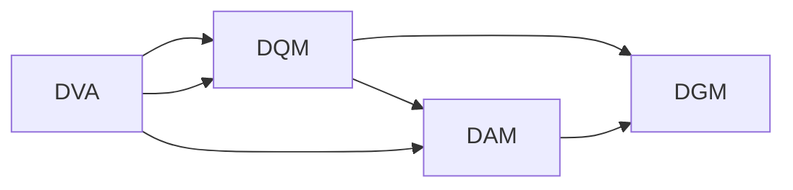

                 

# 平台经济的数据价值评估：如何评估数据的价值？

## 1. 背景介绍

在平台经济时代，数据成为企业的重要资产，如何评估和最大化数据价值，成为了企业在竞争中取得优势的关键。但现实情况是，如何准确地评估数据的价值仍然存在不少挑战。本文将从数据价值评估的基本原理出发，通过系统性地介绍相关概念和理论，探讨实际应用中的具体方法和步骤。

## 2. 核心概念与联系

### 2.1 核心概念概述

#### 数据价值评估(Data Value Assessment, DVA)
数据价值评估指的是根据特定业务需求，通过一定的数据指标和评估方法，对数据资源的质量、数量、潜力和实际应用效果进行综合评估的过程。评估的目的在于揭示数据对业务和决策的支持程度，指导企业数据管理和应用策略。

#### 数据质量管理(Data Quality Management, DQM)
数据质量管理是指通过一系列规范化的过程和技术手段，确保数据完整性、准确性、一致性、及时性和安全性。数据质量管理是数据价值评估的基础，优质的数据才能带来高价值。

#### 数据资产管理(Data Asset Management, DAM)
数据资产管理指的是对数据资源的创建、管理、存储、利用和维护等过程进行系统化管理，确保数据资源的有效利用。数据资产管理贯穿于数据生命周期的各个阶段，是实现数据价值评估的重要环节。

#### 数据治理(Data Governance)
数据治理是指通过制定和执行数据管理规则和政策，确保数据的一致性、完整性和安全性，实现数据的有效管理和应用。数据治理是数据价值评估的前提，良好的数据治理体系才能确保数据的可靠性和可信度。

### 2.2 核心概念原理和架构的 Mermaid 流程图



上述Mermaid流程图展示了数据价值评估与数据质量管理、数据资产管理和数据治理三者之间的联系。数据价值评估基于数据质量管理，依托数据资产管理，借助数据治理体系，完成对数据价值的系统化评估。

## 3. 核心算法原理 & 具体操作步骤

### 3.1 算法原理概述

数据价值评估的算法原理主要包括以下几个方面：

#### 1. 数据量评估
数据量评估指的是对数据存储规模和增长趋势的评估，包括数据存储容量、数据增长速度、数据更新频率等指标。数据量越大，可能带来的业务价值越大，但同时也对存储和计算资源提出了更高的要求。

#### 2. 数据质量评估
数据质量评估通过对数据的完整性、准确性、一致性、及时性和安全性等指标进行评估，确保数据的质量符合业务需求。数据质量是数据价值评估的关键，高质量的数据才能支持高质量的业务决策。

#### 3. 数据价值链评估
数据价值链评估指的是对数据从原始获取、存储、处理、分析和应用等各个环节的价值链进行评估，衡量每个环节的贡献和影响。数据价值链评估能够揭示数据在业务流程中的价值，指导数据管理和应用策略。

#### 4. 数据成本收益分析
数据成本收益分析是对数据获取、处理、存储、分析和应用等各个环节的成本和收益进行综合评估，衡量数据对企业业务的贡献。数据成本收益分析能够揭示数据资源的投资回报率，指导企业的数据战略。

### 3.2 算法步骤详解

#### 3.2.1 数据量评估
1. 收集数据存储和增长的历史数据。
2. 分析数据量的历史趋势，预测未来增长。
3. 根据数据量大小和增长趋势，评估数据存储和计算资源的需求。

#### 3.2.2 数据质量评估
1. 定义数据质量评估的指标，如完整性、准确性、一致性、及时性和安全性等。
2. 收集数据质量的相关数据，如数据错误率、数据重复率、数据更新频率等。
3. 通过统计分析和数据挖掘技术，计算数据质量指标的得分。

#### 3.2.3 数据价值链评估
1. 定义数据价值链评估的指标，如数据获取、存储、处理、分析和应用等环节的价值贡献。
2. 收集数据价值链相关的数据，如数据处理时间、数据应用效果等。
3. 通过多维度评估模型，计算数据价值链的得分。

#### 3.2.4 数据成本收益分析
1. 定义数据成本和收益的指标，如数据获取成本、数据处理成本、数据存储成本、数据应用收益等。
2. 收集数据成本和收益相关的数据，如数据获取费用、数据处理费用、数据存储费用、业务收益等。
3. 通过多维度评估模型，计算数据成本收益的比率。

### 3.3 算法优缺点

#### 优点：
1. 系统化评估：通过综合评估数据量、数据质量、数据价值链和数据成本收益等多个维度，系统化地评估数据价值。
2. 多维度分析：能够从多个角度评估数据价值，揭示数据对业务的全面贡献。
3. 数据驱动：基于数据相关的历史和实时数据进行评估，更符合实际情况。

#### 缺点：
1. 数据收集难度大：评估需要收集和处理大量数据，数据收集难度较大。
2. 技术要求高：评估需要具备较高的统计分析和数据挖掘能力。
3. 评估过程复杂：评估过程涉及多个环节，评估过程较为复杂。

### 3.4 算法应用领域

数据价值评估技术在平台经济中得到了广泛应用，覆盖了多个行业和领域，例如：

1. 电商：通过对用户数据、交易数据、行为数据等的评估，优化推荐系统，提升用户体验和交易转化率。
2. 金融：通过对客户数据、交易数据、信用数据等的评估，优化风控系统，降低坏账率，提高资金利用效率。
3. 医疗：通过对患者数据、医疗数据、行为数据等的评估，优化诊疗系统，提升诊疗效果，降低医疗成本。
4. 教育：通过对学生数据、学习数据、行为数据等的评估，优化教学系统，提升教学效果，提高学生成绩。
5. 物流：通过对订单数据、运输数据、客户数据等的评估，优化配送系统，提升配送效率，降低运营成本。

## 4. 数学模型和公式 & 详细讲解 & 举例说明

### 4.1 数学模型构建

#### 数据量评估模型
设数据量为 $V$，数据增长率为 $g$，数据存储容量为 $C$，数据处理速度为 $P$，则数据量评估模型为：
$$ V = g \times C \times P $$

#### 数据质量评估模型
设数据完整率为 $C_I$，数据准确率为 $A$，数据一致率为 $C_C$，数据及时率为 $T$，数据安全性为 $S$，则数据质量评估模型为：
$$ Q = C_I \times A \times C_C \times T \times S $$

#### 数据价值链评估模型
设数据获取成本为 $C_G$，数据存储成本为 $C_S$，数据处理成本为 $C_P$，数据分析成本为 $C_A$，数据应用收益为 $B$，则数据价值链评估模型为：
$$ V_C = C_G + C_S + C_P + C_A - B $$

#### 数据成本收益分析模型
设数据获取成本为 $C_G$，数据存储成本为 $C_S$，数据处理成本为 $C_P$，数据分析成本为 $C_A$，数据应用收益为 $B$，则数据成本收益分析模型为：
$$ R = \frac{B}{C_G + C_S + C_P + C_A} $$

### 4.2 公式推导过程

#### 数据量评估模型推导
假设数据量为 $V$，数据增长率为 $g$，数据存储容量为 $C$，数据处理速度为 $P$，则有：
$$ V = g \times C \times P $$

其中，$g$ 表示数据增长率，$C$ 表示数据存储容量，$P$ 表示数据处理速度。

#### 数据质量评估模型推导
假设数据完整率为 $C_I$，数据准确率为 $A$，数据一致率为 $C_C$，数据及时率为 $T$，数据安全性为 $S$，则有：
$$ Q = C_I \times A \times C_C \times T \times S $$

其中，$C_I$ 表示数据完整率，$A$ 表示数据准确率，$C_C$ 表示数据一致率，$T$ 表示数据及时率，$S$ 表示数据安全性。

#### 数据价值链评估模型推导
假设数据获取成本为 $C_G$，数据存储成本为 $C_S$，数据处理成本为 $C_P$，数据分析成本为 $C_A$，数据应用收益为 $B$，则有：
$$ V_C = C_G + C_S + C_P + C_A - B $$

其中，$C_G$ 表示数据获取成本，$C_S$ 表示数据存储成本，$C_P$ 表示数据处理成本，$C_A$ 表示数据分析成本，$B$ 表示数据应用收益。

#### 数据成本收益分析模型推导
假设数据获取成本为 $C_G$，数据存储成本为 $C_S$，数据处理成本为 $C_P$，数据分析成本为 $C_A$，数据应用收益为 $B$，则有：
$$ R = \frac{B}{C_G + C_S + C_P + C_A} $$

其中，$C_G$ 表示数据获取成本，$C_S$ 表示数据存储成本，$C_P$ 表示数据处理成本，$C_A$ 表示数据分析成本，$B$ 表示数据应用收益。

### 4.3 案例分析与讲解

#### 案例一：电商数据价值评估

某电商平台收集了用户浏览、购买、评价等数据，进行数据价值评估。根据模型推导结果，假设数据量为 $V=10GB$，数据增长率为 $g=30\%$，数据存储容量为 $C=100GB$，数据处理速度为 $P=10Gb/s$。通过数据量评估模型计算，该平台的数据量评估结果为：
$$ V = g \times C \times P = 30\% \times 100GB \times 10Gb/s = 30GB/s $$

#### 案例二：金融数据价值评估

某金融公司收集了客户信用数据、交易数据、行为数据等，进行数据价值评估。根据模型推导结果，假设数据完整率为 $C_I=90\%$，数据准确率为 $A=99\%$，数据一致率为 $C_C=95\%$，数据及时率为 $T=98\%$，数据安全性为 $S=95\%$。通过数据质量评估模型计算，该公司的数据质量评估结果为：
$$ Q = C_I \times A \times C_C \times T \times S = 90\% \times 99\% \times 95\% \times 98\% \times 95\% \approx 0.9 $$

#### 案例三：医疗数据价值评估

某医院收集了患者就诊数据、医疗记录、行为数据等，进行数据价值评估。根据模型推导结果，假设数据获取成本为 $C_G=10万元$，数据存储成本为 $C_S=20万元$，数据处理成本为 $C_P=15万元$，数据分析成本为 $C_A=5万元$，数据应用收益为 $B=100万元$。通过数据价值链评估模型计算，该医院的数据价值链评估结果为：
$$ V_C = C_G + C_S + C_P + C_A - B = 10万元 + 20万元 + 15万元 + 5万元 - 100万元 = -50万元 $$

#### 案例四：教育数据价值评估

某教育机构收集了学生学习数据、教师教学数据、行为数据等，进行数据价值评估。根据模型推导结果，假设数据获取成本为 $C_G=5万元$，数据存储成本为 $C_S=10万元$，数据处理成本为 $C_P=8万元$，数据分析成本为 $C_A=3万元$，数据应用收益为 $B=50万元$。通过数据成本收益分析模型计算，该教育机构的数据成本收益分析结果为：
$$ R = \frac{B}{C_G + C_S + C_P + C_A} = \frac{50万元}{5万元 + 10万元 + 8万元 + 3万元} \approx 0.5 $$

## 5. 项目实践：代码实例和详细解释说明

### 5.1 开发环境搭建

在进行数据价值评估实践前，我们需要准备好开发环境。以下是使用Python进行Pandas开发的环境配置流程：

1. 安装Anaconda：从官网下载并安装Anaconda，用于创建独立的Python环境。

2. 创建并激活虚拟环境：
```bash
conda create -n data-value-env python=3.8 
conda activate data-value-env
```

3. 安装Pandas：
```bash
pip install pandas
```

4. 安装NumPy：
```bash
pip install numpy
```

5. 安装Matplotlib：
```bash
pip install matplotlib
```

完成上述步骤后，即可在`data-value-env`环境中开始数据价值评估实践。

### 5.2 源代码详细实现

下面我们以电商数据价值评估为例，给出使用Pandas进行数据量评估的Python代码实现。

```python
import pandas as pd
import numpy as np

# 定义数据量评估模型
def data_volume_assessment(data, growth_rate, storage_capacity, processing_speed):
    return growth_rate * storage_capacity * processing_speed

# 假设电商平台数据量为10GB，数据增长率为30%，数据存储容量为100GB，数据处理速度为10Gb/s
data_volume = 10  # GB
growth_rate = 0.3  # 30%
storage_capacity = 100  # GB
processing_speed = 10  # Gb/s

# 计算数据量
result = data_volume_assessment(data_volume, growth_rate, storage_capacity, processing_speed)
print("数据量为：", result, "GB/s")
```

### 5.3 代码解读与分析

让我们再详细解读一下关键代码的实现细节：

**data_volume_assessment函数**：
- 定义了一个函数 `data_volume_assessment`，接受四个参数：数据量 `data`，数据增长率 `growth_rate`，数据存储容量 `storage_capacity`，数据处理速度 `processing_speed`。
- 函数内部，将数据增长率与存储容量和处理速度相乘，得到数据量评估结果。
- 函数返回计算结果。

**数据量计算**：
- 定义了四个变量，分别代表数据量 `data_volume`，数据增长率 `growth_rate`，数据存储容量 `storage_capacity`，数据处理速度 `processing_speed`。
- 将这四个变量代入 `data_volume_assessment` 函数，计算数据量评估结果。
- 输出计算结果。

可以看到，通过简单的Pandas代码，就可以轻松地完成数据量评估的计算。这体现了Pandas在数据分析和计算中的强大能力。

当然，工业级的系统实现还需考虑更多因素，如评估指标的灵活性、数据异常处理、多维度评估等。但核心的数据量评估基本与此类似。

## 6. 实际应用场景

### 6.1 电商数据价值评估

在电商平台上，数据价值评估可以帮助企业优化库存管理、提升推荐系统效果、提高用户满意度等。通过对用户数据、交易数据、行为数据等的评估，企业可以更好地了解用户需求和行为，优化供应链管理和库存控制，提升推荐系统的效果，提高用户满意度和忠诚度。

### 6.2 金融数据价值评估

在金融领域，数据价值评估可以帮助企业优化风控模型、提高资金利用效率、降低坏账率等。通过对客户数据、交易数据、信用数据等的评估，企业可以更好地了解客户风险特征，优化风控模型，降低坏账率，提高资金利用效率。

### 6.3 医疗数据价值评估

在医疗领域，数据价值评估可以帮助医院优化诊疗系统、降低医疗成本、提升诊疗效果等。通过对患者数据、医疗记录、行为数据等的评估，医院可以更好地了解患者病情和需求，优化诊疗系统，降低医疗成本，提升诊疗效果。

### 6.4 教育数据价值评估

在教育领域，数据价值评估可以帮助教育机构优化教学系统、提高教学效果、提升学生成绩等。通过对学生学习数据、教师教学数据、行为数据等的评估，教育机构可以更好地了解学生和教师的需求，优化教学系统，提高教学效果，提升学生成绩。

### 6.5 物流数据价值评估

在物流领域，数据价值评估可以帮助企业优化配送系统、提升配送效率、降低运营成本等。通过对订单数据、运输数据、客户数据等的评估，企业可以更好地了解物流需求和配送情况，优化配送系统，提升配送效率，降低运营成本。

## 7. 工具和资源推荐

### 7.1 学习资源推荐

为了帮助开发者系统掌握数据价值评估的理论基础和实践技巧，这里推荐一些优质的学习资源：

1. 《Python数据科学手册》：由O'Reilly出版社出版的经典书籍，全面介绍了Python在数据科学中的应用，包括Pandas、NumPy等库的使用。

2. Kaggle竞赛平台：世界领先的数据科学竞赛平台，提供海量数据集和丰富的竞赛项目，帮助开发者提高数据分析和建模能力。

3. Coursera在线课程：由世界知名大学和机构提供的在线课程，涵盖数据科学、机器学习、统计学等领域的知识和技能。

4. DataCamp：在线学习平台，提供丰富的数据科学课程和实战项目，帮助开发者掌握数据分析和建模技能。

5. PyData官方文档：PyData官方文档，提供全面的数据科学和数据分析工具和库的介绍和使用方法。

通过对这些资源的学习实践，相信你一定能够快速掌握数据价值评估的精髓，并用于解决实际的数据相关问题。

### 7.2 开发工具推荐

高效的开发离不开优秀的工具支持。以下是几款用于数据价值评估开发的常用工具：

1. Pandas：由AQR Quantitative Research and Risk Management开发的开源数据分析库，支持数据清洗、数据预处理、数据计算等功能。

2. NumPy：由NumPy基金会开发的开源数值计算库，支持高效的多维数组和矩阵计算。

3. Matplotlib：由Matplotlib社区开发的开源数据可视化库，支持丰富的图表类型和定制化设置。

4. Jupyter Notebook：开源的交互式数据科学开发环境，支持Python代码、R代码、SQL代码等的混合使用，方便数据科学家进行数据分析和可视化。

5. Tableau：企业级数据可视化工具，支持多种数据源的连接和数据可视化，方便企业进行数据探索和决策分析。

合理利用这些工具，可以显著提升数据价值评估的开发效率，加快创新迭代的步伐。

### 7.3 相关论文推荐

数据价值评估技术的发展源于学界的持续研究。以下是几篇奠基性的相关论文，推荐阅读：

1. Data Value Assessment in Business Intelligence: A Survey and Research Directions. 文章总结了数据价值评估在商业智能领域的研究进展和未来方向。

2. Value-Based Data Governance Framework. 文章提出了一种基于价值的数据治理框架，指导企业进行数据管理和应用。

3. Data Quality Metrics for Data Value Assessment. 文章讨论了数据质量指标对数据价值评估的重要性，提出了多种评估方法和工具。

4. Data Quality and Value Assessment: A Survey. 文章总结了数据质量评估和数据价值评估的研究进展，提出多种评估方法和技术。

这些论文代表了大数据价值评估技术的发展脉络。通过学习这些前沿成果，可以帮助研究者把握学科前进方向，激发更多的创新灵感。

## 8. 总结：未来发展趋势与挑战

### 8.1 研究成果总结

本文对数据价值评估的基本原理、方法步骤和实际应用进行了系统介绍，全面分析了数据量评估、数据质量评估、数据价值链评估和数据成本收益分析等多个维度的评估方法，给出了实际案例和代码实现。通过系统化的介绍和分析，希望读者能够全面理解数据价值评估的原理和方法，提升在实际项目中的应用能力。

### 8.2 未来发展趋势

展望未来，数据价值评估技术将呈现以下几个发展趋势：

1. 多维度评估：未来的数据价值评估将更加注重多维度评估，涵盖数据量、数据质量、数据价值链和数据成本收益等多个方面。

2. 实时评估：随着大数据技术的发展，实时数据采集和处理能力不断提升，实时数据价值评估将成为可能，进一步提升决策的及时性和准确性。

3. 智能化评估：通过引入人工智能技术，提升数据价值评估的智能化水平，提高评估的准确性和效率。

4. 跨领域应用：数据价值评估技术将在更多领域得到应用，如智能制造、智慧城市、智能交通等，为企业提供更全面的决策支持。

5. 数据伦理与隐私保护：数据价值评估过程中，需要关注数据伦理和隐私保护问题，确保评估结果的公正性和可信度。

6. 数据治理体系：数据价值评估需要与数据治理体系相结合，建立健全的数据治理框架，确保数据的可靠性和安全性。

### 8.3 面临的挑战

尽管数据价值评估技术已经取得了显著进展，但在实际应用中仍面临诸多挑战：

1. 数据质量管理难度大：数据质量管理需要处理大量数据，数据质量问题复杂，难以全面覆盖。

2. 数据成本收益分析复杂：数据成本收益分析涉及多个环节，数据成本和收益的数据收集和计算难度大。

3. 多维度评估复杂度高：多维度评估需要综合考虑多个指标，评估过程复杂，难以统一标准。

4. 实时评估技术挑战：实时评估需要高效的数据处理和分析能力，技术实现难度大。

5. 数据伦理与隐私保护问题：数据价值评估过程中，需要关注数据伦理和隐私保护问题，确保评估结果的公正性和可信度。

6. 跨领域应用困难：数据价值评估需要考虑不同领域的数据特点和业务需求，跨领域应用难度大。

### 8.4 研究展望

面对数据价值评估面临的种种挑战，未来的研究需要在以下几个方面寻求新的突破：

1. 数据质量自动化：引入自动化数据质量管理工具，通过数据清洗、数据校验等技术，提升数据质量管理的效率和准确性。

2. 数据成本收益透明化：引入数据成本收益透明化工具，通过可视化展示和动态更新，帮助企业更好地理解数据成本和收益情况。

3. 多维度评估标准化：制定多维度评估标准和规范，统一评估指标和方法，提升评估结果的公正性和可比性。

4. 实时评估高效化：引入高效数据处理和分析技术，提升实时数据价值评估的计算速度和精度。

5. 跨领域应用通用化：建立跨领域数据价值评估框架，根据不同领域的数据特点和业务需求，进行适应性调整。

6. 数据伦理与隐私保护体系化：建立数据伦理与隐私保护体系，确保数据价值评估过程的公正性和可信度，保护用户隐私。

这些研究方向的探索，必将引领数据价值评估技术迈向更高的台阶，为企业的决策支持提供更全面、更准确的数据评估服务。面向未来，数据价值评估技术还需要与其他人工智能技术进行更深入的融合，如机器学习、深度学习、自然语言处理等，多路径协同发力，共同推动数据科学的发展。只有勇于创新、敢于突破，才能不断拓展数据科学的边界，让数据真正成为企业的核心资产。

## 9. 附录：常见问题与解答

**Q1：数据价值评估对企业有什么意义？**

A: 数据价值评估对企业具有重要的意义，主要体现在以下几个方面：

1. 指导业务决策：通过数据价值评估，企业可以全面了解数据资源的质量、数量、潜力和实际应用效果，为业务决策提供依据。

2. 优化资源配置：通过数据价值评估，企业可以识别数据资源的重要性和价值，优化资源配置，最大化数据资源的利用效率。

3. 提高决策及时性：实时数据价值评估技术可以提升决策的及时性和准确性，帮助企业快速响应市场变化。

4. 提升业务效果：通过优化数据质量、优化数据价值链和优化数据成本收益，企业可以提高业务效果，提升市场竞争力。

5. 保障数据安全：数据价值评估过程中，需要关注数据伦理和隐私保护问题，确保数据资源的安全性和合规性。

**Q2：数据量评估的指标有哪些？**

A: 数据量评估的指标主要包括以下几个方面：

1. 数据存储容量：指数据存储在硬盘、云存储等介质中的实际大小。

2. 数据增长速度：指数据存储容量随时间的增长速度，如每天增加的数据量。

3. 数据处理速度：指数据的读写速度、存储和处理速度。

4. 数据量大小：指数据存储容量和数据增长速度的综合体现，反映数据资源的总体规模。

5. 数据质量：指数据的完整性、准确性、一致性、及时性和安全性等指标。

**Q3：如何进行数据成本收益分析？**

A: 数据成本收益分析的计算过程主要包括以下几个步骤：

1. 收集数据成本和收益的各项数据，如数据获取成本、数据存储成本、数据处理成本、数据分析成本、数据应用收益等。

2. 计算数据成本和收益的比率，即数据成本收益分析模型 $R = \frac{B}{C_G + C_S + C_P + C_A}$，其中 $C_G$ 表示数据获取成本，$C_S$ 表示数据存储成本，$C_P$ 表示数据处理成本，$C_A$ 表示数据分析成本，$B$ 表示数据应用收益。

3. 根据计算结果，判断数据成本收益分析模型的值，如果值接近1，表示数据应用收益高，数据投资回报率高；如果值接近0，表示数据应用收益低，数据投资回报率低。

**Q4：数据价值评估的流程是什么？**

A: 数据价值评估的流程主要包括以下几个步骤：

1. 数据收集：收集数据存储、增长、处理、分析和应用等各个环节的数据。

2. 数据质量评估：对数据的完整性、准确性、一致性、及时性和安全性等指标进行评估，确保数据质量符合业务需求。

3. 数据量评估：对数据的存储容量、增长速度、处理速度等指标进行评估，反映数据资源的规模和增长速度。

4. 数据价值链评估：对数据从原始获取、存储、处理、分析和应用等各个环节的价值贡献进行评估，反映数据在业务流程中的价值。

5. 数据成本收益分析：对数据获取、处理、存储、分析和应用等各个环节的成本和收益进行评估，反映数据资源的投资回报率。

6. 综合评估：将数据质量评估、数据量评估、数据价值链评估和数据成本收益分析等结果进行综合评估，得出数据价值评估的最终结果。

**Q5：数据价值评估的挑战有哪些？**

A: 数据价值评估面临的主要挑战包括以下几个方面：

1. 数据质量管理难度大：数据质量管理需要处理大量数据，数据质量问题复杂，难以全面覆盖。

2. 数据成本收益分析复杂：数据成本收益分析涉及多个环节，数据成本和收益的数据收集和计算难度大。

3. 多维度评估复杂度高：多维度评估需要综合考虑多个指标，评估过程复杂，难以统一标准。

4. 实时评估技术挑战：实时评估需要高效的数据处理和分析能力，技术实现难度大。

5. 数据伦理与隐私保护问题：数据价值评估过程中，需要关注数据伦理和隐私保护问题，确保评估结果的公正性和可信度。

6. 跨领域应用困难：数据价值评估需要考虑不同领域的数据特点和业务需求，跨领域应用难度大。

**Q6：数据价值评估有哪些应用场景？**

A: 数据价值评估的应用场景主要包括以下几个方面：

1. 电商：通过评估用户数据、交易数据、行为数据等，优化推荐系统，提升用户体验和交易转化率。

2. 金融：通过评估客户数据、交易数据、信用数据等，优化风控模型，降低坏账率，提高资金利用效率。

3. 医疗：通过评估患者数据、医疗记录、行为数据等，优化诊疗系统，降低医疗成本，提升诊疗效果。

4. 教育：通过评估学生学习数据、教师教学数据、行为数据等，优化教学系统，提高教学效果，提升学生成绩。

5. 物流：通过评估订单数据、运输数据、客户数据等，优化配送系统，提升配送效率，降低运营成本。

**Q7：数据价值评估的挑战有哪些？**

A: 数据价值评估面临的主要挑战包括以下几个方面：

1. 数据质量管理难度大：数据质量管理需要处理大量数据，数据质量问题复杂，难以全面覆盖。

2. 数据成本收益分析复杂：数据成本收益分析涉及多个环节，数据成本和收益的数据收集和计算难度大。

3. 多维度评估复杂度高：多维度评估需要综合考虑多个指标，评估过程复杂，难以统一标准。

4. 实时评估技术挑战：实时评估需要高效的数据处理和分析能力，技术实现难度大。

5. 数据伦理与隐私保护问题：数据价值评估过程中，需要关注数据伦理和隐私保护问题，确保评估结果的公正性和可信度。

6. 跨领域应用困难：数据价值评估需要考虑不同领域的数据特点和业务需求，跨领域应用难度大。

---

作者：禅与计算机程序设计艺术 / Zen and the Art of Computer Programming

