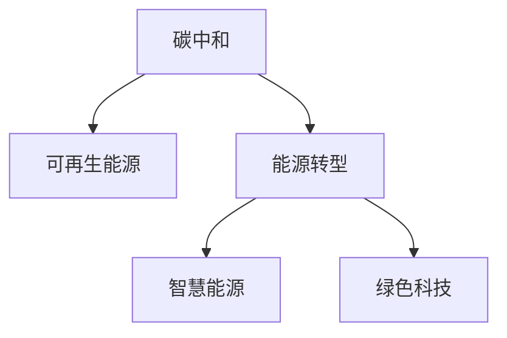

                 

# 2050年的全球减排：从化石能源到可再生能源的低碳转型

> 关键词：碳中和, 可再生能源, 能源转型, 智慧能源, 绿色科技

## 1. 背景介绍

### 1.1 问题由来
全球气候变化问题已迫在眉睫，二氧化碳等温室气体的排放是导致全球气候变化的主要因素。联合国政府间气候变化专门委员会（IPCC）报告指出，如果继续依赖化石燃料，到2100年全球平均温度将上升约4℃，将对生态系统、农业生产、城市发展乃至人类健康产生严重影响。因此，实现碳中和，从化石能源向可再生能源转型，是全球各国共同面临的重大挑战。

### 1.2 问题核心关键点
碳中和是指在一定时间内，通过植树造林、节能减排等措施，将人为活动排放的碳排放量与吸收量达到平衡，实现净零排放。实现碳中和需要依赖于大规模的可再生能源应用、技术创新、政策支持以及国际合作。

## 2. 核心概念与联系

### 2.1 核心概念概述

为更好地理解全球减排的技术路径，本节将介绍几个密切相关的核心概念：

- **碳中和**：目标是通过一系列措施，将人为活动产生的碳排放量控制在零水平。
- **可再生能源**：指风能、太阳能、水能、地热能等无需消耗化石燃料即可产生的能源。
- **能源转型**：指从依赖化石燃料向依赖可再生能源转变的过程。
- **智慧能源**：利用物联网、大数据、人工智能等技术，提升能源的生产、传输、使用效率。
- **绿色科技**：包括能源、环保、可持续建筑等领域的技术创新。

这些核心概念之间的逻辑关系可以通过以下Mermaid流程图来展示：



这个流程图展示出碳中和、可再生能源、能源转型、智慧能源和绿色科技之间的关系：

1. 碳中和的目标是通过能源转型实现，而能源转型依赖于可再生能源的广泛应用。
2. 智慧能源和绿色科技作为技术手段，加速能源转型，提升能源使用效率。
3. 智慧能源和绿色科技的应用促进了智慧城市、可持续发展等目标的实现。

## 3. 核心算法原理 & 具体操作步骤
### 3.1 算法原理概述

实现从化石能源到可再生能源的转型，需要从多个维度进行技术创新和管理策略调整。以下是基于系统工程的方法论，介绍实现碳中和的主要步骤：

- **政策导向**：制定和实施碳排放交易体系、可再生能源补贴政策、碳税等政策手段，推动企业和社会减少碳排放。
- **技术创新**：在可再生能源领域进行技术突破，如提高风能、太阳能的转换效率，研发储能技术、智能电网等。
- **基础设施建设**：建设大规模风电场、光伏电站等可再生能源设施，提高电网承载能力。
- **商业模式创新**：发展以用户为中心的能源互联网模式，如智能合约、虚拟电厂、绿色金融等。
- **社会参与**：倡导绿色生活方式，提高公众对碳中和的认知度和参与度。

### 3.2 算法步骤详解

**Step 1: 政策设计**
- 制定碳排放交易体系，鼓励企业通过减排和交易降低碳排放成本。
- 实施可再生能源补贴政策，支持风电、太阳能等项目的建设。
- 征收碳税，对高碳排放企业进行经济惩罚。

**Step 2: 技术创新**
- 投资可再生能源研发，如提高风能、太阳能的转换效率。
- 研发储能技术，如电池、氢能等，解决可再生能源的间歇性问题。
- 建设智能电网，提高电网的灵活性和稳定性和可再生能源的消纳能力。

**Step 3: 基础设施建设**
- 大规模建设风电场、光伏电站等可再生能源设施。
- 更新和升级电网基础设施，提升电网的承载能力和智能化水平。
- 开发分布式能源系统，提高能源利用效率。

**Step 4: 商业模式创新**
- 发展智能合约，实现能源的自动交易和结算。
- 构建虚拟电厂，通过聚合大量分布式能源资源，参与市场竞价。
- 发展绿色金融产品，如绿色债券、绿色基金等，支持可再生能源项目融资。

**Step 5: 社会参与**
- 宣传碳中和理念，提高公众环保意识。
- 开展碳中和教育，培养碳中和专业人才。
- 促进企业和社会合作，共同推动碳中和目标实现。

### 3.3 算法优缺点

碳中和技术的实施面临以下优点和挑战：

**优点：**

1. **环境效益显著**：减少温室气体排放，改善空气质量和生态环境。
2. **促进经济转型**：推动新兴产业如新能源、绿色建筑、智慧能源等的发展。
3. **提升能源安全**：减少对进口化石燃料的依赖，增强能源供应稳定性。

**挑战：**

1. **技术和成本问题**：可再生能源技术的成熟度和成本是实现碳中和的关键。
2. **基础设施建设**：大规模基础设施建设需要大量投资和时间。
3. **社会认知和参与度**：公众对碳中和理念的认知和参与度还需进一步提高。

## 4. 数学模型和公式 & 详细讲解  
### 4.1 数学模型构建

碳中和的数学模型可以定义为：

$$
C = E - S
$$

其中，$C$ 表示碳排放量，$E$ 表示能源消耗量，$S$ 表示碳吸收量。目标是使 $C = 0$，即净零排放。

### 4.2 公式推导过程

假设每年能源消耗量为 $E$，碳排放系数为 $\lambda$，可再生能源占比为 $r$，则碳排放量为：

$$
C = \lambda \cdot E - S
$$

目标是最小化碳排放量 $C$，即：

$$
\min_{E,S} C = \lambda \cdot E - S
$$

### 4.3 案例分析与讲解

以某城市为例，计算其在不同可再生能源占比下的碳排放量。

假设该城市每年能源消耗为 $10 \times 10^9$ kWh，碳排放系数为 $0.5$ kgh/kWh，碳吸收量为 $5 \times 10^9$ kg。

则在没有可再生能源的情况下，碳排放量为：

$$
C = 0.5 \cdot 10 \times 10^9 - 5 \times 10^9 = 5 \times 10^9 \text{ kg}
$$

若可再生能源占比为 $50\%$，即 $5 \times 10^9$ kWh，则碳排放量为：

$$
C = 0.5 \cdot 5 \times 10^9 - 5 \times 10^9 = 2.5 \times 10^9 \text{ kg}
$$

通过计算可以看出，可再生能源的广泛应用能显著降低碳排放量。

## 5. 项目实践：代码实例和详细解释说明
### 5.1 开发环境搭建

在进行碳中和项目的实践前，我们需要准备好开发环境。以下是使用Python进行数据分析和模拟的环境配置流程：

1. 安装Anaconda：从官网下载并安装Anaconda，用于创建独立的Python环境。

2. 创建并激活虚拟环境：
```bash
conda create -n carbon-env python=3.8 
conda activate carbon-env
```

3. 安装必要的库：
```bash
conda install pandas numpy matplotlib scipy
```

4. 安装Jupyter Notebook：
```bash
conda install jupyterlab
```

完成上述步骤后，即可在`carbon-env`环境中开始碳中和项目的开发。

### 5.2 源代码详细实现

我们使用Python中的Pandas库来处理和分析数据，以下是实现碳中和模型和模拟的代码：

```python
import pandas as pd
import numpy as np

# 读取数据
data = pd.read_csv('energy.csv')

# 计算碳排放量
def carbon_emission(co2_coefficient, energy_consumption):
    return co2_coefficient * energy_consumption

# 计算可再生能源占比
def renewable_energy_ratio(renewable_energy_consumption, total_energy_consumption):
    return renewable_energy_consumption / total_energy_consumption

# 计算碳排放量
def net_carbon_emission(co2_coefficient, energy_consumption, renewable_energy_ratio):
    return carbon_emission(co2_coefficient, energy_consumption) - carbon_emission(co2_coefficient, energy_consumption * renewable_energy_ratio)

# 计算不同可再生能源占比下的碳排放量
def simulate_carbon_emission(co2_coefficient, energy_consumption, co2_target):
    renewable_energy_ratio = 0
    while net_carbon_emission(co2_coefficient, energy_consumption, renewable_energy_ratio) != 0:
        renewable_energy_ratio += 0.01
    return renewable_energy_ratio

# 测试
co2_coefficient = 0.5
energy_consumption = 10 * 10**9
co2_target = 0

renewable_energy_ratio = simulate_carbon_emission(co2_coefficient, energy_consumption, co2_target)
print(f"可再生能源占比为 {renewable_energy_ratio * 100:.2f}%")
```

### 5.3 代码解读与分析

让我们再详细解读一下关键代码的实现细节：

**数据读取**：
- 使用Pandas库读取包含能源消耗和碳排放系数的CSV文件。

**碳排放计算**：
- 定义`carbon_emission`函数，计算给定碳排放系数和能源消耗量下的碳排放量。

**可再生能源占比计算**：
- 定义`renewable_energy_ratio`函数，计算可再生能源占比，其中`renewable_energy_consumption`为可再生能源消耗量，`total_energy_consumption`为总能源消耗量。

**碳排放量计算**：
- 定义`net_carbon_emission`函数，计算给定可再生能源占比下的净碳排放量。

**模拟计算**：
- 定义`simulate_carbon_emission`函数，通过迭代计算找到使净碳排放量接近于0的可再生能源占比。

**测试**：
- 设置碳排放系数、能源消耗量和碳中和目标。
- 调用`simulate_carbon_emission`函数，得到所需可再生能源占比，并打印输出。

通过以上代码，我们可以得到在不同可再生能源占比下的碳排放量，从而进行合理的政策和能源规划。

## 6. 实际应用场景
### 6.1 智能电网

智能电网是实现碳中和的重要基础设施之一。智能电网通过物联网技术，实时监测和调度能源的生产和传输，提升电网的灵活性和稳定性，使得大规模可再生能源的接入和使用成为可能。

### 6.2 绿色建筑

绿色建筑通过采用高效节能材料和技术，如太阳能光伏板、地源热泵等，显著降低建筑物的碳排放量。此外，智能建筑管理系统可实时监控能源使用情况，优化能源使用效率。

### 6.3 交通领域

在交通领域，电动汽车、氢燃料电池车等清洁能源车辆的应用，能大幅降低交通领域的碳排放。此外，智能交通系统可优化交通流量，减少车辆运行中的能源浪费。

### 6.4 未来应用展望

未来，碳中和技术将在更多领域得到应用，为经济社会发展提供新的动力。

在农业领域，精准农业和智能灌溉系统将提升农作物的产量和质量，同时减少化肥和农药的使用，降低农业碳排放。

在工业领域，工业互联网和智能制造将推动制造业向智能化、绿色化转型，减少工业过程中的能源消耗和碳排放。

在金融领域，绿色金融产品和服务将促进资金向低碳经济领域流动，推动绿色科技的商业化应用。

## 7. 工具和资源推荐
### 7.1 学习资源推荐

为了帮助开发者系统掌握碳中和技术的理论基础和实践技巧，这里推荐一些优质的学习资源：

1. **《绿色科技导论》**：全面介绍绿色科技的基本概念和前沿技术，涵盖能源、环保、可持续建筑等多个领域。

2. **《智慧城市与物联网》**：详细讲解智慧城市与物联网技术的应用，涵盖智能电网、智能建筑、智慧交通等多个方面。

3. **《能源转型与碳中和》**：介绍能源转型和碳中和的基本原理和实践策略，帮助读者了解碳中和的实现路径。

4. **《绿色金融》**：探讨绿色金融产品的设计和应用，推动资金向低碳经济领域的流动。

5. **《全球能源互联网》**：介绍全球能源互联网的构建和应用，推动可再生能源的广泛应用。

通过学习这些资源，相信你一定能够全面掌握碳中和技术的核心概念和实践方法。

### 7.2 开发工具推荐

高效的开发离不开优秀的工具支持。以下是几款用于碳中和项目开发的常用工具：

1. **Jupyter Notebook**：用于数据分析和模型模拟，支持Python、R等语言，易于分享和协作。

2. **MATLAB**：强大的数值计算和可视化工具，适合进行复杂能源系统的模拟和优化。

3. **Simulink**：基于MATLAB的仿真平台，支持多种系统模型的搭建和仿真。

4. **OpenStreetMap**：开源的地理信息系统，支持城市规划和智能交通系统的设计。

5. **Open Energy Modelling**：开源的能源建模平台，支持多维度的能源系统仿真和优化。

这些工具不仅能帮助开发者快速构建和测试碳中和模型，还能提供丰富的数据和算法支持，加速项目开发进程。

### 7.3 相关论文推荐

碳中和技术的不断发展得益于学界的持续研究。以下是几篇奠基性的相关论文，推荐阅读：

1. **《2050年全球碳中和路径研究》**：由国际能源署(IEA)发布，提出实现2050年全球碳中和的具体路径和方法。

2. **《全球能源展望2050》**：国际能源署(IEA)发布的全球能源展望报告，详细分析了全球能源转型趋势和政策影响。

3. **《绿色金融的市场与政策》**：探讨绿色金融市场的构建和政策支持，推动资金向低碳经济领域流动。

4. **《智慧能源系统建模与仿真》**：介绍智慧能源系统的建模和仿真方法，支持能源系统的优化和规划。

5. **《智能电网与可再生能源的协同优化》**：研究智能电网与可再生能源的协同优化方法，提升可再生能源的消纳能力。

这些论文代表了大规模能源转型和碳中和技术的发展脉络。通过学习这些前沿成果，可以帮助研究者把握学科前进方向，激发更多的创新灵感。

## 8. 总结：未来发展趋势与挑战
### 8.1 总结

本文对全球减排的碳中和技术进行了全面系统的介绍。首先阐述了碳中和的重要性和基本原理，明确了从化石能源到可再生能源转型的目标和路径。其次，从政策、技术、基础设施等多个维度，详细讲解了实现碳中和的具体措施。最后，探讨了未来碳中和技术的发展趋势和面临的挑战。

通过本文的系统梳理，可以看到，碳中和技术正在成为全球经济社会可持续发展的重要支柱，为实现绿色转型提供了新的可能。未来，伴随技术进步和政策推动，全球能源系统和经济结构将发生深刻变革，为构建更加可持续、公平和安全的未来奠定基础。

### 8.2 未来发展趋势

展望未来，碳中和技术将呈现以下几个发展趋势：

1. **技术创新加速**：随着可再生能源技术的不断突破，如太阳能、风能转换效率的提升，储能技术的改进，智能电网的优化等，将显著降低能源转型的成本和风险。

2. **政策环境改善**：各国政府将制定更加严格的碳排放政策，实施碳定价机制，鼓励企业和公众参与碳中和行动。

3. **社会认知提升**：通过广泛的宣传和教育，公众对碳中和的认知度和参与度将显著提高，形成全社会共同参与的良好氛围。

4. **国际合作加强**：全球气候变化问题的解决需要国际合作，各国将通过技术交流、资金支持等方式，共同推动碳中和目标的实现。

5. **跨学科融合**：碳中和技术将与其他领域的技术，如人工智能、区块链、物联网等进行深度融合，提升系统的智能化和自动化水平。

以上趋势凸显了碳中和技术的广阔前景。这些方向的探索发展，必将进一步推动能源系统的智能化、绿色化和低碳化，为构建更加可持续的未来提供新的动力。

### 8.3 面临的挑战

尽管碳中和技术已经取得了显著进展，但在迈向更加智能化、普适化应用的过程中，仍面临诸多挑战：

1. **技术和成本问题**：可再生能源技术的成熟度和成本是实现碳中和的关键。如何降低技术成本，提升技术可靠性，还需更多研究和投资。

2. **基础设施建设**：大规模基础设施建设需要大量投资和时间，如何提高基础设施建设效率，降低投资成本，将是重要的课题。

3. **社会认知和参与度**：公众对碳中和理念的认知和参与度还需进一步提高，如何提高社会认知度，增强公众参与感，需多方共同努力。

4. **政策执行力度**：各国政府需要制定和执行更加严格的碳排放政策，如何保证政策执行力度，避免政策失效，还需持续优化和改进。

5. **国际合作难度**：各国在经济发展水平、政策导向、技术水平等方面存在差异，如何协调国际合作，推动全球碳中和目标的实现，还需国际社会的共同努力。

### 8.4 研究展望

面对碳中和技术所面临的挑战，未来的研究需要在以下几个方面寻求新的突破：

1. **技术创新突破**：研发高效、低成本的可再生能源技术，提升储能技术的效率和可靠性，优化智能电网的运行和控制。

2. **政策优化创新**：制定更加科学合理的碳排放政策，实施碳定价机制，推广绿色金融产品，激励企业和公众参与碳中和行动。

3. **社会参与创新**：通过宣传教育、企业合作等方式，提升公众对碳中和理念的认知度和参与度，形成全社会共同参与的良好氛围。

4. **国际合作创新**：加强国际技术交流和资金支持，推动全球碳中和目标的实现，构建更加公平、透明、包容的国际合作机制。

通过在这些领域的深入研究，碳中和技术必将在全球范围内得到更加广泛的应用，为构建更加可持续、公平和安全的未来奠定坚实基础。

