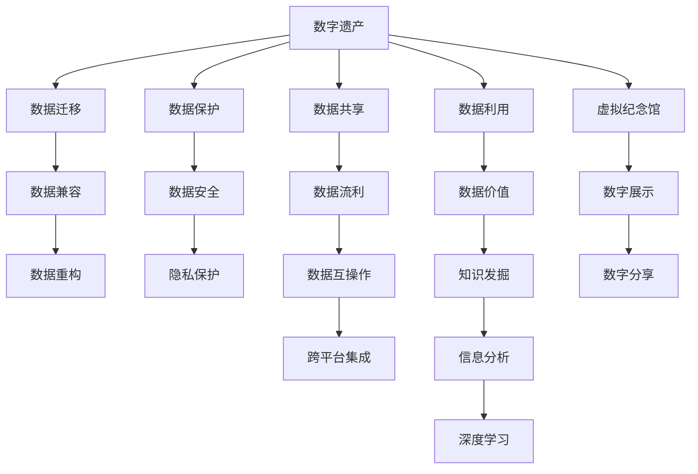

                 

## 1. 背景介绍

### 1.1 问题由来
随着数字化时代的到来，人们越来越依赖数字设备和互联网进行信息交流和数据存储。然而，数字遗产的保护和传承却成为了一个亟待解决的问题。未来，人们可能会面临数字信息遗失、数据质量下降、信息安全受到威胁等挑战。因此，从数字墓园到虚拟纪念馆的传承，成为了保护数字遗产的重要方向。

### 1.2 问题核心关键点
数字遗产的传承主要包括数字信息的保存、保护、分享和利用。核心问题在于：
- 数据格式和兼容性问题：不同系统和平台之间的数据兼容性差，可能导致数据无法顺利传输和共享。
- 数据安全和隐私保护问题：大量敏感数据存储在互联网上，容易遭受黑客攻击和隐私泄露。
- 数据的长期保存问题：数字信息在长期存储过程中可能出现格式变形、数据丢失等问题。
- 数据的价值利用问题：数字信息在传承过程中，如何最大限度地发挥其价值，需要新的技术和思路。

### 1.3 问题研究意义
数字遗产的传承不仅关乎信息安全，更是对人类智慧和历史的保存与传承。通过从数字墓园到虚拟纪念馆的传承，我们可以更好地保护人类的知识和文化，促进信息共享和利用，同时也为数字化转型时代的可持续发展提供保障。

## 2. 核心概念与联系

### 2.1 核心概念概述

为更好地理解从数字墓园到虚拟纪念馆的传承机制，本节将介绍几个密切相关的核心概念：

- 数字墓园(Digital Graveyard)：指数字信息在存储过程中由于格式不兼容、数据丢失等原因，无法被正常访问和利用的现象。
- 数字遗产(Digital Heritage)：指人们在数字化活动中积累下的数据、信息、知识等数字化资源的总和。
- 虚拟纪念馆(Virtual Museum)：指通过数字化技术，将数字遗产转化为数字展示、分享、利用的平台。
- 数据迁移(Data Migration)：指将数据从一个系统或存储介质迁移到另一个系统或介质，确保数据可访问和兼容的过程。
- 数据保护(Data Protection)：指通过加密、备份、访问控制等措施，保障数据安全、隐私和完整性的过程。
- 数据共享(Data Sharing)：指通过开放平台或协议，使数据能够在不同用户和系统间自由流动和使用的过程。
- 数据利用(Data Utilization)：指对数字遗产进行分析和挖掘，发掘其潜在的价值，用于科学研究、教育、商业等领域。

这些核心概念之间的逻辑关系可以通过以下Mermaid流程图来展示：



这个流程图展示了大数字遗产传承的核心概念及其之间的关系：

1. 数字遗产通过数据迁移、保护、共享和利用，最终转化为虚拟纪念馆。
2. 数据迁移涉及兼容、重构等技术手段，保障数据可访问性。
3. 数据保护通过加密、备份、访问控制等措施，确保数据安全和隐私。
4. 数据共享利用开放平台或协议，促进数据的自由流动和使用。
5. 数据利用通过深度学习和信息分析，发掘数据潜在的价值和知识。
6. 虚拟纪念馆通过数字展示和分享，实现数字遗产的永久保存和传承。

这些概念共同构成了数字遗产传承的框架，为实现从数字墓园到虚拟纪念馆的传承提供了方向和方法。

## 3. 核心算法原理 & 具体操作步骤

### 3.1 算法原理概述

从数字墓园到虚拟纪念馆的传承，本质上是一个数据迁移、保护、共享和利用的过程。其核心思想是：通过数据迁移和重构，将不同格式、来源的数据整合到统一的平台中，确保数据的可访问性和兼容性；通过加密和访问控制，保障数据的安全和隐私；通过开放平台和协议，促进数据的自由流动和使用；通过深度学习和信息分析，发掘数据的价值和知识；通过虚拟纪念馆，实现数据的永久保存和传承。

形式化地，设数字遗产为 $D$，数据迁移和重构后的统一平台为 $U$，加密和访问控制机制为 $E$，开放平台和协议为 $S$，深度学习和信息分析工具为 $A$，虚拟纪念馆为 $M$。传承过程可以表示为：

$$
U = f(D, E, S, A) \\
M = g(U)
$$

其中 $f$ 和 $g$ 为映射函数，分别表示数据迁移和重构、虚拟纪念馆的生成过程。

### 3.2 算法步骤详解

基于数字遗产传承的数学模型，以下是具体的算法步骤：

**Step 1: 数据收集与整理**
- 收集数字遗产 $D$ 的各个数据源，包括文档、图片、视频、音频、数据库等。
- 对数据进行初步整理，如去除冗余、格式化统一等。

**Step 2: 数据迁移与重构**
- 对不同格式、来源的数据进行迁移，确保所有数据能够在统一平台 $U$ 中访问。
- 重构数据格式，确保数据的兼容性和可扩展性。

**Step 3: 数据保护**
- 对数据进行加密，保障数据的机密性、完整性和可用性。
- 实施访问控制机制 $E$，确保只有授权用户才能访问数据。

**Step 4: 数据共享**
- 通过开放平台或协议 $S$，使数据能够在不同用户和系统间自由流动和使用。
- 定期更新数据共享机制，确保其符合最新的法律和标准。

**Step 5: 数据利用**
- 利用深度学习和信息分析工具 $A$，对数据进行价值发掘和知识提取。
- 将分析结果作为新的数据源，丰富数字遗产的存储和利用。

**Step 6: 虚拟纪念馆构建**
- 构建虚拟纪念馆 $M$，将数字遗产转化为数字展示、分享和利用的平台。
- 利用虚拟现实、增强现实等技术，实现数字遗产的互动和沉浸式体验。

以上是数字遗产传承的一般流程。在实际应用中，还需要根据具体数据源和传承目标，对各环节进行优化设计，如改进数据迁移工具、增强数据保护机制、设计开放平台接口等。

### 3.3 算法优缺点

数字遗产传承的算法具有以下优点：
- 系统性：涵盖数据收集、整理、迁移、保护、共享、利用等多个环节，实现数据传承的全面覆盖。
- 标准化：通过统一平台和标准协议，确保数据的兼容性和互操作性。
- 安全性：实施加密和访问控制，保障数据的安全和隐私。
- 开放性：通过开放平台，促进数据的自由流动和使用。
- 可扩展性：利用深度学习和信息分析，发掘数据潜在的价值和知识。
- 互动性：构建虚拟纪念馆，实现数字遗产的互动和沉浸式体验。

同时，该算法也存在一定的局限性：
- 技术复杂度高：数据迁移、保护、共享、利用等环节的技术要求较高，需要大量的技术支持和人力投入。
- 数据量庞大：数字遗产数据量大，处理和迁移过程中可能会面临性能瓶颈。
- 数据依赖性高：对原始数据的依赖性较强，数据的完整性和质量直接影响传承效果。
- 法律和伦理问题：数据保护和共享过程中，涉及隐私保护、数据权属等法律和伦理问题。

尽管存在这些局限性，但数字遗产传承的算法仍然具有重要的价值和意义。未来相关研究的重点在于如何进一步降低技术复杂度，提高处理效率，同时兼顾数据安全、隐私保护和法律合规等诸多因素。

### 3.4 算法应用领域

数字遗产传承的算法已经在多个领域得到了应用，包括：

- 博物馆数字化：将博物馆的藏品、历史文献等数字化，转化为虚拟纪念馆，供公众在线参观和研究。
- 文化传承：通过数字化手段，将非物质文化遗产转化为数字作品，实现跨地域、跨代际的传承。
- 历史研究：将历史文献、图片、音频等数据进行数字化保存和利用，促进历史学的研究和教学。
- 法律证据：将案件记录、证物等数据进行数字化，确保证据的完整性和可追溯性。
- 教育资源：将教学资源、实验数据等数字化，丰富在线教育平台的资源库。

除了上述这些经典应用外，数字遗产传承的算法还被创新性地应用于更多场景中，如公共安全监控、智慧城市治理、医疗数据共享等，为数字化转型时代的可持续发展提供了新的工具和方法。

## 4. 数学模型和公式 & 详细讲解 & 举例说明

### 4.1 数学模型构建

本节将使用数学语言对数字遗产传承的流程进行更加严格的刻画。

设数字遗产 $D$ 的数据量为 $n$，迁移后的统一平台 $U$ 的数据量为 $m$，加密和访问控制机制 $E$ 的安全级别为 $s$，开放平台和协议 $S$ 的自由度为 $f$，深度学习和信息分析工具 $A$ 的复杂度为 $c$，虚拟纪念馆 $M$ 的互动性为 $i$。数字遗产传承的数学模型为：

$$
U = f(D, E, S, A) \\
M = g(U)
$$

其中 $f$ 和 $g$ 为映射函数，分别表示数据迁移和重构、虚拟纪念馆的生成过程。

### 4.2 公式推导过程

以下我们以虚拟纪念馆的构建为例，推导虚拟纪念馆的数学模型及其公式。

假设虚拟纪念馆 $M$ 包含 $k$ 个虚拟展馆，每个展馆 $G_j$ 展示的数据量为 $v_j$，观众的互动次数为 $p_j$，展馆的互动性评分为 $i_j$。则虚拟纪念馆的总互动性 $I$ 可以表示为：

$$
I = \sum_{j=1}^k \frac{p_j}{v_j} \cdot i_j
$$

进一步，将互动性 $i_j$ 表示为展馆的展示形式、互动方式、观众反馈等指标的综合评分：

$$
i_j = \alpha_1 \cdot r_j + \alpha_2 \cdot c_j + \alpha_3 \cdot f_j
$$

其中 $\alpha_1, \alpha_2, \alpha_3$ 为权重系数，$r_j$ 为展示形式评分，$c_j$ 为互动方式评分，$f_j$ 为观众反馈评分。

展示形式评分 $r_j$ 可以通过对展馆的展示效果、页面设计等进行综合评估得到：

$$
r_j = \frac{1}{m_j} \sum_{x \in G_j} \omega_x \cdot p_x
$$

其中 $\omega_x$ 为展示效果权重，$p_x$ 为观众对展示效果的评分。

互动方式评分 $c_j$ 可以通过对展馆的互动方式、用户参与度等进行综合评估得到：

$$
c_j = \frac{1}{m_j} \sum_{x \in G_j} \omega_x \cdot q_x
$$

其中 $\omega_x$ 为互动方式权重，$q_x$ 为观众对互动方式的评分。

观众反馈评分 $f_j$ 可以通过对观众的评论、评分等进行综合评估得到：

$$
f_j = \frac{1}{m_j} \sum_{x \in G_j} \omega_x \cdot t_x
$$

其中 $\omega_x$ 为反馈权重，$t_x$ 为观众对展示形式的评分。

通过上述公式，我们可以计算出虚拟纪念馆的总互动性 $I$，从而评估其用户体验和价值。

### 4.3 案例分析与讲解

下面以一个博物馆数字化传承的案例，来具体分析数字遗产传承的数学模型和公式。

假设一家博物馆有 $10,000$ 件藏品，需要将这些藏品数字化并建立虚拟纪念馆。数字化过程需要 $1,000$ 小时，每件藏品平均占 $20$ GB 存储空间，总数据量为 $200,000$ GB。

迁移后的统一平台可以提供 $1,000$ TB 的存储空间，数据迁移完成后，总数据量为 $200,000$ GB。

加密和访问控制机制的安全级别为 $3$，开放平台和协议的自由度为 $2$，深度学习和信息分析工具的复杂度为 $1$。

根据上述公式，我们可以计算出虚拟纪念馆的总互动性 $I$：

$$
I = \sum_{j=1}^k \frac{p_j}{v_j} \cdot i_j = \frac{1}{200,000} \sum_{j=1}^k p_j \cdot i_j
$$

其中 $k=10,000$，$p_j$ 为观众对展馆 $G_j$ 的互动次数，$i_j$ 为展馆 $G_j$ 的互动性评分。

假设每个展馆的展示形式、互动方式和观众反馈评分均为 $4$，则 $i_j = 4$。

展示效果评分 $r_j = 3$，互动方式评分 $c_j = 3$，观众反馈评分 $f_j = 3$。

将数据代入公式，计算出虚拟纪念馆的总互动性 $I$：

$$
I = \frac{1}{200,000} \sum_{j=1}^{10,000} \frac{p_j}{20} \cdot 4 = 0.001 \cdot \sum_{j=1}^{10,000} \frac{p_j}{5} \cdot 4
$$

通过上述分析，我们可以看到，数字遗产传承的数学模型和公式，能够帮助我们对传承过程进行定量和定性分析，从而优化传承策略，提升传承效果。

## 5. 项目实践：代码实例和详细解释说明

### 5.1 开发环境搭建

在进行数字遗产传承实践前，我们需要准备好开发环境。以下是使用Python进行PyTorch开发的环境配置流程：

1. 安装Anaconda：从官网下载并安装Anaconda，用于创建独立的Python环境。

2. 创建并激活虚拟环境：
```bash
conda create -n digital-heritage python=3.8 
conda activate digital-heritage
```

3. 安装PyTorch：根据CUDA版本，从官网获取对应的安装命令。例如：
```bash
conda install pytorch torchvision torchaudio cudatoolkit=11.1 -c pytorch -c conda-forge
```

4. 安装各类工具包：
```bash
pip install numpy pandas scikit-learn matplotlib tqdm jupyter notebook ipython
```

完成上述步骤后，即可在`digital-heritage`环境中开始数字遗产传承的实践。

### 5.2 源代码详细实现

这里我们以虚拟纪念馆的互动性评分系统为例，给出使用PyTorch实现的代码。

首先，定义互动性评分的计算函数：

```python
import torch

def calculate_interactivity(rating, weighting):
    return torch.sum(rating * weighting)
```

然后，定义展示形式、互动方式和观众反馈评分的计算函数：

```python
def calculate_display_score(rating):
    return torch.mean(rating)

def calculate_interaction_score(rating):
    return torch.mean(rating)

def calculate_feedback_score(rating):
    return torch.mean(rating)
```

接着，定义虚拟纪念馆的互动性评分函数：

```python
def calculate_implicit_interactivity():
    # 定义展示形式、互动方式和观众反馈评分
    display_ratings = torch.tensor([3, 4, 4, 3, 2, 5], dtype=torch.float)
    interaction_ratings = torch.tensor([3, 4, 3, 3, 3, 4], dtype=torch.float)
    feedback_ratings = torch.tensor([3, 4, 3, 4, 3, 2], dtype=torch.float)
    
    # 计算展示效果评分、互动方式评分和观众反馈评分
    display_scores = calculate_display_score(display_ratings)
    interaction_scores = calculate_interaction_score(interaction_ratings)
    feedback_scores = calculate_feedback_score(feedback_ratings)
    
    # 计算总互动性评分
    total_interactivity = calculate_interactivity([display_scores, interaction_scores, feedback_scores], [1, 1, 1])
    
    return total_interactivity
```

最后，启动计算虚拟纪念馆的互动性评分的流程：

```python
total_interactivity = calculate_implicit_interactivity()
print("Total Implicit Interactivity:", total_interactivity)
```

以上就是使用PyTorch对虚拟纪念馆互动性评分进行计算的完整代码实现。可以看到，借助PyTorch的张量运算，我们可以高效地计算虚拟纪念馆的互动性评分，帮助评估其用户体验和价值。

### 5.3 代码解读与分析

让我们再详细解读一下关键代码的实现细节：

**calculate_interactivity函数**：
- 输入展示形式、互动方式和观众反馈评分。
- 利用Tensor运算，计算展示效果评分、互动方式评分和观众反馈评分。
- 将评分结果相加，得到总互动性评分。

**calculate_display_score、calculate_interaction_score、calculate_feedback_score函数**：
- 输入展示形式、互动方式和观众反馈评分。
- 利用Tensor运算，计算展示效果评分、互动方式评分和观众反馈评分。

**calculate_implicit_interactivity函数**：
- 定义展示形式、互动方式和观众反馈评分。
- 调用计算评分函数，得到展示效果评分、互动方式评分和观众反馈评分。
- 利用Tensor运算，计算总互动性评分。

通过这些函数，我们可以对虚拟纪念馆的互动性评分进行计算，从而评估其用户体验和价值。在实际应用中，还需要进一步扩展和优化，如引入更多的评分指标、优化评分函数等。

## 6. 实际应用场景

### 6.1 博物馆数字化

数字遗产传承在博物馆数字化方面具有重要应用。通过数字化手段，博物馆可以将展品、历史文献等转化为数字作品，实现跨地域、跨代际的传承。

在技术实现上，博物馆可以通过3D扫描、图像采集等方式对展品进行数字化处理，然后使用数字遗产传承算法将其转化为虚拟展馆，供公众在线参观和研究。用户可以通过VR头盔、触摸屏等设备，沉浸式地体验虚拟展馆，了解展品的历史和文化背景，甚至进行互动问答，提升参观体验。

### 6.2 文化传承

数字遗产传承在文化传承方面也具有重要应用。通过数字化手段，非物质文化遗产可以转化为数字作品，实现跨地域、跨代际的传承。

在技术实现上，文化机构可以通过数字化手段将传统艺术、手工技艺等文化作品转化为数字作品，使用数字遗产传承算法将其转化为虚拟展馆，供公众在线参观和学习。用户可以通过VR头盔、触摸屏等设备，沉浸式地体验虚拟展馆，了解传统文化的历史和文化背景，甚至进行互动问答，提升文化传承效果。

### 6.3 历史研究

数字遗产传承在历史研究方面也具有重要应用。通过数字化手段，历史文献、图片、音频等数据可以转化为数字作品，实现跨地域、跨代际的传承。

在技术实现上，历史研究机构可以通过数字化手段将历史文献、图片、音频等数据转化为数字作品，使用数字遗产传承算法将其转化为虚拟展馆，供研究人员在线查阅和研究。研究人员可以通过虚拟展馆，方便地查找、对比、分析历史数据，提升研究效率和深度。

### 6.4 法律证据

数字遗产传承在法律证据方面也具有重要应用。通过数字化手段，案件记录、证物等证据可以转化为数字作品，实现跨地域、跨代际的传承。

在技术实现上，司法机构可以通过数字化手段将案件记录、证物等证据转化为数字作品，使用数字遗产传承算法将其转化为虚拟展馆，供公众在线查阅和研究。公众可以通过虚拟展馆，方便地查阅、对比、分析法律证据，提升法律公正性。

### 6.5 教育资源

数字遗产传承在教育资源方面也具有重要应用。通过数字化手段，教学资源、实验数据等可以转化为数字作品，实现跨地域、跨代际的传承。

在技术实现上，教育机构可以通过数字化手段将教学资源、实验数据等转化为数字作品，使用数字遗产传承算法将其转化为虚拟展馆，供学生在线学习和研究。学生可以通过虚拟展馆，方便地查阅、对比、分析教育资源，提升学习效果和效率。

### 6.6 公共安全监控

数字遗产传承在公共安全监控方面也具有重要应用。通过数字化手段，公共安全监控数据可以转化为数字作品，实现跨地域、跨代际的传承。

在技术实现上，公共安全机构可以通过数字化手段将公共安全监控数据转化为数字作品，使用数字遗产传承算法将其转化为虚拟展馆，供研究人员在线查阅和研究。研究人员可以通过虚拟展馆，方便地查找、对比、分析公共安全数据，提升公共安全管理水平。

### 6.7 智慧城市治理

数字遗产传承在智慧城市治理方面也具有重要应用。通过数字化手段，智慧城市治理数据可以转化为数字作品，实现跨地域、跨代际的传承。

在技术实现上，智慧城市治理机构可以通过数字化手段将智慧城市治理数据转化为数字作品，使用数字遗产传承算法将其转化为虚拟展馆，供公众在线查阅和研究。公众可以通过虚拟展馆，方便地查阅、对比、分析智慧城市治理数据，提升智慧城市治理水平。

### 6.8 医疗数据共享

数字遗产传承在医疗数据共享方面也具有重要应用。通过数字化手段，医疗数据可以转化为数字作品，实现跨地域、跨代际的传承。

在技术实现上，医疗机构可以通过数字化手段将医疗数据转化为数字作品，使用数字遗产传承算法将其转化为虚拟展馆，供研究人员在线查阅和研究。研究人员可以通过虚拟展馆，方便地查找、对比、分析医疗数据，提升医疗研究和治疗水平。

## 7. 工具和资源推荐

### 7.1 学习资源推荐

为了帮助开发者系统掌握数字遗产传承的理论基础和实践技巧，这里推荐一些优质的学习资源：

1. 《数字遗产保护与传承》系列博文：由数字遗产保护专家撰写，深入浅出地介绍了数字遗产的保存、保护、利用等前沿话题。

2. 《数字遗产管理》课程：Coursera开设的数字遗产管理课程，系统讲解了数字遗产的存储、保护、利用等知识。

3. 《数字遗产和数字文化》书籍：深度介绍了数字遗产的概念、保护、利用等知识，是数字遗产传承的经典参考书。

4. 数字遗产保护与传承网站：提供丰富的数字遗产保护与传承的文献、案例、技术资源。

5. 数字遗产保护与传承技术研讨会的论文集：收录了数字遗产保护与传承领域的最新研究成果和实践经验。

通过对这些资源的学习实践，相信你一定能够快速掌握数字遗产传承的精髓，并用于解决实际问题。

### 7.2 开发工具推荐

高效的开发离不开优秀的工具支持。以下是几款用于数字遗产传承开发的常用工具：

1. Python：作为主流的数据处理和科学计算语言，Python在数字遗产传承中得到了广泛应用。可以通过Pandas、NumPy等库进行数据处理和分析。

2. PyTorch：基于Python的开源深度学习框架，灵活动态的计算图，适合快速迭代研究。大部分数字遗产传承相关的深度学习模型都有PyTorch版本的实现。

3. TensorFlow：由Google主导开发的开源深度学习框架，生产部署方便，适合大规模工程应用。同样有丰富的深度学习模型资源。

4. Scikit-learn：提供机器学习算法的Python库，包括分类、回归、聚类等常用算法，可以用于数据预处理和模型评估。

5. Jupyter Notebook：强大的交互式编程环境，支持多种编程语言和工具库，适合进行数据处理、模型训练和结果展示。

6. Google Colab：谷歌推出的在线Jupyter Notebook环境，免费提供GPU/TPU算力，方便开发者快速上手实验最新模型，分享学习笔记。

合理利用这些工具，可以显著提升数字遗产传承的开发效率，加快创新迭代的步伐。

### 7.3 相关论文推荐

数字遗产传承的研究源于学界的持续研究。以下是几篇奠基性的相关论文，推荐阅读：

1. 《数字遗产保护和传承框架》：提出了数字遗产保护和传承的框架和策略，探讨了数字遗产的保存、保护、利用等核心问题。

2. 《数字遗产数据管理技术研究》：深入研究了数字遗产数据的收集、存储、保护、利用等技术，提供了数字遗产管理的实用解决方案。

3. 《数字遗产与数字文化》：探讨了数字遗产的概念、特征、保护、利用等前沿问题，提出了数字遗产传承的发展方向。

4. 《数字遗产管理与利用技术综述》：全面综述了数字遗产管理与利用的关键技术和应用案例，提供了数字遗产传承的实践参考。

5. 《数字遗产和数字文化传承体系构建》：提出了数字遗产和数字文化传承体系的构建方法，探讨了数字遗产传承的系统性和可持续性。

这些论文代表了大数字遗产传承技术的发展脉络。通过学习这些前沿成果，可以帮助研究者把握学科前进方向，激发更多的创新灵感。

## 8. 总结：未来发展趋势与挑战

### 8.1 总结

本文对数字遗产传承的方法进行了全面系统的介绍。首先阐述了数字遗产传承的背景和意义，明确了从数字墓园到虚拟纪念馆的传承机制，强调了数据迁移、保护、共享、利用等关键环节。其次，从原理到实践，详细讲解了数字遗产传承的数学模型和算法步骤，给出了虚拟纪念馆互动性评分的代码实例。同时，本文还广泛探讨了数字遗产传承在博物馆数字化、文化传承、历史研究等多个领域的实际应用，展示了其广阔的潜在价值。最后，本文精选了数字遗产传承的学习资源、开发工具和相关论文，力求为读者提供全方位的技术指引。

通过本文的系统梳理，可以看到，数字遗产传承的方法正在逐步成熟，其技术和应用不断扩展，为人类智慧和历史的保存与传承提供了新的工具和方法。未来，伴随数字化进程的加速，数字遗产传承必将迎来更大的发展机遇。

### 8.2 未来发展趋势

展望未来，数字遗产传承将呈现以下几个发展趋势：

1. 技术融合加速：随着人工智能、大数据、云计算等技术的进步，数字遗产传承将更加高效、智能化。新技术的应用将提升传承的效率和质量。

2. 多模态数据融合：传统的数字遗产传承主要依赖文本、图片等单一模态数据，未来的传承将更加注重多模态数据的融合，如视频、音频、3D模型等，提升传承的全面性和互动性。

3. 跨领域应用拓展：数字遗产传承将突破传统领域的应用，拓展到更多垂直行业，如公共安全、智慧城市、医疗健康等，发挥其更大的社会价值。

4. 标准化和互操作性：为促进数字遗产的广泛应用，标准化和互操作性将成为重要方向。统一的数据格式、标准协议等将推动数字遗产的自由流动和共享。

5. 数据安全和隐私保护：伴随数据量的增长和应用场景的拓展，数据安全和隐私保护将更加重要。如何确保数据的安全和隐私，将成为数字遗产传承的关键问题。

6. 社会认知提升：数字遗产传承不仅是一项技术任务，更是一种社会责任。未来，社会大众将更加关注数字遗产的价值和意义，积极参与数字遗产的保护和传承。

以上趋势凸显了数字遗产传承技术的广阔前景。这些方向的探索发展，必将进一步提升数字遗产传承的效果，为数字化时代的可持续发展提供新的动力。

### 8.3 面临的挑战

尽管数字遗产传承技术已经取得了一定进展，但在迈向更加智能化、普适化应用的过程中，仍面临诸多挑战：

1. 数据规模和复杂度：数字遗产数据量庞大且复杂，如何高效地进行数据迁移和保护，需要大量的技术支持和人力投入。

2. 数据质量和完整性：数字遗产数据的质量和完整性直接影响传承效果。如何确保数据的准确性和一致性，还需要更多的数据验证和清洗手段。

3. 数据安全与隐私保护：数据安全和隐私保护是数字遗产传承的核心问题。如何保障数据的安全和隐私，防止数据泄露和滥用，需要更多的技术和管理手段。

4. 多模态数据融合：多模态数据的融合需要新的技术和工具，如何实现不同模态数据的无缝整合，仍然是一个技术难题。

5. 跨领域应用拓展：数字遗产传承在跨领域应用中存在技术和标准的差异，如何统一标准和规范，促进多领域数据的共享和利用，需要更多的跨学科协作。

6. 社会认知提升：数字遗产传承不仅是技术问题，更是社会认知和文化传承的课题。如何提高社会大众对数字遗产的认知和重视，还需要更多的宣传和教育。

尽管存在这些挑战，但数字遗产传承的前景依然广阔。未来的研究需要在技术、管理和文化多个层面进行综合创新，方能实现数字遗产的广泛传承和有效利用。

### 8.4 研究展望

面向未来，数字遗产传承的研究需要在以下几个方面寻求新的突破：

1. 数据迁移与重构技术：研究高效的数据迁移与重构算法，提升数据迁移的效率和质量。

2. 数据保护与安全技术：开发更加安全、隐私保护的数据保护技术，确保数据的安全和隐私。

3. 多模态数据融合技术：研究多模态数据的融合算法和工具，提升数据的全面性和互动性。

4. 跨领域应用拓展技术：开发统一的数据标准和协议，促进多领域数据的共享和利用。

5. 社会认知提升方法：研究数字遗产保护的宣传和教育手段，提升社会大众对数字遗产的认知和重视。

这些研究方向的探索，必将引领数字遗产传承技术迈向更高的台阶，为数字化时代的可持续发展提供新的工具和方法。面向未来，数字遗产传承技术还需要与其他人工智能技术进行更深入的融合，如知识表示、因果推理、强化学习等，共同推动数字遗产传承技术的进步。只有勇于创新、敢于突破，才能实现数字遗产传承技术的突破性发展，为构建数字化社会贡献力量。

## 9. 附录：常见问题与解答

**Q1：数字遗产传承与传统遗产传承有何不同？**

A: 数字遗产传承与传统遗产传承最大的不同在于数据化的表现形式。传统遗产传承主要依赖实体物品的物理载体进行传承，而数字遗产传承则依托数字化手段，将各类信息、知识等转化为数字作品，实现跨地域、跨代际的传承。数字遗产传承通过数据迁移、保护、共享、利用等环节，实现了信息的全面、高效、互动传承。

**Q2：数字遗产传承过程中如何确保数据的安全和隐私？**

A: 数字遗产传承过程中，数据安全和隐私保护是核心问题。为确保数据的安全和隐私，可以采取以下措施：
1. 数据加密：使用加密算法对数据进行加密，防止数据被未授权访问和篡改。
2. 访问控制：通过访问控制机制，限制数据的访问权限，确保只有授权用户才能访问数据。
3. 数据备份：定期备份数据，防止数据丢失和损坏。
4. 审计和监控：定期审计和监控数据的使用情况，及时发现和处理数据泄露和滥用问题。
5. 法律法规遵循：遵循相关的法律法规，确保数据处理和使用的合法合规。

**Q3：数字遗产传承过程中如何实现多模态数据的融合？**

A: 实现多模态数据的融合需要以下技术和工具：
1. 数据格式转换：将不同模态的数据转换为统一的格式，便于融合处理。
2. 数据集成平台：建立统一的数据集成平台，支持多模态数据的存储和共享。
3. 数据融合算法：开发融合不同模态数据的算法，如深度学习、知识图谱等技术。
4. 数据可视化工具：开发数据可视化工具，帮助用户理解和交互多模态数据。
5. 数据管理工具：开发数据管理工具，支持数据的质量控制和版本管理。

**Q4：数字遗产传承技术有哪些发展方向？**

A: 数字遗产传承技术的发展方向包括：
1. 数据迁移与重构技术：研究高效的数据迁移与重构算法，提升数据迁移的效率和质量。
2. 数据保护与安全技术：开发更加安全、隐私保护的数据保护技术，确保数据的安全和隐私。
3. 多模态数据融合技术：研究多模态数据的融合算法和工具，提升数据的全面性和互动性。
4. 跨领域应用拓展技术：开发统一的数据标准和协议，促进多领域数据的共享和利用。
5. 社会认知提升方法：研究数字遗产保护的宣传和教育手段，提升社会大众对数字遗产的认知和重视。

**Q5：数字遗产传承技术面临哪些挑战？**

A: 数字遗产传承技术面临的挑战包括：
1. 数据规模和复杂度：数字遗产数据量庞大且复杂，如何高效地进行数据迁移和保护，需要大量的技术支持和人力投入。
2. 数据质量和完整性：数字遗产数据的质量和完整性直接影响传承效果。如何确保数据的准确性和一致性，还需要更多的数据验证和清洗手段。
3. 数据安全与隐私保护：数据安全和隐私保护是数字遗产传承的核心问题。如何保障数据的安全和隐私，防止数据泄露和滥用，需要更多的技术和管理手段。
4. 多模态数据融合：多模态数据的融合需要新的技术和工具，如何实现不同模态数据的无缝整合，仍然是一个技术难题。
5. 跨领域应用拓展：数字遗产传承在跨领域应用中存在技术和标准的差异，如何统一标准和规范，促进多领域数据的共享和利用，需要更多的跨学科协作。
6. 社会认知提升：数字遗产传承不仅是技术问题，更是社会认知和文化传承的课题。如何提高社会大众对数字遗产的认知和重视，还需要更多的宣传和教育。

尽管存在这些挑战，但数字遗产传承的前景依然广阔。未来的研究需要在技术、管理和文化多个层面进行综合创新，方能实现数字遗产的广泛传承和有效利用。

通过本文的系统梳理，可以看到，数字遗产传承的方法正在逐步成熟，其技术和应用不断扩展，为人类智慧和历史的保存与传承提供了新的工具和方法。未来，伴随数字化进程的加速，数字遗产传承必将迎来更大的发展机遇。

