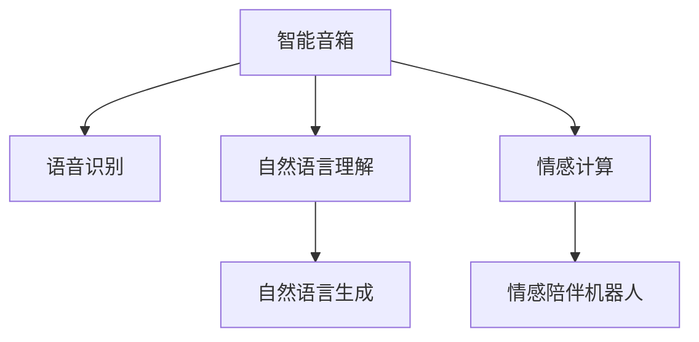

                 

## 1. 背景介绍

### 1.1 问题由来
随着科技进步和物联网的广泛应用，智能家居领域迎来了前所未有的变革。从智能音箱到情感陪伴机器人，智能设备正在以越来越深入的方式融入家庭生活，极大地提高了人们的生活质量和便利性。然而，这些智能设备的功能和性能仍然有待提升。未来，我们希望智能家居能够更加智能、更加高效、更加安全，真正成为家庭中的"智能化管家"。

### 1.2 问题核心关键点
在2050年的智能家居愿景中，智能音箱、情感陪伴机器人等设备将扮演重要角色。智能音箱将不仅是语音助手，还将具备情感理解和自然语言处理能力，能够根据用户的情绪状态和需求提供个性化的服务。情感陪伴机器人将能够理解和回应人类的情感需求，为家庭提供温馨的陪伴和互动。实现这些功能的关键在于深度学习和自然语言处理技术的进步。

## 2. 核心概念与联系

### 2.1 核心概念概述

为更好地理解2050年的智能家居愿景，本节将介绍几个密切相关的核心概念：

- 智能音箱：集成了自然语言处理(NLP)和语音识别技术，能够响应用户的语音命令，执行控制家电、查询信息等任务。
- 情感陪伴机器人：集成了自然语言理解(NLU)和情感计算技术，能够理解和回应用户的情感状态，提供情感陪伴和互动。
- 自然语言处理(NLP)：包括语音识别、自然语言理解、自然语言生成等技术，是实现智能家居的核心基础。
- 自然语言理解(NLU)：从文本中提取语义信息，是情感陪伴机器人等设备实现复杂交互的基础。
- 深度学习：通过多层次的神经网络结构，学习并表达复杂的数据模式，广泛应用于语音识别、情感计算等领域。

这些核心概念之间的逻辑关系可以通过以下Mermaid流程图来展示：



这个流程图展示了大语言模型在智能家居中的应用场景：

1. 智能音箱将语音信号转化为文本，进行自然语言理解，执行用户命令。
2. 情感陪伴机器人对用户的语音和文字进行情感计算，提供个性化服务和互动。
3. 自然语言处理技术支撑了智能音箱和情感陪伴机器人的功能实现。

## 3. 核心算法原理 & 具体操作步骤
### 3.1 算法原理概述

在智能家居领域，深度学习和自然语言处理技术的应用，使得设备能够理解并回应人类的情感需求。以下是智能家居系统中涉及的核心算法原理：

- **语音识别**：通过深度学习模型，将语音信号转化为文本，实现语音命令的识别和理解。
- **自然语言理解**：使用Transformer等模型，提取文本的语义信息，理解用户意图。
- **自然语言生成**：通过深度学习模型，生成自然流畅的文本回答，实现设备对用户的自然语言回应。
- **情感计算**：利用深度学习模型，识别和分析用户的情感状态，提供个性化的服务。

### 3.2 算法步骤详解

#### 3.2.1 语音识别

语音识别系统包括声学模型和语言模型两部分。声学模型通过深度学习模型（如CNN、RNN等），将语音信号转化为文本。语言模型通过循环神经网络（RNN）、Transformer等模型，对文本进行语言建模，提高识别的准确性。

**步骤**：
1. **特征提取**：提取语音信号的梅尔频谱图（MFCC）等特征。
2. **声学建模**：使用深度学习模型对MFCC进行分类，得到文本。
3. **语言建模**：使用RNN、Transformer等模型对文本进行语言建模，提高识别准确性。

#### 3.2.2 自然语言理解

自然语言理解系统使用Transformer等模型，提取文本的语义信息，理解用户意图。其核心在于使用自注意力机制，捕捉文本中的长距离依赖关系。

**步骤**：
1. **分词**：将文本分词，得到词向量表示。
2. **嵌入**：将词向量表示输入到Transformer模型中，提取语义信息。
3. **意图理解**：使用深度学习模型对语义信息进行分类，理解用户意图。

#### 3.2.3 自然语言生成

自然语言生成系统使用深度学习模型（如GAN、Seq2Seq等），生成自然流畅的文本回答，实现设备对用户的自然语言回应。其核心在于生成对抗网络（GAN）的生成模型，能够生成高质量的文本。

**步骤**：
1. **编码**：将用户意图编码为向量表示。
2. **解码**：使用GAN的生成模型，生成自然流畅的文本回答。

#### 3.2.4 情感计算

情感计算系统使用深度学习模型，识别和分析用户的情感状态，提供个性化的服务。其核心在于使用深度学习模型，对用户情感进行分类。

**步骤**：
1. **特征提取**：提取用户的语音、文字等情感特征。
2. **情感分类**：使用深度学习模型对情感特征进行分类，识别情感状态。
3. **服务响应**：根据情感状态，提供个性化的服务。

### 3.3 算法优缺点

智能家居系统的核心算法具有以下优点：

- **高性能**：深度学习模型在语音识别、自然语言理解、情感计算等方面表现出色，能够高效处理复杂的文本和语音数据。
- **高可靠性**：深度学习模型具有很强的泛化能力，能够在各种环境下保持稳定性能。
- **可扩展性**：深度学习模型可以方便地进行参数微调，提升性能和适应性。

然而，这些算法也存在一些缺点：

- **高计算资源需求**：深度学习模型通常需要大量的计算资源，对于小型设备和嵌入式系统可能不适用。
- **数据需求高**：深度学习模型需要大量的标注数据进行训练，数据获取和标注成本较高。
- **可解释性差**：深度学习模型的决策过程难以解释，缺乏透明性。

尽管存在这些局限性，但深度学习和自然语言处理技术在大语言模型中的应用，为智能家居系统提供了强大的技术支持，推动了智能家居的发展。

### 3.4 算法应用领域

深度学习和自然语言处理技术在智能家居系统中的应用，覆盖了语音识别、自然语言理解、自然语言生成和情感计算等多个方面。具体应用领域包括：

- **智能音箱**：通过语音识别和自然语言理解，实现语音命令的识别和执行。
- **情感陪伴机器人**：通过自然语言理解和情感计算，理解用户的情感状态，提供个性化的服务和互动。
- **智能家居设备控制**：通过自然语言生成，实现对家电、灯光等设备的控制和调节。
- **家庭健康监测**：通过语音识别和情感计算，实时监测用户的健康状态，提供健康建议和报警。

此外，深度学习和自然语言处理技术还应用于智能安防、智能娱乐、智能教育等多个领域，为智能家居的发展提供了丰富的应用场景。

## 4. 数学模型和公式 & 详细讲解 & 举例说明

### 4.1 数学模型构建

在智能家居系统中，深度学习和自然语言处理技术的应用，需要构建多个数学模型。以下是其中的几个关键模型：

- **声学模型**：用于语音识别，将语音信号转化为文本。常用的模型包括卷积神经网络（CNN）和递归神经网络（RNN）。
- **语言模型**：用于自然语言理解，提取文本的语义信息。常用的模型包括循环神经网络（RNN）和Transformer。
- **生成模型**：用于自然语言生成，生成自然流畅的文本回答。常用的模型包括生成对抗网络（GAN）和序列到序列模型（Seq2Seq）。
- **情感模型**：用于情感计算，识别和分析用户的情感状态。常用的模型包括卷积神经网络（CNN）和多层感知机（MLP）。

### 4.2 公式推导过程

#### 4.2.1 声学模型

声学模型常用的深度学习模型为卷积神经网络（CNN），其核心在于卷积层和池化层的操作。以经典的AlexNet为例，其结构如下：

$$
F(x) = \sigma(\mathcal{C} \cdot A(\mathcal{P}(\mathcal{F}(x))))
$$

其中，$\mathcal{F}$ 表示卷积层，$\mathcal{C}$ 表示卷积核，$\mathcal{P}$ 表示池化层，$\sigma$ 表示激活函数。

#### 4.2.2 语言模型

语言模型常用的深度学习模型为循环神经网络（RNN）和Transformer。以Transformer为例，其结构如下：

$$
F(x) = \mathcal{M} \cdot \mathcal{A}(x)
$$

其中，$\mathcal{M}$ 表示自注意力机制，$\mathcal{A}$ 表示前馈网络。

#### 4.2.3 生成模型

生成模型常用的深度学习模型为生成对抗网络（GAN）和序列到序列模型（Seq2Seq）。以GAN为例，其结构如下：

$$
G(x) = \sigma(\mathcal{G}(x) - \mathcal{D}(x))
$$

其中，$\mathcal{G}$ 表示生成器，$\mathcal{D}$ 表示判别器，$\sigma$ 表示激活函数。

#### 4.2.4 情感模型

情感模型常用的深度学习模型为卷积神经网络（CNN）和多层感知机（MLP）。以CNN为例，其结构如下：

$$
F(x) = \sigma(\mathcal{C} \cdot \mathcal{P}(\mathcal{F}(x)))
$$

其中，$\mathcal{F}$ 表示卷积层，$\mathcal{C}$ 表示卷积核，$\mathcal{P}$ 表示池化层，$\sigma$ 表示激活函数。

### 4.3 案例分析与讲解

以下是一个智能音箱的语音识别案例：

**案例背景**：用户对智能音箱说“播放贝多芬第九交响曲”。

**模型构建**：
1. **声学模型**：使用卷积神经网络（CNN）对语音信号进行特征提取和分类，得到文本“播放贝多芬第九交响曲”。
2. **语言模型**：使用循环神经网络（RNN）对文本进行语言建模，理解用户意图为“播放贝多芬第九交响曲”。
3. **自然语言生成**：使用生成对抗网络（GAN）生成自然流畅的文本回答“已为您播放贝多芬第九交响曲”。

**案例分析**：
该案例展示了智能音箱如何通过深度学习和自然语言处理技术，实现语音识别、自然语言理解和自然语言生成。用户只需要简单地通过语音命令，就可以控制智能音箱播放音乐。

## 5. 项目实践：代码实例和详细解释说明
### 5.1 开发环境搭建

在进行智能家居系统的开发实践前，我们需要准备好开发环境。以下是使用Python进行深度学习和自然语言处理开发的环境配置流程：

1. 安装Anaconda：从官网下载并安装Anaconda，用于创建独立的Python环境。

2. 创建并激活虚拟环境：
```bash
conda create -n pytorch-env python=3.8 
conda activate pytorch-env
```

3. 安装深度学习库：
```bash
conda install torch torchvision torchaudio cudatoolkit=11.1 -c pytorch -c conda-forge
```

4. 安装自然语言处理库：
```bash
pip install tensorflow transformers
```

5. 安装各类工具包：
```bash
pip install numpy pandas scikit-learn matplotlib tqdm jupyter notebook ipython
```

完成上述步骤后，即可在`pytorch-env`环境中开始开发实践。

### 5.2 源代码详细实现

下面我们以智能音箱的语音识别系统为例，给出使用TensorFlow进行深度学习开发的PyTorch代码实现。

**代码实现**：

```python
import tensorflow as tf
from tensorflow.keras.layers import Conv2D, MaxPooling2D, Flatten, Dense, Dropout
from tensorflow.keras.models import Sequential

# 定义模型
model = Sequential()
model.add(Conv2D(32, (3, 3), activation='relu', input_shape=(128, 128, 1)))
model.add(MaxPooling2D((2, 2)))
model.add(Conv2D(64, (3, 3), activation='relu'))
model.add(MaxPooling2D((2, 2)))
model.add(Conv2D(128, (3, 3), activation='relu'))
model.add(MaxPooling2D((2, 2)))
model.add(Flatten())
model.add(Dense(128, activation='relu'))
model.add(Dropout(0.5))
model.add(Dense(10, activation='softmax'))

# 编译模型
model.compile(optimizer='adam', loss='categorical_crossentropy', metrics=['accuracy'])

# 训练模型
model.fit(train_data, train_labels, epochs=10, batch_size=32)
```

**代码解读**：
1. **模型定义**：定义一个包含卷积层、池化层、全连接层的深度学习模型。
2. **模型编译**：使用Adam优化器和交叉熵损失函数编译模型。
3. **模型训练**：使用训练数据和标签训练模型，设置10个epoch和32个样本的批次大小。

### 5.3 代码解读与分析

**代码实现**：
1. **模型定义**：使用TensorFlow定义一个简单的卷积神经网络（CNN）模型，包括卷积层、池化层、全连接层等。
2. **模型编译**：使用Adam优化器和交叉熵损失函数编译模型，用于训练和评估。
3. **模型训练**：使用训练数据和标签训练模型，设置10个epoch和32个样本的批次大小。

**代码解读**：
1. **卷积层**：使用卷积层提取语音信号的特征，使用卷积核进行特征提取。
2. **池化层**：使用池化层减小特征图尺寸，降低计算复杂度。
3. **全连接层**：使用全连接层对特征进行分类，输出文本标签。

## 6. 实际应用场景
### 6.1 智能音箱

智能音箱是智能家居系统中不可或缺的一部分。通过语音识别和自然语言理解技术，智能音箱可以响应用户的语音命令，执行控制家电、查询信息等任务。未来，智能音箱将具备更强的语音识别和自然语言处理能力，能够理解复杂的语义信息和情感状态，提供更加个性化的服务。

**应用场景**：
1. **播放音乐**：用户通过语音命令，播放指定的音乐、歌手或专辑。
2. **控制家电**：用户通过语音命令，控制家中的灯光、空调、电视等设备。
3. **查询信息**：用户通过语音命令，查询天气、新闻、股票等信息。
4. **情感陪伴**：通过情感计算，智能音箱可以感知用户的情感状态，提供情感支持和服务。

### 6.2 情感陪伴机器人

情感陪伴机器人是智能家居系统中的另一大亮点。通过自然语言理解和情感计算技术，情感陪伴机器人可以理解用户的情感状态，提供情感支持和服务。未来，情感陪伴机器人将具备更加精准的情感识别和回应能力，成为用户的情感伙伴。

**应用场景**：
1. **情感陪伴**：情感陪伴机器人可以感知用户的情感状态，提供情感支持和服务。
2. **陪伴娱乐**：情感陪伴机器人可以与用户进行互动，提供陪伴娱乐服务。
3. **健康监测**：情感陪伴机器人可以通过情感计算，实时监测用户的健康状态，提供健康建议和报警。
4. **家庭安全**：情感陪伴机器人可以感知用户的安全状态，提供安全保障服务。

### 6.3 智能家居设备控制

智能家居设备控制是智能家居系统中的重要功能之一。通过自然语言生成技术，智能音箱和情感陪伴机器人可以生成自然流畅的文本回答，实现对家电、灯光等设备的控制和调节。未来，智能家居设备将具备更加智能化的控制能力，提升用户体验。

**应用场景**：
1. **灯光控制**：用户通过语音命令，控制家中的灯光亮度和颜色。
2. **温度控制**：用户通过语音命令，调节家中的空调和暖气温度。
3. **家电控制**：用户通过语音命令，控制家中的电视、洗衣机等家电设备。
4. **场景模式**：用户通过语音命令，设置不同的场景模式，如"回家模式"、"离家模式"等。

### 6.4 未来应用展望

未来，智能家居系统将涵盖更多的应用场景，带来更广泛的变革。以下是几个可能的发展方向：

1. **全屋互联**：未来的智能家居系统将实现全屋互联，设备之间可以无缝连接和协同工作。
2. **实时互动**：未来的智能家居系统将具备实时互动能力，通过自然语言处理技术，实现更加智能化的交互体验。
3. **个性化服务**：未来的智能家居系统将提供更加个性化的服务，通过情感计算和推荐算法，满足用户的个性化需求。
4. **智能安防**：未来的智能家居系统将具备智能安防功能，通过情感计算和行为分析，提高家庭安全保障。
5. **多模态交互**：未来的智能家居系统将支持多种交互方式，如语音、手势、表情等，提供更加丰富的人机交互体验。

## 7. 工具和资源推荐
### 7.1 学习资源推荐

为了帮助开发者系统掌握深度学习和自然语言处理技术，这里推荐一些优质的学习资源：

1. **《深度学习》课程**：斯坦福大学开设的深度学习课程，有Lecture视频和配套作业，带你入门深度学习的基本概念和经典模型。
2. **《自然语言处理》课程**：Coursera上的自然语言处理课程，涵盖NLP的基本概念和实用技巧，适合初学者和进阶者。
3. **《TensorFlow官方文档》**：TensorFlow的官方文档，提供丰富的教程和代码示例，适合实战学习和项目开发。
4. **《PyTorch官方文档》**：PyTorch的官方文档，提供丰富的教程和代码示例，适合实战学习和项目开发。
5. **《自然语言处理》书籍**：NLP领域的经典教材，涵盖NLP的基本概念和前沿技术，适合深入学习。

通过对这些资源的学习实践，相信你一定能够快速掌握深度学习和自然语言处理技术，并用于解决实际的智能家居问题。

### 7.2 开发工具推荐

高效的开发离不开优秀的工具支持。以下是几款用于深度学习和自然语言处理开发的常用工具：

1. **TensorFlow**：由Google主导开发的开源深度学习框架，生产部署方便，适合大规模工程应用。
2. **PyTorch**：由Facebook主导开发的开源深度学习框架，灵活动态的计算图，适合快速迭代研究。
3. **Keras**：高层次的深度学习框架，易于上手，适合初学者和实战开发。
4. **Jupyter Notebook**：交互式的开发环境，支持Python代码的实时运行和调试，适合实验开发。
5. **GitHub**：全球最大的代码托管平台，适合团队协作和代码分享，适合长期项目开发。

合理利用这些工具，可以显著提升深度学习和自然语言处理技术的开发效率，加快创新迭代的步伐。

### 7.3 相关论文推荐

深度学习和自然语言处理技术的发展源于学界的持续研究。以下是几篇奠基性的相关论文，推荐阅读：

1. **《深度学习》**：Goodfellow等著，深入介绍深度学习的理论和应用，是深度学习领域的经典教材。
2. **《自然语言处理综述》**：Kuhn等著，涵盖NLP的基本概念和前沿技术，是NLP领域的经典综述。
3. **《Attention is All You Need》**：Vaswani等著，提出Transformer结构，开创了NLP领域的预训练大模型时代。
4. **《BERT: Pre-training of Deep Bidirectional Transformers for Language Understanding》**：Devlin等著，提出BERT模型，引入自监督预训练任务，刷新了多项NLP任务SOTA。

这些论文代表了大语言模型和微调技术的发展脉络。通过学习这些前沿成果，可以帮助研究者把握学科前进方向，激发更多的创新灵感。

## 8. 总结：未来发展趋势与挑战

### 8.1 总结

本文对2050年的智能家居系统进行了全面系统的介绍。首先阐述了智能音箱和情感陪伴机器人在智能家居中的重要应用，明确了深度学习和自然语言处理技术的核心地位。其次，从原理到实践，详细讲解了深度学习模型的构建和应用，给出了智能家居系统开发的完整代码实例。同时，本文还广泛探讨了智能家居系统在多个领域的应用前景，展示了深度学习技术的广阔应用场景。

通过本文的系统梳理，可以看到，深度学习和自然语言处理技术在大语言模型中的应用，为智能家居系统提供了强大的技术支持，推动了智能家居的发展。未来，伴随深度学习技术的不断进步，智能家居系统将变得更加智能化、个性化和人性化，为人们的生活带来更多的便利和美好。

### 8.2 未来发展趋势

展望未来，深度学习和自然语言处理技术将呈现以下几个发展趋势：

1. **模型规模持续增大**：随着算力成本的下降和数据规模的扩张，深度学习模型的参数量还将持续增长。超大规模深度学习模型蕴含的丰富数据模式，将支撑更加复杂多变的智能家居应用。
2. **微调方法日趋多样**：除了传统的全参数微调外，未来将涌现更多参数高效的微调方法，如 Adapter、Prefix 等，在固定大部分预训练参数的同时，只更新极少量的任务相关参数。
3. **情感计算逐渐普及**：未来的智能家居系统将广泛应用情感计算技术，理解用户的情感状态，提供更加个性化的服务。
4. **多模态交互成为主流**：未来的智能家居系统将支持多种交互方式，如语音、手势、表情等，提供更加丰富的人机交互体验。
5. **实时互动能力提升**：未来的智能家居系统将具备实时互动能力，通过自然语言处理技术，实现更加智能化的交互体验。
6. **安全性和隐私保护加强**：未来的智能家居系统将更加注重安全性和隐私保护，采用加密、匿名化等技术，保障用户数据的安全。

以上趋势凸显了深度学习和自然语言处理技术在智能家居系统中的重要地位。这些方向的探索发展，必将进一步提升智能家居系统的性能和用户体验，为人类生活带来更多的便利和美好。

### 8.3 面临的挑战

尽管深度学习和自然语言处理技术在智能家居系统中取得了显著成果，但在迈向更加智能化、普适化应用的过程中，仍面临诸多挑战：

1. **数据需求高**：深度学习模型需要大量的标注数据进行训练，数据获取和标注成本较高。
2. **计算资源需求高**：深度学习模型通常需要大量的计算资源，对于小型设备和嵌入式系统可能不适用。
3. **可解释性差**：深度学习模型的决策过程难以解释，缺乏透明性。
4. **安全性和隐私保护**：智能家居系统需要保障用户数据的安全性和隐私保护，避免数据泄露和滥用。
5. **用户习惯和接受度**：智能家居系统需要用户习惯和接受新技术，避免使用复杂度高的系统。

尽管存在这些挑战，但通过不断的技术进步和创新，深度学习和自然语言处理技术必将克服这些挑战，为智能家居系统带来更多的创新和发展。

### 8.4 研究展望

面对深度学习和自然语言处理技术所面临的挑战，未来的研究需要在以下几个方面寻求新的突破：

1. **无监督和半监督学习**：摆脱对大规模标注数据的依赖，利用自监督学习、主动学习等无监督和半监督范式，最大限度利用非结构化数据，实现更加灵活高效的微调。
2. **轻量化模型**：开发更加轻量化、实时性的深度学习模型，适合小型设备和嵌入式系统，降低计算资源需求。
3. **模型可解释性**：开发更加可解释的深度学习模型，提高模型决策过程的透明性，便于用户理解和接受。
4. **安全性和隐私保护**：开发更加安全的深度学习模型，保障用户数据的安全性和隐私保护。
5. **多模态交互**：开发支持多模态交互的深度学习模型，提供更加丰富的人机交互体验。

这些研究方向的探索，必将引领深度学习和自然语言处理技术迈向更高的台阶，为智能家居系统带来更多的创新和发展。面向未来，深度学习和自然语言处理技术还需要与其他人工智能技术进行更深入的融合，如知识表示、因果推理、强化学习等，多路径协同发力，共同推动智能家居技术的进步。只有勇于创新、敢于突破，才能不断拓展深度学习和自然语言处理技术的边界，让智能家居系统更好地服务于人类生活。

## 9. 附录：常见问题与解答

**Q1：智能音箱和情感陪伴机器人的核心技术是什么？**

A: 智能音箱和情感陪伴机器人的核心技术包括深度学习和自然语言处理技术。具体而言，智能音箱需要语音识别、自然语言理解、自然语言生成等技术，能够响应用户的语音命令，执行控制家电、查询信息等任务。情感陪伴机器人需要自然语言理解和情感计算技术，能够理解用户的情感状态，提供情感支持和服务。

**Q2：如何提高深度学习模型的可解释性？**

A: 提高深度学习模型的可解释性可以从以下几个方面入手：
1. **简化模型结构**：通过网络剪枝、参数共享等方法，减少模型复杂度，提高模型可解释性。
2. **使用可视化工具**：利用可视化工具，展示模型内部的决策过程和特征重要性，帮助理解模型的行为。
3. **引入可解释模型**：使用可解释模型（如LIME、SHAP等），生成局部可解释的模型预测，便于理解模型决策。

**Q3：智能家居系统需要考虑哪些安全性和隐私保护措施？**

A: 智能家居系统需要考虑以下安全性和隐私保护措施：
1. **数据加密**：对用户数据进行加密存储和传输，防止数据泄露和篡改。
2. **匿名化处理**：对用户数据进行匿名化处理，保护用户隐私。
3. **访问控制**：采用身份认证、权限控制等技术，保障用户数据的安全性。
4. **系统安全**：采用安全漏洞扫描、防火墙等技术，保障系统安全。

**Q4：智能家居系统如何与外部设备进行交互？**

A: 智能家居系统可以通过以下几种方式与外部设备进行交互：
1. **无线通信**：通过Wi-Fi、蓝牙、NFC等无线通信方式，实现与外部设备的连接。
2. **语音交互**：通过智能音箱等设备，实现语音交互功能，让用户通过语音命令控制设备。
3. **数据共享**：通过API接口，实现与外部设备的数据共享和协同工作。

**Q5：智能家居系统如何提高用户接受度？**

A: 智能家居系统可以通过以下几种方式提高用户接受度：
1. **用户界面设计**：设计简洁、易用的用户界面，减少用户操作步骤。
2. **个性化服务**：根据用户的习惯和偏好，提供个性化的服务，提高用户满意度。
3. **用户教育**：通过用户手册、在线教程等形式，帮助用户了解和使用智能家居系统。

---

作者：禅与计算机程序设计艺术 / Zen and the Art of Computer Programming

