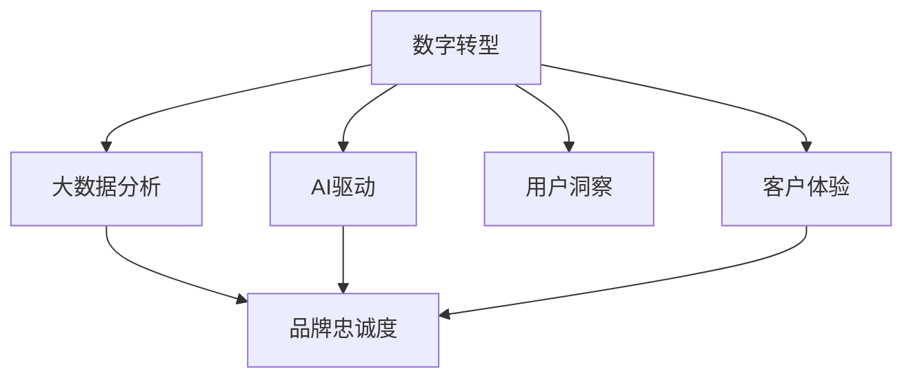

                 

# 应用公司的护城河构建策略

> 关键词：数字转型, 大数据, AI驱动, 用户洞察, 客户体验, 品牌忠诚度, 市场竞争力

## 1. 背景介绍

在快速发展的数字化时代，企业需要构建坚实的护城河以应对日益激烈的市场竞争。护城河不仅包括物理安全和经济实力，更重要的是企业的数据、技术、品牌和市场竞争优势。本文将围绕如何利用数字技术和AI驱动的公司构建其护城河策略，进行深入的分析和讨论。

## 2. 核心概念与联系

为了更好地理解构建数字应用公司护城河的策略，本文将介绍几个密切相关的核心概念：

### 2.1 核心概念概述

- **数字转型**：企业通过应用数字技术优化其业务流程，提升运营效率，从而在竞争中获得优势。
- **大数据分析**：利用海量数据，通过分析和挖掘，提取有价值的信息，支持企业决策。
- **AI驱动**：企业使用AI技术处理和分析数据，提升产品和服务质量，增强市场竞争力。
- **用户洞察**：通过对用户行为和偏好的深入了解，定制个性化服务，提升用户体验。
- **客户体验**：提供无缝、一致的用户体验，增加用户粘性和品牌忠诚度。
- **品牌忠诚度**：通过提供优质产品和服务，建立强大的品牌声誉和用户信任。
- **市场竞争力**：通过持续创新和优化，保持企业的市场领导地位。

这些概念之间的联系可以通过以下Mermaid流程图来展示：



这个流程图展示了大数据、AI驱动、用户洞察、客户体验等概念如何共同作用，构建公司的护城河：

1. 数字转型提供数据和技术基础。
2. 大数据分析提取有价值的信息，支持决策。
3. 用户洞察和AI驱动提升产品和服务，增强市场竞争力。
4. 良好的客户体验和品牌忠诚度构建和巩固公司的市场地位。

## 3. 核心算法原理 & 具体操作步骤

### 3.1 算法原理概述

构建护城河的算法原理主要包括以下几个关键点：

- **数据收集与清洗**：从多渠道收集数据，如社交媒体、销售记录、客户反馈等，并进行清洗处理，去除噪声和异常值。
- **特征工程**：提取和构造有意义的特征，为后续模型训练提供数据支持。
- **模型选择与训练**：选择合适的算法模型，如分类、回归、聚类等，并通过训练优化模型参数。
- **性能评估与优化**：通过交叉验证等技术评估模型性能，并进行调优。
- **预测与应用**：将训练好的模型应用于实际业务场景，进行用户行为预测、个性化推荐等。

### 3.2 算法步骤详解

以下是构建公司护城河的详细步骤：

**Step 1: 数据收集与清洗**
- 利用API、ETL工具从不同数据源收集数据，如销售记录、客户互动日志、社交媒体数据等。
- 进行数据清洗，处理缺失值、异常值和重复数据，确保数据质量。

**Step 2: 特征工程**
- 从原始数据中提取有意义的特征，如用户年龄、消费习惯、地域等。
- 应用降维、归一化等技术减少特征数量，提高模型效率。
- 设计交互特征，如用户历史行为与当前行为的结合，提升模型预测能力。

**Step 3: 模型选择与训练**
- 根据任务需求选择合适的算法模型，如决策树、随机森林、神经网络等。
- 使用交叉验证、网格搜索等技术确定最佳模型参数。
- 应用GPU、分布式训练等技术加速模型训练。

**Step 4: 性能评估与优化**
- 使用测试集评估模型性能，如准确率、召回率、F1分数等。
- 调整模型参数、增加数据量等手段优化模型性能。
- 通过A/B测试等方法验证模型效果，持续迭代改进。

**Step 5: 预测与应用**
- 将训练好的模型部署到生产环境，实时处理数据，生成预测结果。
- 根据预测结果优化产品设计、营销策略，提升用户体验。
- 通过监控指标实时评估模型效果，进行动态调整。

### 3.3 算法优缺点

构建公司护城河的算法具有以下优点：
1. 数据驱动：利用数据进行决策，能够客观、全面地了解市场变化和用户需求。
2. 灵活性高：算法可以动态调整，适应不同市场和业务需求。
3. 自动化程度高：通过自动化工具进行数据处理和模型训练，节省人力成本。
4. 增强决策质量：通过模型预测和分析，提升决策的科学性和准确性。

但同时也存在一些缺点：
1. 数据隐私和安全问题：在数据收集和处理过程中，需要关注用户隐私保护和数据安全。
2. 模型解释性不足：复杂的算法模型难以解释其决策过程，影响决策可信度。
3. 技术门槛高：需要具备一定的数据科学和技术背景，才能有效实施护城河构建策略。
4. 投资回报周期长：构建护城河涉及大量数据和模型开发，回报周期可能较长。

### 3.4 算法应用领域

构建护城河的算法在多个领域都有广泛应用，例如：

- **零售行业**：通过大数据分析和用户洞察，优化库存管理、个性化推荐，提升销售额和客户满意度。
- **金融行业**：利用AI模型进行信用评估、风险控制、欺诈检测，保障金融安全。
- **医疗行业**：使用AI进行疾病预测、诊断、治疗方案推荐，提升医疗服务质量。
- **教育行业**：通过数据分析，了解学生学习情况，个性化推荐学习资源，提高学习效果。
- **旅游行业**：利用客户行为数据，提供个性化旅行建议，提升用户体验。

## 4. 数学模型和公式 & 详细讲解 & 举例说明

### 4.1 数学模型构建

构建护城河的数学模型主要包括数据预处理、特征工程和模型训练三个部分。以下以分类任务为例，给出详细公式和模型构建步骤。

**数据预处理**：
- 输入：原始数据集 $D = \{(x_i, y_i)\}_{i=1}^N$，其中 $x_i$ 为样本特征向量， $y_i$ 为样本标签。
- 输出：处理后的数据集 $D' = \{(x_i', y_i')\}_{i=1}^N$，其中 $x_i'$ 为处理后的特征向量， $y_i'$ 为处理后的标签。

**特征工程**：
- 输入：处理后的数据集 $D'$ 和标签 $y'$。
- 输出：特征集 $X = \{x_1, x_2, ..., x_n\}$，其中每个 $x_i$ 为处理后的特征向量。

**模型训练**：
- 输入：特征集 $X$ 和标签 $y'$。
- 输出：训练好的模型 $M$，用于预测新样本的标签。

### 4.2 公式推导过程

以二分类问题为例，公式推导如下：

**损失函数**：
- 交叉熵损失：$L = -\frac{1}{N} \sum_{i=1}^N [y_i \log \hat{y_i} + (1 - y_i) \log (1 - \hat{y_i})]$
- 均方误差损失：$L = \frac{1}{N} \sum_{i=1}^N (y_i - \hat{y_i})^2$

**梯度下降公式**：
- 随机梯度下降：$w \leftarrow w - \eta \nabla_{w}L$
- 批量梯度下降：$w \leftarrow w - \eta \nabla_{w}L$

**模型预测**：
- 输入：特征集 $X$，模型 $M$。
- 输出：预测标签 $\hat{y}$。

### 4.3 案例分析与讲解

假设某电商网站需要提升新用户的转化率。通过收集用户行为数据和购买数据，构建分类模型预测用户是否会购买。

1. **数据收集与清洗**：
   - 收集用户在网站上的点击、浏览、添加至购物车、支付等行为数据。
   - 清洗数据，去除无效数据，确保数据质量。

2. **特征工程**：
   - 提取用户特征，如浏览时长、点击次数、购物车添加次数等。
   - 设计交互特征，如最近一次购买时间、浏览与购买的间隔时间等。

3. **模型选择与训练**：
   - 选择随机森林算法，进行特征选择和模型训练。
   - 使用交叉验证确定最佳模型参数。

4. **性能评估与优化**：
   - 使用测试集评估模型准确率，通过网格搜索优化模型参数。
   - 通过A/B测试验证模型效果，不断调整优化。

5. **预测与应用**：
   - 将训练好的模型部署到网站，实时预测新用户的购买概率。
   - 根据预测结果优化网站设计，提升用户体验。

## 5. 项目实践：代码实例和详细解释说明

### 5.1 开发环境搭建

构建护城河的算法实践需要使用Python进行数据处理和模型训练。以下是Python环境搭建流程：

1. 安装Python和Pandas：
   ```bash
   sudo apt-get update
   sudo apt-get install python3 python3-pip python3-dev
   sudo apt-get install pandas
   ```

2. 安装Scikit-learn和XGBoost：
   ```bash
   pip install scikit-learn xgboost
   ```

3. 安装Keras和TensorFlow：
   ```bash
   pip install keras tensorflow
   ```

完成以上步骤，即可在Python环境中进行护城河构建算法的实践。

### 5.2 源代码详细实现

以下是一个使用随机森林算法进行用户行为分类预测的Python代码实现：

```python
from sklearn.ensemble import RandomForestClassifier
from sklearn.model_selection import train_test_split
from sklearn.metrics import accuracy_score
from sklearn.datasets import make_classification
import pandas as pd

# 构建样本数据
X, y = make_classification(n_samples=1000, n_features=10, n_classes=2)

# 划分训练集和测试集
X_train, X_test, y_train, y_test = train_test_split(X, y, test_size=0.2, random_state=42)

# 初始化模型
model = RandomForestClassifier(n_estimators=100, random_state=42)

# 训练模型
model.fit(X_train, y_train)

# 预测并评估模型
y_pred = model.predict(X_test)
accuracy = accuracy_score(y_test, y_pred)
print("Accuracy:", accuracy)
```

### 5.3 代码解读与分析

以上代码实现了一个简单的随机森林分类器。以下是关键代码的解读：

1. `make_classification`函数生成了一个随机分类数据集，用于训练和测试。
2. `train_test_split`函数将数据集划分为训练集和测试集，比例为80:20。
3. `RandomForestClassifier`初始化随机森林分类器，参数 `n_estimators` 表示树的数量， `random_state` 设置随机种子。
4. `fit` 函数使用训练集数据训练模型。
5. `predict` 函数对测试集进行预测。
6. `accuracy_score` 函数计算模型在测试集上的准确率。

## 6. 实际应用场景

### 6.1 零售行业

在零售行业中，大数据分析和用户洞察可以用于优化库存管理、个性化推荐和提升客户体验。例如：

- **库存管理**：通过分析历史销售数据和季节性变化，预测未来的需求量，优化库存水平。
- **个性化推荐**：根据用户的历史购买记录和行为数据，推荐可能感兴趣的商品，提升转化率。
- **客户体验**：利用聊天机器人（Chatbot）和推荐系统（Recommendation System），提升客户服务质量和满意度。

### 6.2 金融行业

金融行业可以通过AI驱动的护城河构建来提升风险控制和客户服务。例如：

- **信用评估**：利用机器学习模型分析用户的信用历史、行为数据等，预测其信用风险，控制贷款违约率。
- **欺诈检测**：通过异常检测和模式识别技术，实时监控交易行为，防范欺诈行为。
- **客户服务**：使用AI驱动的聊天机器人和自然语言处理技术，快速响应客户查询，提供个性化咨询服务。

### 6.3 医疗行业

医疗行业可以应用AI进行疾病预测、诊断和治疗方案推荐。例如：

- **疾病预测**：分析患者的健康数据、生活方式等，预测疾病风险，提供早期预警。
- **诊断辅助**：通过图像识别和自然语言处理技术，辅助医生进行疾病诊断，提高诊断准确率。
- **治疗方案推荐**：根据患者历史数据和治疗记录，推荐最合适的治疗方案，提升治疗效果。

### 6.4 教育行业

教育行业可以通过大数据分析提升教学效果和学习体验。例如：

- **学生行为分析**：分析学生的在线学习行为，识别出学习困难的学生，提供针对性的辅导。
- **个性化推荐**：根据学生的学习偏好和历史表现，推荐合适的学习资源和课程，提升学习效果。
- **学习效果评估**：通过数据分析，评估学生的学习效果，提供反馈和改进建议。

### 6.5 旅游行业

旅游行业可以利用客户行为数据提供个性化旅行建议，提升用户体验。例如：

- **旅行路线推荐**：根据用户的旅行历史和偏好，推荐个性化的旅行路线和景点。
- **酒店预订建议**：分析用户的行为数据和评价，推荐合适的酒店和房型。
- **客户服务**：使用AI驱动的聊天机器人和语音助手，解答用户的旅行疑问，提供实时支持。

## 7. 工具和资源推荐

### 7.1 学习资源推荐

为帮助读者系统掌握构建公司护城河的技术，推荐以下学习资源：

1. **《Python数据科学手册》**：详细介绍Python数据科学库（如Pandas、NumPy、Scikit-learn）的使用方法和实例。
2. **《深度学习》**：由Ian Goodfellow、Yoshua Bengio和Aaron Courville合著，全面介绍了深度学习原理和实践。
3. **《机器学习实战》**：由Peter Harrington编写，提供了大量机器学习算法和模型的实践案例。
4. **Kaggle平台**：提供大量开源数据集和机器学习竞赛，实践数据科学技能。
5. **Coursera和Udacity在线课程**：提供系统性的数据科学和机器学习课程，涵盖从基础到高级的内容。

### 7.2 开发工具推荐

构建公司护城河需要多种开发工具的支持，以下是一些常用的工具：

1. **Jupyter Notebook**：免费的开源笔记本，支持Python等语言的交互式编程和数据分析。
2. **Google Colab**：免费的GPU云服务，支持交互式编程和数据科学实验。
3. **TensorFlow**：开源的机器学习框架，支持深度学习模型的开发和训练。
4. **Scikit-learn**：Python的机器学习库，提供多种常见的机器学习算法和工具。
5. **Pandas**：Python的数据处理库，支持数据的清洗、处理和分析。

### 7.3 相关论文推荐

以下是几篇奠基性的构建公司护城河的研究论文，推荐阅读：

1. **《使用机器学习进行客户细分和个性化推荐》**：提出了基于协同过滤和决策树的个性化推荐算法，提高了电商平台的转化率。
2. **《金融领域的异常检测和欺诈检测》**：利用机器学习模型进行金融欺诈检测，提高了银行的安全性。
3. **《医疗大数据分析在疾病预测中的应用》**：分析了医疗大数据，提高了疾病预测的准确率。
4. **《基于深度学习的学生行为分析》**：利用深度学习模型分析学生行为数据，提高了教育的个性化和效果。

## 8. 总结：未来发展趋势与挑战

### 8.1 研究成果总结

本文从数字转型、大数据分析、AI驱动、用户洞察、客户体验等角度，探讨了构建公司护城河的算法原理和操作步骤。通过实际案例和代码实现，展示了如何利用数据和AI技术提升企业竞争力。

### 8.2 未来发展趋势

未来，构建公司护城河的技术将呈现以下几个发展趋势：

1. **数据融合与跨领域应用**：随着数据的融合和跨领域应用的增多，企业可以构建更加全面和多元的护城河。
2. **AI与物联网的结合**：利用AI和物联网技术，收集和分析海量数据，提升业务决策的科学性和精准性。
3. **自动化与智能化**：通过自动化和智能化技术，提升业务流程的效率和质量，降低人工成本。
4. **云计算与边缘计算**：利用云计算和边缘计算技术，处理海量数据和实时任务，提升数据处理能力。
5. **区块链与数据安全**：利用区块链技术保障数据安全和隐私，增强企业的市场信任度。

### 8.3 面临的挑战

构建公司护城河的过程中，企业将面临以下挑战：

1. **数据隐私和安全**：在数据收集和处理过程中，需要严格遵守隐私保护法规，确保数据安全。
2. **技术复杂性**：构建护城河需要具备较高的技术水平，需要持续学习和更新技术。
3. **数据质量与完整性**：数据质量不高或缺失，将直接影响模型的效果和决策的准确性。
4. **成本与收益**：构建护城河需要大量资金和资源投入，需要评估投入产出比，确保商业价值。
5. **竞争与迭代**：市场竞争激烈，需要持续优化和迭代护城河策略，保持市场领先地位。

### 8.4 研究展望

未来的研究将聚焦以下几个方向：

1. **新算法的探索**：开发新的算法和模型，提升数据处理和分析的效率和精度。
2. **跨模态数据的融合**：融合图像、语音、文本等多种模态数据，提升模型的综合能力。
3. **AI伦理与社会责任**：研究和解决AI伦理和社会责任问题，确保AI技术的应用符合社会价值观和道德标准。
4. **智能决策支持系统**：构建智能决策支持系统，提升企业决策的科学性和高效性。
5. **全球化的数据合作**：通过全球化数据合作，构建全球化的数据平台，提升数据处理和分析能力。

## 9. 附录：常见问题与解答

**Q1: 如何评估护城河构建的效果？**

A: 评估护城河构建的效果可以从多个方面进行，包括：
1. 模型评估指标，如准确率、召回率、F1分数等。
2. 业务指标，如转化率、客户满意度、营业额等。
3. 用户体验指标，如用户留存率、客户评价等。
4. 市场竞争力指标，如市场份额、品牌影响力等。

**Q2: 如何应对数据隐私和安全问题？**

A: 应对数据隐私和安全问题，可以采取以下措施：
1. 数据匿名化处理，去除敏感信息，确保数据匿名性。
2. 数据加密存储，防止数据泄露和篡改。
3. 访问控制机制，限制数据访问权限，防止未授权访问。
4. 定期审计和监测，及时发现和解决安全漏洞。
5. 遵守隐私保护法规，如GDPR、CCPA等，确保数据合规性。

**Q3: 如何优化模型性能？**

A: 优化模型性能可以从多个方面进行，包括：
1. 特征工程，提取和构造有意义的特征，减少噪声和冗余。
2. 模型选择，选择适合任务的算法和模型，并进行参数调优。
3. 数据增强，通过数据扩充和增强技术，提高模型的泛化能力。
4. 模型融合，利用多个模型进行集成学习，提升模型效果。
5. 超参数优化，通过网格搜索、随机搜索等方法，优化模型参数。

**Q4: 如何提升模型可解释性？**

A: 提升模型可解释性可以从多个方面进行，包括：
1. 简化模型结构，使用更简单的模型和算法。
2. 特征工程，提取具有解释性的特征，减少黑盒模型。
3. 模型解释工具，使用解释工具如SHAP、LIME等，分析模型预测过程。
4. 可视化技术，通过可视化技术展示模型决策过程，提升解释性。
5. 透明度管理，建立透明度管理机制，确保模型决策透明可追踪。

**Q5: 如何持续优化护城河策略？**

A: 持续优化护城河策略可以采取以下措施：
1. 数据持续收集，定期更新数据，确保数据的时效性和准确性。
2. 模型持续迭代，根据业务需求和市场变化，不断优化和升级模型。
3. 用户反馈机制，建立用户反馈机制，及时了解用户需求和意见。
4. 技术创新，关注新技术和趋势，及时引入新技术和工具。
5. 人才引进和培养，引进高水平技术人才，培养内部技术团队。

---

作者：禅与计算机程序设计艺术 / Zen and the Art of Computer Programming

