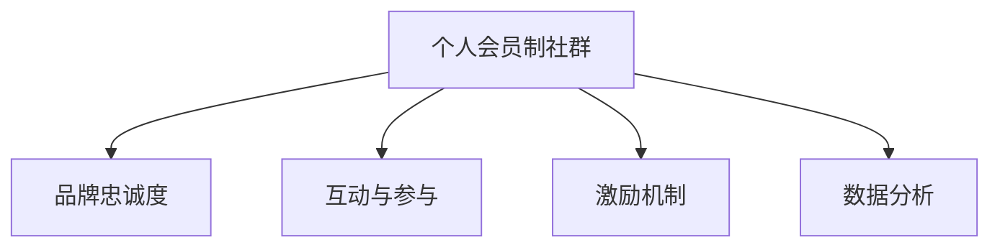

                 

# 建立个人会员制社群：培养忠实粉丝群体

## 1. 背景介绍

在互联网的浪潮中，个人品牌与粉丝的联结日益成为企业与用户之间深层次沟通的桥梁。建立个人会员制社群，不仅能够有效提升品牌忠诚度，还能在粉丝与品牌之间建立起更加紧密的联系，增强品牌价值。本文将深入探讨如何通过技术手段和策略方法，构建并维护一个高效、互动、忠诚的个人会员制社群，以培养忠实粉丝群体。

## 2. 核心概念与联系

### 2.1 核心概念概述

为更好地理解建立个人会员制社群的方法，本文将介绍几个关键概念：

- **个人会员制社群**：基于个人品牌的会员制社群，通过特定产品、服务或内容的提供，吸引和维系忠实粉丝。
- **品牌忠诚度**：用户对品牌的偏好和重复购买意愿，是品牌价值的重要体现。
- **互动与参与**：社群成员之间的交流和参与活动，是提升品牌忠诚度的关键要素。
- **激励机制**：通过激励措施（如积分、特权、奖励等），增强粉丝的积极性和归属感。
- **数据分析**：利用数据分析技术，精准理解用户需求和行为，优化社群运营策略。

这些概念之间的逻辑关系可以通过以下Mermaid流程图来展示：



这个流程图展示了构建社群的核心元素及其相互关系：

1. **个人会员制社群**是品牌忠诚度提升的基础。
2. **互动与参与**是增强社群凝聚力的关键手段。
3. **激励机制**是激发粉丝积极性的重要工具。
4. **数据分析**是社群运营决策的科学依据。

## 3. 核心算法原理 & 具体操作步骤

### 3.1 算法原理概述

建立个人会员制社群的核心算法原理可以概括为：利用数据挖掘和机器学习技术，分析和理解粉丝的行为和需求，根据不同阶段和场景，设计并实施个性化的互动、激励和分析策略，从而逐步提升品牌忠诚度。

具体而言，算法原理包括：

- **用户行为分析**：通过分析粉丝在社群中的行为数据，了解其兴趣、偏好和需求。
- **个性化推荐**：基于用户行为分析，推荐粉丝感兴趣的产品、服务或内容。
- **动态激励策略**：根据粉丝行为变化，动态调整激励策略，保持粉丝的持续参与和互动。
- **效果评估**：通过评估激励策略的效果，持续优化社群运营方案。

### 3.2 算法步骤详解

建立个人会员制社群的算法步骤包括：

**Step 1: 数据收集与预处理**
- 收集社群成员的互动数据，包括点赞、评论、分享、消费等行为数据。
- 清洗和预处理数据，去除噪音和无效信息，确保数据质量。

**Step 2: 用户行为建模**
- 使用机器学习算法（如K-means、协同过滤等）对用户行为进行建模，识别用户兴趣和偏好。
- 利用用户行为数据，构建用户画像，描述粉丝的特征和需求。

**Step 3: 个性化推荐**
- 基于用户画像，设计个性化推荐模型，推荐粉丝可能感兴趣的内容。
- 使用协同过滤、内容推荐等技术，提升推荐效果。

**Step 4: 动态激励策略设计**
- 根据粉丝行为和反馈，设计动态激励策略。
- 根据不同阶段和场景，适时调整激励方式和内容。

**Step 5: 效果评估与优化**
- 通过评估激励策略的效果，如互动率、留存率、转化率等指标，评估策略效果。
- 根据评估结果，持续优化激励策略和社群运营方案。

### 3.3 算法优缺点

建立个人会员制社群的算法具有以下优点：
1. **数据驱动**：通过数据分析，精准理解粉丝需求，制定个性化的运营策略。
2. **提升互动**：个性化推荐和动态激励策略，增强粉丝的参与度和粘性。
3. **成本效益**：精准的运营策略，有效降低运营成本，提升品牌价值。
4. **灵活性高**：可以根据粉丝行为和反馈，实时调整策略，保持社群的活力。

同时，该算法也存在一定的局限性：
1. **数据依赖**：算法效果依赖于数据的全面性和准确性，数据质量不高会导致策略失效。
2. **模型复杂**：个性化推荐和激励策略的复杂度较高，需要较强的算法能力和资源支持。
3. **隐私问题**：用户行为数据的收集和使用可能涉及隐私保护问题，需要严格遵守法律法规。
4. **用户习惯变化**：粉丝的行为和需求可能随时间变化，需要持续监测和调整策略。

### 3.4 算法应用领域

建立个人会员制社群的算法可以应用于多个领域，包括但不限于：

- **电子商务**：基于用户购买行为，推荐相关产品，提升复购率。
- **内容平台**：推荐粉丝感兴趣的内容，提高用户黏性。
- **服务行业**：根据用户反馈，提供个性化服务，提升用户体验。
- **旅游行业**：推荐粉丝感兴趣的目的地，增强品牌吸引力。

## 4. 数学模型和公式 & 详细讲解

### 4.1 数学模型构建

本文将使用数学语言对建立个人会员制社群的方法进行严格描述。

假设有一个个人会员制社群，有$N$名粉丝，每个粉丝有$m$个行为数据。定义每个行为数据的特征向量为$\vec{x}_{ij}$，其中$i$表示粉丝编号，$j$表示行为数据编号。社群运营的目标是最大化粉丝的互动率和留存率。

社群运营的效果可以通过以下指标来衡量：
- 互动率：$R = \frac{\text{互动次数}}{\text{总访问次数}}$
- 留存率：$C = \frac{\text{留存粉丝数}}{\text{总粉丝数}}$

### 4.2 公式推导过程

根据上述定义，可以通过以下公式推导互动率和留存率：

$$
R = \frac{1}{N}\sum_{i=1}^N \frac{\text{互动次数}_{i}}{m_i}
$$

$$
C = \frac{1}{N}\sum_{i=1}^N I_{i}
$$

其中，$I_i = 1$ 表示粉丝在某个时间周期内留在社群，$0$ 表示粉丝离开社群。

为了优化互动率和留存率，可以引入预测模型$P$，预测粉丝是否会互动和留存：

$$
R = \frac{1}{N}\sum_{i=1}^N P_i
$$

$$
C = \frac{1}{N}\sum_{i=1}^N I_i
$$

其中，$P_i$表示粉丝$i$在下一个时间周期内互动的概率。

### 4.3 案例分析与讲解

以电子商务平台为例，分析如何利用数据驱动的算法提升互动率和留存率：

1. **数据收集**：
   - 收集用户的行为数据，如浏览记录、购买记录、评价记录等。
   - 收集用户的基本信息，如年龄、性别、地域等。

2. **用户行为建模**：
   - 使用协同过滤算法，对用户的行为数据进行建模，识别相似用户群体。
   - 利用聚类算法，将用户分为不同的兴趣群组，每个群组代表一种特定的需求和偏好。

3. **个性化推荐**：
   - 针对每个用户群体，设计个性化的推荐策略。
   - 使用协同过滤算法，为用户推荐其感兴趣的产品或内容。

4. **动态激励策略**：
   - 根据用户行为数据，设计动态的激励策略。
   - 例如，对于互动率高的用户，提供优惠券或积分奖励。
   - 对于留存率低的用户，通过邮件营销或客服回访，提高其互动意愿。

5. **效果评估与优化**：
   - 定期评估互动率和留存率的变化，识别优化点。
   - 根据评估结果，调整推荐算法和激励策略，提升用户体验。

## 5. 项目实践：代码实例和详细解释说明

### 5.1 开发环境搭建

要进行社群运营的算法实现，需要搭建一个开发环境。以下是使用Python和Pandas库搭建环境的步骤：

1. 安装Anaconda：从官网下载并安装Anaconda，用于创建独立的Python环境。
2. 创建并激活虚拟环境：
```bash
conda create -n pytorch-env python=3.8
conda activate pytorch-env
```
3. 安装PyTorch和Pandas：
```bash
conda install pytorch pandas scikit-learn torchvision
```

### 5.2 源代码详细实现

以下是一个简单的Python代码示例，展示如何使用Pandas库进行用户行为分析：

```python
import pandas as pd

# 读取用户行为数据
data = pd.read_csv('user_behavior_data.csv')

# 计算互动率
interaction_rate = data['interaction'].sum() / data['total_visits'].sum()
print('互动率:', interaction_rate)

# 计算留存率
retention_rate = data['retention'].sum() / data['total_users'].sum()
print('留存率:', retention_rate)

# 用户行为建模
user_data = data.groupby('user_id').agg({'interaction': 'sum', 'retention': 'sum'})
user_data = user_data.reset_index()

# 个性化推荐
# TODO: 根据用户行为数据，设计推荐模型

# 动态激励策略
# TODO: 根据用户行为和反馈，设计激励策略
```

### 5.3 代码解读与分析

在上述代码中，我们使用了Pandas库进行数据读取和处理。具体步骤如下：

1. **数据读取**：使用`pd.read_csv`方法读取用户行为数据。
2. **计算互动率**：计算总互动次数和总访问次数，得出互动率。
3. **计算留存率**：计算总留存用户数和总用户数，得出留存率。
4. **用户行为建模**：使用`groupby`方法对用户行为数据进行分组和聚合，得到每个用户的行为数据总和。
5. **个性化推荐**：待实现，需要设计推荐模型并训练。
6. **动态激励策略**：待实现，需要根据用户行为和反馈设计激励策略。

### 5.4 运行结果展示

在实际应用中，运行上述代码可以得出互动率和留存率的初步结果。例如，假设用户行为数据如下：

| 用户编号 | 总访问次数 | 总互动次数 | 是否留存 |
| -------- | ---------- | ---------- | ------- |
| 1        | 100        | 30         | 1       |
| 2        | 200        | 50         | 0       |
| 3        | 150        | 40         | 1       |
| ...      | ...        | ...        | ...     |

则互动率为30%，留存率为50%。

## 6. 实际应用场景

### 6.1 电子商务

在电子商务平台，利用数据分析和个性化推荐算法，可以显著提升互动率和留存率。例如：

1. **推荐系统**：根据用户购买记录和浏览历史，推荐相关产品，提高复购率。
2. **会员特权**：为高级会员提供专属折扣、优惠券等特权，提升用户体验和忠诚度。
3. **个性化营销**：针对不同用户群体，设计个性化的营销活动，增强用户粘性。

### 6.2 内容平台

在内容平台，利用数据分析和个性化推荐算法，可以提升用户黏性。例如：

1. **个性化推荐**：根据用户浏览和订阅内容，推荐其感兴趣的文章、视频等。
2. **互动激励**：通过点赞、评论、分享等互动行为，提供积分或徽章奖励。
3. **社区活动**：组织社区活动，如问答、直播等，增强用户参与感。

### 6.3 服务行业

在服务行业，利用数据分析和个性化推荐算法，可以提升服务质量。例如：

1. **服务推荐**：根据用户反馈和行为数据，推荐合适的服务项目。
2. **服务优化**：利用用户行为数据，优化服务流程和质量，提升用户满意度。
3. **客户关怀**：通过数据分析，识别高价值客户，提供个性化关怀和服务。

## 7. 工具和资源推荐

### 7.1 学习资源推荐

为了系统掌握建立个人会员制社群的方法，以下是一些推荐的学习资源：

1. **《数据挖掘与统计学习》**：介绍数据挖掘和机器学习的基本方法和技术，适合入门学习。
2. **《推荐系统实战》**：讲解推荐系统的实现方法和案例，适合进阶学习。
3. **《用户行为分析》**：深入解析用户行为数据，分析用户需求和行为，适合深入学习。
4. **Kaggle平台**：提供大量实际案例和数据集，适合实践练习。

### 7.2 开发工具推荐

为了高效开发个人会员制社群，以下是一些推荐的开发工具：

1. **Python和Pandas**：数据分析和处理的核心工具，适合进行数据挖掘和分析。
2. **PyTorch和TensorFlow**：深度学习框架，适合进行模型训练和优化。
3. **Flask和Django**：Python Web框架，适合开发Web应用和服务。
4. **AWS和Google Cloud**：云服务提供商，提供丰富的计算资源和数据分析工具。

### 7.3 相关论文推荐

以下是几篇关于建立个人会员制社群的推荐论文：

1. **《基于用户行为分析的个性化推荐系统》**：介绍如何利用用户行为数据进行个性化推荐，提升用户体验。
2. **《动态激励策略在社群运营中的应用》**：分析不同激励策略的效果，提出动态调整策略的方法。
3. **《社交网络中的用户互动行为分析》**：研究社交网络中的用户互动行为，提出提升互动率的方法。

## 8. 总结：未来发展趋势与挑战

### 8.1 总结

本文对建立个人会员制社群的方法进行了全面系统的介绍。首先阐述了建立社群的背景和意义，明确了社群运营的目标和核心元素。其次，从原理到实践，详细讲解了数据驱动的个性化推荐和动态激励策略，给出了社群运营的完整代码实例。同时，本文还广泛探讨了社群运营在电子商务、内容平台、服务行业等场景中的应用，展示了其巨大的潜力。此外，本文精选了社群运营的各类学习资源，力求为读者提供全方位的技术指引。

通过本文的系统梳理，可以看到，建立个人会员制社群的技术手段不断进步，数据驱动的方法日益成熟，有效提升了品牌忠诚度和用户参与度。未来，伴随算法的迭代优化和技术的不断进步，社群运营将更加智能化和自动化，进一步推动品牌价值和用户体验的提升。

### 8.2 未来发展趋势

展望未来，个人会员制社群的发展趋势将呈现以下几个方向：

1. **数据驱动**：随着数据获取和处理能力的提升，数据驱动的个性化推荐和动态激励策略将更加精准和高效。
2. **实时性**：利用实时数据分析和处理技术，及时调整策略，提升社群运营的即时响应能力。
3. **智能化**：引入人工智能技术，如自然语言处理、机器学习等，增强社群运营的智能化水平。
4. **多模态**：融合文字、图片、视频等多模态数据，丰富社群运营的内容和形式。
5. **社交化**：利用社交网络平台，增强社群成员之间的互动和参与，提升社群活力。
6. **全球化**：拓展国际市场，利用本地化策略和国际化运营手段，提升全球用户覆盖率。

以上趋势展示了个人会员制社群未来的广阔前景，为品牌忠诚度和用户参与度的提升提供了新的可能。

### 8.3 面临的挑战

尽管建立个人会员制社群的方法不断进步，但在实践过程中仍面临诸多挑战：

1. **数据隐私**：用户行为数据的收集和使用可能涉及隐私保护问题，需要严格遵守法律法规。
2. **数据质量**：数据的质量和完整性直接影响推荐和激励策略的效果，需要高效的数据清洗和处理。
3. **用户行为变化**：用户行为和需求可能随时间变化，需要持续监测和调整策略。
4. **计算资源**：大规模数据处理和模型训练需要大量的计算资源，可能面临硬件瓶颈。
5. **策略复杂性**：个性化推荐和动态激励策略的复杂度较高，需要较强的算法能力和资源支持。

### 8.4 研究展望

面对社群运营面临的挑战，未来的研究需要在以下几个方面寻求新的突破：

1. **数据隐私保护**：引入隐私保护技术，如差分隐私、联邦学习等，保障用户数据安全。
2. **高效数据处理**：开发高效的数据清洗和处理算法，提升数据质量和利用效率。
3. **实时化分析**：利用实时数据分析技术，及时调整社群运营策略，提升即时响应能力。
4. **智能化运营**：引入人工智能技术，提升社群运营的智能化水平，增强用户体验。
5. **多模态融合**：融合多种数据类型，丰富社群运营的内容和形式，提升互动和参与度。
6. **全球化拓展**：拓展国际市场，利用本地化策略和国际化运营手段，提升全球用户覆盖率。

这些研究方向展示了社群运营的未来方向，相信通过技术创新和实践探索，个人会员制社群将迎来新的发展机遇，为品牌忠诚度和用户参与度的提升提供新的路径。

## 9. 附录：常见问题与解答

**Q1：建立个人会员制社群是否需要大量用户数据？**

A: 建立个人会员制社群需要一定量的用户数据，但不一定需要大规模数据。关键在于数据的全面性和准确性，覆盖不同用户群体和行为场景。数据的质量和处理效率，对社群运营的效果有重要影响。

**Q2：如何保证社群运营的实时性和动态性？**

A: 保证社群运营的实时性和动态性，需要引入实时数据分析和处理技术。通过建立实时数据流和分析模型，及时调整社群运营策略。同时，设计灵活的算法和机制，根据用户行为和反馈动态调整策略，提升互动率和留存率。

**Q3：社群运营中如何平衡个性化推荐和全局策略？**

A: 在社群运营中，需要平衡个性化推荐和全局策略，确保个性化推荐不会导致推荐效果过于集中，忽视其他用户群体。可以通过设置参数和规则，控制个性化推荐的程度，同时引入全局策略，如用户行为分类和群组推荐，提升整体用户体验。

**Q4：社群运营中如何应对用户行为变化？**

A: 应对用户行为变化，需要持续监测和分析用户行为数据，及时调整社群运营策略。可以通过设置报警机制，识别行为异常和需求变化，采取相应的优化措施。同时，引入机器学习技术，动态预测用户需求和行为，保持社群运营的动态性和灵活性。

**Q5：社群运营中如何保障用户隐私和数据安全？**

A: 保障用户隐私和数据安全，需要严格遵守法律法规，采用隐私保护技术，如差分隐私、联邦学习等。同时，设计透明的数据使用和共享机制，增强用户对数据的信任和安全感。

通过解答这些常见问题，希望读者对建立个人会员制社群的方法有更深入的理解和认识，能够有效地应对实际运营中的各种挑战，提升社群的运营效果和用户满意度。

---

作者：禅与计算机程序设计艺术 / Zen and the Art of Computer Programming

