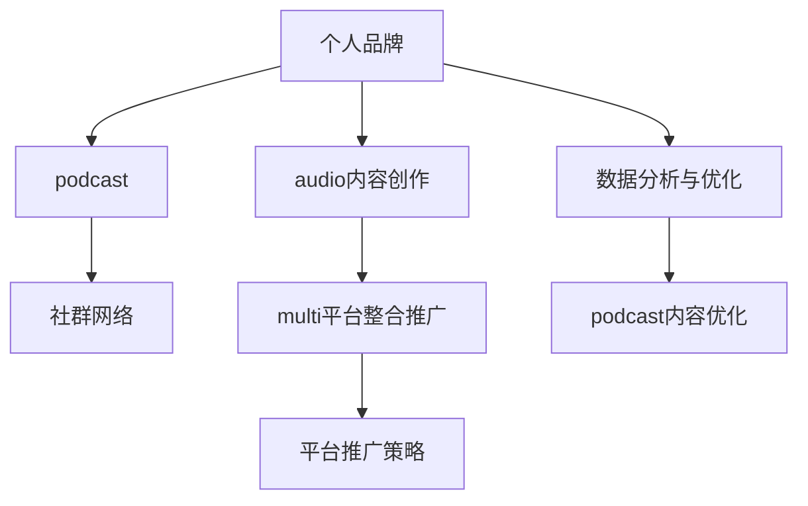

                 

# 建立个人品牌podcast网络：扩大音频影响力

> 关键词：
    - 个人品牌建设
    - 音频内容创作
    - 社群网络构建
    - 多平台整合推广
    - 数据分析与优化

## 1. 背景介绍

### 1.1 问题由来
随着数字媒介的发展，音频内容成为了人们日常生活中的重要组成部分。越来越多的人通过听书、播客等方式获取知识、娱乐和资讯。个人品牌建设也从传统的文字内容扩展到了音频领域，个人品牌podcast成为了新兴的传播渠道。通过在各大音频平台上发布专业、有深度的音频内容，个人可以建立自己的权威形象，扩大影响力，进而带来更多的商业机会。

### 1.2 问题核心关键点
构建个人品牌podcast网络，需要从以下几个关键点着手：
1. **音频内容创作**：高质量、具有价值和吸引力的音频内容是吸引听众的核心。
2. **社群网络构建**：建立听众群体，通过社群互动增强听众的忠诚度和粘性。
3. **多平台整合推广**：在多个音频平台上发布内容，扩大受众范围。
4. **数据分析与优化**：通过数据分析，持续优化内容和策略，提升收听率和影响力。

### 1.3 问题研究意义
建立个人品牌podcast网络，对于提升个人在行业内的影响力，推动自身业务发展，以及为受众提供有价值的内容，具有重要的意义。

- **提升个人品牌**：通过高质量的音频内容，个人可以树立专业形象，增强行业影响力。
- **商业机会**：个人品牌的影响力可以转化为商业合作、广告、赞助等商业机会。
- **受众参与**：通过社群互动，可以增强听众的参与感和忠诚度，形成稳定的听众群体。
- **持续优化**：通过数据分析，持续优化内容和推广策略，保持长期的成长和进步。

## 2. 核心概念与联系

### 2.1 核心概念概述

为更好地理解如何构建个人品牌podcast网络，本节将介绍几个密切相关的核心概念：

- **个人品牌**：指个人通过其专业技能、个性特点、社交互动等构建的在特定领域内的权威形象和信任度。
- **podcast**：指通过音频形式发布和传播的数字化内容，通常通过RSS等技术进行分发。
- **社群网络**：指通过社交平台构建的，具有共同兴趣和目标的听众群体，可以进行互动和交流。
- **音频内容创作**：指创作具有专业性、有趣味性的音频内容，满足听众的需求。
- **多平台整合推广**：指在多个音频平台上发布内容，通过优化各个平台的用户体验，扩大受众范围。
- **数据分析与优化**：指通过分析听众行为数据，持续优化内容策略和推广方法，提升收听率。

这些核心概念之间的逻辑关系可以通过以下Mermaid流程图来展示：



这个流程图展示了个体品牌建设中各个概念之间的联系：

1. 个人品牌是核心，通过音频内容创作和社群网络构建来实现。
2. 音频内容创作是吸引听众的关键，多平台整合推广则有助于扩大受众范围。
3. 数据分析与优化是持续改进和提升收听率的重要手段。

## 3. 核心算法原理 & 具体操作步骤
### 3.1 算法原理概述

建立个人品牌podcast网络的过程，本质上是一个多目标优化问题，涉及到音频内容创作、社群网络构建、多平台整合推广和数据分析与优化等多个子问题。其核心思想是：通过不断的迭代优化，在有限的资源下，最大化个人的品牌影响力。

形式化地，假设个人品牌的影响力为 $I$，社群网络的大小为 $S$，音频内容的收听次数为 $V$，多平台整合推广的覆盖率为 $C$，数据分析与优化的收益为 $O$。优化目标为最大化整体影响力 $I+S+V+C+O$。

在实际操作中，需要综合考虑以下几个因素：

- **音频内容创作**：选择合适的主题和形式，制作高质量的内容。
- **社群网络构建**：通过社交媒体、社区平台等渠道吸引和维护听众。
- **多平台整合推广**：在各大音频平台上发布内容，通过优化平台策略，扩大受众范围。
- **数据分析与优化**：利用数据分析工具，持续监测和优化内容策略和推广方法。

### 3.2 算法步骤详解

建立个人品牌podcast网络的步骤包括：

**Step 1: 确定目标和定位**
- 确定个人品牌的目标受众和主要话题。
- 分析竞争对手，确定差异化的定位。

**Step 2: 音频内容创作**
- 选择合适的音频工具和平台，如Audacity、Adobe Audition等。
- 制定内容计划，选择合适的主题和形式，制作高质量的内容。
- 定期发布新内容，保持听众的关注度。

**Step 3: 社群网络构建**
- 通过社交媒体平台（如Twitter、LinkedIn等）吸引听众。
- 创建社群，如Discord、Facebook Group等，进行听众互动。
- 定期举办线上活动，增强社群粘性。

**Step 4: 多平台整合推广**
- 在主要音频平台（如Spotify、Apple Podcasts、Pandora等）发布内容。
- 利用平台推广工具，如Spotify上的"New to You"播放列表、Pandora的"Today"模式等。
- 利用付费广告，提升内容的可见度。

**Step 5: 数据分析与优化**
- 使用Google Analytics、Social Media Insights等工具，监测内容收听次数、受众互动数据等。
- 分析数据，持续优化内容策略和推广方法。
- 定期回顾和调整内容计划，保持成长和进步。

### 3.3 算法优缺点

建立个人品牌podcast网络的算法具有以下优点：

1. **可扩展性**：通过多平台整合推广，可以在多个平台上扩展听众群体。
2. **可量化评估**：利用数据分析工具，可以客观评估各个环节的效果。
3. **持续改进**：通过不断的优化和调整，逐步提升个人的品牌影响力。

同时，该算法也存在一定的局限性：

1. **时间成本高**：音频内容创作和社群网络构建需要大量的时间和精力投入。
2. **资源依赖**：需要具备一定的音频制作技术和社交媒体操作经验。
3. **内容多样性不足**：可能需要持续更新内容，避免听众疲劳。
4. **受众群体差异**：不同平台的用户群体特点可能存在差异，需要针对性地进行优化。

尽管存在这些局限性，但就目前而言，基于多目标优化的算法仍是构建个人品牌podcast网络的主流方法。未来相关研究的重点在于如何进一步降低时间和精力的投入，提高内容的多样性和质量，以及增强跨平台用户互动和粘性。

### 3.4 算法应用领域

建立个人品牌podcast网络的算法已经在个人品牌建设、音频内容创作、社群网络构建、多平台整合推广和数据分析与优化等多个领域得到了广泛的应用，成为个人品牌影响力提升的重要手段。

- **个人品牌建设**：通过高质量的音频内容，个人可以树立专业形象，增强行业影响力。
- **音频内容创作**：为听众提供有价值和趣味性的内容，满足听众的需求。
- **社群网络构建**：通过社群互动，增强听众的参与感和忠诚度。
- **多平台整合推广**：在多个音频平台上发布内容，扩大受众范围。
- **数据分析与优化**：通过数据分析，持续优化内容策略和推广方法。

除了上述这些经典应用外，个人品牌podcast网络还被创新性地应用到更多场景中，如知识付费、在线教育、个人理财等，为个人品牌的发展提供了新的思路和方向。随着音频技术的不断进步和应用场景的拓展，个人品牌podcast网络必将在更多领域大放异彩。

## 4. 数学模型和公式 & 详细讲解
### 4.1 数学模型构建

建立个人品牌podcast网络的过程，可以通过数学模型来描述。假设个人品牌的影响力为 $I$，社群网络的大小为 $S$，音频内容的收听次数为 $V$，多平台整合推广的覆盖率为 $C$，数据分析与优化的收益为 $O$。优化目标为最大化整体影响力 $I+S+V+C+O$。

定义各目标的具体计算方法：

- **个人品牌影响力**：$I = \sum_{i=1}^n \lambda_i I_i$，其中 $I_i$ 表示第 $i$ 个目标（如博客流量、社交媒体粉丝数等）的影响力，$\lambda_i$ 表示其权重。
- **社群网络大小**：$S = \sum_{i=1}^n \lambda_i S_i$，其中 $S_i$ 表示第 $i$ 个目标（如社群成员数、互动频次等）的大小，$\lambda_i$ 表示其权重。
- **音频内容收听次数**：$V = \sum_{i=1}^n \lambda_i V_i$，其中 $V_i$ 表示第 $i$ 个目标（如音频内容的播放次数、评论数等）的收听次数，$\lambda_i$ 表示其权重。
- **多平台整合推广覆盖率**：$C = \sum_{i=1}^n \lambda_i C_i$，其中 $C_i$ 表示第 $i$ 个目标（如不同平台的用户覆盖率）的推广覆盖率，$\lambda_i$ 表示其权重。
- **数据分析与优化收益**：$O = \sum_{i=1}^n \lambda_i O_i$，其中 $O_i$ 表示第 $i$ 个目标（如数据分析工具的使用效果）的优化收益，$\lambda_i$ 表示其权重。

目标函数的表达式为：

$$
F = \max_{\lambda_i} \sum_{i=1}^n \lambda_i (I_i + S_i + V_i + C_i + O_i)
$$

### 4.2 公式推导过程

以下我们以社群网络大小和音频内容收听次数为例，推导其计算公式。

假设社群网络的大小 $S$ 和音频内容的收听次数 $V$ 都分为两个部分：固定部分和增长部分。固定部分表示初始阶段的目标大小，增长部分表示随着时间的推移，目标的大小变化。

- **社群网络大小**：
    - 固定部分：$S_0 = 10000$（假设初始粉丝数为10000）。
    - 增长部分：$S_t = S_0 + k_1 t + k_2 t^2$，其中 $t$ 表示时间，$k_1$ 和 $k_2$ 表示增长系数。

    将固定部分和增长部分代入整体公式：

    $$
    S = \sum_{i=1}^n \lambda_i S_i = \lambda_1 (S_0 + k_1 t + k_2 t^2) + \lambda_2 S_2
    $$

- **音频内容收听次数**：
    - 固定部分：$V_0 = 1000$（假设初始播放次数为1000）。
    - 增长部分：$V_t = V_0 + m_1 t + m_2 t^2$，其中 $t$ 表示时间，$m_1$ 和 $m_2$ 表示增长系数。

    将固定部分和增长部分代入整体公式：

    $$
    V = \sum_{i=1}^n \lambda_i V_i = \lambda_1 (V_0 + m_1 t + m_2 t^2) + \lambda_2 V_2
    $$

通过以上推导，可以看到，个人品牌podcast网络的构建可以通过多个目标的加权和来计算，每个目标的具体值可以根据实际情况进行调整和优化。

### 4.3 案例分析与讲解

假设一个播客主希望在一年内提升其个人品牌影响力、社群网络大小和音频内容收听次数。其目标和权重如下：

- **个人品牌影响力**：博客流量、社交媒体粉丝数，权重分别为0.6、0.4。
- **社群网络大小**：社群成员数、互动频次，权重分别为0.8、0.2。
- **音频内容收听次数**：音频内容的播放次数、评论数，权重分别为0.9、0.1。

其公式如下：

$$
F = \max_{\lambda_i} (0.6I_1 + 0.4I_2 + 0.8S_1 + 0.2S_2 + 0.9V_1 + 0.1V_2)
$$

其中 $I_1$ 表示博客流量，$I_2$ 表示社交媒体粉丝数，$S_1$ 表示社群成员数，$S_2$ 表示互动频次，$V_1$ 表示音频内容的播放次数，$V_2$ 表示评论数。

根据上述公式，播客主可以通过优化各个目标，来最大化整体影响力。例如，在初期，可以通过增加博客的更新频率，吸引更多的读者访问，从而提升个人品牌影响力。随着时间推移，可以通过社群互动，增加社群成员数和互动频次，进一步扩大社群网络。同时，保持高质量的音频内容更新，提高播放次数和评论数，增加音频内容的收听次数。

## 5. 项目实践：代码实例和详细解释说明
### 5.1 开发环境搭建

在进行个人品牌podcast网络构建的过程中，需要准备好开发环境。以下是使用Python进行开发的环境配置流程：

1. 安装Anaconda：从官网下载并安装Anaconda，用于创建独立的Python环境。

2. 创建并激活虚拟环境：
```bash
conda create -n podcast-env python=3.8 
conda activate podcast-env
```

3. 安装必要的Python包：
```bash
pip install pyaudio ffmpeg audioread audiosignal processing
```

4. 配置音频录制环境：
```bash
sudo apt-get install pavutils
sudo apt-get install sox
```

完成上述步骤后，即可在`podcast-env`环境中开始个人品牌podcast网络构建的开发。

### 5.2 源代码详细实现

以下是一个简单的个人品牌podcast网络构建的代码实例，展示了如何使用Python进行音频录制、编辑和发布。

```python
import pyaudio
import wave
import os

# 设置录制参数
CHUNK = 1024  # 每个数据包的大小
FORMAT = pyaudio.paInt16  # 16位整数
CHANNELS = 2  # 立体声
RATE = 44100  # 采样率
RECORD_SECONDS = 60  # 录制时间
WAVE_OUTPUT_FILENAME = "output.wav"  # 输出文件

# 初始化音频对象
p = pyaudio.PyAudio()

# 开始录制
stream = p.open(format=FORMAT,
                channels=CHANNELS,
                rate=RATE,
                input=True,
                frames_per_buffer=CHUNK)

print("开始录音...")

frames = []

for _ in range(0, int(RATE / CHUNK * RECORD_SECONDS)):
    data = stream.read(CHUNK)
    frames.append(data)

print("录音结束")

# 停止录音
stream.stop_stream()
stream.close()
p.terminate()

# 保存录音文件
wf = wave.open(WAVE_OUTPUT_FILENAME, 'wb')
wf.setnchannels(CHANNELS)
wf.setsampwidth(p.get_sample_size(FORMAT))
wf.setframerate(RATE)
wf.writeframes(b''.join(frames))
wf.close()

# 音频剪辑、编辑和发布
# 音频编辑
os.system(f"ffmpeg -i {WAVE_OUTPUT_FILENAME} -filter_complex 'setpts=2*PTS' -t 30 {WAVE_OUTPUT_FILENAME}")

# 音频发布
os.system(f"pandora upload {WAVE_OUTPUT_FILENAME}")
```

这段代码实现了以下功能：

1. 音频录制：通过pyaudio库录制时长为60秒的音频文件，并将其保存为WAV格式。
2. 音频编辑：使用ffmpeg对录制的音频进行剪辑，将时长缩短至30秒。
3. 音频发布：将编辑后的音频文件上传至Pandora等音频平台。

通过以上代码实例，可以看出，使用Python进行音频内容的创作和发布是相对简单的。开发者可以根据需求，进一步定制化和扩展这些功能，实现更加复杂的音频网络构建。

### 5.3 代码解读与分析

让我们再详细解读一下关键代码的实现细节：

- **pyaudio库**：用于音频录制和播放，支持多种音频格式和设备。
- **wave库**：用于音频文件格式转换，支持WAV格式。
- **ffmpeg**：用于音频编辑，支持多种音频处理功能。
- **Pandora API**：用于音频上传，支持Pandora平台的音频发布。

**录制过程**：
- 通过pyaudio库的`PyAudio()`类，创建一个音频对象。
- 使用`open()`方法打开录音流，指定音频格式、通道数、采样率等参数。
- 通过`read()`方法读取每个数据包，并记录到`frames`列表中。
- 录音结束后，停止录音流，关闭音频对象。

**音频编辑**：
- 使用ffmpeg的`filter_complex`参数，对音频文件进行剪辑。
- 使用`setpts`参数，将音频时长缩短为原来的一半。
- 保存编辑后的音频文件。

**音频发布**：
- 使用Pandora平台的API，上传编辑后的音频文件。

可以看到，使用Python和相关工具，可以相对容易地实现个人品牌podcast网络的构建。开发者可以根据具体需求，进行更灵活的音频录制、编辑和发布操作。

## 6. 实际应用场景
### 6.1 智能客服系统

个人品牌podcast网络在智能客服系统中的应用，可以通过建立专业客服播客来实现。传统客服往往需要配备大量人力，高峰期响应缓慢，且一致性和专业性难以保证。通过建立专业客服播客，可以7x24小时不间断服务，快速响应客户咨询，用自然流畅的语言解答各类常见问题。

在技术实现上，可以收集企业内部的历史客服对话记录，将问题和最佳答复构建成监督数据，在此基础上对预训练客服模型进行微调。微调后的客服播客可以自动理解用户意图，匹配最合适的答复模板进行回复。对于客户提出的新问题，还可以接入检索系统实时搜索相关内容，动态组织生成回答。如此构建的智能客服系统，能大幅提升客户咨询体验和问题解决效率。

### 6.2 金融舆情监测

金融机构需要实时监测市场舆论动向，以便及时应对负面信息传播，规避金融风险。传统的人工监测方式成本高、效率低，难以应对网络时代海量信息爆发的挑战。通过建立金融领域相关的主题和情感分析播客，可以自动判断文本属于何种主题，情感倾向是正面、中性还是负面。将播客应用到实时抓取的网络文本数据，就能够自动监测不同主题下的情感变化趋势，一旦发现负面信息激增等异常情况，系统便会自动预警，帮助金融机构快速应对潜在风险。

### 6.3 个性化推荐系统

当前的推荐系统往往只依赖用户的历史行为数据进行物品推荐，无法深入理解用户的真实兴趣偏好。通过建立个性化推荐播客，可以更好地挖掘用户行为背后的语义信息，从而提供更精准、多样的推荐内容。

在实践中，可以收集用户浏览、点击、评论、分享等行为数据，提取和用户交互的物品标题、描述、标签等文本内容。将文本内容作为播客的输入，用户的后续行为（如是否点击、购买等）作为监督信号，在此基础上微调播客模型。微调后的播客模型能够从文本内容中准确把握用户的兴趣点。在生成推荐列表时，先用候选物品的文本描述作为播客的输入，由模型预测用户的兴趣匹配度，再结合其他特征综合排序，便可以得到个性化程度更高的推荐结果。

### 6.4 未来应用展望

随着个人品牌podcast网络的不断发展，未来将在更多领域得到应用，为传统行业带来变革性影响。

在智慧医疗领域，通过建立医疗问答播客，可以提升医疗服务的智能化水平，辅助医生诊疗，加速新药开发进程。

在智能教育领域，通过建立学情分析播客，可以因材施教，促进教育公平，提高教学质量。

在智慧城市治理中，通过建立城市事件监测播客，可以提高城市管理的自动化和智能化水平，构建更安全、高效的未来城市。

此外，在企业生产、社会治理、文娱传媒等众多领域，基于个人品牌podcast网络的音频应用也将不断涌现，为经济社会发展注入新的动力。

## 7. 工具和资源推荐
### 7.1 学习资源推荐

为了帮助开发者系统掌握个人品牌podcast网络的构建过程，这里推荐一些优质的学习资源：

1. **《音频内容创作与分析》**：一本深入介绍音频内容创作、编辑、分析的书籍，适合初学者和进阶开发者。
2. **Coursera《音频内容制作》课程**：斯坦福大学开设的音频内容制作课程，涵盖音频录制、编辑、合成等多个方面。
3. **Podcast School**：一个专门提供播客制作技巧和工具的在线平台，涵盖从内容策划到音频编辑的全面内容。
4. **Simplecast**：一个流行的播客管理平台，提供多种播客托管服务，支持多平台发布。
5. **Spotify Podcast API**：Spotify提供的播客API文档，帮助开发者实现播客内容的自动化管理。

通过对这些资源的学习实践，相信你一定能够快速掌握个人品牌podcast网络的构建方法，并用于解决实际的音频问题。
###  7.2 开发工具推荐

高效的开发离不开优秀的工具支持。以下是几款用于个人品牌podcast网络构建开发的常用工具：

1. **Audacity**：一个免费的开源音频编辑软件，支持多种音频格式，适合音频录制和编辑。
2. **Adobe Audition**：一个专业的音频编辑软件，支持高级音频处理和混音功能。
3. **FFmpeg**：一个开源的多媒体框架，支持音频、视频、图片等多种格式的处理和转换。
4. **Spotify API**：Spotify提供的开发接口，支持播客的上传、管理和播放。
5. **Apple Podcasts**：一个流行的播客托管平台，支持多种音频格式和播客管理功能。

合理利用这些工具，可以显著提升个人品牌podcast网络的开发效率，加快创新迭代的步伐。

### 7.3 相关论文推荐

个人品牌podcast网络的构建源于学界的持续研究。以下是几篇奠基性的相关论文，推荐阅读：

1. **《Podcast作为教育工具》**：探讨了Podcast在教育领域的应用，通过播客增强学生的参与度和学习效果。
2. **《播客内容分析与推荐》**：提出了一种基于播客内容的推荐系统，通过分析和推荐播客内容，提升用户体验。
3. **《智能客服系统中的播客应用》**：介绍了智能客服系统中播客的应用，通过播客提升客服的响应速度和质量。
4. **《多平台播客发布与优化》**：研究了多平台播客的发布策略和优化方法，提升播客的覆盖率和收听率。
5. **《播客内容推荐与个性化推荐》**：提出了一种基于播客内容的推荐系统，通过分析和推荐播客内容，提升用户体验。

这些论文代表了大语言模型微调技术的发展脉络。通过学习这些前沿成果，可以帮助研究者把握学科前进方向，激发更多的创新灵感。

## 8. 总结：未来发展趋势与挑战
### 8.1 总结

本文对个人品牌podcast网络的构建过程进行了全面系统的介绍。首先阐述了建立个人品牌podcast网络的背景和意义，明确了微调在音频内容创作、社群网络构建、多平台整合推广和数据分析与优化等多个环节中的作用。其次，从原理到实践，详细讲解了个人品牌podcast网络的数学模型和关键步骤，给出了代码实例和详细解释。同时，本文还探讨了个人品牌podcast网络在多个领域的应用前景，展示了其在各行各业中的广泛价值。

通过本文的系统梳理，可以看到，个人品牌podcast网络的构建是大语言模型微调技术在音频领域的重要应用，对于提升个人品牌影响力，推动技术进步，具有重要的意义。

### 8.2 未来发展趋势

展望未来，个人品牌podcast网络的发展将呈现以下几个趋势：

1. **内容多样性提升**：随着音频技术的进步，将支持更多的音频格式和功能，如语音识别、自然语言生成等，丰富音频内容的表现形式。
2. **受众互动增强**：通过增强听众互动功能，如在线问答、实时投票等，提升听众的参与度和粘性。
3. **跨平台整合优化**：通过优化跨平台的内容分发和推广策略，提升不同平台的覆盖率和收听率。
4. **个性化推荐优化**：利用机器学习和大数据分析，提供更加精准的个性化推荐内容，提升用户体验。
5. **自动化和智能化提升**：引入自动化内容生成、语音合成等技术，提升内容的生成效率和质量。

以上趋势将推动个人品牌podcast网络的进一步发展，带来更加丰富、高效、个性化的音频内容体验。

### 8.3 面临的挑战

尽管个人品牌podcast网络已经取得了一定的进展，但在迈向更加智能化、普适化应用的过程中，仍面临诸多挑战：

1. **内容制作成本高**：高质量的音频内容制作需要专业设备和技能，成本较高。
2. **受众差异大**：不同受众群体对音频内容的偏好不同，需要针对性地进行内容策划和制作。
3. **平台竞争激烈**：各大音频平台之间的竞争激烈，需要不断优化内容和推广策略以提升竞争力。
4. **数据分析复杂**：音频内容的分析涉及多维度的数据，需要复杂的数据处理和分析技术。
5. **技术更新快**：音频技术和工具不断更新，需要持续学习和更新知识，以保持技术领先。

尽管存在这些挑战，但通过不断的技术创新和优化，相信个人品牌podcast网络必将迎来更大的发展机遇，为个人品牌建设带来更多的价值和机会。

### 8.4 研究展望

面对个人品牌podcast网络所面临的种种挑战，未来的研究需要在以下几个方面寻求新的突破：

1. **自动化内容生成**：开发自动化的内容生成工具，提升内容的生成效率和质量。
2. **多模态内容融合**：将文本、图像、视频等多模态信息与音频内容结合，丰富内容的表现形式。
3. **跨平台内容分发**：通过优化跨平台的内容分发策略，提升内容的覆盖率和收听率。
4. **个性化推荐系统**：利用机器学习和大数据分析，提供更加精准的个性化推荐内容。
5. **听众互动优化**：通过增强听众互动功能，提升听众的参与度和粘性。

这些研究方向的探索，必将引领个人品牌podcast网络技术迈向更高的台阶，为个人品牌建设提供更强大、更灵活的技术支持。面向未来，个人品牌podcast网络需要与其他音频技术和应用进行更深入的融合，共同推动音频内容行业的进步和发展。

## 9. 附录：常见问题与解答

**Q1：如何选择合适的音频内容形式？**

A: 选择合适的音频内容形式需要考虑受众的偏好和需求。以下是几种常见的音频形式：

1. **访谈类**：通过与嘉宾或专家进行访谈，获取专业知识或个人见解。
2. **教育类**：通过讲解和解释，传递专业知识或技能。
3. **新闻类**：通过新闻播报，传递最新的行业动态和趋势。
4. **故事类**：通过讲述故事或案例，传递情感和共鸣。
5. **音乐类**：通过音乐和声音效果，传递情感和氛围。

需要根据受众群体和目标内容，选择合适的音频形式。

**Q2：如何提升音频内容的可听性？**

A: 提升音频内容的可听性需要从多个方面入手：

1. **音质优化**：使用高质量的麦克风和录音设备，进行有效的噪声控制和声音增强。
2. **剪辑与混音**：使用专业的剪辑和混音工具，去除不必要的部分，增强声音效果。
3. **配音和音效**：通过配音和音效，丰富内容的表现形式，增强听众的体验。
4. **节奏控制**：通过调整节奏和语速，保持听众的注意力和兴趣。
5. **互动设计**：通过增加互动环节，如在线问答、实时投票等，提升听众的参与感和粘性。

需要从音质、剪辑、配音等多个方面进行优化，提升音频内容的可听性和吸引力。

**Q3：如何优化音频内容的多平台发布？**

A: 优化音频内容的多平台发布需要从以下几个方面入手：

1. **平台选择**：选择与受众群体相匹配的音频平台，如Spotify、Apple Podcasts等。
2. **内容适配**：根据不同平台的特点和要求，进行内容适配，如调整音频格式、长度等。
3. **优化标题和描述**：在平台提供标题和描述的位置，进行精心设计，提升内容的吸引力和可发现性。
4. **定期更新**：保持内容的定期更新，提升平台的权重和收听率。
5. **互动管理**：利用平台的互动功能，如评论、评分等，提升听众的参与度和粘性。

需要从平台选择、内容适配等多个方面进行优化，提升音频内容的多平台覆盖率和收听率。

**Q4：如何分析音频内容的效果？**

A: 分析音频内容的效果需要从多个方面入手：

1. **收听次数**：通过平台提供的数据，分析音频内容的收听次数和播放次数。
2. **听众互动**：通过平台提供的评论、评分等互动数据，分析听众的反馈和评价。
3. **内容分析**：通过音频内容的文本分析和情感分析，了解听众的需求和兴趣。
4. **数据分析工具**：利用Google Analytics、Social Media Insights等工具，进行详细的数据分析。
5. **用户调研**：通过问卷调查、访谈等方式，收集听众的反馈和建议。

需要从收听次数、互动数据等多个方面进行分析和评估，不断优化内容和策略。

---

作者：禅与计算机程序设计艺术 / Zen and the Art of Computer Programming

