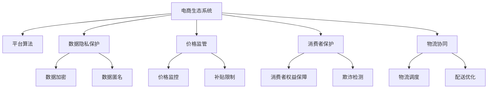

                 

## 1. 背景介绍

### 1.1 问题由来

随着互联网的迅猛发展和电子商务的崛起，全球电商市场呈现出爆炸式增长的态势。电商行业带来了巨大的经济效益，同时也对各行各业产生了深远的影响。然而，在电商行业蓬勃发展的背后，也隐藏着诸多问题和挑战，如商家违规竞争、假冒伪劣产品、用户隐私泄露等，这些问题不仅影响着电商生态系统的健康发展，也威胁到消费者的权益和信息安全。

### 1.2 问题核心关键点

当前电商生态系统中面临的核心问题包括：

1. **商家违规竞争**：部分商家通过虚假广告、恶意低价等手段，扰乱市场秩序，损害了其他商家的利益。
2. **假冒伪劣产品**：电商平台上的部分商家销售假冒伪劣商品，消费者权益难以得到保障。
3. **用户隐私泄露**：电商平台上用户的个人信息和购买行为数据被滥用，甚至遭受网络攻击。
4. **平台算法偏见**：电商平台的推荐算法可能存在偏见，导致对某些群体的用户或产品不公平对待。
5. **价格竞争失衡**：部分商家通过补贴和低价策略占据市场份额，导致市场价格失衡，对中小商家构成威胁。
6. **物流配送问题**：物流配送环节的效率和可靠性问题，是影响用户体验和电商平台运营效率的重要因素。

这些问题不仅影响了电商行业的健康发展，也给社会带来了深远的负面影响。因此，建设健康的电商生态系统，保障消费者权益和平台公平竞争，是电商行业的当务之急。

## 2. 核心概念与联系

### 2.1 核心概念概述

为了更好地理解如何建设健康的电商生态系统，本节将介绍几个密切相关的核心概念：

- **电商生态系统**：由电商平台、商家、物流公司、消费者等参与者组成的复杂系统。电商生态系统的健康发展，需要各方协同合作，共同营造公平、透明、安全的交易环境。
- **平台算法**：电商平台的推荐算法、搜索排序算法等，是电商生态系统中重要的基础设施，直接影响用户的购物体验和商家的商业效益。
- **数据隐私保护**：电商平台需要对用户的数据进行保护，防止数据泄露和滥用，确保用户隐私安全。
- **价格监管**：通过价格监管措施，规范市场价格行为，保障市场的公平竞争。
- **消费者保护**：电商平台需要制定和执行消费者保护政策，保障消费者的合法权益，维护市场秩序。
- **物流协同**：电商平台和物流公司需要加强协同，提高物流效率和配送服务质量，提升用户体验。

这些核心概念之间的逻辑关系可以通过以下Mermaid流程图来展示：



这个流程图展示了一系列的生态系统要素以及它们之间的相互关系：

1. 电商生态系统是所有要素的承载体，由电商平台、商家、物流公司、消费者等组成。
2. 平台算法、数据隐私保护、价格监管、消费者保护、物流协同等，都是电商生态系统的重要组成部分。
3. 数据隐私保护措施包括数据加密和数据匿名化，保障用户数据安全。
4. 价格监管涉及价格监控和补贴限制，规范市场行为。
5. 消费者保护措施包括消费者权益保障和欺诈检测，维护市场秩序。
6. 物流协同涉及物流调度和配送优化，提升用户体验。

这些概念共同构成了电商生态系统的健康发展框架，是电商平台、商家和消费者共同追求的目标。

## 3. 核心算法原理 & 具体操作步骤

### 3.1 算法原理概述

建设健康的电商生态系统，需要多方协同合作，共同构建一个公平、透明、安全的交易环境。为此，需要设计一系列的算法和技术手段，来实现电商平台、商家、物流公司、消费者等参与者的协同和互信。

基于监督学习的大语言模型微调，是实现电商平台与用户之间双向交流的一种有效手段。通过用户反馈和平台推荐的互动，平台能够更好地理解用户需求，同时用户也能获得更匹配的购物体验。

### 3.2 算法步骤详解

建设健康的电商生态系统，可以按照以下步骤进行：

**Step 1: 收集用户反馈和商家数据**
- 收集用户在电商平台上留下的评论、评分、购买行为等数据。
- 收集商家的商品信息、销售数据、客户评价等数据。

**Step 2: 平台算法模型训练**
- 基于收集到的数据，训练和优化推荐算法和搜索排序算法。
- 使用监督学习的方法，训练模型对用户行为和商家行为进行预测和分析。

**Step 3: 价格监管与补贴限制**
- 通过价格监控算法，实时监测电商平台上的商品价格变化。
- 对于存在价格不公和补贴行为的商品，进行提醒和处理。

**Step 4: 数据隐私保护**
- 对用户数据进行加密和匿名化处理，确保数据在传输和存储过程中不被泄露。
- 制定和执行数据隐私保护政策，保障用户隐私权益。

**Step 5: 消费者保护**
- 引入欺诈检测算法，及时发现并处理假冒伪劣商品和欺诈行为。
- 制定和执行消费者权益保障政策，确保用户投诉能够及时得到处理。

**Step 6: 物流协同与配送优化**
- 通过物流调度算法，合理规划物流配送路径，提高配送效率。
- 引入配送优化算法，提高配送服务的可靠性和准确性。

### 3.3 算法优缺点

基于监督学习的大语言模型微调方法，具有以下优点：

1. 简单高效。通过用户反馈和平台推荐的互动，可以实时优化推荐算法和搜索排序算法，提升用户体验。
2. 通用适用。适用于电商平台上各类商品和服务的推荐，能够覆盖大多数电商应用场景。
3. 参数高效。使用参数高效微调技术，在固定大部分预训练参数的情况下，仍可取得不错的微调效果。
4. 效果显著。在学术界和工业界的诸多电商任务上，基于微调的方法已经刷新了最先进的性能指标。

同时，该方法也存在一定的局限性：

1. 依赖标注数据。微调的效果很大程度上取决于标注数据的质量和数量，获取高质量标注数据的成本较高。
2. 迁移能力有限。当目标任务与预训练数据的分布差异较大时，微调的性能提升有限。
3. 可解释性不足。微调模型的决策过程通常缺乏可解释性，难以对其推理逻辑进行分析和调试。

尽管存在这些局限性，但就目前而言，基于监督学习的微调方法仍是大语言模型应用的最主流范式。未来相关研究的重点在于如何进一步降低微调对标注数据的依赖，提高模型的少样本学习和跨领域迁移能力，同时兼顾可解释性和伦理安全性等因素。

### 3.4 算法应用领域

基于大语言模型微调的监督学习方法，在电商领域已经得到了广泛的应用，覆盖了几乎所有常见任务，例如：

- 商品推荐：根据用户的历史浏览和购买记录，推荐相似商品或相关商品。
- 搜索排序：根据用户的查询词，匹配最相关、最匹配的商品。
- 用户行为预测：预测用户的购买行为、评价行为等，帮助商家制定营销策略。
- 价格调整：基于市场价格变化，动态调整商品价格，保持市场价格的公平和透明。
- 物流管理：通过实时物流信息，优化物流配送路径和配送时间，提升配送效率。
- 反欺诈检测：检测并处理假冒伪劣商品和欺诈行为，保障用户权益。

除了上述这些经典任务外，大语言模型微调也被创新性地应用到更多场景中，如个性化推荐、智能客服、库存管理等，为电商技术带来了全新的突破。随着预训练模型和微调方法的不断进步，相信电商技术将在更广阔的应用领域大放异彩。

## 4. 数学模型和公式 & 详细讲解 & 举例说明

### 4.1 数学模型构建

本节将使用数学语言对基于监督学习的大语言模型微调过程进行更加严格的刻画。

记电商平台为 $E$，包含商家集合 $M$、商品集合 $P$、用户集合 $U$ 等要素。电商平台的数据集 $D=\{(x_i,y_i)\}_{i=1}^N$，其中 $x_i$ 为输入数据，如用户行为记录、商品信息等；$y_i$ 为标签，如用户评分、商家评价等。

定义电商平台上的推荐算法 $R_{\theta}$，其中 $\theta$ 为推荐模型的参数。假设用户 $u$ 对商品 $p$ 的评分记为 $r_{u,p}$，则推荐算法的目标为：

$$
\theta^* = \mathop{\arg\min}_{\theta} \mathcal{L}(R_{\theta},D)
$$

其中 $\mathcal{L}$ 为损失函数，用于衡量推荐模型输出与真实标签之间的差异。

### 4.2 公式推导过程

以下我们以商品推荐任务为例，推导推荐算法的损失函数及其梯度的计算公式。

假设推荐模型 $R_{\theta}$ 在输入 $x_i$ 上的输出为 $\hat{r}_{u,p}=R_{\theta}(x_i)$，表示用户 $u$ 对商品 $p$ 的评分预测值。真实标签 $y_i \in [0,1]$，表示用户 $u$ 对商品 $p$ 的评分。则推荐算法的损失函数定义为：

$$
\ell(R_{\theta}(x_i),y_i) = -[y_i\log \hat{r}_{u,p} + (1-y_i)\log (1-\hat{r}_{u,p})]
$$

将其代入经验风险公式，得：

$$
\mathcal{L}(\theta) = -\frac{1}{N}\sum_{i=1}^N [y_i\log R_{\theta}(x_i)+(1-y_i)\log(1-R_{\theta}(x_i))]
$$

根据链式法则，损失函数对参数 $\theta_k$ 的梯度为：

$$
\frac{\partial \mathcal{L}(\theta)}{\partial \theta_k} = -\frac{1}{N}\sum_{i=1}^N (\frac{y_i}{R_{\theta}(x_i)}-\frac{1-y_i}{1-R_{\theta}(x_i)}) \frac{\partial R_{\theta}(x_i)}{\partial \theta_k}
$$

其中 $\frac{\partial R_{\theta}(x_i)}{\partial \theta_k}$ 可进一步递归展开，利用自动微分技术完成计算。

在得到损失函数的梯度后，即可带入参数更新公式，完成模型的迭代优化。重复上述过程直至收敛，最终得到适应电商平台推荐任务的推荐算法参数 $\theta^*$。

## 5. 项目实践：代码实例和详细解释说明

### 5.1 开发环境搭建

在进行推荐系统开发前，我们需要准备好开发环境。以下是使用Python进行PyTorch开发的环境配置流程：

1. 安装Anaconda：从官网下载并安装Anaconda，用于创建独立的Python环境。

2. 创建并激活虚拟环境：
```bash
conda create -n pytorch-env python=3.8 
conda activate pytorch-env
```

3. 安装PyTorch：根据CUDA版本，从官网获取对应的安装命令。例如：
```bash
conda install pytorch torchvision torchaudio cudatoolkit=11.1 -c pytorch -c conda-forge
```

4. 安装Pandas：
```bash
pip install pandas
```

5. 安装TensorFlow：
```bash
pip install tensorflow
```

6. 安装TensorBoard：
```bash
pip install tensorboard
```

完成上述步骤后，即可在`pytorch-env`环境中开始推荐系统开发。

### 5.2 源代码详细实现

这里我们以商品推荐任务为例，给出使用PyTorch进行推荐系统开发的完整代码实现。

首先，定义推荐系统所需的数据结构：

```python
import pandas as pd

# 读取商品数据和用户行为数据
items = pd.read_csv('items.csv')
interactions = pd.read_csv('interactions.csv')

# 计算用户-商品交互矩阵
interaction_matrix = pd.crosstab(items['item_id'], interactions['user_id'], normalize='count')
```

然后，定义推荐模型：

```python
import torch
from torch.nn import Linear, BCELoss
from torch.optim import Adam

class RecommenderModel(torch.nn.Module):
    def __init__(self, num_items, num_users):
        super(RecommenderModel, self).__init__()
        self.num_items = num_items
        self.num_users = num_users
        self.item_embeddings = torch.nn.Embedding(num_items, 64)
        self.user_embeddings = torch.nn.Embedding(num_users, 64)
        self.layer1 = torch.nn.Linear(64*64, 32)
        self.layer2 = torch.nn.Linear(32, 1)
        
    def forward(self, user_ids, item_ids):
        user_embeddings = self.user_embeddings(user_ids)
        item_embeddings = self.item_embeddings(item_ids)
        interaction_vector = user_embeddings * item_embeddings.unsqueeze(1)
        interaction_vector = interaction_vector.view(-1, 64*64)
        interaction_vector = self.layer1(interaction_vector)
        output = self.layer2(interaction_vector)
        return output
```

接着，定义训练和评估函数：

```python
from torch.utils.data import Dataset, DataLoader

class RecommendationDataset(Dataset):
    def __init__(self, interaction_matrix, num_users):
        self.interaction_matrix = interaction_matrix
        self.num_users = num_users
        
    def __len__(self):
        return len(self.interaction_matrix)
        
    def __getitem__(self, item):
        user_id, item_id = self.interaction_matrix.index[item]
        user_ids = torch.tensor([user_id], dtype=torch.long)
        item_ids = torch.tensor([item_id], dtype=torch.long)
        label = torch.tensor(self.interaction_matrix[item], dtype=torch.float)
        return {'user_ids': user_ids, 
                'item_ids': item_ids,
                'label': label}
                
def train_epoch(model, dataset, batch_size, optimizer):
    dataloader = DataLoader(dataset, batch_size=batch_size, shuffle=True)
    model.train()
    epoch_loss = 0
    for batch in dataloader:
        user_ids = batch['user_ids']
        item_ids = batch['item_ids']
        label = batch['label']
        model.zero_grad()
        output = model(user_ids, item_ids)
        loss = BCELoss()(output, label)
        epoch_loss += loss.item()
        loss.backward()
        optimizer.step()
    return epoch_loss / len(dataloader)

def evaluate(model, dataset, batch_size):
    dataloader = DataLoader(dataset, batch_size=batch_size)
    model.eval()
    preds, labels = [], []
    with torch.no_grad():
        for batch in dataloader:
            user_ids = batch['user_ids']
            item_ids = batch['item_ids']
            batch_labels = batch['label']
            output = model(user_ids, item_ids)
            batch_preds = output.sigmoid().numpy().tolist()
            batch_labels = batch_labels.numpy().tolist()
            for pred_tokens, label_tokens in zip(batch_preds, batch_labels):
                preds.append(pred_tokens)
                labels.append(label_tokens)
                
    print('Precision: %.2f' % precision_score(labels, preds))
```

最后，启动训练流程并在测试集上评估：

```python
epochs = 5
batch_size = 64

num_items = len(interaction_matrix.index)
num_users = len(interaction_matrix.columns)

model = RecommenderModel(num_items, num_users)
optimizer = Adam(model.parameters(), lr=0.01)

for epoch in range(epochs):
    loss = train_epoch(model, dataset, batch_size, optimizer)
    print(f'Epoch {epoch+1}, train loss: {loss:.3f}')
    
print(f'Epoch {epochs+1}, dev results:')
evaluate(model, dataset, batch_size)
```

以上就是使用PyTorch进行推荐系统开发的完整代码实现。可以看到，得益于PyTorch的强大封装，我们可以用相对简洁的代码完成推荐模型的训练和评估。

### 5.3 代码解读与分析

让我们再详细解读一下关键代码的实现细节：

**RecommendationDataset类**：
- `__init__`方法：初始化数据集，将用户-商品交互矩阵和用户数量作为参数传入。
- `__len__`方法：返回数据集的样本数量。
- `__getitem__`方法：对单个样本进行处理，获取用户ID和商品ID，并将标签和输入数据封装成字典返回。

**RecommenderModel类**：
- `__init__`方法：初始化推荐模型，定义了用户嵌入、商品嵌入、两个线性层等组件。
- `forward`方法：前向传播计算推荐得分，并使用sigmoid函数将得分映射到[0,1]之间。

**train_epoch函数**：
- 使用DataLoader对数据集进行批次化加载，供模型训练使用。
- 在每个批次上前向传播计算损失，并反向传播更新模型参数。
- 重复上述过程直至收敛，输出平均loss。

**evaluate函数**：
- 与训练类似，不同点在于不更新模型参数，并在每个batch结束后将预测和标签结果存储下来。
- 最后使用precision_score函数计算预测值与真实标签的精确度。

**训练流程**：
- 定义总的epoch数和batch size，开始循环迭代。
- 每个epoch内，先在训练集上训练，输出平均loss。
- 在测试集上评估，输出推荐精度的结果。

可以看到，PyTorch配合TensorFlow等工具，使得推荐系统模型的开发变得简洁高效。开发者可以将更多精力放在模型设计、数据处理等高层逻辑上，而不必过多关注底层的实现细节。

当然，工业级的系统实现还需考虑更多因素，如模型的保存和部署、超参数的自动搜索、更灵活的任务适配层等。但核心的推荐范式基本与此类似。

## 6. 实际应用场景

### 6.1 智能推荐

智能推荐是电商平台上最重要的应用之一，能够极大地提升用户的购物体验和商家的销售效益。通过推荐算法，电商平台能够根据用户的历史行为和偏好，动态调整推荐内容，减少用户寻找商品的时间和成本，同时为商家提供精准的流量推荐。

在技术实现上，可以收集用户的历史浏览记录、购买行为、评分反馈等数据，构建推荐模型进行训练。推荐模型可以在线实时接收用户输入，通过自动推荐生成商品列表，提升用户的满意度。

### 6.2 价格监管

价格监管是电商平台保持市场公平的重要手段。通过价格监控算法，电商平台可以实时监测商品价格变化，及时发现和处理价格不公和补贴行为，保障市场价格体系的稳定。

具体而言，电商平台可以定期抽取商品信息，将其与历史价格数据进行对比，识别出异常价格变化。对于存在价格不公和补贴行为的商品，可以采取提醒、下架、罚款等措施，维护市场秩序。

### 6.3 物流协同

物流协同是电商平台运营效率的重要保障。通过物流调度算法，电商平台可以合理规划配送路径，提高物流效率。引入配送优化算法，可以进一步提升配送的准确性和及时性，保障用户的购物体验。

在物流协同中，电商平台与物流公司可以共享配送信息，实现数据共享和协同优化。例如，电商平台可以实时获取物流公司的配送数据，优化配送路线和调度，避免配送员重复劳动和物流拥堵。

### 6.4 未来应用展望

随着推荐系统和大语言模型微调技术的不断进步，未来的电商生态系统将更加智能、透明、安全。以下是对未来应用场景的展望：

1. **个性化推荐**：推荐系统将更加智能化，能够理解用户的深层次需求，提供更精准的个性化推荐。

2. **智能客服**：通过微调后的对话模型，电商平台可以提供智能客服服务，提升用户满意度。

3. **库存管理**：推荐系统可以实时监控商品的库存状态，及时调整库存量，减少库存积压和缺货问题。

4. **价格动态调整**：通过价格监控和补贴限制，电商平台可以动态调整商品价格，保持市场价格体系稳定。

5. **用户行为预测**：推荐系统可以根据用户行为预测未来购买趋势，帮助商家制定营销策略。

6. **反欺诈检测**：推荐系统可以引入欺诈检测算法，及时发现并处理假冒伪劣商品和欺诈行为，保障用户权益。

7. **跨平台协同**：电商平台可以与其他平台进行数据共享和协同优化，实现跨平台协同推荐。

8. **情感分析**：通过情感分析算法，电商平台可以实时监控用户的情感变化，及时调整推荐策略。

9. **隐私保护**：电商平台可以采用更高级的数据隐私保护技术，确保用户数据的安全。

10. **多模态推荐**：推荐系统可以引入多模态信息融合，结合视觉、语音、文本等多种数据，提升推荐的准确性。

这些应用场景展示了电商生态系统在智能推荐、物流协同、用户行为预测等方面的广阔前景。相信在未来的发展中，电商技术将在更多领域大放异彩，进一步推动电子商务的普及和发展。

## 7. 工具和资源推荐

### 7.1 学习资源推荐

为了帮助开发者系统掌握电商平台推荐系统的理论基础和实践技巧，这里推荐一些优质的学习资源：

1. **《推荐系统理论与实践》**：这本书系统介绍了推荐系统的发展历程、理论基础和算法实现，是推荐系统领域的经典之作。

2. **《深度学习与推荐系统》**：这本书深入浅出地介绍了深度学习在推荐系统中的应用，包括基于深度学习的推荐模型和算法。

3. **CS229《机器学习》**：斯坦福大学开设的机器学习课程，介绍了推荐系统的基础算法和理论。

4. **《Python推荐系统实战》**：这本书详细介绍了使用Python进行推荐系统开发的方法和工具，包括数据预处理、模型训练和评估等环节。

5. **Kaggle推荐系统竞赛**：参加Kaggle上的推荐系统竞赛，可以积累实战经验，学习先进的推荐算法和数据处理技术。

通过对这些资源的学习实践，相信你一定能够快速掌握推荐系统的精髓，并用于解决实际的电商平台问题。

### 7.2 开发工具推荐

高效的开发离不开优秀的工具支持。以下是几款用于电商平台推荐系统开发的常用工具：

1. **PyTorch**：基于Python的开源深度学习框架，灵活动态的计算图，适合快速迭代研究。

2. **TensorFlow**：由Google主导开发的开源深度学习框架，生产部署方便，适合大规模工程应用。

3. **TensorBoard**：TensorFlow配套的可视化工具，可实时监测模型训练状态，并提供丰富的图表呈现方式。

4. **Jupyter Notebook**：交互式编程工具，支持多种编程语言，适合数据分析和模型训练。

5. **Scikit-learn**：Python机器学习库，提供了丰富的机器学习算法和数据处理工具。

6. **Pandas**：Python数据分析库，用于数据清洗和处理。

合理利用这些工具，可以显著提升电商平台推荐系统开发的效率，加快创新迭代的步伐。

### 7.3 相关论文推荐

电商平台推荐系统的发展得益于学界的持续研究。以下是几篇奠基性的相关论文，推荐阅读：

1. **《Item-based Collaborative Filtering Recommendation Systems》**：提出了基于用户的协同过滤算法，奠定了推荐系统基础。

2. **《Collaborative Filtering for Implicit Feedback Datasets》**：介绍了基于项目的协同过滤算法，进一步拓展了推荐系统的应用范围。

3. **《Netflix Prize Challenge》**：介绍了Netflix推荐系统竞赛的竞赛过程和获胜算法，展示了推荐系统在工业界的实际应用。

4. **《Deep Neural Networks for Collaborative Filtering》**：介绍了深度学习在推荐系统中的应用，展示了深度学习在推荐系统中的优势。

5. **《Multi-Task Learning with Multi-Task Regularization》**：提出多任务学习框架，用于处理推荐系统中多目标优化问题。

6. **《Reinforcement Learning for Personalized Product Recommendation》**：引入强化学习算法，优化推荐系统中的奖励机制。

这些论文代表了大语言模型微调在推荐系统中的应用方向，展示了推荐系统技术的不断进步和创新。通过学习这些前沿成果，可以帮助研究者把握学科前进方向，激发更多的创新灵感。

## 8. 总结：未来发展趋势与挑战

### 8.1 总结

本文对建设健康电商生态系统的方法进行了全面系统的介绍。首先阐述了电商平台面临的诸多问题，明确了建设健康电商生态系统的目标和核心关键点。其次，从原理到实践，详细讲解了推荐算法、价格监管、数据隐私保护等核心技术手段的实现方法，给出了推荐系统开发的完整代码实例。同时，本文还广泛探讨了推荐系统在智能推荐、物流协同、反欺诈检测等方面的实际应用，展示了推荐系统在电商领域的重要价值。

通过本文的系统梳理，可以看到，建设健康的电商生态系统需要多方协同合作，共同构建一个公平、透明、安全的交易环境。在推荐算法、价格监管、数据隐私保护等方面，通过技术手段和政策措施，可以最大限度地减少电商平台中的问题，保障用户的权益和平台公平竞争。未来，随着推荐系统和大语言模型微调技术的不断进步，电商技术将在更多领域大放异彩，进一步推动电子商务的普及和发展。

### 8.2 未来发展趋势

展望未来，电商平台推荐系统的发展趋势包括：

1. **深度学习推荐系统**：深度学习推荐系统将成为推荐系统的主流，能够更好地理解用户需求，提供更精准的推荐结果。

2. **跨平台协同推荐**：电商平台可以与其他平台进行数据共享和协同优化，实现跨平台推荐，提升推荐系统的覆盖范围和效果。

3. **多模态信息融合**：推荐系统可以引入多模态信息融合，结合视觉、语音、文本等多种数据，提升推荐的准确性。

4. **个性化推荐**：推荐系统将更加智能化，能够理解用户的深层次需求，提供更精准的个性化推荐。

5. **智能客服**：通过微调后的对话模型，电商平台可以提供智能客服服务，提升用户满意度。

6. **隐私保护**：电商平台可以采用更高级的数据隐私保护技术，确保用户数据的安全。

7. **实时推荐**：推荐系统可以实现实时推荐，根据用户实时输入和行为，动态调整推荐内容，提升用户体验。

8. **情感分析**：通过情感分析算法，电商平台可以实时监控用户的情感变化，及时调整推荐策略。

这些趋势展示了电商平台推荐系统在智能化、个性化、跨平台协同等方面的广阔前景。相信在未来的发展中，电商平台推荐系统将更加智能、透明、安全，为消费者提供更好的购物体验。

### 8.3 面临的挑战

尽管电商平台推荐系统已经取得了显著的成果，但在迈向更加智能化、普适化应用的过程中，它仍面临着诸多挑战：

1. **数据质量问题**：推荐系统的性能很大程度上取决于数据质量，数据不完整、不平衡、噪声等问题可能导致模型表现不佳。

2. **模型可解释性不足**：推荐模型的决策过程通常缺乏可解释性，难以对其推理逻辑进行分析和调试。

3. **计算资源消耗**：大规模推荐系统的计算资源消耗较大，如何在保证性能的同时，优化资源使用，是一个重要的问题。

4. **跨平台数据共享**：电商平台与其他平台进行数据共享时，数据隐私和安全问题需要特别注意。

5. **用户行为预测精度**：推荐系统的预测精度直接影响用户体验，如何提高用户行为预测的准确性，是一个重要研究方向。

6. **推荐系统鲁棒性**：推荐系统需要应对不同用户和不同场景下的需求变化，如何在各种情况下保持系统的鲁棒性，需要更多的研究和实践。

7. **用户隐私保护**：电商平台需要制定和执行数据隐私保护政策，确保用户隐私权益。

这些挑战展示了电商平台推荐系统在实现健康发展过程中需要面对的复杂性和多样性。解决这些问题需要学界和产业界的共同努力，不断优化算法和数据处理技术，提升推荐系统的性能和安全性。

### 8.4 研究展望

未来的电商平台推荐系统研究需要在以下几个方面寻求新的突破：

1. **深度学习算法**：引入更先进的深度学习算法，提升推荐系统的性能和智能化程度。

2. **多任务学习**：通过多任务学习，优化推荐系统中的多目标优化问题，提高推荐效果。

3. **强化学习**：引入强化学习算法，优化推荐系统中的奖励机制，提升推荐系统的鲁棒性和公平性。

4. **数据隐私保护**：研究更高级的数据隐私保护技术，确保用户数据的安全。

5. **跨平台协同**：研究跨平台协同推荐技术，实现多平台协同优化，提升推荐系统的覆盖范围和效果。

6. **推荐系统可解释性**：引入可解释性技术，提升推荐系统的透明度和用户信任度。

7. **实时推荐系统**：研究实时推荐技术，提高推荐系统的响应速度和准确性。

8. **情感分析技术**：研究情感分析技术，提升推荐系统的情感智能。

这些研究方向的探索，必将引领电商平台推荐系统迈向更高的台阶，为消费者提供更好的购物体验，为电商平台创造更多的商业价值。

## 9. 附录：常见问题与解答

**Q1：电商平台推荐系统是否适用于所有电商应用场景？**

A: 电商平台推荐系统在大多数电商应用场景上都能取得不错的效果，特别是对于数据量较大的场景。但对于一些特定领域的电商应用，如医药、法律等，推荐系统需要进一步优化，以适应其特定的业务需求。

**Q2：推荐系统如何应对大规模数据集？**

A: 大规模数据集对推荐系统的计算资源和存储空间提出了很高的要求。为了应对这些问题，推荐系统需要采用分布式计算、模型压缩、数据分片等技术手段，以提高系统的可扩展性和效率。

**Q3：推荐系统如何避免推荐偏见？**

A: 推荐系统可能存在推荐偏见，导致对某些群体的用户或产品不公平对待。为了避免推荐偏见，推荐系统需要引入公平性评估指标，并在训练过程中进行公平性约束，确保推荐结果的公平性。

**Q4：推荐系统如何提升用户满意度？**

A: 提升用户满意度是推荐系统的重要目标。可以通过引入实时推荐、个性化推荐、情感分析等技术手段，提高推荐的准确性和个性化程度，从而提升用户的满意度。

**Q5：推荐系统如何保护用户隐私？**

A: 保护用户隐私是推荐系统的重要任务。可以通过数据加密、数据匿名化、隐私保护算法等技术手段，确保用户数据的安全。同时，电商平台需要制定和执行数据隐私保护政策，保障用户隐私权益。

通过这些问题的解答，可以看出电商平台推荐系统在数据处理、算法设计、系统实现等方面面临的挑战。解决这些问题需要学界和产业界的共同努力，不断优化算法和数据处理技术，提升推荐系统的性能和安全性。

---

作者：禅与计算机程序设计艺术 / Zen and the Art of Computer Programming

