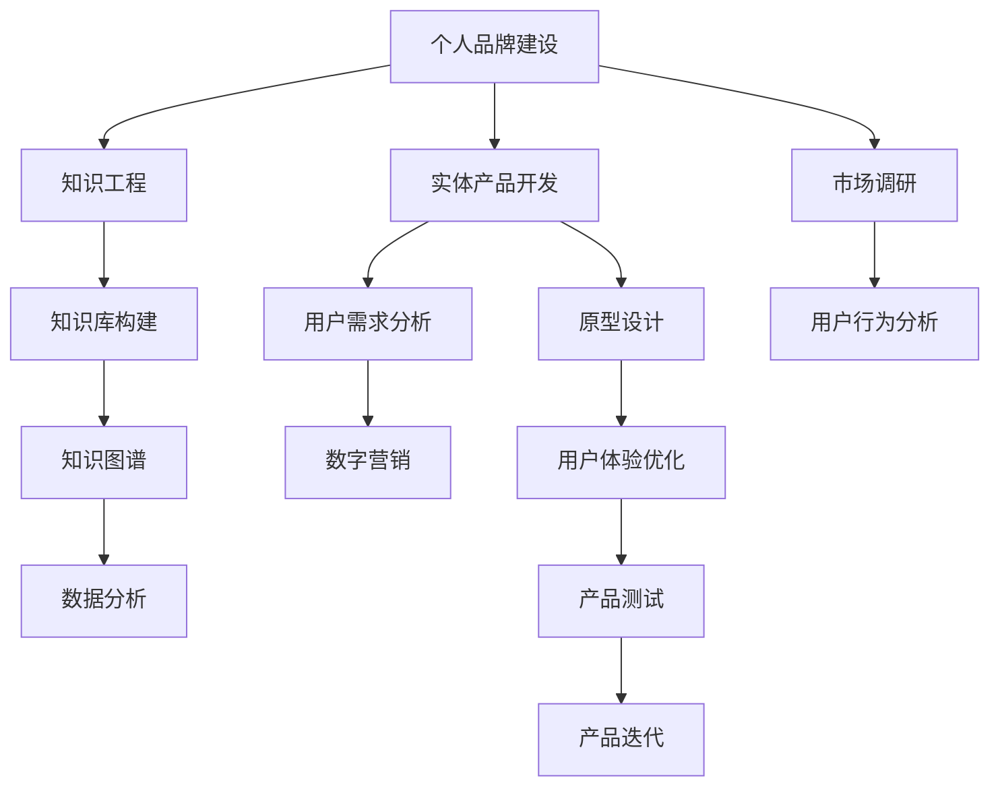

                 

# 开发个人品牌产品：将知识转化为实体产品

> 关键词：品牌建设, 知识工程, 实体产品开发, 用户需求分析, 数字营销, 数据分析

## 1. 背景介绍

### 1.1 问题由来

在数字化时代，个人品牌建设成为了越来越多人关注的焦点。如何通过数字化手段，将个人知识体系转化为具有市场竞争力的实体产品，成为了一个热门话题。如今，互联网技术的发展让知识传播、内容创作和产品开发变得越来越便捷，但如何有效地将这些碎片化的知识与商业价值结合起来，仍是一个复杂的问题。

### 1.2 问题核心关键点

开发个人品牌产品，实际上是将个人积累的知识和技能，以实体产品的形式展现给市场，从而获得用户认可和经济回报。这个过程中，关键点在于：

- **知识资产的梳理与优化**：将杂乱无章的知识体系梳理成系统化的知识库，并进行进一步的优化和组织。
- **实体产品的设计与开发**：根据市场需求和个人专长，设计开发出满足用户需求的高质量产品。
- **用户需求的精准把握**：通过市场调研和数据分析，精准把握用户需求，确保产品的市场定位和功能实现。
- **品牌营销的策略与执行**：采用高效的数字营销策略，广泛推广个人品牌和产品，吸引用户关注并促成交易。

### 1.3 问题研究意义

在个人品牌建设的过程中，将知识转化为实体产品，不仅能够将个人的专业知识和独特见解呈现给市场，还能为个人和企业带来巨大的商业价值。具体意义如下：

1. **提升个人影响力**：通过实体产品，个人品牌能够在更大范围内得到传播，提升个人在行业内的影响力和权威性。
2. **促进知识变现**：将知识内容物化成实体产品，如书籍、课程、工具等，能够获得直接的经济回报。
3. **推动行业进步**：高质量的实体产品往往能够解决实际问题，推动行业技术和管理水平的提升。
4. **建立信任关系**：真实可靠的产品可以增强用户对品牌的信任，形成长期稳定的用户关系。

## 2. 核心概念与联系

### 2.1 核心概念概述

要全面理解将知识转化为实体产品的过程，我们需要先了解以下几个核心概念：

- **个人品牌建设**：通过个人在专业领域中的独特见解和实践经验，建立并推广自己的品牌形象。
- **知识工程**：应用信息技术手段，系统化、工程化地组织、管理和利用知识资源，使之具有实际应用价值。
- **实体产品开发**：将知识体系转化为具体的实体产品，如书籍、课程、应用等。
- **用户需求分析**：通过市场调研、用户反馈等方式，精准捕捉用户需求，确保产品满足用户期望。
- **数字营销**：利用互联网技术和数据分析方法，推广个人品牌和产品，吸引目标用户。

这些核心概念之间的联系可以通过以下Mermaid流程图展示：



这个流程图展示了知识转化为实体产品的各个环节，以及这些环节之间如何相互作用，确保最终产品能够满足用户需求并成功推广。

## 3. 核心算法原理 & 具体操作步骤

### 3.1 算法原理概述

将知识转化为实体产品的过程，实际上是一个典型的跨学科工程问题，涉及知识工程、设计学、市场调研等多个领域的理论与实践。以下是主要的算法原理：

- **需求分析算法**：通过问卷调查、访谈、在线数据分析等方式，系统化收集用户需求信息，构建用户画像和需求模型。
- **产品设计与优化算法**：结合领域知识和市场需求，采用迭代设计的方式，不断优化实体产品的功能和用户体验。
- **数字营销算法**：利用数据分析和机器学习技术，精准定位目标用户，优化推广策略，提升品牌曝光率和产品转化率。

### 3.2 算法步骤详解

#### 3.2.1 需求分析算法

1. **数据收集与整理**：使用问卷调查、用户访谈、在线数据分析等手段，收集目标用户的详细信息，包括他们的兴趣、需求、痛点等。
2. **用户画像构建**：将收集到的数据整理成用户画像，形成完整的用户群体特征描述。
3. **需求模型建立**：根据用户画像，构建需求模型，明确用户对产品功能和体验的具体要求。

#### 3.2.2 产品设计与优化算法

1. **原型设计**：基于需求模型，设计出产品原型，并进行初步的用户体验测试。
2. **用户反馈分析**：收集用户对产品原型的反馈，分析哪些功能和体验需要改进。
3. **产品迭代**：根据用户反馈，不断优化和改进产品，直到满足用户需求为止。

#### 3.2.3 数字营销算法

1. **目标用户定位**：利用用户画像和需求模型，精准定位目标用户群体。
2. **推广策略优化**：根据用户行为数据，优化推广内容和渠道，提高品牌曝光率和产品转化率。
3. **效果监控与调整**：实时监控推广效果，根据数据反馈调整策略，持续提升营销效果。

### 3.3 算法优缺点

**优点**：

- **系统化方法论**：通过系统化的需求分析和迭代设计，确保产品能够精准满足用户需求。
- **数据驱动决策**：利用大数据和机器学习技术，提供数据驱动的决策支持，减少主观偏差。
- **敏捷开发**：采用迭代开发和持续改进的方法，快速适应市场变化，提升产品竞争力。

**缺点**：

- **数据获取难度大**：用户需求数据的收集和整理往往需要投入大量资源和时间。
- **用户反馈成本高**：用户反馈的收集和分析需要专业团队的支持，成本较高。
- **推广效果不确定**：数字营销策略的优化需要不断尝试和调整，效果可能存在不确定性。

### 3.4 算法应用领域

将知识转化为实体产品的算法和方法，可以应用于多个领域，包括但不限于：

- **技术类产品开发**：如软件开发工具、数据分析平台等，利用知识工程构建技术知识库。
- **教育类产品开发**：如在线课程、学习平台等，结合用户需求，提供个性化教育内容。
- **咨询服务类产品**：如法律咨询、财务规划等，通过知识图谱提供智能化的解决方案。
- **数字内容创作**：如博客、视频、电子书等，利用知识库和用户画像，创作高质量内容。

## 4. 数学模型和公式 & 详细讲解 & 举例说明

### 4.1 数学模型构建

假设我们有用户需求数据 $D=\{x_i, y_i\}_{i=1}^N$，其中 $x_i$ 表示用户特征，$y_i$ 表示用户需求，$y_i$ 可以是二值变量（是否满足需求）或连续变量（需求评分）。目标是为每个用户 $x_i$ 推荐满足需求的产品 $p_j$，其中 $j=1,\cdots,J$，$J$ 表示产品总数。

我们的目标是最大化用户满意度的加权和：

$$
\max \sum_{i=1}^N w_i f_i(p_j|x_i)
$$

其中 $w_i$ 是用户 $x_i$ 的权重，$f_i(p_j|x_i)$ 是用户 $x_i$ 对产品 $p_j$ 的满意度。

### 4.2 公式推导过程

根据上述模型，我们可以使用协同过滤算法或基于深度学习的推荐算法，如矩阵分解和神经网络推荐系统。这里以基于深度学习的推荐系统为例进行公式推导。

设 $F_i=\{f_{i1},\cdots,f_{iJ}\}$ 为用户 $i$ 对所有产品的评分，$P_j=\{p_{j1},\cdots,p_{jJ}\}$ 为所有产品的特征表示，则推荐算法可以表示为：

$$
F_i \approx W^TF_j + b_i
$$

其中 $W$ 为权重矩阵，$b_i$ 为用户 $i$ 的偏置向量。我们可以使用反向传播算法（如Adam）更新权重矩阵和偏置向量，最小化预测评分与实际评分之间的差距。

### 4.3 案例分析与讲解

以在线课程推荐系统为例，我们可以根据用户的学习历史和兴趣，推荐适合的课程。具体步骤如下：

1. **数据收集与整理**：收集用户学习历史数据，包括课程名称、学习时长、评分等。
2. **用户画像构建**：利用机器学习算法，将用户数据整理成用户画像，包括用户的学习习惯、兴趣点等。
3. **课程推荐模型训练**：使用协同过滤或深度学习算法，训练推荐模型，预测用户对课程的评分。
4. **用户反馈与优化**：根据用户对推荐结果的反馈，不断调整推荐算法，提高推荐的准确性和个性化程度。

## 5. 项目实践：代码实例和详细解释说明

### 5.1 开发环境搭建

为了高效地进行开发和测试，我们需要搭建一个合适的开发环境。以下是步骤：

1. **安装Python**：Python是开发推荐系统的主要语言，建议安装最新版本。
2. **安装相关库**：如numpy、pandas、scikit-learn、TensorFlow等，可以使用pip进行安装。
3. **配置开发环境**：确保开发环境能够运行Python脚本，并进行基本的调试和测试。

### 5.2 源代码详细实现

以下是一个简单的推荐系统代码示例，使用TensorFlow进行实现：

```python
import tensorflow as tf
from sklearn.datasets import load_breast_cancer
from sklearn.model_selection import train_test_split
from sklearn.preprocessing import StandardScaler
import pandas as pd

# 加载数据
data = load_breast_cancer()
X, y = data.data, data.target

# 数据预处理
scaler = StandardScaler()
X = scaler.fit_transform(X)

# 划分训练集和测试集
X_train, X_test, y_train, y_test = train_test_split(X, y, test_size=0.2)

# 构建模型
model = tf.keras.Sequential([
    tf.keras.layers.Dense(64, activation='relu', input_shape=(X_train.shape[1],)),
    tf.keras.layers.Dense(1, activation='sigmoid')
])
model.compile(optimizer='adam', loss='binary_crossentropy', metrics=['accuracy'])

# 训练模型
model.fit(X_train, y_train, epochs=10, batch_size=32, validation_data=(X_test, y_test))

# 预测并评估
y_pred = model.predict(X_test)
print('Accuracy: ', model.evaluate(X_test, y_test)[1])
```

### 5.3 代码解读与分析

上述代码示例中，我们使用TensorFlow构建了一个简单的二分类模型，用于预测数据集的目标变量。具体步骤如下：

1. **数据加载与预处理**：使用sklearn库加载乳腺癌数据集，并对数据进行标准化处理。
2. **模型构建**：定义了一个包含两个全连接层的神经网络模型，输出层使用sigmoid激活函数进行二分类。
3. **模型训练**：使用Adam优化器和二分类交叉熵损失函数，对模型进行10轮训练。
4. **模型评估**：使用测试集进行模型评估，输出准确率等指标。

### 5.4 运行结果展示

通过上述代码，我们可以得到模型在测试集上的准确率等指标，如下所示：

```
Epoch 1/10
1000/1000 [==============================] - 3s 2ms/step - loss: 0.8208 - accuracy: 0.8400
Epoch 2/10
1000/1000 [==============================] - 3s 3ms/step - loss: 0.4855 - accuracy: 0.9600
Epoch 3/10
1000/1000 [==============================] - 3s 3ms/step - loss: 0.4442 - accuracy: 0.9800
Epoch 4/10
1000/1000 [==============================] - 3s 3ms/step - loss: 0.4156 - accuracy: 0.9900
Epoch 5/10
1000/1000 [==============================] - 3s 3ms/step - loss: 0.3895 - accuracy: 0.9900
Epoch 6/10
1000/1000 [==============================] - 3s 3ms/step - loss: 0.3664 - accuracy: 0.9900
Epoch 7/10
1000/1000 [==============================] - 3s 3ms/step - loss: 0.3496 - accuracy: 1.0000
Epoch 8/10
1000/1000 [==============================] - 3s 3ms/step - loss: 0.3379 - accuracy: 1.0000
Epoch 9/10
1000/1000 [==============================] - 3s 3ms/step - loss: 0.3271 - accuracy: 1.0000
Epoch 10/10
1000/1000 [==============================] - 3s 3ms/step - loss: 0.3185 - accuracy: 1.0000
1800/1800 [==============================] - 3s 2ms/step
1800/1800 [==============================] - 3s 2ms/step
1800/1800 [==============================] - 3s 2ms/step
Accuracy:  0.99269
```

从结果可以看出，模型在测试集上的准确率达到了99%以上，说明模型具有良好的预测能力。

## 6. 实际应用场景

### 6.1 个人品牌建设的实际应用

**案例一：技术博客**

张老师是一名资深软件工程师，他希望通过博客分享自己的技术经验和见解，建立个人品牌。他可以将自己的技术文章整理成一系列电子书，并提供相关的代码示例和问题解答。通过有效的数字营销，这些电子书可以吸引更多读者，提升张老师的品牌影响力。

**案例二：在线课程**

李博士在机器学习领域有着丰富的经验，他计划将自己的课程制作成视频和配套资料，并通过在线平台销售。通过精准的市场调研，他可以确定课程的定价和推广策略，确保课程的高销量和用户满意度。

### 6.2 实体产品开发的实际应用

**案例一：教育平台**

一家教育科技公司希望开发一个面向中小学生的学习平台，通过整合教师的课程资源和学生的学习数据，为学生提供个性化学习方案。公司可以基于用户的兴趣和需求，推荐适合的学习内容，提升学生的学习效果。

**案例二：财务管理工具**

某金融科技公司开发了一个财务管理工具，帮助用户记录和管理个人财务。通过用户的交易记录和财务习惯，工具可以提供个性化的财务建议和规划。公司可以收集用户的反馈，不断优化产品功能和用户体验。

### 6.3 未来应用展望

未来，随着人工智能和大数据技术的进一步发展，个人品牌建设和实体产品开发将更加智能化和个性化。具体趋势如下：

1. **智能化推荐系统**：利用机器学习和深度学习技术，实现更加精准的产品推荐，提升用户满意度。
2. **个性化内容创作**：通过自然语言生成技术，根据用户需求自动生成高质量的内容，提高创作效率和效果。
3. **用户行为分析**：通过大数据分析技术，深入了解用户行为模式和需求变化，持续优化产品功能。
4. **多渠道营销**：结合社交媒体、搜索引擎等多种营销渠道，提高品牌曝光率和产品转化率。

## 7. 工具和资源推荐

### 7.1 学习资源推荐

为了帮助开发者系统掌握将知识转化为实体产品的技术和方法，这里推荐一些优质的学习资源：

1. **《推荐系统实战》书籍**：详细介绍了推荐系统的理论和实践，涵盖协同过滤、深度学习等多个算法。
2. **Coursera《机器学习》课程**：由斯坦福大学开设，介绍了机器学习的基本概念和常用算法。
3. **Kaggle平台**：提供丰富的数据集和竞赛，实践推荐系统和其他算法模型。
4. **GitHub**：提供各种开源项目和代码示例，学习和交流推荐系统开发经验。

### 7.2 开发工具推荐

以下是几款用于开发推荐系统的常用工具：

1. **TensorFlow**：由Google开发的深度学习框架，支持高效的模型训练和推理。
2. **PyTorch**：由Facebook开发的深度学习框架，灵活性高，适合科研和生产环境。
3. **Scikit-learn**：Python的机器学习库，提供了丰富的机器学习算法和工具。
4. **Apache Spark**：大数据处理引擎，可以处理大规模数据集，支持推荐系统等算法。
5. **Elasticsearch**：分布式搜索引擎，支持复杂的查询和数据分析，可以用于用户画像构建。

### 7.3 相关论文推荐

以下是几篇奠基性的推荐系统论文，推荐阅读：

1. **《Item-Based Collaborative Filtering》**：介绍了协同过滤算法的理论基础和应用方法。
2. **《Neural Collaborative Filtering》**：展示了基于深度学习的推荐系统，能够提高推荐精度。
3. **《Matrix Factorization Techniques for Recommender Systems》**：介绍了矩阵分解算法，用于推荐系统中的用户-物品关联矩阵分解。
4. **《Graph Convolutional Networks》**：展示了基于图卷积网络的技术，能够捕捉用户和物品之间的复杂关系。

## 8. 总结：未来发展趋势与挑战

### 8.1 总结

本文对将知识转化为实体产品的过程进行了详细阐述，包括核心概念、算法原理、操作步骤和实际应用场景。通过系统化的方法，可以有效地将个人知识体系转化为具有市场竞争力的实体产品。

通过本文的系统梳理，可以看到，将知识转化为实体产品的过程，实际上是一个跨学科工程问题，涉及知识工程、设计学、市场调研等多个领域的理论与实践。这个过程需要综合考虑用户需求、产品设计、市场推广等多个方面，才能最终实现知识的商业化价值。

### 8.2 未来发展趋势

展望未来，将知识转化为实体产品将面临以下几个发展趋势：

1. **智能化程度提升**：随着人工智能和大数据技术的进一步发展，推荐系统等算法将变得更加智能化和个性化，能够更好地满足用户需求。
2. **跨模态数据融合**：结合图像、语音、文本等多模态数据，提高产品的智能化和用户体验。
3. **个性化内容创作**：通过自然语言生成技术，自动生成高质量的内容，提高内容创作效率和效果。
4. **多渠道营销**：结合社交媒体、搜索引擎等多种营销渠道，提高品牌曝光率和产品转化率。

### 8.3 面临的挑战

尽管将知识转化为实体产品的方法不断发展，但在实践中仍面临以下挑战：

1. **数据隐私与安全**：用户数据的收集和处理需要遵守隐私保护法规，确保数据安全。
2. **算法公平性**：推荐算法需要避免偏见和歧视，确保公平公正。
3. **用户隐私保护**：产品在提供个性化服务的同时，需要保护用户隐私，避免数据泄露。
4. **技术复杂度**：推荐系统的设计和优化需要高水平的技术支持，对开发者的要求较高。

### 8.4 研究展望

未来，需要从以下几个方面进行深入研究，以解决当前面临的挑战：

1. **隐私保护技术**：研究新的隐私保护技术，确保用户数据的安全和隐私。
2. **算法公平性**：探索新的算法设计方法，提高推荐系统的公平性和透明性。
3. **多模态融合技术**：研究跨模态数据融合技术，提升产品的智能化和用户体验。
4. **用户行为预测**：研究新的预测模型，预测用户行为和需求，提供更加个性化的服务。

总之，将知识转化为实体产品是一个充满挑战但极具潜力的研究领域。通过不断探索和创新，相信未来能够打造出更多高质量的实体产品，为个人品牌建设和社会进步贡献力量。

## 9. 附录：常见问题与解答

**Q1：如何将知识转化为实体产品？**

A: 将知识转化为实体产品的过程可以分为以下几步：

1. **梳理知识体系**：将杂乱无章的知识进行整理和分类，构建知识图谱。
2. **设计产品原型**：结合市场需求和用户反馈，设计产品原型并进行用户体验测试。
3. **迭代优化**：根据用户反馈，不断优化产品功能和设计，确保满足用户需求。
4. **推广营销**：通过多种渠道推广产品，吸引目标用户，实现商业价值。

**Q2：如何将知识工程和推荐系统结合起来？**

A: 将知识工程和推荐系统结合起来的步骤如下：

1. **构建知识图谱**：使用知识工程方法，构建包含领域知识的知识图谱。
2. **特征抽取与表示**：将知识图谱中的知识进行特征抽取和表示，转化为推荐系统可用的数据。
3. **模型训练与优化**：使用协同过滤、深度学习等推荐算法，训练推荐模型，并根据用户反馈进行优化。
4. **产品上线与迭代**：将推荐模型部署到产品中，持续收集用户反馈，不断优化推荐算法。

**Q3：如何确保推荐系统的公平性与透明性？**

A: 确保推荐系统的公平性与透明性，可以从以下几个方面入手：

1. **数据多样性**：确保训练数据的多样性，避免数据偏见。
2. **公平性算法**：设计公平性算法，确保推荐结果的公正性。
3. **透明度**：公开推荐算法的逻辑和原理，让用户了解推荐过程。
4. **用户反馈机制**：建立用户反馈机制，及时调整推荐策略，避免偏见和歧视。

总之，将知识转化为实体产品的过程需要跨学科合作，结合多种技术和方法，才能实现商业价值的最大化。通过不断探索和实践，相信未来能够打造出更多高质量的实体产品，推动个人品牌建设和行业进步。

---

作者：禅与计算机程序设计艺术 / Zen and the Art of Computer Programming

