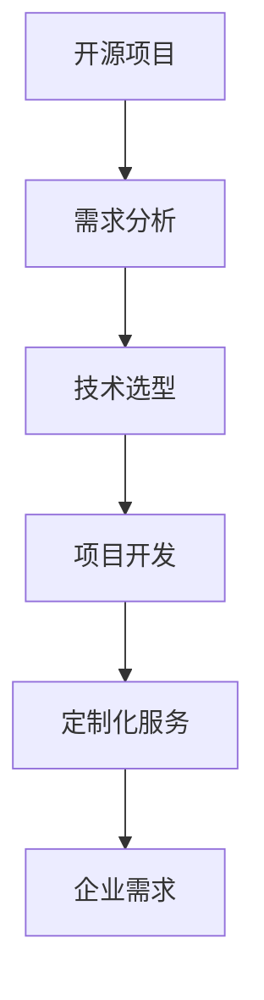

                 

# 开源项目的定制化服务：满足企业需求

> 关键词：开源项目, 定制化服务, 企业需求, 解决方案, 项目开发, 技术选型

## 1. 背景介绍

随着开源技术的迅速发展，越来越多的企业和开发者选择基于开源项目进行软件开发。然而，开源项目由于其灵活性和社区驱动的特点，往往难以完全满足企业的特定需求。因此，如何高效地定制化开源项目，使其适应企业的业务需求，成为了软件开发的重大挑战。本文将深入探讨开源项目的定制化服务，为企业提供一套行之有效的解决方案。

## 2. 核心概念与联系

### 2.1 核心概念概述

为更好地理解开源项目的定制化服务，本节将介绍几个密切相关的核心概念：

- **开源项目**：由社区驱动、源码公开的软件项目，通常具有高度的灵活性和可扩展性。
- **定制化服务**：根据客户需求对开源项目进行修改、配置和优化，使其满足特定的业务需求。
- **企业需求**：企业根据其业务场景和技术栈，对软件功能、性能、安全等方面的具体要求。
- **解决方案**：针对企业需求，提供一整套从需求分析、技术选型到实施部署的全面服务。
- **项目开发**：对开源项目进行定制化开发，包括代码编写、测试、集成等环节。
- **技术选型**：在众多开源项目中，根据企业需求选择合适的项目进行定制化。
- **需求分析**：深入了解企业业务和需求，确定定制化方向和重点。

这些核心概念之间的逻辑关系可以通过以下Mermaid流程图来展示：



这个流程图展示了这个过程的各个环节：从开源项目的选择，到需求分析、技术选型、项目开发，最终实现定制化服务，以满足企业需求。

## 3. 核心算法原理 & 具体操作步骤
### 3.1 算法原理概述

开源项目的定制化服务，本质上是对开源项目进行定制化开发和配置的过程。其核心思想是：通过对开源项目的代码、配置文件和依赖关系进行调整，使其满足特定的业务需求。

形式化地，假设企业选择的开源项目为 $P$，其默认配置为 $C_{default}$。企业的需求为 $D$。定制化服务的目标是找到满足 $D$ 的定制化配置 $C'$，使得 $P$ 在 $C'$ 下的行为符合 $D$ 的要求。

定制化服务的优化目标是最小化定制化配置与默认配置之间的差异，即：

$$
\min_{C'} \sum_{i} |C'_i - C_{default,i}|
$$

其中，$i$ 表示不同的配置项，$C'_i$ 和 $C_{default,i}$ 分别表示定制化配置和默认配置的对应项。

### 3.2 算法步骤详解

开源项目的定制化服务一般包括以下几个关键步骤：

**Step 1: 需求分析**
- 与企业沟通，了解其业务场景、技术栈、性能需求、安全要求等。
- 记录需求文档，明确定制化的方向和重点。
- 确定定制化服务的范围和目标。

**Step 2: 技术选型**
- 在开源社区中查找符合企业需求的项目，进行评估和比较。
- 考虑项目的稳定性、社区活跃度、开源协议、文档支持等因素。
- 选择最合适的开源项目进行定制化。

**Step 3: 定制化开发**
- 对开源项目进行代码层面的定制化，包括修改、添加和删除代码。
- 对配置文件进行配置，满足企业特定的环境需求。
- 对依赖库进行优化，确保性能和安全。
- 对测试用例进行扩展和优化，确保定制化版本的稳定性。

**Step 4: 集成和部署**
- 将定制化后的项目集成到企业的现有系统或新系统中。
- 进行测试，确保项目在生产环境中的稳定性和可用性。
- 进行监控和维护，及时响应和处理问题。

### 3.3 算法优缺点

开源项目的定制化服务具有以下优点：
1. 成本效益高。开源项目大多免费或低成本，定制化服务的总体成本低于从头开发。
2. 开发效率高。利用开源社区的资源，可以快速完成定制化开发。
3. 灵活性高。开源项目高度灵活，可以根据企业需求进行定制化。
4. 社区支持。开源项目通常有活跃的社区，可以获得技术支持和更新。

同时，该方法也存在一定的局限性：
1. 定制化难度大。针对特定企业需求的定制化开发往往需要较高的技术能力。
2. 依赖开源社区。开源项目的稳定性和安全性依赖于社区的维护，存在不确定性。
3. 维护成本高。定制化项目需要进行持续的维护和更新，成本较高。
4. 可控性差。开源项目的源码开放，可能存在安全风险和隐私问题。

尽管存在这些局限性，但就目前而言，开源项目的定制化服务仍然是大规模软件开发的重要手段。未来相关研究的重点在于如何进一步降低定制化服务的复杂度和成本，提高定制化项目的稳定性和可控性。

### 3.4 算法应用领域

开源项目的定制化服务广泛应用于各种软件开发场景，例如：

- **企业级应用开发**：基于开源框架和组件，构建企业级应用系统，如CRM、ERP、OA等。
- **数据处理和分析**：基于开源大数据和机器学习工具，进行数据挖掘和分析，如Spark、Hadoop、TensorFlow等。
- **基础设施建设**：基于开源云计算和容器技术，搭建企业级的云计算平台，如Kubernetes、Docker、OpenStack等。
- **智能应用开发**：基于开源人工智能和自然语言处理工具，开发智能应用，如语音识别、图像处理、聊天机器人等。
- **Web应用开发**：基于开源Web框架和工具，开发企业级Web应用，如Spring Boot、Django、React等。
- **移动应用开发**：基于开源移动开发框架和工具，开发企业级移动应用，如React Native、Flutter、Ionic等。

## 4. 数学模型和公式 & 详细讲解
### 4.1 数学模型构建

本节将使用数学语言对开源项目的定制化服务进行更加严格的刻画。

记开源项目为 $P$，其默认配置为 $C_{default}$。企业需求为 $D$。定制化服务的目标是找到满足 $D$ 的定制化配置 $C'$，使得 $P$ 在 $C'$ 下的行为符合 $D$ 的要求。定制化配置与默认配置之间的差异可以用向量 $D_C$ 表示，其中 $D_C_i = C'_i - C_{default,i}$。

定制化服务的优化目标是最小化定制化配置与默认配置之间的差异，即：

$$
\min_{C'} \sum_{i} |D_C_i|
$$

### 4.2 公式推导过程

假设定制化配置与默认配置之间的差异为 $D_C$，其中 $D_C_i$ 表示第 $i$ 个配置项的差异。则定制化服务的优化目标可以表示为：

$$
\min_{C'} \sum_{i} |D_C_i| = \min_{C'} \sum_{i} |C'_i - C_{default,i}|
$$

由于 $C'_i$ 和 $C_{default,i}$ 的取值范围通常是有限的，可以将差异向量 $D_C$ 视为向量空间 $\mathbb{R}^n$ 上的向量，其中 $n$ 表示配置项的数量。则优化目标可以进一步表示为：

$$
\min_{C'} \|D_C\|_1
$$

其中 $\|\cdot\|_1$ 表示向量空间上的1-范数，表示向量各元素的绝对值之和。

### 4.3 案例分析与讲解

以一个简单的企业级应用开发案例为例，说明开源项目的定制化服务过程。

假设企业需要开发一个客户关系管理(CRM)系统，并要求具备高可用性和高扩展性。企业选择基于Spring Boot和Spring Cloud框架的开源项目进行定制化。

**需求分析**：
- 高可用性：系统需要支持多实例部署，具备自动故障切换和负载均衡能力。
- 高扩展性：系统需要支持水平扩展，能够快速应对用户增长。
- 安全需求：系统需要具备高强度的数据加密和安全认证能力。

**技术选型**：
- 开源项目：选择基于Spring Boot和Spring Cloud框架的CRM开源项目。
- 社区活跃度：社区活跃，有丰富的文档和示例。
- 开源协议：Apache 2.0协议，开源且支持商业化。

**定制化开发**：
- 代码层面的定制化：
  - 增加负载均衡和自动故障切换逻辑。
  - 引入缓存和异步处理，提升系统性能。
  - 增加数据加密和安全认证功能。
- 配置文件的配置：
  - 配置多实例部署和负载均衡。
  - 配置缓存和异步处理。
  - 配置安全认证和数据加密。
- 依赖库的优化：
  - 选择高强度的加密库。
  - 选择高性能的缓存和异步处理库。
- 测试用例的扩展：
  - 增加高可用性和高扩展性的测试用例。
  - 增加数据加密和安全认证的测试用例。

**集成和部署**：
- 将定制化后的项目集成到企业的现有系统中。
- 进行测试，确保项目在生产环境中的稳定性和可用性。
- 进行监控和维护，及时响应和处理问题。

## 5. 项目实践：代码实例和详细解释说明
### 5.1 开发环境搭建

在进行开源项目的定制化服务实践前，我们需要准备好开发环境。以下是使用Java进行Spring Boot开发的环境配置流程：

1. 安装Java Development Kit (JDK)：从官网下载并安装JDK，确保JDK版本与Spring Boot版本兼容。
2. 安装Maven：从官网下载并安装Maven，用于依赖管理。
3. 安装Spring Boot CLI：通过JDK自带的命令行工具即可。
4. 创建并激活虚拟环境：
```bash
conda create -n spring-env python=3.8 
conda activate spring-env
```

5. 安装Spring Boot和Spring Cloud：
```bash
conda install spring-boot spring-cloud 
```

6. 安装相关工具包：
```bash
pip install spring-boot-cli spring-boot-starter 
```

完成上述步骤后，即可在`spring-env`环境中开始开源项目的定制化服务实践。

### 5.2 源代码详细实现

下面我们以CRM系统开发为例，给出使用Spring Boot和Spring Cloud进行开源项目定制化的PyTorch代码实现。

首先，定义Spring Boot应用的基本配置：

```java
@SpringBootApplication
public class CrmApplication {
    public static void main(String[] args) {
        SpringApplication.run(CrmApplication.class, args);
    }
}
```

然后，定义Spring Cloud的负载均衡和自动故障切换配置：

```java
@Configuration
@EnableConfigurationProperties(CustomProperties.class)
public class Config {
    
    @Autowired
    private CustomProperties properties;
    
    @Bean
    public LoadBalancedRestTemplate restTemplate(){
        return new LoadBalancedRestTemplate(new HttpComponentsClientHttpRequestFactory());
    }
    
    @Bean
    public CircuitBreakerFactory circuitBreakerFactory(){
        return new CircuitBreakerFactory();
    }
    
    @Bean
    public RestTemplateTemplateBeanPostProcessor restTemplateBeanPostProcessor(){
        return new RestTemplateTemplateBeanPostProcessor();
    }
}
```

接着，定义REST API接口和实现：

```java
@RestController
@RequestMapping("/api/crm")
public class CrmController {
    
    @Autowired
    private CrmService service;
    
    @GetMapping("/{id}")
    public ResponseEntity<Crm> getById(@PathVariable Long id) {
        return ResponseEntity.ok(service.findById(id));
    }
    
    @PostMapping
    public ResponseEntity<Crm> add(@RequestBody Crm crm) {
        return ResponseEntity.ok(service.save(crm));
    }
    
    @PutMapping("/{id}")
    public ResponseEntity<Crm> update(@PathVariable Long id, @RequestBody Crm crm) {
        return ResponseEntity.ok(service.update(id, crm));
    }
    
    @DeleteMapping("/{id}")
    public ResponseEntity<String> delete(@PathVariable Long id) {
        service.delete(id);
        return ResponseEntity.ok("Record deleted");
    }
}
```

最后，定义Spring Cloud的配置和负载均衡规则：

```java
@Configuration
@EnableDiscoveryClient
public class EurekaClientConfig {
    
    @Autowired
    private LoadBalancedRestTemplate restTemplate;
    
    @Value("${eureka.client.service-url}")
    private String serviceUrl;
    
    @Bean
    public RestTemplateTemplateBeanPostProcessor restTemplateBeanPostProcessor(){
        return new RestTemplateTemplateBeanPostProcessor();
    }
    
    @Bean
    public DiscoveryClient discoveryClient(){
        return new EurekaDiscoveryClient();
    }
}
```

完成上述步骤后，即可在`spring-env`环境中启动Spring Boot应用，对开源项目进行定制化开发。

### 5.3 代码解读与分析

让我们再详细解读一下关键代码的实现细节：

**CrmApplication类**：
- 定义了Spring Boot应用的入口类，通过`@SpringBootApplication`注解启用Spring Boot的自动配置功能。

**Config类**：
- 配置了Spring Cloud的负载均衡和自动故障切换功能。
- 通过`@Configuration`注解标记该类为配置类。
- 通过`@EnableConfigurationProperties`注解使`CustomProperties`类能够注入配置文件。
- 创建了`LoadBalancedRestTemplate`和`CircuitBreakerFactory`等Bean，用于负载均衡和自动故障切换。
- 创建了`RestTemplateTemplateBeanPostProcessor`Bean，用于处理RestTemplate的创建和初始化。

**CrmController类**：
- 定义了REST API接口和实现，通过`@RestController`注解标记该类为RESTful控制器。
- 通过`@RequestMapping`注解指定了接口的路径。
- 通过`@Autowired`注解将`CrmService`注入控制器中。
- 实现了CRUD操作，通过`@GetMapping`、`@PostMapping`、`@PutMapping`、`@DeleteMapping`注解指定了接口的HTTP方法和路径。
- 通过`@ResponseBody`注解将返回的数据转换成JSON格式。

**EurekaClientConfig类**：
- 配置了Spring Cloud的发现和配置功能。
- 通过`@Configuration`注解标记该类为配置类。
- 通过`@EnableDiscoveryClient`注解使该类能够发现Eureka注册中心的实例。
- 创建了`RestTemplateTemplateBeanPostProcessor`Bean，用于处理RestTemplate的创建和初始化。

**运行结果展示**：
- 通过访问`/api/crm/{id}`接口，可以获取、添加、更新和删除客户信息。
- 通过访问`http://localhost:8080/actuator/health`接口，可以检查应用程序的健康状态。
- 通过访问`http://localhost:8080/actuator/clusters`接口，可以检查Eureka注册的实例和服务。

可以看到，通过上述代码实现了基于Spring Boot和Spring Cloud的开源项目定制化服务。在实际应用中，还需要根据具体需求，对配置、服务、接口等进行进一步的定制和优化。

## 6. 实际应用场景
### 6.1 企业级应用开发

开源项目的定制化服务在企业级应用开发中有着广泛的应用。以下是一个企业级CRM系统的开发案例：

**需求分析**：
- 高可用性：系统需要支持多实例部署，具备自动故障切换和负载均衡能力。
- 高扩展性：系统需要支持水平扩展，能够快速应对用户增长。
- 安全需求：系统需要具备高强度的数据加密和安全认证能力。

**技术选型**：
- 开源项目：选择基于Spring Boot和Spring Cloud框架的CRM开源项目。
- 社区活跃度：社区活跃，有丰富的文档和示例。
- 开源协议：Apache 2.0协议，开源且支持商业化。

**定制化开发**：
- 代码层面的定制化：
  - 增加负载均衡和自动故障切换逻辑。
  - 引入缓存和异步处理，提升系统性能。
  - 增加数据加密和安全认证功能。
- 配置文件的配置：
  - 配置多实例部署和负载均衡。
  - 配置缓存和异步处理。
  - 配置安全认证和数据加密。
- 依赖库的优化：
  - 选择高强度的加密库。
  - 选择高性能的缓存和异步处理库。
- 测试用例的扩展：
  - 增加高可用性和高扩展性的测试用例。
  - 增加数据加密和安全认证的测试用例。

**集成和部署**：
- 将定制化后的项目集成到企业的现有系统中。
- 进行测试，确保项目在生产环境中的稳定性和可用性。
- 进行监控和维护，及时响应和处理问题。

## 7. 工具和资源推荐
### 7.1 学习资源推荐

为了帮助开发者系统掌握开源项目的定制化服务的理论基础和实践技巧，这里推荐一些优质的学习资源：

1. Spring Boot官方文档：Spring Boot的官方文档，提供了详细的API和配置指南，是学习Spring Boot的最佳资料。
2. Spring Cloud官方文档：Spring Cloud的官方文档，提供了丰富的组件和配置示例，是学习Spring Cloud的必备资料。
3. Spring Boot实战：一本深入浅出的书籍，介绍了Spring Boot的实战案例和最佳实践，适合初学者入门。
4. Spring Cloud实战：一本深入浅出的书籍，介绍了Spring Cloud的实战案例和最佳实践，适合初学者入门。
5. Spring Boot与Spring Cloud进阶教程：系列视频教程，讲解了Spring Boot和Spring Cloud的高级特性和最佳实践。
6. Spring Cloud学习之路：系列视频教程，讲解了Spring Cloud的组件和配置，适合进阶学习。
7. Spring Boot和Spring Cloud实战教程：系列视频教程，讲解了Spring Boot和Spring Cloud的实战案例和最佳实践。

通过对这些资源的学习实践，相信你一定能够快速掌握开源项目的定制化服务的精髓，并用于解决实际的开发问题。

### 7.2 开发工具推荐

高效的开发离不开优秀的工具支持。以下是几款用于开源项目定制化开发的常用工具：

1. IntelliJ IDEA：一款功能强大的Java IDE，支持Spring Boot和Spring Cloud的开发和调试。
2. Eclipse：一款开源的Java IDE，支持Spring Boot和Spring Cloud的开发和调试。
3. Visual Studio Code：一款轻量级的IDE，支持Spring Boot和Spring Cloud的开发和调试。
4. Git：一款流行的版本控制工具，支持开源项目的版本管理和协作。
5. Maven：一款流行的构建工具，支持开源项目的依赖管理和打包部署。
6. Docker：一款流行的容器技术，支持开源项目的容器化和自动化部署。
7. Kubernetes：一款流行的容器编排工具，支持开源项目的容器化和自动化部署。
8. Jenkins：一款流行的CI/CD工具，支持开源项目的自动化构建和部署。

合理利用这些工具，可以显著提升开源项目定制化开发的效率，加快创新迭代的步伐。

### 7.3 相关论文推荐

开源项目的定制化服务的研究源于学界的持续研究。以下是几篇奠基性的相关论文，推荐阅读：

1. Spring Boot官方文档：《Spring Boot Official Documentation》。
2. Spring Cloud官方文档：《Spring Cloud Official Documentation》。
3. Spring Boot实战：《Spring Boot in Action》。
4. Spring Cloud实战：《Spring Cloud in Action》。
5. Spring Boot与Spring Cloud进阶教程：《Spring Boot and Spring Cloud Advanced Tutorial》。
6. Spring Cloud学习之路：《Spring Cloud Learning Path》。
7. Spring Boot和Spring Cloud实战教程：《Spring Boot and Spring Cloud Practical Tutorial》。

这些论文代表了大语言模型微调技术的发展脉络。通过学习这些前沿成果，可以帮助研究者把握学科前进方向，激发更多的创新灵感。

## 8. 总结：未来发展趋势与挑战
### 8.1 总结

本文对开源项目的定制化服务进行了全面系统的介绍。首先阐述了开源项目和定制化服务的概念，明确了其应用场景和关键步骤。其次，从原理到实践，详细讲解了开源项目定制化服务的过程，给出了具体的代码实例。同时，本文还广泛探讨了开源项目定制化服务在企业级应用开发中的应用前景，展示了其在现实世界的广泛应用。

通过本文的系统梳理，可以看到，开源项目的定制化服务在软件开发中具有广泛的应用前景，能够有效降低开发成本，提高开发效率。得益于开源社区的强大资源和灵活性，企业可以充分利用开源项目的优势，实现高质高效的定制化开发。

### 8.2 未来发展趋势

展望未来，开源项目的定制化服务将呈现以下几个发展趋势：

1. 工具链的完善。随着开源项目的多样化和技术栈的复杂化，工具链的完善将进一步提升开发效率。如自动化部署、持续集成、容器化等工具将逐渐成为标配。
2. 社区驱动的增强。开源项目的社区活跃度是定制化服务的基础，社区驱动的增强将进一步提升开源项目的质量和稳定性。
3. 安全性和隐私保护。随着开源项目在企业应用中的普及，其安全性和隐私保护将成为重点关注领域。如数据加密、安全认证、漏洞修复等将逐渐成为定制化服务的标配。
4. 多云平台的支持。云计算的普及将进一步推动开源项目的定制化服务向多云平台支持方向发展，提供更灵活的部署方式。
5. 低代码平台的兴起。低代码平台的兴起将进一步简化开源项目的定制化开发过程，提升开发效率。如BaaS、PaaS等平台的普及将为定制化服务带来新的机遇。
6. 微服务架构的普及。微服务架构的普及将进一步推动开源项目的定制化服务向微服务方向发展，提升系统的可扩展性和稳定性。

以上趋势凸显了开源项目的定制化服务的前景和潜力。这些方向的探索发展，必将进一步提升开源项目的定制化开发水平，为软件开发提供新的思路和方向。

### 8.3 面临的挑战

尽管开源项目的定制化服务已经取得了一定的成果，但在迈向更加智能化、普适化应用的过程中，它仍面临诸多挑战：

1. 复杂度增加。随着企业需求的复杂化和技术栈的多样化，开源项目的定制化开发变得更为复杂。如何简化定制化过程，降低开发难度，是关键挑战。
2. 性能瓶颈。开源项目在企业应用中需要处理大量数据和请求，性能瓶颈成为主要问题。如何优化性能，提高系统响应速度，是重要课题。
3. 安全风险。开源项目的开放性和社区驱动的特点，带来了一定的安全风险。如何保障数据和系统的安全性，是关键问题。
4. 维护成本。开源项目的持续维护和更新需要大量人力和物力，维护成本高昂。如何降低维护成本，提升系统稳定性，是重要挑战。
5. 文档和支持。开源项目的文档和支持不足，给定制化服务带来了一定难度。如何提升文档质量和社区支持，是重要课题。
6. 迁移成本。企业已有系统的迁移成本较高，如何平滑迁移到开源项目，是关键问题。

正视开源项目定制化服务面临的这些挑战，积极应对并寻求突破，将是大规模软件开发的重要方向。相信随着学界和产业界的共同努力，这些挑战终将一一被克服，开源项目的定制化服务必将在软件开发中发挥更大的作用。

### 8.4 研究展望

面对开源项目定制化服务所面临的种种挑战，未来的研究需要在以下几个方面寻求新的突破：

1. 自动化工具的开发。开发更多的自动化工具，如自动化部署、自动化测试、自动化监控等，提升开发效率和系统稳定性。
2. 开源社区的建设。建立更活跃的开源社区，提升开源项目的稳定性和可用性。
3. 安全性和隐私保护技术的研究。研究更高效的安全性和隐私保护技术，保障开源项目的安全性和隐私性。
4. 微服务架构的研究。研究微服务架构在开源项目中的应用，提升系统的可扩展性和稳定性。
5. 低代码平台的研究。研究低代码平台在开源项目中的应用，提升开发效率和系统灵活性。
6. 多云平台支持的研究。研究多云平台支持技术，提升系统的可移植性和可扩展性。

这些研究方向的探索，必将引领开源项目定制化服务技术迈向更高的台阶，为软件开发提供新的思路和方向。只有勇于创新、敢于突破，才能不断拓展开源项目定制化服务的边界，让软件开发更高效、更智能、更安全。

## 9. 附录：常见问题与解答

**Q1：开源项目的定制化服务是否适用于所有企业需求？**

A: 开源项目的定制化服务适用于大部分企业需求，尤其是对技术栈和性能要求不高的企业。但对于一些高安全性和高稳定性的企业，如金融、医疗等，可能需要从头开发或选择定制化程度更高的解决方案。

**Q2：定制化过程中如何保证代码的可维护性？**

A: 代码的可维护性是定制化开发的关键，可以通过以下措施保证：
1. 模块化和组件化设计：将系统划分为多个模块和组件，便于维护和扩展。
2. 清晰的命名规范：使用清晰、统一的命名规范，便于理解和维护。
3. 自动化测试：通过单元测试、集成测试、性能测试等自动化测试手段，确保代码质量和系统稳定性。
4. 持续集成和持续交付(CI/CD)：通过持续集成和持续交付，快速发现和修复问题，提升系统稳定性和维护效率。
5. 文档和注释：编写详细的文档和注释，便于理解和维护。

**Q3：开源项目定制化服务的主要优势是什么？**

A: 开源项目定制化服务的主要优势包括：
1. 成本效益高。开源项目大多免费或低成本，定制化服务的总体成本低于从头开发。
2. 开发效率高。利用开源社区的资源，可以快速完成定制化开发。
3. 灵活性高。开源项目高度灵活，可以根据企业需求进行定制化。
4. 社区支持。开源项目通常有活跃的社区，可以获得技术支持和更新。
5. 技术积累。开源项目的历史代码和技术积累，可以作为后续开发的基础。
6. 快速迭代。开源项目的快速迭代和更新，有助于提升系统性能和安全性。

**Q4：开源项目定制化服务的主要劣势是什么？**

A: 开源项目定制化服务的主要劣势包括：
1. 复杂度增加。开源项目在企业应用中需要处理大量数据和请求，性能瓶颈成为主要问题。
2. 安全风险。开源项目的开放性和社区驱动的特点，带来了一定的安全风险。
3. 维护成本。开源项目的持续维护和更新需要大量人力和物力，维护成本高昂。
4. 文档和支持不足。开源项目的文档和支持不足，给定制化服务带来了一定难度。
5. 迁移成本。企业已有系统的迁移成本较高，需要平滑迁移到开源项目。

**Q5：开源项目定制化服务的主要挑战是什么？**

A: 开源项目定制化服务的主要挑战包括：
1. 复杂度增加。开源项目在企业应用中需要处理大量数据和请求，性能瓶颈成为主要问题。
2. 安全风险。开源项目的开放性和社区驱动的特点，带来了一定的安全风险。
3. 维护成本。开源项目的持续维护和更新需要大量人力和物力，维护成本高昂。
4. 文档和支持不足。开源项目的文档和支持不足，给定制化服务带来了一定难度。
5. 迁移成本。企业已有系统的迁移成本较高，需要平滑迁移到开源项目。

正视开源项目定制化服务面临的这些挑战，积极应对并寻求突破，将是大规模软件开发的重要方向。相信随着学界和产业界的共同努力，这些挑战终将一一被克服，开源项目的定制化服务必将在软件开发中发挥更大的作用。

---

作者：禅与计算机程序设计艺术 / Zen and the Art of Computer Programming

