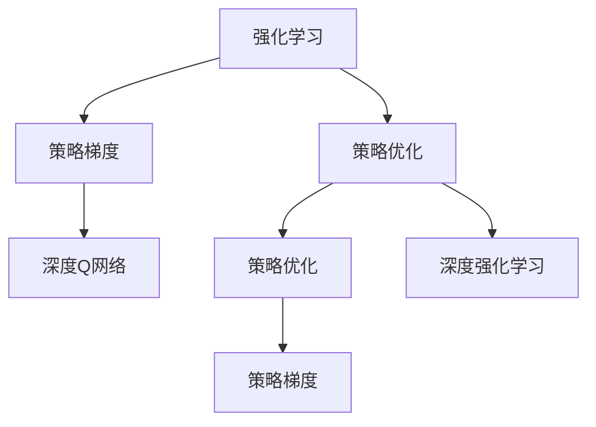

                 

# 强化学习Reinforcement Learning中的策略梯度方法详解

> 关键词：强化学习,策略梯度,策略优化,深度强化学习,深度Q网络

## 1. 背景介绍

### 1.1 问题由来
强化学习（Reinforcement Learning, RL）是机器学习领域中的一个重要分支，主要研究智能体（agent）如何在环境中进行交互，以最大化累计奖励（cumulative reward）为目标，通过探索和利用（exploitation）来实现决策优化。与监督学习和无监督学习不同，强化学习是一个闭环学习系统，智能体与环境不断交互，以即时反馈的方式指导学习过程。

在强化学习中，策略梯度方法（Policy Gradient Methods）是一类将策略优化（policy optimization）与梯度估计（gradient estimation）相结合的算法。它们利用策略梯度定理（Policy Gradient Theorem）来更新策略参数，从而提升智能体在特定环境中的表现。策略梯度方法在连续动作空间和离散动作空间中都有广泛应用，尤其在深度强化学习中，其表现尤为突出。

### 1.2 问题核心关键点
策略梯度方法的核心理念是通过梯度信息来更新策略参数，优化智能体的决策行为。与传统的基于价值函数的Q学习算法不同，策略梯度方法直接优化策略，而不是价值函数。这种直接优化策略的方式，使得策略梯度方法在处理高维连续动作空间、非平稳（non-stationary）策略优化、高维观测空间等问题时表现出色。

策略梯度方法的优化目标是最大化长期奖励的期望值，而非短期内瞬时奖励的最大化。通过累积奖励（cumulative reward）的构建，策略梯度方法能够更好地应对环境变化，提高智能体的决策鲁棒性。

## 2. 核心概念与联系

### 2.1 核心概念概述

为更好地理解策略梯度方法，本节将介绍几个关键概念：

- **强化学习**：涉及智能体、环境、行动、奖励、策略等要素的学习范式。目标是使智能体最大化长期奖励。
- **策略**：智能体在环境中的行为策略，通常表示为概率分布$p(a_t|s_t)$，表示在状态$s_t$下采取行动$a_t$的概率。
- **策略梯度**：策略优化的方法之一，通过梯度信息来更新策略参数。策略梯度$\nabla_\theta J(\theta)$表示策略$J(\theta)$对参数$\theta$的梯度，其中$J(\theta)$为策略的目标函数，如累积奖励的期望。
- **深度强化学习**：利用深度神经网络来逼近策略函数或价值函数，从而提升强化学习的效率和效果。
- **策略优化**：通过优化策略来提升智能体的性能，策略优化是强化学习中的核心任务之一。
- **深度Q网络**：一种基于深度神经网络的Q学习算法，主要用于离散动作空间的强化学习任务。

这些概念之间的逻辑关系可以通过以下Mermaid流程图来展示：



这个流程图展示了几大核心概念及其之间的关系：

1. 强化学习通过智能体与环境的交互，优化策略以最大化累计奖励。
2. 策略梯度方法直接优化策略，通过策略梯度定理进行参数更新。
3. 深度Q网络是深度强化学习的一种实现方式，主要用于离散动作空间。
4. 策略优化是强化学习中的核心任务，策略梯度方法是其中的重要方法。
5. 深度强化学习结合了深度学习和强化学习的特点，提升算法的效率和效果。

这些概念共同构成了强化学习中的策略梯度方法框架，使得智能体能够在复杂环境中通过学习优化策略，实现长期奖励的最大化。通过理解这些核心概念，我们可以更好地把握策略梯度方法的优化原理和实践细节。

## 3. 核心算法原理 & 具体操作步骤
### 3.1 算法原理概述

策略梯度方法的核心思想是通过梯度信息来更新策略参数，优化智能体的决策行为。其核心算法流程如下：

1. **策略定义**：定义智能体的策略函数$p(a_t|s_t)$，表示在状态$s_t$下采取行动$a_t$的概率。
2. **累积奖励计算**：根据智能体在环境中的行为，计算累积奖励$G_t$，表示从当前状态到未来的期望奖励。
3. **策略梯度计算**：使用策略梯度定理计算策略$J(\theta)$对策略参数$\theta$的梯度$\nabla_\theta J(\theta)$，指导策略优化。
4. **策略更新**：根据策略梯度$\nabla_\theta J(\theta)$，使用优化算法（如梯度下降、Adam等）更新策略参数$\theta$，优化策略函数$p(a_t|s_t)$。

### 3.2 算法步骤详解

**Step 1: 策略定义**

策略梯度方法的核心在于策略函数的定义。常见的策略函数包括线性策略和深度策略。其中，深度策略函数$p(a_t|s_t)$表示为神经网络的形式，输入为状态$s_t$，输出为概率分布$p(a_t|s_t)$。例如，使用深度神经网络逼近策略函数：

$$
p(a_t|s_t) = \sigma(W_{a_t}h(s_t))
$$

其中$W_{a_t}$和$h(s_t)$分别为线性变换和隐藏层，$\sigma$为激活函数，如ReLU。

**Step 2: 累积奖励计算**

累积奖励$G_t$的计算基于时间差分（time difference）公式，表示为：

$$
G_t = r_{t+1} + \gamma r_{t+2} + \gamma^2 r_{t+3} + \cdots
$$

其中$r_t$表示即时奖励，$\gamma$为折扣因子，控制未来奖励的重要性。

**Step 3: 策略梯度计算**

策略梯度$\nabla_\theta J(\theta)$的计算基于策略梯度定理，表示为：

$$
\nabla_\theta J(\theta) = \mathbb{E}_{s_t,a_t} \left[ \nabla_\theta \log p(a_t|s_t) A(s_t) \right]
$$

其中$A(s_t)$为优势函数（advantage function），表示为：

$$
A(s_t) = Q(s_t,a_t) - V(s_t)
$$

其中$Q(s_t,a_t)$为状态-行动价值函数（state-action value function），$V(s_t)$为状态价值函数（state value function）。

**Step 4: 策略更新**

根据策略梯度$\nabla_\theta J(\theta)$，使用优化算法更新策略参数$\theta$，优化策略函数$p(a_t|s_t)$。例如，使用梯度下降算法更新策略参数：

$$
\theta \leftarrow \theta - \eta \nabla_\theta J(\theta)
$$

其中$\eta$为学习率，用于控制策略参数更新的步长。

### 3.3 算法优缺点

策略梯度方法的优点包括：

1. **直接优化策略**：策略梯度方法直接优化策略，能够应对连续动作空间和高维观测空间。
2. **鲁棒性**：策略梯度方法对策略更新的鲁棒性较好，能够处理非平稳策略优化问题。
3. **灵活性**：策略梯度方法适用于多种奖励函数和状态空间，具有较高的灵活性。

策略梯度方法的主要缺点包括：

1. **梯度方差**：策略梯度方法的梯度方差较大，导致学习过程不稳定。
2. **样本效率**：策略梯度方法需要大量的经验数据，导致样本效率较低。
3. **优化难度**：策略梯度方法对策略函数的表达能力要求较高，难以处理复杂的策略函数。

尽管存在这些局限性，策略梯度方法在深度强化学习中的应用依然非常广泛，尤其是在深度Q网络（Deep Q Network, DQN）等算法中表现出色。未来相关研究的重点在于如何进一步降低梯度方差，提高样本效率，优化策略函数表达能力，以进一步提升算法性能。

### 3.4 算法应用领域

策略梯度方法在强化学习领域有广泛的应用，例如：

- **机器人控制**：使用策略梯度方法训练机器人进行复杂动作，如抓取物体、行走等。
- **游戏AI**：使用策略梯度方法训练游戏AI，提升游戏水平和体验。
- **自然语言处理**：使用策略梯度方法训练生成模型，如语言模型、翻译模型等。
- **推荐系统**：使用策略梯度方法训练推荐模型，提升推荐效果和用户满意度。
- **金融风控**：使用策略梯度方法训练风控模型，预测和预防金融风险。

除了上述这些经典应用外，策略梯度方法还被创新性地应用于更多场景中，如可控交通信号、自动驾驶、智能电网等，为各行各业带来智能化解决方案。

## 4. 数学模型和公式 & 详细讲解 & 举例说明

### 4.1 数学模型构建

策略梯度方法的数学模型构建主要包括以下几个关键部分：

- **策略定义**：定义策略函数$p(a_t|s_t)$，表示在状态$s_t$下采取行动$a_t$的概率。
- **累积奖励计算**：根据智能体在环境中的行为，计算累积奖励$G_t$。
- **策略梯度计算**：使用策略梯度定理计算策略$J(\theta)$对策略参数$\theta$的梯度$\nabla_\theta J(\theta)$。

**策略定义**：

$$
p(a_t|s_t) = \sigma(W_{a_t}h(s_t))
$$

**累积奖励计算**：

$$
G_t = r_{t+1} + \gamma r_{t+2} + \gamma^2 r_{t+3} + \cdots
$$

**策略梯度计算**：

$$
\nabla_\theta J(\theta) = \mathbb{E}_{s_t,a_t} \left[ \nabla_\theta \log p(a_t|s_t) A(s_t) \right]
$$

其中$A(s_t)$为优势函数，表示为：

$$
A(s_t) = Q(s_t,a_t) - V(s_t)
$$

其中$Q(s_t,a_t)$为状态-行动价值函数，$V(s_t)$为状态价值函数。

### 4.2 公式推导过程

**策略梯度定理**：

策略梯度定理指出，策略函数的梯度$\nabla_\theta J(\theta)$可以表示为策略$J(\theta)$对策略参数$\theta$的梯度，以及策略优势函数$A(s_t)$的期望值的乘积。

具体推导如下：

设策略$p(a_t|s_t)$，状态$s_t$，行动$a_t$，即时奖励$r_t$，折扣因子$\gamma$，累计奖励$G_t$，策略函数$J(\theta)$，策略梯度$\nabla_\theta J(\theta)$，策略优势函数$A(s_t)$。

根据策略梯度定理，有：

$$
\nabla_\theta J(\theta) = \mathbb{E}_{s_t,a_t} \left[ \nabla_\theta \log p(a_t|s_t) A(s_t) \right]
$$

其中$A(s_t)$为优势函数，表示为：

$$
A(s_t) = Q(s_t,a_t) - V(s_t)
$$

其中$Q(s_t,a_t)$为状态-行动价值函数，$V(s_t)$为状态价值函数。

**优势函数**：

优势函数$A(s_t)$表示策略在状态$s_t$下采取行动$a_t$的优势度量，反映了行动$a_t$相对于其他行动的预期性能提升。

优势函数的优势在于能够更好地衡量行动的质量，避免直接优化即时奖励带来的方差问题。

### 4.3 案例分析与讲解

**案例分析**：

假设有一个简单的强化学习环境，状态$s_t$为位置，行动$a_t$为向上、向下移动，即时奖励为-1，折扣因子为0.9。智能体需要在环境中找到一个最优策略，使得累积奖励最大化。

首先定义策略函数：

$$
p(a_t|s_t) = \sigma(W_{a_t}h(s_t))
$$

其中$W_{a_t}$和$h(s_t)$分别为线性变换和隐藏层，$\sigma$为激活函数，如ReLU。

然后计算累积奖励：

$$
G_t = r_{t+1} + \gamma r_{t+2} + \gamma^2 r_{t+3} + \cdots
$$

最后，使用策略梯度定理计算策略梯度：

$$
\nabla_\theta J(\theta) = \mathbb{E}_{s_t,a_t} \left[ \nabla_\theta \log p(a_t|s_t) A(s_t) \right]
$$

其中$A(s_t)$为优势函数，表示为：

$$
A(s_t) = Q(s_t,a_t) - V(s_t)
$$

其中$Q(s_t,a_t)$为状态-行动价值函数，$V(s_t)$为状态价值函数。

使用梯度下降算法更新策略参数：

$$
\theta \leftarrow \theta - \eta \nabla_\theta J(\theta)
$$

其中$\eta$为学习率，用于控制策略参数更新的步长。

## 5. 项目实践：代码实例和详细解释说明

### 5.1 开发环境搭建

在进行策略梯度方法的实践前，我们需要准备好开发环境。以下是使用Python进行TensorFlow或PyTorch开发的环境配置流程：

1. 安装Anaconda：从官网下载并安装Anaconda，用于创建独立的Python环境。

2. 创建并激活虚拟环境：
```bash
conda create -n pytorch-env python=3.8 
conda activate pytorch-env
```

3. 安装PyTorch或TensorFlow：根据个人选择，使用以下命令安装对应的深度学习框架。
```bash
conda install pytorch torchvision torchaudio cudatoolkit=11.1 -c pytorch -c conda-forge
# 或
pip install tensorflow
```

4. 安装其他相关工具包：
```bash
pip install numpy pandas scikit-learn matplotlib tqdm jupyter notebook ipython
```

完成上述步骤后，即可在`pytorch-env`环境中开始策略梯度方法的实践。

### 5.2 源代码详细实现

下面是使用TensorFlow实现策略梯度方法的示例代码：

```python
import tensorflow as tf
import numpy as np

# 定义策略函数
def policy(s):
    w = tf.Variable(tf.zeros([4]))
    b = tf.Variable(tf.zeros([1]))
    h = tf.layers.dense(s, units=2, activation=tf.nn.relu)
    logits = tf.matmul(h, w) + b
    return tf.nn.softmax(logits)

# 定义累积奖励计算
def compute_greedy(s, a):
    r = -1
    if a == 1:
        r = 10
    return r

# 定义策略梯度计算
def compute_gradient(policy, s, a, g):
    logp = tf.math.log(policy(s))
    advantage = g - tf.reduce_mean(g)
    grad = tf.reduce_mean(advantage * logp)
    return grad

# 定义策略更新
def update_policy(learning_rate, policy, grad):
    optimizer = tf.train.GradientDescentOptimizer(learning_rate)
    train_op = optimizer.minimize(policy, grad)
    return train_op

# 主函数
def main():
    # 定义策略参数
    policy_vars = tf.global_variables()
    # 定义累积奖励
    rewards = np.zeros((100, 1))
    # 定义策略梯度
    gradients = np.zeros((4, 1))
    # 定义学习率
    learning_rate = 0.01
    # 定义优化器
    train_op = update_policy(learning_rate, policy, gradients)
    # 训练模型
    with tf.Session() as sess:
        sess.run(tf.global_variables_initializer())
        for i in range(100):
            s = i % 4
            a = 1
            r = compute_greedy(s, a)
            rewards[i] = r
            gradients = compute_gradient(policy, s, a, r)
            sess.run(train_op)
            if i % 10 == 0:
                print("Iteration", i, "\n", sess.run(policy_vars))
        # 输出最终累积奖励
        print("Final rewards:", rewards)

if __name__ == "__main__":
    main()
```

### 5.3 代码解读与分析

让我们再详细解读一下关键代码的实现细节：

**policy函数**：
- 定义策略函数，输入状态$s_t$，输出概率分布$p(a_t|s_t)$。

**compute_greedy函数**：
- 计算在当前状态下采取贪婪行动的即时奖励。

**compute_gradient函数**：
- 根据策略梯度定理，计算策略梯度。

**update_policy函数**：
- 定义策略更新操作，使用梯度下降算法更新策略参数。

**main函数**：
- 定义策略参数、累积奖励、策略梯度、学习率、优化器等。
- 循环迭代，更新策略参数，计算累积奖励。
- 输出最终累积奖励。

可以看到，TensorFlow的实现使得策略梯度方法的计算和优化变得相对简单，开发者可以通过调整函数和超参数，灵活配置模型的训练过程。

当然，工业级的系统实现还需考虑更多因素，如模型的保存和部署、超参数的自动搜索、更加灵活的任务适配层等。但核心的策略梯度方法基本与此类似。

## 6. 实际应用场景

### 6.1 智能机器人控制

策略梯度方法在智能机器人控制中有着广泛的应用。传统的机器人控制依赖于手动编写的控制规则，难以应对复杂多变的环境。而策略梯度方法可以训练智能体在特定环境中进行策略优化，实现自主导航、抓取物体等任务。

例如，训练一个智能机器人进行抓取物体，可以将机器人当前位置作为状态$s_t$，移动方向作为行动$a_t$，根据抓取物体的成功与否计算即时奖励。通过策略梯度方法，智能体可以学习到最优的抓取策略，实现自动化的物体抓取。

### 6.2 游戏AI

策略梯度方法在游戏AI中也有着显著的应用。传统游戏AI依赖于预定义的策略，难以应对游戏环境的多变性和动态性。而策略梯度方法可以训练游戏AI进行自我学习，提升游戏水平和体验。

例如，训练一个AlphaGo系统进行围棋对弈，可以将当前游戏状态作为状态$s_t$，下一步棋作为行动$a_t$，根据游戏的胜负情况计算即时奖励。通过策略梯度方法，AlphaGo可以学习到最优的围棋策略，提升对弈水平。

### 6.3 推荐系统

策略梯度方法在推荐系统中也有着重要的应用。传统的推荐系统依赖于用户历史行为数据，难以应对新用户的推荐需求。而策略梯度方法可以训练推荐模型进行自我学习，提升推荐效果和用户满意度。

例如，训练一个推荐系统进行个性化推荐，可以将用户历史行为作为状态$s_t$，推荐商品作为行动$a_t$，根据用户的满意度计算即时奖励。通过策略梯度方法，推荐系统可以学习到最优的推荐策略，提升推荐效果。

### 6.4 金融风控

策略梯度方法在金融风控中也表现出良好的应用前景。传统的金融风控依赖于手工规则和专家经验，难以应对动态的市场变化。而策略梯度方法可以训练风控模型进行自我学习，提升风险预测和防范能力。

例如，训练一个风控模型进行信用评估，可以将用户的历史信用记录作为状态$s_t$，贷款金额作为行动$a_t$，根据贷款的违约情况计算即时奖励。通过策略梯度方法，风控模型可以学习到最优的信用评估策略，提升风险预测能力。

### 6.5 未来应用展望

未来，策略梯度方法在更多领域将展现出巨大的应用潜力，主要体现在以下几个方面：

1. **智能交通**：策略梯度方法可以用于智能交通信号控制，优化交通流量，提升道路通行效率。
2. **医疗诊断**：策略梯度方法可以用于医疗诊断，训练智能诊断系统进行自我学习，提升诊断准确性。
3. **自动驾驶**：策略梯度方法可以用于自动驾驶，训练智能体进行自我学习，提升驾驶安全性。
4. **智能制造**：策略梯度方法可以用于智能制造，训练智能制造系统进行自我学习，提升生产效率和质量。
5. **智慧城市**：策略梯度方法可以用于智慧城市管理，训练智能体进行自我学习，提升城市运行效率和服务水平。

随着策略梯度方法的不断演进，其在更多领域的应用前景将进一步扩展，为各行各业带来智能化解决方案。

## 7. 工具和资源推荐

### 7.1 学习资源推荐

为了帮助开发者系统掌握策略梯度方法的理论与实践，这里推荐一些优质的学习资源：

1. 《Reinforcement Learning: An Introduction》书籍：由Richard S. Sutton和Andrew G. Barto合著，系统介绍强化学习的基本概念和算法。
2. 《Deep Reinforcement Learning with Python》书籍：由Francois Chollet合著，使用Keras实现深度强化学习算法。
3. CS294D《Advanced Reinforcement Learning》课程：由Pieter Abbeel教授开设，深入讲解强化学习的算法和应用。
4. OpenAI Gym：一个用于强化学习研究的开源环境，提供各种游戏、模拟环境和评估指标。
5. DeepMind Academy：由DeepMind公司提供的强化学习课程，涵盖深度强化学习、生成对抗网络等多个主题。

通过对这些资源的学习实践，相信你一定能够快速掌握策略梯度方法的精髓，并用于解决实际的强化学习问题。

### 7.2 开发工具推荐

高效的开发离不开优秀的工具支持。以下是几款用于策略梯度方法开发的常用工具：

1. TensorFlow：由Google主导开发的开源深度学习框架，生产部署方便，适合大规模工程应用。支持多种优化器和模型并行，能够处理大规模训练任务。
2. PyTorch：由Facebook主导开发的开源深度学习框架，动态计算图，适合快速迭代研究。支持深度神经网络的灵活构建和优化。
3. Keras：一个高层次的深度学习框架，简单易用，适合初学者入门。支持多种深度神经网络的实现。
4. OpenAI Gym：一个用于强化学习研究的开源环境，提供各种游戏、模拟环境和评估指标。
5. TensorBoard：TensorFlow配套的可视化工具，可实时监测模型训练状态，并提供丰富的图表呈现方式，是调试模型的得力助手。

合理利用这些工具，可以显著提升策略梯度方法的开发效率，加快创新迭代的步伐。

### 7.3 相关论文推荐

策略梯度方法的研究源于学界的持续探索。以下是几篇奠基性的相关论文，推荐阅读：

1. On Policy Gradient Methods for General Reinforcement Learning：由Richard S. Sutton等提出，系统介绍策略梯度方法的理论基础和应用。
2. Continuous Control with Deep Reinforcement Learning：由Ian Goodfellow等提出，使用深度神经网络逼近策略函数，提升策略梯度方法的性能。
3. Playing Atari with Deep Reinforcement Learning：由Volodymyr Mnih等提出，使用深度神经网络实现策略梯度方法，解决高维连续动作空间的问题。
4. Human-level Control Through Deep Reinforcement Learning：由Volodymyr Mnih等提出，使用深度神经网络实现策略梯度方法，解决复杂的控制任务。
5. Advances in Neural Information Processing Systems（NIPS）：每年举行的国际顶级会议，涵盖强化学习领域的最新研究进展和应用实践。

这些论文代表了大语言模型微调技术的发展脉络。通过学习这些前沿成果，可以帮助研究者把握学科前进方向，激发更多的创新灵感。

## 8. 总结：未来发展趋势与挑战

### 8.1 总结

本文对策略梯度方法在强化学习中的原理和应用进行了详细讲解。首先阐述了策略梯度方法的研究背景和应用意义，明确了其在深度强化学习中的核心地位。其次，从原理到实践，详细讲解了策略梯度方法的数学模型和算法流程，给出了代码实现示例。同时，本文还广泛探讨了策略梯度方法在智能机器人控制、游戏AI、推荐系统、金融风控等多个领域的应用前景，展示了其在各行各业中的广泛应用潜力。最后，本文精选了策略梯度方法的各类学习资源，力求为读者提供全方位的技术指引。

通过本文的系统梳理，可以看到，策略梯度方法在强化学习中的应用前景广阔，能够解决高维连续动作空间、非平稳策略优化等问题。其核心思想是通过梯度信息来更新策略参数，优化智能体的决策行为。未来，随着深度强化学习的不断发展，策略梯度方法必将在更多领域中发挥重要作用，推动人工智能技术的应用落地。

### 8.2 未来发展趋势

展望未来，策略梯度方法在强化学习领域将呈现以下几个发展趋势：

1. **深度强化学习**：深度神经网络在策略梯度方法中的应用将越来越广泛，提升算法的效率和效果。
2. **多智能体系统**：策略梯度方法将应用于多智能体系统，实现协作和竞争任务。
3. **元学习**：策略梯度方法将应用于元学习，提升智能体的学习效率和泛化能力。
4. **增强学习**：策略梯度方法将应用于增强学习，提升智能体的探索能力和利用能力。
5. **连续动作空间**：策略梯度方法将在连续动作空间中得到更广泛的应用，处理更复杂的任务。
6. **非平稳策略优化**：策略梯度方法将在非平稳策略优化中得到更深入的研究，提升智能体的鲁棒性和适应性。

这些趋势将进一步推动策略梯度方法的发展，为强化学习技术的创新应用提供更广阔的探索空间。

### 8.3 面临的挑战

尽管策略梯度方法在强化学习中表现出强大的性能，但在实际应用中也面临诸多挑战：

1. **计算资源**：策略梯度方法需要大量的计算资源，训练过程可能遇到资源瓶颈。
2. **样本效率**：策略梯度方法需要大量的经验数据，可能导致训练时间较长。
3. **模型复杂度**：策略梯度方法对策略函数的表达能力要求较高，难以处理复杂的策略函数。
4. **方差问题**：策略梯度方法的梯度方差较大，可能导致学习过程不稳定。
5. **探索与利用平衡**：策略梯度方法需要在探索和利用之间找到平衡，避免过早收敛或陷入局部最优。
6. **鲁棒性和泛化能力**：策略梯度方法在复杂环境中的鲁棒性和泛化能力有待进一步提升。

这些挑战将随着技术的发展逐步被克服，但需要学界和产业界的共同努力。

### 8.4 研究展望

面对策略梯度方法所面临的挑战，未来的研究需要在以下几个方面寻求新的突破：

1. **优化算法**：开发更加高效的优化算法，提升策略梯度方法的训练效率。
2. **策略函数**：研究更有效的策略函数表达方式，提升策略梯度方法的表达能力。
3. **样本效率**：探索无监督和半监督学习策略，降低策略梯度方法对样本的依赖。
4. **探索与利用平衡**：设计更加有效的探索策略，提升策略梯度方法的探索能力。
5. **鲁棒性和泛化能力**：研究鲁棒性和泛化能力更强的策略梯度方法，提升模型在复杂环境中的表现。

这些研究方向将引领策略梯度方法迈向更高的台阶，为强化学习技术的持续创新和应用落地提供支持。

## 9. 附录：常见问题与解答

**Q1：策略梯度方法与Q学习有什么区别？**

A: 策略梯度方法与Q学习的主要区别在于优化目标的不同。Q学习优化的是状态-行动价值函数$Q(s,a)$，而策略梯度方法优化的是策略函数$p(a_t|s_t)$。Q学习通过估计$Q(s,a)$来优化，而策略梯度方法直接优化策略$p(a_t|s_t)$，能够更好地处理连续动作空间和非平稳策略优化问题。

**Q2：策略梯度方法中如何处理梯度方差问题？**

A: 策略梯度方法中的梯度方差问题可以通过以下方法解决：

1. 基线（baseline）：引入基线函数$b(s_t)$，将其作为优势函数的一部分，可以缓解梯度方差问题。
2. 重要性采样（importance sampling）：通过重要性采样技术，可以在小样本情况下提升策略梯度估计的稳定性。
3. 增量学习（incremental learning）：通过增量更新策略参数，可以在训练过程中逐步降低梯度方差。

这些方法需要根据具体任务和数据特点进行灵活组合，以提高策略梯度方法的训练效果。

**Q3：策略梯度方法在处理离散动作空间时如何优化？**

A: 在处理离散动作空间时，策略梯度方法可以使用深度Q网络（DQN）等算法进行优化。DQN通过深度神经网络逼近Q函数，利用经验回放（experience replay）和目标网络（target network）等技术，提升策略梯度方法的性能。

**Q4：策略梯度方法在实际应用中如何避免过度拟合？**

A: 在实际应用中，可以通过以下方法避免策略梯度方法的过度拟合：

1. 数据增强：通过对输入数据进行变换，增加数据多样性，提升模型的泛化能力。
2. 正则化：使用L2正则、Dropout等正则化技术，抑制模型的过拟合。
3. 模型简化：通过特征选择、模型裁剪等方法，降低模型复杂度，防止过度拟合。
4. 增量学习：通过增量更新策略参数，逐步提升模型的泛化能力。

这些方法需要根据具体任务和数据特点进行灵活组合，以提高策略梯度方法的训练效果。

**Q5：策略梯度方法在处理高维连续动作空间时如何优化？**

A: 在处理高维连续动作空间时，策略梯度方法可以使用深度确定性策略梯度（Deep Deterministic Policy Gradient, DDPG）等算法进行优化。DDPG通过深度神经网络逼近策略函数和动作价值函数，结合确定性策略梯度和目标网络等技术，提升策略梯度方法的性能。

通过本文的系统梳理，可以看到，策略梯度方法在强化学习中的应用前景广阔，能够解决高维连续动作空间、非平稳策略优化等问题。其核心思想是通过梯度信息来更新策略参数，优化智能体的决策行为。未来，随着深度强化学习的不断发展，策略梯度方法必将在更多领域中发挥重要作用，推动人工智能技术的应用落地。

