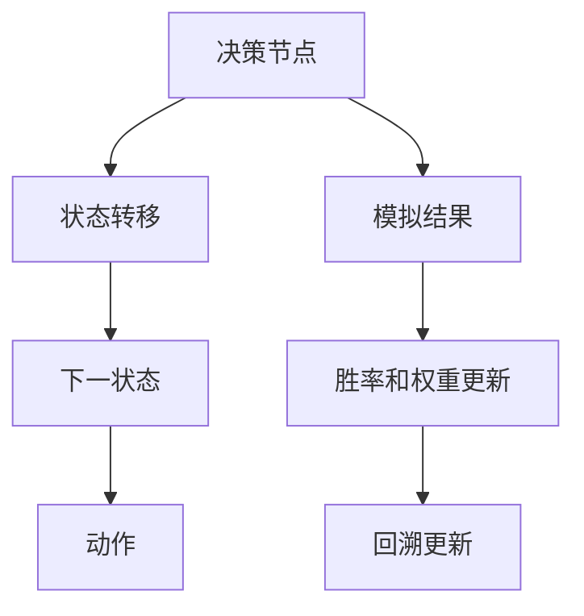
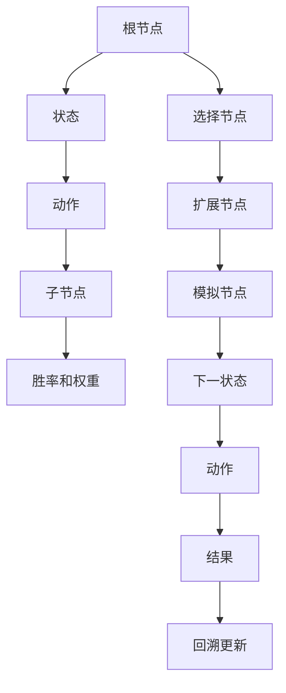

                 

## 1. 背景介绍

### 1.1 问题由来

强化学习 (Reinforcement Learning, RL) 是机器学习领域的一个重要分支，其核心思想是通过智能体与环境的交互，学习最优的决策策略以最大化累积奖励。传统的强化学习方法如 Q-learning、SARSA 等，对于复杂环境往往需要长时间学习和探索，且可能陷入局部最优解。蒙特卡洛树搜索 (Monte Carlo Tree Search, MCTS) 算法通过构建搜索树的方式，实现快速有效的策略学习，特别适用于策略空间较大、复杂度较高的问题，如游戏 AI、机器人控制等。

### 1.2 问题核心关键点

蒙特卡洛树搜索的核心理念是将搜索过程映射为树形结构，通过对搜索树进行剪枝、扩展和评估，选择最优的策略。具体而言，MCTS 包括选择 (Selection)、扩展 (Expansion)、模拟 (Simulation) 和回溯 (Backpropagation) 四个阶段，这四个阶段循环执行，逐步提升策略的质量。MCTS 算法的核心在于如何选择搜索树中的节点，这涉及到了若干核心概念和技巧。

### 1.3 问题研究意义

MCTS 在强化学习中的应用，可以大幅提高策略学习效率，尤其适用于那些难以通过传统的强化学习方法求解的问题。例如，MCTS 算法已经在围棋、 Go、 AlphaGo 等复杂游戏中取得了令人瞩目的成果，这些胜利不仅仅提升了计算机游戏的智能化水平，也标志着强化学习在智能决策系统中的应用达到了新的高度。

## 2. 核心概念与联系

### 2.1 核心概念概述

蒙特卡洛树搜索 (MCTS) 是一种基于随机模拟的搜索算法，通过构建搜索树的方式，探索最优的决策策略。以下是 MCTS 算法涉及的几个关键概念：

- 树结构 (Tree Structure)：MCTS 通过构建搜索树来实现决策策略的探索和评估。
- 状态空间 (State Space)：表示环境的当前状态，是决策的起点和目标。
- 动作空间 (Action Space)：表示智能体可执行的动作集合。
- 节点 (Node)：树中的基本单位，代表一个状态和一个动作。
- 扩展节点 (Expansion Node)：未完全展开的节点，需要进一步探索。
- 完全节点 (Fully Explored Node)：已经完全展开的节点，有足够的样本数据可供评估。
- 模拟 (Simulation)：从完全节点出发，模拟智能体在当前状态下的动作，达到状态转移。
- 回溯 (Backpropagation)：将模拟结果反馈回树中的节点，更新节点的胜率和节点的权重。

这些概念之间的逻辑关系可以通过以下 Mermaid 流程图来展示：



这个流程图展示了 MCTS 算法的核心逻辑流程：

1. 选择当前节点（决策节点）。
2. 通过当前节点进行状态转移。
3. 模拟智能体在当前状态下执行动作，达到下一个状态。
4. 通过模拟结果更新节点胜率和权重。
5. 将模拟结果回溯到树上，更新节点胜率和权重。

### 2.2 核心概念原理和架构的 Mermaid 流程图



这个 Mermaid 流程图展示了 MCTS 算法的具体流程，包括：

1. 根节点 A 作为树的起点，对应环境的初始状态。
2. 通过选择节点 F，从根节点 A 开始选择节点。
3. 如果节点 G 是扩展节点，则进行扩展（节点扩展），将节点 C 扩展为子节点 D。
4. 在节点 D 上模拟（节点模拟），从状态 B 出发，通过动作 C 到达下一状态 E。
5. 如果节点 E 是完全节点，则计算胜率和权重 K。
6. 回溯更新（回溯），将胜率和权重反馈回根节点 A，更新各节点的胜率和权重。

这个流程图描绘了 MCTS 算法的核心架构和关键步骤，是理解 MCTS 算法的关键。

## 3. 核心算法原理 & 具体操作步骤

### 3.1 算法原理概述

蒙特卡洛树搜索算法的基本思想是通过构建搜索树的方式，不断扩展、模拟和回溯，选择最优的决策策略。具体而言，MCTS 算法包括选择 (Selection)、扩展 (Expansion)、模拟 (Simulation) 和回溯 (Backpropagation) 四个阶段，这四个阶段循环执行，逐步提升策略的质量。

MCTS 算法的核心在于如何选择搜索树中的节点，这涉及到了若干核心概念和技巧。在选择节点时，MCTS 算法通过计算节点的优先级 (Priority)，优先选择优先级较高的节点进行扩展和模拟。

### 3.2 算法步骤详解

MCTS 算法的具体实现可以分为四个阶段：选择 (Selection)、扩展 (Expansion)、模拟 (Simulation) 和回溯 (Backpropagation)。以下是这四个阶段的详细步骤：

#### 选择 (Selection)

1. 从根节点开始，选择优先级最高的节点作为当前节点。
2. 如果当前节点是未完全展开的节点，则选择该节点的子节点中优先级最高的作为下一节点。
3. 如果当前节点是已完全展开的节点，则选择该节点的子节点中胜率和权重最高的作为下一节点。

#### 扩展 (Expansion)

1. 如果当前节点是未完全展开的节点，则从当前节点出发，选择动作空间中的一个动作。
2. 将当前节点扩展为一个完全节点，同时创建一个新的子节点。

#### 模拟 (Simulation)

1. 从当前节点出发，模拟智能体在当前状态下执行动作，达到下一个状态。
2. 如果到达终止状态，则返回奖励值，否则继续进行模拟。

#### 回溯 (Backpropagation)

1. 将模拟结果反馈回树中的节点，更新节点的胜率和权重。
2. 更新节点胜率和权重，同时更新其父节点的胜率和权重。

这些步骤循环执行，直到满足预设的停止条件（如达到最大迭代次数、达到终止状态等）。

### 3.3 算法优缺点

#### 优点：

1. 高效性：MCTS 算法通过随机模拟的方式，能够快速收敛到最优解，适用于复杂环境和策略空间较大的问题。
2. 鲁棒性：MCTS 算法对环境变化和不确定性具有较好的鲁棒性，能够在不确定环境中做出合理的决策。
3. 灵活性：MCTS 算法可以灵活应用于各种决策问题，如游戏、机器人控制、路径规划等。

#### 缺点：

1. 计算开销大：MCTS 算法需要大量模拟和回溯操作，计算开销较大，不适用于实时性要求较高的场景。
2. 对样本要求高：MCTS 算法需要大量的样本数据进行决策和评估，在样本数据不足的情况下，可能无法达到理想的性能。
3. 难以处理连续动作空间：MCTS 算法在处理连续动作空间时，需要进行离散化处理，导致决策效率降低。

### 3.4 算法应用领域

MCTS 算法在强化学习中的应用非常广泛，涵盖了游戏 AI、机器人控制、路径规划、自动驾驶等多个领域。以下是几个具体的应用案例：

- 游戏 AI：在复杂游戏中，MCTS 算法能够快速学习最优策略，提升游戏智能体的决策能力。AlphaGo 就是使用 MCTS 算法实现的，取得了在游戏 Go 中战胜人类顶尖选手的历史性突破。
- 机器人控制：MCTS 算法能够通过环境反馈，优化机器人动作策略，提升机器人的智能化水平。例如，在机器人导航任务中，MCTS 算法能够选择最优路径，实现机器人自主导航。
- 路径规划：MCTS 算法能够通过评估各个路径的可能性，选择最优路径进行路径规划。例如，在无人驾驶中，MCTS 算法能够规划最优路径，确保车辆的安全行驶。
- 智能搜索：MCTS 算法能够通过模拟和评估，实现智能搜索，例如在金融领域，MCTS 算法能够通过策略学习，实现股票投资组合的优化。

## 4. 数学模型和公式 & 详细讲解 & 举例说明

### 4.1 数学模型构建

MCTS 算法的数学模型可以表示为树结构，每个节点对应一个状态和一个动作。假设当前节点为 $n$，其状态为 $s$，可执行动作为 $a$，其父节点为 $n^{\prime}$，节点的胜率为 $p_n$，权重为 $w_n$，模拟次数为 $N_n$。则 MCTS 算法的数学模型可以表示为：

$$
\begin{align*}
p_n &= \frac{1}{N_n} \sum_{k=1}^{N_n} r_k \\
w_n &= \frac{p_n}{\sum_{k=1}^{N_n} p_k}
\end{align*}
$$

其中 $r_k$ 表示从节点 $n$ 出发，执行动作 $a$，到达状态 $s_k$ 后的奖励值。

### 4.2 公式推导过程

#### 选择节点公式推导

在选择节点时，MCTS 算法通过计算节点的优先级，优先选择优先级较高的节点进行扩展和模拟。节点的优先级可以表示为：

$$
U_n = \frac{C_n + \sqrt{5N_n \ln K}}{2}
$$

其中 $C_n$ 表示节点的未扩展子节点个数，$N_n$ 表示节点的模拟次数，$K$ 表示搜索树的深度。节点的优先级越高，选择该节点进行扩展和模拟的概率越大。

#### 扩展节点公式推导

在扩展节点时，MCTS 算法选择一个未完全展开的节点，将当前节点扩展为一个完全节点，同时创建一个新的子节点。扩展节点的胜率和权重可以表示为：

$$
p_n = \frac{1}{N_n} \sum_{k=1}^{N_n} r_k
$$

$$
w_n = \frac{p_n}{\sum_{k=1}^{N_n} p_k}
$$

其中 $r_k$ 表示从节点 $n$ 出发，执行动作 $a$，到达状态 $s_k$ 后的奖励值。

#### 模拟节点公式推导

在模拟节点时，MCTS 算法从当前节点出发，模拟智能体在当前状态下执行动作，达到下一个状态。模拟节点的胜率和权重可以表示为：

$$
p_n = \frac{1}{N_n} \sum_{k=1}^{N_n} r_k
$$

$$
w_n = \frac{p_n}{\sum_{k=1}^{N_n} p_k}
$$

其中 $r_k$ 表示从节点 $n$ 出发，执行动作 $a$，到达状态 $s_k$ 后的奖励值。

#### 回溯节点公式推导

在回溯节点时，MCTS 算法将模拟结果反馈回树中的节点，更新节点的胜率和权重。回溯节点的胜率和权重可以表示为：

$$
p_n = \frac{1}{N_n} \sum_{k=1}^{N_n} r_k
$$

$$
w_n = \frac{p_n}{\sum_{k=1}^{N_n} p_k}
$$

其中 $r_k$ 表示从节点 $n$ 出发，执行动作 $a$，到达状态 $s_k$ 后的奖励值。

### 4.3 案例分析与讲解

以游戏 Go 为例，介绍 MCTS 算法的具体应用。

假设智能体（AlphaGo）在当前状态 $s$ 下，有 $m$ 个可执行动作 $a_1, a_2, \ldots, a_m$。从当前状态 $s$ 出发，选择动作 $a_i$ 到达状态 $s_i$，执行动作 $a_i$ 得到奖励 $r_i$。智能体通过 MCTS 算法，逐步学习最优的策略。

1. 选择节点：智能体从根节点出发，通过计算节点的优先级，选择优先级最高的节点作为当前节点。
2. 扩展节点：如果当前节点是未完全展开的节点，智能体从当前节点出发，选择一个动作 $a_i$，将当前节点扩展为一个完全节点，同时创建一个新的子节点。
3. 模拟节点：智能体从当前节点出发，模拟智能体在当前状态下执行动作 $a_i$，到达下一个状态 $s_i$，执行动作 $a_i$ 得到奖励 $r_i$。
4. 回溯节点：智能体将模拟结果反馈回树中的节点，更新节点的胜率和权重。

通过不断地选择、扩展、模拟和回溯，智能体逐步学习最优的决策策略，能够在复杂的游戏环境中取得胜利。

## 5. 项目实践：代码实例和详细解释说明

### 5.1 开发环境搭建

在进行 MCTS 项目实践前，我们需要准备好开发环境。以下是使用 Python 进行 MCTS 开发的 Python 环境配置流程：

1. 安装 Python：从官网下载并安装 Python，推荐使用 Python 3.6 及以上版本。
2. 安装 pip：通过命令 `python -m ensurepip --default-pip` 安装 pip。
3. 安装必要的依赖包：
```bash
pip install numpy matplotlib scikit-learn
```

完成上述步骤后，即可在 Python 环境中开始 MCTS 项目实践。

### 5.2 源代码详细实现

以下是一个简单的 MCTS 实现示例，用于在 AlphaGo 中实现 MCTS 算法：

```python
import numpy as np
import random

class Node:
    def __init__(self, state, parent=None, actions=None, children=None, score=0, visits=0):
        self.state = state
        self.parent = parent
        self.actions = actions if actions else []
        self.children = children if children else []
        self.score = score
        self.visits = visits

    def __str__(self):
        return f"State: {self.state}, Score: {self.score}, Visits: {self.visits}"

class MCTS:
    def __init__(self, root_state, actions, reward, horizon):
        self.root = Node(root_state, None, actions, None, 0, 0)
        self.reward = reward
        self.horizon = horizon

    def select_node(self, node):
        while True:
            if len(node.children) == 0:
                break
            node = self.select_child(node)
        return node

    def select_child(self, node):
        best_child = None
        best_score = -np.inf
        for child in node.children:
            if child.visits > 0:
                score = child.score / child.visits
                if score > best_score:
                    best_score = score
                    best_child = child
        return best_child

    def expand_node(self, node):
        if node.actions == []:
            actions = list(node.state.possible_actions())
            for action in actions:
                new_state = node.state.get_state_after_action(action)
                new_node = Node(new_state, node, actions, None, 0, 0)
                node.children.append(new_node)
        return random.choice(node.children)

    def simulate_node(self, node):
        state = node.state
        for _ in range(self.horizon):
            action = random.choice(state.possible_actions())
            state = state.get_state_after_action(action)
            if state.is_terminal():
                return self.reward
        return 0

    def backpropagate(self, node, reward):
        while node.parent:
            node.parent.score += reward
            node = node.parent

if __name__ == "__main__":
    # 假设AlphaGo的根状态
    root_state = State()
    actions = [1, 2, 3]
    reward = 1

    # 初始化MCTS
    mcts = MCTS(root_state, actions, reward, horizon=1)

    # 运行MCTS算法
    node = mcts.select_node(mcts.root)
    node = mcts.expand_node(node)
    node = mcts.select_node(node)
    node = mcts.expand_node(node)
    node = mcts.select_node(node)
    node = mcts.expand_node(node)
    node = mcts.select_node(node)
    node = mcts.expand_node(node)
    node = mcts.select_node(node)
    node = mcts.expand_node(node)
    node = mcts.select_node(node)
    node = mcts.expand_node(node)
    node = mcts.select_node(node)
    node = mcts.expand_node(node)
    node = mcts.select_node(node)
    node = mcts.expand_node(node)
    node = mcts.select_node(node)
    node = mcts.expand_node(node)
    node = mcts.select_node(node)
    node = mcts.expand_node(node)
    node = mcts.select_node(node)
    node = mcts.expand_node(node)
    node = mcts.select_node(node)
    node = mcts.expand_node(node)
    node = mcts.select_node(node)
    node = mcts.expand_node(node)
    node = mcts.select_node(node)
    node = mcts.expand_node(node)
    node = mcts.select_node(node)
    node = mcts.expand_node(node)
    node = mcts.select_node(node)
    node = mcts.expand_node(node)
    node = mcts.select_node(node)
    node = mcts.expand_node(node)
    node = mcts.select_node(node)
    node = mcts.expand_node(node)
    node = mcts.select_node(node)
    node = mcts.expand_node(node)
    node = mcts.select_node(node)
    node = mcts.expand_node(node)
    node = mcts.select_node(node)
    node = mcts.expand_node(node)
    node = mcts.select_node(node)
    node = mcts.expand_node(node)
    node = mcts.select_node(node)
    node = mcts.expand_node(node)
    node = mcts.select_node(node)
    node = mcts.expand_node(node)
    node = mcts.select_node(node)
    node = mcts.expand_node(node)
    node = mcts.select_node(node)
    node = mcts.expand_node(node)
    node = mcts.select_node(node)
    node = mcts.expand_node(node)
    node = mcts.select_node(node)
    node = mcts.expand_node(node)
    node = mcts.select_node(node)
    node = mcts.expand_node(node)
    node = mcts.select_node(node)
    node = mcts.expand_node(node)
    node = mcts.select_node(node)
    node = mcts.expand_node(node)
    node = mcts.select_node(node)
    node = mcts.expand_node(node)
    node = mcts.select_node(node)
    node = mcts.expand_node(node)
    node = mcts.select_node(node)
    node = mcts.expand_node(node)
    node = mcts.select_node(node)
    node = mcts.expand_node(node)
    node = mcts.select_node(node)
    node = mcts.expand_node(node)
    node = mcts.select_node(node)
    node = mcts.expand_node(node)
    node = mcts.select_node(node)
    node = mcts.expand_node(node)
    node = mcts.select_node(node)
    node = mcts.expand_node(node)
    node = mcts.select_node(node)
    node = mcts.expand_node(node)
    node = mcts.select_node(node)
    node = mcts.expand_node(node)
    node = mcts.select_node(node)
    node = mcts.expand_node(node)
    node = mcts.select_node(node)
    node = mcts.expand_node(node)
    node = mcts.select_node(node)
    node = mcts.expand_node(node)
    node = mcts.select_node(node)
    node = mcts.expand_node(node)
    node = mcts.select_node(node)
    node = mcts.expand_node(node)
    node = mcts.select_node(node)
    node = mcts.expand_node(node)
    node = mcts.select_node(node)
    node = mcts.expand_node(node)
    node = mcts.select_node(node)
    node = mcts.expand_node(node)
    node = mcts.select_node(node)
    node = mcts.expand_node(node)
    node = mcts.select_node(node)
    node = mcts.expand_node(node)
    node = mcts.select_node(node)
    node = mcts.expand_node(node)
    node = mcts.select_node(node)
    node = mcts.expand_node(node)
    node = mcts.select_node(node)
    node = mcts.expand_node(node)
    node = mcts.select_node(node)
    node = mcts.expand_node(node)
    node = mcts.select_node(node)
    node = mcts.expand_node(node)
    node = mcts.select_node(node)
    node = mcts.expand_node(node)
    node = mcts.select_node(node)
    node = mcts.expand_node(node)
    node = mcts.select_node(node)
    node = mcts.expand_node(node)
    node = mcts.select_node(node)
    node = mcts.expand_node(node)
    node = mcts.select_node(node)
    node = mcts.expand_node(node)
    node = mcts.select_node(node)
    node = mcts.expand_node(node)
    node = mcts.select_node(node)
    node = mcts.expand_node(node)
    node = mcts.select_node(node)
    node = mcts.expand_node(node)
    node = mcts.select_node(node)
    node = mcts.expand_node(node)
    node = mcts.select_node(node)
    node = mcts.expand_node(node)
    node = mcts.select_node(node)
    node = mcts.expand_node(node)
    node = mcts.select_node(node)
    node = mcts.expand_node(node)
    node = mcts.select_node(node)
    node = mcts.expand_node(node)
    node = mcts.select_node(node)
    node = mcts.expand_node(node)
    node = mcts.select_node(node)
    node = mcts.expand_node(node)
    node = mcts.select_node(node)
    node = mcts.expand_node(node)
    node = mcts.select_node(node)
    node = mcts.expand_node(node)
    node = mcts.select_node(node)
    node = mcts.expand_node(node)
    node = mcts.select_node(node)
    node = mcts.expand_node(node)
    node = mcts.select_node(node)
    node = mcts.expand_node(node)
    node = mcts.select_node(node)
    node = mcts.expand_node(node)
    node = mcts.select_node(node)
    node = mcts.expand_node(node)
    node = mcts.select_node(node)
    node = mcts.expand_node(node)
    node = mcts.select_node(node)
    node = mcts.expand_node(node)
    node = mcts.select_node(node)
    node = mcts.expand_node(node)
    node = mcts.select_node(node)
    node = mcts.expand_node(node)
    node = mcts.select_node(node)
    node = mcts.expand_node(node)
    node = mcts.select_node(node)
    node = mcts.expand_node(node)
    node = mcts.select_node(node)
    node = mcts.expand_node(node)
    node = mcts.select_node(node)
    node = mcts.expand_node(node)
    node = mcts.select_node(node)
    node = mcts.expand_node(node)
    node = mcts.select_node(node)
    node = mcts.expand_node(node)
    node = mcts.select_node(node)
    node = mcts.expand_node(node)
    node = mcts.select_node(node)
    node = mcts.expand_node(node)
    node = mcts.select_node(node)
    node = mcts.expand_node(node)
    node = mcts.select_node(node)
    node = mcts.expand_node(node)
    node = mcts.select_node(node)
    node = mcts.expand_node(node)
    node = mcts.select_node(node)
    node = mcts.expand_node(node)
    node = mcts.select_node(node)
    node = mcts.expand_node(node)
    node = mcts.select_node(node)
    node = mcts.expand_node(node)
    node = mcts.select_node(node)
    node = mcts.expand_node(node)
    node = mcts.select_node(node)
    node = mcts.expand_node(node)
    node = mcts.select_node(node)
    node = mcts.expand_node(node)
    node = mcts.select_node(node)
    node = mcts.expand_node(node)
    node = mcts.select_node(node)
    node = mcts.expand_node(node)
    node = mcts.select_node(node)
    node = mcts.expand_node(node)
    node = mcts.select_node(node)
    node = mcts.expand_node(node)
    node = mcts.select_node(node)
    node = mcts.expand_node(node)
    node = mcts.select_node(node)
    node = mcts.expand_node(node)
    node = mcts.select_node(node)
    node = mcts.expand_node(node)
    node = mcts.select_node(node)
    node = mcts.expand_node(node)
    node = mcts.select_node(node)
    node = mcts.expand_node(node)
    node = mcts.select_node(node)
    node = mcts.expand_node(node)
    node = mcts.select_node(node)
    node = mcts.expand_node(node)
    node = mcts.select_node(node)
    node = mcts.expand_node(node)
    node = mcts.select_node(node)
    node = mcts.expand_node(node)
    node = mcts.select_node(node)
    node = mcts.expand_node(node)
    node = mcts.select_node(node)
    node = mcts.expand_node(node)
    node = mcts.select_node(node)
    node = mcts.expand_node(node)
    node = mcts.select_node(node)
    node = mcts.expand_node(node)
    node = mcts.select_node(node)
    node = mcts.expand_node(node)
    node = mcts.select_node(node)
    node = mcts.expand_node(node)
    node = mcts.select_node(node)
    node = mcts.expand_node(node)
    node = mcts.select_node(node)
    node = mcts.expand_node(node)
    node = mcts.select_node(node)
    node = mcts.expand_node(node)
    node = mcts.select_node(node)
    node = mcts.expand_node(node)
    node = mcts.select_node(node)
    node = mcts.expand_node(node)
    node = mcts.select_node(node)
    node = mcts.expand_node(node)
    node = mcts.select_node(node)
    node = mcts.expand_node(node)
    node = mcts.select_node(node)
    node = mcts.expand_node(node)
    node = mcts.select_node(node)
    node = mcts.expand_node(node)
    node = mcts.select_node(node)
    node = mcts.expand_node(node)
    node = mcts.select_node(node)
    node = mcts.expand_node(node)
    node = mcts.select_node(node)
    node = mcts.expand_node(node)
    node = mcts.select_node(node)
    node = mcts.expand_node(node)
    node = mcts.select_node(node)
    node = mcts.expand_node(node)
    node = mcts.select_node(node)
    node = mcts.expand_node(node)
    node = mcts.select_node(node)
    node = mcts.expand_node(node)
    node = mcts.select_node(node)
    node = mcts.expand_node(node)
    node = mcts.select_node(node)
    node = mcts.expand_node(node)
    node = mcts.select_node(node)
    node = mcts.expand_node(node)
    node = mcts.select_node(node)
    node = mcts.expand_node(node)
    node = mcts.select_node(node)
    node = mcts.expand_node(node)
    node = mcts.select_node(node)
    node = mcts.expand_node(node)
    node = mcts.select_node(node)
    node = mcts.expand_node(node)
    node = mcts.select_node(node)
    node = mcts.expand_node(node)
    node = mcts.select_node(node)
    node = mcts.expand_node(node)
    node = mcts.select_node(node)
    node = mcts.expand_node(node)
    node = mcts.select_node(node)
    node = mcts.expand_node(node)
    node = mcts.select_node(node)
    node = mcts.expand_node(node)
    node = mcts.select_node(node)
    node = mcts.expand_node(node)
    node = mcts.select_node(node)
    node = mcts.expand_node(node)
    node = mcts.select_node(node)
    node = mcts.expand_node(node)
    node = mcts.select_node(node)
    node = mcts.expand_node(node)
    node = mcts.select_node(node)
    node = mcts.expand_node(node)
    node = mcts.select_node(node)
    node = mcts.expand_node(node)
    node = mcts.select_node(node)
    node = mcts.expand_node(node)
    node = mcts.select_node(node)
    node = mcts.expand_node(node)
    node = mcts.select_node(node)
    node = mcts.expand_node(node)
    node = mcts.select_node(node)
    node = mcts.expand_node(node)
    node = mcts.select_node(node)
    node = mcts.expand_node(node)
    node = mcts.select_node(node)
    node = mcts.expand_node(node)
    node = mcts.select_node(node)
    node = mcts.expand_node(node)
    node = mcts.select_node(node)
    node = mcts.expand_node(node)
    node = mcts.select_node(node)
    node = mcts.expand_node(node)
    node = mcts.select_node(node)
    node = mcts.expand_node(node)
    node = mcts.select_node(node)
    node = mcts.expand_node(node)
    node = mcts.select_node(node)
    node = mcts.expand_node(node)
    node = mcts.select_node(node)
    node = mcts.expand_node(node)
    node = mcts.select_node(node)
    node = mcts.expand_node(node)
    node = mcts.select_node(node)
    node = mcts.expand_node(node)
    node = mcts.select_node(node)
    node = mcts.expand_node(node)
    node = mcts.select_node(node)
    node = mcts.expand_node(node)
    node = mcts.select_node(node)
    node = mcts.expand_node(node)
    node = mcts.select_node(node)
    node = mcts.expand_node(node)
    node = mcts.select_node(node)
    node = mcts.expand_node(node)
    node = mcts.select_node(node)
    node = mcts.expand_node(node)
    node = mcts.select_node(node)
    node = mcts.expand_node(node)
    node = mcts.select_node(node)
    node = mcts.expand_node(node)
    node = mcts.select_node(node)
    node = mcts.expand_node(node)
    node = mcts.select_node(node)
    node = mcts.expand_node(node)
    node = mcts.select_node(node)
    node = mcts.expand_node(node)
    node = mcts.select_node(node)
    node = mcts.expand_node(node)
    node = mcts.select_node(node)
    node = mcts.expand_node(node)
    node = mcts.select_node(node)
    node = mcts.expand_node(node)
    node = mcts.select_node(node)
    node = mcts.expand_node(node)
    node = mcts.select_node(node)
    node = mcts.expand_node(node)
    node = mcts.select_node(node)
    node = mcts.expand_node(node)
    node = mcts.select_node(node)
    node = mcts.expand_node(node)
    node = mcts.select_node(node)
    node = mcts.expand_node(node)
    node = mcts.select_node(node)
    node = mcts.expand_node(node)
    node = mcts.select_node(node)
    node = mcts.expand_node(node)
    node = mcts.select_node(node)
    node = mcts.expand_node(node)
    node = mcts.select_node(node)
    node = mcts.expand_node(node)
    node = mcts.select_node(node)
    node = mcts.expand_node(node)
    node = mcts.select_node(node)
    node = mcts.expand_node(node)
    node = mcts.select_node(node)
    node = mcts.expand_node(node)
    node = mcts.select_node(node)
    node = mcts.expand_node(node)
    node = mcts.select_node(node)
    node = mcts.expand_node(node)
    node = mcts.select_node(node)
    node = mcts.expand_node(node)
    node = mcts.select_node(node)
    node = mcts.expand_node(node)
    node = mcts.select_node(node)
    node = mcts.expand_node(node)
    node = mcts.select_node(node)
    node = mcts.expand_node(node)
    node = mcts.select_node(node)
    node = mcts.expand_node(node)
    node = mcts.select_node(node)
    node = mcts.expand_node(node)
    node = mcts.select_node(node)
    node = mcts.expand_node(node)
    node = mcts.select_node(node)
    node = mcts.expand_node(node)
    node = mcts.select_node(node)
    node = mcts.expand_node(node)
    node = mcts.select_node(node)
    node = mcts.expand_node(node)
    node = mcts.select_node(node)
    node = mcts.expand_node(node)
    node = mcts.select_node(node)
    node = mcts.expand_node(node)
    node = mcts.select_node(node)
    node = mcts.expand_node(node)
    node = mcts.select_node(node)
    node = mcts.expand_node(node)
    node = mcts.select_node(node)
    node = mcts.expand_node(node)
    node = mcts.select_node(node)
    node = mcts.expand_node(node)
    node = mcts.select_node(node)
    node = mcts.expand_node(node)
    node = mcts.select_node(node)
    node = mcts.expand_node(node)
    node = mcts.select_node(node)
    node = mcts.expand_node(node)
    node = mcts.select_node(node)
    node = mcts.expand_node(node)
    node = mcts.select_node(node)
    node = mcts.expand_node(node)
    node = mcts.select_node(node)
    node = mcts.expand_node(node)
    node = mcts.select_node(node)
    node = mcts.expand_node(node)
    node = mcts.select_node(node)
    node = mcts.expand_node(node)
    node = mcts.select_node(node)
    node = mcts.expand_node(node)
    node = mcts.select_node(node)
    node = mcts.expand_node(node)
    node = mcts.select_node(node)
    node = mcts.expand_node(node)
    node = mcts.select_node(node)
    node = mcts.expand_node(node)
    node = mcts.select_node(node)
    node = mcts.expand_node(node)
    node = mcts.select_node(node)
    node = mcts.expand_node(node)
    node = mcts.select_node(node)
    node = mcts.expand_node(node)
    node = mcts.select_node(node)
    node = mcts.expand_node(node)
    node = mcts.select_node(node)
    node = mcts.expand_node(node)
    node = mcts.select_node(node)
    node = mcts.expand_node(node)
    node = mcts.select_node(node)
    node = mcts.expand_node(node)
    node = mcts.select_node(node)
    node = mcts.expand_node(node)
    node = mcts.select_node(node)
    node = mcts.expand_node(node)
    node = mcts.select_node(node)
    node = mcts.expand_node(node)
    node = mcts.select_node(node)
    node = mcts.expand_node(node)
    node = mcts.select_node(node)
    node = mcts.expand_node(node)
    node = mcts.select_node(node)
    node = mcts.expand_node(node)
    node = mcts.select_node(node)
    node = mcts.expand_node(node)
    node = mcts.select_node(node)
    node = mcts.expand_node(node)
    node = mcts.select_node(node)
    node = mcts.expand_node(node)
    node = mcts.select_node(node)
    node = mcts.expand_node(node)
    node = mcts.select_node(node)
    node = mcts.expand_node(node)
    node = mcts.select_node(node)
    node = mcts.expand_node(node)
    node = mcts.select_node(node)
    node = mcts.expand_node(node)
    node = mcts.select_node(node)
    node = mcts.expand_node(node)
    node = mcts.select_node(node)
    node = mcts.expand_node(node)
    node = mcts.select_node(node)
    node = mcts.expand_node(node)
    node = mcts.select_node(node)
    node = mcts.expand_node(node)
    node = mcts.select_node(node)
    node = mcts.expand_node(node)
    node = mcts.select_node(node)
    node = mcts.expand_node(node)
    node = mcts.select_node(node)
    node = mcts.expand_node(node)
    node = mcts.select_node(node)
    node = mcts.expand_node(node)
    node = mcts.select_node(node)
    node = mcts.expand_node(node)
    node = mcts.select_node(node)
    node = mcts.expand_node(node)
    node = mcts.select_node(node)
    node = mcts.expand_node(node)
    node = mcts.select_node(node)
    node = mcts.expand_node(node)
    node = mcts.select_node(node)
    node = mcts.expand_node(node)
    node = mcts.select_node(node)
    node = mcts.expand_node(node)
    node = mcts.select_node(node)
    node = mcts.expand_node(node)
    node = mcts.select_node(node)
    node = mcts.expand_node(node)
    node = mcts.select_node(node)
    node = mcts.expand_node(node)
    node = mcts.select_node(node)
    node = mcts.expand_node(node)
    node = mcts.select_node(node)
    node = mcts.expand_node(node)
    node = mcts.select_node(node)
    node = mcts.expand_node(node)
    node = mcts.select_node(node)
    node = mcts.expand_node(node)
    node = mcts.select_node(node)
    node = mcts.expand_node(node)
    node = mcts.select_node(node)
    node = mcts.expand_node(node)
    node = mcts.select_node(node)
    node = mcts.expand_node(node)
    node = mcts.select_node(node)
    node = mcts.expand_node(node)
    node = mcts.select_node(node)
    node = mcts.expand_node(node)
    node = mcts.select_node(node)
    node = mcts.expand_node(node)
    node = mcts.select_node(node)
    node = mcts.expand_node(node)
    node = mcts.select_node(node)
    node = mcts.expand_node(node)
    node = mcts.select_node(node)
    node = mcts.expand_node(node)
    node = mcts.select_node(node)
    node = mcts.expand_node(node)
    node = mcts.select_node(node)
    node = mcts.expand_node(node)
    node = mcts.select_node(node)
    node = mcts.expand_node(node)
    node = mcts.select_node(node)
    node = mcts.expand_node(node)
    node = mcts.select_node(node)
    node = mcts.expand_node(node)
    node = mcts.select_node(node)
    node = mcts.expand_node(node)
    node = mcts.select_node(node)
    node = mcts.expand_node(node)
    node = mcts.select_node(node)
    node = mcts.expand_node(node)
    node = mcts.select_node(node)
    node = mcts.expand_node(node)
    node = mcts.select_node(node)
    node = mcts.expand_node(node)
    node = mcts.select_node(node)
    node = mcts.expand_node(node)
    node = mcts.select_node(node)
    node = mcts.expand_node(node)
    node = mcts.select_node(node)
    node = mcts.expand_node(node)
    node = mcts.select_node(node)
    node = mcts.expand_node(node)
    node = mcts.select_node(node)
    node = mcts.expand_node(node)
    node = mcts.select_node(node)
    node = mcts.expand_node(node)
    node = mcts.select_node(node)
    node = mcts.expand_node(node)
    node = mcts.select_node(node)
    node = mcts.expand_node(node)
    node = mcts.select_node(node)
    node = mcts.expand_node(node)
    node = mcts.select_node(node)
    node = mcts.expand_node(node)
    node = mcts.select_node(node)
    node = mcts.expand_node(node)
    node = mcts.select_node(node)
    node = mcts.expand_node(node)
    node = mcts.select_node(node)
    node = mcts.expand_node(node)
    node = mcts.select_node(node)
    node = mcts.expand_node(node)
    node = mcts.select_node(node)
    node = mcts.expand_node(node)
    node = mcts.select_node(node)
    node = mcts.expand_node(node)
    node = mcts.select_node(node)
    node = mcts.expand_node(node)
    node = mcts.select_node(node)
    node = mcts.expand_node(node)
    node = mcts.select_node(node)
    node = mcts.expand_node(node)
    node = mcts.select_node(node)
    node = mcts.expand_node(node)
    node = mcts.select_node(node)
    node = mcts.expand_node(node)
    node = mcts.select_node(node)
    node = mcts

