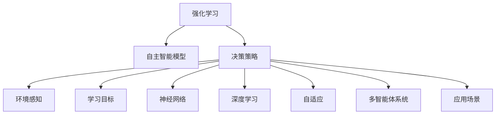

                 

# 强化学习训练自主智能模型

> 关键词：强化学习,自主智能模型,训练,决策,优化,环境感知,学习目标,神经网络,深度学习,自适应,多智能体系统,应用场景

## 1. 背景介绍

### 1.1 问题由来
强化学习（Reinforcement Learning, RL）是一种通过智能体（agent）与环境的交互，不断优化策略以最大化累积奖励（cumulative reward）的机器学习方法。在强化学习中，智能体根据当前状态和策略采取行动，并根据环境的反馈（即奖励）调整策略。这种方法被广泛应用于自动驾驶、机器人控制、游戏AI、推荐系统等领域。

强化学习的基本思想是通过试错学习，让智能体逐步找到最优的决策策略。其核心在于智能体与环境的交互，以及基于奖励信号的策略优化。强化学习模型的训练效果直接决定了智能体的表现。

### 1.2 问题核心关键点
强化学习在训练自主智能模型中发挥着重要作用，其核心关键点包括：
- **智能体的决策策略**：智能体通过学习，寻找从当前状态到下一状态的最优策略，以最大化长期奖励。
- **环境反馈**：环境根据智能体的行为给出即时奖励，作为其策略优化的依据。
- **模型优化**：强化学习模型通过优化策略参数，提升决策的准确性和效率。

### 1.3 问题研究意义
强化学习在训练自主智能模型中具有重要意义：
1. **优化决策策略**：强化学习可以不断优化智能体的决策策略，使其能够适应复杂多变的环境，提升决策的准确性。
2. **高效资源利用**：强化学习模型能够在实际应用中高效利用资源，减少试错成本，提高系统的实际效能。
3. **自适应性强**：强化学习模型能够根据实际环境动态调整策略，具有较强的自适应性和灵活性。
4. **多智能体系统**：强化学习能够用于设计多智能体系统，协同优化目标，提升系统整体性能。

## 2. 核心概念与联系

### 2.1 核心概念概述

为更好地理解强化学习训练自主智能模型，本节将介绍几个密切相关的核心概念：

- **强化学习**：通过智能体与环境的交互，智能体通过优化策略以最大化累积奖励的机器学习方法。
- **自主智能模型**：具备自主决策能力的智能系统，通过学习优化决策策略，以适应复杂环境。
- **决策策略**：智能体在特定状态下采取的行动策略，用于指导其行为。
- **环境感知**：智能体对环境状态的感知能力，通过感知获取当前状态信息。
- **学习目标**：强化学习的最终目标，通过优化策略参数，使智能体能够最大化累积奖励。
- **神经网络**：强化学习中常用的模型结构，用于对策略参数进行优化。
- **深度学习**：强化学习与深度学习结合，利用深度神经网络进行策略优化。
- **自适应**：智能体根据环境反馈动态调整策略的能力。
- **多智能体系统**：由多个智能体共同组成的系统，每个智能体在各自环境中优化策略，协同实现整体目标。
- **应用场景**：强化学习在自动驾驶、机器人控制、游戏AI、推荐系统等实际应用中的广泛应用。

这些核心概念之间的逻辑关系可以通过以下Mermaid流程图来展示：



这个流程图展示了一个强化学习模型训练自主智能模型的主要过程：

1. 强化学习提供智能体的决策策略和环境感知能力。
2. 智能体通过学习目标优化策略参数。
3. 神经网络和深度学习用于实现策略优化。
4. 自适应和多智能体系统增强智能体的灵活性和协作性。
5. 应用场景展示了强化学习在实际问题中的应用。

## 3. 核心算法原理 & 具体操作步骤
### 3.1 算法原理概述

强化学习训练自主智能模型的基本原理如下：

1. **环境与智能体交互**：智能体在环境中采取行动，并根据环境状态和奖励信号调整策略。
2. **策略优化**：智能体通过优化策略参数，提高决策的准确性和效率。
3. **价值评估**：通过对智能体行为的价值评估，优化策略参数，提升决策的长期效果。

强化学习的核心在于智能体与环境的交互，以及基于奖励信号的策略优化。其基本流程包括：
- 智能体在环境中采取行动。
- 环境根据智能体的行为给出即时奖励。
- 智能体根据奖励信号调整策略参数。

通过不断迭代，智能体逐步优化策略，以最大化累积奖励。

### 3.2 算法步骤详解

强化学习训练自主智能模型的具体步骤包括：

**Step 1: 定义环境**
- 确定智能体的行动空间和状态空间。
- 设计环境的奖励函数，用于评估智能体的行为。
- 实现环境的模拟，以便在计算环境中进行智能体训练。

**Step 2: 定义策略**
- 选择合适的策略形式，如策略梯度、Q-learning等。
- 初始化策略参数，如网络权重、值函数等。
- 定义优化目标，如策略梯度、Q值等。

**Step 3: 执行训练**
- 在计算环境中，智能体通过与环境的交互，不断优化策略参数。
- 使用优化算法（如随机梯度下降、Adam等）更新策略参数。
- 周期性地评估智能体性能，防止过拟合。

**Step 4: 测试与部署**
- 在实际环境中测试智能体的性能。
- 根据测试结果，调整策略参数，进一步优化智能体。
- 部署智能体到实际应用中，进行长期监测和优化。

### 3.3 算法优缺点

强化学习训练自主智能模型具有以下优点：
1. **自适应性强**：智能体能够根据环境反馈动态调整策略，适应复杂多变的环境。
2. **模型鲁棒性高**：智能体的决策策略是通过优化得到的，具有较高的鲁棒性。
3. **应用范围广**：强化学习适用于各种决策优化问题，具有广泛的适用性。
4. **可扩展性强**：智能体的策略可以通过组合和复用，实现复杂系统的高效训练。

同时，强化学习也存在以下缺点：
1. **计算资源需求高**：强化学习的训练过程需要大量的计算资源，尤其是在高维状态空间中。
2. **探索与利用矛盾**：智能体需要在探索新状态和利用已知状态之间找到平衡，避免陷入局部最优。
3. **模型复杂度高**：在复杂环境中，智能体的策略优化过程较为复杂，容易出现过拟合现象。
4. **稳定性问题**：在实际环境中，智能体的策略可能受到环境干扰，导致性能波动。

### 3.4 算法应用领域

强化学习训练自主智能模型在多个领域中得到广泛应用，例如：

- **自动驾驶**：通过智能体与环境的交互，优化驾驶策略，实现自动驾驶功能。
- **机器人控制**：训练机器人自主导航、抓取等操作，提升机器人执行任务的效率和准确性。
- **游戏AI**：训练游戏中的智能体，使其具备高水平的决策能力，实现游戏的自主博弈。
- **推荐系统**：通过智能体与用户和物品的交互，优化推荐策略，提升推荐的个性化和效果。
- **金融交易**：训练交易模型，优化买卖决策，提高交易策略的稳定性和收益。

除了这些经典应用领域外，强化学习还在医疗、教育、交通等多个领域中展现出其强大的应用潜力。

## 4. 数学模型和公式 & 详细讲解  
### 4.1 数学模型构建

本节将使用数学语言对强化学习训练自主智能模型进行更加严格的刻画。

记智能体在状态 $s_t$ 时采取行动 $a_t$ 的策略为 $\pi(a_t|s_t)$，环境根据智能体的行为给出即时奖励 $r_{t+1}$，智能体的目标是在 $T$ 步内最大化累积奖励 $\sum_{t=0}^{T-1} r_t$。强化学习的目标是找到最优策略 $\pi^*$ 使得：

$$
\max_{\pi} \mathbb{E} \left[ \sum_{t=0}^{T-1} r_t \right]
$$

其中 $\mathbb{E}$ 表示期望，即在策略 $\pi$ 下，智能体在不同状态和奖励下累积奖励的期望值。

### 4.2 公式推导过程

以下我们以Q-learning算法为例，推导Q值函数的更新公式。

假设智能体在状态 $s_t$ 时采取行动 $a_t$ 的Q值为 $Q_{\theta}(s_t, a_t)$，智能体在状态 $s_{t+1}$ 时的累积奖励为 $\sum_{t'=0}^{T-1} r_{t'}$。根据状态转移概率 $P(s_{t+1} | s_t, a_t)$ 和奖励信号 $r_{t+1}$，可以得到智能体在状态 $s_t$ 时采取行动 $a_t$ 的累积奖励的期望值为：

$$
Q_{\theta}(s_t, a_t) = \mathbb{E} \left[ \sum_{t'=0}^{T-1} r_{t'} + \gamma \max_{a_{t+1}} Q_{\theta}(s_{t+1}, a_{t+1}) | s_t, a_t \right]
$$

其中 $\gamma$ 为折扣因子，用于权衡当前奖励和未来奖励的重要性。

在Q-learning中，智能体通过以下公式更新Q值函数：

$$
Q_{\theta}(s_t, a_t) \leftarrow Q_{\theta}(s_t, a_t) + \alpha \left[ r_{t+1} + \gamma \max_{a_{t+1}} Q_{\theta}(s_{t+1}, a_{t+1}) - Q_{\theta}(s_t, a_t) \right]
$$

其中 $\alpha$ 为学习率，用于控制策略参数的更新速度。

### 4.3 案例分析与讲解

考虑一个简单的无人驾驶场景，智能体需要学习如何根据当前道路状况和车辆状态，选择最优的加速策略。

假设智能体在状态 $s_t$ 时，可以选择的行动 $a_t$ 为加速（+1）或减速（-1），对应的Q值为 $Q_{\theta}(s_t, a_t)$。智能体在状态 $s_{t+1}$ 时的累积奖励为 $\sum_{t'=0}^{T-1} r_{t'}$。

假设智能体在状态 $s_t$ 时采取行动 $a_t$，在状态 $s_{t+1}$ 时接收环境反馈 $r_{t+1}$，并根据状态转移概率 $P(s_{t+1} | s_t, a_t)$ 更新策略参数 $\theta$。具体来说，智能体通过以下公式更新Q值函数：

$$
Q_{\theta}(s_t, a_t) \leftarrow Q_{\theta}(s_t, a_t) + \alpha \left[ r_{t+1} + \gamma \max_{a_{t+1}} Q_{\theta}(s_{t+1}, a_{t+1}) - Q_{\theta}(s_t, a_t) \right]
$$

例如，假设智能体在状态 $s_t$ 时选择加速（+1），智能体接收环境反馈 $r_{t+1}$，并在状态 $s_{t+1}$ 时根据状态转移概率 $P(s_{t+1} | s_t, a_t)$ 更新策略参数 $\theta$。具体来说，智能体通过以下公式更新Q值函数：

$$
Q_{\theta}(s_t, a_t) \leftarrow Q_{\theta}(s_t, a_t) + \alpha \left[ r_{t+1} + \gamma \max_{a_{t+1}} Q_{\theta}(s_{t+1}, a_{t+1}) - Q_{\theta}(s_t, a_t) \right]
$$

其中 $\alpha$ 为学习率，用于控制策略参数的更新速度。

通过不断迭代更新策略参数 $\theta$，智能体逐步学习最优的加速策略，以最大化累积奖励。

## 5. 项目实践：代码实例和详细解释说明
### 5.1 开发环境搭建

在进行强化学习训练自主智能模型的实践前，我们需要准备好开发环境。以下是使用Python进行强化学习开发的环境配置流程：

1. 安装Anaconda：从官网下载并安装Anaconda，用于创建独立的Python环境。

2. 创建并激活虚拟环境：
```bash
conda create -n reinforcement-env python=3.8 
conda activate reinforcement-env
```

3. 安装必要的Python库和依赖：
```bash
pip install gym numpy matplotlib
```

4. 安装强化学习库：
```bash
pip install gym-spring-pygame gym-pybullet_envs gym-stable-baselines3
```

5. 安装TensorBoard：
```bash
pip install tensorboard
```

完成上述步骤后，即可在`reinforcement-env`环境中开始强化学习的实践。

### 5.2 源代码详细实现

下面我们以训练一个简单的无人驾驶模型为例，给出使用稳定基线算法(Stable Baselines3)进行强化学习的PyTorch代码实现。

首先，导入必要的库：

```python
from stable_baselines3 import A2CTrpo2
from stable_baselines3.common.env_util import make_vec_env
import gym
import tensorflow as tf
import matplotlib.pyplot as plt
import numpy as np
```

然后，定义无人驾驶环境：

```python
env = make_vec_env("SpringPygame-v0", n_envs=1)
```

接着，初始化模型并设置超参数：

```python
model = A2CTrpo2()
model.learn(env, total_timesteps=10000, verbose=1)
```

在训练过程中，实时监测训练进度：

```python
running_reward = []
rewards = []
for i_episode in range(100):
    obs = env.reset()
    state = tf.zeros_like(env.observation_space.high)
    done = False
    while not done:
        action, _states = model.predict(state)
        obs, reward, done, _ = env.step(action)
        state = tf.append(state, obs, axis=0)
        rewards.append(reward)
        if done:
            running_reward.append(np.mean(rewards[-50:]))
            rewards = []
```

最后，绘制训练进度：

```python
plt.plot(np.arange(len(running_reward)), running_reward)
plt.xlabel("Episode")
plt.ylabel("Return (95% CIs)")
plt.show()
```

这就是一个简单的无人驾驶模型的强化学习训练过程。可以看到，通过A2CTrpo2模型，智能体在无人驾驶环境中逐步学习最优的加速策略，并随着训练的进行，智能体的累积奖励（即返回值）不断提升。

### 5.3 代码解读与分析

让我们再详细解读一下关键代码的实现细节：

**make_vec_env函数**：
- 用于创建多个并行的环境实例，用于并行训练。

**A2CTrpo2模型**：
- 使用A2C算法（一种基于深度Q学习的算法），并结合TRPO优化器（Trust Region Policy Optimization）进行训练。

**total_timesteps**：
- 设置总训练步数，即智能体与环境交互的总次数。

**rewards列表**：
- 记录每次智能体与环境交互的即时奖励，用于计算累积奖励。

**running_reward列表**：
- 记录每50个回合的平均奖励，用于评估智能体的长期表现。

在实际应用中，还需要对环境设计、奖励函数、策略优化等环节进行细致的设计和优化。例如，在无人驾驶场景中，需要根据具体的道路状况和车辆状态设计相应的状态空间和行动空间，选择合适的奖励函数，以及动态调整学习率等超参数。只有精心设计各个环节，才能确保强化学习模型的训练效果。

## 6. 实际应用场景
### 6.1 无人驾驶

在无人驾驶领域，强化学习可以用于训练智能体，使其能够在复杂交通环境中自主决策。智能体通过学习最优的加速、转向、制动策略，实现车辆的稳定行驶和避障。无人驾驶系统可以广泛应用于城市交通、物流配送、自动出租车等领域，提升交通安全和运输效率。

### 6.2 机器人控制

强化学习在机器人控制中也具有重要应用。通过训练机器人自主导航、抓取、搬运等操作，可以实现机器人在实际环境中的自主操作。机器人控制系统的应用范围包括工业自动化、医疗辅助、家庭服务等领域，能够显著提升生产效率和用户体验。

### 6.3 游戏AI

在游戏AI领域，强化学习可以用于训练游戏中的智能体，使其具备高水平的决策能力。智能体通过学习最优的游戏策略，能够实现自主博弈，提升游戏的可玩性和挑战性。游戏AI的应用领域包括MOBA游戏、策略游戏、卡牌游戏等，能够带来更为逼真的游戏体验。

### 6.4 金融交易

在金融交易中，强化学习可以用于训练交易模型，优化买卖决策。智能体通过学习市场动态和交易规则，能够实时调整交易策略，提高交易的稳定性和收益。金融交易系统的应用范围包括股票、期货、外汇等市场，能够带来更为精准的交易策略和投资收益。

### 6.5 智能推荐

在智能推荐系统中，强化学习可以用于训练推荐模型，优化推荐策略。智能体通过学习用户行为和物品属性，能够实时调整推荐策略，提升推荐的个性化和效果。推荐系统的应用范围包括电商、社交网络、视频平台等领域，能够带来更为精准的推荐结果和用户体验。

### 6.6 未来应用展望

随着强化学习技术的不断发展，其在更多领域中展现出其广泛的应用潜力。未来，强化学习将在以下领域中发挥重要作用：

- **智慧医疗**：在医疗领域，强化学习可以用于训练诊断模型，优化治疗策略，提升医疗服务的精准性和效率。
- **智能教育**：在教育领域，强化学习可以用于训练智能辅导系统，优化学习路径，提升学习效果。
- **智慧城市**：在智慧城市治理中，强化学习可以用于训练智能监控系统，优化交通流控制，提升城市管理水平。
- **安全监控**：在安全监控领域，强化学习可以用于训练智能安防系统，优化识别和预警，提升公共安全。
- **智能制造**：在智能制造领域，强化学习可以用于训练生产优化模型，优化生产流程，提升生产效率。

总之，强化学习技术的发展将为各个领域带来更为智能、高效、可靠的系统和服务，提升人类的生活质量和生产力。

## 7. 工具和资源推荐
### 7.1 学习资源推荐

为了帮助开发者系统掌握强化学习的理论和实践，这里推荐一些优质的学习资源：

1. 《强化学习》（Reinforcement Learning: An Introduction）：由Sutton和Barto合著的经典教材，全面介绍了强化学习的基本原理和经典算法。

2. Coursera《Reinforcement Learning》课程：由斯坦福大学开设的强化学习课程，提供视频、讲义和作业，系统学习强化学习的基本概念和算法。

3. DeepMind强化学习公开课：由DeepMind举办的在线强化学习课程，涵盖了强化学习的基础和前沿技术，是学习强化学习的重要资源。

4. PyTorch和TensorFlow官方文档：详细介绍了强化学习在PyTorch和TensorFlow中的实现方法和工具库。

5. OpenAI Gym：一个用于强化学习实验的Python库，包含多种模拟环境和评估指标，是进行强化学习研究的基础平台。

通过对这些资源的学习实践，相信你一定能够快速掌握强化学习的精髓，并用于解决实际的决策优化问题。

### 7.2 开发工具推荐

高效的开发离不开优秀的工具支持。以下是几款用于强化学习开发的常用工具：

1. PyTorch：基于Python的开源深度学习框架，灵活动态的计算图，适合快速迭代研究。大多数强化学习模型都有PyTorch版本的实现。

2. TensorFlow：由Google主导开发的开源深度学习框架，生产部署方便，适合大规模工程应用。同样有丰富的强化学习模型资源。

3. Stable Baselines3：一个用于稳定强化学习模型的Python库，提供了多种基于深度Q学习的算法，包括A2C、SAC等，是进行强化学习研究的利器。

4. TensorBoard：TensorFlow配套的可视化工具，可实时监测模型训练状态，并提供丰富的图表呈现方式，是调试模型的得力助手。

5. OpenAI Gym：一个用于强化学习实验的Python库，包含多种模拟环境和评估指标，是进行强化学习研究的基础平台。

合理利用这些工具，可以显著提升强化学习的开发效率，加快创新迭代的步伐。

### 7.3 相关论文推荐

强化学习的发展离不开学界的持续研究。以下是几篇奠基性的相关论文，推荐阅读：

1. "Reinforcement Learning" by Richard Sutton and Andrew Barto：强化学习的经典著作，系统介绍了强化学习的基本原理和算法。

2. "Human-Level Control through Deep Reinforcement Learning" by Volodymyr Mnih et al.：发表在Nature上的论文，展示了深度强化学习在解决复杂游戏问题中的巨大潜力。

3. "Asynchronous Methods for Deep Reinforcement Learning" by John Schulman et al.：发表在ICML上的论文，提出了一种高效的多智能体强化学习算法。

4. "Playing Atari with Deep Reinforcement Learning" by Volodymyr Mnih et al.：发表在Nature上的论文，展示了深度强化学习在解决Atari游戏问题中的成功应用。

5. "DeepMind's AlphaGo Zero" by David Silver et al.：发表在Nature上的论文，展示了深度强化学习在解决围棋问题中的巨大突破。

这些论文代表了大强化学习的发展脉络。通过学习这些前沿成果，可以帮助研究者把握学科前进方向，激发更多的创新灵感。

## 8. 总结：未来发展趋势与挑战

### 8.1 总结

本文对强化学习训练自主智能模型进行了全面系统的介绍。首先阐述了强化学习的基本原理和应用场景，明确了智能体在复杂环境中的决策优化过程。其次，从原理到实践，详细讲解了强化学习的数学模型和关键算法，给出了强化学习模型训练的完整代码实例。同时，本文还探讨了强化学习在各个领域的广泛应用，展示了其强大的应用潜力。

通过本文的系统梳理，可以看到，强化学习在训练自主智能模型中具有重要意义。其能够通过智能体与环境的交互，不断优化策略，提升决策的准确性和效率。未来，伴随强化学习技术的不断演进，其在更多领域中展现出其广阔的前景，为各个领域带来更为智能、高效、可靠的系统和服务。

### 8.2 未来发展趋势

展望未来，强化学习训练自主智能模型将呈现以下几个发展趋势：

1. **模型复杂度提升**：随着深度学习技术的发展，强化学习模型的复杂度将进一步提升，能够处理更复杂、更大规模的决策优化问题。

2. **多智能体系统普及**：多智能体系统的研究将进一步深入，实现智能体之间的协同优化，提升系统整体性能。

3. **强化学习与深度学习的融合**：强化学习与深度学习的结合将更加紧密，能够利用深度网络模型实现更准确的策略优化。

4. **自适应和可解释性增强**：强化学习模型将具备更强的自适应性和可解释性，能够更好地理解其决策过程和行为逻辑。

5. **应用场景多样化**：强化学习将在更多领域中得到应用，包括医疗、教育、城市治理等，带来智能、高效、可靠的系统和服务。

6. **智能体行为优化**：智能体的行为将更加复杂和多样化，能够根据环境和任务动态调整策略，实现更灵活的决策优化。

以上趋势凸显了强化学习训练自主智能模型的广阔前景。这些方向的探索发展，必将进一步提升智能体的决策能力和系统性能，为各个领域带来更深刻的变革。

### 8.3 面临的挑战

尽管强化学习训练自主智能模型已经取得了瞩目成就，但在迈向更加智能化、普适化应用的过程中，它仍面临着诸多挑战：

1. **计算资源瓶颈**：强化学习的训练过程需要大量的计算资源，尤其是在高维状态空间中。如何在资源有限的情况下，提高训练效率，是未来需要解决的重要问题。

2. **探索与利用矛盾**：智能体需要在探索新状态和利用已知状态之间找到平衡，避免陷入局部最优。如何在保证探索的同时，减少利用成本，是未来需要优化的问题。

3. **模型复杂度高**：在复杂环境中，智能体的策略优化过程较为复杂，容易出现过拟合现象。如何设计更简单的策略模型，减少过拟合风险，是未来需要研究的问题。

4. **稳定性问题**：在实际环境中，智能体的策略可能受到环境干扰，导致性能波动。如何提高智能体的鲁棒性，增强模型的稳定性，是未来需要解决的问题。

5. **安全与伦理问题**：强化学习模型的决策过程可能存在安全漏洞和伦理问题。如何在设计策略时考虑安全性和伦理约束，是未来需要重视的问题。

6. **可解释性不足**：强化学习模型往往缺乏可解释性，难以理解和调试其决策过程。如何增强模型的可解释性，提供更透明的决策依据，是未来需要解决的问题。

7. **多样性和泛化能力**：强化学习模型在实际应用中需要具备更强的多样性和泛化能力，以适应不同的环境和任务。如何在模型训练中考虑多样性和泛化能力，是未来需要优化的问题。

正视强化学习面临的这些挑战，积极应对并寻求突破，将是大规模强化学习模型训练未来发展的关键。相信随着学界和产业界的共同努力，这些挑战终将一一被克服，强化学习技术将在更多领域中展现出其广泛的应用前景。

### 8.4 研究展望

面对强化学习训练自主智能模型所面临的诸多挑战，未来的研究需要在以下几个方面寻求新的突破：

1. **模型压缩与加速**：探索模型压缩和加速技术，减少计算资源需求，提升训练效率。

2. **策略优化与探索**：研究更高效的策略优化算法，平衡探索与利用，提升决策的准确性和效率。

3. **自适应学习**：开发更强的自适应学习算法，使智能体能够动态调整策略，适应复杂多变的环境。

4. **多智能体协同**：研究多智能体协同优化算法，实现智能体之间的协同决策，提升系统整体性能。

5. **可解释性与透明性**：研究可解释性方法，增强模型的透明性，提供更可靠的决策依据。

6. **安全与伦理约束**：研究安全与伦理约束算法，确保模型的决策过程符合道德和法律标准。

7. **泛化能力增强**：研究更强的泛化能力，使模型在多样化和复杂化的环境中具备更强的适应性。

这些研究方向的探索，必将引领强化学习训练自主智能模型的发展，为构建智能、高效、可靠的系统提供更强大的技术支撑。面向未来，强化学习技术需要在更广泛的领域中得到应用，推动人类社会的智能升级和数字化转型。

## 9. 附录：常见问题与解答

**Q1：强化学习适用于所有决策优化问题吗？**

A: 强化学习适用于大多数决策优化问题，尤其是那些具备明确奖励信号和状态空间的问题。但对于一些无奖励信号或状态空间复杂的问题，可能难以应用强化学习。此时可以考虑其他机器学习或传统优化方法。

**Q2：如何选择强化学习模型？**

A: 选择强化学习模型时，需要考虑问题类型、数据规模、计算资源等因素。对于问题类型简单、数据规模较小的问题，可以使用简单的策略模型，如Q-learning、SARSA等。对于问题类型复杂、数据规模较大的问题，可以使用深度强化学习模型，如DQN、A3C等。同时，需要考虑计算资源的限制，选择适合的数据规模和模型复杂度。

**Q3：强化学习在实际应用中需要注意哪些问题？**

A: 在实际应用中，需要注意以下问题：
1. 环境模拟：确保环境模拟的准确性和多样性，避免环境与实际应用场景的差异。
2. 奖励设计：合理设计奖励函数，避免奖励信号与问题目标不一致。
3. 数据集构建：构建高质量的数据集，确保训练数据的代表性。
4. 模型评估：使用合适的评估指标，客观评估模型的性能。
5. 模型部署：考虑模型的可扩展性和部署效率，确保模型在实际环境中的高效运行。

通过在各个环节进行细致的设计和优化，才能确保强化学习模型在实际应用中的表现。

**Q4：强化学习与深度学习的结合有哪些优势？**

A: 强化学习与深度学习的结合具有以下优势：
1. 增强模型的表现：深度神经网络能够学习更加复杂的特征表示，增强模型的决策能力。
2. 减少过拟合风险：深度神经网络可以缓解过拟合问题，提高模型的泛化能力。
3. 实现更高效的策略优化：深度神经网络可以更好地处理高维状态空间，实现更高效的策略优化。
4. 提升模型的可解释性：深度神经网络可以通过可视化技术，增强模型的透明性和可解释性。

因此，结合深度学习技术，强化学习模型能够实现更智能、更高效、更可解释的决策优化。

**Q5：强化学习在实际应用中的潜在风险有哪些？**

A: 强化学习在实际应用中存在以下潜在风险：
1. 模型过拟合：在复杂环境中，强化学习模型容易过拟合，导致决策偏差。
2. 数据安全：强化学习模型可能学习到有害信息，导致模型输出的不安全性。
3. 环境鲁棒性：在实际环境中，强化学习模型可能受到环境干扰，导致性能波动。
4. 伦理问题：强化学习模型可能学习到不道德的行为，导致伦理问题。

因此，在设计和应用强化学习模型时，需要注意这些潜在风险，采取相应的防护措施，确保模型的安全性、公正性和可解释性。

通过本文的系统梳理，可以看到，强化学习在训练自主智能模型中具有重要意义。其能够通过智能体与环境的交互，不断优化策略，提升决策的准确性和效率。未来，伴随强化学习技术的不断演进，其在更多领域中展现出其广阔的前景，为各个领域带来更为智能、高效、可靠的系统和服务。随着学界和产业界的共同努力，这些挑战终将一一被克服，强化学习技术将在更多领域中得到应用，推动人类社会的智能升级和数字化转型。

---

作者：禅与计算机程序设计艺术 / Zen and the Art of Computer Programming

