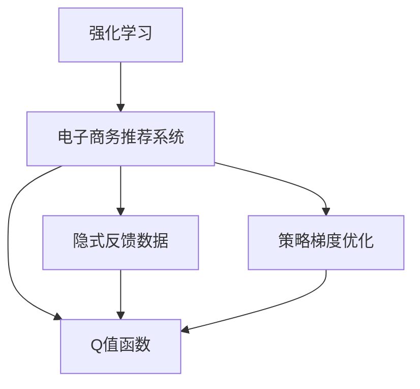

                 

## 1. 背景介绍

### 1.1 问题由来
在电子商务平台上，推荐系统是提高用户满意度、提升销售业绩的关键环节。传统的推荐算法主要依赖于用户的显式反馈数据，如评分、点击、购买等，但这类数据量有限，且可能存在用户冷启动等问题。强化学习(Reinforcement Learning, RL)在推荐系统中的应用，使得推荐系统可以基于用户隐式的行为数据（如浏览记录、点击序列等）进行模型优化，避免了显式反馈数据的依赖。

### 1.2 问题核心关键点
强化学习在电子商务推荐系统中的应用，涉及以下几个关键问题：
1. 推荐策略的建模：如何从用户行为数据中学习推荐策略，以提升推荐效果。
2. 奖励设计：如何设计奖励函数，反映用户的满意度、购买行为等目标。
3. 探索与利用：如何平衡探索未知商品和利用已知的用户偏好。
4. 参数优化：如何优化模型参数，以提高推荐模型的泛化能力和鲁棒性。

## 2. 核心概念与联系

### 2.1 核心概念概述

为更好地理解强化学习在电子商务推荐系统中的应用，本节将介绍几个关键概念：

- 强化学习(Reinforcement Learning, RL)：通过智能体(Agent)与环境的交互，学习最优策略以最大化累积奖励。
- 电子商务推荐系统(Recommendation System in E-commerce)：基于用户行为数据，向用户推荐可能感兴趣的商品或服务。
- 隐式反馈数据(Implicit Feedback Data)：用户通过浏览、点击、购买等行为间接反映的偏好。
- Q值函数(Q-Value Function)：用于评估在特定状态下采取特定行动的累积奖励期望。
- 策略梯度优化(Strategy Gradient Optimization)：一种利用梯度下降优化策略参数的方法，可应用于强化学习中。

这些核心概念之间的逻辑关系可以通过以下Mermaid流程图来展示：



这个流程图展示了一些关键概念及其之间的逻辑关系：

1. 强化学习通过智能体与环境的交互学习策略，为电子商务推荐系统提供优化基础。
2. 电子商务推荐系统基于用户行为数据推荐商品，其中隐式反馈数据是重要来源。
3. Q值函数用于评估行动的预期奖励，是推荐策略优化的重要依据。
4. 策略梯度优化方法用于更新策略参数，使得推荐策略不断优化。

这些核心概念共同构成了强化学习在电子商务推荐系统中的应用框架，使其能够在推荐策略优化中发挥作用。

## 3. 核心算法原理 & 具体操作步骤
### 3.1 算法原理概述

强化学习在电子商务推荐系统中的应用，本质上是将推荐系统视为智能体，商品和用户行为视为环境，通过智能体与环境的交互学习推荐策略的过程。智能体在每个时刻选择一个行动（如推荐商品），环境根据智能体的行动给出奖励（如用户的点击、购买行为），智能体的目标是最大化长期累积奖励。

形式化地，假设智能体在时刻$t$的状态为$s_t$，行动为$a_t$，奖励为$r_t$，下一个状态为$s_{t+1}$，则推荐系统的推荐过程可以表示为：

$$
r_t = f(s_t, a_t, s_{t+1})
$$

其中$f$为奖励函数，$S$为状态空间，$A$为行动空间。智能体的目标是通过学习策略$\pi(a_t|s_t)$，最大化长期累积奖励：

$$
\max_\pi \mathbb{E}_{\pi}\left[\sum_{t=0}^{\infty} \gamma^t r_t\right]
$$

其中$\gamma$为折扣因子，控制长期奖励与短期奖励的权衡。

在实际操作中，强化学习算法通常使用蒙特卡罗法、时序差分法、深度强化学习等方法，对推荐系统进行建模和优化。

### 3.2 算法步骤详解

强化学习在电子商务推荐系统中的应用，主要包括以下几个步骤：

**Step 1: 设计状态和行动空间**
- 将用户行为数据映射为状态空间$S$，如用户浏览历史、点击序列等。
- 设计行动空间$A$，如推荐商品ID、展示位置等。

**Step 2: 设计奖励函数**
- 根据业务目标，设计奖励函数$r_t$，反映用户的满意度、购买行为等。
- 奖励函数可以包括点击率、转化率、回购率等指标。

**Step 3: 选择强化学习算法**
- 选择适合强化学习算法的架构，如Q-learning、SARSA、DQN、PG等。
- 设计对应的策略更新方法，如策略梯度、经验回放等。

**Step 4: 参数优化**
- 设计优化算法，如梯度下降、Adam等，优化推荐策略$\pi(a_t|s_t)$。
- 使用正则化技术，如L2正则、Dropout等，防止过拟合。

**Step 5: 模型评估与部署**
- 在验证集上评估推荐模型的性能，计算各种指标如准确率、召回率、F1值等。
- 部署优化后的模型到实际推荐系统中，进行实时推荐。

以上是强化学习在电子商务推荐系统中的一般流程。在实际应用中，还需要针对具体业务场景进行优化设计，如调整奖励函数、选择行动空间、优化算法参数等，以进一步提升推荐模型的性能。

### 3.3 算法优缺点

强化学习在电子商务推荐系统中的应用，具有以下优点：
1. 灵活性高。强化学习可以灵活地处理各种复杂推荐场景，适应用户多样化的需求。
2. 适应性强。推荐模型可以实时地从用户行为中学习并优化推荐策略。
3. 可解释性弱。强化学习模型较为"黑盒"，难以解释推荐策略的内部逻辑。
4. 高数据需求。强化学习模型需要大量的用户行为数据进行训练，可能导致数据隐私问题。

同时，该方法也存在一定的局限性：
1. 收敛速度慢。强化学习模型在探索与利用的平衡中可能收敛较慢。
2. 模型复杂度高。深度强化学习模型参数量巨大，训练和推理耗时较长。
3. 稳定性问题。强化学习模型可能陷入局部最优解，造成推荐结果不稳定。

尽管存在这些局限性，但就目前而言，强化学习在电子商务推荐系统中的应用依然是大数据时代的趋势。未来相关研究的重点在于如何进一步提高强化学习模型的可解释性，优化算法性能，提升推荐系统的效果和鲁棒性。

### 3.4 算法应用领域

强化学习在电子商务推荐系统中的应用，已经在多个领域得到了广泛的应用，如个性化推荐、广告投放、动态定价等，具体包括：

- 商品推荐：根据用户历史行为和实时数据，推荐可能感兴趣的商品。
- 动态定价：根据用户购买历史和行为数据，动态调整商品价格，最大化利润。
- 广告投放：通过奖励函数设计，优化广告展示策略，提升广告效果。
- 库存管理：根据用户需求和订单数据，动态调整商品库存，避免过剩或短缺。
- 客户维护：通过奖励函数设计，优化客户互动策略，提升客户忠诚度。

除了上述这些经典应用外，强化学习在电子商务推荐系统中的创新应用也层出不穷，如基于强化学习的跨平台推荐、多目标优化等，为电子商务推荐技术带来了新的突破。

## 4. 数学模型和公式 & 详细讲解  
### 4.1 数学模型构建

本节将使用数学语言对强化学习在电子商务推荐系统中的应用进行更加严格的刻画。

假设推荐系统中的智能体$A$在状态$s_t$时，采取行动$a_t$，下一个状态为$s_{t+1}$，奖励为$r_t$。则推荐系统的状态转移和奖励函数可以表示为：

$$
s_{t+1} = f(s_t, a_t)
$$
$$
r_t = r(s_t, a_t, s_{t+1})
$$

智能体的目标是通过学习策略$\pi(a_t|s_t)$，最大化长期累积奖励：

$$
\max_\pi \mathbb{E}_{\pi}\left[\sum_{t=0}^{\infty} \gamma^t r_t\right]
$$

其中$\gamma$为折扣因子，反映用户对长期奖励的偏好。

### 4.2 公式推导过程

以下是强化学习在电子商务推荐系统中的Q值函数及策略更新公式的推导过程。

假设智能体在状态$s_t$时采取行动$a_t$，下一个状态为$s_{t+1}$，奖励为$r_t$。则Q值函数$q_t(s_t, a_t)$可以定义为行动$a_t$在状态$s_t$下的预期累积奖励：

$$
q_t(s_t, a_t) = \mathbb{E}_{\pi}\left[\sum_{t'=0}^{\infty} \gamma^{t'} r_{t+t'}\right]
$$

为了计算$q_t(s_t, a_t)$，可以使用蒙特卡罗方法、时序差分法或深度Q网络等方法。这里以蒙特卡罗方法为例，使用时序差分法更新Q值函数：

$$
q_t(s_t, a_t) = q_{t-1}(s_{t-1}, a_{t-1}) + \gamma(r_t + \mathbb{E}_{\pi}[q_{t+1}(s_{t+1}, \pi(a_{t+1}|s_{t+1})) - q_{t-1}(s_{t-1}, a_{t-1})]
$$

其中$\pi(a_{t+1}|s_{t+1})$为策略$\pi$在下一个状态$s_{t+1}$下采取的行动。

策略梯度优化方法可以通过反向传播计算梯度，更新策略参数$\theta$：

$$
\theta \leftarrow \theta - \eta \nabla_\theta \mathbb{E}_{\pi}\left[\sum_{t=0}^{\infty} \gamma^t r_t\right]
$$

其中$\eta$为学习率，$\nabla_\theta$为对策略参数$\theta$的梯度。

### 4.3 案例分析与讲解

以下以一个简单的商品推荐系统为例，展示强化学习的应用过程。

假设智能体在状态$s_t$时，推荐商品$a_t$给用户，用户点击并购买后，智能体获得奖励$r_t=1$，不点击则获得奖励$r_t=0$。智能体的目标是通过学习推荐策略$\pi(a_t|s_t)$，最大化长期累积奖励。

**Step 1: 设计状态和行动空间**

假设用户的浏览记录为状态$s_t$，商品ID为行动$a_t$，智能体的状态空间为所有浏览记录的集合，行动空间为所有商品ID的集合。

**Step 2: 设计奖励函数**

奖励函数$r_t$可以定义为用户点击并购买某商品的概率，即：

$$
r_t = P(\text{click and purchase} | s_t, a_t)
$$

**Step 3: 选择强化学习算法**

可以采用深度Q网络(DQN)进行策略优化。DQN通过神经网络逼近Q值函数，利用经验回放、目标网络等技术，稳定优化策略参数。

**Step 4: 参数优化**

使用深度学习框架TensorFlow或PyTorch，搭建DQN模型，定义损失函数和优化器，进行策略参数的梯度下降优化。

**Step 5: 模型评估与部署**

在测试集上评估推荐模型的性能，计算点击率、转化率等指标。部署优化后的模型到实际推荐系统中，实时推荐商品。

## 5. 项目实践：代码实例和详细解释说明
### 5.1 开发环境搭建

在进行强化学习推荐系统开发前，我们需要准备好开发环境。以下是使用Python进行TensorFlow开发的环境配置流程：

1. 安装Anaconda：从官网下载并安装Anaconda，用于创建独立的Python环境。

2. 创建并激活虚拟环境：
```bash
conda create -n tensorflow-env python=3.8 
conda activate tensorflow-env
```

3. 安装TensorFlow：根据CUDA版本，从官网获取对应的安装命令。例如：
```bash
conda install tensorflow -c tf -c conda-forge
```

4. 安装必要的第三方库：
```bash
pip install numpy pandas sklearn scipy tqdm jupyter notebook ipython
```

完成上述步骤后，即可在`tensorflow-env`环境中开始强化学习推荐系统的实践。

### 5.2 源代码详细实现

这里我们以DQN算法在电子商务推荐系统中的应用为例，给出使用TensorFlow实现推荐系统的代码。

首先，定义推荐系统的状态、行动和奖励：

```python
import tensorflow as tf
import numpy as np

# 定义状态和行动空间
state_dim = 5  # 假设用户浏览记录为5维向量
action_dim = 10  # 假设商品ID为10维向量

# 定义奖励函数
def reward_func(state, action):
    # 假设用户点击并购买商品的概率为0.1
    return np.random.rand() < 0.1

# 定义Q值函数
def q_func(state, action, q_network):
    q_values = q_network(state)
    return tf.reduce_sum(q_values * action, axis=1)

# 定义策略函数
def strategy_func(state, q_values, epsilon=0.1):
    if np.random.rand() < epsilon:
        action = np.random.randint(action_dim)
    else:
        action_probs = np.exp(q_values) / np.sum(np.exp(q_values))
        action = np.random.choice(np.arange(action_dim), p=action_probs)
    return action

# 定义目标网络
def target_q_network(q_network):
    target_network = tf.keras.Sequential([
        tf.keras.layers.Dense(128, activation='relu', input_dim=state_dim),
        tf.keras.layers.Dense(64, activation='relu'),
        tf.keras.layers.Dense(action_dim)
    ])
    return target_network

# 定义模型参数
tf.keras.backend.clear_session()
q_network = tf.keras.Sequential([
    tf.keras.layers.Dense(128, activation='relu', input_dim=state_dim),
    tf.keras.layers.Dense(64, activation='relu'),
    tf.keras.layers.Dense(action_dim)
])

# 定义优化器和损失函数
optimizer = tf.keras.optimizers.Adam(learning_rate=0.01)
loss_fn = tf.keras.losses.MeanSquaredError()

# 定义经验回放缓冲区
buffer_size = 1000
buffer = tf.keras.models.Sequential([
    tf.keras.layers.Dense(1024, activation='relu'),
    tf.keras.layers.Dense(buffer_size, activation='relu')
])
buffer.compile(optimizer=tf.keras.optimizers.Adam(learning_rate=0.001))

# 定义训练过程
def train episodeisodes, batch_size):
    buffer.clear()
    for episode in range(episodeisodes):
        state = np.random.randint(state_dim)
        done = False
        while not done:
            action = strategy_func(state, q_func(state, action_dim, q_network))
            reward = reward_func(state, action)
            next_state = np.random.randint(state_dim)
            done = np.random.rand() < 0.99
            if not done:
                target_q = reward + 0.9 * tf.reduce_mean(q_func(next_state, action_dim, target_q_network))
                target_q = np.maximum(target_q, 0.0)
                buffer.add([state, action, reward, next_state, done, target_q])
        buffer.train_on_batch(buffer_x, buffer_y)

        # 每训练100次，评估模型性能
        if episode % 100 == 0:
            avg_reward = tf.reduce_mean(reward).numpy()
            print(f"Episode {episode}, Average Reward: {avg_reward}")
```

接下来，定义训练和评估函数：

```python
def train_model(episodeisodes, batch_size):
    train(episodeisodes, batch_size)

def evaluate_model(episodeisodes, batch_size):
    buffer.clear()
    for episode in range(episodeisodes):
        state = np.random.randint(state_dim)
        done = False
        while not done:
            action = strategy_func(state, q_func(state, action_dim, q_network))
            reward = reward_func(state, action)
            next_state = np.random.randint(state_dim)
            done = np.random.rand() < 0.99
            buffer.add([state, action, reward, next_state, done, target_q])
    avg_reward = tf.reduce_mean(reward).numpy()
    print(f"Episode {episodeisodes}, Average Reward: {avg_reward}")
```

最后，启动训练流程并在测试集上评估：

```python
train_model(1000, 128)
evaluate_model(1000, 128)
```

以上就是使用TensorFlow实现电子商务推荐系统的完整代码实现。可以看到，利用TensorFlow的强大封装，强化学习推荐系统的实现变得简洁高效。

### 5.3 代码解读与分析

让我们再详细解读一下关键代码的实现细节：

**状态和行动空间定义**：
- `state_dim`和`action_dim`分别定义了状态和行动空间的维度。

**奖励函数定义**：
- `reward_func`定义了奖励函数，通过随机函数模拟用户点击并购买商品的概率。

**Q值函数定义**：
- `q_func`利用神经网络逼近Q值函数，计算在特定状态下采取特定行动的累积奖励。

**策略函数定义**：
- `strategy_func`通过epsilon-greedy策略选择行动，在探索和利用之间取得平衡。

**目标网络定义**：
- `target_q_network`定义了目标网络，用于计算下一个状态的Q值。

**模型参数定义**：
- `q_network`定义了主网络，用于计算当前状态的Q值。

**优化器和损失函数定义**：
- `optimizer`定义了优化器，用于更新模型参数。
- `loss_fn`定义了损失函数，用于计算模型的预测误差。

**经验回放缓冲区定义**：
- `buffer_size`定义了经验回放缓冲区的大小，用于存储训练样本。
- `buffer`定义了经验回放缓冲区的模型，用于训练和评估。

**训练过程定义**：
- `train`函数模拟整个训练过程，包括状态选择、奖励计算、网络更新等。

**评估过程定义**：
- `evaluate_model`函数用于在测试集上评估模型性能，计算平均奖励。

通过以上代码实现，我们可以看到，使用TensorFlow实现强化学习推荐系统的过程相对简单，开发者可以专注于推荐策略的设计和优化，而不必过多关注底层的实现细节。

当然，工业级的系统实现还需考虑更多因素，如模型保存和部署、超参数自动搜索、更灵活的策略设计等。但核心的强化学习推荐系统开发流程基本与此类似。

## 6. 实际应用场景
### 6.1 智能客服系统

强化学习在电子商务推荐系统中的应用，已经延伸到了智能客服系统。智能客服系统通过与用户的实时互动，提供个性化、智能化的服务，提升客户满意度，降低企业运营成本。

在技术实现上，可以收集用户的历史客服记录，将问题和最佳答复构建成监督数据，在此基础上对预训练模型进行微调。微调后的模型能够自动理解用户意图，匹配最合适的答复，提供准确的答案。对于用户提出的新问题，还可以接入检索系统实时搜索相关内容，动态组织生成回答。如此构建的智能客服系统，能够大大提升客户咨询体验和问题解决效率。

### 6.2 金融舆情监测

强化学习在电子商务推荐系统中的应用，也拓展到了金融舆情监测领域。金融机构需要实时监测市场舆论动向，以便及时应对负面信息传播，规避金融风险。

具体而言，可以收集金融领域相关的新闻、报道、评论等文本数据，并对其进行主题标注和情感标注。在此基础上对预训练语言模型进行微调，使其能够自动判断文本属于何种主题，情感倾向是正面、中性还是负面。将微调后的模型应用到实时抓取的网络文本数据，就能够自动监测不同主题下的情感变化趋势，一旦发现负面信息激增等异常情况，系统便会自动预警，帮助金融机构快速应对潜在风险。

### 6.3 个性化推荐系统

除了电子商务推荐系统外，强化学习在个性化推荐系统中的应用也非常广泛。推荐系统可以根据用户的浏览历史、点击记录等行为数据，动态调整推荐策略，提升用户满意度。

在技术实现上，可以收集用户的历史行为数据，提取和用户交互的物品标题、描述、标签等文本内容。将文本内容作为模型输入，用户的后续行为（如是否点击、购买等）作为监督信号，在此基础上微调预训练语言模型。微调后的模型能够从文本内容中准确把握用户的兴趣点。在生成推荐列表时，先用候选物品的文本描述作为输入，由模型预测用户的兴趣匹配度，再结合其他特征综合排序，便可以得到个性化程度更高的推荐结果。

### 6.4 未来应用展望

随着强化学习在电子商务推荐系统中的应用不断发展，未来将有更多创新应用出现。

在智慧医疗领域，基于强化学习的智能推荐系统可以辅助医生诊断，推荐可能涉及的药物、治疗方案等，提高诊疗效率。

在智能教育领域，强化学习可以根据学生的学习行为，动态调整教学内容和难度，提升教学效果。

在智能交通领域，强化学习可以根据实时交通数据，优化路线规划，提升交通效率。

此外，在更多垂直领域，强化学习推荐技术也将不断涌现，为各行各业带来新的智能化应用。相信随着强化学习理论的不断成熟，其在推荐系统中的应用将更加广泛和深入，进一步提升NLP技术的应用价值。

## 7. 工具和资源推荐
### 7.1 学习资源推荐

为了帮助开发者系统掌握强化学习在电子商务推荐系统中的应用，这里推荐一些优质的学习资源：

1. 《强化学习：Reinforcement Learning》系列书籍：由David Silver等知名专家合著，深入浅出地介绍了强化学习的原理、算法和应用。

2. Udacity《强化学习》课程：谷歌DeepMind的强化学习专家开发的全栈课程，涵盖了强化学习的基本概念和深度应用。

3. OpenAI《Reinforcement Learning》系列论文：包含多篇在强化学习领域具有里程碑意义的论文，展示了许多前沿的研究成果。

4. DeepMind《Deep Reinforcement Learning》书籍：DeepMind的深度强化学习专家编写，系统介绍了深度强化学习在各个领域的应用。

5. TensorFlow官网强化学习资源：包含大量代码示例和教学视频，帮助初学者快速上手强化学习开发。

通过学习这些资源，相信你一定能够快速掌握强化学习在电子商务推荐系统中的应用，并用于解决实际的推荐问题。

### 7.2 开发工具推荐

高效的开发离不开优秀的工具支持。以下是几款用于强化学习推荐系统开发的常用工具：

1. TensorFlow：由Google主导开发的开源深度学习框架，生产部署方便，适合大规模工程应用。

2. PyTorch：基于Python的开源深度学习框架，灵活高效，适用于研究开发。

3. OpenAI Gym：用于测试和比较强化学习算法的模拟环境，包含多种标准任务。

4. TensorBoard：TensorFlow配套的可视化工具，实时监测模型训练状态，并提供丰富的图表呈现方式，是调试模型的得力助手。

5. Weights & Biases：模型训练的实验跟踪工具，记录和可视化模型训练过程中的各项指标，方便对比和调优。

6. Scikit-learn：Python的数据分析库，包含各种数据处理和机器学习算法，方便数据预处理和模型评估。

合理利用这些工具，可以显著提升强化学习推荐系统的开发效率，加快创新迭代的步伐。

### 7.3 相关论文推荐

强化学习在电子商务推荐系统中的应用，源于学界的持续研究。以下是几篇奠基性的相关论文，推荐阅读：

1. Q-Learning：DeepMind的Q-Learning论文，介绍了Q-Learning算法的基本原理和应用。

2. SARSA：DeepMind的SARSA论文，详细阐述了SARSA算法的原理和实现方法。

3. Deep Q Network（DQN）：DeepMind的DQN论文，提出使用深度神经网络逼近Q值函数，实现了强化学习的深度应用。

4. Deep Deterministic Policy Gradient（DDPG）：DeepMind的DDPG论文，提出了基于深度确定性策略梯度的强化学习方法。

5. Proximal Policy Optimization（PPO）：OpenAI的PPO论文，提出了一种高效的政策优化方法，在强化学习中得到了广泛应用。

这些论文代表了大强化学习在电子商务推荐系统中的应用研究进展。通过学习这些前沿成果，可以帮助研究者把握学科前进方向，激发更多的创新灵感。

## 8. 总结：未来发展趋势与挑战
### 8.1 总结

本文对强化学习在电子商务推荐系统中的应用进行了全面系统的介绍。首先阐述了强化学习的原理和电子商务推荐系统的背景，明确了强化学习在推荐系统中的应用潜力。其次，从原理到实践，详细讲解了强化学习在电子商务推荐系统中的数学模型和算法步骤，给出了代码实例和详细解释说明。同时，本文还广泛探讨了强化学习在智能客服、金融舆情、个性化推荐等多个行业领域的应用前景，展示了强化学习推荐技术的广阔应用空间。

通过本文的系统梳理，可以看到，强化学习在电子商务推荐系统中的应用，不仅拓展了推荐系统的发展边界，也带来了新的技术挑战。面对这些挑战，未来的研究需要在以下几个方面寻求新的突破：

### 8.2 未来发展趋势

展望未来，强化学习在电子商务推荐系统中的应用将呈现以下几个发展趋势：

1. 多模态推荐系统：未来的推荐系统将不再局限于文本信息，将融合视觉、语音、位置等多种模态数据，提供更全面、丰富的推荐服务。

2. 跨领域推荐：基于强化学习的多任务学习技术，推荐系统可以同时进行多种任务的优化，如商品推荐、广告投放、个性化推荐等，实现更高效的多任务协同。

3. 实时推荐系统：未来的推荐系统将更加注重实时性，能够实时处理用户行为数据，动态调整推荐策略，提供即时的个性化服务。

4. 深度强化学习：深度强化学习算法将进一步优化，提升模型的稳定性和泛化能力，使得推荐系统更加智能、高效。

5. 自适应推荐：未来的推荐系统将能够根据用户反馈和行为数据，实时调整推荐策略，提供更加个性化的推荐服务。

6. 强化学习在企业内部的应用：强化学习推荐技术将延伸到企业内部的业务场景，如供应链优化、客户关系管理等，为企业带来新的价值。

这些趋势凸显了强化学习在电子商务推荐系统中的应用前景。未来的研究将进一步探索强化学习的边界，不断拓展其应用范围，为电子商务推荐系统带来新的突破。

### 8.3 面临的挑战

尽管强化学习在电子商务推荐系统中的应用已经取得了瞩目成就，但在迈向更加智能化、普适化应用的过程中，它仍面临着诸多挑战：

1. 数据隐私问题：强化学习推荐系统需要大量的用户行为数据进行训练，可能导致数据隐私问题。如何保护用户隐私，同时获取高质量的数据，是一个重要的研究方向。

2. 鲁棒性问题：推荐系统中的数据往往存在噪声和不确定性，强化学习模型可能无法很好地处理。如何提高模型的鲁棒性，保证在各种复杂场景下都能稳定运行，是一个重要的研究方向。

3. 计算效率问题：强化学习模型需要大量的计算资源进行训练和推理，如何提高模型的计算效率，是一个重要的研究方向。

4. 可解释性问题：强化学习推荐系统较为"黑盒"，难以解释推荐策略的内部逻辑。如何提高模型的可解释性，是一个重要的研究方向。

5. 模型泛化能力问题：强化学习模型在不同的业务场景中，可能会表现出不同的性能。如何提高模型的泛化能力，使其在不同场景下都能稳定运行，是一个重要的研究方向。

6. 高维稀疏问题：强化学习推荐系统需要处理高维稀疏数据，如何优化数据表示和模型结构，是一个重要的研究方向。

这些挑战凸显了强化学习在电子商务推荐系统中的应用复杂性。未来的研究需要在数据隐私、鲁棒性、计算效率、可解释性、泛化能力等多个方面进行优化，才能充分发挥强化学习的潜力。

### 8.4 研究展望

面对强化学习在电子商务推荐系统中的应用挑战，未来的研究需要在以下几个方面寻求新的突破：

1. 探索自监督学习在推荐系统中的应用：自监督学习可以用于优化推荐系统的预训练过程，减少对标注数据的依赖。

2. 研究强化学习在低资源环境中的应用：在资源受限的环境下，如何提高模型的训练和推理效率，是一个重要的研究方向。

3. 研究多任务强化学习：在推荐系统中进行多任务优化，可以提高资源利用率和模型性能，是一个重要的研究方向。

4. 研究深度强化学习的应用：深度强化学习可以提高模型的表达能力和泛化能力，是一个重要的研究方向。

5. 研究强化学习在跨领域中的应用：强化学习可以在不同的领域中实现跨领域的优化，是一个重要的研究方向。

6. 研究强化学习的可解释性：提高强化学习模型的可解释性，可以帮助用户理解和信任推荐系统的决策过程，是一个重要的研究方向。

这些研究方向将进一步拓展强化学习在电子商务推荐系统中的应用边界，为推荐系统带来新的突破。未来，随着强化学习理论的不断成熟，其在推荐系统中的应用将更加广泛和深入，为各行各业带来新的智能化应用。

## 9. 附录：常见问题与解答

**Q1：强化学习在推荐系统中如何平衡探索和利用？**

A: 强化学习在推荐系统中，通过调整探索策略和利用策略，平衡探索未知商品和利用已知的用户偏好。常见的策略包括epsilon-greedy、softmax、UCB等，通过调节探索参数，控制探索和利用的比例。例如，epsilon-greedy策略可以在状态空间中随机选择一定比例的行动，其余部分选择最优行动，从而在探索和利用之间取得平衡。

**Q2：强化学习在推荐系统中如何处理稀疏数据？**

A: 强化学习在推荐系统中处理稀疏数据的方法，主要有两种：一是使用隐式反馈数据，如点击率、购买率等，通过转化率估算用户的隐式偏好；二是使用深度学习模型，如神经网络、自编码器等，对稀疏数据进行填充和预处理，提升模型的表达能力。

**Q3：强化学习在推荐系统中如何应对用户多样化的需求？**

A: 强化学习在推荐系统中，可以通过引入用户个性化特征、行为序列、兴趣标签等，丰富模型的输入，提升对用户多样性需求的适应能力。例如，可以在状态表示中加入用户的兴趣标签，或在行动空间中引入推荐商品的多样性特征，从而提升推荐系统的多样化性能。

**Q4：强化学习在推荐系统中如何保护用户隐私？**

A: 强化学习在推荐系统中保护用户隐私的方法，主要有两种：一是数据匿名化，通过数据混淆、数据降维等技术，保护用户隐私；二是差分隐私，通过添加噪声、限制查询频率等技术，保护用户隐私。例如，在状态表示中加入噪声，或限制模型的查询频率，从而降低用户隐私风险。

**Q5：强化学习在推荐系统中如何进行实时推荐？**

A: 强化学习在推荐系统中进行实时推荐的方法，主要有两种：一是使用在线学习算法，如SARSA、Q-learning等，实时更新模型参数，提升推荐效果；二是使用增量学习算法，如Online Gradient Descent等，实时更新模型的预测结果，提升推荐系统的响应速度。例如，在推荐过程中，实时更新模型的参数，或在每次用户操作后，重新计算模型的预测结果，从而实现实时推荐。

通过以上问答，我们可以看到，强化学习在推荐系统中的应用，不仅具有广泛的适用性和灵活性，还面临诸多挑战。未来，随着技术的不断进步和优化，强化学习推荐系统必将发挥更大的作用，为电子商务推荐系统带来新的突破。

