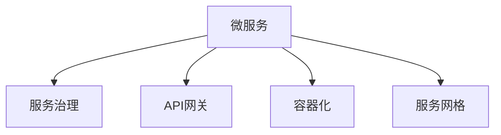
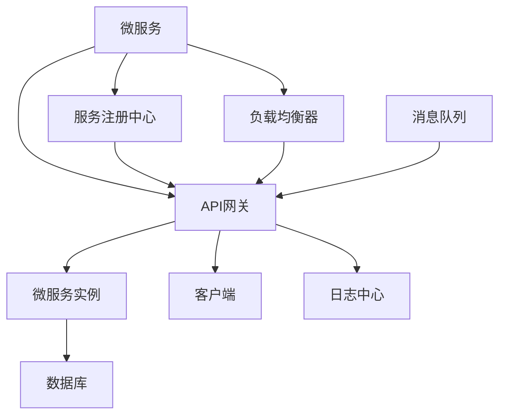

                 

# 微服务架构：独立部署和扩展

> 关键词：微服务, 独立部署, 分布式系统, 容器化, Kubernetes, Spring Boot, API Gateway

## 1. 背景介绍

### 1.1 问题由来
随着互联网业务的复杂度和用户量的激增，传统的单体架构逐渐难以应对。单体应用的维护成本高，不同模块之间的耦合性强，容易受到瓶颈制约，难以及时响应需求变化。在这样的背景下，微服务架构应运而生。微服务架构通过将单体应用拆分为多个小型、独立运行的服务，提高系统的可维护性、可扩展性和可部署性。

## 2. 核心概念与联系

### 2.1 核心概念概述

微服务架构是一种基于分布式系统设计思想的架构风格，旨在通过将单体应用拆分为多个小型、独立运行的服务，提高系统的可维护性、可扩展性和可部署性。微服务架构的核心在于服务的细粒度和松耦合，服务之间通过轻量级的通信机制相互协作。

- **微服务**：指一个完整的应用程序按功能划分，拆分成多个独立的小型服务，每个服务能够独立部署、运行和扩展。
- **服务治理**：指管理微服务实例的创建、销毁、配置变更等操作的机制，包括服务注册、发现、负载均衡、故障转移等。
- **API网关**：指为各个微服务提供统一的入口，隐藏微服务实现的细节，实现统一的安全、路由、限流等功能。
- **容器化**：指将应用程序和其依赖项打包到一个容器实例中，通过容器运行环境隔离不同应用，实现快速部署、扩展和回滚。
- **服务网格**：指通过网络层实现微服务间的通信，包括负载均衡、熔断、重试、超时等功能。

这些核心概念之间的逻辑关系可以通过以下Mermaid流程图来展示：



这个流程图展示了几者之间的关系：

1. 微服务是架构的基本单元，每个服务都承担着独立的功能。
2. 服务治理负责管理和调度微服务，确保微服务实例的正常运行。
3. 容器化通过隔离应用，实现快速部署和扩展。
4. API网关为微服务提供统一的访问接口，实现安全、路由、限流等综合功能。
5. 服务网格通过网络层实现微服务间的通信，提高系统的健壮性和可靠性。

这些概念共同构成了微服务架构的核心框架，使得微服务系统能够高效、稳定地运行。

### 2.2 核心概念原理和架构的 Mermaid 流程图



这个流程图展示了微服务架构的基本架构和工作流程：

1. 微服务通过服务注册中心注册，供API网关和客户端使用。
2. API网关根据请求负载均衡至不同的微服务实例。
3. 微服务实例通过负载均衡器和消息队列进行通信。
4. 日志中心对所有服务请求进行日志记录和监控。

## 3. 核心算法原理 & 具体操作步骤

### 3.1 算法原理概述

微服务架构的核心原理是通过将单体应用拆分为多个小型、独立运行的服务，提高系统的可维护性、可扩展性和可部署性。每个服务独立部署和运行，能够实现快速的扩展和故障隔离。服务的细粒度和松耦合能够确保系统的高可用性和灵活性。

微服务架构的核心算法包括服务拆分、容器化、服务治理、API网关和服务网格等。

### 3.2 算法步骤详解

微服务架构的实现主要分为以下几个步骤：

1. **服务拆分**：将单体应用按功能拆分，每个服务负责独立的功能模块，减少服务之间的耦合性。
2. **容器化**：将应用程序和其依赖项打包到Docker容器实例中，通过容器化实现快速部署、扩展和回滚。
3. **服务治理**：通过服务注册中心、配置中心、熔断、限流等功能，实现对微服务的统一管理。
4. **API网关**：通过API网关提供统一的入口，隐藏微服务实现的细节，实现统一的安全、路由、限流等功能。
5. **服务网格**：通过服务网格实现微服务间的通信，包括负载均衡、熔断、重试、超时等功能。

### 3.3 算法优缺点

微服务架构具有以下优点：

1. **独立部署**：每个服务独立部署和运行，能够实现快速的扩展和故障隔离。
2. **灵活性高**：服务细粒度和松耦合能够确保系统的高可用性和灵活性。
3. **可扩展性好**：服务的独立性使得系统的可扩展性大大提高。
4. **维护成本低**：服务的独立性和松耦合性使得系统更易于维护。

同时，微服务架构也存在一些缺点：

1. **复杂性高**：微服务架构的复杂性较高，需要开发者具备较强的架构设计和系统集成能力。
2. **通信开销大**：微服务间的通信开销较大，需要优化网络传输和通信协议。
3. **管理成本高**：服务的数量众多，管理复杂度增加。
4. **服务间依赖复杂**：服务间的依赖关系复杂，需要精心的设计和管理。

### 3.4 算法应用领域

微服务架构广泛应用于互联网领域，尤其是SaaS平台、电子商务、金融、医疗等行业。例如：

- **电子商务**：电商平台通常具有复杂的业务逻辑和用户场景，微服务架构能够提供高效、可扩展、可维护的解决方案。
- **金融**：金融行业对系统的安全性和稳定性要求极高，微服务架构能够实现独立部署和故障隔离，提高系统的可靠性。
- **医疗**：医疗行业对系统的实时性和可用性要求高，微服务架构能够实现高并发、高可用、高扩展的系统。
- **社交媒体**：社交媒体平台的用户量和数据量巨大，微服务架构能够提供灵活、可扩展、可维护的解决方案。

## 4. 数学模型和公式 & 详细讲解 & 举例说明

### 4.1 数学模型构建

微服务架构的设计和优化主要依赖于系统模型和性能模型。系统模型描述系统组件和它们之间的关系，性能模型用于评估系统的性能指标。

- **系统模型**：描述系统中的服务、容器、负载均衡器、API网关等组件及其交互关系。
- **性能模型**：评估系统的吞吐量、延迟、资源利用率等性能指标。

### 4.2 公式推导过程

以下是性能模型的一个简单推导过程：

假设一个微服务系统的负载均衡器具有$N$个实例，每个实例的吞吐量为$C$，系统总负载为$L$，则系统的总吞吐量为：

$$
T = N \times C
$$

如果系统负载不均衡，每个实例的负载不同，假设第$i$个实例的负载为$L_i$，则系统的平均吞吐量为：

$$
T_{avg} = \frac{1}{N} \sum_{i=1}^{N} C \times \frac{L_i}{L}
$$

为了优化系统的吞吐量，可以采用负载均衡、流量分配、冗余设计等策略，最大化系统的总吞吐量。

### 4.3 案例分析与讲解

假设一个电商平台的订单系统，需要处理海量的订单数据。平台将订单系统拆分为订单服务、库存服务、支付服务等多个微服务。每个微服务独立部署和运行，使用Docker容器化。通过服务治理实现服务的注册、发现、负载均衡等功能，API网关提供统一的接口，服务网格实现微服务间的通信。

具体实现步骤如下：

1. **服务拆分**：将订单系统拆分为订单服务、库存服务、支付服务等多个微服务。
2. **容器化**：使用Docker容器化每个微服务，提高部署的效率和灵活性。
3. **服务治理**：使用服务注册中心和配置中心实现微服务的注册和配置管理。
4. **API网关**：使用API网关实现统一的安全、路由、限流等功能，隐藏微服务实现的细节。
5. **服务网格**：使用服务网格实现微服务间的通信，包括负载均衡、熔断、重试、超时等功能。

通过以上步骤，订单系统能够实现高效的部署、扩展和故障隔离，同时保障系统的安全性和可靠性。

## 5. 项目实践：代码实例和详细解释说明

### 5.1 开发环境搭建

在微服务架构中，开发环境搭建至关重要。以下是使用Spring Boot和Docker搭建微服务架构的流程：

1. **安装Docker**：在开发机上安装Docker，并设置Docker Hub账号，用于获取和发布容器镜像。
2. **创建Dockerfile**：为每个微服务创建Dockerfile，定义容器的构建过程。
3. **编写微服务代码**：使用Spring Boot编写微服务代码，实现业务逻辑。
4. **编写测试用例**：编写测试用例，确保微服务的正确性和可靠性。

### 5.2 源代码详细实现

以下是一个使用Spring Boot和Spring Cloud实现微服务架构的示例代码：

**微服务代码**：

```java
@SpringBootApplication
public class OrderServiceApplication {

    public static void main(String[] args) {
        SpringApplication.run(OrderServiceApplication.class, args);
    }

    @RestController
    public class OrderController {

        @Autowired
        private OrderService orderService;

        @GetMapping("/orders")
        public List<Order> getOrders() {
            return orderService.getOrders();
        }
    }

    @Service
    public class OrderService {

        @Autowired
        private OrderRepository orderRepository;

        public List<Order> getOrders() {
            return orderRepository.findAll();
        }
    }

    @Entity
    public class Order {

        @Id
        @GeneratedValue(strategy = GenerationType.IDENTITY)
        private Long id;

        private String name;
        private Double price;
        private Date createdAt;

        // getters and setters
    }

    @Repository
    public interface OrderRepository extends JpaRepository<Order, Long> {
    }
}
```

**Dockerfile代码**：

```Dockerfile
FROM openjdk:11
ADD target/classes/helloworld.jar app.jar
CMD ["java", "-jar", "app.jar"]
```

### 5.3 代码解读与分析

以下是微服务代码的详细解读：

- **@SpringBootApplication**：表示这是一个Spring Boot应用程序。
- **@RestController**：表示这是一个控制器，用于处理HTTP请求。
- **@Autowired**：用于注入依赖。
- **@GetMapping**：用于映射HTTP GET请求。
- **@Service**：表示这是一个服务类。
- **@Entity**：表示这是一个实体类。
- **@Repository**：表示这是一个Repository，用于持久化操作。
- **JpaRepository**：Spring提供的Repository接口，用于简化数据访问。

### 5.4 运行结果展示

以下是微服务的运行结果展示：

- **启动微服务**：
```bash
docker run -p 8080:8080 my-order-service:latest
```

- **访问微服务**：
```bash
curl http://localhost:8080/orders
```

- **输出结果**：
```json
[
    {"id": 1, "name": "Order 1", "price": 100.00, "createdAt": "2023-01-01T00:00:00Z"},
    {"id": 2, "name": "Order 2", "price": 200.00, "createdAt": "2023-01-02T00:00:00Z"},
    ...
]
```

## 6. 实际应用场景

### 6.1 电商平台的订单系统

电商平台的订单系统通常需要处理大量的订单数据，包括订单创建、修改、查询、支付等操作。使用微服务架构，可以将订单系统拆分为订单服务、库存服务、支付服务等多个微服务，每个服务独立部署和运行，实现高效的扩展和故障隔离。

通过服务注册中心和配置中心实现微服务的注册和配置管理。API网关提供统一的接口，服务网格实现微服务间的通信，确保系统的稳定性和可靠性。

### 6.2 金融行业的交易系统

金融行业对系统的安全性和稳定性要求极高。使用微服务架构，可以将交易系统拆分为交易服务、账户服务、结算服务等多个微服务，每个服务独立部署和运行，实现高效的扩展和故障隔离。

通过服务注册中心和配置中心实现微服务的注册和配置管理。API网关提供统一的安全、路由、限流等功能，服务网格实现微服务间的通信，确保系统的安全性和可靠性。

### 6.3 医疗行业的预约系统

医疗行业对系统的实时性和可用性要求高。使用微服务架构，可以将预约系统拆分为预约服务、医生服务、支付服务等多个微服务，每个服务独立部署和运行，实现高效的扩展和故障隔离。

通过服务注册中心和配置中心实现微服务的注册和配置管理。API网关提供统一的安全、路由、限流等功能，服务网格实现微服务间的通信，确保系统的实时性和可靠性。

### 6.4 未来应用展望

微服务架构的未来应用前景广阔，将在更多领域得到应用。以下是一些可能的未来应用场景：

- **智慧城市**：智慧城市管理系统可以拆分为交通管理、环境监测、公共安全等多个微服务，每个服务独立部署和运行，实现高效的扩展和故障隔离。
- **智能制造**：智能制造系统可以拆分为设备监控、质量检测、生产调度等多个微服务，每个服务独立部署和运行，实现高效的扩展和故障隔离。
- **教育平台**：在线教育平台可以拆分为课程管理、学习管理、互动反馈等多个微服务，每个服务独立部署和运行，实现高效的扩展和故障隔离。
- **物流系统**：物流系统可以拆分为订单管理、配送管理、仓储管理等多个微服务，每个服务独立部署和运行，实现高效的扩展和故障隔离。

## 7. 工具和资源推荐

### 7.1 学习资源推荐

为了帮助开发者掌握微服务架构的设计和实现，这里推荐一些优质的学习资源：

1. **Spring Cloud官方文档**：Spring Cloud是微服务架构的主要技术栈之一，官方文档详细介绍了微服务的各个组件和使用方法。
2. **微服务设计模式**：这是一本关于微服务架构设计的经典书籍，涵盖了许多微服务架构的常见模式和最佳实践。
3. **分布式系统设计原理**：这本书深入浅出地介绍了分布式系统设计的基本原理和关键技术，适合深入了解微服务架构的设计思路。
4. **Docker官方文档**：Docker是微服务架构的重要技术之一，官方文档详细介绍了Docker的使用方法和最佳实践。
5. **Kubernetes官方文档**：Kubernetes是微服务架构的主要容器编排工具，官方文档详细介绍了Kubernetes的使用方法和最佳实践。

通过对这些资源的学习实践，相信你一定能够快速掌握微服务架构的设计和实现。

### 7.2 开发工具推荐

以下是几款用于微服务架构开发的常用工具：

1. **Spring Boot**：Spring Boot是微服务架构的主流技术栈之一，提供了快速开发、简化配置、自动装配等功能。
2. **Docker**：Docker是微服务架构的重要技术之一，提供了容器化部署、隔离应用、快速部署等功能。
3. **Kubernetes**：Kubernetes是微服务架构的主要容器编排工具，提供了自动化部署、扩展、管理等功能。
4. **Consul**：Consul是微服务架构的服务治理工具，提供了服务注册、配置管理、健康检查等功能。
5. **Eureka**：Eureka是微服务架构的服务发现工具，提供了服务注册、负载均衡等功能。

合理利用这些工具，可以显著提升微服务架构的开发效率，加快创新迭代的步伐。

### 7.3 相关论文推荐

微服务架构的发展源于学界的持续研究。以下是几篇奠基性的相关论文，推荐阅读：

1. **Microservices: A Personal Perspective**：这篇文章详细介绍了微服务架构的基本概念和设计思路，是微服务架构的入门必读。
2. **Building Microservices**：这本书介绍了微服务架构的各个组件和实现方法，适合深入了解微服务架构的实现细节。
3. **Designing Distributed Systems**：这本书介绍了分布式系统的基本原理和关键技术，适合深入了解微服务架构的设计思路。
4. **Decoupled Microservices Design**：这篇文章介绍了微服务架构的设计模式和最佳实践，适合了解微服务架构的高级应用。
5. **Beyond Microservices**：这篇文章探讨了微服务架构的未来趋势和挑战，适合了解微服务架构的发展方向。

这些论文代表了大规模微服务架构的设计和实现路径，有助于理解微服务架构的高级应用。

## 8. 总结：未来发展趋势与挑战

### 8.1 研究成果总结

本文对微服务架构的独立部署和扩展进行了全面系统的介绍。首先阐述了微服务架构的背景和设计思路，明确了微服务架构在提高系统的可维护性、可扩展性和可部署性方面的优势。其次，从原理到实践，详细讲解了微服务架构的各个组件和实现方法，给出了微服务架构的完整代码实例。同时，本文还广泛探讨了微服务架构在电商、金融、医疗等多个领域的应用前景，展示了微服务架构的广泛应用价值。最后，本文精选了微服务架构的学习资源、开发工具和相关论文，力求为读者提供全方位的技术指引。

通过本文的系统梳理，可以看到，微服务架构已经成为互联网领域的重要技术范式，极大地提高了系统的可维护性、可扩展性和可部署性。未来，伴随微服务架构的不断演进，相信微服务技术将在更多领域大放异彩，为数字化的未来提供坚实的技术基础。

### 8.2 未来发展趋势

展望未来，微服务架构将呈现以下几个发展趋势：

1. **容器化普及**：随着容器化技术的普及，微服务架构的部署效率将大大提高。
2. **服务网格技术成熟**：服务网格技术将更加成熟，能够提供更加稳定、可靠、高性能的微服务通信方案。
3. **API网关功能增强**：API网关将具备更加丰富的功能，如身份认证、限流、缓存、数据加密等。
4. **服务治理自动化**：服务治理将更加自动化，能够实现微服务的自动注册、发现、负载均衡等功能。
5. **微服务治理平台普及**：微服务治理平台将更加普及，帮助开发者更好地管理微服务系统。

### 8.3 面临的挑战

尽管微服务架构已经取得了瞩目成就，但在迈向更加智能化、普适化应用的过程中，它仍面临着诸多挑战：

1. **复杂性高**：微服务架构的复杂性较高，需要开发者具备较强的架构设计和系统集成能力。
2. **通信开销大**：微服务间的通信开销较大，需要优化网络传输和通信协议。
3. **管理成本高**：服务的数量众多，管理复杂度增加。
4. **服务间依赖复杂**：服务间的依赖关系复杂，需要精心的设计和管理。

### 8.4 研究展望

面对微服务架构面临的挑战，未来的研究需要在以下几个方面寻求新的突破：

1. **服务拆分和组合技术**：研究更加灵活、可扩展的服务拆分和组合技术，使得微服务架构更加灵活、可维护。
2. **微服务性能优化**：研究高效的微服务性能优化技术，如负载均衡、熔断、重试、超时等，提高系统的健壮性和可靠性。
3. **微服务安全与隐私保护**：研究微服务架构的安全与隐私保护技术，如身份认证、数据加密、限流等，提高系统的安全性。
4. **微服务编排与调度**：研究微服务编排与调度技术，如Kubernetes、Eureka等，提高系统的自动化部署和扩展能力。
5. **微服务治理平台**：研究更加自动化、易用的微服务治理平台，帮助开发者更好地管理微服务系统。

这些研究方向的探索，必将引领微服务架构迈向更高的台阶，为构建稳定、高效、可维护的微服务系统提供更强的技术支撑。面向未来，微服务架构需要在更广的领域和更深的层次上不断创新和优化，才能真正实现大规模微服务系统的规模化部署和运行。总之，微服务架构的未来发展需要开发者、架构师、运维人员等各方的共同努力，才能更好地适应未来技术的发展趋势和应用需求。

## 9. 附录：常见问题与解答

**Q1：微服务架构和单体架构的区别是什么？**

A: 微服务架构和单体架构的主要区别在于系统的组件化程度和独立性。微服务架构将单体应用拆分为多个小型、独立运行的服务，每个服务独立部署和运行，能够实现快速的扩展和故障隔离。单体架构则是将整个应用作为一个整体运行，依赖单一的部署和管理机制。

**Q2：微服务架构在开发和部署上有什么优势？**

A: 微服务架构在开发和部署上具有以下优势：

1. **独立部署**：每个服务独立部署和运行，能够实现快速的扩展和故障隔离。
2. **灵活性高**：服务细粒度和松耦合能够确保系统的高可用性和灵活性。
3. **可扩展性好**：服务的独立性使得系统的可扩展性大大提高。
4. **维护成本低**：服务的独立性和松耦合性使得系统更易于维护。

**Q3：微服务架构的开发难点是什么？**

A: 微服务架构的开发难点主要在于以下几点：

1. **服务拆分和组合**：服务拆分需要考虑到服务的独立性和交互性，避免服务之间的耦合性过高。
2. **服务通信**：微服务间的通信开销较大，需要优化网络传输和通信协议。
3. **服务治理**：服务治理需要确保微服务实例的正常运行，实现负载均衡、故障转移等功能。
4. **API网关设计**：API网关需要实现统一的安全、路由、限流等功能，隐藏微服务实现的细节。
5. **服务网格设计**：服务网格需要实现微服务间的通信，包括负载均衡、熔断、重试、超时等功能。

这些难点需要开发者具备较强的架构设计和系统集成能力，才能构建高效、稳定、可维护的微服务系统。

**Q4：微服务架构在运维上有什么优势？**

A: 微服务架构在运维上具有以下优势：

1. **故障隔离**：每个服务独立部署和运行，能够实现快速的故障隔离和排查。
2. **扩展和缩容**：通过容器化和Kubernetes等技术，能够实现快速扩展和缩容。
3. **自动化运维**：通过自动化部署、配置管理、监控告警等功能，提高运维效率和可靠性。
4. **持续交付**：通过CI/CD工具链，能够实现持续交付和持续集成，提高开发效率和系统稳定性。

通过这些运维优势，微服务架构能够确保系统的稳定性和可靠性，提升开发和运维效率。

**Q5：微服务架构是否适用于所有场景？**

A: 微服务架构虽然具有很多优势，但并不是适用于所有场景。对于数据量小、访问频率低、交互简单、依赖关系清晰的场景，单体架构可能更加适合。对于数据量大、访问频率高、交互复杂、依赖关系复杂的场景，微服务架构能够提供更好的解决方案。因此，需要根据具体场景选择合适的架构。

---

作者：禅与计算机程序设计艺术 / Zen and the Art of Computer Programming

