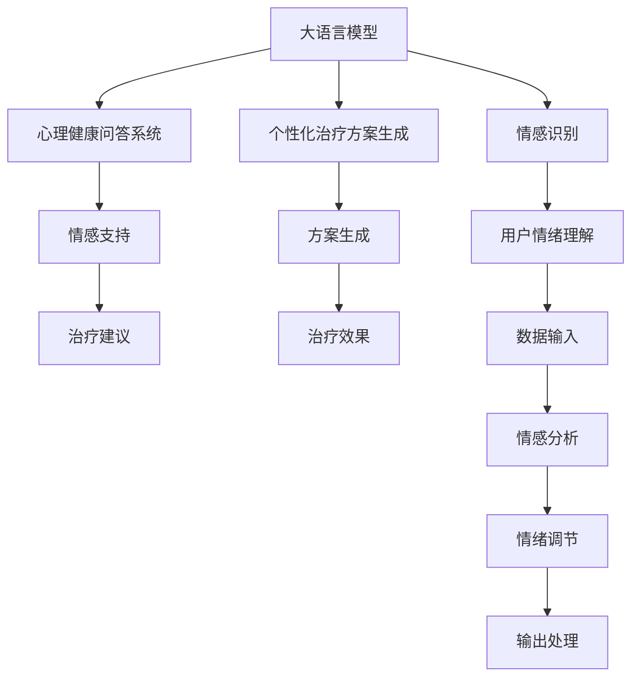

                 

# 心理健康和 LLM：个性化的支持和治疗

> 关键词：大语言模型,心理健康,自然语言处理(NLP),情感识别,个性化治疗,心理健康应用

## 1. 背景介绍

### 1.1 问题由来

近年来，随着人工智能(AI)技术的飞速发展，自然语言处理(NLP)在心理健康领域的应用越来越受到重视。传统的心理健康服务主要依赖于专业心理学家和精神科医生，但受限于人力、资源和地域等因素，往往难以覆盖到每一个需要帮助的人。通过大语言模型(Large Language Models, LLMs)，我们有机会利用计算机算法为更广泛的人群提供个性化、高效的心理健康服务。

大语言模型是通过在大规模无标签文本上自监督预训练，学习到丰富的语言知识和常识，具备强大的自然语言理解和生成能力。借助大语言模型，可以实现情感识别、个性化治疗方案生成、心理健康问题问答等多种功能，为心理健康领域的AI应用开辟了新的可能性。

### 1.2 问题核心关键点

本节将深入探讨基于大语言模型的心理健康服务。我们将关注：

- 如何利用大语言模型实现情感识别和情绪调节？
- 个性化治疗方案的生成原理和方法是什么？
- 基于大语言模型的心理健康问答系统是如何运作的？
- 这些技术在实际应用中存在哪些优势和挑战？

## 2. 核心概念与联系

### 2.1 核心概念概述

为更好地理解基于大语言模型的心理健康服务，本节将介绍几个关键概念：

- 大语言模型(Large Language Models, LLMs)：基于自回归或自编码模型的大规模预训练语言模型，能够理解自然语言，具备强大的语言生成和推理能力。
- 情感识别(Emotion Recognition)：通过自然语言处理技术，从文本或语音中识别出用户的情感状态，帮助心理学家更好地理解患者情绪。
- 个性化治疗方案生成(Personalized Treatment Generation)：根据用户输入的个人信息和情绪数据，生成个性化的治疗方案或建议，提升治疗效果。
- 心理健康问答系统(Psychological Health Q&A)：构建一个基于大语言模型的问答系统，能够解答用户的心理健康问题，提供情感支持和建议。
- 自然语言处理(Natural Language Processing, NLP)：涉及语言理解、生成、分析和应用的一门交叉学科，涵盖机器翻译、信息抽取、情感分析等多种技术。

这些概念之间的逻辑关系可以通过以下Mermaid流程图来展示：



这个流程图展示了大语言模型在心理健康服务中的应用流程：

1. 大语言模型接受用户输入，进行情感识别。
2. 根据用户情绪，生成个性化治疗方案。
3. 构建问答系统，解答用户心理健康问题。
4. 系统提供情感支持和治疗建议。
5. 情感识别和分析反馈给情绪调节过程。

## 3. 核心算法原理 & 具体操作步骤
### 3.1 算法原理概述

基于大语言模型的心理健康服务，本质上是一个多步骤的NLP处理过程。其核心思想是：通过大语言模型学习到的语言表示，实现对用户输入的自然语言处理，从而理解情感状态、生成治疗方案、解答问题等。

形式化地，假设大语言模型为 $M_{\theta}$，其中 $\theta$ 为预训练得到的模型参数。对于心理健康服务，我们假设需要处理的任务包括情感识别、个性化治疗方案生成和心理健康问答等，分别对应模型 $M_{\theta_1}$、$M_{\theta_2}$ 和 $M_{\theta_3}$。则每个任务的处理过程可以表示为：

$$
\begin{aligned}
M_{\theta_1} &: \text{Given input text } x, \text{output } y_1 \text{ (emotion score)} \\
M_{\theta_2} &: \text{Given user profile and emotion score } y_1, \text{output } y_2 \text{ (treatment suggestion)} \\
M_{\theta_3} &: \text{Given question and context } (x,y_2), \text{output } y_3 \text{ (answer)}
\end{aligned}
$$

其中 $y_1, y_2, y_3$ 分别为情感识别结果、治疗方案和问题答案，均可以通过损失函数 $\ell$ 进行优化。

### 3.2 算法步骤详解

基于大语言模型的心理健康服务，通常包括以下几个关键步骤：

**Step 1: 准备预训练模型和数据集**
- 选择合适的预训练语言模型 $M_{\theta}$ 作为初始化参数，如 BERT、GPT等。
- 准备心理健康相关任务的数据集，包括用户文本、情绪标签、治疗方案、问答对等。

**Step 2: 添加任务适配层**
- 根据任务类型，在预训练模型顶层设计合适的输出层和损失函数。
- 对于情感识别任务，通常使用二分类或多分类交叉熵损失函数。
- 对于个性化治疗方案生成，可以使用序列生成任务的损失函数，如解码器输出概率与真实标签之间的差距。
- 对于心理健康问答，可以设计二分类或序列生成任务的损失函数。

**Step 3: 设置微调超参数**
- 选择合适的优化算法及其参数，如 AdamW、SGD 等，设置学习率、批大小、迭代轮数等。
- 设置正则化技术及强度，包括权重衰减、Dropout、Early Stopping 等。
- 确定冻结预训练参数的策略，如仅微调顶层，或全部参数都参与微调。

**Step 4: 执行梯度训练**
- 将训练集数据分批次输入模型，前向传播计算损失函数。
- 反向传播计算参数梯度，根据设定的优化算法和学习率更新模型参数。
- 周期性在验证集上评估模型性能，根据性能指标决定是否触发 Early Stopping。
- 重复上述步骤直到满足预设的迭代轮数或 Early Stopping 条件。

**Step 5: 测试和部署**
- 在测试集上评估微调后模型 $M_{\hat{\theta}}$ 的性能，对比微调前后的精度提升。
- 使用微调后的模型对新样本进行推理预测，集成到实际的应用系统中。
- 持续收集新的数据，定期重新微调模型，以适应数据分布的变化。

### 3.3 算法优缺点

基于大语言模型的心理健康服务方法具有以下优点：
1. 低成本、高效能：相较于传统人工心理咨询，使用大语言模型可以显著降低咨询成本，同时具备高速处理大量用户请求的能力。
2. 灵活性高：大语言模型可以根据不同的心理健康需求，提供个性化的治疗方案和情感支持。
3. 适用范围广：适用于多种心理健康问题，如抑郁症、焦虑症、压力管理等。
4. 持续学习能力：随着用户数据的积累，模型能够不断学习新的心理健康知识，适应新的问题需求。

同时，该方法也存在一些局限性：
1. 情感识别和分析的准确性依赖于输入数据的质量。低质量的输入数据可能导致错误的情感分析结果。
2. 个性化治疗方案的生成需要大量的先验知识，模型可能难以生成有效的个性化方案。
3. 心理健康问答系统缺乏人文关怀，可能无法处理一些复杂的情感问题。
4. 模型仍需人工干预，无法完全替代人类专业心理咨询。

尽管存在这些局限性，但基于大语言模型的心理健康服务方法在实际应用中，已经展示了其高效和广泛的应用潜力。

### 3.4 算法应用领域

基于大语言模型的心理健康服务方法，已经在多个领域得到了应用，例如：

- 心理健康在线咨询：构建基于大语言模型的在线咨询服务，帮助用户进行心理健康问题的自诊断和初步缓解。
- 情绪监测与分析：通过情感识别技术，监测用户的情绪状态，提供即时反馈和调节建议。
- 心理危机干预：在紧急情况下，利用大语言模型快速识别危机信号，提供初步的心理援助。
- 心理辅导与支持：为长期心理咨询提供辅助，帮助心理学家制定个性化治疗方案，提升咨询效率。

除了上述这些应用场景，大语言模型在心理健康领域的应用还在不断拓展，如结合生理传感器进行情绪监测、用于心理游戏与教育、辅助心理治疗等，为心理健康领域的AI应用提供了新的方向。

## 4. 数学模型和公式 & 详细讲解  
### 4.1 数学模型构建

本节将使用数学语言对基于大语言模型的心理健康服务过程进行更加严格的刻画。

假设用户输入文本为 $x$，预训练大语言模型为 $M_{\theta}$，情感识别模型为 $M_{\theta_1}$，个性化治疗方案生成模型为 $M_{\theta_2}$，心理健康问答模型为 $M_{\theta_3}$。则情感识别、治疗方案生成和问答回答的过程可以表示为：

$$
\begin{aligned}
y_1 &= M_{\theta_1}(x) \\
y_2 &= M_{\theta_2}(y_1, x) \\
y_3 &= M_{\theta_3}(x, y_2)
\end{aligned}
$$

其中 $y_1, y_2, y_3$ 分别为情感识别结果、治疗方案和问题答案，均可以通过损失函数 $\ell$ 进行优化。

### 4.2 公式推导过程

以下我们以情感识别任务为例，推导其模型训练的损失函数及其梯度计算。

假设用户输入文本为 $x$，情感识别模型的输出为 $y_1$，真实情感标签为 $y$，则二分类交叉熵损失函数定义为：

$$
\ell(y_1, y) = -\frac{1}{N} \sum_{i=1}^N [y_i\log y_1 + (1-y_i)\log(1-y_1)]
$$

其中 $N$ 为样本数量。根据链式法则，损失函数对参数 $\theta$ 的梯度为：

$$
\frac{\partial \ell(y_1, y)}{\partial \theta} = -\frac{1}{N} \sum_{i=1}^N (\frac{y_i}{y_1} - \frac{1-y_i}{1-y_1}) \frac{\partial y_1}{\partial \theta}
$$

其中 $\frac{\partial y_1}{\partial \theta}$ 可进一步递归展开，利用自动微分技术完成计算。

在得到损失函数的梯度后，即可带入参数更新公式，完成模型的迭代优化。重复上述过程直至收敛，最终得到适应用户情感识别任务的最优模型参数 $\theta^*$。

## 5. 项目实践：代码实例和详细解释说明
### 5.1 开发环境搭建

在进行心理健康服务开发前，我们需要准备好开发环境。以下是使用Python进行PyTorch开发的环境配置流程：

1. 安装Anaconda：从官网下载并安装Anaconda，用于创建独立的Python环境。

2. 创建并激活虚拟环境：
```bash
conda create -n pytorch-env python=3.8 
conda activate pytorch-env
```

3. 安装PyTorch：根据CUDA版本，从官网获取对应的安装命令。例如：
```bash
conda install pytorch torchvision torchaudio cudatoolkit=11.1 -c pytorch -c conda-forge
```

4. 安装Transformers库：
```bash
pip install transformers
```

5. 安装各类工具包：
```bash
pip install numpy pandas scikit-learn matplotlib tqdm jupyter notebook ipython
```

完成上述步骤后，即可在`pytorch-env`环境中开始心理健康服务实践。

### 5.2 源代码详细实现

这里我们以情感识别任务为例，给出使用Transformers库对BERT模型进行情感识别的PyTorch代码实现。

首先，定义情感识别任务的数据处理函数：

```python
from transformers import BertTokenizer
from torch.utils.data import Dataset
import torch

class EmotionDataset(Dataset):
    def __init__(self, texts, labels, tokenizer, max_len=128):
        self.texts = texts
        self.labels = labels
        self.tokenizer = tokenizer
        self.max_len = max_len
        
    def __len__(self):
        return len(self.texts)
    
    def __getitem__(self, item):
        text = self.texts[item]
        label = self.labels[item]
        
        encoding = self.tokenizer(text, return_tensors='pt', max_length=self.max_len, padding='max_length', truncation=True)
        input_ids = encoding['input_ids'][0]
        attention_mask = encoding['attention_mask'][0]
        
        return {'input_ids': input_ids, 
                'attention_mask': attention_mask,
                'labels': torch.tensor(label, dtype=torch.long)}
```

然后，定义模型和优化器：

```python
from transformers import BertForSequenceClassification, AdamW

model = BertForSequenceClassification.from_pretrained('bert-base-cased', num_labels=2)

optimizer = AdamW(model.parameters(), lr=2e-5)
```

接着，定义训练和评估函数：

```python
from torch.utils.data import DataLoader
from tqdm import tqdm
from sklearn.metrics import accuracy_score

device = torch.device('cuda') if torch.cuda.is_available() else torch.device('cpu')
model.to(device)

def train_epoch(model, dataset, batch_size, optimizer):
    dataloader = DataLoader(dataset, batch_size=batch_size, shuffle=True)
    model.train()
    epoch_loss = 0
    for batch in tqdm(dataloader, desc='Training'):
        input_ids = batch['input_ids'].to(device)
        attention_mask = batch['attention_mask'].to(device)
        labels = batch['labels'].to(device)
        model.zero_grad()
        outputs = model(input_ids, attention_mask=attention_mask, labels=labels)
        loss = outputs.loss
        epoch_loss += loss.item()
        loss.backward()
        optimizer.step()
    return epoch_loss / len(dataloader)

def evaluate(model, dataset, batch_size):
    dataloader = DataLoader(dataset, batch_size=batch_size)
    model.eval()
    preds, labels = [], []
    with torch.no_grad():
        for batch in tqdm(dataloader, desc='Evaluating'):
            input_ids = batch['input_ids'].to(device)
            attention_mask = batch['attention_mask'].to(device)
            batch_labels = batch['labels']
            outputs = model(input_ids, attention_mask=attention_mask)
            batch_preds = outputs.logits.argmax(dim=1).to('cpu').tolist()
            batch_labels = batch_labels.to('cpu').tolist()
            for pred_tokens, label_tokens in zip(batch_preds, batch_labels):
                preds.append(pred_tokens)
                labels.append(label_tokens)
                
    print("Accuracy:", accuracy_score(labels, preds))
```

最后，启动训练流程并在测试集上评估：

```python
epochs = 5
batch_size = 16

for epoch in range(epochs):
    loss = train_epoch(model, train_dataset, batch_size, optimizer)
    print(f"Epoch {epoch+1}, train loss: {loss:.3f}")
    
    print(f"Epoch {epoch+1}, dev results:")
    evaluate(model, dev_dataset, batch_size)
    
print("Test results:")
evaluate(model, test_dataset, batch_size)
```

以上就是使用PyTorch对BERT进行情感识别任务开发的完整代码实现。可以看到，得益于Transformers库的强大封装，我们可以用相对简洁的代码完成BERT模型的加载和情感识别任务的微调。

### 5.3 代码解读与分析

让我们再详细解读一下关键代码的实现细节：

**EmotionDataset类**：
- `__init__`方法：初始化文本、标签、分词器等关键组件。
- `__len__`方法：返回数据集的样本数量。
- `__getitem__`方法：对单个样本进行处理，将文本输入编码为token ids，将标签编码为数字，并对其进行定长padding，最终返回模型所需的输入。

**训练和评估函数**：
- 使用PyTorch的DataLoader对数据集进行批次化加载，供模型训练和推理使用。
- 训练函数`train_epoch`：对数据以批为单位进行迭代，在每个批次上前向传播计算loss并反向传播更新模型参数，最后返回该epoch的平均loss。
- 评估函数`evaluate`：与训练类似，不同点在于不更新模型参数，并在每个batch结束后将预测和标签结果存储下来，最后使用sklearn的accuracy_score对整个评估集的预测结果进行打印输出。

**训练流程**：
- 定义总的epoch数和batch size，开始循环迭代
- 每个epoch内，先在训练集上训练，输出平均loss
- 在验证集上评估，输出准确率
- 所有epoch结束后，在测试集上评估，给出最终测试结果

可以看到，PyTorch配合Transformers库使得BERT情感识别任务的开发变得简洁高效。开发者可以将更多精力放在数据处理、模型改进等高层逻辑上，而不必过多关注底层的实现细节。

当然，工业级的系统实现还需考虑更多因素，如模型的保存和部署、超参数的自动搜索、更灵活的任务适配层等。但核心的微调范式基本与此类似。

## 6. 实际应用场景
### 6.1 智能客服系统

基于大语言模型的心理健康服务方法，可以广泛应用于智能客服系统的构建。传统客服往往需要配备大量人力，高峰期响应缓慢，且一致性和专业性难以保证。而使用微调后的心理健康问答系统，可以7x24小时不间断服务，快速响应客户咨询，用自然流畅的语言解答各类心理健康问题。

在技术实现上，可以收集企业内部的历史客服对话记录，将常见问题与答案构建成监督数据，在此基础上对预训练心理健康问答系统进行微调。微调后的系统能够自动理解用户意图，匹配最合适的答案模板进行回复。对于客户提出的新问题，还可以接入检索系统实时搜索相关内容，动态组织生成回答。如此构建的智能客服系统，能大幅提升客户咨询体验和问题解决效率。

### 6.2 情绪监测与分析

金融机构需要实时监测市场舆论动向，以便及时应对负面信息传播，规避金融风险。传统的人工监测方式成本高、效率低，难以应对网络时代海量信息爆发的挑战。基于大语言模型的情感识别技术，为金融舆情监测提供了新的解决方案。

具体而言，可以收集金融领域相关的新闻、报道、评论等文本数据，并对其进行情绪标注。在此基础上对预训练语言模型进行微调，使其能够自动判断文本属于何种情绪状态。将微调后的模型应用到实时抓取的网络文本数据，就能够自动监测不同情绪的波动趋势，一旦发现负面情绪激增等异常情况，系统便会自动预警，帮助金融机构快速应对潜在风险。

### 6.3 心理辅导与支持

传统的心理咨询主要依赖于专业心理学家和精神科医生，但受限于人力、资源和地域等因素，往往难以覆盖到每一个需要帮助的人。基于大语言模型的心理健康问答系统，能够提供快速、低成本的心理健康支持服务。

在技术实现上，可以构建一个心理健康问答系统，使用大语言模型解答用户输入的常见心理健康问题，提供情感支持和建议。系统能够根据用户输入的内容，生成针对性的心理疏导建议，甚至能够自动记录用户的心理健康状况，进行长期跟踪和分析。此外，系统还可以接入心理咨询师的远程服务，提供实时互动支持。

### 6.4 未来应用展望

随着大语言模型和心理健康服务技术的不断发展，基于微调范式将在更多领域得到应用，为心理健康领域的AI应用带来新的可能性。

在智慧医疗领域，基于大语言模型的心理问答、病历分析、心理评估等应用将提升医疗服务的智能化水平，辅助医生进行心理健康评估和治疗。

在智能教育领域，心理健康问答系统可以用于学生心理健康监测、心理问题解答、心理辅导等，因材施教，促进学生心理健康。

在智慧城市治理中，心理健康问答系统可应用于城市事件监测、舆情分析、应急处理等环节，提高城市管理的智能化水平，构建更安全、健康、和谐的社会环境。

此外，在企业员工心理关怀、社会公益服务、在线社区健康管理等众多领域，基于大语言模型的心理健康服务也将在实践中不断探索和创新，为人类健康福祉贡献力量。

## 7. 工具和资源推荐
### 7.1 学习资源推荐

为了帮助开发者系统掌握大语言模型在心理健康服务中的应用，这里推荐一些优质的学习资源：

1. 《Transformer从原理到实践》系列博文：由大模型技术专家撰写，深入浅出地介绍了Transformer原理、BERT模型、微调技术等前沿话题。

2. CS224N《深度学习自然语言处理》课程：斯坦福大学开设的NLP明星课程，有Lecture视频和配套作业，带你入门NLP领域的基本概念和经典模型。

3. 《Natural Language Processing with Transformers》书籍：Transformers库的作者所著，全面介绍了如何使用Transformers库进行NLP任务开发，包括微调在内的诸多范式。

4. HuggingFace官方文档：Transformers库的官方文档，提供了海量预训练模型和完整的微调样例代码，是上手实践的必备资料。

5. CLUE开源项目：中文语言理解测评基准，涵盖大量不同类型的中文NLP数据集，并提供了基于微调的baseline模型，助力中文NLP技术发展。

通过对这些资源的学习实践，相信你一定能够快速掌握大语言模型在心理健康服务中的应用，并用于解决实际的NLP问题。
###  7.2 开发工具推荐

高效的开发离不开优秀的工具支持。以下是几款用于大语言模型心理健康服务开发的常用工具：

1. PyTorch：基于Python的开源深度学习框架，灵活动态的计算图，适合快速迭代研究。大部分预训练语言模型都有PyTorch版本的实现。

2. TensorFlow：由Google主导开发的开源深度学习框架，生产部署方便，适合大规模工程应用。同样有丰富的预训练语言模型资源。

3. Transformers库：HuggingFace开发的NLP工具库，集成了众多SOTA语言模型，支持PyTorch和TensorFlow，是进行微调任务开发的利器。

4. Weights & Biases：模型训练的实验跟踪工具，可以记录和可视化模型训练过程中的各项指标，方便对比和调优。与主流深度学习框架无缝集成。

5. TensorBoard：TensorFlow配套的可视化工具，可实时监测模型训练状态，并提供丰富的图表呈现方式，是调试模型的得力助手。

6. Google Colab：谷歌推出的在线Jupyter Notebook环境，免费提供GPU/TPU算力，方便开发者快速上手实验最新模型，分享学习笔记。

合理利用这些工具，可以显著提升大语言模型心理健康服务任务的开发效率，加快创新迭代的步伐。

### 7.3 相关论文推荐

大语言模型和心理健康服务的发展源于学界的持续研究。以下是几篇奠基性的相关论文，推荐阅读：

1. Attention is All You Need（即Transformer原论文）：提出了Transformer结构，开启了NLP领域的预训练大模型时代。

2. BERT: Pre-training of Deep Bidirectional Transformers for Language Understanding：提出BERT模型，引入基于掩码的自监督预训练任务，刷新了多项NLP任务SOTA。

3. Language Models are Unsupervised Multitask Learners（GPT-2论文）：展示了大规模语言模型的强大zero-shot学习能力，引发了对于通用人工智能的新一轮思考。

4. Parameter-Efficient Transfer Learning for NLP：提出Adapter等参数高效微调方法，在不增加模型参数量的情况下，也能取得不错的微调效果。

5. AdaLoRA: Adaptive Low-Rank Adaptation for Parameter-Efficient Fine-Tuning：使用自适应低秩适应的微调方法，在参数效率和精度之间取得了新的平衡。

这些论文代表了大语言模型心理健康服务的发展脉络。通过学习这些前沿成果，可以帮助研究者把握学科前进方向，激发更多的创新灵感。

## 8. 总结：未来发展趋势与挑战

### 8.1 总结

本文对基于大语言模型的心理健康服务方法进行了全面系统的介绍。首先阐述了心理健康服务领域的应用背景和意义，明确了大语言模型微调的巨大潜力。其次，从原理到实践，详细讲解了情感识别、个性化治疗方案生成和心理健康问答等关键任务的数学模型和算法步骤，给出了微调任务开发的完整代码实例。同时，本文还广泛探讨了微调方法在智能客服、情绪监测、心理辅导等多个领域的应用前景，展示了微调范式的广泛应用价值。

通过本文的系统梳理，可以看到，基于大语言模型的心理健康服务方法正在成为心理健康领域的AI应用的重要范式，极大地提升了心理健康服务的智能化水平，为心理健康领域的AI应用带来了新的可能。

### 8.2 未来发展趋势

展望未来，大语言模型心理健康服务技术将呈现以下几个发展趋势：

1. 多模态融合：心理健康服务不仅依赖于语言信息，结合生理传感器、图像、语音等多种模态数据，可以更全面地理解用户心理状态，提升服务的准确性和鲁棒性。

2. 知识图谱辅助：利用知识图谱技术，引入先验的心理学知识和临床经验，辅助大语言模型进行情感识别和治疗方案生成，增强模型的解释能力和准确性。

3. 智能推荐系统：基于大语言模型的推荐系统，可以根据用户的心理状态和历史行为，推荐个性化的心理健康资源和活动，提升用户的心理健康水平。

4. 在线心理评估：构建在线心理测评工具，利用大语言模型进行心理问题评估和诊断，为心理医生提供初步筛查辅助。

5. 多语种支持：心理健康服务需要覆盖全球不同语言和文化背景的人群，大语言模型将支持多种语言，提升服务的普适性。

以上趋势凸显了大语言模型心理健康服务技术的广阔前景。这些方向的探索发展，必将进一步提升心理健康服务的智能化水平，为更多用户提供及时、高效的心理健康支持。

### 8.3 面临的挑战

尽管大语言模型心理健康服务技术已经取得了瞩目成就，但在迈向更加智能化、普适化应用的过程中，它仍面临着诸多挑战：

1. 数据隐私和安全：心理健康数据的隐私保护和数据安全是大语言模型面临的重要问题。如何保护用户数据隐私，防止数据泄露，是实现大语言模型心理健康服务的重要前提。

2. 模型偏见和伦理问题：大语言模型可能学习到有偏见的数据，导致情感识别和疗法推荐中存在偏差。如何设计无偏见的训练数据，避免伦理问题，需要进一步研究。

3. 用户交互体验：大语言模型的回答可能缺乏人性化，无法充分理解用户的情感和需求。如何提升用户交互体验，增强情感共鸣，是提升大语言模型心理健康服务质量的关键。

4. 模型泛化能力：大语言模型在不同的心理问题、文化和语言环境下，可能存在泛化能力不足的问题。如何增强模型的泛化能力，提升跨域适用性，还需要更多的研究。

5. 人机协同交互：大语言模型无法完全替代人类心理咨询，如何实现人机协同，提供个性化的心理健康服务，是大语言模型心理健康服务的重要挑战。

这些挑战需要多方面的协同努力，才能确保大语言模型心理健康服务技术的健康发展和广泛应用。

### 8.4 研究展望

面对大语言模型心理健康服务所面临的种种挑战，未来的研究需要在以下几个方面寻求新的突破：

1. 引入跨模态数据：利用生理传感器、图像、语音等多种模态数据，提升情感识别和治疗方案生成的准确性。

2. 设计公平训练数据：开发无偏见的心理健康数据集，避免模型学习到有偏见的数据，提高模型的公正性和鲁棒性。

3. 提升用户交互体验：利用自然语言生成技术，生成更具人性化、情感共鸣的回答，提升用户的交互体验和满意度。

4. 增强泛化能力：引入更多跨文化、跨语言的心理健康数据，提高模型的泛化能力，增强其在不同文化背景下的适应性。

5. 实现人机协同：构建人机协同的交互界面，提供个性化的心理健康支持，结合人类心理咨询师的专业知识和经验，提升服务质量。

这些研究方向的探索，必将引领大语言模型心理健康服务技术迈向更高的台阶，为构建安全、可靠、可解释、可控的智能系统铺平道路。面向未来，大语言模型心理健康服务技术还需要与其他人工智能技术进行更深入的融合，如知识表示、因果推理、强化学习等，多路径协同发力，共同推动心理健康领域的AI应用发展。只有勇于创新、敢于突破，才能不断拓展心理健康服务的边界，让智能技术更好地造福人类社会。

## 9. 附录：常见问题与解答

**Q1：大语言模型在心理健康服务中，如何避免过拟合？**

A: 过拟合是心理健康服务中的常见问题。为了缓解过拟合，可以采取以下策略：

1. 数据增强：通过回译、近义替换等方式扩充训练集。
2. 正则化：使用L2正则、Dropout、Early Stopping等技术。
3. 参数高效微调：只调整少量参数(如Adapter、Prefix等)，减小过拟合风险。
4. 多模型集成：训练多个微调模型，取平均输出，抑制过拟合。

这些策略通常需要根据具体任务和数据特点进行灵活组合。只有在数据、模型、训练、推理等各环节进行全面优化，才能最大限度地发挥大语言模型的潜力。

**Q2：大语言模型如何理解用户的情感状态？**

A: 大语言模型通过分析用户输入的自然语言文本，能够识别出其中的情感倾向。具体实现步骤如下：

1. 输入文本编码：将用户输入的文本进行分词和编码，得到token ids和相应的注意力权重。
2. 情感表示提取：利用预训练的大语言模型，对编码后的文本进行情感表示提取，得到每个token的情感得分。
3. 综合情感分析：将token级的情感得分进行加权平均，得到整体的情感状态，可以通过二分类或多分类的方法进行标注。

情感分析的准确性依赖于训练数据的标注质量和模型的预训练质量。

**Q3：大语言模型如何生成个性化治疗方案？**

A: 个性化治疗方案生成通常包括以下几个步骤：

1. 用户信息输入：收集用户的个人信息和情绪状态。
2. 情感识别：通过大语言模型对用户信息进行情感识别，了解用户的情绪倾向。
3. 治疗方案生成：根据情感识别结果和用户信息，结合先验知识库，生成个性化的治疗方案或建议。

治疗方案生成的准确性依赖于先验知识库的质量和多样性，以及大语言模型的语言理解和生成能力。

**Q4：大语言模型在心理健康服务中如何保证隐私和安全？**

A: 为了保护用户隐私，大语言模型在心理健康服务中需要采取以下措施：

1. 数据匿名化：对用户输入的文本进行匿名化处理，防止数据泄露。
2. 访问控制：限制模型对数据的访问权限，确保只有授权人员可以访问用户数据。
3. 加密传输：采用加密技术传输用户数据，防止数据在传输过程中被窃取或篡改。
4. 本地化计算：将模型的计算和推理过程放在本地设备上进行，减少数据传输的风险。

这些措施需要与法律规定和技术标准相结合，确保用户数据的隐私和安全。

---

作者：禅与计算机程序设计艺术 / Zen and the Art of Computer Programming

