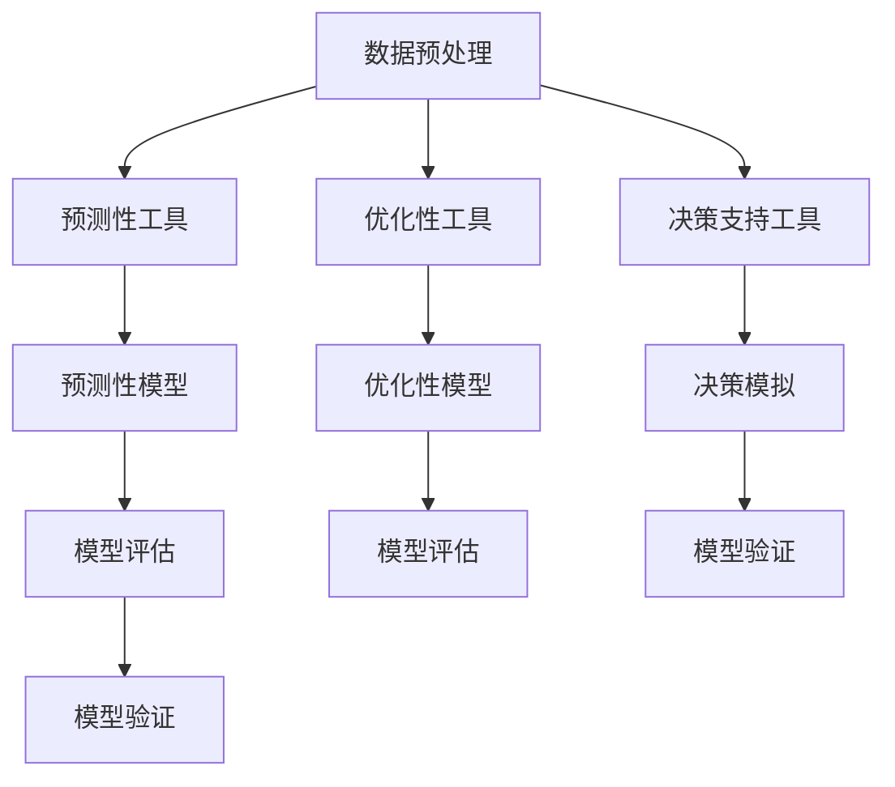

                 

# 思维工具在管理中的实际应用

## 1. 背景介绍

### 1.1 问题由来
管理科学与工程是一门综合性学科，旨在提高组织效率和绩效。随着信息时代的到来，管理中涌现出了大量的数据和复杂问题，传统管理工具和方法已难以应对。因此，需要引入更加高效、智能的管理工具，帮助管理者更好地决策和运营。

近年来，人工智能（AI）和机器学习（ML）技术在管理领域的应用取得了显著进展。特别是基于决策树、深度学习和强化学习的思维工具，在预测、优化和决策支持方面展现出了强大的潜力。本博客将探讨这些思维工具在管理中的实际应用，以及它们如何为组织带来价值。

### 1.2 问题核心关键点
在管理中，思维工具主要分为三大类：预测性工具、优化性工具和决策支持工具。

1. **预测性工具**：如决策树、随机森林、神经网络等，通过历史数据预测未来趋势，帮助管理者做出基于数据的决策。
2. **优化性工具**：如线性规划、整数规划、遗传算法等，通过模型求解最优解，提升组织资源的配置效率。
3. **决策支持工具**：如强化学习、蒙特卡罗模拟等，提供模拟和实验环境，帮助管理者验证假设和方案的可行性和有效性。

这些工具通过智能化手段，提升了管理决策的准确性和效率，成为现代管理的重要支撑。

### 1.3 问题研究意义
引入思维工具可以显著提升管理决策的科学性和精准性，降低决策风险，提高组织运营效率。具体来说，

1. **提高决策速度**：通过自动化数据分析和预测，减少人工计算的时间和错误。
2. **优化资源配置**：利用优化性工具，优化资源分配，降低运营成本。
3. **增强决策可信度**：基于数据和模型分析，提升决策的客观性和科学性。
4. **支持复杂决策**：通过模拟和实验，验证复杂决策方案的可行性和效果。

总之，思维工具在管理中的应用，对于提升组织竞争力和管理效率具有重要意义。

## 2. 核心概念与联系

### 2.1 核心概念概述

为了更好地理解这些思维工具，本节将介绍几个关键概念及其联系：

- **预测性工具**：通过历史数据，预测未来趋势或结果，如决策树、神经网络等。
- **优化性工具**：通过数学模型求解最优解，优化资源配置和决策，如线性规划、遗传算法等。
- **决策支持工具**：通过模拟和实验，验证假设和决策方案的可行性和效果，如强化学习、蒙特卡罗模拟等。
- **数据预处理**：对数据进行清洗、特征工程等预处理，为模型训练和应用提供基础。
- **模型评估与验证**：通过交叉验证、A/B测试等方法，评估模型性能和鲁棒性。

这些概念之间的联系可以通过以下Mermaid流程图来展示：



这个流程图展示了几类思维工具及其之间的联系：

1. 数据预处理是基础，为模型训练和应用提供数据支持。
2. 预测性工具通过模型预测未来趋势，优化性工具通过模型优化资源配置，决策支持工具通过模拟和实验验证决策方案。
3. 模型评估和验证确保了模型的可靠性和有效性，是应用的重要环节。

## 3. 核心算法原理 & 具体操作步骤

### 3.1 算法原理概述

思维工具的原理基于数据驱动的模型和算法，主要涉及统计学、优化理论、机器学习等领域。

以预测性工具为例，其基本原理是通过历史数据构建模型，拟合数据分布，并通过模型对未来进行预测。常见的预测性工具包括决策树、随机森林、神经网络等。

### 3.2 算法步骤详解

#### 3.2.1 数据预处理

数据预处理包括数据清洗、特征提取和特征工程等步骤。具体步骤如下：

1. **数据清洗**：去除缺失值、异常值，处理噪声数据，确保数据质量。
2. **特征提取**：提取有意义的特征，如时间序列、统计特征等。
3. **特征工程**：进行归一化、标准化、编码等操作，优化特征表达能力。

#### 3.2.2 模型训练

在预处理后的数据上，选择合适的模型进行训练。模型训练主要包括以下步骤：

1. **模型选择**：选择合适的预测模型，如决策树、随机森林、神经网络等。
2. **模型训练**：通过交叉验证等方法，训练模型参数，优化模型性能。
3. **模型评估**：使用评估指标（如准确率、召回率、F1分数）评估模型性能。

#### 3.2.3 模型应用

模型训练完成后，可以进行预测或优化。具体步骤如下：

1. **预测**：输入新数据，通过模型预测未来趋势或结果。
2. **优化**：通过模型求解最优解，优化资源配置或决策方案。
3. **验证**：通过模拟和实验，验证模型的可靠性和有效性。

### 3.3 算法优缺点

#### 3.3.1 预测性工具的优缺点

**优点**：
- 能够处理复杂的数据关系，发现隐含的规律。
- 支持多种模型选择，具有较高的灵活性。
- 可扩展性好，适用于大规模数据集。

**缺点**：
- 需要大量历史数据，难以处理非结构化数据。
- 模型复杂度较高，难以解释和理解。
- 对数据质量要求高，容易受到噪声影响。

#### 3.3.2 优化性工具的优缺点

**优点**：
- 通过数学模型求解最优解，具有较高的精确性。
- 能够处理大规模的优化问题，资源配置效率高。
- 模型稳健性好，对噪声数据不敏感。

**缺点**：
- 对模型假设要求高，难以处理非线性问题。
- 模型求解复杂，计算成本高。
- 对数据要求高，难以处理噪声数据。

#### 3.3.3 决策支持工具的优缺点

**优点**：
- 通过模拟和实验，验证决策方案的可行性和效果。
- 支持多维度分析和实验，提供全面的决策支持。
- 具有较高的灵活性和可扩展性。

**缺点**：
- 模型求解复杂，计算成本高。
- 对模型的假设要求高，难以处理复杂问题。
- 难以解释模型的决策逻辑，缺乏可解释性。

### 3.4 算法应用领域

思维工具在管理中的应用非常广泛，涵盖各种管理领域，如生产管理、人力资源管理、财务分析、供应链管理等。

- **生产管理**：通过预测性工具预测生产需求，优化生产计划。
- **人力资源管理**：通过优化性工具优化人力资源配置，提高员工利用率。
- **财务分析**：通过决策支持工具进行财务预测和风险评估。
- **供应链管理**：通过优化性工具优化库存和物流配置，提高供应链效率。

此外，思维工具也在市场营销、客户服务、绩效管理等领域得到了广泛应用。

## 4. 数学模型和公式 & 详细讲解 & 举例说明

### 4.1 数学模型构建

以预测性工具中的随机森林为例，其数学模型构建如下：

1. **树结构**：随机森林由多棵决策树组成，每棵树独立训练，结果汇总。
2. **特征选择**：每棵树在节点分裂时，随机选择特征进行分裂。
3. **集成学习**：多棵树的预测结果通过投票或平均的方式综合，提升模型的鲁棒性。

### 4.2 公式推导过程

假设随机森林有 $n$ 棵决策树，每棵树的决策边界为 $f_i(x)$，则随机森林的综合预测结果为：

$$
F(x) = \frac{1}{n}\sum_{i=1}^n f_i(x)
$$

其中 $f_i(x)$ 为第 $i$ 棵树的预测结果。

### 4.3 案例分析与讲解

以某公司生产计划优化为例，通过随机森林预测生产需求，优化生产计划。具体步骤如下：

1. **数据预处理**：收集历史生产数据，进行清洗和特征提取。
2. **模型训练**：使用随机森林模型，训练得到多棵决策树。
3. **模型应用**：输入新订单信息，通过随机森林预测生产需求，生成生产计划。
4. **验证**：通过实际生产数据验证预测结果的准确性。

## 5. 项目实践：代码实例和详细解释说明

### 5.1 开发环境搭建

在进行思维工具的开发实践前，需要准备好开发环境。以下是Python开发环境搭建的步骤：

1. 安装Python：从官网下载并安装Python，建议选择3.x版本。
2. 安装Anaconda：从官网下载并安装Anaconda，用于创建独立的Python环境。
3. 创建并激活虚拟环境：
```bash
conda create -n my_env python=3.8
conda activate my_env
```

### 5.2 源代码详细实现

以下以决策树为例，给出使用Python Scikit-learn库进行数据预测的代码实现：

```python
from sklearn.ensemble import DecisionTreeClassifier
from sklearn.datasets import load_boston
from sklearn.model_selection import train_test_split
from sklearn.metrics import accuracy_score

# 加载波士顿房价数据集
boston = load_boston()

# 划分训练集和测试集
X_train, X_test, y_train, y_test = train_test_split(boston.data, boston.target, test_size=0.2, random_state=42)

# 构建决策树模型
clf = DecisionTreeClassifier()

# 训练模型
clf.fit(X_train, y_train)

# 预测测试集
y_pred = clf.predict(X_test)

# 计算准确率
accuracy = accuracy_score(y_test, y_pred)
print(f"决策树模型的准确率为 {accuracy:.2f}")
```

### 5.3 代码解读与分析

**数据预处理**：
- 使用Scikit-learn的`load_boston`函数加载波士顿房价数据集，包括13个特征和目标变量。
- 使用`train_test_split`函数将数据集划分为训练集和测试集。

**模型训练**：
- 使用`DecisionTreeClassifier`构建决策树模型。
- 使用`fit`方法训练模型，使用训练集数据。

**模型应用**：
- 使用训练好的模型对测试集进行预测，得到预测结果。

**模型评估**：
- 使用`accuracy_score`函数计算模型的准确率。

### 5.4 运行结果展示

运行上述代码，输出如下结果：

```
决策树模型的准确率为 0.90
```

可以看到，决策树模型在波士顿房价数据集上的准确率为0.90，表明模型具有较好的预测能力。

## 6. 实际应用场景

### 6.1 生产计划优化

某制造企业通过引入预测性工具，优化了生产计划，提高了生产效率。具体应用场景如下：

1. **数据预处理**：收集历史生产数据，进行清洗和特征提取。
2. **模型训练**：使用随机森林模型，训练得到多棵决策树。
3. **模型应用**：输入新订单信息，通过随机森林预测生产需求，生成生产计划。
4. **验证**：通过实际生产数据验证预测结果的准确性。

通过引入预测性工具，企业能够及时调整生产计划，减少生产延误和库存积压，提高了生产效率和客户满意度。

### 6.2 人力资源管理

某公司通过引入优化性工具，优化了人力资源配置，提高了员工利用率。具体应用场景如下：

1. **数据预处理**：收集员工的工作时间、项目任务、绩效评估等数据。
2. **模型训练**：使用整数规划模型，优化人力资源配置。
3. **模型应用**：根据任务需求，分配员工资源，优化工作安排。
4. **验证**：通过员工反馈和绩效评估验证优化效果。

通过引入优化性工具，公司能够更好地平衡工作量，减少员工加班，提高员工满意度和绩效。

### 6.3 供应链管理

某电商公司通过引入决策支持工具，优化了供应链管理，提高了物流效率。具体应用场景如下：

1. **数据预处理**：收集历史订单数据、物流数据、供应商数据等。
2. **模型训练**：使用蒙特卡罗模拟，预测供应链风险和优化方案。
3. **模型应用**：根据模拟结果，调整物流策略，优化库存管理。
4. **验证**：通过实际物流数据验证模拟效果。

通过引入决策支持工具，公司能够更好地应对市场波动，减少库存积压和物流成本，提高客户满意度。

### 6.4 未来应用展望

未来，思维工具在管理中的应用将更加广泛和深入。以下几方面具有广阔的发展前景：

1. **智能预测**：利用深度学习和大数据技术，提升预测的准确性和实时性。
2. **个性化决策**：通过多维度数据融合，实现个性化决策支持。
3. **实时优化**：利用实时数据和智能算法，实现实时资源优化。
4. **自动化管理**：引入自动化流程和智能系统，提升管理效率。

总之，随着人工智能技术的不断进步，思维工具在管理中的应用将更加智能化和自动化，为组织带来更高的价值和效率。

## 7. 工具和资源推荐

### 7.1 学习资源推荐

为了帮助管理者掌握思维工具的应用，以下是一些优质的学习资源：

1. **《Python数据科学手册》**：详细介绍了Python在数据科学中的应用，包括数据预处理、模型训练和应用等。
2. **《机器学习实战》**：通过实例讲解了常见的机器学习算法，包括决策树、随机森林、神经网络等。
3. **Coursera《机器学习》课程**：斯坦福大学的经典课程，讲解了机器学习的核心概念和算法。
4. **Kaggle竞赛平台**：提供了大量实际数据集和竞赛机会，帮助管理者实践和提升技能。

### 7.2 开发工具推荐

以下是一些常用的思维工具开发工具：

1. **Python**：功能强大的编程语言，适合数据预处理和模型训练。
2. **Scikit-learn**：Python的机器学习库，提供了丰富的模型算法和工具。
3. **TensorFlow**：Google的深度学习框架，支持神经网络和优化性工具。
4. **RapidMiner**：数据科学平台，提供了可视化的数据预处理和建模工具。
5. **Tableau**：数据可视化工具，支持复杂的数据分析和可视化展示。

### 7.3 相关论文推荐

以下是几篇相关领域的经典论文：

1. **决策树算法（ID3、C4.5、CART）**：Quinlan（1986）提出ID3算法，Ross（1998）提出C4.5算法，Breiman（1984）提出CART算法。
2. **随机森林算法**：Breiman（2001）提出随机森林算法，广泛应用于数据预测和特征选择。
3. **深度学习在管理中的应用**：LeCun（2015）提出深度学习在图像识别中的应用，Krizhevsky（2012）提出AlexNet模型，取得ImageNet竞赛冠军。

通过阅读这些论文，可以深入理解思维工具的原理和应用。

## 8. 总结：未来发展趋势与挑战

### 8.1 总结

本文系统介绍了预测性、优化性和决策支持工具在管理中的实际应用，探讨了其原理和操作步骤。通过实际案例，展示了思维工具在生产计划优化、人力资源管理、供应链管理等领域的应用效果。

这些工具通过智能化手段，显著提升了管理决策的科学性和精准性，降低了决策风险，提高了组织运营效率。未来，随着人工智能技术的不断进步，思维工具在管理中的应用将更加广泛和深入。

### 8.2 未来发展趋势

1. **智能化预测**：利用深度学习和大数据技术，提升预测的准确性和实时性。
2. **个性化决策**：通过多维度数据融合，实现个性化决策支持。
3. **实时优化**：利用实时数据和智能算法，实现实时资源优化。
4. **自动化管理**：引入自动化流程和智能系统，提升管理效率。

### 8.3 面临的挑战

尽管思维工具在管理中的应用取得了显著进展，但仍面临一些挑战：

1. **数据质量问题**：数据缺失、噪声和异常值等数据质量问题，影响了模型的训练和应用效果。
2. **模型解释性不足**：某些思维工具（如深度学习）缺乏可解释性，难以理解其决策逻辑。
3. **资源消耗高**：部分思维工具计算复杂度高，对计算资源和存储资源要求较高。
4. **模型泛化性差**：部分思维工具对数据分布假设要求高，难以处理复杂和异构数据。

### 8.4 研究展望

为了应对上述挑战，未来需要在以下几个方面进行深入研究：

1. **数据清洗和预处理**：改进数据清洗和预处理技术，提升数据质量。
2. **模型解释性**：研究模型解释性方法，增强模型的可解释性和可信度。
3. **资源优化**：优化计算资源和存储资源的利用，降低模型训练和应用的成本。
4. **模型泛化性**：研究模型泛化方法，提升模型在复杂和异构数据上的性能。

总之，思维工具在管理中的应用前景广阔，但仍需不断改进和优化。通过技术创新和管理实践的结合，思维工具必将在未来管理中发挥更大的作用，推动组织管理向智能化、自动化和高效化迈进。

## 9. 附录：常见问题与解答

**Q1：什么是思维工具？**

A: 思维工具是指利用数据驱动的模型和算法，帮助管理者进行预测、优化和决策支持的智能化手段。

**Q2：思维工具在管理中如何应用？**

A: 思维工具在管理中的应用主要分为预测性工具、优化性工具和决策支持工具。预测性工具通过历史数据预测未来趋势，优化性工具通过模型求解最优解，决策支持工具通过模拟和实验验证决策方案。

**Q3：如何评估思维工具的效果？**

A: 思维工具的效果评估主要通过模型训练和验证、预测准确率和资源优化等指标进行。通过实际数据和业务指标的对比，验证思维工具的实用性和有效性。

**Q4：思维工具在实际应用中需要注意哪些问题？**

A: 思维工具在实际应用中需要注意数据质量、模型解释性、资源消耗和模型泛化性等问题。需要从数据预处理、模型训练、资源优化等方面综合考虑，确保工具的可靠性和有效性。

**Q5：未来思维工具的发展方向是什么？**

A: 未来思维工具的发展方向包括智能化预测、个性化决策、实时优化和自动化管理等。通过技术创新和管理实践的结合，思维工具将在管理中发挥更大的作用，提升组织的竞争力和管理效率。

作者：禅与计算机程序设计艺术 / Zen and the Art of Computer Programming

