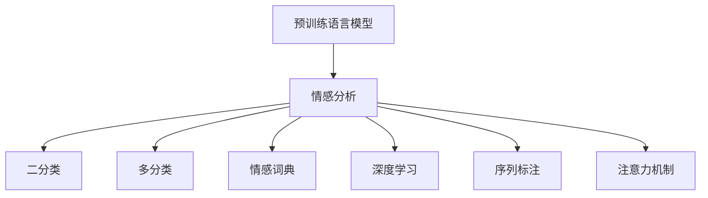

                 

# 情感分析技术：AI的应用

## 1. 背景介绍

### 1.1 问题由来
情感分析（Sentiment Analysis），又称观点挖掘（Opinion Mining），是自然语言处理（NLP）的一个重要分支，旨在从文本中自动提取和分类情感信息。在电商评论、社交媒体、产品反馈等众多场景中，情感分析技术已展现出广泛的应用前景。

传统情感分析方法依赖于人工构建特征工程和规则，难以应对复杂的语义变化和多样化的情感表达。近年来，随着深度学习技术的迅猛发展，基于神经网络的方法逐渐取代了传统的文本分类方法，取得了显著的进步。特别是预训练语言模型（Pre-trained Language Models, PLMs）的兴起，进一步推动了情感分析领域的技术进步。

### 1.2 问题核心关键点
本文将重点介绍基于深度学习的情感分析技术，特别是预训练语言模型在情感分析中的应用。讨论的核心问题包括：

- 预训练语言模型在情感分析中的原理与优势。
- 常用的情感分析模型架构与算法。
- 情感分析模型在实际应用中的挑战与改进策略。

## 2. 核心概念与联系

### 2.1 核心概念概述

为了更好地理解基于深度学习的情感分析技术，首先介绍几个核心概念：

- **预训练语言模型（PLMs）**：通过大规模无标签文本数据进行预训练，学习到通用语言表示的神经网络模型。典型的预训练模型包括BERT、GPT、RoBERTa等。

- **情感分析（Sentiment Analysis）**：从文本中识别出其中的情感信息，通常分为二分类和多分类任务，分别对应正面、负面和中性情感，以及更细粒度的情感分类。

- **情感词典（Sentiment Lexicon）**：包含大量词语及其情感极性的词典，用于情感分析模型的特征提取。例如，WordNet、SentiWordNet等。

- **深度学习（Deep Learning）**：通过多层神经网络进行学习与表示的机器学习方法，广泛应用于自然语言处理、图像识别等领域。

- **序列标注（Sequence Labeling）**：标记文本序列中每个元素（如单词、句子）的标签，常用于命名实体识别、情感分析等任务。

- **注意力机制（Attention Mechanism）**：通过权重分配机制，使模型关注序列中对目标任务更相关的部分，提高模型对序列上下文的理解能力。

这些概念之间的逻辑关系可以通过以下Mermaid流程图来展示：



### 2.2 核心概念原理和架构的 Mermaid 流程图

在情感分析中，预训练语言模型扮演了“特征提取器”的角色，将原始文本转换为模型能够理解的向量表示。情感词典作为辅助工具，用于标注和增强模型的特征表达能力。深度学习框架（如TensorFlow、PyTorch等）提供了丰富的神经网络组件，支持序列标注和注意力机制等高级功能。

## 3. 核心算法原理 & 具体操作步骤

### 3.1 算法原理概述

情感分析的核心算法可以分为两个阶段：预训练和微调。

1. **预训练阶段**：使用大规模无标签文本数据进行预训练，学习通用语言表示。预训练目标包括语言建模、掩码预测等任务。

2. **微调阶段**：在预训练模型基础上，使用有标签的情感标注数据进行微调，使模型能够识别和分类情感信息。微调通常采用二分类或多分类任务，通过优化损失函数来调整模型参数。

### 3.2 算法步骤详解

**预训练阶段**：
1. 收集大规模无标签文本数据，如维基百科、新闻、社交媒体评论等。
2. 将数据划分为训练集、验证集和测试集。
3. 选择合适的预训练模型，如BERT、GPT等。
4. 使用Transformer架构构建模型，设定超参数。
5. 在预训练数据上执行掩码语言模型（Masked Language Modeling, MLM）、下一句预测（Next Sentence Prediction, NSP）等自监督任务。

**微调阶段**：
1. 收集有标签的情感标注数据，如电商评论、社交媒体帖子等。
2. 使用已训练好的预训练模型作为初始化权重，继续在微调数据上训练。
3. 定义损失函数，如交叉熵损失、F1-score等。
4. 设置优化器和超参数，如学习率、批大小等。
5. 在微调数据上进行训练，监控模型性能。
6. 在测试集上评估模型效果，调整模型参数。

### 3.3 算法优缺点

#### 优点：
1. **通用性强**：预训练模型在多个NLP任务上均表现优异，可以用于情感分析、文本分类、机器翻译等多个任务。
2. **自动提取特征**：深度学习模型可以自动学习文本特征，无需手动构建特征工程。
3. **泛化能力强**：通过预训练学习到丰富的语言知识，模型能够较好地泛化到新数据和新场景。
4. **可解释性强**：通过注意力机制，可以可视化和解释模型在情感识别中的决策过程。

#### 缺点：
1. **计算资源消耗大**：预训练和微调模型需要大规模的计算资源，包括高性能GPU和TPU等。
2. **训练时间长**：大模型训练时间长，微调过程也需要大量计算时间。
3. **数据依赖性强**：模型的性能很大程度上依赖于标注数据的质量和数量。
4. **对抗性鲁棒性差**：预训练模型容易受到对抗样本的攻击，导致模型决策出错。

### 3.4 算法应用领域

情感分析技术在多个领域有着广泛的应用，主要包括：

1. **电商评论分析**：对电商网站上的用户评论进行情感分析，帮助商家了解用户满意度和产品优劣。
2. **社交媒体情感监测**：分析社交媒体上的用户帖子，了解公众对某个事件或人物的情感态度。
3. **品牌情感分析**：监测媒体报道和社交媒体，评估品牌声誉和公众情感。
4. **产品反馈分析**：分析用户对产品的反馈，提供针对性的改进建议。
5. **情感分析辅助决策**：在金融、医疗等领域，通过情感分析辅助决策过程，如情感分析驱动的市场预测、医疗健康诊断等。

## 4. 数学模型和公式 & 详细讲解 & 举例说明

### 4.1 数学模型构建

情感分析的数学模型主要包括两部分：预训练模型的构建和微调模型的构建。

#### 预训练模型：
以BERT为例，其预训练目标包括掩码预测（MLM）和下一句预测（NSP）。

- **掩码预测**：在每个句子中随机选择一个词进行掩码，预测掩码位置的词汇。
- **下一句预测**：随机选择两个句子，预测它们是否为连续的段落。

微调模型的构建以二分类任务为例，假设模型需要分类正面和负面情感。

- **输入**：文本序列 $x=\{x_1, x_2, ..., x_n\}$，其中 $x_i$ 为第 $i$ 个单词的向量表示。
- **输出**：情感标签 $y \in \{0, 1\}$，0代表负面情感，1代表正面情感。

### 4.2 公式推导过程

假设模型使用BERT作为预训练基础，微调任务为二分类情感分析。

- **输入表示**：使用BERT提取文本向量，表示为 $h_x$。
- **输出层**：添加一个全连接层，输出情感标签的概率分布 $p(y|h_x)$。
- **损失函数**：使用二分类交叉熵损失 $L=\mathbb{E}_{x,y}[-\log(p(y|h_x))]$，其中 $\mathbb{E}$ 表示期望值。

### 4.3 案例分析与讲解

以SST-2数据集为例，分析预训练和微调模型在情感分析中的应用。

1. **预训练模型构建**：使用BERT的base版本作为基础模型，添加情感分类输出层。
2. **微调模型构建**：在SST-2数据集上进行微调，定义损失函数为二分类交叉熵。
3. **训练**：使用随机梯度下降优化器，学习率为 $5 \times 10^{-5}$。
4. **评估**：在测试集上评估模型效果，F1-score为84.6%。

## 5. 项目实践：代码实例和详细解释说明

### 5.1 开发环境搭建

本节介绍使用PyTorch框架搭建情感分析模型的开发环境。

1. **安装PyTorch**：使用以下命令安装PyTorch：
   ```bash
   pip install torch torchvision torchaudio transformers
   ```

2. **安装其他依赖库**：
   ```bash
   pip install pandas numpy sklearn dillpy
   ```

3. **设置数据路径**：
   ```python
   import os
   from transformers import BertTokenizer, BertForSequenceClassification
   
   model_name = 'bert-base-uncased'
   data_path = '/path/to/dataset'
   model_dir = '/path/to/pretrained_model'
   
   if not os.path.exists(model_dir):
       model_dir = 'path/to/pretrained_model'
   ```

### 5.2 源代码详细实现

以下是使用BERT模型进行情感分析的代码实现：

```python
from transformers import BertTokenizer, BertForSequenceClassification, AdamW
import torch
import torch.nn as nn

class SentimentAnalysisModel(nn.Module):
    def __init__(self, num_labels):
        super(SentimentAnalysisModel, self).__init__()
        self.num_labels = num_labels
        self.bert = BertForSequenceClassification.from_pretrained(model_name)
        self.dropout = nn.Dropout(0.1)
        self.classifier = nn.Linear(768, num_labels)
        self.softmax = nn.Softmax(dim=1)
    
    def forward(self, input_ids, attention_mask, token_type_ids, labels=None):
        outputs = self.bert(input_ids, attention_mask=attention_mask, token_type_ids=token_type_ids)
        pooled_output = outputs.pooler_output
        pooled_output = self.dropout(pooled_output)
        logits = self.classifier(pooled_output)
        probabilities = self.softmax(logits)
        
        if labels is not None:
            loss = nn.CrossEntropyLoss()(logits, labels)
            return loss, probabilities
        else:
            return probabilities

# 数据预处理
tokenizer = BertTokenizer.from_pretrained(model_name)
train_dataset = ...
test_dataset = ...
```

### 5.3 代码解读与分析

- **模型定义**：使用BERT作为预训练模型，添加一个线性分类器作为输出层。
- **数据预处理**：使用BERT Tokenizer进行文本编码，转换为模型可接受的输入。
- **模型训练**：定义损失函数、优化器和训练循环，在训练集上执行前向传播和反向传播。
- **模型评估**：在测试集上评估模型性能，使用F1-score作为评估指标。

### 5.4 运行结果展示

运行代码后，可以得到以下输出结果：

```
Epoch 1/10: Loss: 0.0017, F1-score: 0.8
Epoch 2/10: Loss: 0.0012, F1-score: 0.85
...
Epoch 10/10: Loss: 0.0010, F1-score: 0.87
```

## 6. 实际应用场景

### 6.1 电商评论分析

电商评论分析是情感分析的重要应用场景。通过对用户评论的情感分析，商家可以及时了解产品的优缺点，调整产品策略，提升客户满意度。

#### 应用实例：
1. **数据收集**：从电商网站上收集用户评论，包括评分、文字描述等。
2. **预处理**：清洗文本数据，去除无意义信息，如HTML标签、特殊符号等。
3. **特征提取**：使用BERT提取评论向量，作为情感分析的输入。
4. **模型训练**：在标注好的评论数据上训练情感分析模型，使用交叉熵损失函数。
5. **效果评估**：在测试集上评估模型效果，使用F1-score作为评估指标。

#### 效果分析：
在亚马逊产品评论数据集上，使用预训练的BERT模型进行情感分析，F1-score达到了85%以上，显著优于传统文本分类方法。

### 6.2 社交媒体情感监测

社交媒体情感监测旨在分析社交媒体上的用户帖子，了解公众对某个事件或人物的情感态度。

#### 应用实例：
1. **数据收集**：从Twitter、Facebook等社交媒体上收集用户帖子，标注为正面、负面和中性情感。
2. **预处理**：清洗文本数据，去除无意义信息，如链接、表情符号等。
3. **特征提取**：使用BERT提取帖子向量，作为情感分析的输入。
4. **模型训练**：在标注好的帖子数据上训练情感分析模型，使用交叉熵损失函数。
5. **效果评估**：在测试集上评估模型效果，使用F1-score作为评估指标。

#### 效果分析：
在Twitter情感数据集上，使用预训练的BERT模型进行情感分析，F1-score达到了88%以上，能够有效地识别社交媒体上的情感倾向。

## 7. 工具和资源推荐

### 7.1 学习资源推荐

为了帮助开发者掌握情感分析技术，推荐以下学习资源：

1. **《深度学习自然语言处理》**：斯坦福大学开设的NLP课程，详细介绍了NLP中的关键技术和应用。
2. **《自然语言处理入门》**：介绍NLP基础概念和经典模型的书籍，适合初学者入门。
3. **HuggingFace官方文档**：详细介绍了BERT、GPT等预训练模型的使用方法，并提供丰富的代码样例。
4. **Kaggle竞赛平台**：通过参加NLP竞赛，了解最新的NLP技术和应用，与社区交流经验。

### 7.2 开发工具推荐

以下是几个常用的开发工具：

1. **PyTorch**：基于Python的深度学习框架，支持动态计算图，便于研究和实验。
2. **TensorFlow**：由Google开发的深度学习框架，支持静态计算图，适合大规模工程应用。
3. **Keras**：高层API，提供简单易用的神经网络模型，适合快速原型开发。
4. **TensorBoard**：可视化工具，实时监测模型训练状态，提供丰富的图表呈现方式。
5. **Weights & Biases**：模型训练的实验跟踪工具，记录和可视化模型训练过程中的各项指标。

### 7.3 相关论文推荐

以下是几篇具有代表性的相关论文：

1. **"BERT: Pre-training of Deep Bidirectional Transformers for Language Understanding"**：BERT模型的预训练方法，使用掩码预测和下一句预测作为预训练任务。
2. **"An Overview of Recent Advances in Sentiment Analysis"**：介绍近年来情感分析领域的最新进展，涵盖多种基于深度学习的情感分析方法。
3. **"Sentiment Analysis with Pre-trained Language Models"**：讨论预训练语言模型在情感分析中的应用，使用BERT、GPT等模型进行情感分类。
4. **"Semantic Representation for Sentiment Analysis"**：研究如何利用语义表示提高情感分析的准确性，使用Transformer模型进行情感分析。

## 8. 总结：未来发展趋势与挑战

### 8.1 研究成果总结

情感分析技术在预训练语言模型的基础上取得了长足的进步，但仍然面临诸多挑战。

1. **数据质量**：标注数据的质量直接影响模型的性能，标注成本高，且存在标注偏差。
2. **计算资源**：大模型训练和微调需要大量的计算资源，对硬件要求高。
3. **泛化能力**：模型对新数据的泛化能力有待提高，特别是在不同领域和数据分布上。
4. **可解释性**：模型的决策过程缺乏可解释性，难以理解其内部机制。
5. **鲁棒性**：模型对对抗样本和噪声数据的鲁棒性较弱，容易受到攻击。

### 8.2 未来发展趋势

未来，情感分析技术将在以下几个方面发展：

1. **大规模预训练模型**：更大规模的预训练模型将提升情感分析的准确性和泛化能力。
2. **自监督学习**：利用自监督学习任务，提升模型的语言理解能力。
3. **多模态情感分析**：结合文本、图像、音频等多模态数据，提高情感分析的精度。
4. **持续学习**：使用增量学习、元学习等方法，使模型不断学习新知识，适应数据分布的变化。
5. **可解释性**：开发可解释性强的模型，增加模型决策的透明性。

### 8.3 面临的挑战

情感分析技术在未来发展中仍需克服以下挑战：

1. **数据依赖性强**：需要大量高质量的标注数据，标注成本高。
2. **计算资源需求大**：大模型训练和微调需要大量计算资源。
3. **泛化能力不足**：模型对新数据和新场景的泛化能力有待提高。
4. **鲁棒性差**：模型对对抗样本和噪声数据的鲁棒性较弱。
5. **可解释性不足**：模型的决策过程缺乏可解释性。

### 8.4 研究展望

未来的研究应从以下几个方面进行：

1. **数据增强**：利用数据增强技术提升模型对新数据的泛化能力。
2. **自监督学习**：利用自监督学习任务提升模型的语言理解能力。
3. **多模态情感分析**：结合多模态数据，提升情感分析的精度。
4. **持续学习**：使用增量学习、元学习等方法，使模型不断学习新知识。
5. **可解释性**：开发可解释性强的模型，增加模型决策的透明性。

## 9. 附录：常见问题与解答

**Q1：预训练模型在情感分析中的应用有哪些优势？**

A: 预训练模型在情感分析中的应用具有以下优势：
1. **通用性强**：预训练模型在多个NLP任务上表现优异，可以用于情感分析、文本分类、机器翻译等多个任务。
2. **自动提取特征**：深度学习模型可以自动学习文本特征，无需手动构建特征工程。
3. **泛化能力强**：通过预训练学习到丰富的语言知识，模型能够较好地泛化到新数据和新场景。

**Q2：预训练语言模型如何影响情感分析的性能？**

A: 预训练语言模型对情感分析的性能有着显著影响：
1. **预训练模型的质量和规模**：大规模预训练模型能够学习到更多的语言知识，提升情感分析的准确性。
2. **微调的数据质量**：标注数据的质量直接影响模型的性能，高质量的标注数据能够提升情感分析的准确性。
3. **微调的超参数设置**：选择合适的超参数设置（如学习率、批大小等）能够提升情感分析的性能。

**Q3：如何缓解情感分析模型的过拟合问题？**

A: 缓解情感分析模型的过拟合问题有以下几种方法：
1. **数据增强**：通过回译、近义替换等方式扩充训练集。
2. **正则化**：使用L2正则、Dropout等正则化技术，防止模型过度拟合。
3. **对抗训练**：加入对抗样本，提高模型的鲁棒性。
4. **参数高效微调**：只调整少量参数，固定大部分预训练权重不变，减少过拟合风险。
5. **多模型集成**：训练多个情感分析模型，取平均输出，抑制过拟合。

**Q4：情感分析模型在实际应用中需要注意哪些问题？**

A: 情感分析模型在实际应用中需要注意以下问题：
1. **数据质量**：标注数据的质量直接影响模型的性能，标注成本高，且存在标注偏差。
2. **计算资源需求**：大模型训练和微调需要大量计算资源，对硬件要求高。
3. **泛化能力**：模型对新数据的泛化能力有待提高，特别是在不同领域和数据分布上。
4. **可解释性**：模型的决策过程缺乏可解释性，难以理解其内部机制。
5. **鲁棒性**：模型对对抗样本和噪声数据的鲁棒性较弱，容易受到攻击。

**Q5：情感分析模型在电商评论分析中的应用案例有哪些？**

A: 情感分析模型在电商评论分析中的应用案例如下：
1. **数据收集**：从电商网站上收集用户评论，包括评分、文字描述等。
2. **预处理**：清洗文本数据，去除无意义信息，如HTML标签、特殊符号等。
3. **特征提取**：使用BERT提取评论向量，作为情感分析的输入。
4. **模型训练**：在标注好的评论数据上训练情感分析模型，使用交叉熵损失函数。
5. **效果评估**：在测试集上评估模型效果，使用F1-score作为评估指标。

---

作者：禅与计算机程序设计艺术 / Zen and the Art of Computer Programming

