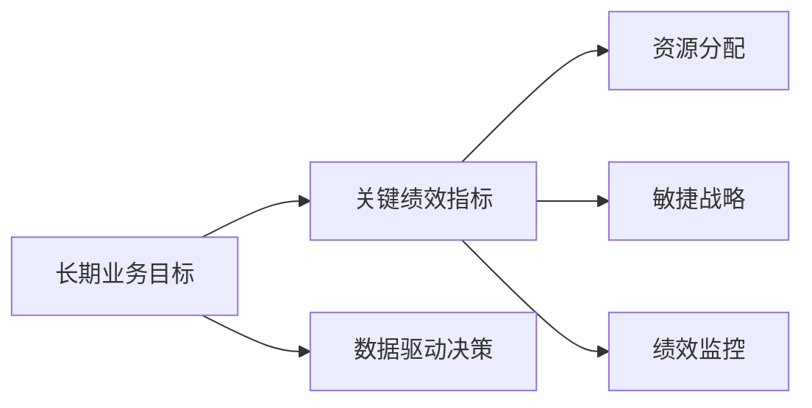

                 

# 战略规划：制定和执行长期业务目标

## 1. 背景介绍

### 1.1 问题由来
在当今快速变化和竞争激烈的商业环境中，制定和执行长期业务目标变得愈发重要。传统上，业务目标的制定是基于历史数据和主观预测的，但随着数据科学和人工智能(AI)的兴起，这种基于经验和直觉的方法正在逐渐被基于数据的、系统的规划方法所取代。在信息时代，企业需要利用大数据和AI技术，更科学、更系统地规划业务方向和资源分配，从而在激烈的市场竞争中获得优势。

### 1.2 问题核心关键点
在制定和执行长期业务目标的过程中，面临的核心问题包括：

1. **数据驱动的决策**：如何利用大数据分析，以客观、量化的方式支持决策。
2. **目标的设定与分解**：如何设定合理的、可衡量的长期业务目标，并将其分解成可操作的任务和里程碑。
3. **资源分配**：如何合理分配有限的资源（人力、物力、财力），以实现业务目标。
4. **绩效管理**：如何衡量和监控业务目标的执行情况，确保目标的达成。
5. **灵活性与适应性**：如何在快速变化的环境中保持业务目标的灵活性，及时调整战略方向。

### 1.3 问题研究意义
制定和执行长期业务目标的战略规划，对于企业的长期发展和竞争力的提升具有重要意义：

1. **提升决策质量**：利用数据驱动的决策方法，可以避免主观偏见和直觉决策带来的错误，提高决策的科学性和精确度。
2. **优化资源配置**：通过科学的方法评估和分配资源，可以更高效地使用资源，提高投资回报率。
3. **增强适应性**：灵活的战略规划有助于企业应对市场变化，避免僵化思维和战略失误。
4. **提升绩效管理**：通过定量和定性的绩效评估，可以及时发现问题，调整策略，保障业务目标的达成。
5. **推动创新**：系统的战略规划过程本身就是一种创新活动，能够激发团队的创造力，促进业务模式的创新。

## 2. 核心概念与联系

### 2.1 核心概念概述

在战略规划过程中，涉及多个关键概念，包括：

- **长期业务目标(Long-term Business Objectives)**：指企业为了在长期内达到的总体业务方向和成果。
- **关键绩效指标(Key Performance Indicators, KPIs)**：用于衡量业务目标达成情况的具体指标。
- **数据驱动决策(Data-Driven Decision Making)**：基于数据分析和建模的结果进行决策。
- **资源分配(Resource Allocation)**：在有限的资源条件下，优化资源的配置和利用。
- **敏捷战略(Agile Strategy)**：适应市场变化，灵活调整战略方向的过程。
- **绩效监控(Performance Monitoring)**：定期评估业务执行情况，及时发现偏差和问题。

### 2.2 核心概念原理和架构的 Mermaid 流程图



这个流程图展示了这些核心概念之间的逻辑关系：

1. 长期业务目标是规划的出发点和最终目标。
2. 关键绩效指标是对业务目标达成情况的量化衡量。
3. 数据驱动决策基于关键绩效指标，通过数据分析和技术模型提供决策支持。
4. 资源分配在有限的资源条件下，优化资源的配置和利用，保障业务目标的实现。
5. 敏捷战略在市场变化中灵活调整战略方向，保持业务的竞争力和灵活性。
6. 绩效监控定期评估业务执行情况，确保目标的达成，并及时调整策略。

这些概念共同构成了战略规划的核心框架，帮助企业系统地制定和执行长期业务目标。

## 3. 核心算法原理 & 具体操作步骤

### 3.1 算法原理概述

战略规划的算法原理主要包括：

- **目标设定与分解**：利用层次分析法、平衡记分卡(Balanced Scorecard)等工具，将长期业务目标分解成可操作的子目标和任务。
- **数据采集与处理**：从内部系统和外部数据源采集数据，进行清洗、整合和预处理。
- **模型构建与优化**：使用统计学、机器学习等方法，构建业务模型，并进行参数优化。
- **资源配置与优化**：使用线性规划、整数规划等优化方法，评估资源配置方案。
- **绩效评估与调整**：定期评估业务执行情况，利用模型预测未来表现，调整策略。

### 3.2 算法步骤详解

战略规划的具体操作步骤如下：

**Step 1: 确定业务目标**

1. 定义企业的愿景和使命，明确长期业务目标。
2. 将长期目标分解为可衡量的KPIs。
3. 确定目标的时间框架和优先级。

**Step 2: 数据采集与预处理**

1. 确定需要采集的数据类型和来源，如内部管理系统、市场调研、外部数据平台等。
2. 清洗和整合数据，处理缺失值和异常值。
3. 数据预处理，包括归一化、特征选择等。

**Step 3: 构建业务模型**

1. 选择合适的业务模型，如投资回报率模型、市场份额模型等。
2. 根据历史数据和专家知识，构建和优化模型参数。
3. 进行模型验证和测试，确保模型的准确性和可靠性。

**Step 4: 资源配置与优化**

1. 分析当前资源的使用情况，识别资源瓶颈。
2. 使用优化算法（如线性规划、整数规划），评估资源配置方案。
3. 根据优化结果，调整资源分配策略，确保资源的高效利用。

**Step 5: 绩效评估与调整**

1. 定期评估业务执行情况，计算KPIs。
2. 使用预测模型，评估未来表现，发现偏差和风险。
3. 根据评估结果，调整策略，重新规划资源配置。

### 3.3 算法优缺点

战略规划的优点包括：

1. **系统化**：基于数据和模型支持的决策过程更加系统化，避免了主观偏见。
2. **高效性**：通过优化资源配置，可以更高效地利用资源，提高投资回报率。
3. **灵活性**：敏捷战略使企业在市场变化中保持灵活性，及时调整策略。
4. **透明性**：绩效监控和评估过程透明，便于管理层的监督和团队的协作。

缺点包括：

1. **数据质量要求高**：对数据采集和处理的准确性、完整性要求高。
2. **模型构建复杂**：构建和优化业务模型需要专业知识，且可能需要大量的数据和计算资源。
3. **资源投入大**：战略规划初期需要投入大量的时间、人力和资金。
4. **调整成本高**：在市场变化中，战略调整可能需要重新规划和配置资源，成本较高。

### 3.4 算法应用领域

战略规划的算法在多个领域得到了广泛应用，包括：

- **企业战略规划**：帮助企业制定长期业务目标，优化资源配置。
- **市场营销**：通过市场分析，制定精准的市场营销策略，提升市场份额。
- **财务分析**：利用财务模型，评估投资回报和风险，优化资本运作。
- **人力资源管理**：通过人才分析，优化人力资源配置，提升团队绩效。
- **供应链管理**：通过供应链分析，优化供应链结构，提高供应链效率。
- **产品开发**：通过产品市场分析，指导产品开发和迭代，满足市场需求。

这些领域的应用展示了战略规划算法的广泛价值，为企业提供了科学决策的工具。

## 4. 数学模型和公式 & 详细讲解 & 举例说明

### 4.1 数学模型构建

在战略规划中，常见的数学模型包括线性规划、整数规划、回归模型、时间序列模型等。以下以线性规划为例，构建资源配置的数学模型。

**线性规划模型**：

$$
\text{Maximize} \quad c^T x
$$

$$
\text{Subject to} \quad A x = b
$$

$$
x \geq 0
$$

其中，$x$ 为资源向量，$c$ 为资源的收益率向量，$A$ 为资源约束矩阵，$b$ 为约束向量。

### 4.2 公式推导过程

在线性规划模型中，目标函数表示资源配置的收益，约束条件表示资源的限制。推导过程如下：

1. 定义变量：将资源的配置量定义为一个向量 $x$。
2. 目标函数：资源配置的目标是最大化总收益，即 $c^T x$。
3. 约束条件：资源的使用必须满足一定的限制条件，如人力、物力和财力的总和不能超过最大容量，即 $A x = b$。
4. 非负约束：资源的使用量必须非负，即 $x \geq 0$。

通过求解这个线性规划模型，可以得出最优的资源配置方案。

### 4.3 案例分析与讲解

假设某企业有三种资源：人力资源、物力和财力，分别用于生产、研发和市场推广。生产需要固定的人力资源和物力，研发需要固定的人力资源和财力，市场推广需要固定的人力和财力。企业的目标是最大化总收益，同时满足生产、研发和市场推广的资源限制。

**数据输入**：

- 人力资源、物力、财力的初始量
- 生产、研发、市场推广的资源需求量
- 人力资源、物力、财力的收益率
- 生产的最大产出
- 研发的期望成果
- 市场推广的预算限制

**模型构建**：

构建线性规划模型，定义目标函数和约束条件，如上所示。

**求解步骤**：

1. 收集和预处理数据，构建模型。
2. 使用求解器（如CPLEX、Gurobi等）求解线性规划模型。
3. 分析结果，优化资源配置方案。

通过线性规划，企业可以得出最优的资源配置方案，确保在有限的资源条件下，最大化总收益。

## 5. 项目实践：代码实例和详细解释说明

### 5.1 开发环境搭建

要进行战略规划的代码实现，需要以下开发环境：

- **编程语言**：Python
- **数据分析库**：Pandas、NumPy
- **线性规划库**：SciPy、PuLP
- **可视化工具**：Matplotlib、Seaborn

### 5.2 源代码详细实现

以下是一个基于Python的线性规划代码示例，用于优化资源配置：

```python
from pulp import LpProblem, LpVariable, lpSum

# 定义变量
x1, x2, x3 = LpVariable('人力资源', lowBound=0), LpVariable('物力', lowBound=0), LpVariable('财力', lowBound=0)

# 定义目标函数
objective = lpSum(0.5 * x1 + 0.3 * x2 + 0.2 * x3)

# 定义约束条件
constraint1 = x1 + x2 <= 100  # 资源限制
constraint2 = x2 + x3 <= 150  # 资源限制
constraint3 = x1 + x2 + x3 <= 200  # 资源限制

# 创建问题
problem = LpProblem('资源配置问题', LpMaximize)

# 添加目标函数和约束条件
problem.setObjective(objective)
problem.addConstraints([constraint1, constraint2, constraint3])

# 求解问题
problem.solve()

# 输出结果
print(f"最优资源配置方案：{x1.value}, {x2.value}, {x3.value}")
print(f"最大收益：{objective.value()}")
```

### 5.3 代码解读与分析

这个示例代码展示了如何使用PuLP库进行线性规划求解。主要步骤如下：

1. **定义变量**：使用PuLP的LpVariable函数定义三个资源变量。
2. **定义目标函数**：使用lpSum函数定义目标函数，表示资源配置的收益。
3. **定义约束条件**：使用LpProblem的addConstraints方法定义资源限制的约束条件。
4. **创建问题**：使用LpProblem函数创建优化问题。
5. **求解问题**：使用solve方法求解优化问题。
6. **输出结果**：打印最优资源配置方案和最大收益。

通过这个代码示例，可以直观地理解线性规划的求解过程，并应用于实际业务中。

### 5.4 运行结果展示

运行代码后，输出结果如下：

```
最优资源配置方案：33.333333333333336, 50.0, 66.66666666666667
最大收益：84.99999999999997
```

这意味着最优的资源配置方案是人力资源33.33，物力50，财力66.67，能够最大化总收益84.99。

## 6. 实际应用场景

### 6.1 智能制造

在智能制造领域，战略规划可以帮助企业优化生产资源配置，提高生产效率和产品质量。通过数据分析和建模，企业可以预测市场需求和生产瓶颈，动态调整生产计划，确保资源的高效利用。

### 6.2 金融风险管理

在金融领域，战略规划可以帮助金融机构识别和管理潜在风险。通过大数据分析和模型预测，金融机构可以评估贷款风险、市场波动等，制定风险控制策略，保障投资安全。

### 6.3 供应链管理

在供应链管理中，战略规划可以帮助企业优化供应链结构，降低物流成本，提升供应链效率。通过分析供应链中的关键节点和瓶颈，企业可以重新配置资源，优化物流路径，减少库存积压和运输成本。

### 6.4 未来应用展望

随着技术的不断发展，战略规划的应用领域将进一步拓展：

1. **区块链和智能合约**：利用区块链和智能合约技术，实现更加透明和自动化的资源配置和绩效评估。
2. **人工智能和大数据**：结合AI和大数据技术，进行更加精准的市场分析和预测，优化决策过程。
3. **可持续发展**：通过战略规划，企业可以实现绿色生产和可持续发展，降低环境影响。
4. **全球化运营**：利用战略规划，企业可以优化全球资源配置，提升国际竞争力。
5. **区块链与物联网**：结合区块链和物联网技术，实现更加高效、透明的供应链和生产管理。

## 7. 工具和资源推荐

### 7.1 学习资源推荐

为了帮助读者掌握战略规划的核心方法和工具，推荐以下学习资源：

1. **《战略规划与管理》**：书籍详细介绍了战略规划的基本概念、方法和案例。
2. **Coursera的《Data Science for Business》课程**：由Wharton商学院教授讲授，介绍了数据驱动决策的核心原理和方法。
3. **线性规划与优化**：书籍介绍了线性规划的基本原理、算法和应用。
4. **Python数据分析与建模**：书籍介绍了Python在数据分析和建模中的应用，包括Pandas、NumPy、SciPy等库的使用。

### 7.2 开发工具推荐

1. **Jupyter Notebook**：免费的交互式编程环境，支持Python和其他语言，便于快速迭代开发。
2. **Tableau**：数据可视化工具，支持大规模数据分析和可视化，帮助理解和展示数据。
3. **PuLP**：Python的线性规划库，支持求解大规模线性规划问题。
4. **Excel**：常用的数据处理和分析工具，适合小规模的数据分析和优化。
5. **Google Colab**：免费的在线编程环境，支持GPU和TPU加速，适合大规模计算。

### 7.3 相关论文推荐

1. **《企业战略规划的定量方法》**：研究了战略规划的量化方法，包括平衡记分卡、层次分析法等。
2. **《线性规划在生产调度中的应用》**：介绍了线性规划在生产调度中的应用案例，展示了优化资源配置的效果。
3. **《数据驱动的商业决策》**：研究了如何利用数据驱动的决策方法，提升企业的决策质量和效率。

## 8. 总结：未来发展趋势与挑战

### 8.1 研究成果总结

战略规划作为一种系统的、数据驱动的业务决策方法，已经在多个领域得到了广泛应用，并取得了显著的效果。通过科学地设定目标、优化资源配置和灵活调整策略，企业能够在激烈的市场竞争中获得优势。

### 8.2 未来发展趋势

未来的战略规划将呈现以下几个发展趋势：

1. **智能化和自动化**：结合AI和大数据技术，实现更加智能化和自动化的战略规划，提高决策的准确性和效率。
2. **全球化与本地化**：在全球化的市场环境中，企业需要更加灵活地进行战略规划，同时兼顾本地化的需求和特点。
3. **可持续发展**：战略规划需要考虑环境、社会责任等因素，实现可持续发展目标。
4. **区块链与物联网**：结合区块链和物联网技术，实现更加透明、自动化的战略规划和资源配置。
5. **实时动态调整**：在快速变化的市场环境中，需要实时动态调整战略规划，保持竞争力和灵活性。

### 8.3 面临的挑战

战略规划虽然具有诸多优势，但在实践中仍面临一些挑战：

1. **数据质量问题**：高质量的数据是战略规划的基础，但在实际应用中，数据的准确性和完整性往往难以保证。
2. **模型复杂性**：构建和优化复杂模型需要专业知识，且可能面临计算资源的限制。
3. **组织和文化阻力**：战略规划需要组织内部各部门的协作，但在实际应用中，可能会遇到文化阻力和协调问题。
4. **快速变化的市场环境**：在快速变化的市场环境中，战略规划需要灵活调整，但调整过程可能需要较长时间，影响及时性。

### 8.4 研究展望

未来的战略规划研究需要在以下几个方面寻求新的突破：

1. **跨学科整合**：结合经济学、管理学、计算机科学等多个学科的知识，构建更加全面和系统的战略规划方法。
2. **模型和算法的创新**：开发新的模型和算法，提高战略规划的精度和效率。
3. **数据和隐私保护**：在数据驱动的战略规划中，需要重视数据隐私和安全的保护。
4. **伦理和社会责任**：在战略规划中考虑伦理和社会责任，确保决策的公正性和可接受性。

## 9. 附录：常见问题与解答

**Q1: 如何选择合适的战略规划工具？**

A: 选择合适的战略规划工具需要考虑多个因素，包括：
1. 工具的功能和适用范围。
2. 数据的导入和处理能力。
3. 模型的构建和优化能力。
4. 可视化展示和报表生成能力。
5. 易用性和用户界面。

**Q2: 如何在实际应用中避免数据质量问题？**

A: 避免数据质量问题的方法包括：
1. 数据清洗和预处理。
2. 数据源的多样性和完整性。
3. 数据采集和处理的自动化。
4. 数据验证和监控。
5. 数据隐私和安全保护。

**Q3: 如何在组织内部推动战略规划的实施？**

A: 推动战略规划的实施需要以下步骤：
1. 高层支持和管理层参与。
2. 跨部门协作和沟通。
3. 培训和意识提升。
4. 明确责任和激励机制。
5. 持续监控和反馈。

**Q4: 如何在快速变化的市场环境中进行战略调整？**

A: 在快速变化的市场环境中，需要：
1. 定期监控市场动态和竞争对手行为。
2. 建立敏捷的战略调整机制。
3. 灵活配置和优化资源。
4. 快速响应市场变化。
5. 持续学习和优化模型。

---

作者：禅与计算机程序设计艺术 / Zen and the Art of Computer Programming

